# Agent 操作系统

<cite>
**本文引用的文件**
- [extension.ts](file://extensions/kodrix-agent-os/src/extension.ts)
- [constants.ts](file://extensions/kodrix-agent-os/src/shared/constants.ts)
- [package.json](file://extensions/kodrix-agent-os/package.json)
- [agentRouter.ts](file://extensions/kodrix-agent-os/src/router/agentRouter.ts)
- [specWorkflow.ts](file://extensions/kodrix-agent-os/src/spec/specWorkflow.ts)
- [projectMemory.ts](file://extensions/kodrix-agent-os/src/memory/projectMemory.ts)
- [agentKanban.ts](file://extensions/kodrix-agent-os/src/kanban/agentKanban.ts)
- [arenaCompare.ts](file://extensions/kodrix-agent-os/src/arena/arenaCompare.ts)
- [modelRouter.ts](file://extensions/kodrix-agent-os/src/model/modelRouter.ts)
- [ideaFlow.ts](file://extensions/kodrix-agent-os/src/experience/ideaFlow.ts)
- [agentCrew.ts](file://extensions/kodrix-agent-os/src/crew/agentCrew.ts)
- [index.ts](file://extensions/kodrix-agent-os/src/codebase/index.ts)
</cite>

## 目录
1. [简介](#简介)
2. [项目结构](#项目结构)
3. [核心组件](#核心组件)
4. [架构总览](#架构总览)
5. [详细组件分析](#详细组件分析)
6. [依赖关系分析](#依赖关系分析)
7. [性能考量](#性能考量)
8. [故障排查指南](#故障排查指南)
9. [结论](#结论)
10. [附录：配置与API速查](#附录：配置与api速查)

## 简介
Kodrix Agent OS 是一个以“本地优先、Spec 驱动、记忆沉淀、可视化编排”为核心的 Agent 操作系统。它把从想法到产品的全流程内嵌进编辑器，通过智能路由将意图自动分派到 Spec、Plan、Agent、Ask 等模式；通过 Memory 记忆系统跨会话沉淀知识；通过 Kanban 看板可视化项目管理；通过 Arena 双模型对比优化输出质量；通过 Model Router 实现多模型选择与切换；并通过 Idea Flow、Crew、Terminal AI、Codebase Intelligence 等功能形成端到端开发闭环。

本仓库的扩展入口在 extension.ts，所有能力通过命令、视图、设置项和事件进行装配与暴露。共享常量集中在 constants.ts，功能开关与命令 ID 统一维护，便于扩展与维护。

**章节来源**
- [extension.ts:158-222](file://extensions/kodrix-agent-os/src/extension.ts#L158-L222)
- [constants.ts:39-167](file://extensions/kodrix-agent-os/src/shared/constants.ts#L39-L167)

## 项目结构
- 扩展入口与装配：extension.ts 负责注册各子系统（路由、Spec、记忆、看板、Arena、模型路由、Idea Flow、Crew、代码库索引等），并处理启动延迟与错误边界。
- 共享常量：constants.ts 集中管理配置段、命令 ID、默认值、超时与并发限制等。
- 功能模块：router、spec、memory、kanban、arena、model、experience、codebase、terminal、apply、checkpoint、background、crew、hooks、learning、wiki、acp、testing 等。
- 配置与命令：package.json 声明命令、视图、快捷键、设置项与国际化资源。

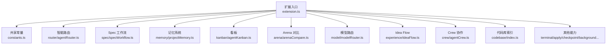

**图表来源**
- [extension.ts:158-222](file://extensions/kodrix-agent-os/src/extension.ts#L158-L222)
- [constants.ts:39-167](file://extensions/kodrix-agent-os/src/shared/constants.ts#L39-L167)

**章节来源**
- [package.json:23-537](file://extensions/kodrix-agent-os/package.json#L23-L537)
- [extension.ts:158-222](file://extensions/kodrix-agent-os/src/extension.ts#L158-L222)

## 核心组件
- 智能路由：根据上下文与任务类型自动选择 Spec/Plan/Agent/Ask，支持高置信度自动执行。
- Spec 驱动：从需求到设计再到任务分解，提供三栏工作台与实施模式。
- Memory 记忆：跨会话存储与检索项目知识，支持语义索引与主动提示。
- Kanban 看板：可视化任务状态流转，关联 Agent 会话。
- Arena 双模型：并行调用两个模型进行对比评估。
- 模型路由：按 smart/balanced/fast 档位自动选择模型。
- Idea Flow：从一句话到可运行应用的端到端流水线。
- Crew 协作：多 Agent 编排与并行执行，支持 DAG 可视化。
- 代码库索引：AST 级符号/依赖/调用图分析，自然语言问答与预测补全。

**章节来源**
- [extension.ts:158-222](file://extensions/kodrix-agent-os/src/extension.ts#L158-L222)
- [constants.ts:210-279](file://extensions/kodrix-agent-os/src/shared/constants.ts#L210-L279)

## 架构总览
Kodrix Agent OS 采用“命令驱动 + 模块化装配”的架构。扩展激活时注册命令、视图、设置渲染器与事件监听；各子系统通过独立的 registerXxx 函数完成自身初始化；共享常量统一管理配置键与命令 ID，降低耦合。

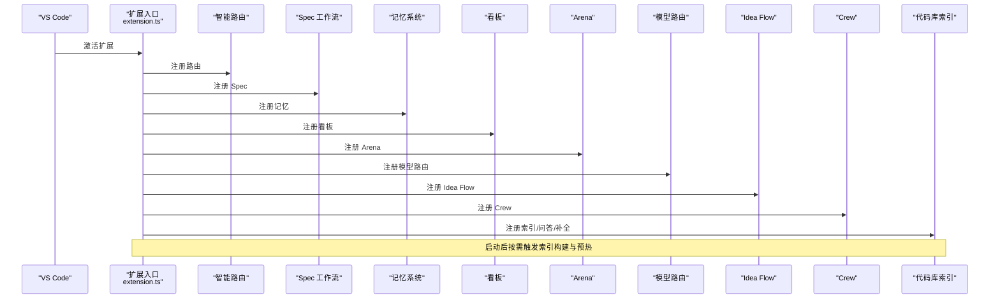

**图表来源**
- [extension.ts:158-222](file://extensions/kodrix-agent-os/src/extension.ts#L158-L222)

**章节来源**
- [extension.ts:158-222](file://extensions/kodrix-agent-os/src/extension.ts#L158-L222)

## 详细组件分析

### 智能路由机制
- 目标：将用户意图或当前上下文自动路由到最合适的模式（Spec/Plan/Agent/Ask），并在高置信度时自动执行。
- 关键行为：
  - 注册路由命令与快捷键，读取上次路由结果用于重复执行。
  - 结合配置开关 kodrix.features.agentRouter 与 kodrix.router.autoExecute 控制行为。
  - 与模型路由联动，为不同模式选择合适的模型档位。

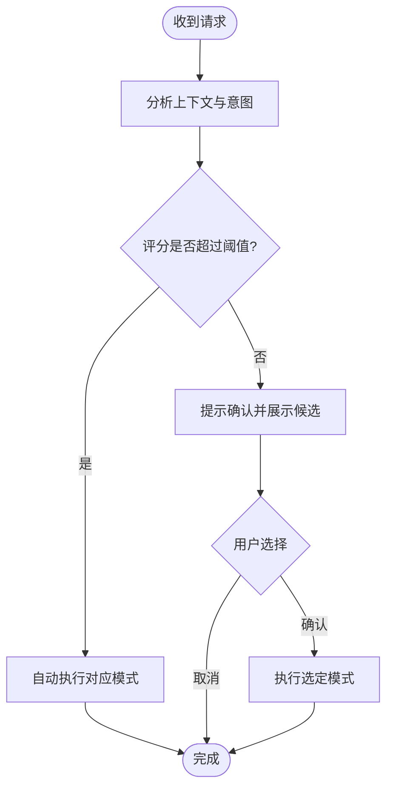

**图表来源**
- [package.json:150-153](file://extensions/kodrix-agent-os/package.json#L150-L153)
- [package.json:468-471](file://extensions/kodrix-agent-os/package.json#L468-L471)
- [package.json:677-681](file://extensions/kodrix-agent-os/package.json#L677-L681)

**章节来源**
- [package.json:150-153](file://extensions/kodrix-agent-os/package.json#L150-L153)
- [package.json:468-471](file://extensions/kodrix-agent-os/package.json#L468-L471)
- [package.json:677-681](file://extensions/kodrix-agent-os/package.json#L677-L681)

### Spec 驱动开发流程
- 目标：从需求分析到设计再到任务分解，最终进入 Agent 实施。
- 关键行为：
  - 提供新建/打开/工作台/实施等命令，支持三栏式 Spec 编辑。
  - 与记忆系统和知识库联动，生成高质量任务描述。
  - 可与 Crew 协作，将复杂 Spec 拆分为多 Agent 任务。

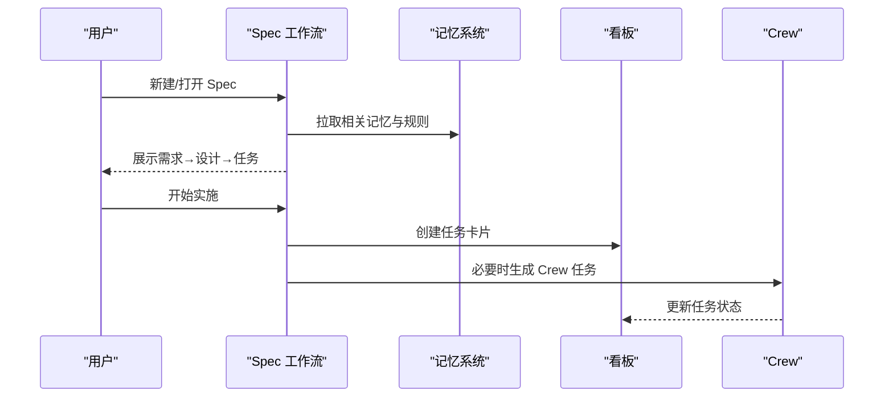

**图表来源**
- [package.json:90-108](file://extensions/kodrix-agent-os/package.json#L90-L108)
- [package.json:120-148](file://extensions/kodrix-agent-os/package.json#L120-L148)

**章节来源**
- [package.json:90-108](file://extensions/kodrix-agent-os/package.json#L90-L108)
- [package.json:120-148](file://extensions/kodrix-agent-os/package.json#L120-L148)

### Memory 记忆系统
- 目标：跨会话存储与检索项目知识，支持语义索引与主动提示。
- 关键行为：
  - 提供查看与捕获命令，支持会话结束时自动蒸馏。
  - 与学习引擎联动，沉淀最佳实践与决策依据。
  - 打开文件时可主动提示相关记忆，提升上下文质量。

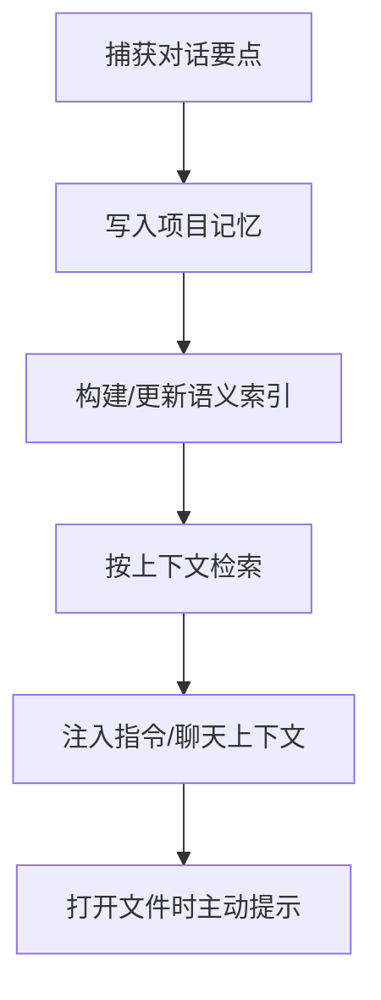

**图表来源**
- [package.json:110-118](file://extensions/kodrix-agent-os/package.json#L110-L118)
- [package.json:596-631](file://extensions/kodrix-agent-os/package.json#L596-L631)

**章节来源**
- [package.json:110-118](file://extensions/kodrix-agent-os/package.json#L110-L118)
- [package.json:596-631](file://extensions/kodrix-agent-os/package.json#L596-L631)

### Kanban 看板
- 目标：可视化项目管理，跟踪 Agent 任务状态与关联会话。
- 关键行为：
  - 添加/移动/删除任务，刷新与聚焦视图。
  - 与 Spec/Crew 集成，任务状态随执行推进而更新。
  - 支持显示已完成任务，便于复盘。

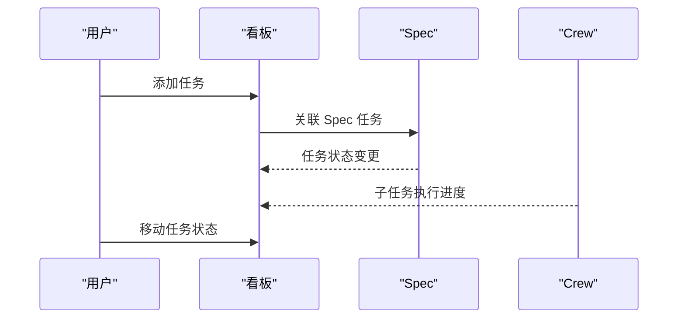

**图表来源**
- [package.json:69-77](file://extensions/kodrix-agent-os/package.json#L69-L77)
- [package.json:120-148](file://extensions/kodrix-agent-os/package.json#L120-L148)

**章节来源**
- [package.json:69-77](file://extensions/kodrix-agent-os/package.json#L69-L77)
- [package.json:120-148](file://extensions/kodrix-agent-os/package.json#L120-L148)

### Arena 双模型对比
- 目标：同时调用两个模型，对比输出质量，辅助选型与评测。
- 关键行为：
  - 提供对比命令，支持配置模型 A/B。
  - 与模型路由配合，可在不同档位下对比。

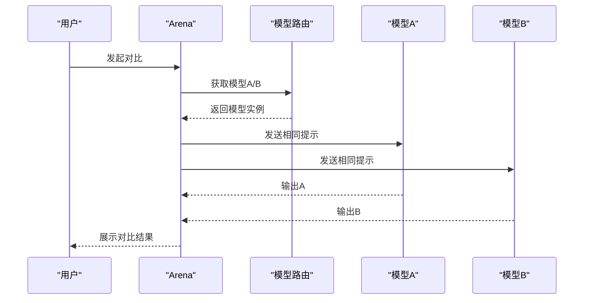

**图表来源**
- [package.json:155-158](file://extensions/kodrix-agent-os/package.json#L155-L158)
- [package.json:632-641](file://extensions/kodrix-agent-os/package.json#L632-L641)

**章节来源**
- [package.json:155-158](file://extensions/kodrix-agent-os/package.json#L155-L158)
- [package.json:632-641](file://extensions/kodrix-agent-os/package.json#L632-L641)

### 多模型选择与切换策略（Model Router）
- 目标：按任务类型自动选择 smart/balanced/fast 档位的模型，兼顾质量与速度。
- 关键行为：
  - 提供状态查询命令，查看模型池与使用统计。
  - 与 Arena、Idea Flow、Agent Loop 等模块联动，在不同场景选用合适模型。

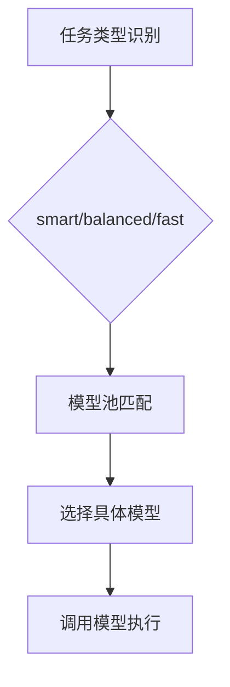

**图表来源**
- [package.json:350-353](file://extensions/kodrix-agent-os/package.json#L350-L353)
- [constants.ts:459-477](file://extensions/kodrix-agent-os/src/shared/constants.ts#L459-L477)

**章节来源**
- [package.json:350-353](file://extensions/kodrix-agent-os/package.json#L350-L353)
- [constants.ts:459-477](file://extensions/kodrix-agent-os/src/shared/constants.ts#L459-L477)

### Idea Flow 开发示例
- 目标：从一句话想法到可运行应用的全自动流水线。
- 关键行为：
  - 启动 Idea Flow，AI 自动分析、规划、构建与预览。
  - 支持 Canvas 可视化输入与语音输入。
  - 可配置自动执行，端到端无需人工干预。

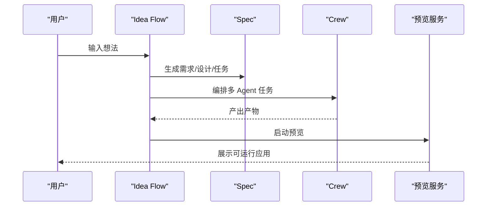

**图表来源**
- [package.json:270-288](file://extensions/kodrix-agent-os/package.json#L270-L288)
- [constants.ts:210-239](file://extensions/kodrix-agent-os/src/shared/constants.ts#L210-L239)

**章节来源**
- [package.json:270-288](file://extensions/kodrix-agent-os/package.json#L270-L288)
- [constants.ts:210-239](file://extensions/kodrix-agent-os/src/shared/constants.ts#L210-L239)

### Crew 协作示例
- 目标：多 Agent 协作编排，支持并行执行与依赖图可视化。
- 关键行为：
  - 创建 Crew、添加任务、执行下一个/全部、标记完成。
  - 支持最大并发与超时配置，避免资源爆炸。
  - 提供 DAG 可视化，便于理解任务依赖。

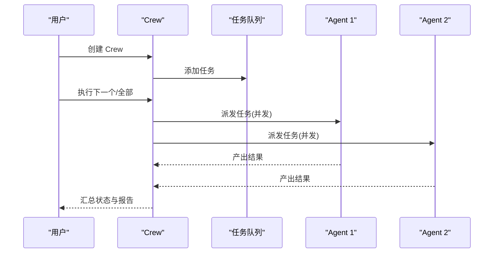

**图表来源**
- [package.json:230-258](file://extensions/kodrix-agent-os/package.json#L230-L258)
- [package.json:375-378](file://extensions/kodrix-agent-os/package.json#L375-L378)
- [constants.ts:259-279](file://extensions/kodrix-agent-os/src/shared/constants.ts#L259-L279)

**章节来源**
- [package.json:230-258](file://extensions/kodrix-agent-os/package.json#L230-L258)
- [package.json:375-378](file://extensions/kodrix-agent-os/package.json#L375-L378)
- [constants.ts:259-279](file://extensions/kodrix-agent-os/src/shared/constants.ts#L259-L279)

### 代码库索引与问答
- 目标：全工程 AST 级符号/依赖/调用图分析，支持自然语言问答与预测补全。
- 关键行为：
  - 启动时异步构建索引，支持手动重建与统计查看。
  - 提供 @codebase 自然语言查询定义/引用/架构。
  - 与 Tab 补全联动，基于上下文预测下一步编辑。

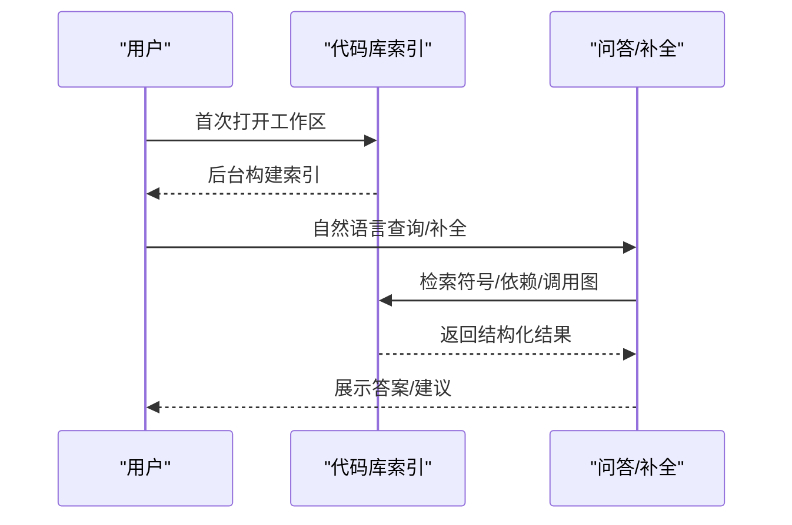

**图表来源**
- [package.json:300-318](file://extensions/kodrix-agent-os/package.json#L300-L318)
- [extension.ts:214-238](file://extensions/kodrix-agent-os/src/extension.ts#L214-L238)

**章节来源**
- [package.json:300-318](file://extensions/kodrix-agent-os/package.json#L300-L318)
- [extension.ts:214-238](file://extensions/kodrix-agent-os/src/extension.ts#L214-L238)

## 依赖关系分析
- 低耦合装配：extension.ts 仅负责注册与生命周期管理，各子系统通过独立模块实现。
- 常量集中：constants.ts 统一管理配置段、命令 ID、默认值与超时，减少硬编码。
- 外部依赖最小化：语义检索可选启用 Embedding，默认使用零依赖 TF-IDF 方案。
- 命令与视图解耦：package.json 声明命令与视图，实际逻辑在各模块中实现。

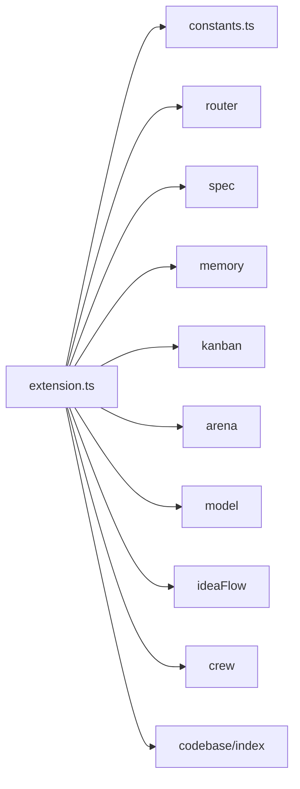

**图表来源**
- [extension.ts:158-222](file://extensions/kodrix-agent-os/src/extension.ts#L158-L222)
- [constants.ts:39-167](file://extensions/kodrix-agent-os/src/shared/constants.ts#L39-L167)

**章节来源**
- [extension.ts:158-222](file://extensions/kodrix-agent-os/src/extension.ts#L158-L222)
- [constants.ts:39-167](file://extensions/kodrix-agent-os/src/shared/constants.ts#L39-L167)

## 性能考量
- 索引构建延迟：初始索引构建延迟启动，避免阻塞工作区打开。
- 并发与超时：Crew 并行执行有最大并发与超时限制，防止资源耗尽。
- 上下文裁剪：Instructions 与结果回填有字符上限，避免上下文爆炸。
- 可选 Embedding：语义检索可关闭或切换供应商，平衡精度与成本。
- 自动回滚：Agent 运行前可自动创建检查点，失败快速恢复。

[本节为通用指导，不直接分析具体文件]

## 故障排查指南
- 扩展激活失败：扩展入口包含错误边界，会弹出错误信息并记录日志。
- 索引构建失败：提供手动重建命令与统计查看，便于定位问题。
- 路由未生效：检查功能开关与快捷键绑定，确认 autoExecute 配置。
- Arena 无输出：确认模型 A/B 已正确配置且可用。
- Crew 卡住：检查并发与超时配置，查看任务日志与 DAG。

**章节来源**
- [extension.ts:158-168](file://extensions/kodrix-agent-os/src/extension.ts#L158-L168)
- [extension.ts:241-259](file://extensions/kodrix-agent-os/src/extension.ts#L241-L259)
- [package.json:677-681](file://extensions/kodrix-agent-os/package.json#L677-L681)
- [package.json:632-641](file://extensions/kodrix-agent-os/package.json#L632-L641)
- [constants.ts:259-279](file://extensions/kodrix-agent-os/src/shared/constants.ts#L259-L279)

## 结论
Kodrix Agent OS 通过智能路由、Spec 驱动、记忆沉淀、看板可视化、Arena 对比与模型路由，构建了从想法到产品、从单点到多 Agent 协作的完整开发闭环。其本地优先、零依赖默认、可扩展的配置体系，使其既适合个人开发者高效迭代，也适合团队协作与规模化交付。

[本节为总结性内容，不直接分析具体文件]

## 附录：配置与API速查
- 功能开关（kodrix.features.*）：wiki、spec、memory、kanban、agentRouter、arena、hooks、propertyTests、learning、contextInjection、sessionLearning、vibeCoding、ideaFlow、codebaseIntelligence、terminalAI 等。
- 体验配置（kodrix.experience.*）：autoBootstrap、showBootstrapTip。
- Arena 配置（kodrix.arena.*）：modelA、modelB。
- 路由配置（kodrix.router.*）：lastRoute、autoExecute。
- Crew 配置（kodrix.crew.*）：maxParallel、timeoutMs。
- 索引与文档：semanticEmbedding.enabled/apiKey/endpoint/model。
- 终端 AI：Cmd+K 生成命令、Cmd+Enter 运行。
- 检查点：自动捕获与回滚。
- 模型路由：enabled 与档位选择。
- 用户画像：全局偏好记忆。
- 后台 Agent：派发与列表。
- 可视化编排：DAG 视图。
- 推理循环：maxIterations、timeoutMs、allowCommands、checkpoint。
- Tab 补全：mode、fimProvider、fimEndpoint、fimApiKey、fimModel。

**章节来源**
- [package.json:538-850](file://extensions/kodrix-agent-os/package.json#L538-L850)
- [constants.ts:39-167](file://extensions/kodrix-agent-os/src/shared/constants.ts#L39-L167)