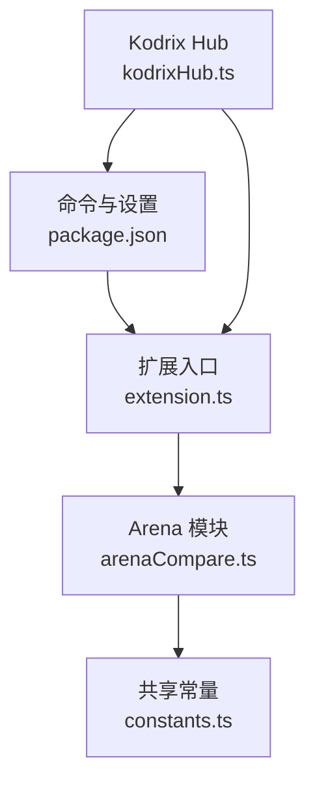
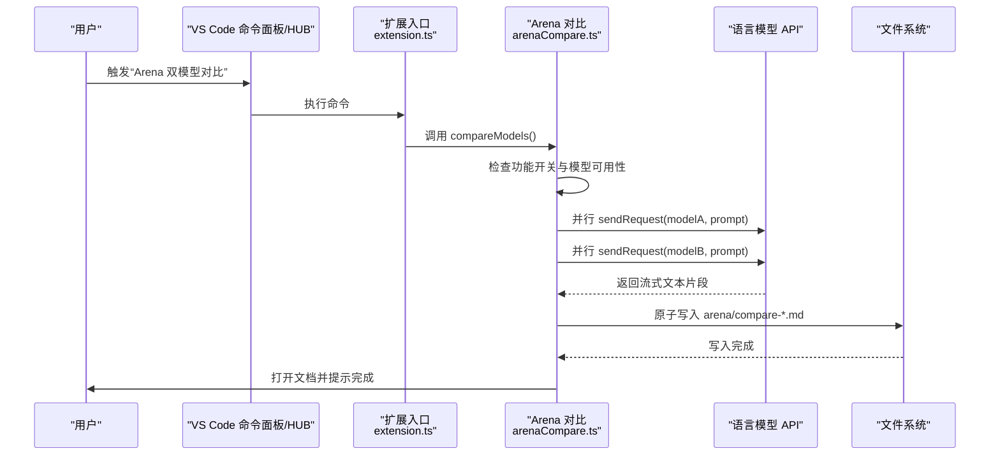
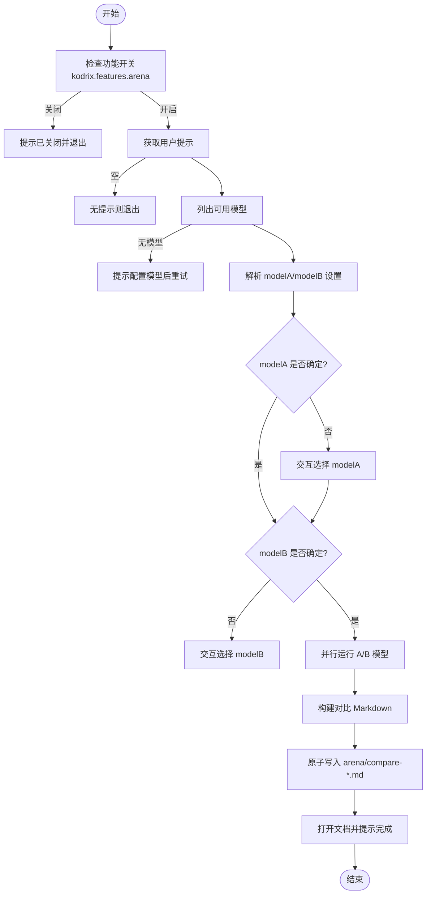
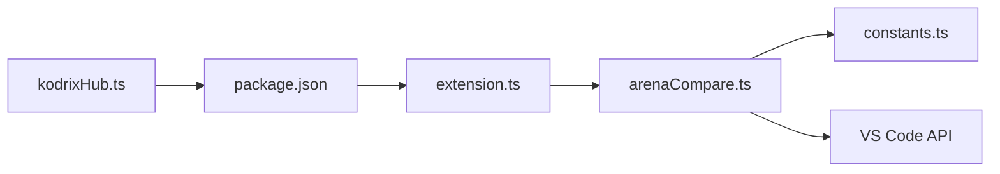

# Arena 双模型对比

<cite>
**本文引用的文件**   
- [arenaCompare.ts](file://extensions/kodrix-agent-os/src/arena/arenaCompare.ts)
- [constants.ts](file://extensions/kodrix-agent-os/src/shared/constants.ts)
- [extension.ts](file://extensions/kodrix-agent-os/src/extension.ts)
- [package.json](file://extensions/kodrix-agent-os/package.json)
- [kodrixHub.ts](file://extensions/kodrix-agent-os/src/experience/kodrixHub.ts)
</cite>

## 目录
1. [简介](#简介)
2. [项目结构](#项目结构)
3. [核心组件](#核心组件)
4. [架构总览](#架构总览)
5. [详细组件分析](#详细组件分析)
6. [依赖关系分析](#依赖关系分析)
7. [性能与可靠性](#性能与可靠性)
8. [使用示例与最佳实践](#使用示例与最佳实践)
9. [与智能路由的集成](#与智能路由的集成)
10. [故障排查](#故障排查)
11. [结论](#结论)

## 简介
Arena 双模型对比是 Kodrix Agent OS 扩展提供的一项“Windsurf 风格”能力：对同一提示词，并行调用两个语言模型，生成两份输出，并以 Markdown 文档形式呈现，便于人工审阅、合并或选择更优结果。该功能通过 VS Code Language Model API 实现模型调用，结合工作区元数据目录进行结果持久化，并通过命令面板、设置项和 Hub 仪表盘统一暴露入口。

## 项目结构
Arena 相关代码位于扩展 kodrix-agent-os 中，核心文件如下：
- 对比逻辑：extensions/kodrix-agent-os/src/arena/arenaCompare.ts
- 共享常量（配置键、命令 ID）：extensions/kodrix-agent-os/src/shared/constants.ts
- 扩展激活与注册：extensions/kodrix-agent-os/src/extension.ts
- 命令与设置声明：extensions/kodrix-agent-os/package.json
- Hub 仪表盘快捷入口：extensions/kodrix-agent-os/src/experience/kodrixHub.ts

图表来源
- [extension.ts:158-212](file://extensions/kodrix-agent-os/src/extension.ts#L158-L212)
- [arenaCompare.ts:151-155](file://extensions/kodrix-agent-os/src/arena/arenaCompare.ts#L151-L155)
- [constants.ts:39-69](file://extensions/kodrix-agent-os/src/shared/constants.ts#L39-L69)
- [package.json:150-158](file://extensions/kodrix-agent-os/package.json#L150-L158)
- [kodrixHub.ts:138-160](file://extensions/kodrix-agent-os/src/experience/kodrixHub.ts#L138-L160)

章节来源
- [extension.ts:158-212](file://extensions/kodrix-agent-os/src/extension.ts#L158-L212)
- [package.json:150-158](file://extensions/kodrix-agent-os/package.json#L150-L158)

## 核心组件
- Arena 对比执行器：负责读取用户提示、选择模型、并行推理、生成并保存对比报告、打开文档。
- 共享常量：集中管理配置段、特性开关、Arena 配置键与命令 ID，避免魔术字符串。
- 扩展注册：在扩展激活时注册 Arena 命令，使其可通过命令面板与快捷键触发。
- Hub 仪表盘：提供一键跳转至 Arena 对比的快捷入口。

章节来源
- [arenaCompare.ts:23-47](file://extensions/kodrix-agent-os/src/arena/arenaCompare.ts#L23-L47)
- [arenaCompare.ts:49-149](file://extensions/kodrix-agent-os/src/arena/arenaCompare.ts#L49-L149)
- [constants.ts:39-69](file://extensions/kodrix-agent-os/src/shared/constants.ts#L39-L69)
- [extension.ts:170-183](file://extensions/kodrix-agent-os/src/extension.ts#L170-L183)
- [kodrixHub.ts:138-160](file://extensions/kodrix-agent-os/src/experience/kodrixHub.ts#L138-L160)

## 架构总览
Arena 的整体流程包括：
- 入口：命令面板或 Hub 仪表盘触发。
- 前置校验：检查功能开关是否启用；若无可用模型则提示配置。
- 模型选择：优先从设置中匹配 modelA/modelB，否则交互式选择。
- 并行推理：对两个模型同时发起请求，流式聚合文本。
- 结果输出：原子写入 Markdown 到 .kodrix/arena，并打开文档供人工审阅。
- 可选后续：可结合智能路由将最优结果继续派发到 Spec/Agent/Ask 等下游流程。

图表来源
- [extension.ts:170-183](file://extensions/kodrix-agent-os/src/extension.ts#L170-L183)
- [arenaCompare.ts:49-149](file://extensions/kodrix-agent-os/src/arena/arenaCompare.ts#L49-L149)

## 详细组件分析

### Arena 对比执行器（arenaCompare.ts）
- runModelPrompt：封装单次模型调用，使用 CancellationTokenSource 并在 finally 中释放资源，流式累积文本。
- compareModels：主流程函数，包含：
  - 功能开关检查（kodrix.features.arena）。
  - 获取用户提示（输入框或参数传入）。
  - 查询可用模型列表（vscode.lm.selectChatModels）。
  - 解析设置中的 modelA/modelB，未命中则交互式选择。
  - 使用 Promise.all 并行执行两个模型的推理。
  - 构建 Markdown 对比报告，原子写入 .kodrix/arena 目录，打开文档并提示完成。
- registerArena：注册命令 kodrix.arena.compare。

图表来源
- [arenaCompare.ts:23-47](file://extensions/kodrix-agent-os/src/arena/arenaCompare.ts#L23-L47)
- [arenaCompare.ts:49-149](file://extensions/kodrix-agent-os/src/arena/arenaCompare.ts#L49-L149)

章节来源
- [arenaCompare.ts:23-47](file://extensions/kodrix-agent-os/src/arena/arenaCompare.ts#L23-L47)
- [arenaCompare.ts:49-149](file://extensions/kodrix-agent-os/src/arena/arenaCompare.ts#L49-L149)
- [arenaCompare.ts:151-155](file://extensions/kodrix-agent-os/src/arena/arenaCompare.ts#L151-L155)

### 共享常量（constants.ts）
- CONFIG_FEATURES / FEATURE_FLAGS.arena：统一管理功能开关键。
- CONFIG_ARENA / ARENA_CONFIG.modelA/modelB：统一管理 Arena 配置键。
- COMMANDS.arenaCompare：统一管理命令 ID。

章节来源
- [constants.ts:39-69](file://extensions/kodrix-agent-os/src/shared/constants.ts#L39-L69)
- [constants.ts:71-94](file://extensions/kodrix-agent-os/src/shared/constants.ts#L71-L94)

### 扩展入口与注册（extension.ts）
- activateInternal 中调用 registerArena(context)，使命令生效。
- 其他模块一并注册，体现扩展模块化组织。

章节来源
- [extension.ts:170-183](file://extensions/kodrix-agent-os/src/extension.ts#L170-L183)

### 命令与设置（package.json）
- commands.kodrix.arena.compare：暴露“Arena 双模型对比”命令。
- configuration.kodrix.features.arena：功能开关。
- configuration.kodrix.arena.modelA/modelB：对比模型 A/B 的设置项。

章节来源
- [package.json:150-158](file://extensions/kodrix-agent-os/package.json#L150-L158)
- [package.json:576-580](file://extensions/kodrix-agent-os/package.json#L576-L580)
- [package.json:632-641](file://extensions/kodrix-agent-os/package.json#L632-L641)

### Hub 仪表盘集成（kodrixHub.ts）
- 在 Hub 动作映射中将 arena 指向 kodrix.arena.compare，提供一键跳转。
- 仪表盘特性列表中显示 Arena 对比开关状态。

章节来源
- [kodrixHub.ts:62-73](file://extensions/kodrix-agent-os/src/experience/kodrixHub.ts#L62-L73)
- [kodrixHub.ts:138-160](file://extensions/kodrix-agent-os/src/experience/kodrixHub.ts#L138-L160)

## 依赖关系分析
- arenaCompare.ts 依赖：
  - vscode.LanguageModelChat 接口用于模型调用。
  - vscode.workspace/configuration 读取功能开关与 Arena 配置。
  - vscode.window 提供输入框、进度条、消息提示与文档打开。
  - fs/path/os 用于创建目录、原子写入与路径拼接。
  - shared/constants.ts 提供配置键与命令 ID。
- extension.ts 依赖：
  - 调用 registerArena 完成命令注册。
- package.json 依赖：
  - 声明命令与设置，供 VS Code 平台识别。

图表来源
- [arenaCompare.ts:10-21](file://extensions/kodrix-agent-os/src/arena/arenaCompare.ts#L10-L21)
- [extension.ts:170-183](file://extensions/kodrix-agent-os/src/extension.ts#L170-L183)
- [package.json:150-158](file://extensions/kodrix-agent-os/package.json#L150-L158)
- [kodrixHub.ts:138-160](file://extensions/kodrix-agent-os/src/experience/kodrixHub.ts#L138-L160)

章节来源
- [arenaCompare.ts:10-21](file://extensions/kodrix-agent-os/src/arena/arenaCompare.ts#L10-L21)
- [extension.ts:170-183](file://extensions/kodrix-agent-os/src/extension.ts#L170-L183)
- [package.json:150-158](file://extensions/kodrix-agent-os/package.json#L150-L158)
- [kodrixHub.ts:138-160](file://extensions/kodrix-agent-os/src/experience/kodrixHub.ts#L138-L160)

## 性能与可靠性
- 并行推理：使用 Promise.all 同时调用两个模型，缩短整体等待时间。
- 流式聚合：迭代响应流，累积文本，减少内存峰值。
- 资源管理：CancellationTokenSource 在 finally 中释放，防止泄漏。
- 原子写入：先写临时文件再 rename，避免进程崩溃导致部分文件。
- 进度反馈：使用 ProgressLocation.Notification 展示“对比中…”。

章节来源
- [arenaCompare.ts:23-47](file://extensions/kodrix-agent-os/src/arena/arenaCompare.ts#L23-L47)
- [arenaCompare.ts:102-149](file://extensions/kodrix-agent-os/src/arena/arenaCompare.ts#L102-L149)

## 使用示例与最佳实践

### 基本用法
- 通过命令面板执行“Kodrix: Arena 双模型对比”，或在 Hub 仪表盘点击“Arena 对比”。
- 输入同一提示词，系统将并行调用两个模型并生成对比文档。
- 在生成的 Markdown 中勾选“你的选择”，决定采用 A、B 或合并方案。

章节来源
- [package.json:150-158](file://extensions/kodrix-agent-os/package.json#L150-L158)
- [kodrixHub.ts:138-160](file://extensions/kodrix-agent-os/src/experience/kodrixHub.ts#L138-L160)
- [arenaCompare.ts:57-63](file://extensions/kodrix-agent-os/src/arena/arenaCompare.ts#L57-L63)
- [arenaCompare.ts:116-149](file://extensions/kodrix-agent-os/src/arena/arenaCompare.ts#L116-L149)

### 配置对比模型对
- 在设置中填写 kodrix.arena.modelA 与 kodrix.arena.modelB，留空表示按默认策略选择。
- 若未命中设置，系统会弹出快速选择框让你挑选 A/B 模型。

章节来源
- [package.json:632-641](file://extensions/kodrix-agent-os/package.json#L632-L641)
- [arenaCompare.ts:71-95](file://extensions/kodrix-agent-os/src/arena/arenaCompare.ts#L71-L95)

### 提示词优化建议
- 明确任务目标与约束条件，减少歧义。
- 指定输出格式（如 JSON、Markdown 表格），便于后续标准化处理。
- 对于复杂任务，分步提示（先规划后实现），提高稳定性。

[本节为通用指导，不直接分析具体文件]

### 输出格式标准化
- 当前 Arena 以 Markdown 文档输出，便于人类审阅与合并。
- 如需机器可读，可在提示词中要求结构化输出（例如 JSON），并在外部脚本中进行二次解析。

章节来源
- [arenaCompare.ts:116-149](file://extensions/kodrix-agent-os/src/arena/arenaCompare.ts#L116-L149)

### A/B 测试与质量评估
- 使用相同提示词对比不同模型，观察内容准确性、完整性与表达清晰度。
- 在“你的选择”区域记录偏好，积累个人/团队偏好数据。
- 可结合智能路由将优选结果继续派发到下游任务（Spec/Agent/Ask）。

章节来源
- [arenaCompare.ts:116-149](file://extensions/kodrix-agent-os/src/arena/arenaCompare.ts#L116-L149)

## 与智能路由的集成
- Hub 仪表盘支持一键跳转到 Arena 对比，便于在自动化流程中快速切换。
- 可将 Arena 作为模型选型阶段：先用 Arena 对比选出更优模型，再通过智能路由进入 Spec/Plan/Agent/Ask 等下游流程。
- 注意：当前 Arena 本身不进行相似度计算或自动评分，选择仍由人工完成；但可与外部评测脚本结合，形成半自动流水线。

章节来源
- [kodrixHub.ts:138-160](file://extensions/kodrix-agent-os/src/experience/kodrixHub.ts#L138-L160)
- [arenaCompare.ts:116-149](file://extensions/kodrix-agent-os/src/arena/arenaCompare.ts#L116-L149)

## 故障排查
- 功能未启用：若提示“已关闭”，请开启 kodrix.features.arena。
- 无可用模型：请在“Manage Models”中配置至少一个语言模型。
- 模型选择失败：确保 modelA/modelB 设置值能匹配到实际模型名称或 ID；否则使用交互选择。
- 写入失败：检查工作区 .kodrix/arena 目录权限；确认磁盘空间充足。
- 文档未打开：检查 VS Code 默认 Markdown 预览是否正常。

章节来源
- [arenaCompare.ts:50-69](file://extensions/kodrix-agent-os/src/arena/arenaCompare.ts#L50-L69)
- [arenaCompare.ts:110-149](file://extensions/kodrix-agent-os/src/arena/arenaCompare.ts#L110-L149)

## 结论
Arena 双模型对比以简洁可靠的工程化实现，提供了高效的双模型并行推理与结果对比能力。它通过统一的配置键与命令 ID 管理，结合 Hub 仪表盘与命令面板，为用户与自动化流程提供了一致的入口。虽然当前版本侧重人工审阅与选择，但通过与智能路由及外部评测脚本的结合，可以进一步构建半自动化的模型选型与质量评估流水线，帮助追求高质量输出的用户持续优化模型表现。