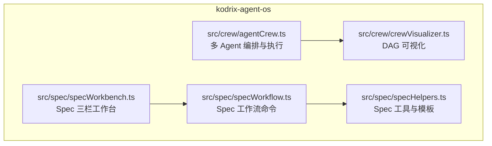
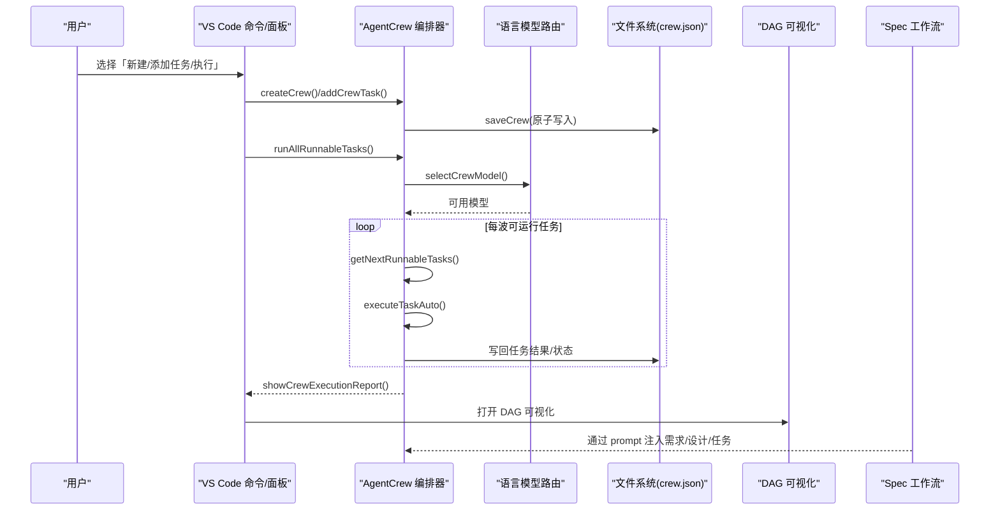
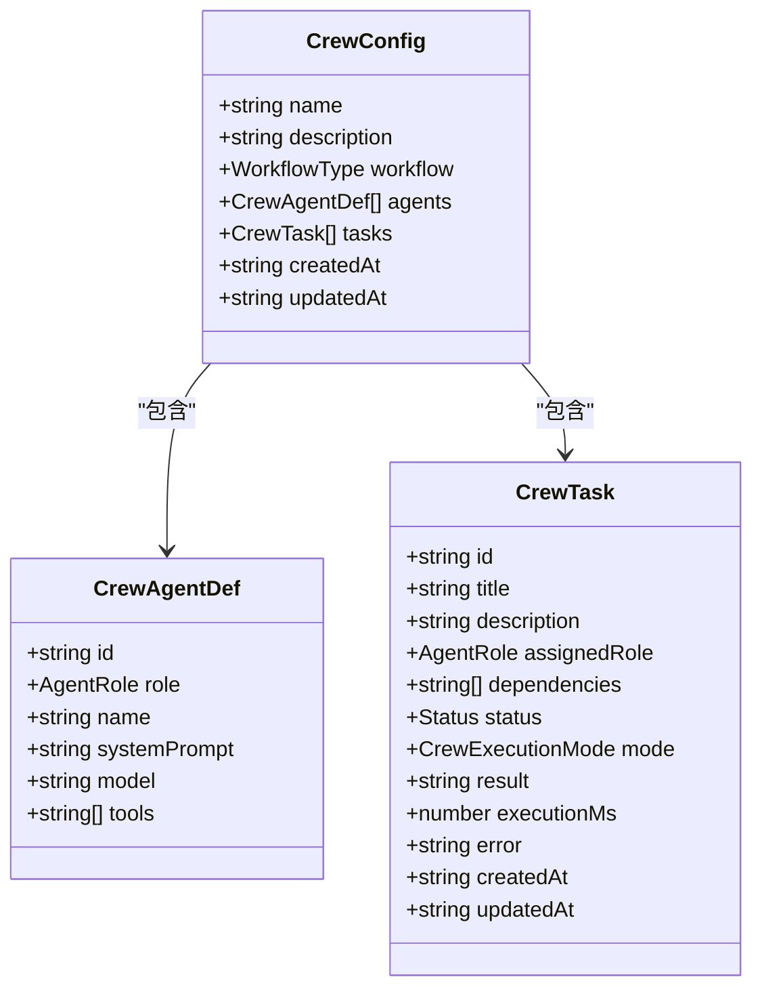
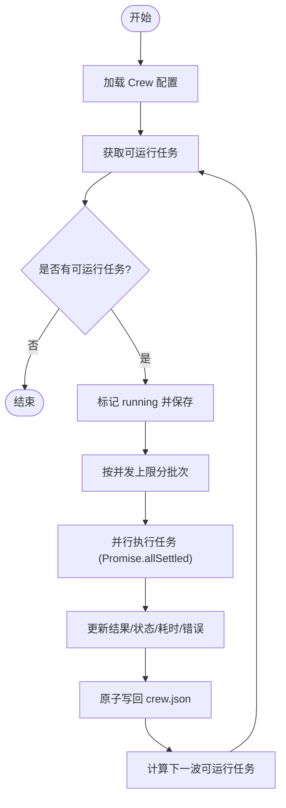
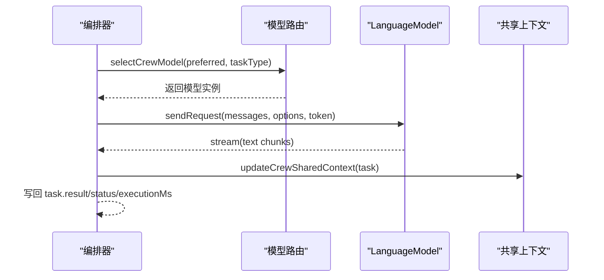
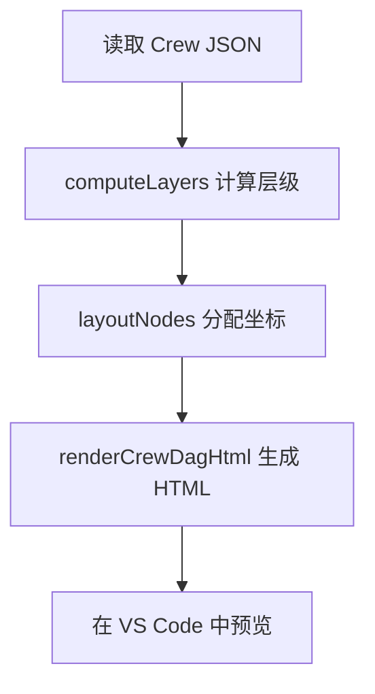
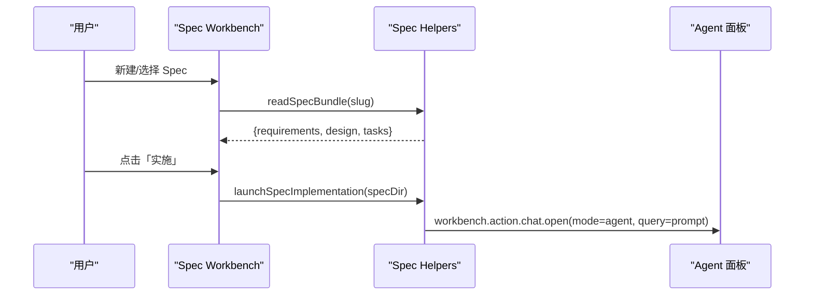
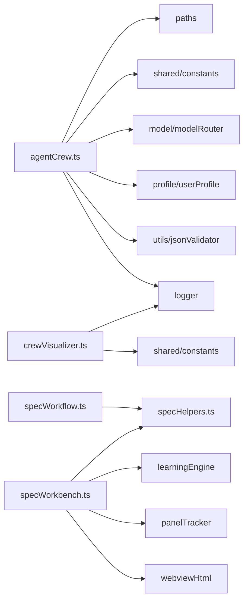

# Crew 协作

<cite>
**本文引用的文件**   
- [agentCrew.ts](file://extensions/kodrix-agent-os/src/crew/agentCrew.ts)
- [crewVisualizer.ts](file://extensions/kodrix-agent-os/src/crew/crewVisualizer.ts)
- [specWorkbench.ts](file://extensions/kodrix-agent-os/src/spec/specWorkbench.ts)
- [specWorkflow.ts](file://extensions/kodrix-agent-os/src/spec/specWorkflow.ts)
- [specHelpers.ts](file://extensions/kodrix-agent-os/src/spec/specHelpers.ts)
- [项目非常有必要新实现的核心功能总报告.md](file://docs/项目非常有必要新实现的核心功能总报告.md)
</cite>

## 目录
1. [引言](#引言)
2. [项目结构](#项目结构)
3. [核心组件](#核心组件)
4. [架构总览](#架构总览)
5. [详细组件分析](#详细组件分析)
6. [依赖关系分析](#依赖关系分析)
7. [性能与并发特性](#性能与并发特性)
8. [故障排查指南](#故障排查指南)
9. [结论](#结论)
10. [附录：使用示例与最佳实践](#附录使用示例与最佳实践)

## 引言
本文件系统性介绍 Kodrix Agent Crew 的多智能体协作机制，覆盖角色分配、任务编排、依赖管理、状态同步、可视化监控与调试，以及与 Spec 驱动工作流的集成。Crew 提供“顺序流水线 / 并行协作 / 审批门”三种工作流，支持自动后台并行执行与手动 Agent 面板执行两种模式，并通过共享上下文与执行报告提升跨 Agent 协作效率。同时提供 DAG 可视化能力，帮助团队监控执行进度、定位阻塞点与审查结果。

## 项目结构
Crew 协作相关代码位于扩展 kodrix-agent-os 的 src/crew 与 src/spec 两个子模块：
- crew：Agent 编排、任务调度、状态持久化、执行报告与可视化
- spec：Spec 三件套（requirements/design/tasks）创建、编辑工作台与实施入口

**图表来源**
- [agentCrew.ts:1-788](file://extensions/kodrix-agent-os/src/crew/agentCrew.ts#L1-L788)
- [crewVisualizer.ts:1-229](file://extensions/kodrix-agent-os/src/crew/crewVisualizer.ts#L1-L229)
- [specWorkbench.ts:1-199](file://extensions/kodrix-agent-os/src/spec/specWorkbench.ts#L1-L199)
- [specWorkflow.ts:1-88](file://extensions/kodrix-agent-os/src/spec/specWorkflow.ts#L1-L88)
- [specHelpers.ts:1-268](file://extensions/kodrix-agent-os/src/spec/specHelpers.ts#L1-L268)

**章节来源**
- [agentCrew.ts:1-788](file://extensions/kodrix-agent-os/src/crew/agentCrew.ts#L1-L788)
- [crewVisualizer.ts:1-229](file://extensions/kodrix-agent-os/src/crew/crewVisualizer.ts#L1-L229)
- [specWorkbench.ts:1-199](file://extensions/kodrix-agent-os/src/spec/specWorkbench.ts#L1-L199)
- [specWorkflow.ts:1-88](file://extensions/kodrix-agent-os/src/spec/specWorkflow.ts#L1-L88)
- [specHelpers.ts:1-268](file://extensions/kodrix-agent-os/src/spec/specHelpers.ts#L1-L268)

## 核心组件
- Agent 角色定义与预置模板：架构师、开发者、测试者、审查者、运维、自定义角色
- Crew 配置与任务模型：名称、描述、工作流类型、Agent 列表、任务 DAG、状态与元数据
- 任务编排引擎：可运行任务发现、波次并行执行、依赖解除与级联推进
- 执行模式：auto（后台并行 LLM 执行）与 chat（打开 Agent 面板带工具执行）
- 共享上下文：跨 Agent 的任务输出注入与团队共享摘要文件
- 可视化：DAG 拓扑分层布局、状态着色、离线 HTML 预览
- Spec 集成：从需求文档生成实施提示，驱动 Agent 按 Spec 执行

**章节来源**
- [agentCrew.ts:34-80](file://extensions/kodrix-agent-os/src/crew/agentCrew.ts#L34-L80)
- [agentCrew.ts:82-140](file://extensions/kodrix-agent-os/src/crew/agentCrew.ts#L82-L140)
- [agentCrew.ts:142-173](file://extensions/kodrix-agent-os/src/crew/agentCrew.ts#L142-L173)
- [agentCrew.ts:306-572](file://extensions/kodrix-agent-os/src/crew/agentCrew.ts#L306-L572)
- [crewVisualizer.ts:17-40](file://extensions/kodrix-agent-os/src/crew/crewVisualizer.ts#L17-L40)
- [crewVisualizer.ts:46-98](file://extensions/kodrix-agent-os/src/crew/crewVisualizer.ts#L46-L98)
- [specHelpers.ts:93-212](file://extensions/kodrix-agent-os/src/spec/specHelpers.ts#L93-L212)

## 架构总览
Crew 协作由“配置层（crew.json）— 编排层（调度器）— 执行层（LLM/Agent）— 可视化层（DAG）— 观测层（日志/报告）”构成。Spec 工作流通过 prompts 将需求与设计注入 Agent，形成“需求 → 设计 → 任务 → Crew 配置”的链路。

**图表来源**
- [agentCrew.ts:177-234](file://extensions/kodrix-agent-os/src/crew/agentCrew.ts#L177-L234)
- [agentCrew.ts:238-304](file://extensions/kodrix-agent-os/src/crew/agentCrew.ts#L238-L304)
- [agentCrew.ts:325-331](file://extensions/kodrix-agent-os/src/crew/agentCrew.ts#L325-L331)
- [agentCrew.ts:462-508](file://extensions/kodrix-agent-os/src/crew/agentCrew.ts#L462-L508)
- [agentCrew.ts:515-572](file://extensions/kodrix-agent-os/src/crew/agentCrew.ts#L515-L572)
- [crewVisualizer.ts:197-228](file://extensions/kodrix-agent-os/src/crew/crewVisualizer.ts#L197-L228)
- [specHelpers.ts:248-266](file://extensions/kodrix-agent-os/src/spec/specHelpers.ts#L248-L266)

## 详细组件分析

### 角色与任务模型
- 角色：architect/coder/reviewer/tester/devops/custom，每个角色有系统提示与允许工具集
- 任务：包含标题、描述、分配角色、依赖数组、状态、执行模式、结果、耗时、错误等
- 工作流：sequential（顺序）、parallel（并行）、review-gate（审批门）

**图表来源**
- [agentCrew.ts:34-80](file://extensions/kodrix-agent-os/src/crew/agentCrew.ts#L34-L80)
- [agentCrew.ts:82-140](file://extensions/kodrix-agent-os/src/crew/agentCrew.ts#L82-L140)

**章节来源**
- [agentCrew.ts:34-80](file://extensions/kodrix-agent-os/src/crew/agentCrew.ts#L34-L80)
- [agentCrew.ts:82-140](file://extensions/kodrix-agent-os/src/crew/agentCrew.ts#L82-L140)

### 任务编排与依赖管理
- 可运行任务判定：pending 且所有依赖 completed
- 波次并行：同波任务相互独立，按并发上限分批 Promise.allSettled
- 自动推进：完成后写回 crew.json，计算下一波可运行任务
- 依赖注入：上游任务结果拼接为下游任务的上下文片段

**图表来源**
- [agentCrew.ts:325-331](file://extensions/kodrix-agent-os/src/crew/agentCrew.ts#L325-L331)
- [agentCrew.ts:515-572](file://extensions/kodrix-agent-os/src/crew/agentCrew.ts#L515-L572)

**章节来源**
- [agentCrew.ts:306-331](file://extensions/kodrix-agent-os/src/crew/agentCrew.ts#L306-L331)
- [agentCrew.ts:515-572](file://extensions/kodrix-agent-os/src/crew/agentCrew.ts#L515-L572)

### 执行模式与通信协议
- auto 模式：后台调用 vscode.lm 并行驱动 LLM，流式读取响应，写入 task.result/status/executionMs/error
- chat 模式：打开 Agent 面板，携带任务上下文，用户手动完成并标记
- 模型路由：根据角色映射任务类型，优先任务/角色指定模型，否则按族选择
- 共享上下文：.kodrix/crew-context.md 追加任务摘要，供后续任务参考

**图表来源**
- [agentCrew.ts:403-421](file://extensions/kodrix-agent-os/src/crew/agentCrew.ts#L403-L421)
- [agentCrew.ts:462-508](file://extensions/kodrix-agent-os/src/crew/agentCrew.ts#L462-L508)
- [agentCrew.ts:430-456](file://extensions/kodrix-agent-os/src/crew/agentCrew.ts#L430-L456)

**章节来源**
- [agentCrew.ts:403-421](file://extensions/kodrix-agent-os/src/crew/agentCrew.ts#L403-L421)
- [agentCrew.ts:462-508](file://extensions/kodrix-agent-os/src/crew/agentCrew.ts#L462-L508)
- [agentCrew.ts:430-456](file://extensions/kodrix-agent-os/src/crew/agentCrew.ts#L430-L456)

### 状态同步与持久化
- 原子写入：先写临时文件再 rename，防止进程崩溃导致 crew.json 损坏
- 状态字段：pending/running/completed/failed/skipped，含时间戳与耗时
- 共享上下文：append 方式追加任务摘要，限制最大字符数避免无限增长

**章节来源**
- [agentCrew.ts:164-173](file://extensions/kodrix-agent-os/src/crew/agentCrew.ts#L164-L173)
- [agentCrew.ts:430-456](file://extensions/kodrix-agent-os/src/crew/agentCrew.ts#L430-L456)

### Crew Visualizer 可视化
- 拓扑分层：computeLayers 计算最长依赖深度，layoutNodes 分配行列坐标
- 渲染 HTML：内联 CSS/SVG，无外部依赖，离线可开
- 状态着色：completed/running/failed/blocked/pending 对应不同颜色
- 命令入口：选择 .kodrix/crews/*.json 文件进行可视化预览

**图表来源**
- [crewVisualizer.ts:46-98](file://extensions/kodrix-agent-os/src/crew/crewVisualizer.ts#L46-L98)
- [crewVisualizer.ts:104-182](file://extensions/kodrix-agent-os/src/crew/crewVisualizer.ts#L104-L182)
- [crewVisualizer.ts:184-228](file://extensions/kodrix-agent-os/src/crew/crewVisualizer.ts#L184-L228)

**章节来源**
- [crewVisualizer.ts:46-98](file://extensions/kodrix-agent-os/src/crew/crewVisualizer.ts#L46-L98)
- [crewVisualizer.ts:104-182](file://extensions/kodrix-agent-os/src/crew/crewVisualizer.ts#L104-L182)
- [crewVisualizer.ts:184-228](file://extensions/kodrix-agent-os/src/crew/crewVisualizer.ts#L184-L228)

### 与 Spec 驱动的集成
- Spec 三件套：requirements.md、design.md、tasks.md
- 工作流：创建 Spec → 打开三栏工作台 → 实施（launchSpecImplementation）
- 实施提示：将 requirements/design/tasks 内容拼接成 prompt，打开 Agent 面板执行
- 与 Crew 的关系：Spec 可作为上游任务产出，被注入到下游 Crew 任务上下文中

**图表来源**
- [specWorkbench.ts:86-135](file://extensions/kodrix-agent-os/src/spec/specWorkbench.ts#L86-L135)
- [specHelpers.ts:248-266](file://extensions/kodrix-agent-os/src/spec/specHelpers.ts#L248-L266)

**章节来源**
- [specWorkbench.ts:1-199](file://extensions/kodrix-agent-os/src/spec/specWorkbench.ts#L1-L199)
- [specWorkflow.ts:1-88](file://extensions/kodrix-agent-os/src/spec/specWorkflow.ts#L1-L88)
- [specHelpers.ts:93-266](file://extensions/kodrix-agent-os/src/spec/specHelpers.ts#L93-L266)

## 依赖关系分析
- agentCrew.ts 依赖：
  - 路径与常量：paths、shared/constants
  - 模型路由：model/modelRouter
  - 用户画像：profile/userProfile
  - JSON 校验：utils/jsonValidator
  - 日志：logger
- crewVisualizer.ts 依赖：
  - 日志：logger
  - 常量：shared/constants
- spec 模块依赖：
  - paths、learningEngine、panelTracker、webviewHtml
  - 内部互相引用（specWorkbench ↔ specHelpers；specWorkflow ↔ specHelpers）

**图表来源**
- [agentCrew.ts:17-33](file://extensions/kodrix-agent-os/src/crew/agentCrew.ts#L17-L33)
- [crewVisualizer.ts:11-15](file://extensions/kodrix-agent-os/src/crew/crewVisualizer.ts#L11-L15)
- [specWorkbench.ts:5-20](file://extensions/kodrix-agent-os/src/spec/specWorkbench.ts#L5-L20)
- [specWorkflow.ts:5-14](file://extensions/kodrix-agent-os/src/spec/specWorkflow.ts#L5-L14)

**章节来源**
- [agentCrew.ts:17-33](file://extensions/kodrix-agent-os/src/crew/agentCrew.ts#L17-L33)
- [crewVisualizer.ts:11-15](file://extensions/kodrix-agent-os/src/crew/crewVisualizer.ts#L11-L15)
- [specWorkbench.ts:5-20](file://extensions/kodrix-agent-os/src/spec/specWorkbench.ts#L5-L20)
- [specWorkflow.ts:5-14](file://extensions/kodrix-agent-os/src/spec/specWorkflow.ts#L5-L14)

## 性能与并发特性
- 真并行执行：runAllRunnableTasks 使用 Promise.allSettled 对同波任务并行执行，避免单任务失败阻塞整波
- 并发池控制：通过配置项 maxParallel 限制每批并行度
- 超时控制：单任务设置超时取消令牌，防止长时间占用资源
- 原子写入：crew.json 采用 tmp+rename 策略，降低崩溃风险
- 上下文截断：依赖输出与共享上下文均有限长，避免超大消息影响模型调用

优化建议：
- 合理设置 maxParallel，结合模型供应商限流与配额
- 对大工程拆分 Crew，减少单 Crew 任务规模
- 使用 review-gate 工作流，关键阶段引入人工审批，降低批量失败风险

**章节来源**
- [agentCrew.ts:515-572](file://extensions/kodrix-agent-os/src/crew/agentCrew.ts#L515-L572)
- [agentCrew.ts:476-478](file://extensions/kodrix-agent-os/src/crew/agentCrew.ts#L476-L478)
- [agentCrew.ts:164-173](file://extensions/kodrix-agent-os/src/crew/agentCrew.ts#L164-L173)
- [agentCrew.ts:349-398](file://extensions/kodrix-agent-os/src/crew/agentCrew.ts#L349-L398)

## 故障排查指南
常见问题与处理：
- 无可用语言模型：检查 Manage Models 是否配置 BYOK 模型；selectCrewModel 失败会记录警告
- 任务失败：查看任务 error 字段与执行报告中的错误摘要；必要时重试或调整 prompt
- 依赖未就绪：确认前置任务已完成；若存在 chat 模式任务，需手动完成后再推进
- 配置文件损坏：检查 crew.json 是否为完整 JSON；原子写入可降低损坏概率
- 共享上下文过大：注意 CREW_CONTEXT_MAX_CHARS 与 CREW_RESULT_MAX_CHARS 的限制

定位手段：
- 使用「Kodrix: 查看 Crew 状态」查看任务明细与进度
- 使用「Kodrix: 可视化 Agent 编排」查看 DAG 与依赖边
- 查看执行报告 Markdown 文档，了解各任务耗时与错误

**章节来源**
- [agentCrew.ts:403-410](file://extensions/kodrix-agent-os/src/crew/agentCrew.ts#L403-L410)
- [agentCrew.ts:574-618](file://extensions/kodrix-agent-os/src/crew/agentCrew.ts#L574-L618)
- [agentCrew.ts:711-765](file://extensions/kodrix-agent-os/src/crew/agentCrew.ts#L711-L765)
- [crewVisualizer.ts:197-228](file://extensions/kodrix-agent-os/src/crew/crewVisualizer.ts#L197-L228)

## 结论
Crew 协作以“角色明确、任务可编排、依赖可追踪、状态可同步、过程可观测”为核心目标，结合 Spec 驱动工作流，形成从需求到实现的闭环。其并行执行引擎与可视化能力显著提升了多 Agent 协作的效率与可控性。未来可在同文件冲突检测、语义 Wiki 增强等方面继续演进，进一步提升团队协作体验。

## 附录：使用示例与最佳实践

### 创建与管理 Agent Crew
- 新建 Crew：选择工作区 → 输入名称 → 选择工作流（顺序/并行/审批门）→ 选择参与角色 → 自动生成 agents 与初始配置
- 添加任务：输入标题与描述 → 分配角色 → 选择执行模式（auto/chat）→ 选择前置依赖 → 保存至 crew.json
- 执行任务：
  - 自动执行：「并行执行所有可执行任务」，按波次并行推进
  - 手动执行：「执行下一个 Crew 任务」，打开 Agent 面板完成任务后标记完成

**章节来源**
- [agentCrew.ts:177-234](file://extensions/kodrix-agent-os/src/crew/agentCrew.ts#L177-L234)
- [agentCrew.ts:238-304](file://extensions/kodrix-agent-os/src/crew/agentCrew.ts#L238-L304)
- [agentCrew.ts:622-707](file://extensions/kodrix-agent-os/src/crew/agentCrew.ts#L622-L707)

### 构建复杂项目团队
- 推荐角色组合：Architect（设计）+ Coder（实现）+ Reviewer（审查）+ Tester（测试）+ DevOps（部署）
- 工作流建议：
  - 简单功能：sequential（顺序流水线）
  - 多模块并行开发：parallel（并行协作），最后 Reviewer 统一审查
  - 高风险变更：review-gate（审批门），每阶段需批准

**章节来源**
- [agentCrew.ts:82-140](file://extensions/kodrix-agent-os/src/crew/agentCrew.ts#L82-L140)
- [agentCrew.ts:192-234](file://extensions/kodrix-agent-os/src/crew/agentCrew.ts#L192-L234)

### 处理并发任务与错误重试
- 并发控制：通过配置 maxParallel 限制并行度，避免模型限流
- 错误处理：单任务失败不阻塞同波其它任务；查看 error 字段与执行报告
- 重试策略：对失败任务重新评估 prompt 或调整依赖后再次执行

**章节来源**
- [agentCrew.ts:515-572](file://extensions/kodrix-agent-os/src/crew/agentCrew.ts#L515-L572)
- [agentCrew.ts:574-618](file://extensions/kodrix-agent-os/src/crew/agentCrew.ts#L574-L618)

### 与 Spec 驱动的集成
- 从需求文档自动生成 Crew 配置：
  - 使用 Spec 三件套（requirements/design/tasks）明确验收标准与实施计划
  - 通过 launchSpecImplementation 将 Spec 内容注入 Agent 面板，指导实施
  - 将 Spec 产出的设计/任务作为上游任务结果，注入下游 Crew 任务上下文

**章节来源**
- [specHelpers.ts:93-266](file://extensions/kodrix-agent-os/src/spec/specHelpers.ts#L93-L266)
- [specWorkflow.ts:16-56](file://extensions/kodrix-agent-os/src/spec/specWorkflow.ts#L16-L56)

### 监控与调试
- 状态视图：「查看 Crew 状态」展示进度、角色、任务明细与快捷命令
- DAG 可视化：「可视化 Agent 编排」选择 crews 文件，查看依赖边与状态着色
- 执行报告：自动打开 Markdown 报告，汇总完成/失败/待办与任务详情

**章节来源**
- [agentCrew.ts:711-765](file://extensions/kodrix-agent-os/src/crew/agentCrew.ts#L711-L765)
- [crewVisualizer.ts:197-228](file://extensions/kodrix-agent-os/src/crew/crewVisualizer.ts#L197-L228)
- [agentCrew.ts:574-618](file://extensions/kodrix-agent-os/src/crew/agentCrew.ts#L574-L618)

### 面向团队协作的最佳实践
- 明确角色边界：Architect 专注设计，Coder 专注实现，Reviewer 严格审查，Tester 覆盖边界，DevOps 负责部署
- 规范依赖声明：尽量细化任务粒度，显式声明依赖，便于并行与回溯
- 使用共享上下文：及时更新 .kodrix/crew-context.md，沉淀跨 Agent 的关键决策与成果摘要
- 引入审批门：对关键阶段设置 Reviewer 审批，降低批量失败风险
- 持续可视化：定期打开 DAG 可视化，识别阻塞点与瓶颈

**章节来源**
- [agentCrew.ts:82-140](file://extensions/kodrix-agent-os/src/crew/agentCrew.ts#L82-L140)
- [agentCrew.ts:430-456](file://extensions/kodrix-agent-os/src/crew/agentCrew.ts#L430-L456)
- [crewVisualizer.ts:104-182](file://extensions/kodrix-agent-os/src/crew/crewVisualizer.ts#L104-L182)

### 产品规划与差异化能力
- 已闭环能力：角色与工作流、并行执行引擎、跨 Agent 上下文传递、共享 Memory/Wiki/Spec、执行报告、DAG 可视化
- 必须新实现：并行 Coder 编辑同一文件时的冲突检测与合并策略（自动合并/标记冲突/通知用户）

**章节来源**
- [项目非常有必要新实现的核心功能总报告.md:64-72](file://docs/项目非常有必要新实现的核心功能总报告.md#L64-L72)