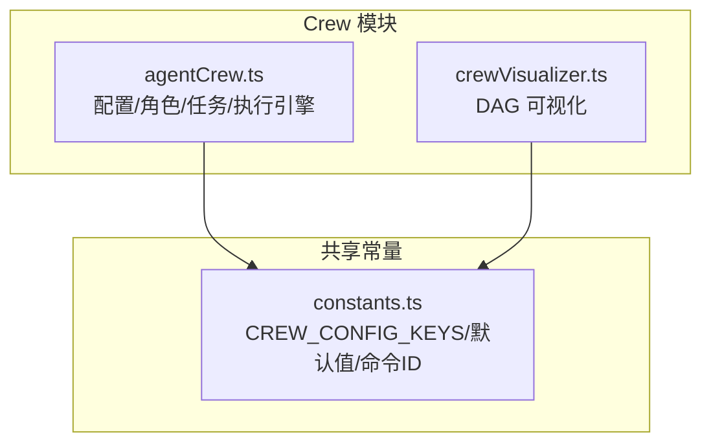
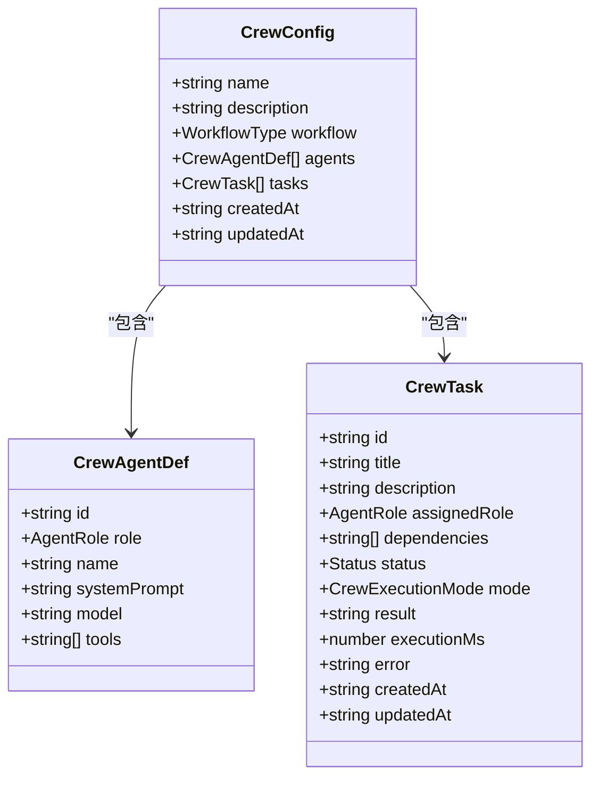
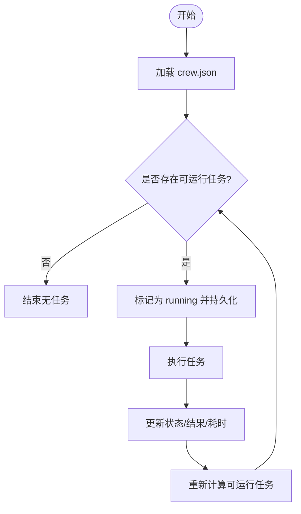
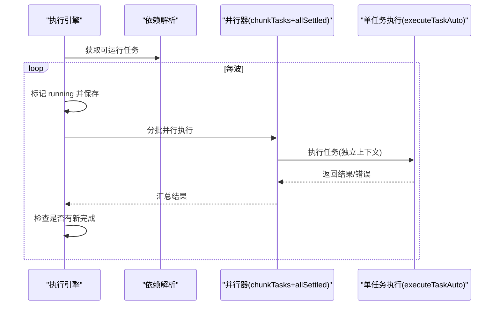
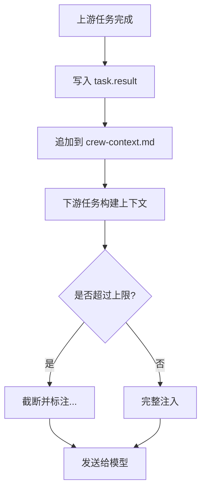
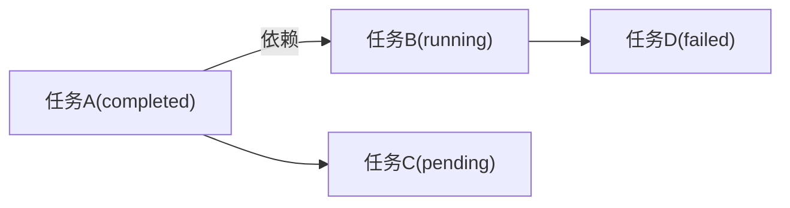
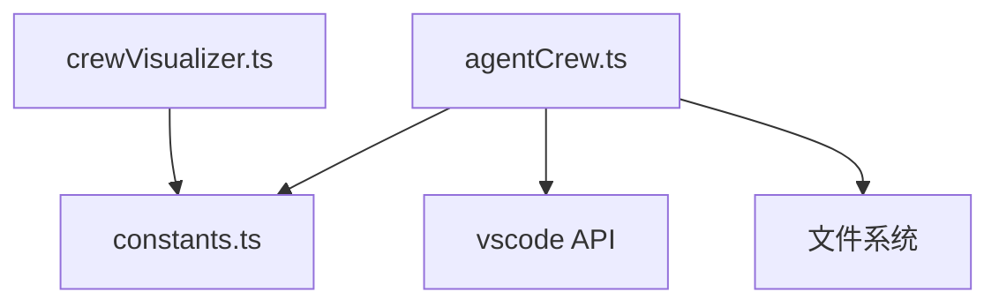

# Crew 架构设计

<cite>
**本文引用的文件**
- [agentCrew.ts](file://extensions/kodrix-agent-os/src/crew/agentCrew.ts)
- [crewVisualizer.ts](file://extensions/kodrix-agent-os/src/crew/crewVisualizer.ts)
- [constants.ts](file://extensions/kodrix-agent-os/src/shared/constants.ts)
</cite>

## 目录
1. [简介](#简介)
2. [项目结构](#项目结构)
3. [核心组件](#核心组件)
4. [架构总览](#架构总览)
5. [详细组件分析](#详细组件分析)
6. [依赖关系分析](#依赖关系分析)
7. [性能考量](#性能考量)
8. [故障排查指南](#故障排查指南)
9. [结论](#结论)
10. [附录：扩展与自定义 Agent 角色指南](#附录：扩展与自定义-agent-角色指南)

## 简介
本文件面向开发者，系统性阐述 Kodrix Agent OS 中的 Crew（多智能体协作编排）架构。内容涵盖：
- 核心组件职责：配置、角色、任务、执行引擎、可视化、共享上下文
- 数据流设计：任务依赖解析、并行执行、结果回写、下游注入
- 扩展机制：自定义 Agent 角色、执行模式、模型路由、DAG 可视化
- 并发控制：Promise.allSettled 的波次并行与 chunkTasks 分块
- 跨 Agent 上下文传递：共享上下文文件、依赖输出注入、上下文截断策略
- 架构图与数据流图：直观展示组件交互

## 项目结构
Crew 相关代码位于 extensions/kodrix-agent-os/src/crew 目录，配合 shared 常量模块提供统一配置与命令 ID。



图表来源
- [agentCrew.ts:1-80](file://extensions/kodrix-agent-os/src/crew/agentCrew.ts#L1-L80)
- [crewVisualizer.ts:1-30](file://extensions/kodrix-agent-os/src/crew/crewVisualizer.ts#L1-L30)
- [constants.ts:257-279](file://extensions/kodrix-agent-os/src/shared/constants.ts#L257-L279)

章节来源
- [agentCrew.ts:1-80](file://extensions/kodrix-agent-os/src/crew/agentCrew.ts#L1-L80)
- [crewVisualizer.ts:1-30](file://extensions/kodrix-agent-os/src/crew/crewVisualizer.ts#L1-L30)
- [constants.ts:257-279](file://extensions/kodrix-agent-os/src/shared/constants.ts#L257-L279)

## 核心组件
- CrewConfig：描述一个 Crew 的名称、工作流类型、Agent 角色集合、任务列表及时间戳。
- AgentRole：预置角色（architect/coder/reviewer/tester/devops/custom），每个角色包含系统提示词与可用工具集。
- CrewTask：任务元数据，包括标题、描述、分配角色、依赖数组、状态、执行模式、结果、耗时、错误等。
- 执行引擎：runAllRunnableTasks 负责“可运行波次”发现、标记 running、受限并发池并行执行、结果写回与级联推进。
- 上下文传递：buildTaskContext 将上游任务 result 注入下游 prompt；readCrewSharedContext/updateCrewSharedContext 维护 .kodrix/crew-context.md。
- 可视化：crewVisualizer 将任务依赖关系渲染为自包含 HTML/SVG DAG，支持拓扑分层布局与状态着色。

章节来源
- [agentCrew.ts:34-80](file://extensions/kodrix-agent-os/src/crew/agentCrew.ts#L34-L80)
- [agentCrew.ts:84-140](file://extensions/kodrix-agent-os/src/crew/agentCrew.ts#L84-L140)
- [agentCrew.ts:306-572](file://extensions/kodrix-agent-os/src/crew/agentCrew.ts#L306-L572)
- [agentCrew.ts:345-456](file://extensions/kodrix-agent-os/src/crew/agentCrew.ts#L345-L456)
- [crewVisualizer.ts:17-30](file://extensions/kodrix-agent-os/src/crew/crewVisualizer.ts#L17-L30)

## 架构总览
Crew 以“配置驱动 + DAG 调度 + 并行执行”为核心。用户通过命令创建 Crew、添加任务并设置依赖；执行时，引擎按依赖关系计算可运行波次，使用 Promise.allSettled 在每波内并行执行，并通过共享上下文与依赖输出实现跨 Agent 信息传递。

```mermaid
sequenceDiagram
participant U as "用户"
participant CMD as "命令注册"
participant ENG as "执行引擎(runAllRunnableTasks)"
participant DEP as "依赖解析(getNextRunnableTasks)"
participant PAR as "并行执行(chunkTasks+Promise.allSettled)"
participant LLM as "vscode.lm 模型"
participant FS as "文件系统(crew.json/共享上下文)"
U->>CMD : 触发“并行执行所有可执行任务”
CMD->>ENG : runAllRunnableTasks(crew)
loop 直到无可运行任务
ENG->>DEP : 获取可运行任务
alt 存在可运行任务
ENG->>FS : 标记 running 并持久化
ENG->>PAR : 分批并行执行
PAR->>LLM : 发送请求(带上下文)
LLM-->>PAR : 流式响应
PAR->>FS : 写入任务结果/状态/耗时
PAR-->>ENG : 返回结果
ENG->>FS : 更新共享上下文
ENG->>DEP : 重新计算下一波
else 无可运行任务
ENG-->>U : 提示无任务或仅 chat 模式待办
end
end
ENG-->>U : 显示执行报告
```

图表来源
- [agentCrew.ts:515-572](file://extensions/kodrix-agent-os/src/crew/agentCrew.ts#L515-L572)
- [agentCrew.ts:325-331](file://extensions/kodrix-agent-os/src/crew/agentCrew.ts#L325-L331)
- [agentCrew.ts:462-508](file://extensions/kodrix-agent-os/src/crew/agentCrew.ts#L462-L508)
- [agentCrew.ts:424-456](file://extensions/kodrix-agent-os/src/crew/agentCrew.ts#L424-L456)

## 详细组件分析

### 配置与角色：CrewConfig、AgentRole、CrewTask
- CrewConfig：name、description、workflow（sequential/parallel/review-gate）、agents、tasks、createdAt/updatedAt。
- AgentRole：内置角色定义含 systemPrompt 与 tools；custom 角色用于扩展。
- CrewTask：id/title/description/assignedRole/dependencies/status/mode/result/executionMs/error/createdAt/updatedAt。



图表来源
- [agentCrew.ts:34-80](file://extensions/kodrix-agent-os/src/crew/agentCrew.ts#L34-L80)

章节来源
- [agentCrew.ts:34-80](file://extensions/kodrix-agent-os/src/crew/agentCrew.ts#L34-L80)
- [agentCrew.ts:84-140](file://extensions/kodrix-agent-os/src/crew/agentCrew.ts#L84-L140)

### 任务管理与依赖解析
- getNextRunnableTasks：筛选 pending 且所有依赖 completed 的任务。
- addCrewTask：交互式创建任务，支持选择角色、执行模式与依赖。
- saveCrew/loadCrew：原子写入 crew.json（先写临时文件再 rename）。



图表来源
- [agentCrew.ts:325-331](file://extensions/kodrix-agent-os/src/crew/agentCrew.ts#L325-L331)
- [agentCrew.ts:238-304](file://extensions/kodrix-agent-os/src/crew/agentCrew.ts#L238-L304)
- [agentCrew.ts:149-173](file://extensions/kodrix-agent-os/src/crew/agentCrew.ts#L149-L173)

章节来源
- [agentCrew.ts:238-304](file://extensions/kodrix-agent-os/src/crew/agentCrew.ts#L238-L304)
- [agentCrew.ts:325-331](file://extensions/kodrix-agent-os/src/crew/agentCrew.ts#L325-L331)
- [agentCrew.ts:149-173](file://extensions/kodrix-agent-os/src/crew/agentCrew.ts#L149-L173)

### 并行执行引擎：Promise.allSettled 与 chunkTasks
- chunkTasks：将任务数组按 size 切分为多个子数组，便于限制并发。
- runAllRunnableTasks：循环取“可运行波次”，标记 running，分批调用 Promise.allSettled 并行执行，自动写回结果，若本波有新完成则继续下一波。
- executeTaskAuto：独立上下文、独立 LLM 请求，支持超时与取消，结果写入 task.result/status/executionMs/error，并更新共享上下文。



图表来源
- [agentCrew.ts:312-319](file://extensions/kodrix-agent-os/src/crew/agentCrew.ts#L312-L319)
- [agentCrew.ts:515-572](file://extensions/kodrix-agent-os/src/crew/agentCrew.ts#L515-L572)
- [agentCrew.ts:462-508](file://extensions/kodrix-agent-os/src/crew/agentCrew.ts#L462-L508)

章节来源
- [agentCrew.ts:312-319](file://extensions/kodrix-agent-os/src/crew/agentCrew.ts#L312-L319)
- [agentCrew.ts:515-572](file://extensions/kodrix-agent-os/src/crew/agentCrew.ts#L515-L572)
- [agentCrew.ts:462-508](file://extensions/kodrix-agent-os/src/crew/agentCrew.ts#L462-L508)

### 跨 Agent 上下文传递：依赖注入与共享上下文
- buildTaskContext：将上游任务的 result 按声明顺序拼接注入到 user 消息中，超过 CREW_CONTEXT_MAX_CHARS 进行截断。
- readCrewSharedContext/updateCrewSharedContext：读取/追加 .kodrix/crew-context.md，作为团队共享上下文，限制最大字符数防止膨胀。
- 执行模式：auto 后台并行；chat 打开 Agent 面板手动执行，完成后需手动标记完成。



图表来源
- [agentCrew.ts:345-398](file://extensions/kodrix-agent-os/src/crew/agentCrew.ts#L345-L398)
- [agentCrew.ts:424-456](file://extensions/kodrix-agent-os/src/crew/agentCrew.ts#L424-L456)
- [constants.ts:274-278](file://extensions/kodrix-agent-os/src/shared/constants.ts#L274-L278)

章节来源
- [agentCrew.ts:345-398](file://extensions/kodrix-agent-os/src/crew/agentCrew.ts#L345-L398)
- [agentCrew.ts:424-456](file://extensions/kodrix-agent-os/src/crew/agentCrew.ts#L424-L456)
- [constants.ts:274-278](file://extensions/kodrix-agent-os/src/shared/constants.ts#L274-L278)

### DAG 可视化：任务依赖拓扑与状态着色
- computeLayers：计算每个任务的最长依赖深度（拓扑层）。
- layoutNodes：按层分配行列坐标。
- renderCrewDagHtml：生成自包含 HTML/SVG，节点状态着色（completed/running/failed/blocked/pending），边表示依赖方向。



图表来源
- [crewVisualizer.ts:47-98](file://extensions/kodrix-agent-os/src/crew/crewVisualizer.ts#L47-L98)
- [crewVisualizer.ts:104-182](file://extensions/kodrix-agent-os/src/crew/crewVisualizer.ts#L104-L182)

章节来源
- [crewVisualizer.ts:47-98](file://extensions/kodrix-agent-os/src/crew/crewVisualizer.ts#L47-L98)
- [crewVisualizer.ts:104-182](file://extensions/kodrix-agent-os/src/crew/crewVisualizer.ts#L104-L182)

## 依赖关系分析
- agentCrew.ts 依赖 constants.ts 提供的 CREW_CONFIG_KEYS、默认并发与超时、上下文与结果大小限制。
- crewVisualizer.ts 依赖 constants.ts 的命令 ID 与工作区目录名。
- 执行流程中，agentCrew.ts 通过 vscode.lm 与模型通信，通过 fs 读写 crew.json 与共享上下文。



图表来源
- [agentCrew.ts:17-33](file://extensions/kodrix-agent-os/src/crew/agentCrew.ts#L17-L33)
- [crewVisualizer.ts:11-15](file://extensions/kodrix-agent-os/src/crew/crewVisualizer.ts#L11-L15)
- [constants.ts:257-279](file://extensions/kodrix-agent-os/src/shared/constants.ts#L257-L279)

章节来源
- [agentCrew.ts:17-33](file://extensions/kodrix-agent-os/src/crew/agentCrew.ts#L17-L33)
- [crewVisualizer.ts:11-15](file://extensions/kodrix-agent-os/src/crew/crewVisualizer.ts#L11-L15)
- [constants.ts:257-279](file://extensions/kodrix-agent-os/src/shared/constants.ts#L257-L279)

## 性能考量
- 并发控制：chunkTasks 将每波任务按 maxParallel 切分，避免一次性发起过多 LLM 请求导致资源耗尽。
- 失败隔离：Promise.allSettled 确保单个任务失败不影响同波其他任务，失败原因记录到任务。
- 上下文裁剪：依赖注入与共享上下文均受 CREW_CONTEXT_MAX_CHARS 限制，防止 prompt 过大影响延迟与成本。
- 结果裁剪：task.result 与共享上下文摘要受 CREW_RESULT_MAX_CHARS 限制，避免 crew.json 无限膨胀。
- 超时保护：单任务执行支持超时与取消，防止长时间阻塞。

[本节为通用性能讨论，不直接分析具体文件]

## 故障排查指南
- 无可用模型：executeTaskAuto 在无模型时标记 failed 并记录错误；检查 Manage Models 配置 BYOK 模型。
- 任务失败：查看任务 error 字段与执行报告；确认依赖是否全部 completed。
- 上下文未注入：检查上游任务 result 是否为空；确认依赖声明正确。
- 共享上下文未更新：检查 .kodrix/crew-context.md 权限与路径；确认 updateCrewSharedContext 被调用。
- 无法可视化：确认 .kodrix/crews/ 下存在 crew.json；命令注册是否正确。

章节来源
- [agentCrew.ts:462-508](file://extensions/kodrix-agent-os/src/crew/agentCrew.ts#L462-L508)
- [agentCrew.ts:575-618](file://extensions/kodrix-agent-os/src/crew/agentCrew.ts#L575-L618)
- [agentCrew.ts:424-456](file://extensions/kodrix-agent-os/src/crew/agentCrew.ts#L424-L456)
- [crewVisualizer.ts:184-229](file://extensions/kodrix-agent-os/src/crew/crewVisualizer.ts#L184-L229)

## 结论
Crew 通过“配置驱动 + DAG 调度 + 并行执行”实现了多 Agent 协作的可扩展框架。其核心优势在于：
- 清晰的职责划分：配置、角色、任务、执行引擎、可视化各司其职
- 健壮的数据流：依赖解析、上下文注入、结果回写形成闭环
- 高并发与容错：Promise.allSettled + chunkTasks 保障吞吐与稳定性
- 可扩展性：自定义角色、执行模式、模型路由与 DAG 可视化

[本节为总结性内容，不直接分析具体文件]

## 附录：扩展与自定义 Agent 角色指南
- 自定义角色：在 ROLE_DEFS 中添加 custom 角色的 systemPrompt 与 tools；或通过 createCrew/addCrewTask 动态选择角色。
- 执行模式：任务可选择 auto（后台并行）或 chat（手动执行）；chat 模式需在 Agent 面板中完成并手动标记完成。
- 模型路由：selectCrewModel 根据角色映射任务类型，优先使用任务/角色指定模型，否则按通用族查找。
- 上下文策略：调整 CREW_CONTEXT_MAX_CHARS/CREW_RESULT_MAX_CHARS 控制上下文与结果大小；可通过共享上下文文件跨 Agent 传递摘要。
- 可视化：使用 crewVisualizer 将任务依赖关系渲染为 HTML/SVG，便于审查与调试。

章节来源
- [agentCrew.ts:84-140](file://extensions/kodrix-agent-os/src/crew/agentCrew.ts#L84-L140)
- [agentCrew.ts:267-304](file://extensions/kodrix-agent-os/src/crew/agentCrew.ts#L267-L304)
- [agentCrew.ts:403-421](file://extensions/kodrix-agent-os/src/crew/agentCrew.ts#L403-L421)
- [constants.ts:274-278](file://extensions/kodrix-agent-os/src/shared/constants.ts#L274-L278)
- [crewVisualizer.ts:184-229](file://extensions/kodrix-agent-os/src/crew/crewVisualizer.ts#L184-L229)