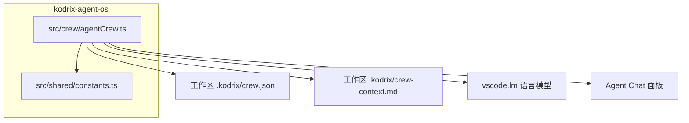
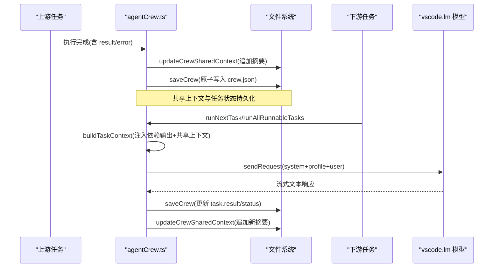
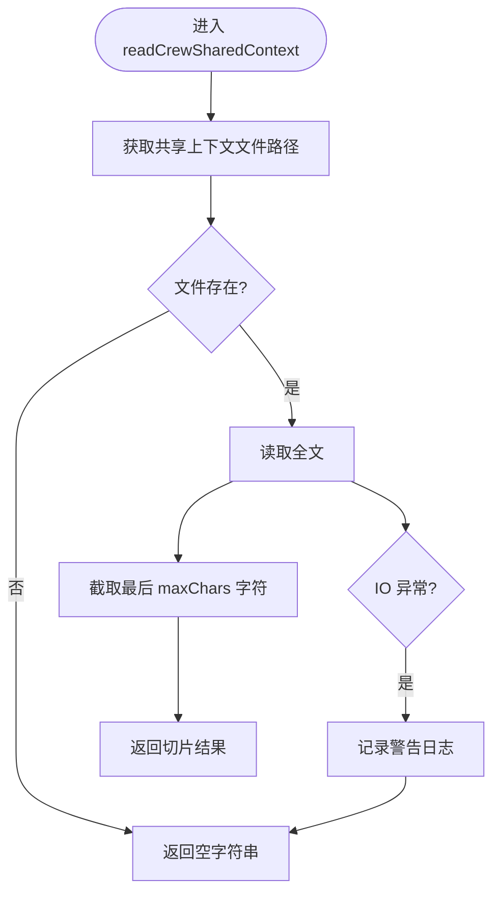
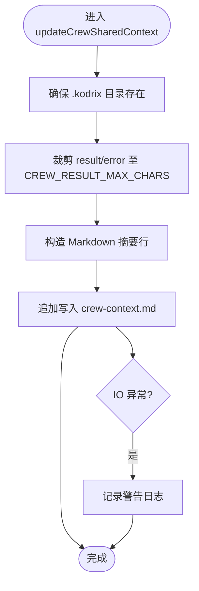
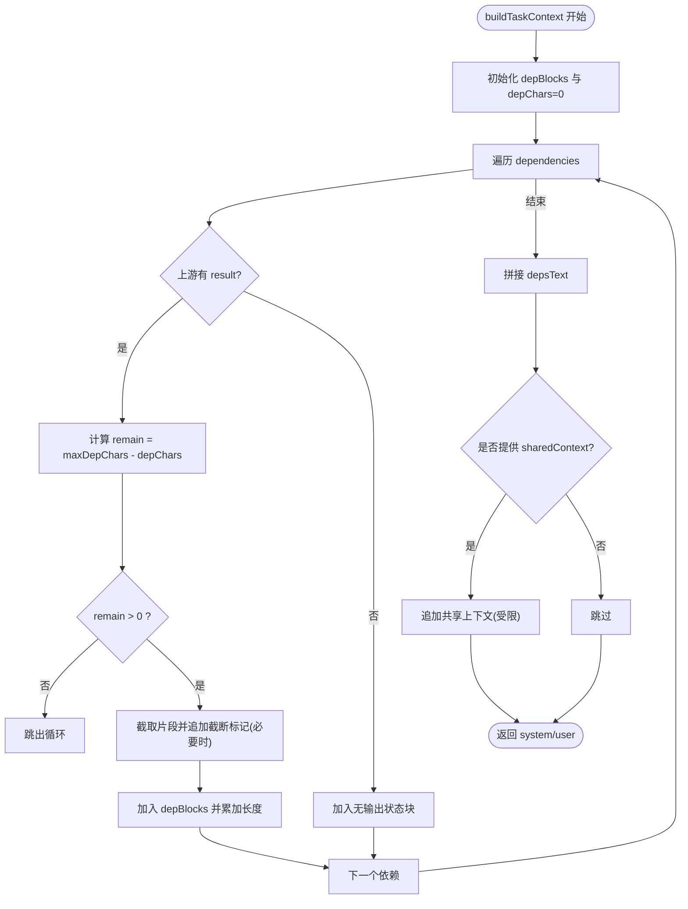
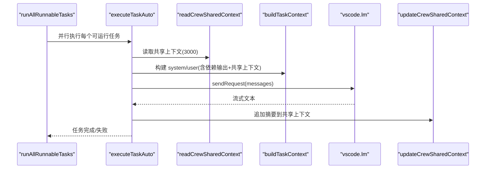
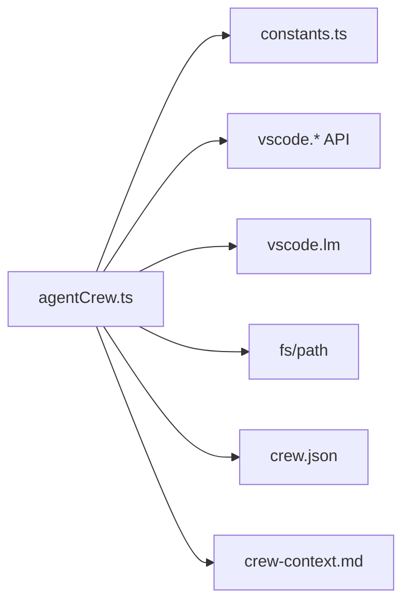

# 上下文共享机制

<cite>
**本文引用的文件**   
- [agentCrew.ts](file://extensions/kodrix-agent-os/src/crew/agentCrew.ts)
- [constants.ts](file://extensions/kodrix-agent-os/src/shared/constants.ts)
</cite>

## 目录
1. [引言](#引言)
2. [项目结构定位](#项目结构定位)
3. [核心组件](#核心组件)
4. [架构总览](#架构总览)
5. [详细组件分析](#详细组件分析)
6. [依赖关系分析](#依赖关系分析)
7. [性能与容量控制](#性能与容量控制)
8. [故障排查指南](#故障排查指南)
9. [结论](#结论)
10. [附录：最佳实践与示例](#附录最佳实践与示例)

## 引言
本文件系统性说明 Kodrix Agent Crew 的“上下文共享机制”，重点覆盖以下目标：
- 跨 Agent 上下文传递的设计理念与技术实现
- readCrewSharedContext 读取机制与 updateCrewSharedContext 写入机制
- 共享上下文文件的存储格式、更新策略与版本管理
- 依赖输出注入的工作原理，如何将上游任务结果自动传递给下游任务
- 上下文截断策略（CREW_CONTEXT_MAX_CHARS），在有限空间内最大化信息传递效率
- 上下文工程最佳实践：结构化输出、关键信息提取、上下文压缩技巧
- 使用示例与性能优化建议，帮助设计高效的 Agent 协作流程

## 项目结构定位
上下文共享机制位于扩展 kodrix-agent-os 的 crew 模块中，核心逻辑集中在 agentCrew.ts；常量定义（如字符上限）集中在 shared/constants.ts。

图表来源
- [agentCrew.ts:17-32](file://extensions/kodrix-agent-os/src/crew/agentCrew.ts#L17-L32)
- [agentCrew.ts:144-173](file://extensions/kodrix-agent-os/src/crew/agentCrew.ts#L144-L173)
- [agentCrew.ts:423-456](file://extensions/kodrix-agent-os/src/crew/agentCrew.ts#L423-L456)
- [constants.ts:271-278](file://extensions/kodrix-agent-os/src/shared/constants.ts#L271-L278)

章节来源
- [agentCrew.ts:1-32](file://extensions/kodrix-agent-os/src/crew/agentCrew.ts#L1-L32)
- [constants.ts:271-278](file://extensions/kodrix-agent-os/src/shared/constants.ts#L271-L278)

## 核心组件
- 共享上下文读写
  - readCrewSharedContext：从工作区 .kodrix/crew-context.md 读取最近 N 字符作为团队共享上下文
  - updateCrewSharedContext：将任务执行结果或错误摘要追加到共享上下文文件
- 任务上下文构建
  - buildTaskContext：组装系统提示、角色信息、任务描述、上游依赖输出和共享上下文，形成 LLM 输入
- 执行路径
  - executeTaskAuto：自动模式执行单个任务，注入共享上下文并调用 LLM，完成后写回结果并更新共享上下文
  - runNextTask / runAllRunnableTasks：调度入口，分别用于单任务手动模式和批量并行模式

章节来源
- [agentCrew.ts:349-398](file://extensions/kodrix-agent-os/src/crew/agentCrew.ts#L349-L398)
- [agentCrew.ts:423-456](file://extensions/kodrix-agent-os/src/crew/agentCrew.ts#L423-L456)
- [agentCrew.ts:462-508](file://extensions/kodrix-agent-os/src/crew/agentCrew.ts#L462-L508)
- [agentCrew.ts:515-572](file://extensions/kodrix-agent-os/src/crew/agentCrew.ts#L515-L572)
- [agentCrew.ts:622-665](file://extensions/kodrix-agent-os/src/crew/agentCrew.ts#L622-L665)

## 架构总览
下图展示跨 Agent 上下文传递的整体流程：上游任务产出 result，被写入 crew.json 与共享上下文文件；下游任务通过 buildTaskContext 注入依赖输出与共享上下文，再由 LLM 生成新的结果。

图表来源
- [agentCrew.ts:444-456](file://extensions/kodrix-agent-os/src/crew/agentCrew.ts#L444-L456)
- [agentCrew.ts:462-508](file://extensions/kodrix-agent-os/src/crew/agentCrew.ts#L462-L508)
- [agentCrew.ts:515-572](file://extensions/kodrix-agent-os/src/crew/agentCrew.ts#L515-L572)
- [agentCrew.ts:622-665](file://extensions/kodrix-agent-os/src/crew/agentCrew.ts#L622-L665)

## 详细组件分析

### 共享上下文文件与路径
- 路径规则
  - 共享上下文文件：工作区根目录下 .kodrix/crew-context.md
  - 若未打开工作区或无法解析路径，则返回 undefined，读写操作会安全降级
- 目录创建
  - 写入前确保 .kodrix 目录存在（递归创建）

章节来源
- [agentCrew.ts:423-428](file://extensions/kodrix-agent-os/src/crew/agentCrew.ts#L423-L428)
- [agentCrew.ts:447-449](file://extensions/kodrix-agent-os/src/crew/agentCrew.ts#L447-L449)

### readCrewSharedContext 读取机制
- 行为
  - 若文件不存在或路径不可用，返回空字符串
  - 否则读取整个文件内容，并截取最后 maxChars 个字符作为共享上下文
  - 默认使用 CREW_CONTEXT_MAX_CHARS，也可传入自定义上限（例如 3000）
- 异常处理
  - 捕获 IO 异常并记录警告日志，返回空字符串，避免中断主流程

图表来源
- [agentCrew.ts:431-441](file://extensions/kodrix-agent-os/src/crew/agentCrew.ts#L431-L441)

章节来源
- [agentCrew.ts:431-441](file://extensions/kodrix-agent-os/src/crew/agentCrew.ts#L431-L441)

### updateCrewSharedContext 写入机制
- 行为
  - 确保 .kodrix 目录存在
  - 取 task.result 或 task.error，限制为 CREW_RESULT_MAX_CHARS
  - 以 Markdown 二级标题形式追加一行摘要，包含时间戳、任务标题、角色、状态与摘要正文
- 异常处理
  - 捕获 IO 异常并记录警告日志

图表来源
- [agentCrew.ts:444-456](file://extensions/kodrix-agent-os/src/crew/agentCrew.ts#L444-L456)

章节来源
- [agentCrew.ts:444-456](file://extensions/kodrix-agent-os/src/crew/agentCrew.ts#L444-L456)

### 依赖输出注入与上下文拼接
- 注入范围
  - 按任务声明的 dependencies 顺序遍历上游任务
  - 若上游有 result，则将其作为“上游任务输出”块注入；若无 result，则标注状态
- 截断策略
  - 累计注入长度不超过 maxDepChars（默认 CREW_CONTEXT_MAX_CHARS）
  - 超过剩余空间时，截断该段并附加“上下文截断”提示
- 共享上下文拼接
  - 当提供 sharedContext 时，将其作为“团队共享上下文”区块插入 user 消息末尾，同样受 maxDepChars 限制

图表来源
- [agentCrew.ts:349-398](file://extensions/kodrix-agent-os/src/crew/agentCrew.ts#L349-L398)

章节来源
- [agentCrew.ts:349-398](file://extensions/kodrix-agent-os/src/crew/agentCrew.ts#L349-L398)

### 自动执行与共享上下文联动
- executeTaskAuto
  - 选择模型后，构建任务上下文，其中 sharedContext 通过 readCrewSharedContext(3000) 注入
  - 调用 LLM 流式响应，将结果限制为 CREW_RESULT_MAX_CHARS
  - 更新任务状态、耗时、时间戳，并调用 updateCrewSharedContext 追加摘要
- runAllRunnableTasks
  - 分批并行执行可运行任务，每批结束后保存 crew.json，再根据新完成任务推进下一波
- runNextTask
  - 打开 Agent Chat 面板，注入 buildTaskContext 生成的 user 上下文，供人工辅助执行

图表来源
- [agentCrew.ts:462-508](file://extensions/kodrix-agent-os/src/crew/agentCrew.ts#L462-L508)
- [agentCrew.ts:515-572](file://extensions/kodrix-agent-os/src/crew/agentCrew.ts#L515-L572)

章节来源
- [agentCrew.ts:462-508](file://extensions/kodrix-agent-os/src/crew/agentCrew.ts#L462-L508)
- [agentCrew.ts:515-572](file://extensions/kodrix-agent-os/src/crew/agentCrew.ts#L515-L572)

## 依赖关系分析
- 模块耦合
  - agentCrew.ts 依赖 constants.ts 中的常量（超时、字符上限等）
  - agentCrew.ts 依赖 vscode API（文件系统、命令、进度、LLM）
- 数据流
  - crew.json：任务配置与执行结果（原子写入）
  - crew-context.md：共享上下文（追加写入）
- 外部依赖
  - vscode.lm：语言模型请求
  - vscode.window：用户交互（命令、进度、提示）

图表来源
- [agentCrew.ts:17-32](file://extensions/kodrix-agent-os/src/crew/agentCrew.ts#L17-L32)
- [agentCrew.ts:144-173](file://extensions/kodrix-agent-os/src/crew/agentCrew.ts#L144-L173)
- [agentCrew.ts:423-456](file://extensions/kodrix-agent-os/src/crew/agentCrew.ts#L423-L456)
- [constants.ts:271-278](file://extensions/kodrix-agent-os/src/shared/constants.ts#L271-L278)

章节来源
- [agentCrew.ts:17-32](file://extensions/kodrix-agent-os/src/crew/agentCrew.ts#L17-L32)
- [constants.ts:271-278](file://extensions/kodrix-agent-os/src/shared/constants.ts#L271-L278)

## 性能与容量控制
- 字符上限
  - CREW_CONTEXT_MAX_CHARS：限制依赖输出注入与共享上下文的总长度，防止上下文爆炸
  - CREW_RESULT_MAX_CHARS：限制任务 result 写入 crew.json 的长度，防止文件无限膨胀
- 截断策略
  - 依赖输出注入：按声明顺序拼接，超出剩余空间即截断并提示
  - 共享上下文读取：仅保留最后 N 字符，保证最新信息优先
- 并发与超时
  - 支持受限并发池（maxParallel）并行执行同波任务
  - 单任务超时（CREW_TASK_TIMEOUT_MS）保护长时间阻塞

章节来源
- [agentCrew.ts:349-398](file://extensions/kodrix-agent-os/src/crew/agentCrew.ts#L349-L398)
- [agentCrew.ts:462-508](file://extensions/kodrix-agent-os/src/crew/agentCrew.ts#L462-L508)
- [agentCrew.ts:515-572](file://extensions/kodrix-agent-os/src/crew/agentCrew.ts#L515-L572)
- [constants.ts:271-278](file://extensions/kodrix-agent-os/src/shared/constants.ts#L271-L278)

## 故障排查指南
- 共享上下文读取为空
  - 检查 .kodrix/crew-context.md 是否存在
  - 确认工作区已正确打开且路径可解析
  - 查看日志中的读取警告
- 共享上下文写入失败
  - 检查 .kodrix 目录权限与磁盘空间
  - 查看日志中的写入警告
- 下游任务未获得上游结果
  - 确认上游任务 status 为 completed 且有 result
  - 检查 dependencies 是否正确声明
  - 观察 buildTaskContext 注入的依赖输出是否被截断
- 上下文过大导致截断
  - 调整 CREW_CONTEXT_MAX_CHARS 或在上游任务中精简输出
  - 使用结构化摘要，突出关键信息

章节来源
- [agentCrew.ts:431-456](file://extensions/kodrix-agent-os/src/crew/agentCrew.ts#L431-L456)
- [agentCrew.ts:349-398](file://extensions/kodrix-agent-os/src/crew/agentCrew.ts#L349-L398)

## 结论
Kodrix Agent Crew 的上下文共享机制通过“共享上下文文件 + 依赖输出注入”的双通道，实现了跨 Agent 的信息传递与复用。其设计要点包括：
- 轻量、可审计的文件格式（Markdown 摘要）
- 严格的容量控制（字符上限与截断策略）
- 原子化的任务状态持久化（crew.json）
- 可扩展的上下文工程规范（结构化输出、关键信息提取）

这些特性共同保障了多 Agent 协作的高效性与稳定性。

## 附录：最佳实践与示例

### 结构化输出格式建议
- 使用 Markdown 二级/三级标题组织内容
- 代码块标注语言，便于下游直接复用
- 明确列出决策依据、约束条件与边界情况
- 在末尾添加完成标记（如 [DONE]），便于自动化识别

### 关键信息提取
- 只保留对下游任务必要的信息
- 删除过程性闲聊与冗余解释
- 将长文档拆分为多个小任务，逐步沉淀到共享上下文

### 上下文压缩技巧
- 使用要点列表替代大段叙述
- 合并重复信息，去重后再写入
- 对超大输出进行分段摘要，分条追加到共享上下文

### 使用示例（概念性步骤）
- 上游任务（架构师）
  - 输出技术方案与模块边界
  - 写入 crew.json 的 result 字段
  - 自动追加摘要到 crew-context.md
- 下游任务（开发者）
  - 自动注入上游依赖输出与共享上下文
  - 基于结构化设计实现代码
  - 完成后再次更新共享上下文

[本节为概念性指导，不直接分析具体源码文件]