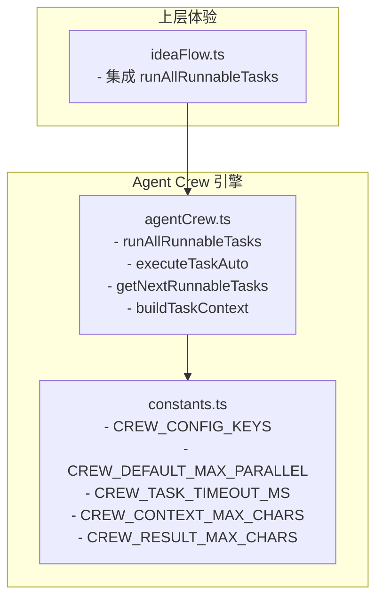
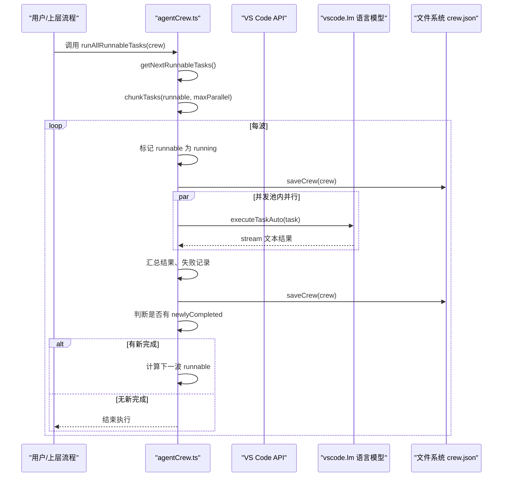
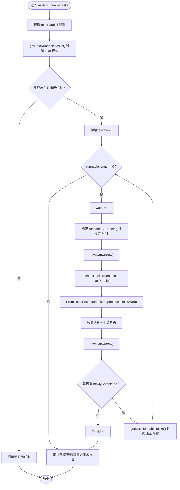
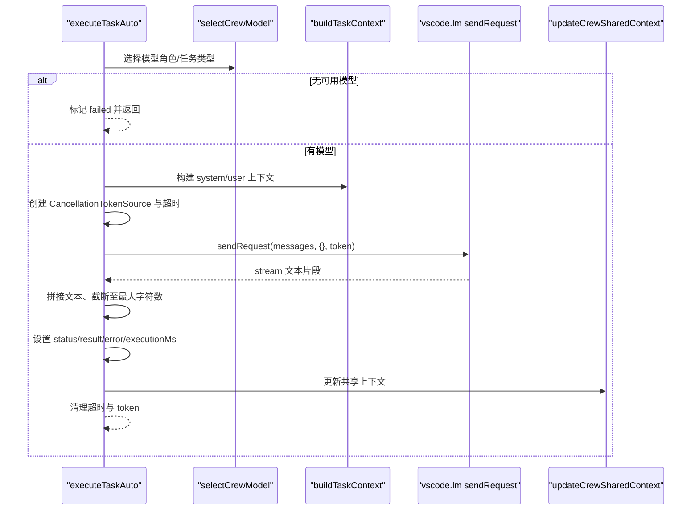
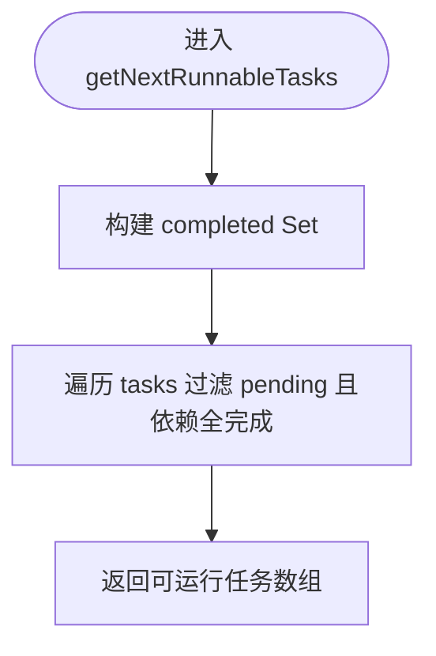
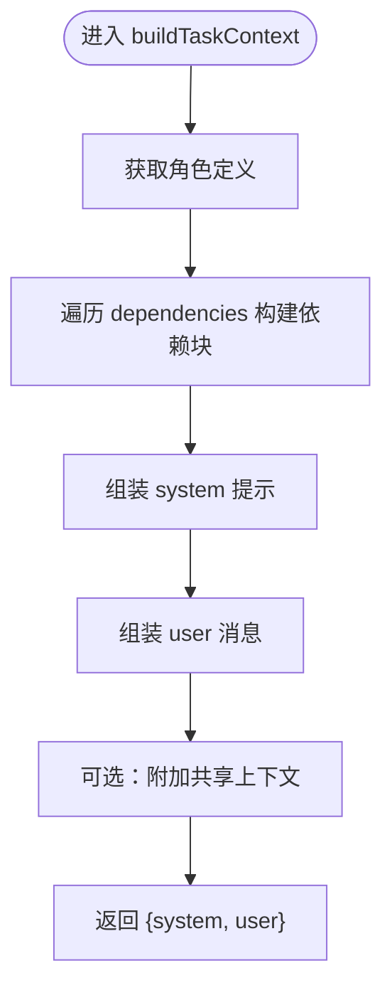
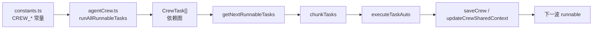

# 任务执行引擎

<cite>
**本文引用的文件**   
- [agentCrew.ts](file://extensions/kodrix-agent-os/src/crew/agentCrew.ts)
- [constants.ts](file://extensions/kodrix-agent-os/src/shared/constants.ts)
- [ideaFlow.ts](file://extensions/kodrix-agent-os/src/experience/ideaFlow.ts)
</cite>

## 目录
1. [引言](#引言)
2. [项目结构定位](#项目结构定位)
3. [核心组件总览](#核心组件总览)
4. [架构总览](#架构总览)
5. [详细组件分析](#详细组件分析)
6. [依赖与数据流分析](#依赖与数据流分析)
7. [性能与并发控制](#性能与并发控制)
8. [错误处理与恢复](#错误处理与恢复)
9. [调试与排障指南](#调试与排障指南)
10. [结论](#结论)

## 引言
本文件聚焦 Kodrix Agent OS 中 v2 并行任务执行引擎，围绕以下目标展开：
- 深入解析 `runAllRunnableTasks` 主调度器的工作流程、波次管理机制与并发池控制策略。
- 详细说明 `executeTaskAuto` 单任务执行逻辑，包括 LLM 调用、超时处理、错误恢复与结果持久化。
- 解释 `getNextRunnableTasks` 依赖解析算法，以及自动推进机制如何驱动 DAG 级联执行。
- 说明 `buildTaskContext` 上下文构建过程，包括系统提示组装、上游依赖注入与共享上下文整合。
- 提供复杂依赖链、并发冲突与重试机制的实践建议，并给出性能优化与调试技巧。

该引擎位于扩展 `kodrix-agent-os` 的 Crew 编排模块中，目标是实现多智能体协作下的真实并行执行、跨 Agent 上下文传递、自动状态推进与双执行模式（后台自动 / 面板手动）。

## 项目结构定位
任务执行引擎的核心代码集中在 `extensions/kodrix-agent-os/src/crew/agentCrew.ts`，相关常量定义在 `extensions/kodrix-agent-os/src/shared/constants.ts`，并在 Idea Flow 体验层中被集成调用。

**图表来源**
- [agentCrew.ts:1-33](file://extensions/kodrix-agent-os/src/crew/agentCrew.ts#L1-L33)
- [agentCrew.ts:325-398](file://extensions/kodrix-agent-os/src/crew/agentCrew.ts#L325-L398)
- [agentCrew.ts:462-572](file://extensions/kodrix-agent-os/src/crew/agentCrew.ts#L462-L572)
- [constants.ts:259-278](file://extensions/kodrix-agent-os/src/shared/constants.ts#L259-L278)
- [ideaFlow.ts:21-21](file://extensions/kodrix-agent-os/src/experience/ideaFlow.ts#L21-L21)
- [ideaFlow.ts:792-802](file://extensions/kodrix-agent-os/src/experience/ideaFlow.ts#L792-L802)

**章节来源**
- [agentCrew.ts:1-33](file://extensions/kodrix-agent-os/src/crew/agentCrew.ts#L1-L33)
- [constants.ts:259-278](file://extensions/kodrix-agent-os/src/shared/constants.ts#L259-L278)
- [ideaFlow.ts:21-21](file://extensions/kodrix-agent-os/src/experience/ideaFlow.ts#L21-L21)
- [ideaFlow.ts:792-802](file://extensions/kodrix-agent-os/src/experience/ideaFlow.ts#L792-L802)

## 核心组件总览
- 任务模型与配置
  - `CrewConfig`：包含工作区名称、描述、工作流类型、Agent 角色定义、任务列表及时间戳。
  - `CrewTask`：任务 ID、标题、描述、分配角色、依赖数组、状态、执行模式、结果、耗时、错误信息、创建/更新时间。
  - `CrewExecutionMode`：`auto`（后台并行 LLM 执行）或 `chat`（打开 Agent 面板带工具执行）。
- 关键函数
  - `getNextRunnableTasks`：返回所有可运行任务（pending 且依赖全部 completed）。
  - `buildTaskContext`：组装系统提示与用户消息，注入上游依赖输出与团队共享上下文。
  - `executeTaskAuto`：单任务自动执行，含模型选择、LLM 调用、超时、错误捕获、结果持久化。
  - `runAllRunnableTasks`：主调度器，按波次分批并行执行，自动推进下一波。
  - `chunkTasks`：将任务数组按指定大小切分，用于并发池控制。
- 共享上下文
  - `readCrewSharedContext`：读取此前任务成果摘要，跨 Agent 传递。
  - `updateCrewSharedContext`：追加任务成果摘要到共享上下文文件。

**章节来源**
- [agentCrew.ts:34-80](file://extensions/kodrix-agent-os/src/crew/agentCrew.ts#L34-L80)
- [agentCrew.ts:325-398](file://extensions/kodrix-agent-os/src/crew/agentCrew.ts#L325-L398)
- [agentCrew.ts:462-572](file://extensions/kodrix-agent-os/src/crew/agentCrew.ts#L462-L572)

## 架构总览
v2 并行执行引擎以 Crew 配置为输入，通过依赖解析得到可运行任务集合，按波次分批并行执行；每波结束后根据完成状态自动推进下一波，直至无可运行任务或无新完成任务。

**图表来源**
- [agentCrew.ts:515-572](file://extensions/kodrix-agent-os/src/crew/agentCrew.ts#L515-L572)
- [agentCrew.ts:462-508](file://extensions/kodrix-agent-os/src/crew/agentCrew.ts#L462-L508)
- [agentCrew.ts:325-331](file://extensions/kodrix-agent-os/src/crew/agentCrew.ts#L325-L331)
- [agentCrew.ts:312-319](file://extensions/kodrix-agent-os/src/crew/agentCrew.ts#L312-L319)

## 详细组件分析

### runAllRunnableTasks 主调度器
职责：
- 从配置中读取最大并发数。
- 获取可运行任务并过滤 chat 模式。
- 使用进度通知显示执行状态。
- 循环取波次：标记 running → 保存状态 → 分批并行执行 → 汇总结果 → 保存状态 → 判断是否推进下一波。
- 最终展示执行报告。

关键点：
- 并发控制：通过 `chunkTasks` 将同波任务按 `maxParallel` 切分为多个 chunk，每个 chunk 内部用 `Promise.allSettled` 并行执行。
- 波次推进：仅当本波有任务变为 completed 时，才重新计算下一波可运行任务。
- 失败隔离：单个任务失败不影响同波其他任务，失败原因记录到任务对象。

**图表来源**
- [agentCrew.ts:515-572](file://extensions/kodrix-agent-os/src/crew/agentCrew.ts#L515-L572)
- [agentCrew.ts:312-319](file://extensions/kodrix-agent-os/src/crew/agentCrew.ts#L312-L319)

**章节来源**
- [agentCrew.ts:515-572](file://extensions/kodrix-agent-os/src/crew/agentCrew.ts#L515-L572)

### executeTaskAuto 单任务执行逻辑
职责：
- 根据任务分配角色选择模型。
- 构建任务上下文（系统提示 + 用户消息）。
- 设置 CancellationToken 与超时。
- 调用 LLM 并流式消费响应。
- 持久化结果、状态、耗时与错误信息。
- 更新共享上下文。

关键点：
- 模型选择：优先任务/角色指定模型，否则按任务类型路由。
- 超时处理：基于 `setTimeout` 触发 `cts.cancel()`，在 finally 中清理定时器与 token。
- 错误恢复：捕获异常并记录错误信息，不阻塞其他任务。
- 结果持久化：写入 `task.result`、`task.status`、`task.executionMs`、`task.error`，并更新共享上下文。

**图表来源**
- [agentCrew.ts:462-508](file://extensions/kodrix-agent-os/src/crew/agentCrew.ts#L462-L508)
- [agentCrew.ts:403-421](file://extensions/kodrix-agent-os/src/crew/agentCrew.ts#L403-L421)
- [agentCrew.ts:349-398](file://extensions/kodrix-agent-os/src/crew/agentCrew.ts#L349-L398)

**章节来源**
- [agentCrew.ts:462-508](file://extensions/kodrix-agent-os/src/crew/agentCrew.ts#L462-L508)

### getNextRunnableTasks 依赖解析算法
职责：
- 返回所有 pending 且依赖全部 completed 的任务。

算法要点：
- 使用 Set 缓存已完成任务 ID，提升查找效率。
- 对每个任务检查 dependencies 是否全部在 completed 集合中。
- 纯函数，便于单元测试。

复杂度分析：
- 时间复杂度：O(N + D)，N 为任务总数，D 为依赖关系总数。
- 空间复杂度：O(C)，C 为已完成任务数量。

**图表来源**
- [agentCrew.ts:325-331](file://extensions/kodrix-agent-os/src/crew/agentCrew.ts#L325-L331)

**章节来源**
- [agentCrew.ts:325-331](file://extensions/kodrix-agent-os/src/crew/agentCrew.ts#L325-L331)

### buildTaskContext 上下文构建过程
职责：
- 组装系统提示与用户消息。
- 注入上游依赖任务输出。
- 整合团队共享上下文。

构建步骤：
- 根据任务分配角色获取系统提示。
- 遍历 dependencies，按顺序拼接上游任务输出，超过上限则截断。
- 组装 user 消息，包含任务标题、角色、需求描述、上游依赖上下文、共享上下文与输出要求。

**图表来源**
- [agentCrew.ts:349-398](file://extensions/kodrix-agent-os/src/crew/agentCrew.ts#L349-L398)

**章节来源**
- [agentCrew.ts:349-398](file://extensions/kodrix-agent-os/src/crew/agentCrew.ts#L349-L398)

## 依赖与数据流分析
- 配置依赖：
  - `CREW_CONFIG`、`CREW_CONFIG_KEYS`、`CREW_DEFAULT_MAX_PARALLEL`、`CREW_TASK_TIMEOUT_MS`、`CREW_CONTEXT_MAX_CHARS`、`CREW_RESULT_MAX_CHARS` 来自 constants.ts。
- 运行时依赖：
  - VS Code API：`vscode.window.withProgress`、`vscode.workspace.getConfiguration`、`vscode.LanguageModelChatMessage.User`、`vscode.CancellationTokenSource`。
  - 文件系统：读写 `crew.json` 与共享上下文文件 `.kodrix/crew-context.md`。
- 数据流：
  - CrewConfig → getNextRunnableTasks → runnable 数组 → chunkTasks → executeTaskAuto → task.result/status/error → saveCrew → 下一波 runnable。

**图表来源**
- [constants.ts:259-278](file://extensions/kodrix-agent-os/src/shared/constants.ts#L259-L278)
- [agentCrew.ts:325-331](file://extensions/kodrix-agent-os/src/crew/agentCrew.ts#L325-L331)
- [agentCrew.ts:312-319](file://extensions/kodrix-agent-os/src/crew/agentCrew.ts#L312-L319)
- [agentCrew.ts:462-508](file://extensions/kodrix-agent-os/src/crew/agentCrew.ts#L462-L508)
- [agentCrew.ts:515-572](file://extensions/kodrix-agent-os/src/crew/agentCrew.ts#L515-L572)

**章节来源**
- [constants.ts:259-278](file://extensions/kodrix-agent-os/src/shared/constants.ts#L259-L278)
- [agentCrew.ts:312-398](file://extensions/kodrix-agent-os/src/crew/agentCrew.ts#L312-L398)
- [agentCrew.ts:462-572](file://extensions/kodrix-agent-os/src/crew/agentCrew.ts#L462-L572)

## 性能与并发控制
- 并发池控制：
  - `maxParallel` 默认值为 3，可通过配置 `kodrix.crew.maxParallel` 调整。
  - 使用 `chunkTasks` 将同波任务切分为固定大小的 chunk，每个 chunk 内部并行执行。
- 超时控制：
  - 单任务默认超时 180000ms，可通过 `kodrix.crew.timeoutMs` 调整。
  - 使用 `CancellationTokenSource` 与 `setTimeout` 实现取消。
- 上下文限制：
  - 依赖输出注入最大字符数 4000，防止 prompt 爆炸。
  - 任务结果最大字符数 12000，防止 crew.json 无限膨胀。
- 资源管理：
  - `CancellationTokenSource` 在 finally 中 dispose，防止泄漏。
  - 原子写入 crew.json：先写临时文件再 rename。

优化建议：
- 合理设置 `maxParallel`，避免过多并发导致 LLM 限流或资源争用。
- 对于长耗时任务，适当提高 `timeoutMs`，但需监控整体执行时间。
- 对大输出任务，考虑拆分下游依赖，减少单次上下文长度。

**章节来源**
- [constants.ts:269-278](file://extensions/kodrix-agent-os/src/shared/constants.ts#L269-L278)
- [agentCrew.ts:476-508](file://extensions/kodrix-agent-os/src/crew/agentCrew.ts#L476-L508)
- [agentCrew.ts:515-572](file://extensions/kodrix-agent-os/src/crew/agentCrew.ts#L515-L572)

## 错误处理与恢复
- 模型不可用：
  - 若无法选择模型，任务直接标记 failed，错误信息提示配置 BYOK 模型。
- LLM 调用异常：
  - 捕获异常并记录错误信息，任务标记 failed，不影响同波其他任务。
- 空响应：
  - 若流式响应为空，任务标记 failed，错误信息为“模型无响应输出”。
- 超时：
  - 超时触发取消，任务标记 failed，错误信息为取消相关异常。
- 共享上下文写入失败：
  - 捕获异常并记录警告，不影响主流程。

恢复策略：
- 单任务失败不阻塞整体流程，后续波次仍可继续。
- 执行结束后生成 Markdown 报告，列出失败任务与错误信息。
- 支持手动标记任务完成，触发下一波执行。

**章节来源**
- [agentCrew.ts:462-508](file://extensions/kodrix-agent-os/src/crew/agentCrew.ts#L462-L508)
- [agentCrew.ts:575-618](file://extensions/kodrix-agent-os/src/crew/agentCrew.ts#L575-L618)

## 调试与排障指南
常见问题：
- 无可用语言模型：
  - 检查 Manage Models 中是否配置 BYOK 模型。
- 任务一直 pending：
  - 检查依赖任务是否 completed，或是否存在 chat 模式任务阻塞自动执行。
- 上下文过长：
  - 检查依赖任务输出是否过大，考虑拆分任务或减少共享上下文长度。
- 并发过高导致限流：
  - 降低 `kodrix.crew.maxParallel` 值。
- 超时频繁：
  - 提高 `kodrix.crew.timeoutMs`，或检查 LLM 服务可用性。

调试技巧：
- 查看执行报告 Markdown 文档，了解各任务状态、耗时与错误信息。
- 检查工作区 `.kodrix/crew.json` 与 `.kodrix/crew-context.md`，确认状态与共享上下文是否正确更新。
- 启用 VS Code 日志，观察 `[AgentCrew]` 前缀的日志输出。

**章节来源**
- [agentCrew.ts:575-618](file://extensions/kodrix-agent-os/src/crew/agentCrew.ts#L575-L618)
- [agentCrew.ts:430-456](file://extensions/kodrix-agent-os/src/crew/agentCrew.ts#L430-L456)

## 结论
v2 并行任务执行引擎通过依赖解析、波次管理与并发池控制，实现了多智能体协作下的高效并行执行。其设计强调：
- 真实并行：同波任务相互独立，可并行执行。
- 自动推进：任务完成后自动写回状态，级联触发下一波。
- 上下文传递：上游依赖输出自动注入下游任务 prompt。
- 健壮性：单任务失败不阻塞整体流程，具备超时、错误捕获与资源清理机制。

在实际使用中，建议根据任务规模与 LLM 服务能力调优并发与超时参数，并通过执行报告与日志进行监控与排障。