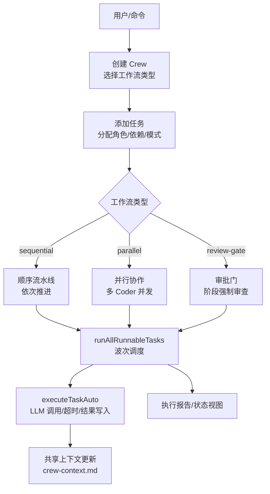
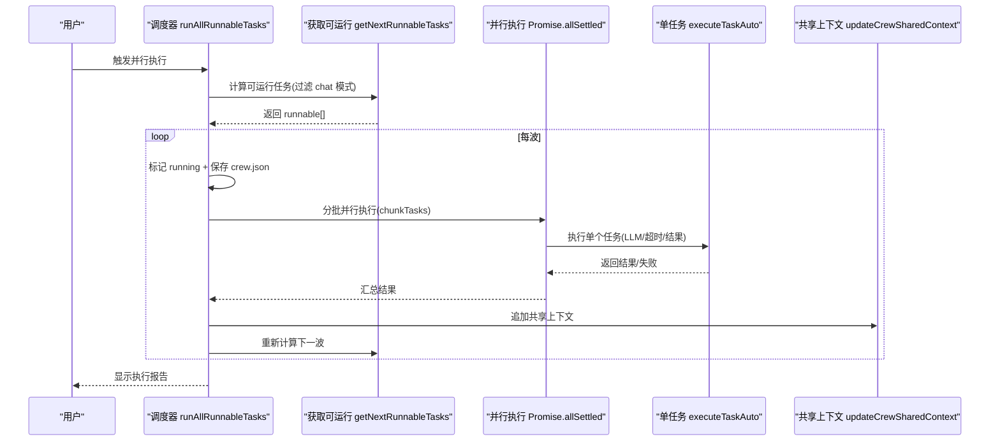
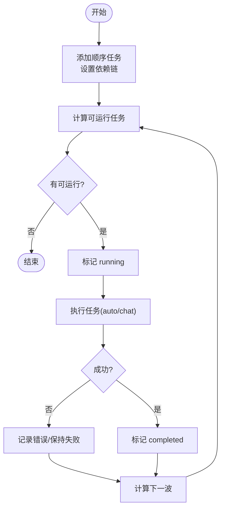
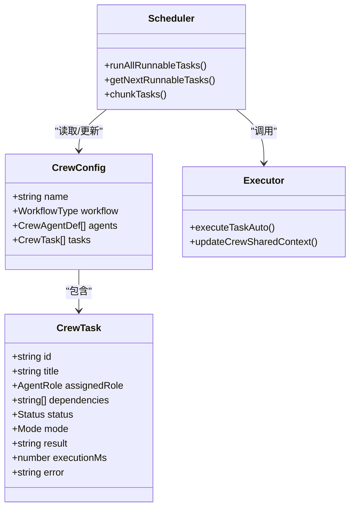
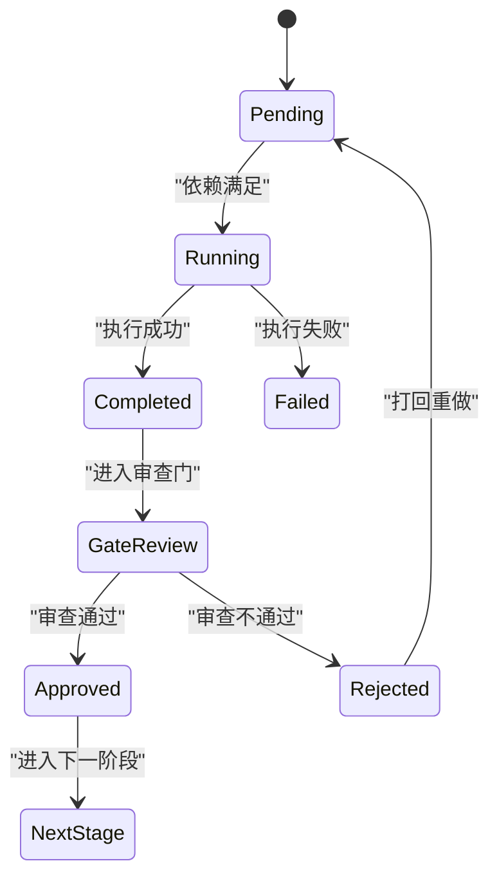
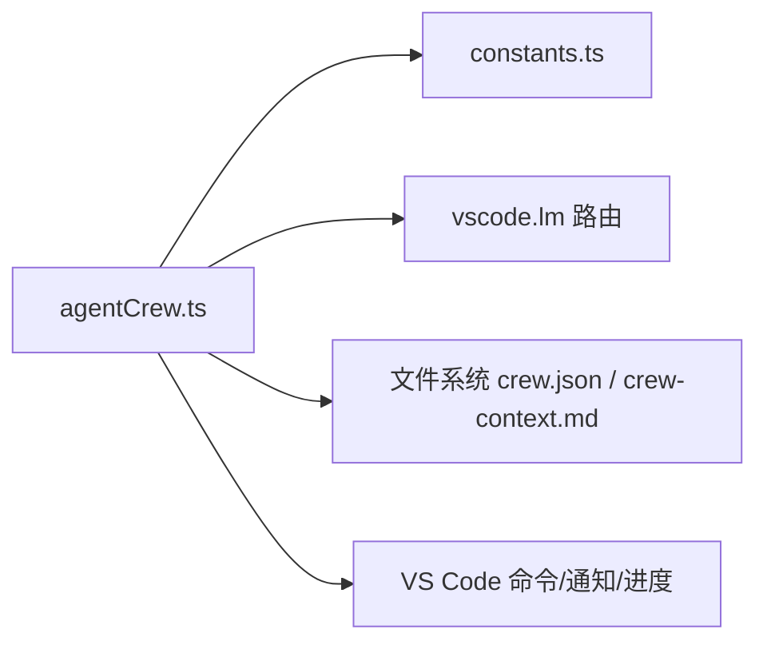

# 工作流类型

<cite>
**本文引用的文件**
- [agentCrew.ts](file://extensions/kodrix-agent-os/src/crew/agentCrew.ts)
- [constants.ts](file://extensions/kodrix-agent-os/src/shared/constants.ts)
- [package.nls.json](file://extensions/kodrix-agent-os/package.nls.json)
- [核心功能总报告.md](file://docs/项目非常有必要新实现的核心功能总报告.md)
</cite>

## 目录
1. [简介](#简介)
2. [项目结构](#项目结构)
3. [核心组件](#核心组件)
4. [架构总览](#架构总览)
5. [详细组件分析](#详细组件分析)
6. [依赖关系分析](#依赖关系分析)
7. [性能与并发特性](#性能与并发特性)
8. [故障排查指南](#故障排查指南)
9. [结论](#结论)
10. [附录：配置与使用示例](#附录配置与使用示例)

## 简介
本文件面向团队在 Kodrix Agent Crew 中如何设计、选择与落地三种工作流模式：顺序流水线（sequential）、并行协作（parallel）、审批门（review-gate）。文档从设计理念、适用场景、执行流程、状态转换、并发控制、质量门禁、配置与监控调试等方面展开，帮助团队基于任务特征选择合适的协作模式并高效落地。

## 项目结构
Agent Crew 的工作流能力集中在扩展 kodrix-agent-os 的 crew 模块中，核心由“任务编排 + 并行调度 + 角色定义 + 配置常量”构成：
- 工作流类型与数据模型：在 agentCrew.ts 中定义 WorkflowType、CrewConfig、CrewTask 等。
- 角色与系统提示：内置 Architect/Coder/Reviewer/Tester/DevOps 等角色及职责说明。
- 任务创建与执行：支持自动执行（auto）与手动执行（chat），并通过依赖图推进。
- 并行调度器：按波次计算可运行任务，限制并发上限，批量执行并级联推进。
- 配置常量：最大并发、超时、上下文与结果大小限制等。

图表来源
- [agentCrew.ts:177-234](file://extensions/kodrix-agent-os/src/crew/agentCrew.ts#L177-L234)
- [agentCrew.ts:515-572](file://extensions/kodrix-agent-os/src/crew/agentCrew.ts#L515-L572)
- [agentCrew.ts:462-508](file://extensions/kodrix-agent-os/src/crew/agentCrew.ts#L462-L508)
- [agentCrew.ts:711-765](file://extensions/kodrix-agent-os/src/crew/agentCrew.ts#L711-L765)

章节来源
- [agentCrew.ts:177-234](file://extensions/kodrix-agent-os/src/crew/agentCrew.ts#L177-L234)
- [agentCrew.ts:515-572](file://extensions/kodrix-agent-os/src/crew/agentCrew.ts#L515-L572)

## 核心组件
- 工作流类型与配置
  - WorkflowType：'sequential' | 'parallel' | 'review-gate'
  - CrewConfig：包含 name、workflow、agents、tasks 等
- 任务与状态
  - CrewTask：id、title、description、assignedRole、dependencies、status（pending/running/completed/failed/skipped）、mode（auto/chat）、result、executionMs、error 等
- 角色定义
  - 内置角色：architect、coder、reviewer、tester、devops、custom，含系统提示与可用工具
- 执行引擎
  - runAllRunnableTasks：波次调度、受限并发、自动写回、级联推进
  - executeTaskAuto：单任务 LLM 调用、超时控制、结果写入、共享上下文更新
  - getNextRunnableTasks：根据依赖与状态计算可运行任务集合
  - chunkTasks：将一批任务切分为固定大小的子批次以控制并发
- 配置常量
  - maxParallel：默认 3
  - timeoutMs：默认 180000ms
  - 上下文与结果长度限制：防止上下文爆炸与文件膨胀

章节来源
- [agentCrew.ts:34-80](file://extensions/kodrix-agent-os/src/crew/agentCrew.ts#L34-L80)
- [agentCrew.ts:84-140](file://extensions/kodrix-agent-os/src/crew/agentCrew.ts#L84-L140)
- [agentCrew.ts:312-331](file://extensions/kodrix-agent-os/src/crew/agentCrew.ts#L312-L331)
- [agentCrew.ts:462-508](file://extensions/kodrix-agent-os/src/crew/agentCrew.ts#L462-L508)
- [constants.ts:260-278](file://extensions/kodrix-agent-os/src/shared/constants.ts#L260-L278)

## 架构总览
Agent Crew 的执行架构围绕“任务 DAG + 波次调度 + 受限并发”构建：
- 任务依赖图：通过 dependencies 字段声明前置任务，getNextRunnableTasks 动态计算可运行集合。
- 波次调度：每轮取当前可运行任务，标记 running，分批并行执行，完成后写回状态，再计算下一波。
- 受限并发：通过 chunkTasks 将同波任务按 maxParallel 切分，避免资源过载。
- 跨 Agent 上下文传递：buildTaskContext 将上游任务输出注入下游任务 prompt，形成知识流转。
- 双执行模式：auto 后台并行执行；chat 打开 Agent 面板带工具执行，适合需要人工介入的环节。

图表来源
- [agentCrew.ts:515-572](file://extensions/kodrix-agent-os/src/crew/agentCrew.ts#L515-L572)
- [agentCrew.ts:325-331](file://extensions/kodrix-agent-os/src/crew/agentCrew.ts#L325-L331)
- [agentCrew.ts:462-508](file://extensions/kodrix-agent-os/src/crew/agentCrew.ts#L462-L508)
- [agentCrew.ts:444-456](file://extensions/kodrix-agent-os/src/crew/agentCrew.ts#L444-L456)

## 详细组件分析

### 顺序流水线（sequential）
- 设计理念
  - 严格遵循角色顺序：Architect → Coder → Reviewer → Tester，强调阶段性与质量递进。
  - 通过依赖图表达阶段先后，下游任务依赖上游输出，确保上下文连贯。
- 适用场景
  - 对质量要求高、变更影响面大、需要明确阶段评审与测试覆盖的功能开发。
  - 团队协作中希望减少返工、强化设计先行与测试驱动的团队。
- 执行流程与状态转换
  - 创建 Crew 时选择 sequential，添加任务并设置依赖链。
  - 调度器按依赖关系逐波推进，只有前置任务 completed，下游才可进入 pending→running→completed。
  - 任一阶段失败会记录 error，不影响同波其他独立任务，但会阻断后续依赖该任务的下游。
- 关键实现要点
  - getNextRunnableTasks 仅允许依赖全部 completed 的任务进入可运行集合。
  - 任务结果通过 buildTaskContext 注入下游，保证信息不丢失。
  - 可通过 markTaskComplete 或自动执行推进状态。

图表来源
- [agentCrew.ts:325-331](file://extensions/kodrix-agent-os/src/crew/agentCrew.ts#L325-L331)
- [agentCrew.ts:515-572](file://extensions/kodrix-agent-os/src/crew/agentCrew.ts#L515-L572)
- [agentCrew.ts:462-508](file://extensions/kodrix-agent-os/src/crew/agentCrew.ts#L462-L508)

章节来源
- [agentCrew.ts:177-234](file://extensions/kodrix-agent-os/src/crew/agentCrew.ts#L177-L234)
- [agentCrew.ts:325-331](file://extensions/kodrix-agent-os/src/crew/agentCrew.ts#L325-L331)
- [agentCrew.ts:515-572](file://extensions/kodrix-agent-os/src/crew/agentCrew.ts#L515-L572)

### 并行协作（parallel）
- 设计理念
  - 多个 Coder 同时工作，最大化吞吐；最终由 Reviewer 统一审查，兼顾效率与质量。
  - 通过依赖图与波次调度实现“同层并行、跨层串行”。
- 并发控制机制
  - 通过 maxParallel 限制每批并行任务数，避免资源耗尽。
  - chunkTasks 将同波任务切分为固定大小的子批次，Promise.allSettled 并行执行，单任务失败不阻塞同波其它任务。
  - 自动写回 crew.json，级联触发下一波可运行任务。
- 统一审查
  - 所有 Coder 产出作为上游输出，Reviewer 任务依赖这些产出，集中进行代码风格、安全、性能与测试覆盖检查。
- 适用场景
  - 大型功能拆分、多模块并行开发、需要快速交付且具备统一审查能力的团队。

图表来源
- [agentCrew.ts:34-80](file://extensions/kodrix-agent-os/src/crew/agentCrew.ts#L34-L80)
- [agentCrew.ts:312-331](file://extensions/kodrix-agent-os/src/crew/agentCrew.ts#L312-L331)
- [agentCrew.ts:515-572](file://extensions/kodrix-agent-os/src/crew/agentCrew.ts#L515-L572)
- [agentCrew.ts:462-508](file://extensions/kodrix-agent-os/src/crew/agentCrew.ts#L462-L508)

章节来源
- [agentCrew.ts:312-331](file://extensions/kodrix-agent-os/src/crew/agentCrew.ts#L312-L331)
- [agentCrew.ts:515-572](file://extensions/kodrix-agent-os/src/crew/agentCrew.ts#L515-L572)
- [constants.ts:260-278](file://extensions/kodrix-agent-os/src/shared/constants.ts#L260-L278)

### 审批门（review-gate）
- 设计理念
  - 每个阶段设置强制审查点，未通过则不能进入下一阶段，确保质量门禁。
  - 结合依赖图与状态机，将 Reviewer 的批准作为下游任务的前置条件。
- 强制检查点机制
  - 在任务依赖中引入“审查任务”，下游任务必须依赖审查任务 completed。
  - 若审查失败，可将下游任务标记为 skipped 或保持 pending，直到审查通过。
  - 通过共享上下文记录审查意见与修改建议，指导 Coder 迭代。
- 适用场景
  - 对合规性、安全性、稳定性要求极高的项目；需要审计追踪与质量留痕的团队。
- 自定义工作流逻辑
  - 通过任务依赖与角色组合，可在现有框架内实现更复杂的门控策略（如多重审查、分支合并后二次审查等）。

图表来源
- [agentCrew.ts:325-331](file://extensions/kodrix-agent-os/src/crew/agentCrew.ts#L325-L331)
- [agentCrew.ts:515-572](file://extensions/kodrix-agent-os/src/crew/agentCrew.ts#L515-L572)

章节来源
- [agentCrew.ts:325-331](file://extensions/kodrix-agent-os/src/crew/agentCrew.ts#L325-L331)
- [agentCrew.ts:515-572](file://extensions/kodrix-agent-os/src/crew/agentCrew.ts#L515-L572)

## 依赖关系分析
- 模块耦合
  - agentCrew.ts 依赖 shared/constants 提供配置键与默认值。
  - 通过 vscode API 与语言模型路由（routeModel）完成 LLM 调用。
  - 共享上下文文件 .kodrix/crew-context.md 用于跨 Agent 知识传递。
- 外部集成点
  - VS Code 命令与工作区 API：创建 Crew、添加任务、执行、查看状态。
  - 语言模型接口：sendRequest、stream 处理、取消令牌与超时控制。
- 潜在循环依赖
  - 当前实现无循环依赖；任务依赖通过数据声明而非运行时引用。

图表来源
- [agentCrew.ts:17-32](file://extensions/kodrix-agent-os/src/crew/agentCrew.ts#L17-L32)
- [agentCrew.ts:403-411](file://extensions/kodrix-agent-os/src/crew/agentCrew.ts#L403-L411)
- [agentCrew.ts:424-456](file://extensions/kodrix-agent-os/src/crew/agentCrew.ts#L424-L456)

章节来源
- [agentCrew.ts:17-32](file://extensions/kodrix-agent-os/src/crew/agentCrew.ts#L17-L32)
- [agentCrew.ts:403-411](file://extensions/kodrix-agent-os/src/crew/agentCrew.ts#L403-L411)
- [agentCrew.ts:424-456](file://extensions/kodrix-agent-os/src/crew/agentCrew.ts#L424-L456)

## 性能与并发特性
- 并发上限
  - maxParallel 默认 3，可按需调整以避免资源争用。
- 超时控制
  - 单任务默认超时 180000ms，防止长时间占用资源。
- 上下文与结果限制
  - 依赖输出注入上限 4000 字符，结果写入上限 12000 字符，防止上下文爆炸与文件膨胀。
- 执行报告与可视化
  - 执行结束后生成 Markdown 报告，展示任务明细、耗时、错误与待办提示。
  - 状态视图提供进度条与任务列表，便于监控。

章节来源
- [constants.ts:260-278](file://extensions/kodrix-agent-os/src/shared/constants.ts#L260-L278)
- [agentCrew.ts:575-618](file://extensions/kodrix-agent-os/src/crew/agentCrew.ts#L575-L618)
- [agentCrew.ts:711-765](file://extensions/kodrix-agent-os/src/crew/agentCrew.ts#L711-L765)

## 故障排查指南
- 常见问题
  - 无可用语言模型：检查模型路由配置，确保已配置 BYOK 模型。
  - 任务超时：适当提高 timeoutMs 或优化任务复杂度。
  - 上下文截断：依赖输出过长会被截断，建议在上游任务精简输出。
  - 文件写入异常：原子写入（先临时文件再 rename）降低崩溃风险，但仍需关注磁盘权限。
- 定位方法
  - 查看执行报告与状态视图，关注 failed 任务与 error 字段。
  - 检查共享上下文文件 .kodrix/crew-context.md，确认上下游信息是否完整。
  - 通过日志输出（logger）定位具体失败原因。

章节来源
- [agentCrew.ts:462-508](file://extensions/kodrix-agent-os/src/crew/agentCrew.ts#L462-L508)
- [agentCrew.ts:575-618](file://extensions/kodrix-agent-os/src/crew/agentCrew.ts#L575-L618)
- [agentCrew.ts:711-765](file://extensions/kodrix-agent-os/src/crew/agentCrew.ts#L711-L765)

## 结论
- 顺序流水线适合强阶段性与高质量要求的场景，通过依赖链保障信息流转与质量递进。
- 并行协作适合大规模并行开发与统一审查，通过受限并发与波次调度提升吞吐。
- 审批门通过强制审查点确保质量门禁，适合合规与安全敏感的项目。
- 团队可根据任务特征、协作习惯与质量要求选择合适的工作流类型，并通过依赖图与角色组合自定义复杂逻辑。

## 附录：配置与使用示例
- 创建工作流
  - 使用命令创建 Crew，选择工作流类型（顺序/并行/审批门），并选择参与角色。
- 添加任务
  - 为每个任务指定角色、描述、依赖与执行模式（auto/chat）。
- 执行与监控
  - 并行执行所有可运行任务，查看执行报告与状态视图。
- 配置项
  - maxParallel：最大并发任务数（默认 3）。
  - timeoutMs：单任务超时（默认 180000ms）。
  - 上下文与结果长度限制：防止上下文爆炸与文件膨胀。

章节来源
- [agentCrew.ts:177-234](file://extensions/kodrix-agent-os/src/crew/agentCrew.ts#L177-L234)
- [agentCrew.ts:238-304](file://extensions/kodrix-agent-os/src/crew/agentCrew.ts#L238-L304)
- [agentCrew.ts:515-572](file://extensions/kodrix-agent-os/src/crew/agentCrew.ts#L515-L572)
- [constants.ts:260-278](file://extensions/kodrix-agent-os/src/shared/constants.ts#L260-L278)
- [package.nls.json:44-49](file://extensions/kodrix-agent-os/package.nls.json#L44-L49)
- [package.nls.json:117-126](file://extensions/kodrix-agent-os/package.nls.json#L117-L126)
- [核心功能总报告.md:64-72](file://docs/项目非常有必要新实现的核心功能总报告.md#L64-L72)