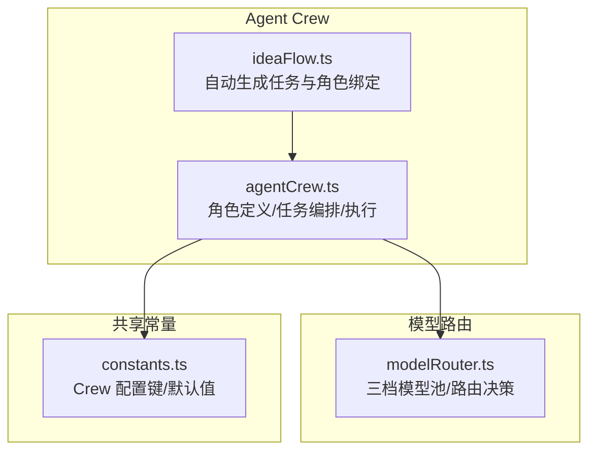
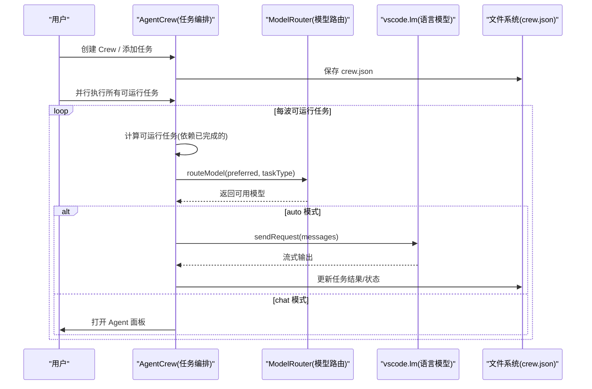
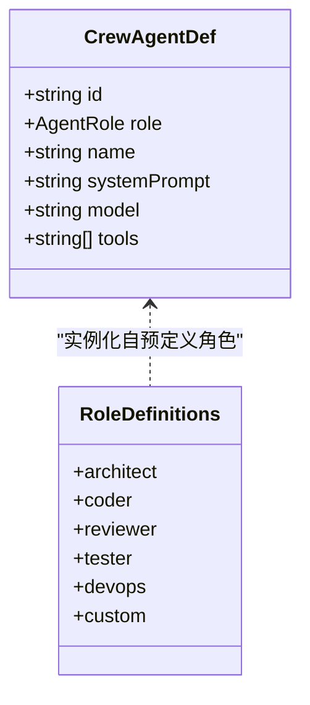
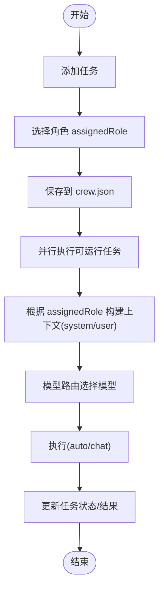
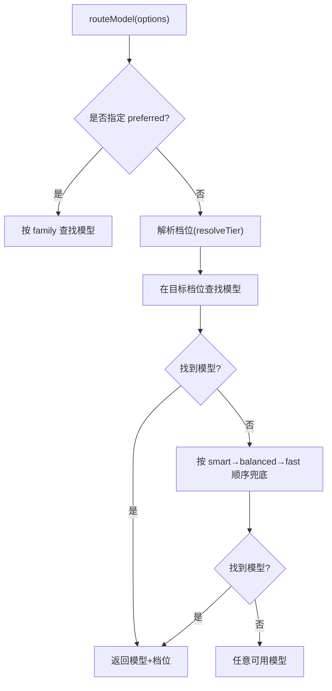
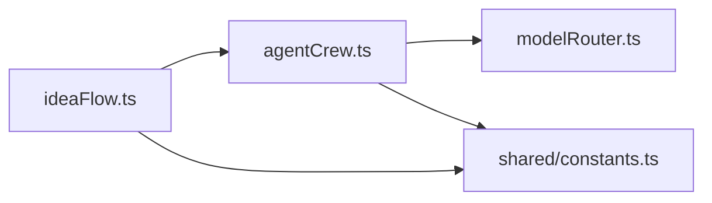

# 角色管理系统

<cite>
**本文引用的文件**   
- [agentCrew.ts](file://extensions/kodrix-agent-os/src/crew/agentCrew.ts)
- [modelRouter.ts](file://extensions/kodrix-agent-os/src/model/modelRouter.ts)
- [constants.ts](file://extensions/kodrix-agent-os/src/shared/constants.ts)
- [ideaFlow.ts](file://extensions/kodrix-agent-os/src/experience/ideaFlow.ts)
</cite>

## 目录
1. [引言](#引言)
2. [项目结构](#项目结构)
3. [核心组件](#核心组件)
4. [架构总览](#架构总览)
5. [详细组件分析](#详细组件分析)
6. [依赖关系分析](#依赖关系分析)
7. [性能与并发特性](#性能与并发特性)
8. [最佳实践](#最佳实践)
9. [常见问题与排障](#常见问题与排障)
10. [结论](#结论)

## 引言
本文件面向“角色管理系统”，聚焦 Agent Crew 中的预定义角色、角色配置结构 ROLE_DEFS、任务绑定与执行流程，以及模型路由策略。目标是帮助读者理解并扩展系统：如何为不同职责的 Agent（architect、coder、reviewer、tester、devops）配置 systemPrompt、tools、model；如何通过 assignedRole 将任务分配给合适的 Agent；以及如何通过自定义角色 custom 扩展新的 Agent 类型。

## 项目结构
角色管理相关代码集中在 kodrix-agent-os 扩展中，核心文件如下：
- extensions/kodrix-agent-os/src/crew/agentCrew.ts：角色定义、Crew 配置、任务编排与执行引擎
- extensions/kodrix-agent-os/src/model/modelRouter.ts：模型自动路由（smart/balanced/fast）
- extensions/kodrix-agent-os/src/shared/constants.ts：共享常量（Crew 配置键、默认值等）
- extensions/kodrix-agent-os/src/experience/ideaFlow.ts：Idea Flow 自动生成 Crew 任务与角色绑定的示例

图表来源
- [agentCrew.ts:84-140](file://extensions/kodrix-agent-os/src/crew/agentCrew.ts#L84-L140)
- [modelRouter.ts:58-89](file://extensions/kodrix-agent-os/src/model/modelRouter.ts#L58-L89)
- [constants.ts:257-278](file://extensions/kodrix-agent-os/src/shared/constants.ts#L257-L278)
- [ideaFlow.ts:580-637](file://extensions/kodrix-agent-os/src/experience/ideaFlow.ts#L580-L637)

章节来源
- [agentCrew.ts:1-80](file://extensions/kodrix-agent-os/src/crew/agentCrew.ts#L1-L80)
- [modelRouter.ts:1-30](file://extensions/kodrix-agent-os/src/model/modelRouter.ts#L1-L30)
- [constants.ts:257-278](file://extensions/kodrix-agent-os/src/shared/constants.ts#L257-L278)
- [ideaFlow.ts:580-637](file://extensions/kodrix-agent-os/src/experience/ideaFlow.ts#L580-L637)

## 核心组件
- 角色类型与定义
  - 预定义角色：architect、coder、reviewer、tester、devops、custom
  - 角色定义对象包含：role、name、systemPrompt、model（可选）、tools（可选）
- Crew 配置与任务
  - CrewConfig：包含 agents、tasks、workflow、时间戳等
  - CrewTask：包含 title、description、assignedRole、dependencies、status、mode、result、executionMs、error 等
- 模型路由
  - 三档模型池：smart、balanced、fast
  - 任务类型到档位映射：plan→smart、coding→balanced、terminal→balanced、review→smart 等
- 共享常量
  - CREW_CONFIG_KEYS：maxParallel、timeoutMs
  - 默认并发数、超时、上下文截断长度等

章节来源
- [agentCrew.ts:34-80](file://extensions/kodrix-agent-os/src/crew/agentCrew.ts#L34-L80)
- [agentCrew.ts:84-140](file://extensions/kodrix-agent-os/src/crew/agentCrew.ts#L84-L140)
- [modelRouter.ts:58-89](file://extensions/kodrix-agent-os/src/model/modelRouter.ts#L58-L89)
- [constants.ts:257-278](file://extensions/kodrix-agent-os/src/shared/constants.ts#L257-L278)

## 架构总览
角色管理系统围绕“角色定义 → 任务绑定 → 模型路由 → 执行引擎”形成闭环。用户创建 Crew 后，系统根据 workflow 和任务依赖决定可运行任务波次；每个任务通过 assignedRole 选择对应角色的 systemPrompt 与 tools；模型路由根据任务类型或角色偏好选择合适模型；auto 模式后台并行执行，chat 模式打开 Agent 面板手动执行。

图表来源
- [agentCrew.ts:321-331](file://extensions/kodrix-agent-os/src/crew/agentCrew.ts#L321-L331)
- [agentCrew.ts:403-421](file://extensions/kodrix-agent-os/src/crew/agentCrew.ts#L403-L421)
- [agentCrew.ts:462-508](file://extensions/kodrix-agent-os/src/crew/agentCrew.ts#L462-L508)
- [modelRouter.ts:167-267](file://extensions/kodrix-agent-os/src/model/modelRouter.ts#L167-L267)

## 详细组件分析

### 预定义 Agent 角色与行为模式
- architect（架构师）
  - 职责：需求分析、技术方案、模块边界、API 契约、Spec 文档
  - 工具权限：read_file、search_files、chat
  - 模型偏好：plan 任务 → smart 档位
- coder（开发者）
  - 职责：实现具体代码、遵循 Memory/Learning 约定、编写可测试代码、自动运行测试
  - 工具权限：read_file、search_files、edit_file、terminal
  - 模型偏好：coding 任务 → balanced 档位
- reviewer（审查者）
  - 职责：安全漏洞、性能问题、风格、测试覆盖检查，给出修改建议，标记 APPROVED
  - 工具权限：read_file、search_files、git_diff
  - 模型偏好：review 任务 → smart 档位
- tester（测试者）
  - 职责：生成用例、覆盖边界/异常/性能基准、使用项目测试框架、报告覆盖率
  - 工具权限：read_file、search_files、edit_file、terminal
  - 模型偏好：coding 任务 → balanced 档位
- devops（运维）
  - 职责：CI/CD、Docker、部署脚本、环境变量/密钥、监控日志
  - 工具权限：read_file、edit_file、terminal
  - 模型偏好：terminal 任务 → balanced 档位
- custom（自定义）
  - 用途：扩展新角色类型，提供最小模板

图表来源
- [agentCrew.ts:41-48](file://extensions/kodrix-agent-os/src/crew/agentCrew.ts#L41-L48)
- [agentCrew.ts:84-140](file://extensions/kodrix-agent-os/src/crew/agentCrew.ts#L84-L140)

章节来源
- [agentCrew.ts:84-140](file://extensions/kodrix-agent-os/src/crew/agentCrew.ts#L84-L140)

### ROLE_DEFS 角色配置结构
ROLE_DEFS 是角色定义的集中配置表，字段说明：
- role：角色标识（与 AgentRole 类型一致）
- name：显示名称
- systemPrompt：系统设计提示，用于构建 LLM 的系统消息
- model：可选指定模型 family（优先于任务类型映射）
- tools：允许的工具列表（如 read_file、search_files、edit_file、terminal、git_diff、chat）

扩展机制（custom）：
- 新增自定义角色时，可在 ROLE_DEFS 中添加 custom 条目，或在运行时动态注入
- 若任务 assignedRole 不在预定义集合，则回退到 custom 的角色定义

章节来源
- [agentCrew.ts:84-140](file://extensions/kodrix-agent-os/src/crew/agentCrew.ts#L84-L140)

### 角色与任务的绑定关系
- 任务通过 assignedRole 字段绑定到某个 Agent 角色
- 添加任务时，用户从 Crew 的 agents 列表中选择一个角色进行分配
- 执行时，系统根据 assignedRole 查找对应的角色定义，组装 systemPrompt 与 user 上下文
- Idea Flow 自动生成任务时，也会按角色分配（architect 先设计，coder 实现，tester 最后验证）

图表来源
- [agentCrew.ts:238-304](file://extensions/kodrix-agent-os/src/crew/agentCrew.ts#L238-L304)
- [agentCrew.ts:349-398](file://extensions/kodrix-agent-os/src/crew/agentCrew.ts#L349-L398)
- [ideaFlow.ts:580-637](file://extensions/kodrix-agent-os/src/experience/ideaFlow.ts#L580-L637)

章节来源
- [agentCrew.ts:238-304](file://extensions/kodrix-agent-os/src/crew/agentCrew.ts#L238-L304)
- [ideaFlow.ts:580-637](file://extensions/kodrix-agent-os/src/experience/ideaFlow.ts#L580-L637)

### 模型路由与模型选择策略
- 优先级：preferred（精确指定）→ 任务类型映射 → 全池兜底
- 任务类型到档位映射：
  - plan → smart
  - coding/edit → balanced
  - terminal → balanced
  - review → smart
  - quick/extract → fast
- 角色到任务类型的映射：
  - architect → plan
  - reviewer → review
  - devops → terminal
  - 其他 → coding

图表来源
- [modelRouter.ts:167-267](file://extensions/kodrix-agent-os/src/model/modelRouter.ts#L167-L267)
- [agentCrew.ts:403-421](file://extensions/kodrix-agent-os/src/crew/agentCrew.ts#L403-L421)

章节来源
- [modelRouter.ts:58-89](file://extensions/kodrix-agent-os/src/model/modelRouter.ts#L58-L89)
- [modelRouter.ts:167-267](file://extensions/kodrix-agent-os/src/model/modelRouter.ts#L167-L267)
- [agentCrew.ts:403-421](file://extensions/kodrix-agent-os/src/crew/agentCrew.ts#L403-L421)

### 执行模式与任务上下文
- 执行模式：
  - auto：后台并行 LLM 执行，完成后自动推进，结果写入任务 result
  - chat：打开 Agent 面板带工具执行，完成后手动标记完成
- 任务上下文：
  - system：角色 systemPrompt + 团队角色说明 + 输出要求
  - user：任务标题、角色、描述、上游依赖输出、共享上下文、输出要求
- 共享上下文：
  - 读取 .kodrix/crew-context.md，追加任务摘要供下游任务参考

章节来源
- [agentCrew.ts:349-398](file://extensions/kodrix-agent-os/src/crew/agentCrew.ts#L349-L398)
- [agentCrew.ts:423-456](file://extensions/kodrix-agent-os/src/crew/agentCrew.ts#L423-L456)
- [agentCrew.ts:462-508](file://extensions/kodrix-agent-os/src/crew/agentCrew.ts#L462-L508)

## 依赖关系分析
- agentCrew.ts 依赖：
  - modelRouter.routeModel：模型路由
  - shared.constants：Crew 配置键与默认值
  - vscode API：窗口交互、命令注册、语言模型调用
- ideaFlow.ts 依赖：
  - agentCrew：加载/保存 Crew、打开 Chat
  - shared.constants：命令 ID 与配置段

图表来源
- [agentCrew.ts:17-32](file://extensions/kodrix-agent-os/src/crew/agentCrew.ts#L17-L32)
- [ideaFlow.ts:676-779](file://extensions/kodrix-agent-os/src/experience/ideaFlow.ts#L676-L779)

章节来源
- [agentCrew.ts:17-32](file://extensions/kodrix-agent-os/src/crew/agentCrew.ts#L17-L32)
- [ideaFlow.ts:676-779](file://extensions/kodrix-agent-os/src/experience/ideaFlow.ts#L676-L779)

## 性能与并发特性
- 并发控制：
  - maxParallel：默认 3，避免资源爆炸
  - chunkTasks：将任务分批，同批内无依赖，可并行执行
- 超时控制：
  - timeoutMs：单任务默认 180s，防止长时间阻塞
- 上下文限制：
  - CREW_CONTEXT_MAX_CHARS：依赖输出注入上限，防止 prompt 膨胀
  - CREW_RESULT_MAX_CHARS：任务结果写入上限，防止 crew.json 无限增长

章节来源
- [constants.ts:257-278](file://extensions/kodrix-agent-os/src/shared/constants.ts#L257-L278)
- [agentCrew.ts:312-319](file://extensions/kodrix-agent-os/src/crew/agentCrew.ts#L312-L319)
- [agentCrew.ts:476-478](file://extensions/kodrix-agent-os/src/crew/agentCrew.ts#L476-L478)

## 最佳实践
- Prompt 工程技巧
  - systemPrompt 明确职责与输出格式，强调结构化 Markdown 输出
  - 在 user 上下文中注入上游依赖输出与共享上下文，减少重复信息
  - 对复杂任务拆分多个子任务，降低单次推理复杂度
- 工具权限最小化原则
  - 仅授予完成任务所需的工具（如 reviewer 不需要 edit_file/terminal）
  - 谨慎开放 terminal 权限，避免误操作
- 模型选择策略
  - 对分析与评审类任务使用 smart 档位（如 architect/reviewer）
  - 对编码与终端任务使用 balanced 档位（如 coder/devops）
  - 可通过角色 model 字段精确指定模型 family，提升稳定性
- 任务绑定与依赖
  - 合理设置 dependencies，确保上游产出被下游消费
  - 使用 sharedContext 传递关键摘要，避免过长上下文影响质量

章节来源
- [agentCrew.ts:84-140](file://extensions/kodrix-agent-os/src/crew/agentCrew.ts#L84-L140)
- [agentCrew.ts:349-398](file://extensions/kodrix-agent-os/src/crew/agentCrew.ts#L349-L398)
- [modelRouter.ts:58-89](file://extensions/kodrix-agent-os/src/model/modelRouter.ts#L58-L89)

## 常见问题与排障
- 无可用语言模型
  - 现象：任务失败，错误提示“无可用语言模型”
  - 排查：确认 Manage Models 中已配置 BYOK 模型；检查 modelRouter.enabled 配置
  - 解决：安装/启用至少一个模型族（gpt-4o、claude-3.5-sonnet 等）
- 任务一直 pending
  - 现象：任务未进入 running/completed
  - 排查：检查 dependencies 是否全部 completed；是否存在 chat 模式任务阻塞自动执行
  - 解决：完成依赖任务或切换为 auto 模式
- 上下文过长导致响应缓慢
  - 现象：LLM 响应慢或截断
  - 排查：CREW_CONTEXT_MAX_CHARS 与 CREW_RESULT_MAX_CHARS 限制是否过小
  - 解决：适当增大限制或精简上游输出
- 工具权限不足
  - 现象：Agent 无法执行编辑/终端命令
  - 排查：角色 tools 列表是否包含所需工具
  - 解决：在角色定义中补充必要工具（谨慎授权）

章节来源
- [agentCrew.ts:462-508](file://extensions/kodrix-agent-os/src/crew/agentCrew.ts#L462-L508)
- [agentCrew.ts:515-572](file://extensions/kodrix-agent-os/src/crew/agentCrew.ts#L515-L572)
- [constants.ts:257-278](file://extensions/kodrix-agent-os/src/shared/constants.ts#L257-L278)

## 结论
角色管理系统通过明确的预定义角色与灵活的自定义扩展，结合任务依赖与模型路由，实现了多 Agent 协作的高效编排。实践中应遵循 Prompt 工程规范、工具权限最小化与模型选择策略，并通过合理的任务绑定与依赖管理，确保高质量、可维护的自动化开发流程。