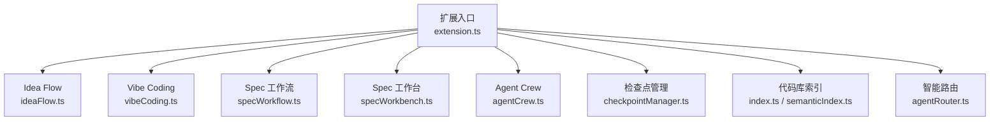
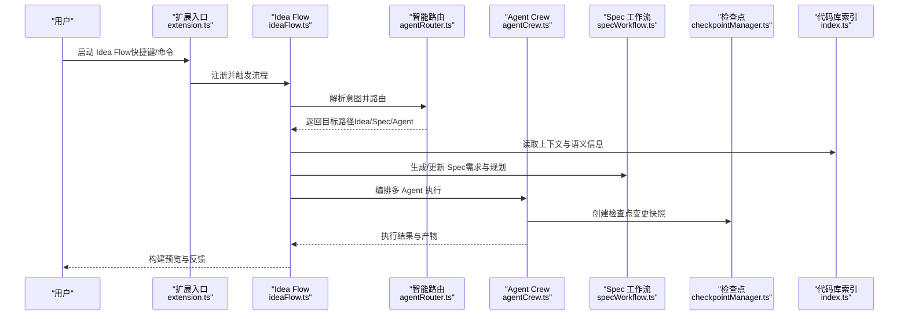
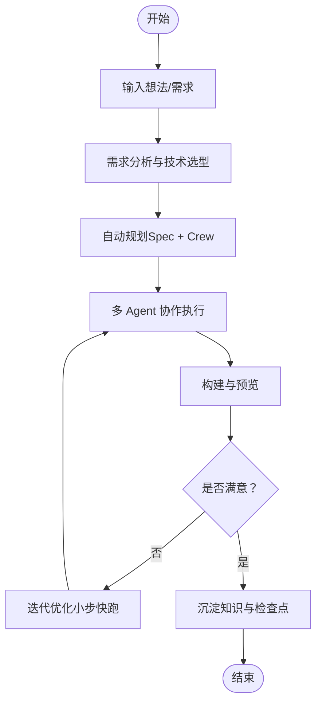
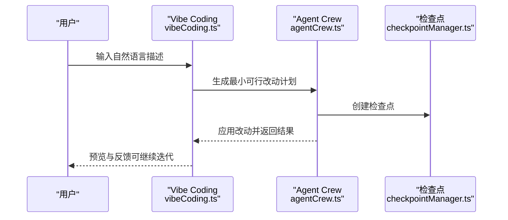
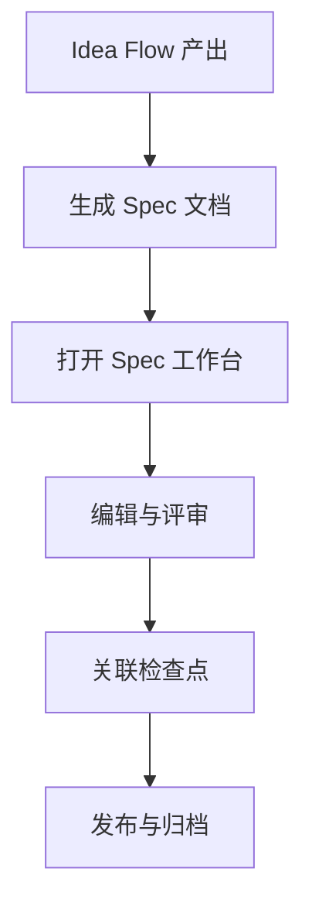
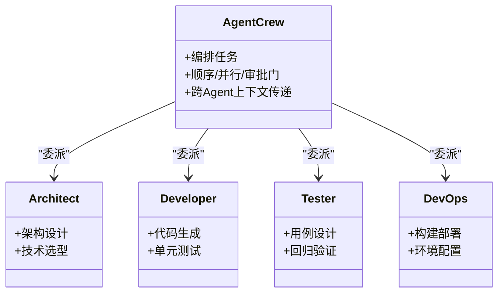
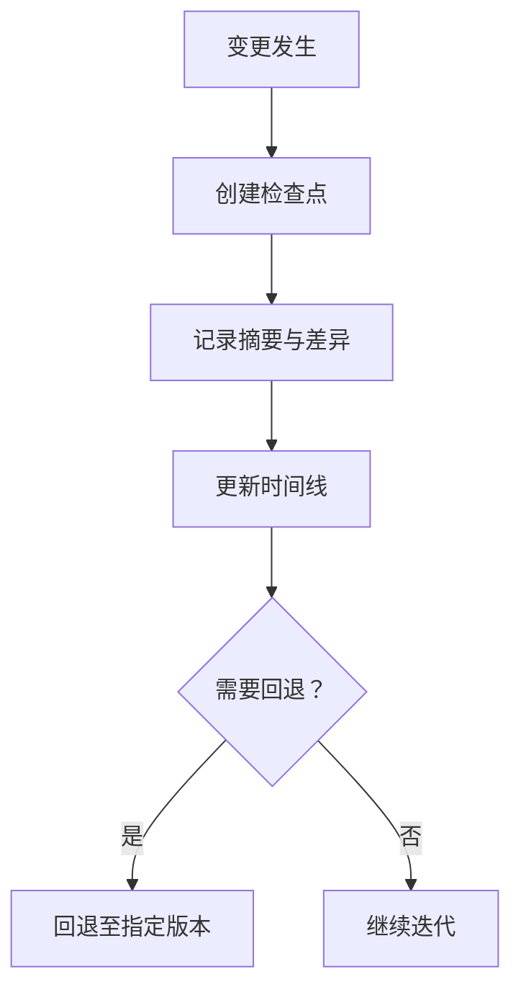
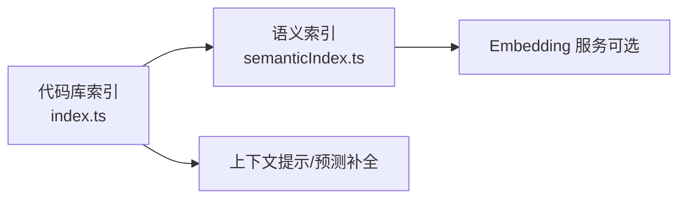
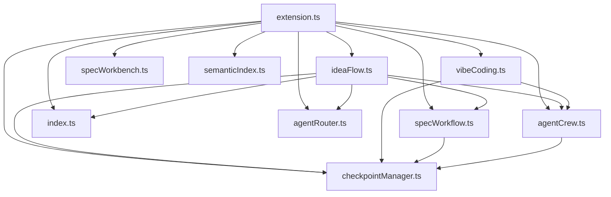

# Idea Flow 流水线

<cite>
**本文引用的文件**
- [extensions/kodrix-agent-os/src/extension.ts](file://extensions/kodrix-agent-os/src/extension.ts)
- [extensions/kodrix-agent-os/src/experience/ideaFlow.ts](file://extensions/kodrix-agent-os/src/experience/ideaFlow.ts)
- [extensions/kodrix-agent-os/src/experience/vibeCoding.ts](file://extensions/kodrix-agent-os/src/experience/vibeCoding.ts)
- [extensions/kodrix-agent-os/src/spec/specWorkflow.ts](file://extensions/kodrix-agent-os/src/spec/specWorkflow.ts)
- [extensions/kodrix-agent-os/src/spec/specWorkbench.ts](file://extensions/kodrix-agent-os/src/spec/specWorkbench.ts)
- [extensions/kodrix-agent-os/src/crew/agentCrew.ts](file://extensions/kodrix-agent-os/src/crew/agentCrew.ts)
- [extensions/kodrix-agent-os/src/checkpoint/checkpointManager.ts](file://extensions/kodrix-agent-os/src/checkpoint/checkpointManager.ts)
- [extensions/kodrix-agent-os/src/codebase/index.ts](file://extensions/kodrix-agent-os/src/codebase/index.ts)
- [extensions/kodrix-agent-os/src/codebase/semanticIndex.ts](file://extensions/kodrix-agent-os/src/codebase/semanticIndex.ts)
- [extensions/kodrix-agent-os/src/router/agentRouter.ts](file://extensions/kodrix-agent-os/src/router/agentRouter.ts)
- [docs/项目非常有必要新实现的核心功能总报告.md](file://docs/项目非常有必要新实现的核心功能总报告.md)
</cite>

## 目录
1. [简介](#简介)
2. [项目结构](#项目结构)
3. [核心组件](#核心组件)
4. [架构总览](#架构总览)
5. [详细组件分析](#详细组件分析)
6. [依赖关系分析](#依赖关系分析)
7. [性能考量](#性能考量)
8. [故障排查指南](#故障排查指南)
9. [结论](#结论)
10. [附录](#附录)

## 简介
Idea Flow 是从“想法”到“产品”的全自动开发流水线。它通过自然语言输入、需求分析与自动规划，驱动多 Agent 协作完成代码生成、构建与预览，并将过程沉淀为可追溯的 Spec 文档与检查点（Checkpoint）。配合 Vibe Coding 模式，用户可以用一句话快速生成可运行的原型，并在迭代中持续优化。

本流水线面向创新开发者与产品经理，提供：
- 想法输入与可视化编辑（Idea Canvas）
- 智能路由与自动规划
- 多 Agent 协作执行（架构师、开发者、测试者等）
- 自动构建与实时预览
- 与 Spec 工作台的集成，将产出物转化为正式规范文档
- 知识沉淀与学习引擎联动，越用越聪明

## 项目结构
Idea Flow 由扩展入口统一注册并编排各子系统协同工作。关键路径包括：
- 扩展激活时注册 Idea Flow、Vibe Coding、Spec 工作台、Agent Crew、检查点、语义索引等能力
- 命令面板与快捷键作为用户入口，触发端到端流程
- 后台任务负责索引构建与监听，支撑上下文感知与预测补全

图表来源
- [extensions/kodrix-agent-os/src/extension.ts:158-212](file://extensions/kodrix-agent-os/src/extension.ts#L158-L212)

章节来源
- [extensions/kodrix-agent-os/src/extension.ts:158-212](file://extensions/kodrix-agent-os/src/extension.ts#L158-L212)

## 核心组件
- Idea Flow：从想法到产品的端到端流水线，串联需求分析、规划、多 Agent 协作、构建预览与知识沉淀。
- Vibe Coding：以自然语言驱动的快速原型生成与迭代小改模式，强调“少改动、快反馈”。
- Spec 工作流与工作台：将 Idea Flow 的输出固化为结构化规范，支持三栏编辑与版本化。
- Agent Crew：角色化多 Agent 编排（架构师、开发者、测试者、运维等），顺序/并行/审批门组合执行。
- 检查点（Checkpoint）：对每次变更进行快照与回滚，保障迭代安全。
- 代码库索引与语义检索：AST 级符号索引、导入/调用图、语义向量检索，提升上下文质量。
- 智能路由：根据问题复杂度与类型，自动选择 Idea Flow、Spec、Plan、Agent 或 Ask 等路径。

章节来源
- [extensions/kodrix-agent-os/src/extension.ts:158-212](file://extensions/kodrix-agent-os/src/extension.ts#L158-L212)
- [docs/项目非常有必要新实现的核心功能总报告.md:21-117](file://docs/项目非常有必要新实现的核心功能总报告.md#L21-L117)

## 架构总览
下图展示 Idea Flow 在扩展中的装配方式与各子系统的交互关系。

图表来源
- [extensions/kodrix-agent-os/src/extension.ts:158-212](file://extensions/kodrix-agent-os/src/extension.ts#L158-L212)
- [extensions/kodrix-agent-os/src/experience/ideaFlow.ts](file://extensions/kodrix-agent-os/src/experience/ideaFlow.ts)
- [extensions/kodrix-agent-os/src/router/agentRouter.ts](file://extensions/kodrix-agent-os/src/router/agentRouter.ts)
- [extensions/kodrix-agent-os/src/crew/agentCrew.ts](file://extensions/kodrix-agent-os/src/crew/agentCrew.ts)
- [extensions/kodrix-agent-os/src/spec/specWorkflow.ts](file://extensions/kodrix-agent-os/src/spec/specWorkflow.ts)
- [extensions/kodrix-agent-os/src/checkpoint/checkpointManager.ts](file://extensions/kodrix-agent-os/src/checkpoint/checkpointManager.ts)
- [extensions/kodrix-agent-os/src/codebase/index.ts](file://extensions/kodrix-agent-os/src/codebase/index.ts)

## 详细组件分析

### Idea Flow 端到端流程
- 入口与触发：扩展激活时注册 Idea Flow，并通过命令/快捷键启动。
- 需求分析与规划：结合代码库索引与语义检索，自动生成 Spec 与 Agent 编排计划。
- 多 Agent 协作：按角色分工执行，顺序/并行/审批门灵活组合。
- 构建与预览：生成可运行原型并提供实时预览。
- 知识沉淀：将过程与结果写入 Memory/Learning，形成可复用的知识资产。

图表来源
- [extensions/kodrix-agent-os/src/experience/ideaFlow.ts](file://extensions/kodrix-agent-os/src/experience/ideaFlow.ts)
- [extensions/kodrix-agent-os/src/spec/specWorkflow.ts](file://extensions/kodrix-agent-os/src/spec/specWorkflow.ts)
- [extensions/kodrix-agent-os/src/crew/agentCrew.ts](file://extensions/kodrix-agent-os/src/crew/agentCrew.ts)
- [extensions/kodrix-agent-os/src/checkpoint/checkpointManager.ts](file://extensions/kodrix-agent-os/src/checkpoint/checkpointManager.ts)

章节来源
- [extensions/kodrix-agent-os/src/extension.ts:158-212](file://extensions/kodrix-agent-os/src/extension.ts#L158-L212)
- [docs/项目非常有必要新实现的核心功能总报告.md:21-117](file://docs/项目非常有必要新实现的核心功能总报告.md#L21-L117)

### Vibe Coding 工作模式
- 自然语言驱动：用简短描述快速生成代码原型，适合创意验证与小范围实现。
- 迭代式小改：仅修改相关文件，避免全量重建，提高反馈速度。
- 自动检查点：每次迭代自动创建 Checkpoint，便于回退与对比。
- 与 Idea Flow 互补：简单场景走 Vibe，复杂场景走 Idea Flow 全流程。

图表来源
- [extensions/kodrix-agent-os/src/experience/vibeCoding.ts](file://extensions/kodrix-agent-os/src/experience/vibeCoding.ts)
- [extensions/kodrix-agent-os/src/crew/agentCrew.ts](file://extensions/kodrix-agent-os/src/crew/agentCrew.ts)
- [extensions/kodrix-agent-os/src/checkpoint/checkpointManager.ts](file://extensions/kodrix-agent-os/src/checkpoint/checkpointManager.ts)

章节来源
- [extensions/kodrix-agent-os/src/experience/vibeCoding.ts](file://extensions/kodrix-agent-os/src/experience/vibeCoding.ts)
- [docs/项目非常有必要新实现的核心功能总报告.md:82-88](file://docs/项目非常有必要新实现的核心功能总报告.md#L82-L88)

### Spec 驱动集成
- 输出转化：Idea Flow 的规划与决策自动写入 Spec，形成结构化文档。
- 三栏工作台：Spec 编辑器支持需求、设计、验收标准三栏视图，便于评审与追踪。
- 版本化与回溯：结合检查点，可在任意阶段回退到历史 Spec 版本。

图表来源
- [extensions/kodrix-agent-os/src/spec/specWorkflow.ts](file://extensions/kodrix-agent-os/src/spec/specWorkflow.ts)
- [extensions/kodrix-agent-os/src/spec/specWorkbench.ts](file://extensions/kodrix-agent-os/src/spec/specWorkbench.ts)
- [extensions/kodrix-agent-os/src/checkpoint/checkpointManager.ts](file://extensions/kodrix-agent-os/src/checkpoint/checkpointManager.ts)

章节来源
- [extensions/kodrix-agent-os/src/spec/specWorkflow.ts](file://extensions/kodrix-agent-os/src/spec/specWorkflow.ts)
- [extensions/kodrix-agent-os/src/spec/specWorkbench.ts](file://extensions/kodrix-agent-os/src/spec/specWorkbench.ts)

### 多 Agent 协作（Agent Crew）
- 角色分工：架构师、开发者、测试者、运维等角色按职责协作。
- 编排策略：顺序执行、并行执行、审批门组合，适应不同复杂度任务。
- 冲突检测：同文件并发修改时进行冲突检测与合并策略提示。

图表来源
- [extensions/kodrix-agent-os/src/crew/agentCrew.ts](file://extensions/kodrix-agent-os/src/crew/agentCrew.ts)

章节来源
- [docs/项目非常有必要新实现的核心功能总报告.md:66-72](file://docs/项目非常有必要新实现的核心功能总报告.md#L66-L72)

### 检查点（Checkpoint）与时间线
- 自动捕获：每次 Agent 改动自动创建检查点，记录变更摘要。
- 可视化时间线：侧栏/底栏展示变更时间线，支持一键回退。
- Diff 画廊：逐文件预览变更，支持接受/拒绝/修改与批量操作。

图表来源
- [extensions/kodrix-agent-os/src/checkpoint/checkpointManager.ts](file://extensions/kodrix-agent-os/src/checkpoint/checkpointManager.ts)

章节来源
- [docs/项目非常有必要新实现的核心功能总报告.md:54-60](file://docs/项目非常有必要新实现的核心功能总报告.md#L54-L60)

### 代码库索引与语义检索
- AST 级索引：全工程符号索引、导入/调用图、引用热度。
- 语义检索：可选接入 Embedding 服务，提升上下文理解精度。
- 增量更新：文件变化时增量重建索引，降低开销。

图表来源
- [extensions/kodrix-agent-os/src/codebase/index.ts](file://extensions/kodrix-agent-os/src/codebase/index.ts)
- [extensions/kodrix-agent-os/src/codebase/semanticIndex.ts](file://extensions/kodrix-agent-os/src/codebase/semanticIndex.ts)

章节来源
- [extensions/kodrix-agent-os/src/extension.ts:214-238](file://extensions/kodrix-agent-os/src/extension.ts#L214-L238)

## 依赖关系分析
- 扩展入口集中注册各子系统，形成松耦合但高内聚的能力集合。
- Idea Flow 依赖智能路由、Spec 工作流、Agent Crew、检查点与代码库索引。
- Vibe Coding 与 Idea Flow 共享 Agent Crew 与检查点能力，形成互补。
- 语义检索为上层能力提供高质量上下文，增强意图识别与规划准确性。

图表来源
- [extensions/kodrix-agent-os/src/extension.ts:158-212](file://extensions/kodrix-agent-os/src/extension.ts#L158-L212)

章节来源
- [extensions/kodrix-agent-os/src/extension.ts:158-212](file://extensions/kodrix-agent-os/src/extension.ts#L158-L212)

## 性能考量
- 非关键 Webview 延迟加载，减少启动开销。
- 大工程索引增量优化，避免全量重建带来的卡顿。
- 检索缓存与语义索引预热，提升响应速度。
- 迭代式小改优先于全量重建，缩短反馈周期。

[本节为通用指导，不直接分析具体文件]

## 故障排查指南
- 扩展激活失败：查看错误边界日志与用户提示，确认依赖项与配置是否正确。
- 索引构建失败：检查工作区权限、磁盘空间与网络（如启用外部 Embedding 服务）。
- 检查点异常：确认路径穿越防护与安全校验生效，避免非法路径写入。
- 多 Agent 冲突：关注同文件并发修改的冲突检测与合并策略，必要时手动介入。

章节来源
- [extensions/kodrix-agent-os/src/extension.ts:158-167](file://extensions/kodrix-agent-os/src/extension.ts#L158-L167)
- [docs/项目非常有必要新实现的核心功能总报告.md:54-72](file://docs/项目非常有必要新实现的核心功能总报告.md#L54-L72)

## 结论
Idea Flow 将“想法—规划—实现—预览—沉淀”闭环打通，结合 Vibe Coding 的快速迭代与 Spec 驱动的规范化产出，显著降低从创意到产品的门槛。通过多 Agent 协作与检查点机制，既保证效率又确保可追溯与可回退；借助代码库索引与语义检索，持续提升上下文质量与智能化水平。

[本节为总结性内容，不直接分析具体文件]

## 附录
- 使用示例（步骤指引）
  - 启动 Idea Flow：通过命令面板或快捷键触发，进入想法输入界面。
  - 输入产品想法：用自然语言描述核心目标与约束条件。
  - 查看自动生成过程：观察 Spec 生成、Agent 编排与执行状态。
  - 构建预览：等待构建完成后在浏览器或内置预览中查看效果。
  - 迭代优化：基于反馈进行小步修改，每次迭代自动创建检查点。
  - 导出 Spec：将最终规划与决策保存为正式规范文档，供团队评审与归档。

- 与 Spec 驱动的集成要点
  - 将 Idea Flow 的规划与决策自动写入 Spec，保持需求与设计一致。
  - 使用 Spec 工作台进行三栏编辑与版本化管理。
  - 结合检查点，实现 Spec 与代码变更的双向追溯。

[本节为概念性说明，不直接分析具体文件]