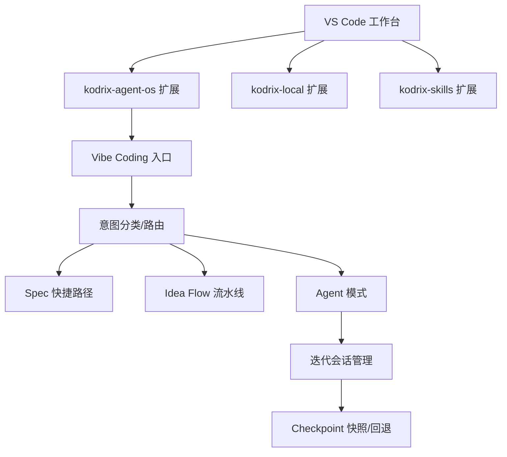
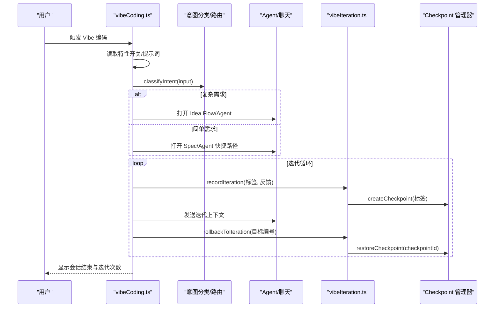
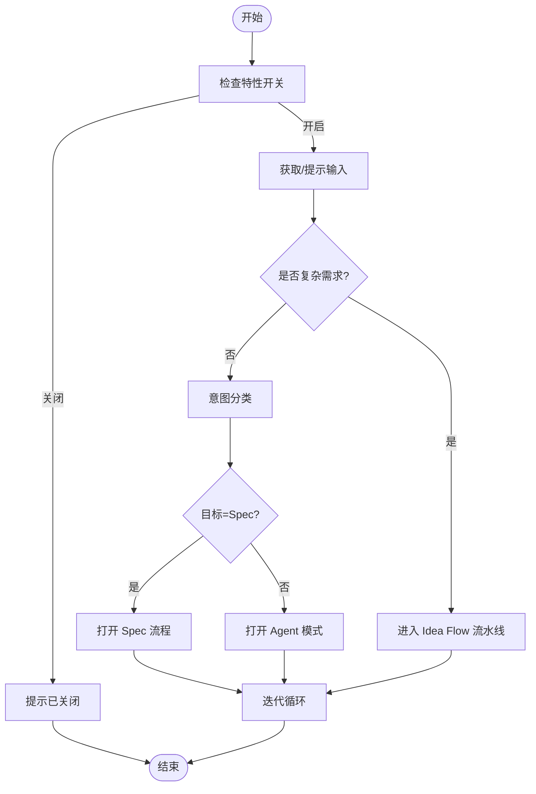
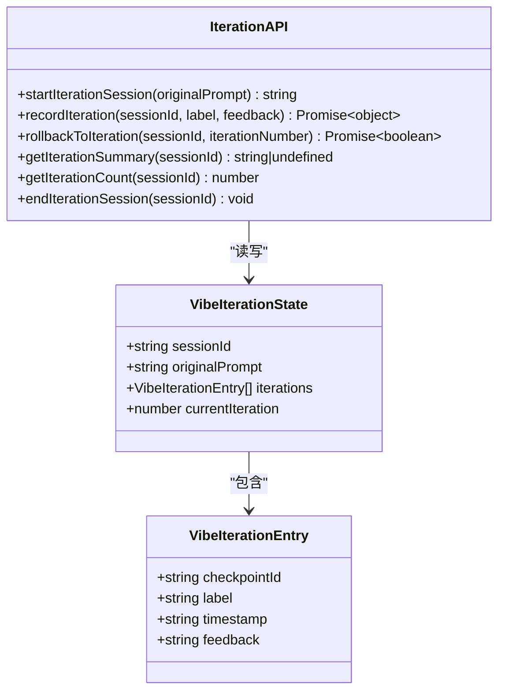
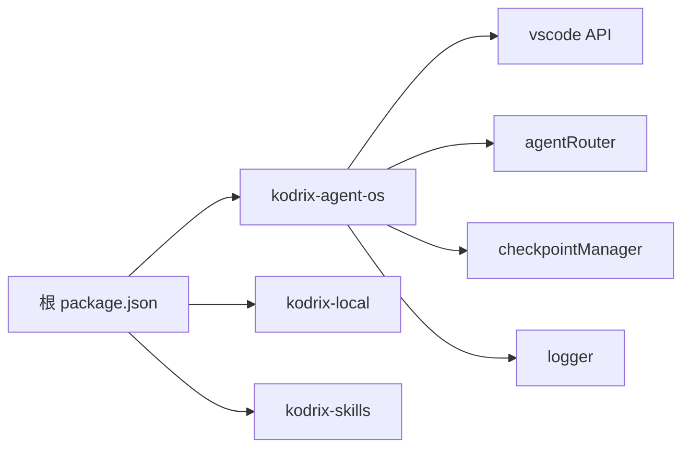

# Vibe编码迭代系统

<cite>
**本文引用的文件**
- [README.md](file://README.md)
- [package.json](file://package.json)
- [product.json](file://product.json)
- [AGENTS.md](file://AGENTS.md)
- [extensions/kodrix-agent-os/package.json](file://extensions/kodrix-agent-os/package.json)
- [extensions/kodrix-local/package.json](file://extensions/kodrix-local/package.json)
- [extensions/kodrix-skills/package.json](file://extensions/kodrix-skills/package.json)
- [extensions/kodrix-agent-os/src/extension.ts](file://extensions/kodrix-agent-os/src/extension.ts)
- [extensions/kodrix-agent-os/src/experience/vibeCoding.ts](file://extensions/kodrix-agent-os/src/experience/vibeCoding.ts)
- [extensions/kodrix-agent-os/src/experience/vibeIteration.ts](file://extensions/kodrix-agent-os/src/experience/vibeIteration.ts)
</cite>

## 目录
1. [简介](#简介)
2. [项目结构](#项目结构)
3. [核心组件](#核心组件)
4. [架构总览](#架构总览)
5. [详细组件分析](#详细组件分析)
6. [依赖关系分析](#依赖关系分析)
7. [性能与可维护性](#性能与可维护性)
8. [故障排查指南](#故障排查指南)
9. [结论](#结论)
10. [附录](#附录)

## 简介
本仓库是 Kodrix Code：基于 VS Code / VSCodium 的 AI 原生代码编辑器，深度集成多 Agent 协作、智能补全、Idea Flow、Vibe Coding 等能力。Vibe 编码迭代系统是其中的关键体验：用户以自然语言描述需求，系统自动路由到 Spec/Idea Flow/Agent 快捷路径，并在迭代过程中通过 Checkpoint 实现版本回退与时间线管理，让“想法驱动开发”成为可操作的工作流。

## 项目结构
- 根层：产品配置（product.json）、脚本与构建（scripts、build）、测试（test）、文档（docs）。
- 扩展层：内置扩展集中在 extensions/，其中 kodrix-* 系列为本次迭代系统的核心：
  - kodrix-agent-os：Agent OS，包含 Vibe Coding、Idea Flow、Codebase、Checkpoint、Crew、Kanban 等。
  - kodrix-local：本地模型与 Provider 工作区、迁移、导入等。
  - kodrix-skills：Skill 市场与安装卸载。
- 源码层：src/ 提供 VS Code 框架与主进程入口；extensions/ 中的 TypeScript 源码负责具体功能。

图表来源
- [extensions/kodrix-agent-os/src/experience/vibeCoding.ts:29-76](file://extensions/kodrix-agent-os/src/experience/vibeCoding.ts#L29-L76)
- [extensions/kodrix-agent-os/src/experience/vibeIteration.ts:33-73](file://extensions/kodrix-agent-os/src/experience/vibeIteration.ts#L33-L73)

章节来源
- [README.md:22-34](file://README.md#L22-L34)
- [AGENTS.md:9-56](file://AGENTS.md#L9-L56)

## 核心组件
- Vibe 编码入口：接收用户自然语言需求，判断复杂度并路由到不同路径。
- 意图分类与路由：根据关键词与长度启发式决定走 Spec、Idea Flow 或 Agent 快捷路径。
- 迭代会话管理：维护会话级状态，记录每次迭代的标签、时间与反馈。
- Checkpoint 集成：每轮迭代自动创建检查点，支持回退到任意历史版本。
- 扩展注册：在 kodrix-agent-os 扩展中注册命令、视图、菜单与设置渲染器。

章节来源
- [extensions/kodrix-agent-os/src/experience/vibeCoding.ts:29-76](file://extensions/kodrix-agent-os/src/experience/vibeCoding.ts#L29-L76)
- [extensions/kodrix-agent-os/src/experience/vibeIteration.ts:33-73](file://extensions/kodrix-agent-os/src/experience/vibeIteration.ts#L33-L73)
- [extensions/kodrix-agent-os/package.json:23-83](file://extensions/kodrix-agent-os/package.json#L23-L83)

## 架构总览
Vibe 编码迭代系统围绕“输入→路由→执行→快照→回退”的主循环组织：
- 输入：用户通过命令或快捷键触发 vibeCode()。
- 路由：根据提示词复杂度选择 Spec/Idea Flow/Agent。
- 执行：打开 Agent 聊天窗口并注入上下文。
- 快照：每次迭代前创建 Checkpoint。
- 回退：通过 QuickPick 选择历史版本并恢复。

图表来源
- [extensions/kodrix-agent-os/src/experience/vibeCoding.ts:29-76](file://extensions/kodrix-agent-os/src/experience/vibeCoding.ts#L29-L76)
- [extensions/kodrix-agent-os/src/experience/vibeCoding.ts:107-211](file://extensions/kodrix-agent-os/src/experience/vibeCoding.ts#L107-L211)
- [extensions/kodrix-agent-os/src/experience/vibeIteration.ts:49-102](file://extensions/kodrix-agent-os/src/experience/vibeIteration.ts#L49-L102)

## 详细组件分析

### Vibe 编码入口与路由
- 入口函数 vibeCode() 会：
  - 检查特性开关（kodrix.features.vibeCoding）。
  - 获取或提示用户输入需求。
  - 使用 shouldUseFullPipeline() 判断是否进入完整 Idea Flow。
  - 否则调用 classifyIntent() 进行意图分类，并跳转到 Spec 或 Agent 快捷路径。
- 快捷入口 quickVibe() 提供预设模板，便于快速启动。

图表来源
- [extensions/kodrix-agent-os/src/experience/vibeCoding.ts:29-76](file://extensions/kodrix-agent-os/src/experience/vibeCoding.ts#L29-L76)
- [extensions/kodrix-agent-os/src/experience/vibeCoding.ts:78-97](file://extensions/kodrix-agent-os/src/experience/vibeCoding.ts#L78-L97)

章节来源
- [extensions/kodrix-agent-os/src/experience/vibeCoding.ts:29-76](file://extensions/kodrix-agent-os/src/experience/vibeCoding.ts#L29-L76)
- [extensions/kodrix-agent-os/src/experience/vibeCoding.ts:223-254](file://extensions/kodrix-agent-os/src/experience/vibeCoding.ts#L223-L254)

### 迭代会话与 Checkpoint 集成
- 会话生命周期：startIterationSession → recordIteration → rollbackToIteration → endIterationSession。
- 每次迭代自动创建 Checkpoint，保存 checkpointId、标签、时间与可选反馈。
- 回退时根据迭代编号定位目标 Checkpoint 并恢复。
- 摘要与计数用于 UI 展示与决策。

图表来源
- [extensions/kodrix-agent-os/src/experience/vibeIteration.ts:14-28](file://extensions/kodrix-agent-os/src/experience/vibeIteration.ts#L14-L28)
- [extensions/kodrix-agent-os/src/experience/vibeIteration.ts:33-138](file://extensions/kodrix-agent-os/src/experience/vibeIteration.ts#L33-L138)

章节来源
- [extensions/kodrix-agent-os/src/experience/vibeIteration.ts:33-138](file://extensions/kodrix-agent-os/src/experience/vibeIteration.ts#L33-L138)

### 扩展注册与贡献点
- 命令：大量 kodrix.* 命令暴露给工作区（如 vibe.start、spec.create、checkpoint.* 等）。
- 视图与容器：agent Kanban、checkpoints、skills marketplace 等。
- 设置渲染器：自定义设置页（kodrix.settings、providerSettings）。
- 本地化：声明 zh-cn 翻译文件路径，配合 NLS 机制。

章节来源
- [extensions/kodrix-agent-os/package.json:23-83](file://extensions/kodrix-agent-os/package.json#L23-L83)
- [extensions/kodrix-agent-os/package.json:587-800](file://extensions/kodrix-agent-os/package.json#L587-L800)
- [extensions/kodrix-local/package.json:23-47](file://extensions/kodrix-local/package.json#L23-L47)
- [extensions/kodrix-skills/package.json:19-51](file://extensions/kodrix-skills/package.json#L19-L51)

### 与核心扩展的集成
- 主扩展入口 extension.ts 注册 Vibe Coding、Idea Flow、Codebase、Index、Settings 等能力。
- 通过命令与工作区配置联动，确保功能可按需启用。

章节来源
- [extensions/kodrix-agent-os/src/extension.ts:41-65](file://extensions/kodrix-agent-os/src/extension.ts#L41-L65)

## 依赖关系分析
- 运行时依赖：
  - vscode API：l10n、window、workspace、commands 等。
  - 内部模块：router/agentRouter、checkpoint/checkpointManager、logger。
- 扩展间耦合：
  - kodrix-agent-os 作为编排中心，协调 Spec、Idea Flow、Agent、Checkpoint。
  - kodrix-local 提供 Provider/模型路由与迁移。
  - kodrix-skills 提供 Skill 市场与安装。
- 构建与脚本：
  - 根 package.json 提供编译、打包、测试等脚本。
  - 各扩展独立 compile/watch/test 脚本。

图表来源
- [package.json:12-99](file://package.json#L12-L99)
- [extensions/kodrix-agent-os/src/experience/vibeCoding.ts:10-20](file://extensions/kodrix-agent-os/src/experience/vibeCoding.ts#L10-L20)
- [extensions/kodrix-agent-os/src/experience/vibeIteration.ts:10-12](file://extensions/kodrix-agent-os/src/experience/vibeIteration.ts#L10-L12)

章节来源
- [package.json:12-99](file://package.json#L12-L99)
- [extensions/kodrix-agent-os/package.json:23-83](file://extensions/kodrix-agent-os/package.json#L23-L83)

## 性能与可维护性
- 路由策略采用轻量启发式（关键词匹配、长度阈值），避免重型 LLM 前置判断，降低首屏延迟。
- 迭代过程通过 Checkpoint 减少重复计算与回滚成本，提升用户体验。
- 建议：
  - 将 shouldUseFullPipeline 的规则参数化，便于 A/B 测试与调优。
  - 对长文本输入做截断与摘要，减少上下文体积。
  - 对 Checkpoint 存储增加压缩与清理策略，控制磁盘增长。

## 故障排查指南
- 常见问题与定位：
  - 特性未启用：检查 kodrix.features.vibeCoding 开关。
  - 路由异常：核对输入长度与关键词命中情况。
  - 回退失败：确认对应迭代是否存在有效 checkpointId。
  - 国际化缺失：确认 l10n.t 的 key 是否在 NLS 文件中存在。
- 日志与调试：
  - 查看 logger 输出，定位会话生命周期与错误堆栈。
  - 使用工作区命令与视图（如 checkpoints）验证状态。

章节来源
- [extensions/kodrix-agent-os/src/experience/vibeCoding.ts:29-34](file://extensions/kodrix-agent-os/src/experience/vibeCoding.ts#L29-L34)
- [extensions/kodrix-agent-os/src/experience/vibeIteration.ts:82-102](file://extensions/kodrix-agent-os/src/experience/vibeIteration.ts#L82-L102)

## 结论
Vibe 编码迭代系统将“想法驱动开发”落地为可操作的闭环：从自然语言输入到智能路由、再到带快照的迭代与回退。该体系与 kodrix-agent-os 的其他能力（Spec、Idea Flow、Codebase、Checkpoint）紧密耦合，形成完整的本地 AI 开发体验。后续可在路由策略、上下文管理与存储优化方面持续改进。

## 附录
- 产品与运行环境：
  - 基线：VS Code 1.128.0 · Electron 42.x · Node 24.17+（同 major）。
  - 品牌与协议：product.json 定义产品名称、数据目录、许可等。
- 快速开始与脚本：
  - 根 package.json 提供 dev、compile、package 等脚本。
  - 参考 README 与 AGENTS 中的开发与构建说明。

章节来源
- [README.md:8-11](file://README.md#L8-L11)
- [README.md:45-67](file://README.md#L45-L67)
- [product.json:1-10](file://product.json#L1-L10)
- [package.json:12-99](file://package.json#L12-L99)