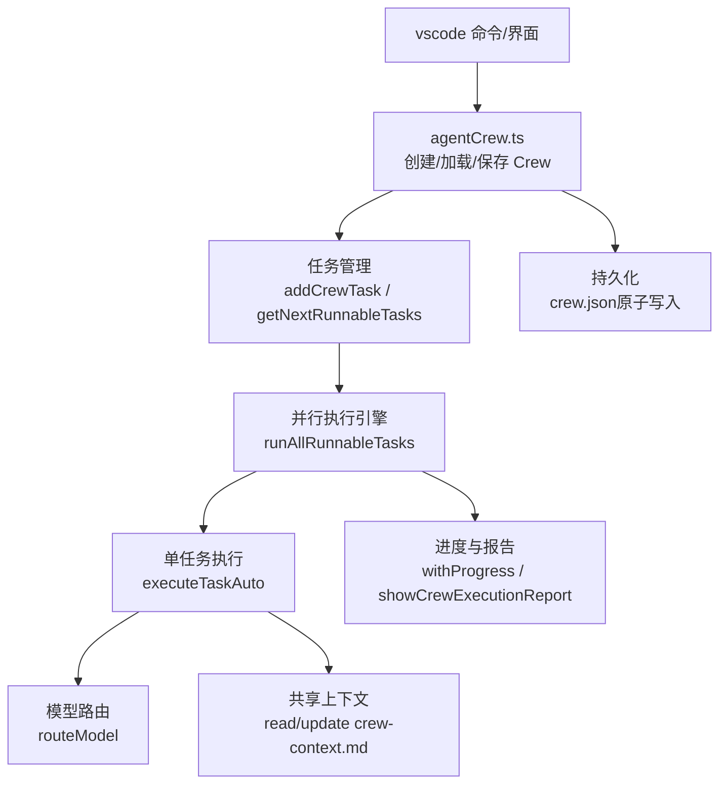
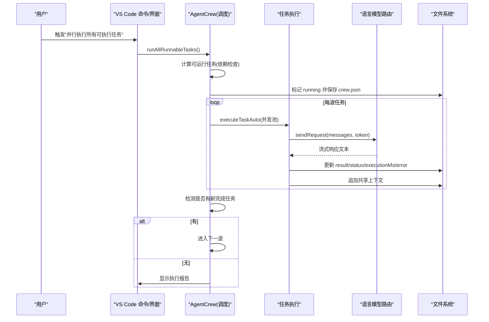
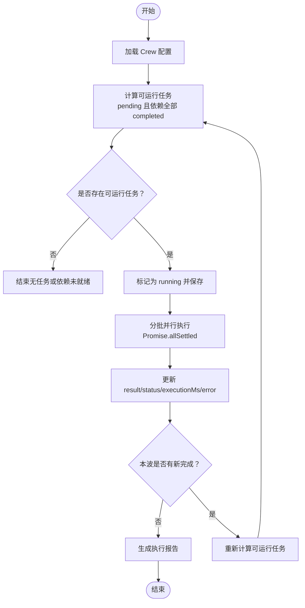
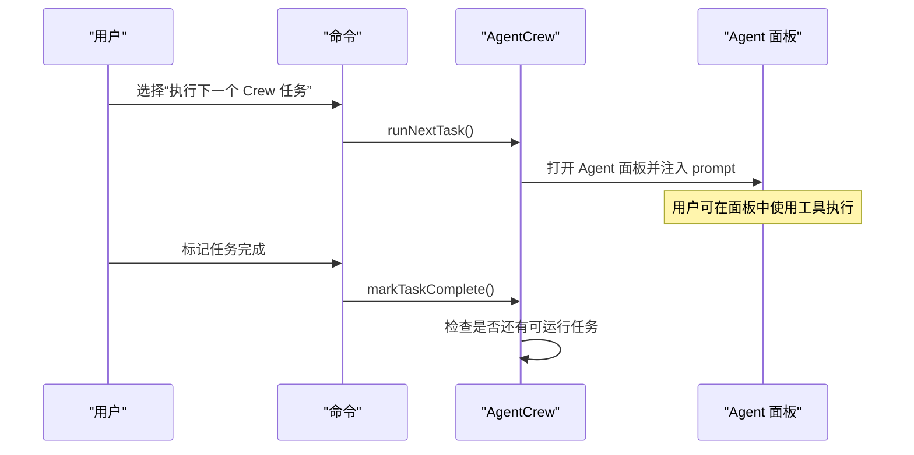
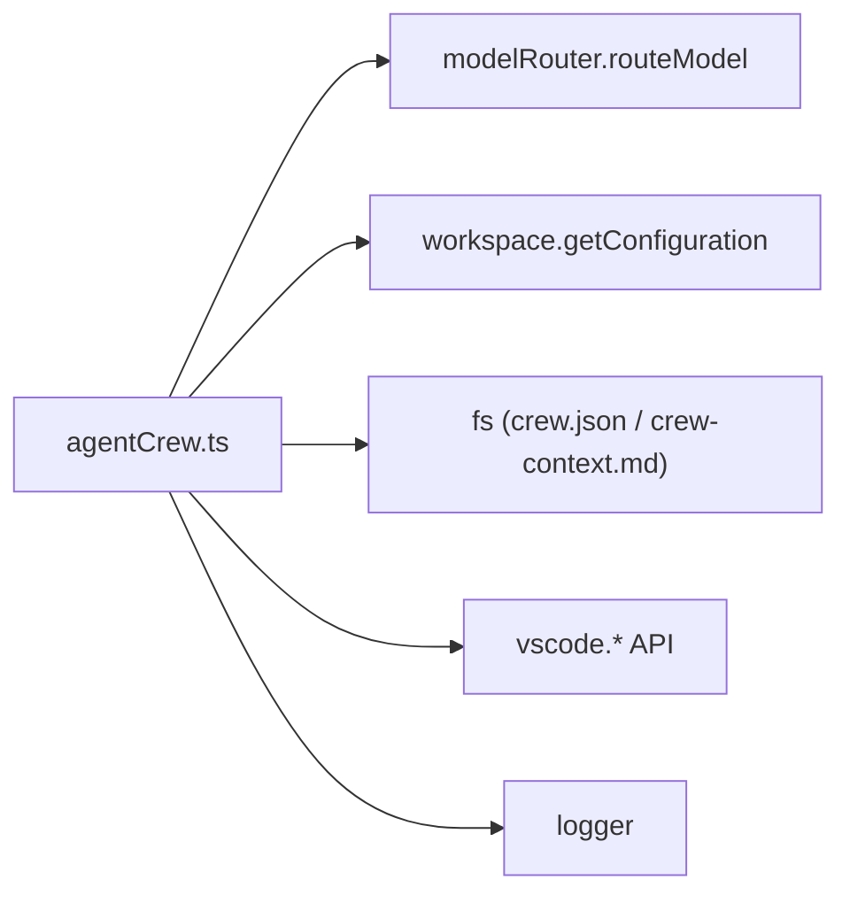

# 多 Agent 协作构建

<cite>
**本文引用的文件**
- [agentCrew.ts](file://extensions/kodrix-agent-os/src/crew/agentCrew.ts)
- [项目非常有必要新实现的核心功能总报告.md](file://docs/项目非常有必要新实现的核心功能总报告.md)
</cite>

## 目录
1. [简介](#简介)
2. [项目结构](#项目结构)
3. [核心组件](#核心组件)
4. [架构总览](#架构总览)
5. [详细组件分析](#详细组件分析)
6. [依赖关系分析](#依赖关系分析)
7. [性能考量](#性能考量)
8. [故障排查指南](#故障排查指南)
9. [结论](#结论)
10. [附录](#附录)

## 简介
本文件面向团队协作，系统化阐述 Idea Flow 中的“多 Agent 协作构建”能力：以 Agent Crew 为核心，提供角色分工、任务调度、状态推进、自动与手动双模式执行、跨 Agent 上下文传递、进度可视化与执行报告等完整闭环。文档聚焦以下目标：
- 解释 Agent Crew 的执行机制（角色分配、任务调度、状态管理）
- 对比自动执行与手动执行的差异（autoExecute 配置项、任务推进机制、进度监控）
- 明确各 Agent 角色的职责与工具权限（架构师、开发者、测试者、审查者等）
- 给出从任务启动到完成的端到端流程示例
- 说明错误处理、超时管理、重试策略等健壮性设计
- 展示与 VS Code 聊天界面的集成方式及实时反馈

## 项目结构
Agent Crew 的实现位于扩展 kodrix-agent-os 的 crew 模块中，核心文件为 agentCrew.ts，负责：
- 定义 Crew 配置、Agent 角色、任务结构与工作流类型
- 创建/加载/保存 Crew 配置（原子写入）
- 任务添加、依赖解析、可运行任务计算
- 并行执行引擎（按波次 + 并发池）
- 自动/手动两种执行模式
- 共享上下文与执行报告生成
- 与 VS Code 命令、模型路由、用户配置的集成

图表来源
- [agentCrew.ts:144-173](file://extensions/kodrix-agent-os/src/crew/agentCrew.ts#L144-L173)
- [agentCrew.ts:238-304](file://extensions/kodrix-agent-os/src/crew/agentCrew.ts#L238-L304)
- [agentCrew.ts:325-331](file://extensions/kodrix-agent-os/src/crew/agentCrew.ts#L325-L331)
- [agentCrew.ts:515-572](file://extensions/kodrix-agent-os/src/crew/agentCrew.ts#L515-L572)
- [agentCrew.ts:462-508](file://extensions/kodrix-agent-os/src/crew/agentCrew.ts#L462-L508)
- [agentCrew.ts:423-456](file://extensions/kodrix-agent-os/src/crew/agentCrew.ts#L423-L456)

章节来源
- [agentCrew.ts:144-173](file://extensions/kodrix-agent-os/src/crew/agentCrew.ts#L144-L173)
- [agentCrew.ts:238-304](file://extensions/kodrix-agent-os/src/crew/agentCrew.ts#L238-L304)
- [agentCrew.ts:325-331](file://extensions/kodrix-agent-os/src/crew/agentCrew.ts#L325-L331)
- [agentCrew.ts:515-572](file://extensions/kodrix-agent-os/src/crew/agentCrew.ts#L515-L572)
- [agentCrew.ts:462-508](file://extensions/kodrix-agent-os/src/crew/agentCrew.ts#L462-L508)
- [agentCrew.ts:423-456](file://extensions/kodrix-agent-os/src/crew/agentCrew.ts#L423-L456)

## 核心组件
- Crew 配置与持久化
  - 支持顺序/并行/审批门三种工作流
  - 原子写入 crew.json，避免进程崩溃导致数据损坏
- Agent 角色与系统提示词
  - 内置角色：architect、coder、reviewer、tester、devops、custom
  - 每个角色具备独立的 systemPrompt 与 tools 白名单
- 任务与依赖图
  - 任务包含标题、描述、分配角色、依赖列表、状态、执行模式、结果、耗时、错误信息
  - 通过依赖关系计算“可运行任务集合”，实现 DAG 推进
- 并行执行引擎
  - 按波次执行：同波内任务相互独立，使用 Promise.allSettled 并发执行
  - 受限并发池：通过 chunkTasks 控制每批并发数
  - 自动写回结果并级联触发下一波
- 自动/手动双模式
  - auto：后台并行 LLM 执行，完成后自动推进
  - chat：打开 Agent 面板带工具执行，完成后需手动标记完成
- 共享上下文与执行报告
  - 跨 Agent 传递此前任务成果摘要（crew-context.md）
  - 执行结束后生成 Markdown 报告，汇总状态、明细、待办提示

章节来源
- [agentCrew.ts:72-80](file://extensions/kodrix-agent-os/src/crew/agentCrew.ts#L72-L80)
- [agentCrew.ts:84-140](file://extensions/kodrix-agent-os/src/crew/agentCrew.ts#L84-L140)
- [agentCrew.ts:50-68](file://extensions/kodrix-agent-os/src/crew/agentCrew.ts#L50-L68)
- [agentCrew.ts:312-331](file://extensions/kodrix-agent-os/src/crew/agentCrew.ts#L312-L331)
- [agentCrew.ts:515-572](file://extensions/kodrix-agent-os/src/crew/agentCrew.ts#L515-L572)
- [agentCrew.ts:423-456](file://extensions/kodrix-agent-os/src/crew/agentCrew.ts#L423-L456)
- [agentCrew.ts:575-618](file://extensions/kodrix-agent-os/src/crew/agentCrew.ts#L575-L618)

## 架构总览
下图展示了从用户触发到任务完成的整体调用链路与关键交互点：

图表来源
- [agentCrew.ts:515-572](file://extensions/kodrix-agent-os/src/crew/agentCrew.ts#L515-L572)
- [agentCrew.ts:462-508](file://extensions/kodrix-agent-os/src/crew/agentCrew.ts#L462-L508)
- [agentCrew.ts:423-456](file://extensions/kodrix-agent-os/src/crew/agentCrew.ts#L423-L456)
- [agentCrew.ts:575-618](file://extensions/kodrix-agent-os/src/crew/agentCrew.ts#L575-L618)

## 详细组件分析

### 角色与工具权限
- 架构师（architect）
  - 职责：需求分析、技术方案、模块边界、API 契约、Spec 文档
  - 工具：read_file、search_files、chat
- 开发者（coder）
  - 职责：根据设计实现代码，遵循 Memory/Learning 约定，编写可测试可维护代码，自动运行测试
  - 工具：read_file、search_files、edit_file、terminal
- 审查者（reviewer）
  - 职责：审查变更，检查安全/性能/风格/覆盖，给出修改建议，通过后标记 APPROVED
  - 工具：read_file、search_files、git_diff
- 测试者（tester）
  - 职责：基于代码与 Spec 生成用例，覆盖边界/异常/性能基准，报告结果与缺失覆盖
  - 工具：read_file、search_files、edit_file、terminal
- 运维（devops）
  - 职责：CI/CD、Docker、部署脚本、环境变量/密钥、监控日志
  - 工具：read_file、edit_file、terminal
- 自定义（custom）
  - 职责：自定义角色
  - 工具：read_file、search_files、edit_file、terminal

章节来源
- [agentCrew.ts:84-140](file://extensions/kodrix-agent-os/src/crew/agentCrew.ts#L84-L140)

### 任务与依赖推进
- 任务结构
  - 包含 id、title、description、assignedRole、dependencies、status、mode、result、executionMs、error、时间戳
- 依赖解析
  - 仅当任务处于 pending 且所有依赖均为 completed 时，才视为可运行
- 推进机制
  - 每波任务完成后，若存在新完成的任务，则重新计算可运行任务集，进入下一波
  - chat 模式任务不参与自动执行，保持 pending，等待手动完成

图表来源
- [agentCrew.ts:325-331](file://extensions/kodrix-agent-os/src/crew/agentCrew.ts#L325-L331)
- [agentCrew.ts:515-572](file://extensions/kodrix-agent-os/src/crew/agentCrew.ts#L515-L572)

章节来源
- [agentCrew.ts:50-68](file://extensions/kodrix-agent-os/src/crew/agentCrew.ts#L50-L68)
- [agentCrew.ts:325-331](file://extensions/kodrix-agent-os/src/crew/agentCrew.ts#L325-L331)
- [agentCrew.ts:515-572](file://extensions/kodrix-agent-os/src/crew/agentCrew.ts#L515-L572)

### 自动执行与手动执行
- 自动执行（auto）
  - 后台并行 LLM 执行，无需打开 Agent 面板
  - 完成后自动推进依赖图，输出写入任务结果供下游使用
  - 通过 vscode.lm 发送请求，支持流式响应
- 手动执行（chat）
  - 打开 Agent 面板并注入任务上下文（含上游依赖输出）
  - 由用户在面板中使用工具执行，完成后需手动标记完成
  - 适合需要交互式调试或复杂工具调用的场景

图表来源
- [agentCrew.ts:622-665](file://extensions/kodrix-agent-os/src/crew/agentCrew.ts#L622-L665)
- [agentCrew.ts:667-707](file://extensions/kodrix-agent-os/src/crew/agentCrew.ts#L667-L707)

章节来源
- [agentCrew.ts:267-278](file://extensions/kodrix-agent-os/src/crew/agentCrew.ts#L267-L278)
- [agentCrew.ts:622-665](file://extensions/kodrix-agent-os/src/crew/agentCrew.ts#L622-L665)
- [agentCrew.ts:667-707](file://extensions/kodrix-agent-os/src/crew/agentCrew.ts#L667-L707)

### 进度监控与执行报告
- 进度通知
  - 使用 withProgress 在通知区域显示并行执行进度
- 执行报告
  - 生成 Markdown 文档，包含汇总统计、任务明细、错误信息、待办提示
  - 对 chat 模式任务给出操作指引

章节来源
- [agentCrew.ts:532-572](file://extensions/kodrix-agent-os/src/crew/agentCrew.ts#L532-L572)
- [agentCrew.ts:575-618](file://extensions/kodrix-agent-os/src/crew/agentCrew.ts#L575-L618)

### 跨 Agent 上下文传递
- 共享上下文文件
  - 路径：工作区 .kodrix/crew-context.md
  - 读取此前任务的成果摘要，限制最大字符数
- 注入下游任务
  - buildTaskContext 将上游依赖输出拼接为“上游依赖上下文”
  - 同时附加团队共享上下文，确保跨 Agent 的知识延续

章节来源
- [agentCrew.ts:349-398](file://extensions/kodrix-agent-os/src/crew/agentCrew.ts#L349-L398)
- [agentCrew.ts:423-456](file://extensions/kodrix-agent-os/src/crew/agentCrew.ts#L423-L456)

### 端到端执行流程示例
- 创建 Crew
  - 输入名称、选择工作流（顺序/并行/审批门）、选择参与角色
  - 保存 crew.json
- 添加任务
  - 输入标题与描述，分配角色，选择执行模式（auto/chat），选择前置依赖
- 并行执行
  - 计算可运行任务，标记 running，分批并发执行
  - 自动写回结果与状态，级联下一波
- 手动执行
  - 打开 Agent 面板，注入上下文，用户使用工具执行
  - 完成后手动标记，继续推进
- 查看状态与报告
  - 显示进度条与统计，生成执行报告文档

章节来源
- [agentCrew.ts:177-234](file://extensions/kodrix-agent-os/src/crew/agentCrew.ts#L177-L234)
- [agentCrew.ts:238-304](file://extensions/kodrix-agent-os/src/crew/agentCrew.ts#L238-L304)
- [agentCrew.ts:515-572](file://extensions/kodrix-agent-os/src/crew/agentCrew.ts#L515-L572)
- [agentCrew.ts:622-707](file://extensions/kodrix-agent-os/src/crew/agentCrew.ts#L622-L707)
- [agentCrew.ts:711-761](file://extensions/kodrix-agent-os/src/crew/agentCrew.ts#L711-L761)

## 依赖关系分析
- 内部依赖
  - 模型路由：selectCrewModel 通过 routeModel 选择合适模型
  - 用户配置：读取 maxParallel、timeoutMs 等配置项
  - 文件系统：原子写入 crew.json；读写共享上下文
- 外部依赖
  - VS Code API：window、workspace、commands、LanguageModelChatMessage
  - 日志：logger 记录执行与错误信息

图表来源
- [agentCrew.ts:403-411](file://extensions/kodrix-agent-os/src/crew/agentCrew.ts#L403-L411)
- [agentCrew.ts:476-478](file://extensions/kodrix-agent-os/src/crew/agentCrew.ts#L476-L478)
- [agentCrew.ts:144-173](file://extensions/kodrix-agent-os/src/crew/agentCrew.ts#L144-L173)
- [agentCrew.ts:423-456](file://extensions/kodrix-agent-os/src/crew/agentCrew.ts#L423-L456)

章节来源
- [agentCrew.ts:403-411](file://extensions/kodrix-agent-os/src/crew/agentCrew.ts#L403-L411)
- [agentCrew.ts:476-478](file://extensions/kodrix-agent-os/src/crew/agentCrew.ts#L476-L478)
- [agentCrew.ts:144-173](file://extensions/kodrix-agent-os/src/crew/agentCrew.ts#L144-L173)
- [agentCrew.ts:423-456](file://extensions/kodrix-agent-os/src/crew/agentCrew.ts#L423-L456)

## 性能考量
- 并行执行
  - 使用 Promise.allSettled 保证单任务失败不阻塞同波其他任务
  - 通过 chunkTasks 控制并发上限，避免资源争用
- 超时管理
  - 每个任务设置超时（可配置），到达后取消请求，防止长时间占用
- 原子写入
  - 先写临时文件再 rename，避免进程崩溃产生不完整配置
- 上下文截断
  - 依赖输出与共享上下文均进行字符数限制，控制消息大小
- 进度反馈
  - withProgress 提供实时执行状态，提升用户体验

章节来源
- [agentCrew.ts:312-331](file://extensions/kodrix-agent-os/src/crew/agentCrew.ts#L312-L331)
- [agentCrew.ts:476-478](file://extensions/kodrix-agent-os/src/crew/agentCrew.ts#L476-L478)
- [agentCrew.ts:164-173](file://extensions/kodrix-agent-os/src/crew/agentCrew.ts#L164-L173)
- [agentCrew.ts:349-398](file://extensions/kodrix-agent-os/src/crew/agentCrew.ts#L349-L398)
- [agentCrew.ts:532-572](file://extensions/kodrix-agent-os/src/crew/agentCrew.ts#L532-L572)

## 故障排查指南
- 无可用语言模型
  - 现象：任务失败，错误提示“无可用语言模型”
  - 处理：在 Manage Models 中配置 BYOK 模型
- 模型无响应输出
  - 现象：任务结果为空，状态为 failed
  - 处理：检查网络与模型可用性，适当增加超时或重试
- 超时中断
  - 现象：任务被取消，状态为 failed
  - 处理：调整超时配置，优化任务复杂度或拆分任务
- 依赖未就绪
  - 现象：没有可执行任务
  - 处理：检查前置任务状态，确保依赖已完成
- chat 模式任务未执行
  - 现象：自动执行跳过该任务
  - 处理：使用“执行下一个 Crew 任务”在 Agent 面板中手动完成

章节来源
- [agentCrew.ts:462-508](file://extensions/kodrix-agent-os/src/crew/agentCrew.ts#L462-L508)
- [agentCrew.ts:515-572](file://extensions/kodrix-agent-os/src/crew/agentCrew.ts#L515-L572)
- [agentCrew.ts:622-707](file://extensions/kodrix-agent-os/src/crew/agentCrew.ts#L622-L707)

## 结论
Agent Crew 提供了完善的多 Agent 协作构建能力：通过角色分工、依赖驱动的任务图、并行执行引擎与自动/手动双模式，实现了高效、可控、可观测的团队自动化构建流程。结合共享上下文与执行报告，既保证了跨 Agent 的知识延续，也提供了清晰的进度与结果反馈。对于团队协作而言，这是一种兼顾效率与可靠性的解决方案。

## 附录
- 差异化能力与路线图
  - 多 Agent 同文件冲突检测与合并策略
  - 语义代码理解与 Wiki 2.0
  - Vibe Coding 深化（迭代式小改与自动 Checkpoint）

章节来源
- [项目非常有必要新实现的核心功能总报告.md:64-117](file://docs/项目非常有必要新实现的核心功能总报告.md#L64-L117)