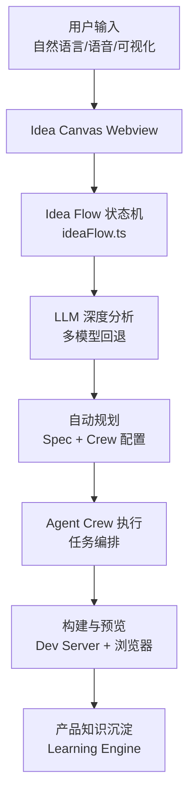
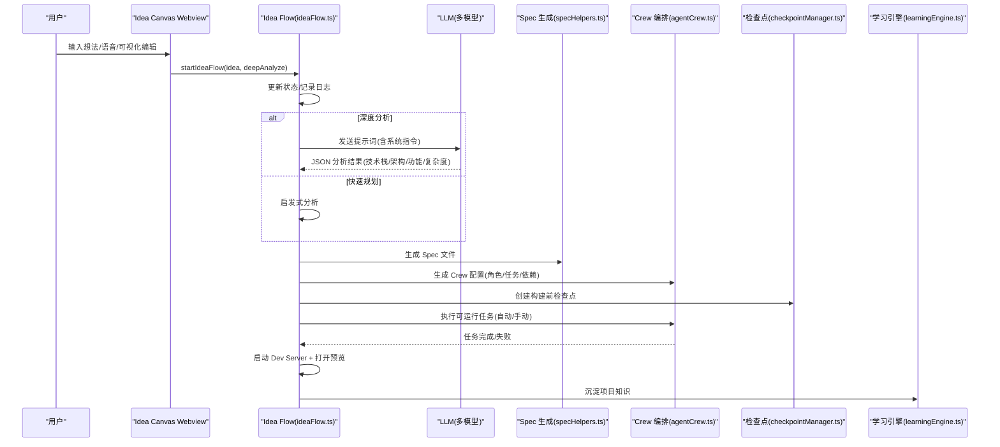
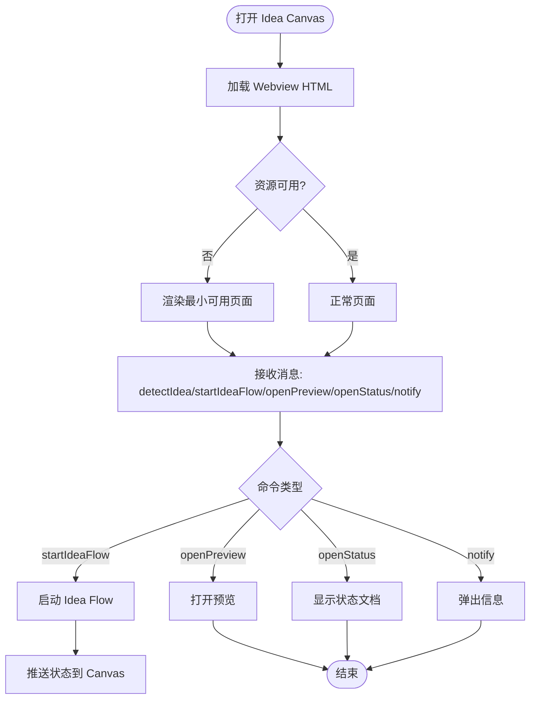
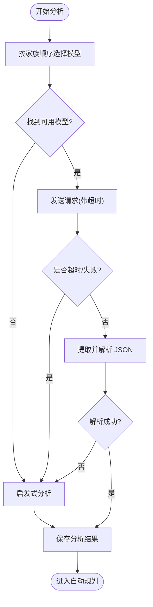
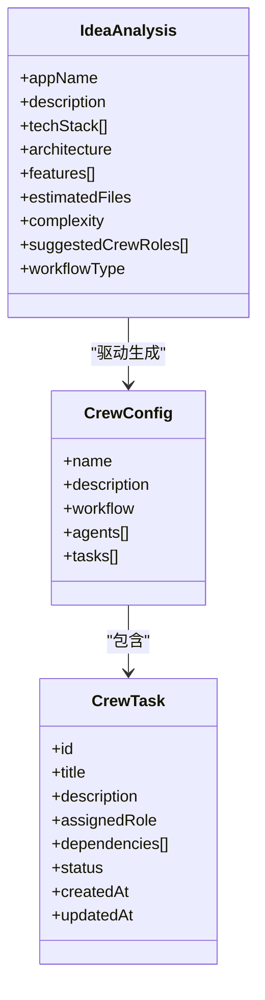
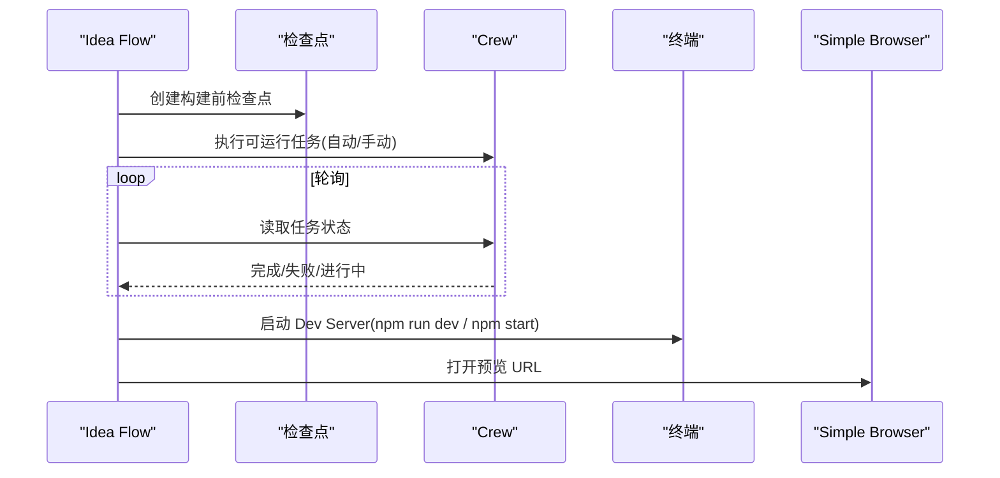
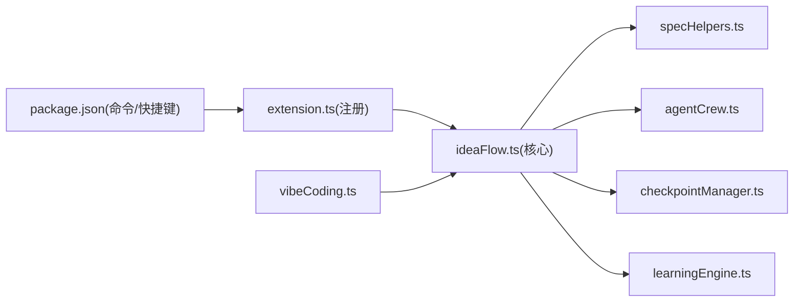

# 想法输入与分析

<cite>
**本文引用的文件**
- [ideaFlow.ts](file://extensions/kodrix-agent-os/src/experience/ideaFlow.ts)
- [constants.ts](file://extensions/kodrix-agent-os/src/shared/constants.ts)
- [package.json](file://extensions/kodrix-agent-os/package.json)
- [vibeCoding.ts](file://extensions/kodrix-agent-os/src/experience/vibeCoding.ts)
- [extension.ts](file://extensions/kodrix-agent-os/src/extension.ts)
- [agentCrew.ts](file://extensions/kodrix-agent-os/src/crew/agentCrew.ts)
- [specHelpers.ts](file://extensions/kodrix-agent-os/src/spec/specHelpers.ts)
- [checkpointManager.ts](file://extensions/kodrix-agent-os/src/checkpoint/checkpointManager.ts)
- [learningEngine.ts](file://extensions/kodrix-agent-os/src/learning/learningEngine.ts)
</cite>

## 目录
1. [简介](#简介)
2. [项目结构](#项目结构)
3. [核心组件](#核心组件)
4. [架构总览](#架构总览)
5. [详细组件分析](#详细组件分析)
6. [依赖关系分析](#依赖关系分析)
7. [性能与可靠性](#性能与可靠性)
8. [故障排查指南](#故障排查指南)
9. [结论](#结论)
10. [附录：使用示例与参数调优](#附录使用示例与参数调优)

## 简介
Idea Flow 是“从想法到产品”的全自动流水线。用户只需描述一个产品想法，系统即可进行深度分析、自动生成需求规格与架构、编排多 Agent 协作开发、构建验证并打开预览，同时将沉淀的产品知识注入学习引擎，形成“越用越聪明”的闭环。本文聚焦“想法输入与分析阶段”，覆盖自然语言输入、语音输入（通过 IDE 能力接入）、可视化编辑（Idea Canvas），以及 LLM 深度分析、技术栈推荐、架构建议、功能特性提取、复杂度评估、模型选择与回退、超时与错误恢复等关键机制。

## 项目结构
Idea Flow 的核心位于扩展 kodrix-agent-os 的 experience 层，围绕 ideaFlow.ts 组织状态机、Webview 交互、LLM 调用、规划与 Crew 编排；共享常量集中在 constants.ts；命令与快捷键在 package.json 中声明；与 Vibe Coding、Agent Crew、Spec、Checkpoint、Learning Engine 的集成贯穿整个流程。

图表来源
- [ideaFlow.ts:307-359](file://extensions/kodrix-agent-os/src/experience/ideaFlow.ts#L307-L359)
- [constants.ts:212-239](file://extensions/kodrix-agent-os/src/shared/constants.ts#L212-L239)

章节来源
- [ideaFlow.ts:1-176](file://extensions/kodrix-agent-os/src/experience/ideaFlow.ts#L1-L176)
- [constants.ts:212-239](file://extensions/kodrix-agent-os/src/shared/constants.ts#L212-L239)
- [package.json:270-288](file://extensions/kodrix-agent-os/package.json#L270-L288)

## 核心组件
- Idea Flow 状态机：管理阶段流转、持久化、日志、事件推送与 UI 同步。
- LLM 分析与回退：按模型家族顺序尝试，失败或超时时降级为启发式分析。
- 自动规划：生成 Spec 文件与 Agent Crew 配置，支持顺序/并行工作流。
- 构建与预览：自动创建检查点、执行可运行任务、轮询进度、启动 Dev Server 并打开预览。
- 产品智能：将项目知识写入 Learning Engine，辅助后续上下文注入与智能路由。

章节来源
- [ideaFlow.ts:307-359](file://extensions/kodrix-agent-os/src/experience/ideaFlow.ts#L307-L359)
- [ideaFlow.ts:364-444](file://extensions/kodrix-agent-os/src/experience/ideaFlow.ts#L364-L444)
- [ideaFlow.ts:526-638](file://extensions/kodrix-agent-os/src/experience/ideaFlow.ts#L526-L638)
- [ideaFlow.ts:679-845](file://extensions/kodrix-agent-os/src/experience/ideaFlow.ts#L679-L845)
- [ideaFlow.ts:894-929](file://extensions/kodrix-agent-os/src/experience/ideaFlow.ts#L894-L929)

## 架构总览
Idea Flow 以状态机驱动，贯穿“输入→分析→规划→构建→预览→沉淀”全链路。UI 通过 Webview 实时展示状态与日志；后端通过 VS Code API 与 LLM、Crew、Spec、Checkpoint、Learning Engine 等子系统交互。

图表来源
- [ideaFlow.ts:307-359](file://extensions/kodrix-agent-os/src/experience/ideaFlow.ts#L307-L359)
- [ideaFlow.ts:364-444](file://extensions/kodrix-agent-os/src/experience/ideaFlow.ts#L364-L444)
- [ideaFlow.ts:526-638](file://extensions/kodrix-agent-os/src/experience/ideaFlow.ts#L526-L638)
- [ideaFlow.ts:679-845](file://extensions/kodrix-agent-os/src/experience/ideaFlow.ts#L679-L845)
- [ideaFlow.ts:894-929](file://extensions/kodrix-agent-os/src/experience/ideaFlow.ts#L894-L929)

## 详细组件分析

### 想法输入与可视化编辑（Idea Canvas）
- 入口命令：提供“打开 Idea Canvas”和“Idea Flow — 输入想法自动构建”的命令与快捷键，便于从 Hub 或快捷方式进入。
- Webview 交互：Canvas 加载 HTML 资源，若资源不可用则回退到最小可用页面；消息处理包括识别想法、启动流程、打开预览、查看状态、通知等。
- 实时预览与迭代：状态变更通过 postMessage 推送到 Canvas，支持边改边看；构建完成后自动打开预览页。

图表来源
- [ideaFlow.ts:180-259](file://extensions/kodrix-agent-os/src/experience/ideaFlow.ts#L180-L259)
- [ideaFlow.ts:263-303](file://extensions/kodrix-agent-os/src/experience/ideaFlow.ts#L263-L303)
- [package.json:270-288](file://extensions/kodrix-agent-os/package.json#L270-L288)

章节来源
- [ideaFlow.ts:180-303](file://extensions/kodrix-agent-os/src/experience/ideaFlow.ts#L180-L303)
- [package.json:270-288](file://extensions/kodrix-agent-os/package.json#L270-L288)

### 深度分析：LLM 模型选择与回退策略
- 模型选择：按预设的模型家族顺序尝试（如 gpt-4o、gpt-4、claude-3.5-sonnet、copilot-gpt-4），找到首个可用模型即开始请求。
- 超时控制：设置 LLM 分析超时（默认 3 分钟），触发取消令牌并降级。
- 错误恢复：若解析失败或网络异常，自动切换至启发式分析，保证流程不中断。
- 输出规范：要求返回结构化 JSON，包含项目名称、技术栈、架构、功能列表、预估文件数、复杂度、建议角色与工作流类型。

图表来源
- [ideaFlow.ts:364-444](file://extensions/kodrix-agent-os/src/experience/ideaFlow.ts#L364-L444)
- [constants.ts:212-239](file://extensions/kodrix-agent-os/src/shared/constants.ts#L212-L239)

章节来源
- [ideaFlow.ts:364-444](file://extensions/kodrix-agent-os/src/experience/ideaFlow.ts#L364-L444)
- [constants.ts:212-239](file://extensions/kodrix-agent-os/src/shared/constants.ts#L212-L239)

### 自动规划：Spec 与 Crew 生成
- Spec 生成：根据分析结果创建需求与设计文件，便于后续追踪与审阅。
- Crew 生成：基于功能列表生成任务链，分配角色（架构师、开发者、测试者等），设置依赖关系与工作流类型。
- 模式切换：支持端到端自动执行（创建检查点后自动推进所有可运行任务）或手动模式（逐任务推进）。

图表来源
- [ideaFlow.ts:526-638](file://extensions/kodrix-agent-os/src/experience/ideaFlow.ts#L526-L638)
- [agentCrew.ts:1-200](file://extensions/kodrix-agent-os/src/crew/agentCrew.ts#L1-L200)

章节来源
- [ideaFlow.ts:526-638](file://extensions/kodrix-agent-os/src/experience/ideaFlow.ts#L526-L638)
- [agentCrew.ts:1-200](file://extensions/kodrix-agent-os/src/crew/agentCrew.ts#L1-L200)

### 构建与预览：检查点、任务执行与预览打开
- 检查点：构建前创建检查点，确保可回滚。
- 任务执行：自动模式下调用 Crew v2 执行全部可运行任务；手动模式通过 Chat 逐步推进。
- 进度轮询：定时读取 Crew 状态，节流记录进度，避免刷屏。
- 预览打开：检测项目是否存在 package.json 与 Vite 配置，启动相应命令并打开 Simple Browser 或外部浏览器。

图表来源
- [ideaFlow.ts:679-845](file://extensions/kodrix-agent-os/src/experience/ideaFlow.ts#L679-L845)
- [checkpointManager.ts:1-200](file://extensions/kodrix-agent-os/src/checkpoint/checkpointManager.ts#L1-L200)

章节来源
- [ideaFlow.ts:679-845](file://extensions/kodrix-agent-os/src/experience/ideaFlow.ts#L679-L845)
- [checkpointManager.ts:1-200](file://extensions/kodrix-agent-os/src/checkpoint/checkpointManager.ts#L1-L200)

### 产品知识沉淀：Learning Engine 集成
- 在构建完成后，将技术栈、架构、复杂度、功能数量等信息写入学习引擎，增强后续上下文注入与智能决策。
- 向 Canvas 推送建议下一步操作，引导用户使用 Arena 对比优化、智能路由继续增量开发。

章节来源
- [ideaFlow.ts:894-929](file://extensions/kodrix-agent-os/src/experience/ideaFlow.ts#L894-L929)
- [learningEngine.ts:1-200](file://extensions/kodrix-agent-os/src/learning/learningEngine.ts#L1-L200)

## 依赖关系分析
- 命令与快捷键：通过 package.json 注册命令与键绑定，暴露给用户。
- 扩展生命周期：在 extension.ts 中注册 Idea Flow 模块并在合适时机启用。
- 跨模块协作：
  - specHelpers.ts：生成 Spec 文件。
  - agentCrew.ts：定义 Crew 配置与任务执行。
  - checkpointManager.ts：创建与恢复检查点。
  - learningEngine.ts：沉淀项目知识。
  - vibeCoding.ts：智能路由到 Idea Flow。

图表来源
- [package.json:270-288](file://extensions/kodrix-agent-os/package.json#L270-L288)
- [extension.ts:200-220](file://extensions/kodrix-agent-os/src/extension.ts#L200-L220)
- [ideaFlow.ts:1006-1042](file://extensions/kodrix-agent-os/src/experience/ideaFlow.ts#L1006-L1042)
- [vibeCoding.ts:36-40](file://extensions/kodrix-agent-os/src/experience/vibeCoding.ts#L36-L40)

章节来源
- [package.json:270-288](file://extensions/kodrix-agent-os/package.json#L270-L288)
- [extension.ts:200-220](file://extensions/kodrix-agent-os/src/extension.ts#L200-L220)
- [ideaFlow.ts:1006-1042](file://extensions/kodrix-agent-os/src/experience/ideaFlow.ts#L1006-L1042)
- [vibeCoding.ts:36-40](file://extensions/kodrix-agent-os/src/experience/vibeCoding.ts#L36-L40)

## 性能与可靠性
- 超时与节流：LLM 分析超时保护；构建轮询间隔与最大构建时间限制；日志条数上限防止内存膨胀。
- 回退机制：模型不可用时自动降级为启发式分析；JSON 解析失败时同样回退。
- 资源清理：Webview 关闭时清理定时器与事件监听器，避免泄漏。
- 并发控制：Crew 并行任务数与单任务超时可通过配置调整，避免资源爆炸。

章节来源
- [ideaFlow.ts:104-114](file://extensions/kodrix-agent-os/src/experience/ideaFlow.ts#L104-L114)
- [ideaFlow.ts:150-166](file://extensions/kodrix-agent-os/src/experience/ideaFlow.ts#L150-L166)
- [ideaFlow.ts:384-444](file://extensions/kodrix-agent-os/src/experience/ideaFlow.ts#L384-L444)
- [ideaFlow.ts:776-787](file://extensions/kodrix-agent-os/src/experience/ideaFlow.ts#L776-L787)
- [constants.ts:212-239](file://extensions/kodrix-agent-os/src/shared/constants.ts#L212-L239)

## 故障排查指南
- 无可用 LLM 模型：检查模型提供方配置与可用性；系统将自动使用启发式分析。
- 构建超时：查看 Crew 任务状态与日志，确认任务是否卡住；必要时重置 Idea Flow 后重试。
- 预览无法打开：检查工作区是否存在 package.json 与 Vite 配置；确认端口未被占用；尝试手动启动 Dev Server。
- 状态不同步：刷新 Idea Canvas 或重新打开；检查 Webview 控制台是否有错误。

章节来源
- [ideaFlow.ts:384-444](file://extensions/kodrix-agent-os/src/experience/ideaFlow.ts#L384-L444)
- [ideaFlow.ts:776-787](file://extensions/kodrix-agent-os/src/experience/ideaFlow.ts#L776-L787)
- [ideaFlow.ts:847-889](file://extensions/kodrix-agent-os/src/experience/ideaFlow.ts#L847-L889)

## 结论
Idea Flow 将“想法输入—AI 分析—自动规划—多 Agent 协作—构建预览—知识沉淀”整合为一条流畅的流水线，既适合产品经理快速验证创意，也帮助开发者高效落地实现。其多模型回退、超时保护与检查点机制确保了鲁棒性；与 Vibe Coding、Agent Crew、Spec、Learning Engine 的深度集成，使工具具备持续进化的能力。

## 附录：使用示例与参数调优
- 自然语言输入：通过命令面板或快捷键打开 Idea Canvas，输入一句话描述你的产品想法，系统将自动启动深度分析。
- 语音输入：借助 IDE 的语音转文本能力（如 Copilot 或其他语音插件），将语音转为文字后粘贴到输入框，再启动 Idea Flow。
- 可视化编辑：在 Idea Canvas 中直接编辑想法内容，系统会实时检测并提示是否启动流程；也可随时打开预览查看进展。
- 查看分析结果：构建完成后，可在状态文档中查看项目名称、技术栈、架构、复杂度、功能列表与预览链接。
- 调整参数：
  - 自动执行：在设置中开启或关闭“自动执行”，以选择端到端自动或手动逐任务模式。
  - 模型选择：通过模型路由或 Provider 配置选择合适的模型族；若首选模型不可用，系统将自动回退。
  - 超时与并发：调整 LLM 分析超时、构建轮询间隔、最大构建时间与 Crew 并行度，以适应不同环境。
- 与 Idea Canvas 交互：
  - 实时预览：构建完成后自动打开预览；也可手动点击“打开预览”。
  - 迭代修改：在 Canvas 中调整想法或补充约束，重新启动流程以生成新的规划与产物。
  - 查看状态：通过“查看状态”命令打开 Markdown 文档，了解当前阶段与日志。

章节来源
- [package.json:270-288](file://extensions/kodrix-agent-os/package.json#L270-L288)
- [ideaFlow.ts:1006-1042](file://extensions/kodrix-agent-os/src/experience/ideaFlow.ts#L1006-L1042)
- [ideaFlow.ts:847-889](file://extensions/kodrix-agent-os/src/experience/ideaFlow.ts#L847-L889)
- [constants.ts:212-239](file://extensions/kodrix-agent-os/src/shared/constants.ts#L212-L239)