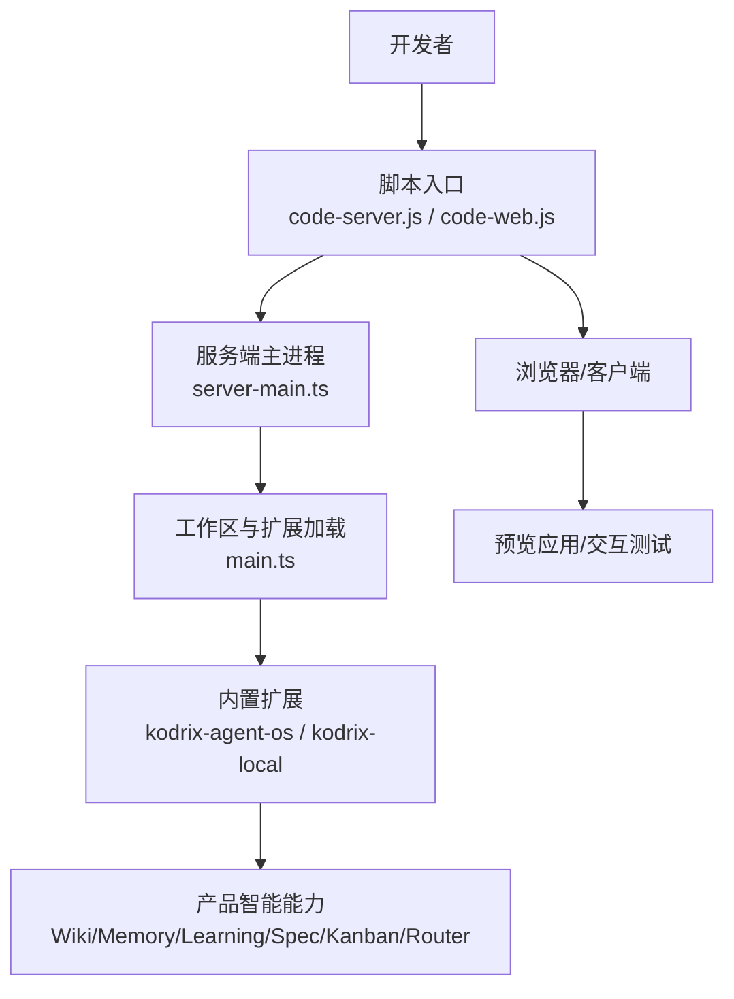
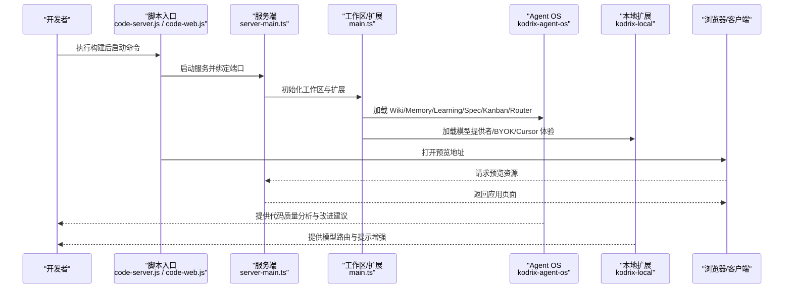
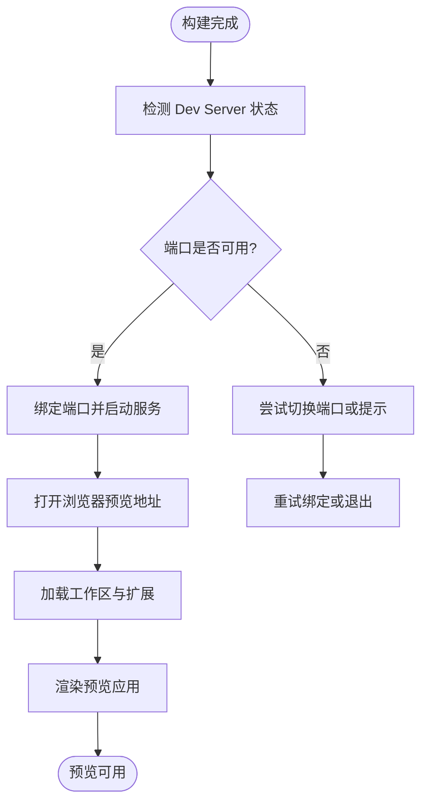
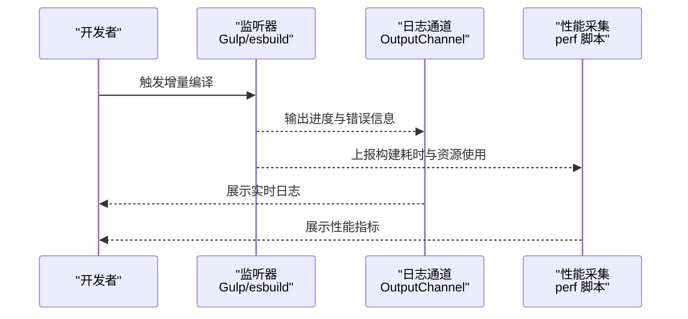
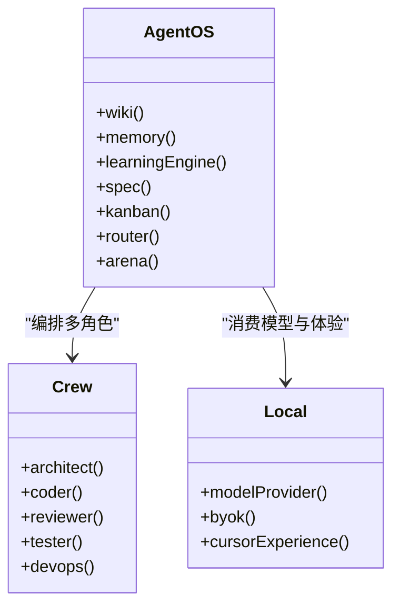
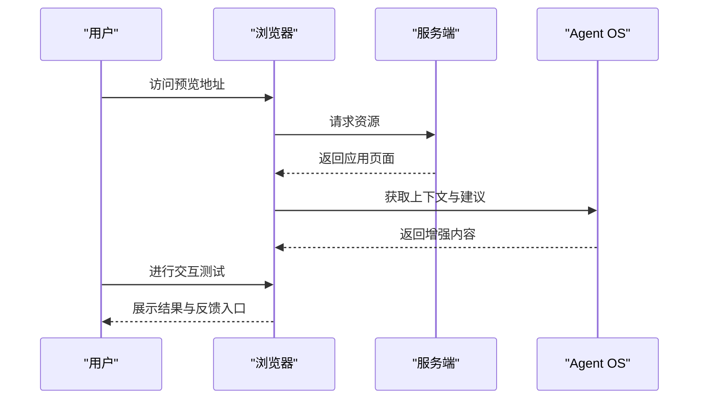
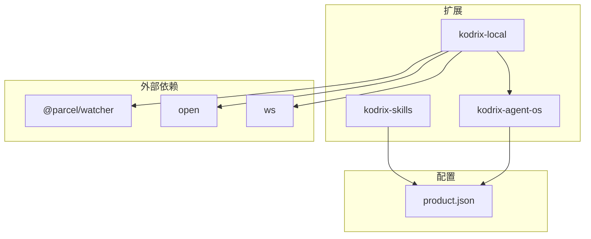

# 构建预览与产品智能

<cite>
**本文引用的文件**
- [README.md](file://README.md)
- [package.json](file://package.json)
- [product.json](file://product.json)
- [.claude/CLAUDE.md](file://.claude/CLAUDE.md)
- [AGENTS.md](file://AGENTS.md)
- [REPAIR-NOTES.md](file://REPAIR-NOTES.md)
- [extensions/kodrix-agent-os/src/extension.ts](file://extensions/kodrix-agent-os/src/extension.ts)
- [extensions/kodrix-agent-os/src/crew/agentCrew.ts](file://extensions/kodrix-agent-os/src/crew/agentCrew.ts)
- [extensions/kodrix-local/src/extension.ts](file://extensions/kodrix-local/src/extension.ts)
- [scripts/code-server.js](file://scripts/code-server.js)
- [scripts/code-web.js](file://scripts/code-web.js)
- [src/server-main.ts](file://src/server-main.ts)
- [src/main.ts](file://src/main.ts)
</cite>

## 目录
1. [简介](#简介)
2. [项目结构](#项目结构)
3. [核心组件](#核心组件)
4. [架构总览](#架构总览)
5. [详细组件分析](#详细组件分析)
6. [依赖关系分析](#依赖关系分析)
7. [性能考量](#性能考量)
8. [故障排查指南](#故障排查指南)
9. [结论](#结论)
10. [附录](#附录)

## 简介
本文件面向产品团队，系统化说明“自动构建完成后的预览启动”和“产品智能”在 Kodrix 中的实现与使用方式。内容覆盖：
- Dev Server 检测、端口管理、浏览器自动打开等预览启动流程
- 构建日志的实时监控与展示（进度跟踪、错误诊断、性能指标）
- 产品智能能力（代码质量分析、改进建议生成、知识沉淀）
- 预览界面示例与交互式测试、用户反馈收集
- 与外部工具集成（热重载、调试器连接、性能分析）
目标是提供端到端的开发到预览体验，加速产品迭代周期。

## 项目结构
Kodrix 基于 VS Code/VSCodium 分支，围绕 src、extensions、scripts、build、cli 等目录组织。与“构建预览与产品智能”直接相关的要点：
- scripts 下提供 code-server/code-web 等脚本，用于本地或 Web 模式启动服务
- extensions/kodrix-agent-os 提供 Agent OS（Wiki、Memory、Learning Engine、Spec、Kanban、Router、Arena 等）
- extensions/kodrix-local 提供模型提供者、BYOK、Cursor 体验模拟、Agent 窗口等
- product.json 定义品牌、协议、扩展能力开关等
- package.json 暴露 dev/build/watch 等脚本，驱动 esbuild/Gulp 快速编译与监听
- README.md 给出快速开始与关键配置说明

图表来源
- [scripts/code-server.js:1-200](file://scripts/code-server.js#L1-L200)
- [scripts/code-web.js:1-200](file://scripts/code-web.js#L1-L200)
- [src/server-main.ts:1-200](file://src/server-main.ts#L1-L200)
- [src/main.ts:1-200](file://src/main.ts#L1-L200)
- [extensions/kodrix-agent-os/src/extension.ts:1-200](file://extensions/kodrix-agent-os/src/extension.ts#L1-L200)
- [extensions/kodrix-local/src/extension.ts:1-200](file://extensions/kodrix-local/src/extension.ts#L1-L200)

章节来源
- [README.md:22-85](file://README.md#L22-L85)
- [package.json:12-100](file://package.json#L12-L100)
- [product.json:1-120](file://product.json#L1-L120)

## 核心组件
- 构建与脚本层
  - npm 脚本与 Gulp/esbuild：提供 compile、watch、build-fast 等命令，支持增量编译与并行任务
  - 开发脚本：dev:prepare、debug.bat、build.bat 等，封装环境准备与启动流程
- 服务与预览层
  - code-server.js / code-web.js：负责启动本地服务或 Web 模式，处理端口、代理、浏览器打开等
  - server-main.ts / main.ts：服务端与工作区初始化、扩展加载、命令注册
- 产品智能层
  - kodrix-agent-os：Agent OS，包含 Wiki、Memory、Learning Engine、Spec、Kanban、Router、Arena 等
  - kodrix-local：模型提供者、BYOK、Cursor 体验模拟、Agent 窗口等
- 配置与品牌
  - product.json：品牌名、协议、扩展能力开关、默认 Chat Agent 等
  - .claude/CLAUDE.md：AI Agent 指令与扩展依赖链、编码规范

章节来源
- [package.json:12-100](file://package.json#L12-L100)
- [scripts/code-server.js:1-200](file://scripts/code-server.js#L1-L200)
- [scripts/code-web.js:1-200](file://scripts/code-web.js#L1-L200)
- [src/server-main.ts:1-200](file://src/server-main.ts#L1-L200)
- [src/main.ts:1-200](file://src/main.ts#L1-L200)
- [extensions/kodrix-agent-os/src/extension.ts:1-200](file://extensions/kodrix-agent-os/src/extension.ts#L1-L200)
- [extensions/kodrix-local/src/extension.ts:1-200](file://extensions/kodrix-local/src/extension.ts#L1-L200)
- [product.json:1-120](file://product.json#L1-L120)
- [.claude/CLAUDE.md:1-88](file://.claude/CLAUDE.md#L1-L88)

## 架构总览
下图展示了从“构建完成”到“预览可用”的关键路径，以及产品智能如何参与工作区上下文与反馈闭环。

图表来源
- [scripts/code-server.js:1-200](file://scripts/code-server.js#L1-L200)
- [scripts/code-web.js:1-200](file://scripts/code-web.js#L1-L200)
- [src/server-main.ts:1-200](file://src/server-main.ts#L1-L200)
- [src/main.ts:1-200](file://src/main.ts#L1-L200)
- [extensions/kodrix-agent-os/src/extension.ts:1-200](file://extensions/kodrix-agent-os/src/extension.ts#L1-L200)
- [extensions/kodrix-local/src/extension.ts:1-200](file://extensions/kodrix-local/src/extension.ts#L1-L200)

## 详细组件分析

### 构建完成后预览启动流程
- Dev Server 检测与端口管理
  - 通过 code-server.js / code-web.js 启动服务，绑定端口；若端口占用则尝试切换或提示
  - 结合 product.json 中 urlProtocol 与扩展能力开关，确保协议与扩展行为一致
- 浏览器自动打开
  - 脚本在启动成功后调用系统 open 能力打开预览地址，便于即时查看
- 工作区与扩展加载
  - server-main.ts 初始化服务端，main.ts 加载工作区与扩展，启用 Agent OS 与本地扩展能力
- 预览应用渲染
  - 浏览器请求资源，服务端返回应用页面，Agent OS 注入上下文与建议

图表来源
- [scripts/code-server.js:1-200](file://scripts/code-server.js#L1-L200)
- [scripts/code-web.js:1-200](file://scripts/code-web.js#L1-L200)
- [src/server-main.ts:1-200](file://src/server-main.ts#L1-L200)
- [src/main.ts:1-200](file://src/main.ts#L1-L200)
- [product.json:1-120](file://product.json#L1-L120)

章节来源
- [scripts/code-server.js:1-200](file://scripts/code-server.js#L1-L200)
- [scripts/code-web.js:1-200](file://scripts/code-web.js#L1-L200)
- [src/server-main.ts:1-200](file://src/server-main.ts#L1-L200)
- [src/main.ts:1-200](file://src/main.ts#L1-L200)
- [product.json:1-120](file://product.json#L1-L120)

### 构建日志的实时监控与展示
- 进度跟踪
  - 使用 npm 脚本与 Gulp/esbuild 的 watch 模式，实时输出编译进度与变更事件
- 错误诊断
  - 通过 OutputChannel 与日志记录机制，集中展示错误堆栈与上下文
  - 结合 REPAIR-NOTES.md 的排障指引定位常见问题
- 性能指标
  - 利用 perf 相关脚本与监控能力，采集构建耗时与内存占用，辅助优化

图表来源
- [package.json:12-100](file://package.json#L12-L100)
- [REPAIR-NOTES.md:1-200](file://REPAIR-NOTES.md#L1-L200)

章节来源
- [package.json:12-100](file://package.json#L12-L100)
- [REPAIR-NOTES.md:1-200](file://REPAIR-NOTES.md#L1-L200)

### 产品智能功能实现
- 代码质量分析
  - Agent OS 的 Router 与 Learning Engine 对代码进行语义理解与质量评估，生成改进建议
  - 结合 Wiki 与 Memory，沉淀项目知识与最佳实践
- 改进建议生成
  - 通过 Spec 与 Kanban 将建议转化为可执行任务，追踪完成度
  - Crew 多角色协作（Architect/Coder/Reviewer/Tester/DevOps）提升建议质量
- 知识沉淀
  - Memory 与 Learning 持久化到本地存储，避免重复劳动
  - 主动上下文感知（Proactive Context）在 Chat 发送前自动附加相关上下文

图表来源
- [extensions/kodrix-agent-os/src/extension.ts:1-200](file://extensions/kodrix-agent-os/src/extension.ts#L1-L200)
- [extensions/kodrix-agent-os/src/crew/agentCrew.ts:120-140](file://extensions/kodrix-agent-os/src/crew/agentCrew.ts#L120-L140)
- [extensions/kodrix-local/src/extension.ts:1-200](file://extensions/kodrix-local/src/extension.ts#L1-L200)

章节来源
- [extensions/kodrix-agent-os/src/extension.ts:1-200](file://extensions/kodrix-agent-os/src/extension.ts#L1-L200)
- [extensions/kodrix-agent-os/src/crew/agentCrew.ts:120-140](file://extensions/kodrix-agent-os/src/crew/agentCrew.ts#L120-L140)
- [extensions/kodrix-local/src/extension.ts:1-200](file://extensions/kodrix-local/src/extension.ts#L1-L200)

### 预览界面示例与交互式测试
- 查看生成的应用
  - 浏览器打开预览地址，加载由服务端提供的资源，Agent OS 注入上下文与建议
- 交互式测试
  - 在预览界面中进行操作，观察行为是否符合预期；结合终端与日志定位问题
- 收集用户反馈
  - 通过 Chat 与 Spec/Kanban 将反馈转化为任务，纳入迭代计划

图表来源
- [scripts/code-server.js:1-200](file://scripts/code-server.js#L1-L200)
- [scripts/code-web.js:1-200](file://scripts/code-web.js#L1-L200)
- [src/server-main.ts:1-200](file://src/server-main.ts#L1-L200)
- [extensions/kodrix-agent-os/src/extension.ts:1-200](file://extensions/kodrix-agent-os/src/extension.ts#L1-L200)

章节来源
- [scripts/code-server.js:1-200](file://scripts/code-server.js#L1-L200)
- [scripts/code-web.js:1-200](file://scripts/code-web.js#L1-L200)
- [src/server-main.ts:1-200](file://src/server-main.ts#L1-L200)
- [extensions/kodrix-agent-os/src/extension.ts:1-200](file://extensions/kodrix-agent-os/src/extension.ts#L1-L200)

### 与外部工具的集成
- 热重载
  - 使用 watch 模式监听 src/ 变化，自动增量重编译，减少等待时间
- 调试器连接
  - 通过 launch.json 与 debug 脚本连接调试器，断点与变量检查
- 性能分析
  - 使用 perf 脚本与监控能力，采集构建与运行期性能数据，指导优化

章节来源
- [README.md:45-67](file://README.md#L45-L67)
- [package.json:12-100](file://package.json#L12-L100)

## 依赖关系分析
- 扩展依赖链
  - kodrix-local 通过命令与 kodrix-agent-os 交互；kodrix-skills 通过设置被其他扩展消费
- 外部依赖
  - 使用 @parcel/watcher 监听文件变更；使用 open 打开浏览器；使用 ws 进行通信
- 配置与品牌
  - product.json 控制扩展能力与默认 Chat Agent；protocol 与 tunnel 配置影响远程与隧道能力

图表来源
- [.claude/CLAUDE.md:22-29](file://.claude/CLAUDE.md#L22-L29)
- [package.json:101-167](file://package.json#L101-L167)
- [product.json:1-120](file://product.json#L1-L120)

章节来源
- [.claude/CLAUDE.md:22-29](file://.claude/CLAUDE.md#L22-L29)
- [package.json:101-167](file://package.json#L101-L167)
- [product.json:1-120](file://product.json#L1-L120)

## 性能考量
- 构建性能
  - 使用 esbuild 与 Gulp 并行任务，缩短编译时间；watch 模式仅重编译变更文件
- 运行性能
  - 延迟加载非关键 Webview；索引增量更新；Learning 检索缓存
- 监控与优化
  - 通过 perf 脚本与日志采集，识别瓶颈并持续优化

章节来源
- [README.md:97-104](file://README.md#L97-L104)
- [package.json:12-100](file://package.json#L12-L100)

## 故障排查指南
- 常见启动问题
  - Node 版本不匹配：遵循 .nvmrc 要求；首次依赖安装与 Copilot 扩展打包耗时属正常
  - 端口占用：检查并释放端口或切换端口
- 日志与排障
  - 使用 OutputChannel 与日志文件定位错误；参考 REPAIR-NOTES.md 进行修复
- 扩展问题
  - 确认扩展能力开关与依赖；必要时重新编译与重启

章节来源
- [README.md:36-67](file://README.md#L36-L67)
- [REPAIR-NOTES.md:1-200](file://REPAIR-NOTES.md#L1-L200)

## 结论
Kodrix 通过脚本与服务端协同，实现了构建完成后的自动预览启动；借助 Agent OS 与本地扩展，提供了代码质量分析、改进建议与知识沉淀的产品智能能力。配合热重载、调试器与性能分析，形成端到端的开发到预览体验，显著加速产品迭代周期。

## 附录
- 快速开始与关键配置见 README.md
- 扩展依赖链与编码规范见 .claude/CLAUDE.md
- 更多文档与审计报告见 docs 目录