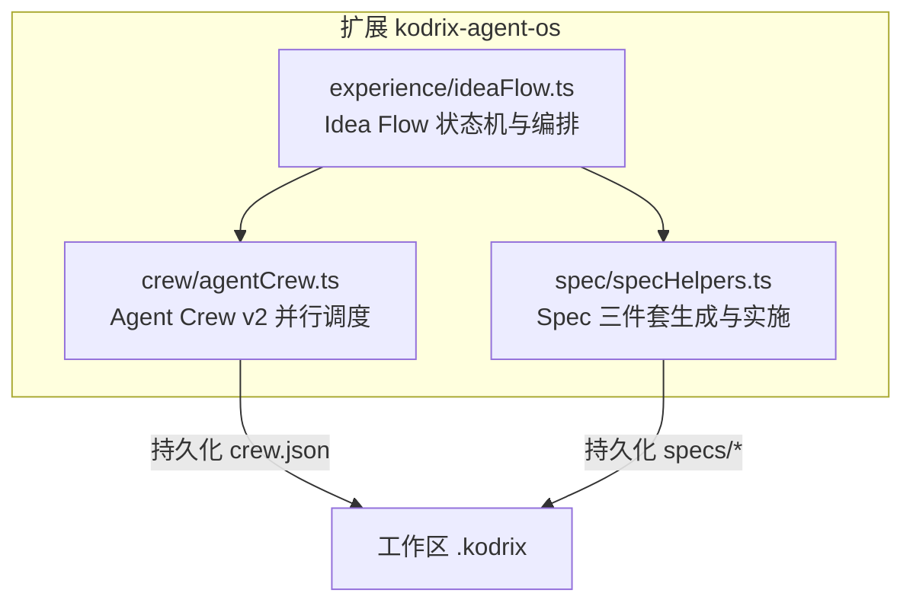
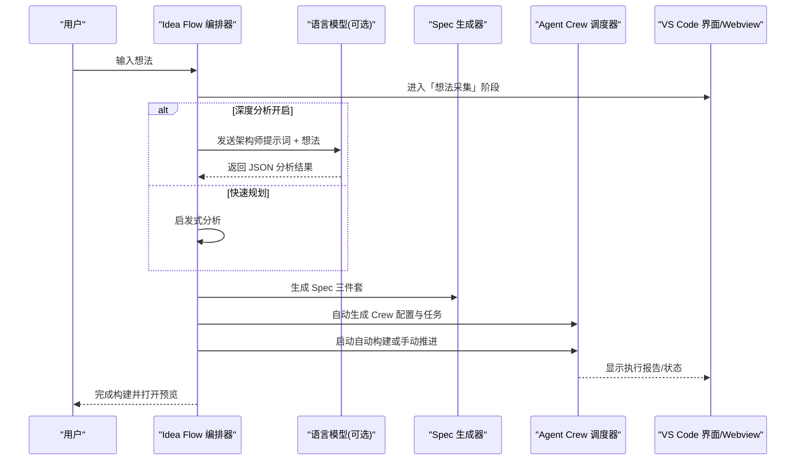
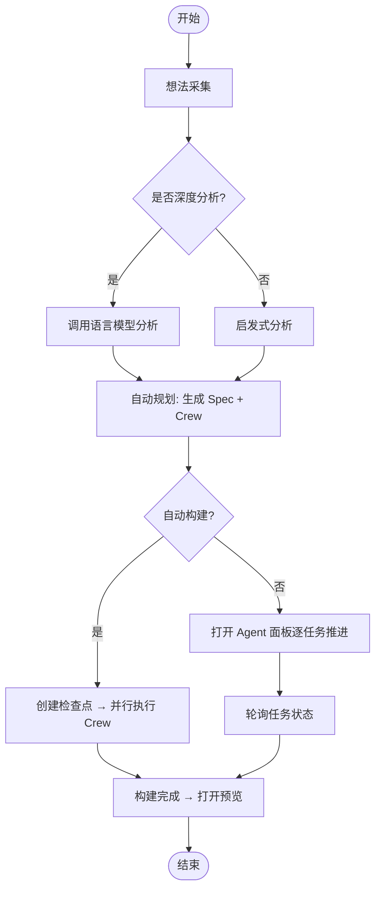
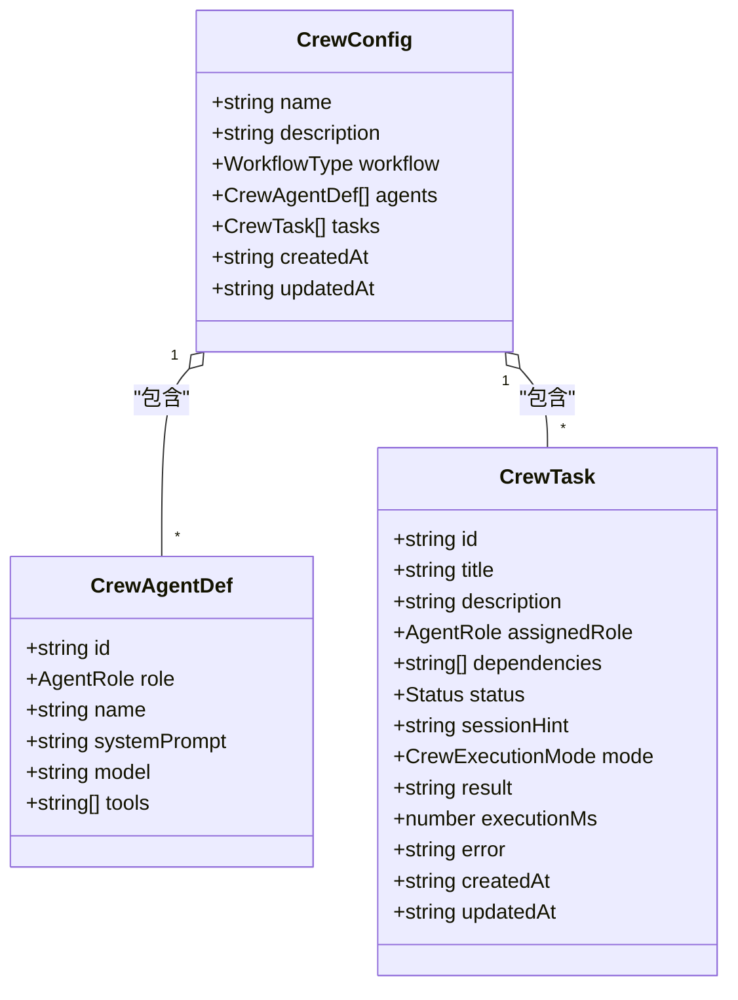
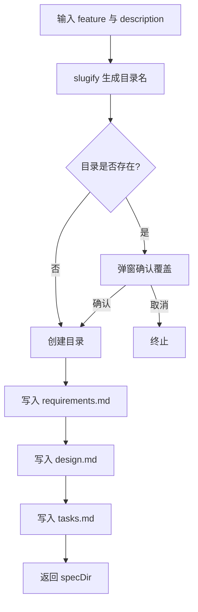
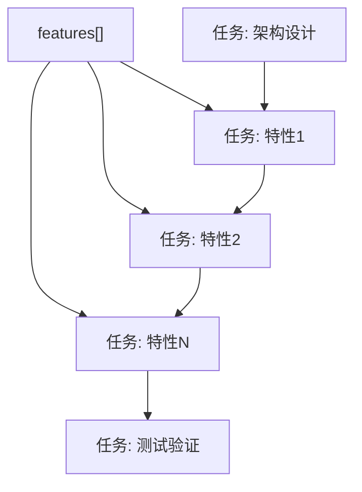
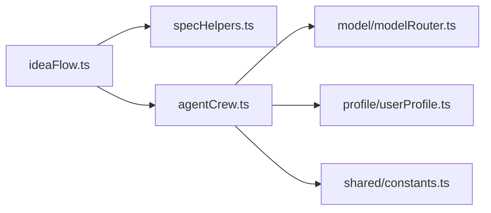

# 自动规划与任务分解

<cite>
**本文引用的文件**   
- [extensions/kodrix-agent-os/src/experience/ideaFlow.ts](file://extensions/kodrix-agent-os/src/experience/ideaFlow.ts)
- [extensions/kodrix-agent-os/src/crew/agentCrew.ts](file://extensions/kodrix-agent-os/src/crew/agentCrew.ts)
- [extensions/kodrix-agent-os/src/spec/specHelpers.ts](file://extensions/kodrix-agent-os/src/spec/specHelpers.ts)
- [AGENTS.md](file://AGENTS.md)
- [docs/项目非常有必要新实现的核心功能总报告.md](file://docs/项目非常有必要新实现的核心功能总报告.md)
</cite>

## 目录
1. [引言](#引言)
2. [项目结构](#项目结构)
3. [核心组件](#核心组件)
4. [架构总览](#架构总览)
5. [详细组件分析](#详细组件分析)
6. [依赖关系分析](#依赖关系分析)
7. [性能与可靠性](#性能与可靠性)
8. [故障排查指南](#故障排查指南)
9. [结论](#结论)
10. [附录：配置示例与落地节奏](#附录配置示例与落地节奏)

## 引言
本文件面向项目管理者与开发团队，系统化说明 Idea Flow 的“自动规划与任务分解”能力：从用户一句话想法出发，自动生成产品规格（Spec）、技术架构方案、Agent Crew 配置与任务依赖图，并驱动多 Agent 协作执行。文档同时解释架构师角色的系统提示词设计、任务分解算法、优先级与依赖关系建立、资源分配策略，以及如何将自动规划结果沉淀为正式的 Spec 文档，并与现有扩展生态集成。

## 项目结构
Idea Flow 位于 VS Code 扩展 `kodrix-agent-os` 中，围绕三个关键模块组织：
- 体验层：Idea Flow 状态机、Webview 画布、端到端流程编排
- 执行层：Agent Crew v2 并行调度器、任务上下文注入、共享上下文
- 规范层：Spec 三件套（需求、设计、任务）生成与实施入口

图示来源
- [extensions/kodrix-agent-os/src/experience/ideaFlow.ts:1-1042](file://extensions/kodrix-agent-os/src/experience/ideaFlow.ts#L1-L1042)
- [extensions/kodrix-agent-os/src/crew/agentCrew.ts:1-788](file://extensions/kodrix-agent-os/src/crew/agentCrew.ts#L1-L788)
- [extensions/kodrix-agent-os/src/spec/specHelpers.ts:1-268](file://extensions/kodrix-agent-os/src/spec/specHelpers.ts#L1-L268)

章节来源
- [AGENTS.md:9-56](file://AGENTS.md#L9-L56)

## 核心组件
- Idea Flow 编排器
  - 负责接收用户想法、深度分析、自动规划、创建 Crew、启动构建与预览。
  - 维护运行期状态、日志、超时与轮询机制，并通过 Webview 展示进度。
- Agent Crew v2 调度器
  - 定义角色、任务、依赖与工作流；提供并行执行引擎、跨 Agent 上下文传递、共享上下文与执行报告。
- Spec 工具集
  - 生成 requirements/design/tasks 三件套，支持按 slug 管理多个 Spec，并提供“Spec 驱动实施”命令。

章节来源
- [extensions/kodrix-agent-os/src/experience/ideaFlow.ts:45-80](file://extensions/kodrix-agent-os/src/experience/ideaFlow.ts#L45-L80)
- [extensions/kodrix-agent-os/src/crew/agentCrew.ts:34-80](file://extensions/kodrix-agent-os/src/crew/agentCrew.ts#L34-L80)
- [extensions/kodrix-agent-os/src/spec/specHelpers.ts:10-64](file://extensions/kodrix-agent-os/src/spec/specHelpers.ts#L10-L64)

## 架构总览
Idea Flow 的整体流程如下：

图示来源
- [extensions/kodrix-agent-os/src/experience/ideaFlow.ts:307-359](file://extensions/kodrix-agent-os/src/experience/ideaFlow.ts#L307-L359)
- [extensions/kodrix-agent-os/src/experience/ideaFlow.ts:364-444](file://extensions/kodrix-agent-os/src/experience/ideaFlow.ts#L364-L444)
- [extensions/kodrix-agent-os/src/experience/ideaFlow.ts:526-553](file://extensions/kodrix-agent-os/src/experience/ideaFlow.ts#L526-L553)
- [extensions/kodrix-agent-os/src/experience/ideaFlow.ts:558-638](file://extensions/kodrix-agent-os/src/experience/ideaFlow.ts#L558-L638)
- [extensions/kodrix-agent-os/src/crew/agentCrew.ts:515-572](file://extensions/kodrix-agent-os/src/crew/agentCrew.ts#L515-L572)

## 详细组件分析

### Idea Flow 编排器
- 状态机与生命周期
  - 阶段包括：空闲、想法采集、想法分析、自动规划、Crew 构建、构建中、预览就绪、产品智能、错误。
  - 通过事件总线推送状态变更，持久化到 `idea-flow.json`，并在 Webview 中实时渲染。
- 深度分析与回退
  - 优先调用语言模型进行结构化分析；若不可用或超时，则回退到启发式分析。
  - 使用平衡括号解析器提取 JSON，避免 LLM 输出格式问题导致崩溃。
- 自动规划
  - 调用 Spec 生成器产出三件套；根据分析结果自动生成 Crew 配置与任务列表。
- Crew 启动
  - 支持自动模式（端到端并行执行）与手动模式（逐任务在 Agent 面板推进）。
  - 自动模式下先创建检查点，再调用 Crew 并行执行全部可运行任务，完成后触发预览。

图示来源
- [extensions/kodrix-agent-os/src/experience/ideaFlow.ts:307-359](file://extensions/kodrix-agent-os/src/experience/ideaFlow.ts#L307-L359)
- [extensions/kodrix-agent-os/src/experience/ideaFlow.ts:526-553](file://extensions/kodrix-agent-os/src/experience/ideaFlow.ts#L526-L553)
- [extensions/kodrix-agent-os/src/experience/ideaFlow.ts:679-788](file://extensions/kodrix-agent-os/src/experience/ideaFlow.ts#L679-L788)

章节来源
- [extensions/kodrix-agent-os/src/experience/ideaFlow.ts:45-80](file://extensions/kodrix-agent-os/src/experience/ideaFlow.ts#L45-L80)
- [extensions/kodrix-agent-os/src/experience/ideaFlow.ts:307-359](file://extensions/kodrix-agent-os/src/experience/ideaFlow.ts#L307-L359)
- [extensions/kodrix-agent-os/src/experience/ideaFlow.ts:364-444](file://extensions/kodrix-agent-os/src/experience/ideaFlow.ts#L364-L444)
- [extensions/kodrix-agent-os/src/experience/ideaFlow.ts:450-464](file://extensions/kodrix-agent-os/src/experience/ideaFlow.ts#L450-L464)
- [extensions/kodrix-agent-os/src/experience/ideaFlow.ts:526-553](file://extensions/kodrix-agent-os/src/experience/ideaFlow.ts#L526-L553)
- [extensions/kodrix-agent-os/src/experience/ideaFlow.ts:558-638](file://extensions/kodrix-agent-os/src/experience/ideaFlow.ts#L558-L638)
- [extensions/kodrix-agent-os/src/experience/ideaFlow.ts:679-788](file://extensions/kodrix-agent-os/src/experience/ideaFlow.ts#L679-L788)

### Agent Crew v2 并行调度器
- 角色与任务模型
  - 预置角色：架构师、开发者、审查者、测试者、运维、自定义。
  - 任务包含标题、描述、分配角色、依赖数组、状态、执行模式（auto/chat）、结果与耗时等。
- 依赖与波次调度
  - 计算“可运行任务”：pending 且所有依赖已完成。
  - 同波内任务相互独立，按并发上限分批并行执行；每波结束后写回状态，再计算下一波。
- 跨 Agent 上下文传递
  - 上游任务的 result 自动注入下游任务的 prompt，限制最大字符数以避免超限。
  - 团队共享上下文文件 `.kodrix/crew-context.md` 累积各任务摘要，供后续任务参考。
- 执行模式
  - auto：后台并行 LLM 执行，完成后自动推进。
  - chat：打开 Agent 面板，由用户在对话中完成任务后手动标记完成。

图示来源
- [extensions/kodrix-agent-os/src/crew/agentCrew.ts:34-80](file://extensions/kodrix-agent-os/src/crew/agentCrew.ts#L34-L80)

章节来源
- [extensions/kodrix-agent-os/src/crew/agentCrew.ts:34-80](file://extensions/kodrix-agent-os/src/crew/agentCrew.ts#L34-L80)
- [extensions/kodrix-agent-os/src/crew/agentCrew.ts:325-331](file://extensions/kodrix-agent-os/src/crew/agentCrew.ts#L325-L331)
- [extensions/kodrix-agent-os/src/crew/agentCrew.ts:349-398](file://extensions/kodrix-agent-os/src/crew/agentCrew.ts#L349-L398)
- [extensions/kodrix-agent-os/src/crew/agentCrew.ts:515-572](file://extensions/kodrix-agent-os/src/crew/agentCrew.ts#L515-L572)

### Spec 生成与实施
- 三件套模板
  - requirements.md：EARS 风格用户故事与验收标准。
  - design.md：架构概览、数据模型、API 设计、文件变更计划、风险与缓解。
  - tasks.md：实施任务清单、顺序与 Agent 提示词。
- 生成流程
  - 基于项目名与描述生成 slug，创建目录与三件套；如已存在同名 Spec，需用户确认覆盖。
- 实施入口
  - 将三件套内容拼接为 Agent 查询，打开 Agent 面板以 Spec 驱动实施。

图示来源
- [extensions/kodrix-agent-os/src/spec/specHelpers.ts:214-246](file://extensions/kodrix-agent-os/src/spec/specHelpers.ts#L214-L246)

章节来源
- [extensions/kodrix-agent-os/src/spec/specHelpers.ts:10-64](file://extensions/kodrix-agent-os/src/spec/specHelpers.ts#L10-L64)
- [extensions/kodrix-agent-os/src/spec/specHelpers.ts:93-138](file://extensions/kodrix-agent-os/src/spec/specHelpers.ts#L93-L138)
- [extensions/kodrix-agent-os/src/spec/specHelpers.ts:140-186](file://extensions/kodrix-agent-os/src/spec/specHelpers.ts#L140-L186)
- [extensions/kodrix-agent-os/src/spec/specHelpers.ts:188-212](file://extensions/kodrix-agent-os/src/spec/specHelpers.ts#L188-L212)
- [extensions/kodrix-agent-os/src/spec/specHelpers.ts:214-246](file://extensions/kodrix-agent-os/src/spec/specHelpers.ts#L214-L246)
- [extensions/kodrix-agent-os/src/spec/specHelpers.ts:248-266](file://extensions/kodrix-agent-os/src/spec/specHelpers.ts#L248-L266)

### 架构师角色与系统提示词设计
- 目标
  - 让 LLM 以顶级产品架构师和 CTO 视角分析用户想法，输出结构化 JSON，指导后续 Spec 与 Crew 生成。
- 设计要点
  - 明确输出字段：应用名称、技术栈、架构风格、核心功能、预估文件数、复杂度、建议角色与工作流类型。
  - 失败回退：未找到可用模型或解析失败时，采用启发式规则生成基础分析。
  - 超时保护：设置 LLM 调用超时，避免长时间阻塞。
- 与 Crew 的关系
  - 分析结果中的 suggestedCrewRoles 与 workflowType 直接决定 Crew 的角色集合与工作流类型。

章节来源
- [extensions/kodrix-agent-os/src/experience/ideaFlow.ts:364-444](file://extensions/kodrix-agent-os/src/experience/ideaFlow.ts#L364-L444)
- [extensions/kodrix-agent-os/src/experience/ideaFlow.ts:466-481](file://extensions/kodrix-agent-os/src/experience/ideaFlow.ts#L466-L481)
- [extensions/kodrix-agent-os/src/experience/ideaFlow.ts:558-638](file://extensions/kodrix-agent-os/src/experience/ideaFlow.ts#L558-L638)

### 任务分解算法与依赖关系
- 特性到任务
  - 将分析结果中的 features 映射为若干任务，每个任务对应一个核心功能。
- 依赖关系
  - 默认将特性任务串联为顺序依赖；架构任务置于首位，测试任务置于末位并依赖所有非测试任务。
- 优先级排序
  - 在手动模式中，按角色优先级选择下一个任务（架构师→开发者→测试者→审查者→运维）。
- 资源分配
  - 根据 suggestedCrewRoles 动态生成 Agent 实例，并为每个角色分配合适工具集。

图示来源
- [extensions/kodrix-agent-os/src/experience/ideaFlow.ts:579-627](file://extensions/kodrix-agent-os/src/experience/ideaFlow.ts#L579-L627)

章节来源
- [extensions/kodrix-agent-os/src/experience/ideaFlow.ts:579-627](file://extensions/kodrix-agent-os/src/experience/ideaFlow.ts#L579-L627)
- [extensions/kodrix-agent-os/src/crew/agentCrew.ts:622-665](file://extensions/kodrix-agent-os/src/crew/agentCrew.ts#L622-L665)

### 与 Spec 驱动的集成
- 自动规划阶段会调用 Spec 生成器，产出三件套并保存到工作区。
- 当无 Crew 配置时，Idea Flow 会打开 Agent 面板，并将 idea、techStack、features 等信息作为背景注入，引导从零构建。
- 也可通过 Spec 实施命令，将三件套内容注入 Agent 会话，实现“按 Spec 实施”。

章节来源
- [extensions/kodrix-agent-os/src/experience/ideaFlow.ts:526-553](file://extensions/kodrix-agent-os/src/experience/ideaFlow.ts#L526-L553)
- [extensions/kodrix-agent-os/src/experience/ideaFlow.ts:679-732](file://extensions/kodrix-agent-os/src/experience/ideaFlow.ts#L679-L732)
- [extensions/kodrix-agent-os/src/spec/specHelpers.ts:248-266](file://extensions/kodrix-agent-os/src/spec/specHelpers.ts#L248-L266)

## 依赖关系分析
- 模块耦合
  - Idea Flow 依赖 Spec 生成与 Crew 调度；Crew 调度依赖模型路由、用户画像注入与常量配置。
- 外部依赖
  - VS Code API：命令、Webview、Language Model Chat、工作区与文件系统。
  - 工作区文件：`.kodrix/crew.json`、`.kodrix/crew-context.md`、`.kodrix/specs/*`、`idea-flow.json`。
- 潜在循环依赖
  - 当前实现为单向依赖链（Idea Flow → Spec/Crew），未见循环导入。

图示来源
- [extensions/kodrix-agent-os/src/experience/ideaFlow.ts:1-44](file://extensions/kodrix-agent-os/src/experience/ideaFlow.ts#L1-L44)
- [extensions/kodrix-agent-os/src/crew/agentCrew.ts:1-33](file://extensions/kodrix-agent-os/src/crew/agentCrew.ts#L1-L33)

章节来源
- [extensions/kodrix-agent-os/src/experience/ideaFlow.ts:1-44](file://extensions/kodrix-agent-os/src/experience/ideaFlow.ts#L1-L44)
- [extensions/kodrix-agent-os/src/crew/agentCrew.ts:1-33](file://extensions/kodrix-agent-os/src/crew/agentCrew.ts#L1-L33)

## 性能与可靠性
- 并发控制
  - Crew 并行执行使用并发池，限制同波并行任务数量，避免过载。
- 超时与轮询
  - LLM 分析设置超时；Crew 构建设置最大构建时长；手动模式通过定时器轮询任务状态。
- 原子写入
  - crew.json 采用临时文件+rename 的原子写入，防止进程崩溃产生不完整配置。
- 容错与回退
  - LLM 不可用时回退启发式分析；JSON 解析失败时记录错误并继续。
- 资源清理
  - 定时器与事件发射器在 Webview 销毁或扩展卸载时清理，避免泄漏。

章节来源
- [extensions/kodrix-agent-os/src/crew/agentCrew.ts:164-173](file://extensions/kodrix-agent-os/src/crew/agentCrew.ts#L164-L173)
- [extensions/kodrix-agent-os/src/crew/agentCrew.ts:515-572](file://extensions/kodrix-agent-os/src/crew/agentCrew.ts#L515-L572)
- [extensions/kodrix-agent-os/src/experience/ideaFlow.ts:400-444](file://extensions/kodrix-agent-os/src/experience/ideaFlow.ts#L400-L444)
- [extensions/kodrix-agent-os/src/experience/ideaFlow.ts:679-788](file://extensions/kodrix-agent-os/src/experience/ideaFlow.ts#L679-L788)

## 故障排查指南
- 未找到可用语言模型
  - 现象：分析阶段回退启发式；Crew 任务标记失败并提示配置 BYOK 模型。
  - 处理：在 Manage Models 中配置可用模型族，确保路由成功。
- JSON 解析失败
  - 现象：LLM 响应无法提取 JSON。
  - 处理：检查模型输出格式；必要时调整提示词约束。
- 无工作区
  - 现象：提示请先打开工作区文件夹。
  - 处理：打开包含项目的文件夹后再启动 Idea Flow。
- 构建超时
  - 现象：超过最大构建时间后停止自动轮询。
  - 处理：通过 Crew 命令继续手动推进任务。

章节来源
- [extensions/kodrix-agent-os/src/crew/agentCrew.ts:462-508](file://extensions/kodrix-agent-os/src/crew/agentCrew.ts#L462-L508)
- [extensions/kodrix-agent-os/src/experience/ideaFlow.ts:679-788](file://extensions/kodrix-agent-os/src/experience/ideaFlow.ts#L679-L788)

## 结论
Idea Flow 将“想法”转化为“可执行的工程计划”，通过 Spec 驱动与 Agent Crew 并行调度，形成从需求到实现的闭环。其优势在于：
- 自动规划：快速生成 Spec 与 Crew，减少人工编排成本。
- 并行执行：提升多 Agent 协作效率，降低长链路等待。
- 可观测性：状态持久化、日志与执行报告，便于追踪与复盘。
- 可扩展性：角色、工具与工作流可配置，适配不同复杂度项目。

## 附录：配置示例与落地节奏
- 简单项目（前端单页）
  - 建议工期：约 3–5 天
  - 技术栈：React/Vue + Vite/Tailwind
  - 角色：架构师、开发者、测试者
  - 工作流：顺序流水线
- 中等项目（全栈应用）
  - 建议工期：约 7–10 天
  - 技术栈：前后端分离 + 数据库 + 鉴权
  - 角色：架构师、开发者×2、审查者、测试者、运维
  - 工作流：并行协作 + 审批门
- 复杂项目（微服务/平台型）
  - 建议工期：2–4 周
  - 技术栈：多语言/多仓库 + CI/CD + 监控
  - 角色：架构师、开发者×N、审查者、测试者、DevOps
  - 工作流：并行协作 + 审批门 + 分波推进

落地节奏建议（来自项目规划报告）：
- Phase 1（0–2 周）：Learning 2.0 embeddings 升级 + 主动上下文补全 + Checkpoint 可视化
- Phase 2（2–4 周）：Agent Crew 冲突检测 + 语义 Wiki / LLM 文档
- Phase 3（4–6 周）：Vibe 迭代模式 + P2 加分项

章节来源
- [docs/项目非常有必要新实现的核心功能总报告.md:102-108](file://docs/项目非常有必要新实现的核心功能总报告.md#L102-L108)