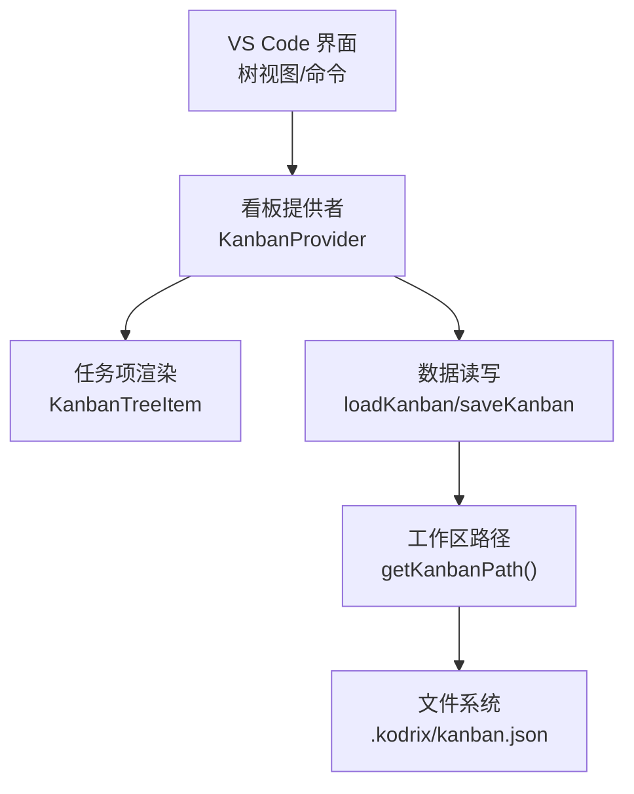
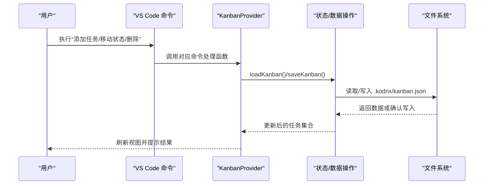
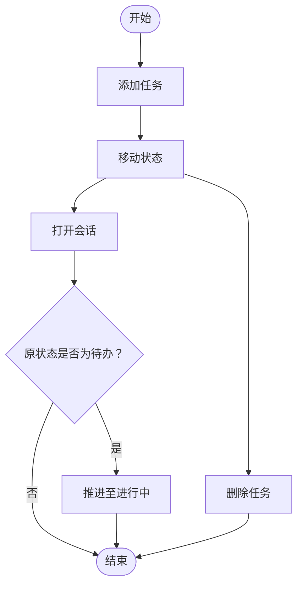
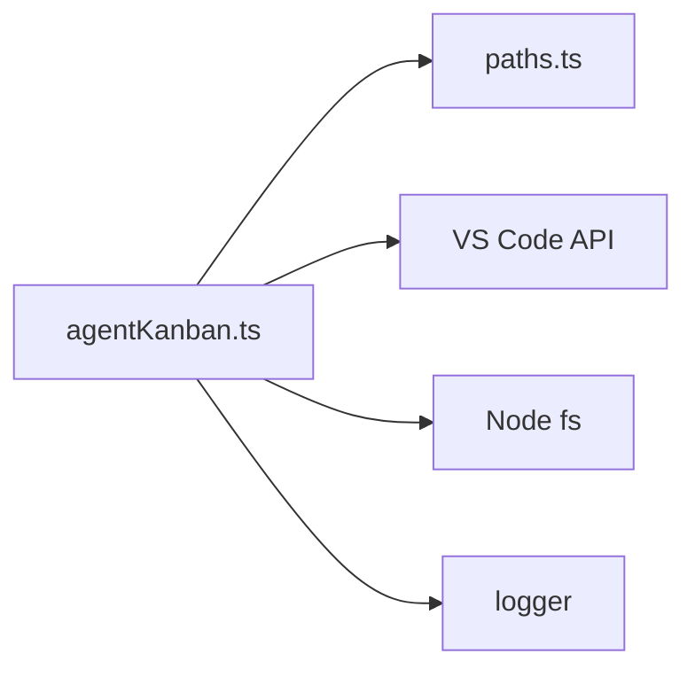

# Kanban 看板

<cite>
**本文引用的文件**
- [agentKanban.ts](file://extensions/kodrix-agent-os/src/kanban/agentKanban.ts)
- [paths.ts](file://extensions/kodrix-agent-os/src/paths.ts)
</cite>

## 目录
1. [简介](#简介)
2. [项目结构](#项目结构)
3. [核心组件](#核心组件)
4. [架构总览](#架构总览)
5. [详细组件分析](#详细组件分析)
6. [依赖关系分析](#依赖关系分析)
7. [性能与可靠性](#性能与可靠性)
8. [故障排查指南](#故障排查指南)
9. [结论](#结论)
10. [附录：使用示例与最佳实践](#附录使用示例与最佳实践)

## 简介
Agent Kanban 是 Kodrix Agent OS 中的任务可视化与状态管理组件，提供“待办、进行中、待审核、阻塞、已完成”等列视图，支持通过 VS Code 树形视图查看与管理任务卡片。它内置了任务创建、移动、删除、打开会话并自动推进状态的能力，同时提供统计信息接口，便于集成到仪表盘或命令面板中。该实现以本地 JSON 文件作为持久化存储，路径由共享路径工具统一管理。

## 项目结构
Agent Kanban 的核心逻辑集中在单一模块中，并通过共享路径工具定位工作区下的持久化数据位置。整体组织如下：
- 看板业务逻辑与 UI 绑定：位于扩展的 agentKanban.ts
- 工作区路径与持久化目录：位于 paths.ts，提供 getKanbanPath 等能力

图表来源
- [agentKanban.ts:111-136](file://extensions/kodrix-agent-os/src/kanban/agentKanban.ts#L111-L136)
- [agentKanban.ts:36-61](file://extensions/kodrix-agent-os/src/kanban/agentKanban.ts#L36-L61)
- [paths.ts:91-97](file://extensions/kodrix-agent-os/src/paths.ts#L91-L97)

章节来源
- [agentKanban.ts:1-295](file://extensions/kodrix-agent-os/src/kanban/agentKanban.ts#L1-L295)
- [paths.ts:1-161](file://extensions/kodrix-agent-os/src/paths.ts#L1-L161)

## 核心组件
- 任务模型与状态枚举
  - 任务包含唯一标识、标题、可选描述、状态、创建与更新时间、可选会话提示等字段。
  - 状态包括：todo（待办）、in_progress（进行中）、review（待审核）、blocked（阻塞）、done（已完成）。
- 状态配置
  - 每个状态定义标签、图标、主题色与排序顺序，用于统一渲染与排序。
- 数据存取
  - 从工作区 .kodrix/kanban.json 读取与写入任务列表；加载失败时记录警告并重置为空。
- 树视图提供者
  - 将任务按状态顺序与更新时间排序后渲染为树节点，支持刷新事件。
- 交互命令
  - 添加任务、移动状态、打开会话、删除任务、刷新、聚焦视图等命令。
- 统计接口
  - 提供总数、各状态计数等统计结果，供外部展示。

章节来源
- [agentKanban.ts:12-34](file://extensions/kodrix-agent-os/src/kanban/agentKanban.ts#L12-L34)
- [agentKanban.ts:36-61](file://extensions/kodrix-agent-os/src/kanban/agentKanban.ts#L36-L61)
- [agentKanban.ts:75-136](file://extensions/kodrix-agent-os/src/kanban/agentKanban.ts#L75-L136)
- [agentKanban.ts:138-266](file://extensions/kodrix-agent-os/src/kanban/agentKanban.ts#L138-L266)
- [agentKanban.ts:268-295](file://extensions/kodrix-agent-os/src/kanban/agentKanban.ts#L268-L295)

## 架构总览
Agent Kanban 采用“UI 绑定 + 数据层 + 路径工具”的分层设计：
- 表现层：树视图提供者与任务项负责渲染与交互入口。
- 业务层：任务 CRUD、状态流转、时间计算、统计汇总。
- 数据层：JSON 文件读写，基于工作区路径工具定位存储位置。
- 集成点：通过 VS Code 命令注册与 Chat 会话联动，实现“打开即开始”的状态推进。

图表来源
- [agentKanban.ts:138-255](file://extensions/kodrix-agent-os/src/kanban/agentKanban.ts#L138-L255)
- [agentKanban.ts:36-61](file://extensions/kodrix-agent-os/src/kanban/agentKanban.ts#L36-L61)
- [paths.ts:91-97](file://extensions/kodrix-agent-os/src/paths.ts#L91-L97)

## 详细组件分析

### 任务模型与状态
- 任务字段
  - id：唯一标识，用于增删改查定位。
  - title：任务标题，显示在树节点上。
  - description：可选描述，用于传递给 Agent 或作为详情展示。
  - status：当前状态，决定列归属与颜色/图标。
  - createdAt/updatedAt：时间戳，用于排序与“相对时间”展示。
  - sessionHint：可选关联会话提示，便于追溯上下文。
- 状态与配置
  - 五种状态分别定义了中文标签、图标、主题色与排序权重，保证一致的视觉与顺序。

章节来源
- [agentKanban.ts:12-34](file://extensions/kodrix-agent-os/src/kanban/agentKanban.ts#L12-L34)
- [agentKanban.ts:14-26](file://extensions/kodrix-agent-os/src/kanban/agentKanban.ts#L14-L26)

### 树视图与渲染
- 任务项
  - 根据任务状态选择图标与主题色，显示“状态 · 相对更新时间”。
  - 悬停提示包含描述、状态、创建与更新时间、会话提示等。
  - 点击可触发“打开 Agent 会话”命令。
- 列表排序
  - 先按状态顺序排序，再按更新时间倒序，确保重要且活跃的任务靠前。

章节来源
- [agentKanban.ts:75-109](file://extensions/kodrix-agent-os/src/kanban/agentKanban.ts#L75-L109)
- [agentKanban.ts:123-133](file://extensions/kodrix-agent-os/src/kanban/agentKanban.ts#L123-L133)

### 数据持久化
- 存储位置
  - 通过 getKanbanPath 获取工作区 .kodrix/kanban.json 的路径。
- 读取策略
  - 若文件不存在或格式非法，记录警告并返回空任务列表，避免崩溃。
- 写入策略
  - 写入前确保目录存在，格式化输出 JSON 以便人工编辑与版本控制。

章节来源
- [agentKanban.ts:36-61](file://extensions/kodrix-agent-os/src/kanban/agentKanban.ts#L36-L61)
- [paths.ts:91-97](file://extensions/kodrix-agent-os/src/paths.ts#L91-L97)

### 交互流程与状态推进
- 添加任务
  - 输入标题与可选描述，选择初始状态（默认待办），生成唯一 ID 与时间戳后保存。
- 移动状态
  - 列出除当前状态外的其他状态供选择，更新状态与更新时间后保存。
- 打开会话
  - 构造包含任务标题与描述的提示，打开 Agent 模式聊天；若原状态为“待办”，自动推进为“进行中”。
- 删除任务
  - 二次确认后过滤掉对应任务并保存。

图表来源
- [agentKanban.ts:138-255](file://extensions/kodrix-agent-os/src/kanban/agentKanban.ts#L138-L255)

### 统计与信息聚合
- 统计接口
  - 返回总数、待办、进行中、已完成、阻塞的数量，可用于侧边栏或命令面板展示。
- 相对时间
  - 提供“刚刚/分钟前/小时前/天前/日期”的友好显示，提升可读性。

章节来源
- [agentKanban.ts:257-266](file://extensions/kodrix-agent-os/src/kanban/agentKanban.ts#L257-L266)
- [agentKanban.ts:63-73](file://extensions/kodrix-agent-os/src/kanban/agentKanban.ts#L63-L73)

### 与 Spec 驱动的集成说明
- 当前实现未直接解析 Spec 文件或自动生成看板任务。
- 建议集成方式
  - 在 Spec 解析完成后，调用 addKanbanTask 或批量写入 kanban.json，将需求条目映射为看板任务。
  - 当 Agent 执行完成或状态变化时，通过 moveKanbanTask 或 saveKanban 更新任务状态，保持看板与执行一致。
- 注意
  - 由于仓库中未发现 Spec 解析与看板自动生成的具体代码，以上为基于现有接口的集成建议。

[本节为概念性说明，不直接分析具体文件]

## 依赖关系分析
- 内部依赖
  - agentKanban.ts 依赖 paths.ts 提供的 getKanbanPath 与 ensureDir。
  - 使用 VS Code API 注册树视图与命令，并与 Chat 会话集成。
- 外部依赖
  - Node.js fs 模块用于文件读写。
  - 日志模块用于记录异常与警告。

图表来源
- [agentKanban.ts:5-9](file://extensions/kodrix-agent-os/src/kanban/agentKanban.ts#L5-L9)
- [agentKanban.ts:268-295](file://extensions/kodrix-agent-os/src/kanban/agentKanban.ts#L268-L295)
- [paths.ts:91-97](file://extensions/kodrix-agent-os/src/paths.ts#L91-L97)

章节来源
- [agentKanban.ts:1-295](file://extensions/kodrix-agent-os/src/kanban/agentKanban.ts#L1-L295)
- [paths.ts:1-161](file://extensions/kodrix-agent-os/src/paths.ts#L1-L161)

## 性能与可靠性
- 性能
  - 数据量较小（单 JSON 文件），读写开销低；排序与渲染在内存中进行，响应迅速。
  - 建议使用增量刷新（provider.refresh）仅在变更后触发。
- 可靠性
  - 读取失败时降级为空列表并记录警告，避免影响主流程。
  - 写入前确保目录存在，减少 IO 错误概率。
- 可扩展性
  - 如需大规模任务，可考虑分页或索引优化；当前实现适合中小型团队与个人项目管理。

[本节提供通用指导，不直接分析具体文件]

## 故障排查指南
- 无法看到看板视图
  - 检查是否已注册树视图与命令；确认工作区已打开。
- 任务不显示或丢失
  - 检查工作区 .kodrix/kanban.json 是否存在且格式正确；如损坏将被重置为空。
- 状态未更新
  - 确认调用 moveKanbanTask 或 openKanbanSession 后是否触发 provider.refresh。
- 打开会话无效果
  - 确认 Chat 命令可用；检查任务描述是否正确拼接。

章节来源
- [agentKanban.ts:36-61](file://extensions/kodrix-agent-os/src/kanban/agentKanban.ts#L36-L61)
- [agentKanban.ts:268-295](file://extensions/kodrix-agent-os/src/kanban/agentKanban.ts#L268-L295)

## 结论
Agent Kanban 提供了轻量而实用的任务可视化与状态管理能力，结合 VS Code 的树视图与命令体系，实现了“创建—执行—推进—统计”的闭环。其数据存储简单可靠，易于维护与扩展。对于需要与 Spec 驱动集成的场景，可通过现有接口进行对接，实现自动化任务生成与状态同步。

[本节为总结性内容，不直接分析具体文件]

## 附录：使用示例与最佳实践

- 创建工作区与初始化
  - 打开任意工作区，确保 .kodrix 目录可写；首次使用时会自动创建 kanban.json。
- 添加任务
  - 通过命令“添加任务”输入标题与可选描述，选择初始状态（推荐“待办”或“立即开始”）。
- 调整优先级与状态
  - 在树视图中右键或通过命令“移动状态”将任务移动到“进行中/待审核/阻塞/已完成”。
- 打开会话并推进状态
  - 点击任务项打开 Agent 会话；若原状态为“待办”，将自动推进为“进行中”。
- 查看统计
  - 调用统计接口获取总数与各状态数量，用于侧边栏或命令面板展示。
- 删除任务
  - 通过命令“删除任务”二次确认后移除。
- 自定义配置建议
  - 列模板：可在状态配置中扩展新的状态（如“暂停”），并定义标签、图标、颜色与顺序。
  - 颜色主题：利用 VS Code 主题色（charts.*）保持一致的视觉风格。
  - 通知设置：结合 VS Code 消息提示与命令反馈，增强用户感知。
- 与 Spec 集成的工作流
  - 解析 Spec 后，将每条需求转换为看板任务；Agent 执行过程中通过状态推进保持看板与执行一致；完成后归档至“已完成”。

章节来源
- [agentKanban.ts:138-255](file://extensions/kodrix-agent-os/src/kanban/agentKanban.ts#L138-L255)
- [agentKanban.ts:257-266](file://extensions/kodrix-agent-os/src/kanban/agentKanban.ts#L257-L266)
- [paths.ts:91-97](file://extensions/kodrix-agent-os/src/paths.ts#L91-L97)