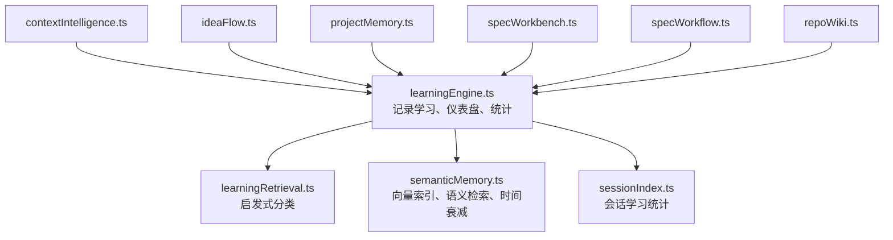
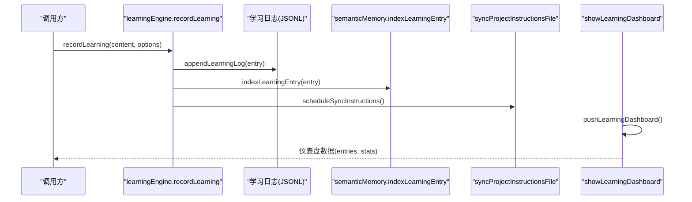
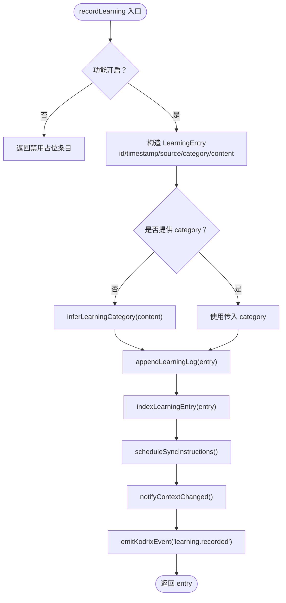
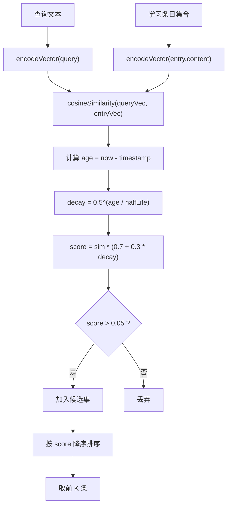
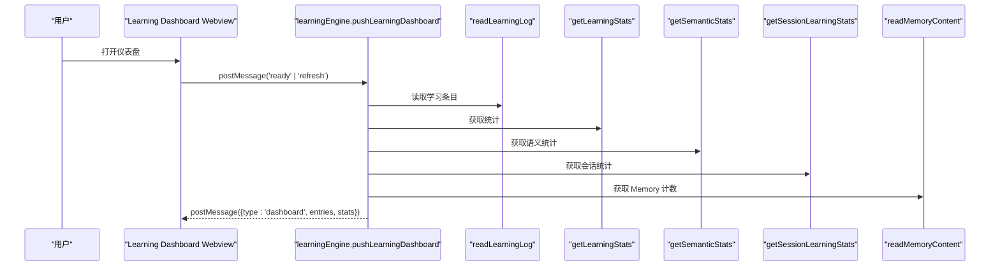
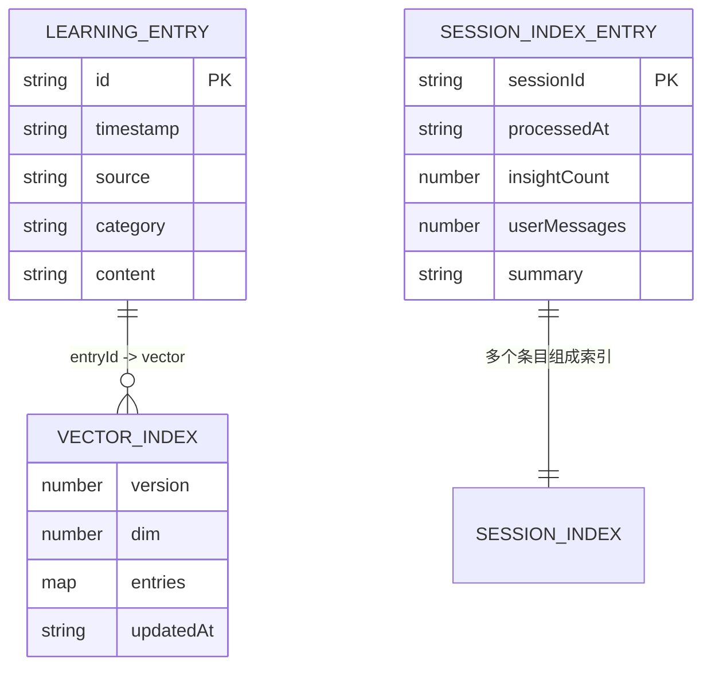
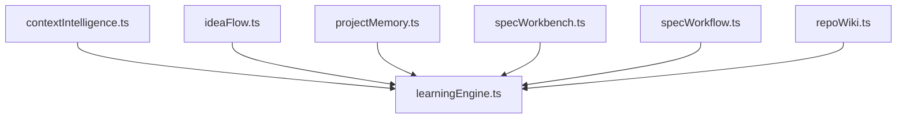

# Learning Engine 学习引擎

<cite>
**本文引用的文件**   
- [learningEngine.ts](file://extensions/kodrix-agent-os/src/learning/learningEngine.ts)
- [learningRetrieval.ts](file://extensions/kodrix-agent-os/src/learning/learningRetrieval.ts)
- [semanticMemory.ts](file://extensions/kodrix-agent-os/src/learning/semanticMemory.ts)
- [sessionIndex.ts](file://extensions/kodrix-agent-os/src/learning/sessionIndex.ts)
- [contextIntelligence.ts](file://extensions/kodrix-agent-os/src/context/contextIntelligence.ts)
- [ideaFlow.ts](file://extensions/kodrix-agent-os/src/experience/ideaFlow.ts)
- [projectMemory.ts](file://extensions/kodrix-agent-os/src/memory/projectMemory.ts)
- [specWorkbench.ts](file://extensions/kodrix-agent-os/src/spec/specWorkbench.ts)
- [specWorkflow.ts](file://extensions/kodrix-agent-os/src/spec/specWorkflow.ts)
- [repoWiki.ts](file://extensions/kodrix-agent-os/src/wiki/repoWiki.ts)
- [项目非常有必要新实现的核心功能总报告.md](file://docs/项目非常有必要新实现的核心功能总报告.md)
</cite>

## 目录
1. [引言](#引言)
2. [项目结构定位](#项目结构定位)
3. [核心组件](#核心组件)
4. [架构总览](#架构总览)
5. [关键流程与算法详解](#关键流程与算法详解)
6. [学习仪表盘与可视化](#学习仪表盘与可视化)
7. [数据存储结构与索引优化](#数据存储结构与索引优化)
8. [依赖关系分析](#依赖关系分析)
9. [性能与可扩展性](#性能与可扩展性)
10. [高级配置与调优](#高级配置与调优)
11. [故障排查指南](#故障排查指南)
12. [结论](#结论)

## 引言
Learning Engine 是 Kodrix 的“越用越聪明”学习系统，负责沉淀项目知识、自动分类、语义检索、权重衰减、指令同步以及学习仪表盘展示。它通过记录学习条目、构建本地向量索引、结合时间衰减进行相似检索，并将近期学习结果注入 Agent 指令，从而让后续对话和代码生成更贴合项目上下文。

根据仓库中的规划文档，Learning Engine 当前已闭环 TF-IDF 本地向量、余弦检索、时间衰减、自动分类、学习仪表盘与 Instructions 同步；下一步目标是升级为真实 embeddings 并增强交互式仪表盘能力。

**章节来源**
- [项目非常有必要新实现的核心功能总报告.md:21-44](file://docs/项目非常有必要新实现的核心功能总报告.md#L21-L44)

## 项目结构定位
Learning Engine 位于 `extensions/kodrix-agent-os/src/learning` 目录下，核心由以下模块组成：
- learningEngine：学习入口、日志持久化、Instructions 同步、仪表盘面板、统计摘要。
- learningRetrieval：启发式分类规则，用于 inferLearningCategory。
- semanticMemory：TF-IDF 向量化、余弦相似度、时间衰减、索引重建与统计。
- sessionIndex：会话学习统计索引，供仪表盘展示处理进度与洞察数量。

**图表来源**
- [learningEngine.ts:1-360](file://extensions/kodrix-agent-os/src/learning/learningEngine.ts#L1-L360)
- [learningRetrieval.ts:1-31](file://extensions/kodrix-agent-os/src/learning/learningRetrieval.ts#L1-L31)
- [semanticMemory.ts:1-272](file://extensions/kodrix-agent-os/src/learning/semanticMemory.ts#L1-L272)
- [sessionIndex.ts:1-63](file://extensions/kodrix-agent-os/src/learning/sessionIndex.ts#L1-L63)

**章节来源**
- [learningEngine.ts:1-360](file://extensions/kodrix-agent-os/src/learning/learningEngine.ts#L1-L360)
- [learningRetrieval.ts:1-31](file://extensions/kodrix-agent-os/src/learning/learningRetrieval.ts#L1-L31)
- [semanticMemory.ts:1-272](file://extensions/kodrix-agent-os/src/learning/semanticMemory.ts#L1-L272)
- [sessionIndex.ts:1-63](file://extensions/kodrix-agent-os/src/learning/sessionIndex.ts#L1-L63)

## 核心组件
- 学习条目模型：包含 id、timestamp、source、category、content。
- 学习来源类型：manual、capture、session、wiki、spec、auto。
- 知识类别：architecture、convention、pattern、pitfall、preference、other。
- 学习日志：JSON Lines 格式，按行追加，超限后原子压缩保留最新 200 条。
- 语义索引：固定维度（128）的 TF-IDF 向量 + 余弦相似度，支持时间衰减。
- 会话索引：记录每个会话的处理数、洞察数等统计。
- 仪表盘：Webview 面板，展示学习条目、统计、本周新增、Memory 计数、语义向量数等。

**章节来源**
- [learningEngine.ts:27-39](file://extensions/kodrix-agent-os/src/learning/learningEngine.ts#L27-L39)
- [learningEngine.ts:66-96](file://extensions/kodrix-agent-os/src/learning/learningEngine.ts#L66-L96)
- [semanticMemory.ts:24-34](file://extensions/kodrix-agent-os/src/learning/semanticMemory.ts#L24-L34)
- [sessionIndex.ts:11-22](file://extensions/kodrix-agent-os/src/learning/sessionIndex.ts#L11-L22)

## 架构总览
Learning Engine 的整体数据流如下：
- 外部调用 recordLearning 写入学习日志。
- 同时构建语义向量索引。
- 限流同步 Instructions 文件，将近期学习注入 Agent 指令。
- 仪表盘读取日志、语义统计与会话统计，渲染可视化面板。
- 语义检索使用 TF-IDF 向量与时间衰减计算综合得分。

**图表来源**
- [learningEngine.ts:98-126](file://extensions/kodrix-agent-os/src/learning/learningEngine.ts#L98-L126)
- [learningEngine.ts:128-157](file://extensions/kodrix-agent-os/src/learning/learningEngine.ts#L128-L157)
- [learningEngine.ts:234-337](file://extensions/kodrix-agent-os/src/learning/learningEngine.ts#L234-L337)
- [semanticMemory.ts:132-141](file://extensions/kodrix-agent-os/src/learning/semanticMemory.ts#L132-L141)

**章节来源**
- [learningEngine.ts:98-157](file://extensions/kodrix-agent-os/src/learning/learningEngine.ts#L98-L157)
- [learningEngine.ts:234-337](file://extensions/kodrix-agent-os/src/learning/learningEngine.ts#L234-L337)
- [semanticMemory.ts:132-141](file://extensions/kodrix-agent-os/src/learning/semanticMemory.ts#L132-L141)

## 关键流程与算法详解

### recordLearning 函数实现原理
recordLearning 是学习引擎的主入口，负责：
- 检查功能开关（kodrix.features.learning）。
- 生成唯一 id 与时间戳。
- 若未指定 category，则调用 inferLearningCategory 智能分类。
- 追加学习日志。
- 构建语义向量索引。
- 限流同步 Instructions 文件。
- 通知上下文变更并发布事件。

**图表来源**
- [learningEngine.ts:98-126](file://extensions/kodrix-agent-os/src/learning/learningEngine.ts#L98-L126)
- [learningRetrieval.ts:12-30](file://extensions/kodrix-agent-os/src/learning/learningRetrieval.ts#L12-L30)

**章节来源**
- [learningEngine.ts:98-126](file://extensions/kodrix-agent-os/src/learning/learningEngine.ts#L98-L126)

### inferLearningCategory 智能分类算法
inferLearningCategory 基于正则匹配对内容进行启发式分类：
- architecture：架构、模块、分层、微服务、monorepo、设计模式等关键词。
- convention：命名、约定、规范、lint、eslint、prettier、风格等关键词。
- pitfall：陷阱、注意、avoid、don't、别用、坑、bug、issue、错误等关键词。
- preference：偏好、prefer、喜欢、习惯、favorite、default 等关键词。
- pattern：模式、pattern、repository、factory、singleton、hook、middleware、adapter 等关键词。
- other：默认类别。

该分类减少手动选择类别的摩擦，提升用户体验。

**章节来源**
- [learningRetrieval.ts:12-30](file://extensions/kodrix-agent-os/src/learning/learningRetrieval.ts#L12-L30)

### knowledgeScore 评分系统与 weightDecay 权重衰减策略
在语义检索中，score 由两部分组成：
- 相似度 sim：query 向量与 entry 向量的余弦相似度。
- 新鲜度 decay：基于时间的半衰期衰减，半衰期为 30 天。

综合得分公式为：
- score = sim * (0.7 + 0.3 * decay)

这意味着：
- 70% 取决于语义相似度。
- 30% 取决于时间新鲜度，越新的条目权重越高。
- 过滤阈值 > 0.05，避免低相关结果污染。

**图表来源**
- [semanticMemory.ts:152-186](file://extensions/kodrix-agent-os/src/learning/semanticMemory.ts#L152-L186)

**章节来源**
- [semanticMemory.ts:152-186](file://extensions/kodrix-agent-os/src/learning/semanticMemory.ts#L152-L186)

## 学习仪表盘与可视化
学习仪表盘通过 Webview 面板展示：
- 学习条目列表（entries）。
- 统计信息：totalEntries、sessionProcessed、semanticVectors、thisWeek、memoryCount。
- 交互命令：ready、refresh、capture。

仪表盘数据来源：
- readLearningLog：读取学习日志。
- getLearningStats：统计总数与类别分布。
- getSemanticStats：语义向量统计。
- getSessionLearningStats：会话学习统计。
- readMemoryContent：Memory 计数。

**图表来源**
- [learningEngine.ts:234-337](file://extensions/kodrix-agent-os/src/learning/learningEngine.ts#L234-L337)

**章节来源**
- [learningEngine.ts:234-337](file://extensions/kodrix-agent-os/src/learning/learningEngine.ts#L234-L337)

## 数据存储结构与索引优化
- 学习日志：JSON Lines 格式，每行一个 LearningEntry。
- 语义索引：learning.vectors.json，存储 version、dim、entries（entryId → float32 vector）、updatedAt。
- 会话索引：sessions.json（路径由 getSessionIndexPath 提供），存储 SessionIndexEntry 数组。
- 缓存机制：语义记忆模块维护 EntryCache，基于 mtime 失效，避免重复读盘。
- 原子写入：atomicWriteFileSync 保证写入安全。
- 索引清理：saveIndex 会清理不在学习日志中的旧条目。

**图表来源**
- [learningEngine.ts:30-36](file://extensions/kodrix-agent-os/src/learning/learningEngine.ts#L30-L36)
- [semanticMemory.ts:29-34](file://extensions/kodrix-agent-os/src/learning/semanticMemory.ts#L29-L34)
- [sessionIndex.ts:11-17](file://extensions/kodrix-agent-os/src/learning/sessionIndex.ts#L11-L17)

**章节来源**
- [learningEngine.ts:66-96](file://extensions/kodrix-agent-os/src/learning/learningEngine.ts#L66-L96)
- [semanticMemory.ts:24-81](file://extensions/kodrix-agent-os/src/learning/semanticMemory.ts#L24-L81)
- [sessionIndex.ts:24-48](file://extensions/kodrix-agent-os/src/learning/sessionIndex.ts#L24-L48)

## 依赖关系分析
Learning Engine 被多个扩展模块调用，形成稳定的依赖关系：
- contextIntelligence：生成 Repo Wiki 时可触发 recordLearning。
- ideaFlow：经验流中记录学习条目。
- projectMemory：项目 Memory 捕获时调用 recordLearning。
- specWorkbench/specWorkflow：Spec 创建时记录架构类学习。
- repoWiki：Repo Wiki 更新时记录学习。

**图表来源**
- [contextIntelligence.ts:195](file://extensions/kodrix-agent-os/src/context/contextIntelligence.ts#L195)
- [ideaFlow.ts:902-907](file://extensions/kodrix-agent-os/src/experience/ideaFlow.ts#L902-L907)
- [projectMemory.ts:44-45](file://extensions/kodrix-agent-os/src/memory/projectMemory.ts#L44-L45)
- [specWorkbench.ts:81](file://extensions/kodrix-agent-os/src/spec/specWorkbench.ts#L81)
- [specWorkflow.ts:36](file://extensions/kodrix-agent-os/src/spec/specWorkflow.ts#L36)
- [repoWiki.ts:285-286](file://extensions/kodrix-agent-os/src/wiki/repoWiki.ts#L285-L286)

**章节来源**
- [contextIntelligence.ts:195](file://extensions/kodrix-agent-os/src/context/contextIntelligence.ts#L195)
- [ideaFlow.ts:902-907](file://extensions/kodrix-agent-os/src/experience/ideaFlow.ts#L902-L907)
- [projectMemory.ts:44-45](file://extensions/kodrix-agent-os/src/memory/projectMemory.ts#L44-L45)
- [specWorkbench.ts:81](file://extensions/kodrix-agent-os/src/spec/specWorkbench.ts#L81)
- [specWorkflow.ts:36](file://extensions/kodrix-agent-os/src/spec/specWorkflow.ts#L36)
- [repoWiki.ts:285-286](file://extensions/kodrix-agent-os/src/wiki/repoWiki.ts#L285-L286)

## 性能与可扩展性
- 向量维度固定为 128，降低内存占用与计算成本。
- 使用缓存 EntryCache 避免频繁读盘。
- 原子写入 atomicWriteFileSync 保证数据安全。
- 索引重建 rebuildIndex 批量处理所有学习条目。
- 仪表盘延迟初始化，避免阻塞扩展启动。
- 未来可替换为真实 embeddings（本地 transformer 或 Copilot embeddings API），提升语义理解精度。

**章节来源**
- [semanticMemory.ts:24-34](file://extensions/kodrix-agent-os/src/learning/semanticMemory.ts#L24-L34)
- [semanticMemory.ts:87-128](file://extensions/kodrix-agent-os/src/learning/semanticMemory.ts#L87-L128)
- [semanticMemory.ts:215-236](file://extensions/kodrix-agent-os/src/learning/semanticMemory.ts#L215-L236)
- [learningEngine.ts:340-359](file://extensions/kodrix-agent-os/src/learning/learningEngine.ts#L340-L359)
- [项目非常有必要新实现的核心功能总报告.md:38-44](file://docs/项目非常有必要新实现的核心功能总报告.md#L38-L44)

## 高级配置与调优
- 功能开关：
  - kodrix.features.learning：控制 Learning Engine 是否启用。
  - kodrix.features.semanticMemory：控制语义索引是否构建。
- 分类规则：
  - 可通过修改 inferLearningCategory 的正则表达式自定义分类规则。
- 检索参数：
  - searchSimilar 的 topK 控制返回条数。
  - halfLife 控制时间衰减速度（默认 30 天）。
  - score 阈值 0.05 控制过滤强度。
- 仪表盘：
  - 可通过 Webview 消息接口扩展交互命令。
  - 可调整 maxEntries 与 maxChars 控制摘要长度。

**章节来源**
- [learningEngine.ts:102-103](file://extensions/kodrix-agent-os/src/learning/learningEngine.ts#L102-L103)
- [semanticMemory.ts:133-134](file://extensions/kodrix-agent-os/src/learning/semanticMemory.ts#L133-L134)
- [semanticMemory.ts:152-186](file://extensions/kodrix-agent-os/src/learning/semanticMemory.ts#L152-L186)
- [learningRetrieval.ts:12-30](file://extensions/kodrix-agent-os/src/learning/learningRetrieval.ts#L12-L30)

## 故障排查指南
- 仪表盘 HTML 资源加载失败：
  - 回退到纯文本文档显示基础统计。
- 语义索引尚未构建：
  - 启动时延迟重建索引，避免阻塞扩展激活。
- 学习日志损坏：
  - 解析失败时跳过坏行，保证其他条目正常读取。
- 功能关闭：
  - recordLearning 返回禁用占位条目，不影响调用方逻辑。

**章节来源**
- [learningEngine.ts:270-277](file://extensions/kodrix-agent-os/src/learning/learningEngine.ts#L270-L277)
- [learningEngine.ts:348-359](file://extensions/kodrix-agent-os/src/learning/learningEngine.ts#L348-L359)
- [learningEngine.ts:74-81](file://extensions/kodrix-agent-os/src/learning/learningEngine.ts#L74-L81)
- [learningEngine.ts:102-111](file://extensions/kodrix-agent-os/src/learning/learningEngine.ts#L102-L111)

## 结论
Learning Engine 通过结构化学习日志、启发式分类、TF-IDF 向量与时间衰减的语义检索，实现了项目知识的自动沉淀与智能检索。其仪表盘提供了直观的可视化能力，帮助开发者监控学习行为与效果。未来升级至真实 embeddings 将进一步增强语义理解精度，而交互式仪表盘将提升用户操作体验。