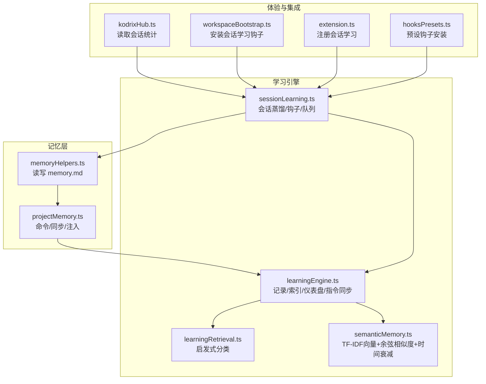
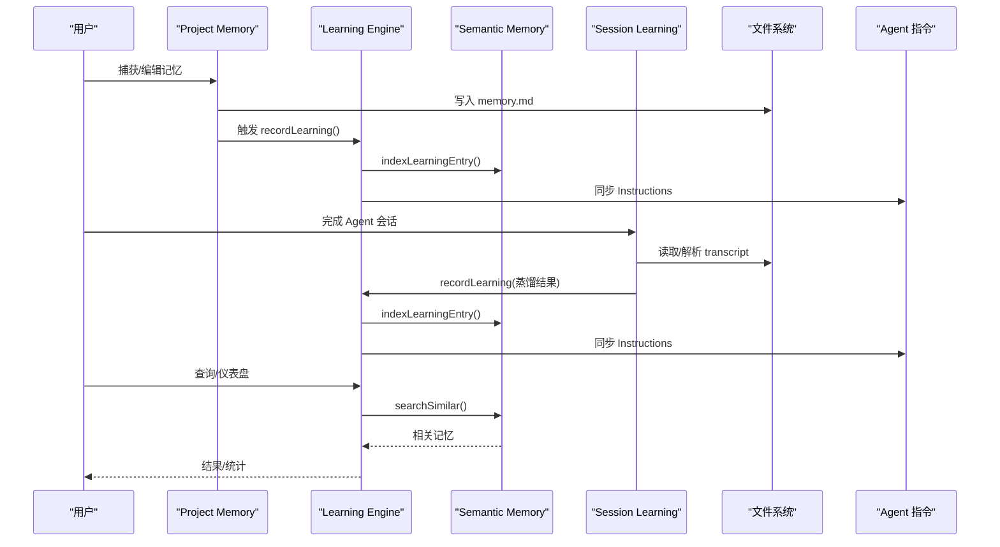
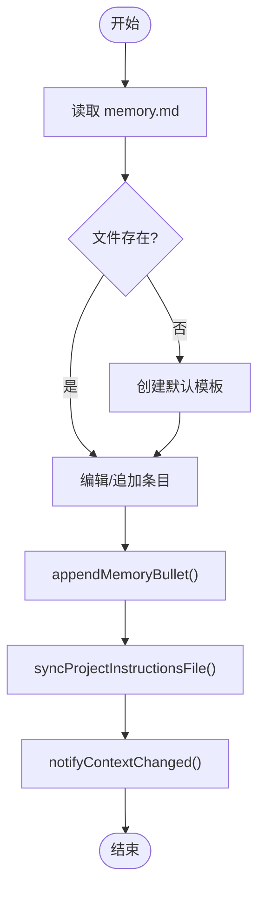
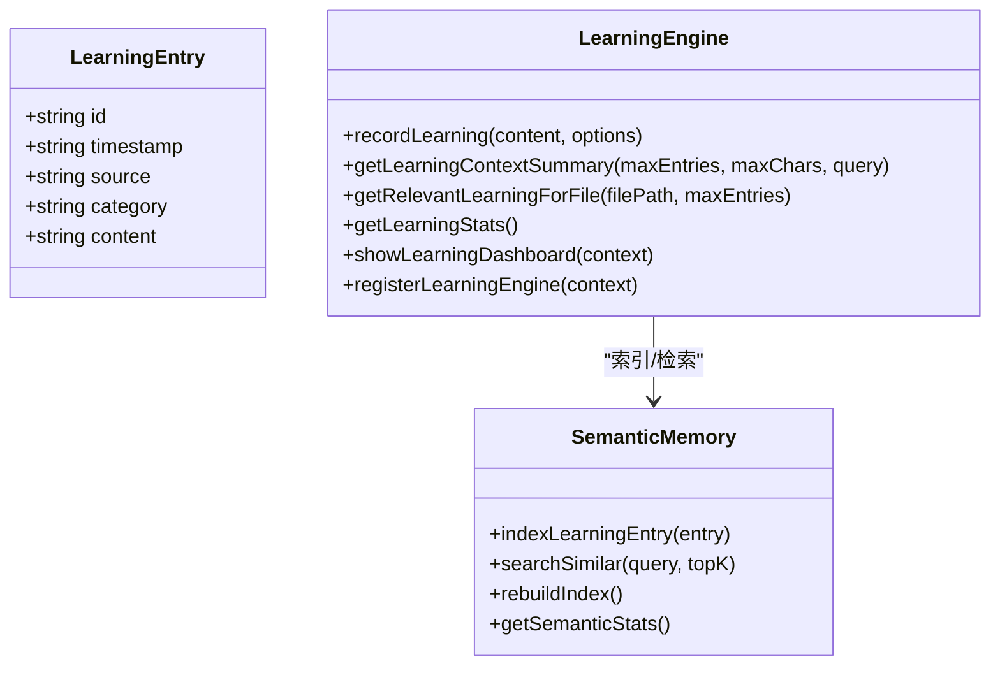
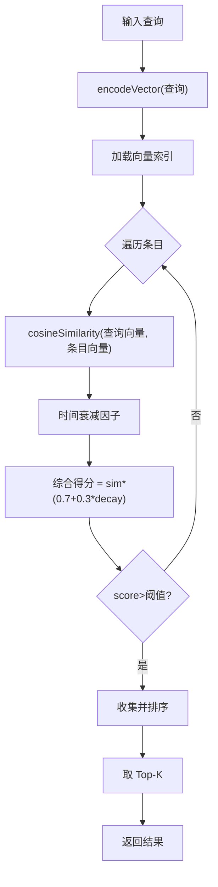
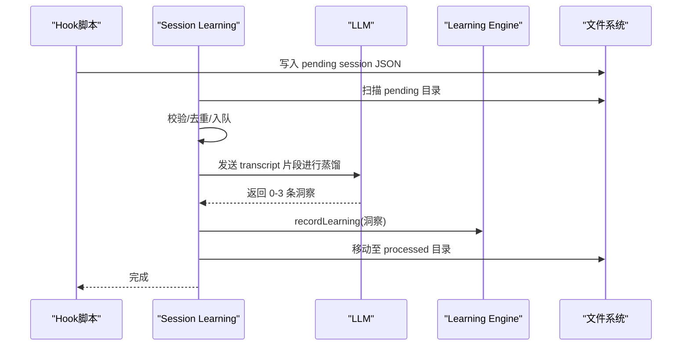
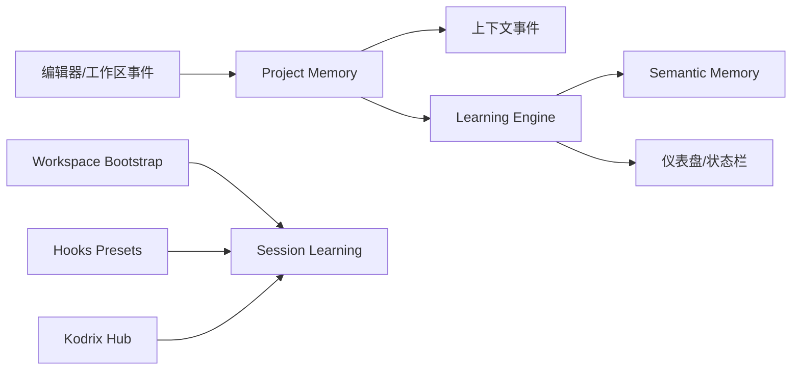
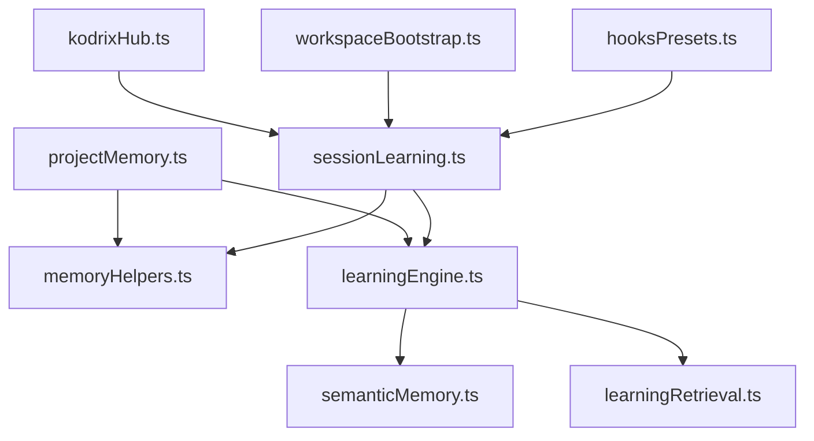

# Memory 记忆系统

<cite>
**本文引用的文件**
- [memoryHelpers.ts](file://extensions/kodrix-agent-os/src/memory/memoryHelpers.ts)
- [projectMemory.ts](file://extensions/kodrix-agent-os/src/memory/projectMemory.ts)
- [learningEngine.ts](file://extensions/kodrix-agent-os/src/learning/learningEngine.ts)
- [sessionLearning.ts](file://extensions/kodrix-agent-os/src/learning/sessionLearning.ts)
- [semanticMemory.ts](file://extensions/kodrix-agent-os/src/learning/semanticMemory.ts)
- [learningRetrieval.ts](file://extensions/kodrix-agent-os/src/learning/learningRetrieval.ts)
- [kodrixHub.ts](file://extensions/kodrix-agent-os/src/experience/kodrixHub.ts)
- [workspaceBootstrap.ts](file://extensions/kodrix-agent-os/src/experience/workspaceBootstrap.ts)
- [extension.ts](file://extensions/kodrix-agent-os/src/extension.ts)
- [hooksPresets.ts](file://extensions/kodrix-agent-os/src/hooks/hooksPresets.ts)
</cite>

## 目录
1. [简介](#简介)
2. [项目结构](#项目结构)
3. [核心组件](#核心组件)
4. [架构总览](#架构总览)
5. [详细组件分析](#详细组件分析)
6. [依赖关系分析](#依赖关系分析)
7. [性能与可扩展性](#性能与可扩展性)
8. [故障排查指南](#故障排查指南)
9. [结论](#结论)
10. [附录：配置与使用示例](#附录配置与使用示例)

## 简介
本文件系统性说明 Kodrix 的 Memory 记忆系统与 Learning Engine，覆盖语义记忆机制、向量索引、知识存储、权重衰减、跨会话检索、Project Memory 自动沉淀、Session Learning 对话蒸馏、学习仪表盘、上下文感知集成等。目标是帮助不同技术水平的用户从基础概念到高级配置全面掌握该能力。

## 项目结构
Memory 与 Learning Engine 主要位于扩展 kodrix-agent-os 中，分为“记忆持久化”“学习引擎”“语义检索”“会话学习”四大模块，并通过命令、事件和文件系统与 VS Code 工作区、指令注入、Webview 仪表盘交互。

图表来源
- [memoryHelpers.ts:1-100](file://extensions/kodrix-agent-os/src/memory/memoryHelpers.ts#L1-L100)
- [projectMemory.ts:1-92](file://extensions/kodrix-agent-os/src/memory/projectMemory.ts#L1-L92)
- [learningEngine.ts:1-360](file://extensions/kodrix-agent-os/src/learning/learningEngine.ts#L1-L360)
- [learningRetrieval.ts:1-31](file://extensions/kodrix-agent-os/src/learning/learningRetrieval.ts#L1-L31)
- [semanticMemory.ts:1-272](file://extensions/kodrix-agent-os/src/learning/semanticMemory.ts#L1-L272)
- [sessionLearning.ts:1-395](file://extensions/kodrix-agent-os/src/learning/sessionLearning.ts#L1-L395)
- [kodrixHub.ts:12-59](file://extensions/kodrix-agent-os/src/experience/kodrixHub.ts#L12-L59)
- [workspaceBootstrap.ts:13-42](file://extensions/kodrix-agent-os/src/experience/workspaceBootstrap.ts#L13-L42)
- [extension.ts:13-175](file://extensions/kodrix-agent-os/src/extension.ts#L13-L175)
- [hooksPresets.ts:8-72](file://extensions/kodrix-agent-os/src/hooks/hooksPresets.ts#L8-L72)

章节来源
- [memoryHelpers.ts:1-100](file://extensions/kodrix-agent-os/src/memory/memoryHelpers.ts#L1-L100)
- [projectMemory.ts:1-92](file://extensions/kodrix-agent-os/src/memory/projectMemory.ts#L1-L92)
- [learningEngine.ts:1-360](file://extensions/kodrix-agent-os/src/learning/learningEngine.ts#L1-L360)
- [sessionLearning.ts:1-395](file://extensions/kodrix-agent-os/src/learning/sessionLearning.ts#L1-L395)
- [semanticMemory.ts:1-272](file://extensions/kodrix-agent-os/src/learning/semanticMemory.ts#L1-L272)
- [learningRetrieval.ts:1-31](file://extensions/kodrix-agent-os/src/learning/learningRetrieval.ts#L1-L31)
- [kodrixHub.ts:12-59](file://extensions/kodrix-agent-os/src/experience/kodrixHub.ts#L12-L59)
- [workspaceBootstrap.ts:13-42](file://extensions/kodrix-agent-os/src/experience/workspaceBootstrap.ts#L13-L42)
- [extension.ts:13-175](file://extensions/kodrix-agent-os/src/extension.ts#L13-L175)
- [hooksPresets.ts:8-72](file://extensions/kodrix-agent-os/src/hooks/hooksPresets.ts#L8-L72)

## 核心组件
- Project Memory（项目记忆）
  - 以 Markdown 形式维护 memory.md，支持追加条目、确保文件存在、按章节插入、原子写入。
  - 提供命令打开/查看/捕获记忆，并在保存时同步到 Agent 指令上下文。
- Learning Engine（学习引擎）
  - 记录学习条目（含类别、来源、时间戳），写入日志并构建语义索引。
  - 将近期学习与 Memory 同步为 Agent 指令，供任务上下文使用。
  - 提供仪表盘 Webview 展示统计与条目列表。
- Semantic Memory（语义记忆）
  - 本地 TF-IDF 词向量 + 余弦相似度，固定维度向量索引文件。
  - 搜索时融合相似度与时间衰减，返回 Top-K 相关记忆。
  - 支持重建索引、统计查询、空白建议。
- Session Learning（会话学习）
  - 通过 Hook 在 Agent 会话结束时收集 transcript，调用 LLM 蒸馏出 0-3 条知识。
  - 支持自动/提示/关闭模式，最小消息数过滤，去重与队列处理。
  - 将提炼结果写入 Memory 和学习日志，更新会话索引。

章节来源
- [projectMemory.ts:19-92](file://extensions/kodrix-agent-os/src/memory/projectMemory.ts#L19-L92)
- [memoryHelpers.ts:35-100](file://extensions/kodrix-agent-os/src/memory/memoryHelpers.ts#L35-L100)
- [learningEngine.ts:98-198](file://extensions/kodrix-agent-os/src/learning/learningEngine.ts#L98-L198)
- [semanticMemory.ts:132-250](file://extensions/kodrix-agent-os/src/learning/semanticMemory.ts#L132-L250)
- [sessionLearning.ts:61-203](file://extensions/kodrix-agent-os/src/learning/sessionLearning.ts#L61-L203)

## 架构总览
Memory 记忆系统由“记忆持久化—学习引擎—语义检索—会话学习—体验集成”构成，形成“采集→索引→检索→注入”的闭环。

图表来源
- [projectMemory.ts:19-58](file://extensions/kodrix-agent-os/src/memory/projectMemory.ts#L19-L58)
- [memoryHelpers.ts:72-99](file://extensions/kodrix-agent-os/src/memory/memoryHelpers.ts#L72-L99)
- [learningEngine.ts:98-157](file://extensions/kodrix-agent-os/src/learning/learningEngine.ts#L98-L157)
- [semanticMemory.ts:132-186](file://extensions/kodrix-agent-os/src/learning/semanticMemory.ts#L132-L186)
- [sessionLearning.ts:165-203](file://extensions/kodrix-agent-os/src/learning/sessionLearning.ts#L165-L203)

## 详细组件分析

### 组件A：Project Memory（项目记忆）
- 职责
  - 管理 memory.md 的读取、写入、章节插入与原子落盘。
  - 暴露命令：查看、捕获、注入指令上下文。
  - 监听保存事件，同步指令并通知上下文变更。
- 关键流程
  - 捕获记忆 → 追加 bullet → 同步指令 → 通知上下文。
  - 打开 memory.md → 若不存在则创建默认模板。
- 错误处理
  - 读失败返回空；写前确保目录存在；原子写入避免损坏。

图表来源
- [memoryHelpers.ts:35-99](file://extensions/kodrix-agent-os/src/memory/memoryHelpers.ts#L35-L99)
- [projectMemory.ts:19-58](file://extensions/kodrix-agent-os/src/memory/projectMemory.ts#L19-L58)

章节来源
- [projectMemory.ts:19-92](file://extensions/kodrix-agent-os/src/memory/projectMemory.ts#L19-L92)
- [memoryHelpers.ts:35-99](file://extensions/kodrix-agent-os/src/memory/memoryHelpers.ts#L35-L99)

### 组件B：Learning Engine（学习引擎）
- 职责
  - 记录学习条目（来源、类别、内容、时间）。
  - 写入学习日志、构建/更新语义索引、限流同步指令。
  - 生成学习摘要、最近学习、相关学习、统计信息。
  - 提供仪表盘 Webview 与命令入口。
- 关键流程
  - recordLearning → appendLearningLog → indexLearningEntry → scheduleSyncInstructions。
  - getLearningContextSummary/searchSimilar → 聚合输出。
- 错误处理
  - 日志行解析失败跳过；超大日志压缩保留最新 200 条；仪表盘资源加载失败降级文本。

图表来源
- [learningEngine.ts:30-198](file://extensions/kodrix-agent-os/src/learning/learningEngine.ts#L30-L198)
- [semanticMemory.ts:132-250](file://extensions/kodrix-agent-os/src/learning/semanticMemory.ts#L132-L250)

章节来源
- [learningEngine.ts:98-360](file://extensions/kodrix-agent-os/src/learning/learningEngine.ts#L98-L360)

### 组件C：Semantic Memory（语义记忆）
- 职责
  - 本地 TF-IDF 词向量编码，固定维度向量索引文件。
  - 相似度计算 + 时间衰减（半衰期 30 天），Top-K 检索。
  - 重建索引、统计、空白建议。
- 复杂度
  - 编码 O(n) 词元；相似度 O(d) 向量点积；检索 O(N·d)。
- 优化
  - 条目缓存（基于 mtime）；原子写入；无效条目清理。

图表来源
- [semanticMemory.ts:148-186](file://extensions/kodrix-agent-os/src/learning/semanticMemory.ts#L148-L186)

章节来源
- [semanticMemory.ts:1-272](file://extensions/kodrix-agent-os/src/learning/semanticMemory.ts#L1-272)

### 组件D：Session Learning（会话学习）
- 职责
  - 安装 Hook（Stop 事件）收集 transcript。
  - 解析 transcript，调用 LLM 蒸馏 0-3 条知识。
  - 支持 auto/prompt/off 模式，最小消息数过滤。
  - 去重、队列处理、移动到已处理目录。
- 关键流程
  - installSessionLearningHook → processPendingFile → distillInsights → applyInsights → appendSessionIndex。
- 错误处理
  - transcript 过大跳过；读取失败记录警告；无效 payload 删除。

图表来源
- [sessionLearning.ts:273-323](file://extensions/kodrix-agent-os/src/learning/sessionLearning.ts#L273-L323)
- [sessionLearning.ts:165-203](file://extensions/kodrix-agent-os/src/learning/sessionLearning.ts#L165-L203)
- [learningEngine.ts:98-126](file://extensions/kodrix-agent-os/src/learning/learningEngine.ts#L98-L126)

章节来源
- [sessionLearning.ts:61-395](file://extensions/kodrix-agent-os/src/learning/sessionLearning.ts#L61-L395)

### 组件E：上下文感知集成
- 文件打开或保存时，Project Memory 会同步指令并通知上下文变更。
- 学习引擎可基于当前文件路径检索相关学习条目。
- 体验层（kodrixHub、workspaceBootstrap、hooksPresets）负责安装 Hook、读取会话统计、初始化学习功能。

图表来源
- [projectMemory.ts:60-83](file://extensions/kodrix-agent-os/src/memory/projectMemory.ts#L60-L83)
- [learningEngine.ts:179-181](file://extensions/kodrix-agent-os/src/learning/learningEngine.ts#L179-L181)
- [workspaceBootstrap.ts:13-42](file://extensions/kodrix-agent-os/src/experience/workspaceBootstrap.ts#L13-L42)
- [hooksPresets.ts:8-72](file://extensions/kodrix-agent-os/src/hooks/hooksPresets.ts#L8-L72)
- [kodrixHub.ts:12-59](file://extensions/kodrix-agent-os/src/experience/kodrixHub.ts#L12-L59)

章节来源
- [projectMemory.ts:60-83](file://extensions/kodrix-agent-os/src/memory/projectMemory.ts#L60-L83)
- [learningEngine.ts:179-181](file://extensions/kodrix-agent-os/src/learning/learningEngine.ts#L179-L181)
- [workspaceBootstrap.ts:13-42](file://extensions/kodrix-agent-os/src/experience/workspaceBootstrap.ts#L13-L42)
- [hooksPresets.ts:8-72](file://extensions/kodrix-agent-os/src/hooks/hooksPresets.ts#L8-L72)
- [kodrixHub.ts:12-59](file://extensions/kodrix-agent-os/src/experience/kodrixHub.ts#L12-L59)

## 依赖关系分析
- 模块耦合
  - Project Memory 依赖 memoryHelpers 进行 IO，并触发 Learning Engine 同步指令。
  - Learning Engine 依赖 semanticMemory 进行索引与检索，依赖 learningRetrieval 进行启发式分类。
  - Session Learning 依赖 Learning Engine 与 memoryHelpers，同时通过文件系统与 Hook 协作。
- 外部依赖
  - VS Code API：命令、Webview、文件系统、语言模型聊天。
  - 本地文件：memory.md、学习日志、向量索引、会话队列。
- 潜在循环
  - 通过 memoryHelpers 解耦 Memory 与 Learning Engine，避免直接循环依赖。

图表来源
- [projectMemory.ts:1-92](file://extensions/kodrix-agent-os/src/memory/projectMemory.ts#L1-L92)
- [memoryHelpers.ts:1-100](file://extensions/kodrix-agent-os/src/memory/memoryHelpers.ts#L1-L100)
- [learningEngine.ts:1-360](file://extensions/kodrix-agent-os/src/learning/learningEngine.ts#L1-L360)
- [semanticMemory.ts:1-272](file://extensions/kodrix-agent-os/src/learning/semanticMemory.ts#L1-L272)
- [learningRetrieval.ts:1-31](file://extensions/kodrix-agent-os/src/learning/learningRetrieval.ts#L1-L31)
- [sessionLearning.ts:1-395](file://extensions/kodrix-agent-os/src/learning/sessionLearning.ts#L1-L395)
- [kodrixHub.ts:12-59](file://extensions/kodrix-agent-os/src/experience/kodrixHub.ts#L12-L59)
- [workspaceBootstrap.ts:13-42](file://extensions/kodrix-agent-os/src/experience/workspaceBootstrap.ts#L13-L42)
- [hooksPresets.ts:8-72](file://extensions/kodrix-agent-os/src/hooks/hooksPresets.ts#L8-L72)

章节来源
- [projectMemory.ts:1-92](file://extensions/kodrix-agent-os/src/memory/projectMemory.ts#L1-L92)
- [memoryHelpers.ts:1-100](file://extensions/kodrix-agent-os/src/memory/memoryHelpers.ts#L1-L100)
- [learningEngine.ts:1-360](file://extensions/kodrix-agent-os/src/learning/learningEngine.ts#L1-L360)
- [semanticMemory.ts:1-272](file://extensions/kodrix-agent-os/src/learning/semanticMemory.ts#L1-L272)
- [learningRetrieval.ts:1-31](file://extensions/kodrix-agent-os/src/learning/learningRetrieval.ts#L1-L31)
- [sessionLearning.ts:1-395](file://extensions/kodrix-agent-os/src/learning/sessionLearning.ts#L1-L395)
- [kodrixHub.ts:12-59](file://extensions/kodrix-agent-os/src/experience/kodrixHub.ts#L12-L59)
- [workspaceBootstrap.ts:13-42](file://extensions/kodrix-agent-os/src/experience/workspaceBootstrap.ts#L13-L42)
- [hooksPresets.ts:8-72](file://extensions/kodrix-agent-os/src/hooks/hooksPresets.ts#L8-L72)

## 性能与可扩展性
- 性能特性
  - 向量检索：O(N·d)，N 为条目数，d 为向量维度（固定 128）。
  - 时间衰减：常数时间计算，提升新条目权重。
  - 日志压缩：超过阈值后仅保留最新 200 条，降低 I/O。
  - 条目缓存：基于 mtime 的内存缓存，减少重复读盘。
- 可扩展点
  - 替换编码函数为真实 embeddings（本地 transformer 或 API），提升语义精度。
  - 增加增量索引与检索缓存，进一步降低延迟。
  - 增强仪表盘交互（搜索/筛选/编辑/删除条目）。

[本节为通用指导，不直接分析具体文件]

## 故障排查指南
- 常见问题
  - 仪表盘 HTML 资源加载失败：回退显示文本版本，检查扩展资源路径。
  - transcript 过大：跳过处理，避免阻塞扩展主机。
  - 无效 payload：删除并记录警告，防止污染队列。
  - 语义索引未构建：启动时延迟重建，失败时记录警告。
- 定位方法
  - 查看学习日志与向量索引文件是否存在且格式正确。
  - 检查会话学习 Hook 是否安装成功，pending 目录是否有待处理文件。
  - 确认 features 开关（learning、semanticMemory、sessionLearning）是否启用。

章节来源
- [learningEngine.ts:236-359](file://extensions/kodrix-agent-os/src/learning/learningEngine.ts#L236-L359)
- [sessionLearning.ts:165-247](file://extensions/kodrix-agent-os/src/learning/sessionLearning.ts#L165-L247)

## 结论
Kodrix 的 Memory 记忆系统通过 Project Memory、Learning Engine、Semantic Memory 与 Session Learning 形成完整的“采集—索引—检索—注入”闭环。当前实现以本地 TF-IDF 向量与时间衰减为核心，具备低延迟、零外部依赖的优势；未来可通过真实 embeddings 与交互式仪表盘进一步增强语义理解与用户体验。

[本节为总结，不直接分析具体文件]

## 附录：配置与使用示例
- 配置项
  - kodrix.features.learning：启用/禁用学习引擎。
  - kodrix.features.semanticMemory：启用/禁用语义记忆索引。
  - kodrix.features.sessionLearning：启用/禁用会话学习。
  - kodrix.sessionLearning.mode：auto/prompt/off。
  - kodrix.sessionLearning.minUserMessages：最少用户消息数。
  - kodrix.sessionLearning.autoInstallHook：是否自动安装 Hook。
- 常用命令
  - 查看项目 Memory：kodrix.memory.show
  - 从选择/输入沉淀记忆：kodrix.memory.capture
  - 沉淀项目知识（含类别选择）：kodrix.learn.capture
  - 打开学习仪表盘：kodrix.learn.dashboard
  - 安装会话学习 Hook：kodrix.learn.installSessionHook
  - 查看会话学习状态：kodrix.learn.sessionStatus
  - 手动扫描待处理会话：kodrix.learn.processPendingSessions
- 使用示例
  - 在项目根目录编辑 memory.md，新增架构偏好或团队约定，保存后自动同步到 Agent 指令。
  - 在编辑器中选择一段代码或说明，执行“沉淀项目知识”，选择类别后写入 Memory 并索引。
  - 完成一次 Agent 会话后，等待 Hook 触发，系统将蒸馏知识并询问是否沉淀（prompt 模式）。
  - 打开学习仪表盘，查看本周新增、语义向量数量、Memory 条目数与最近学习。
  - 根据当前文件路径，系统会自动检索相关学习条目并注入上下文。

章节来源
- [projectMemory.ts:60-92](file://extensions/kodrix-agent-os/src/memory/projectMemory.ts#L60-L92)
- [learningEngine.ts:200-360](file://extensions/kodrix-agent-os/src/learning/learningEngine.ts#L200-L360)
- [sessionLearning.ts:61-395](file://extensions/kodrix-agent-os/src/learning/sessionLearning.ts#L61-L395)