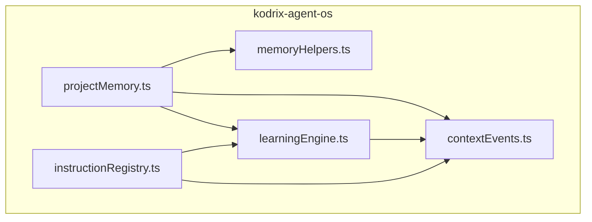
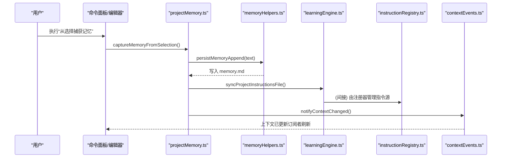
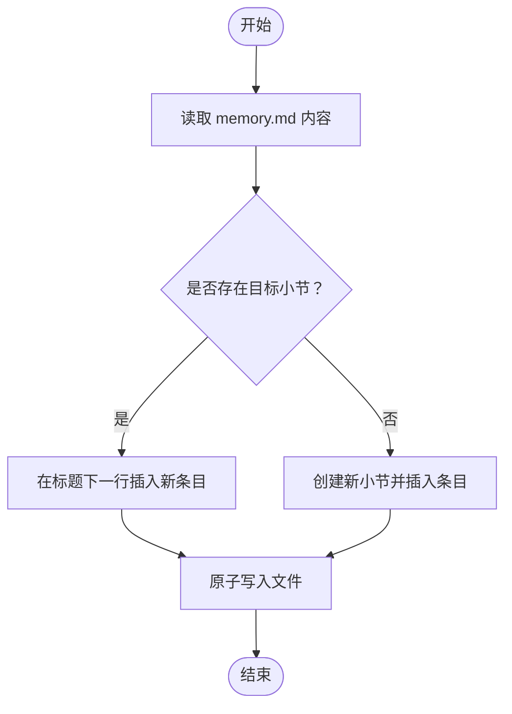
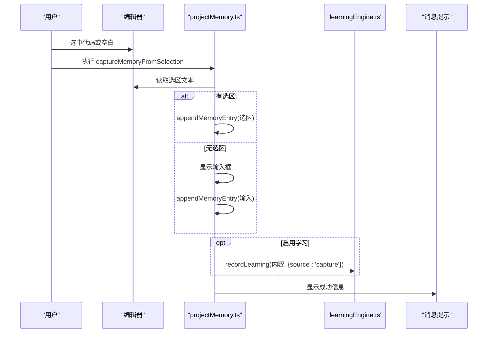
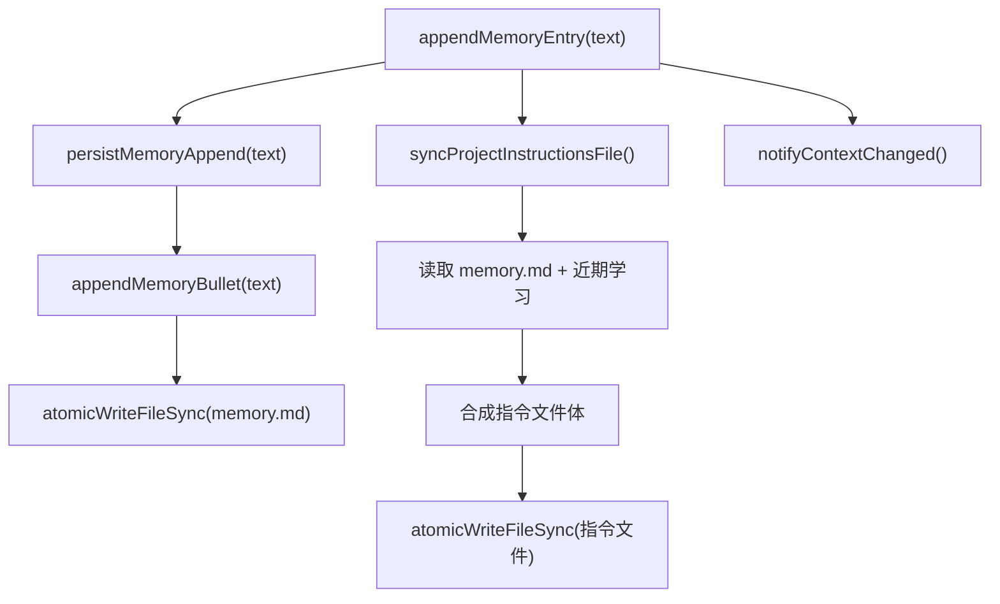
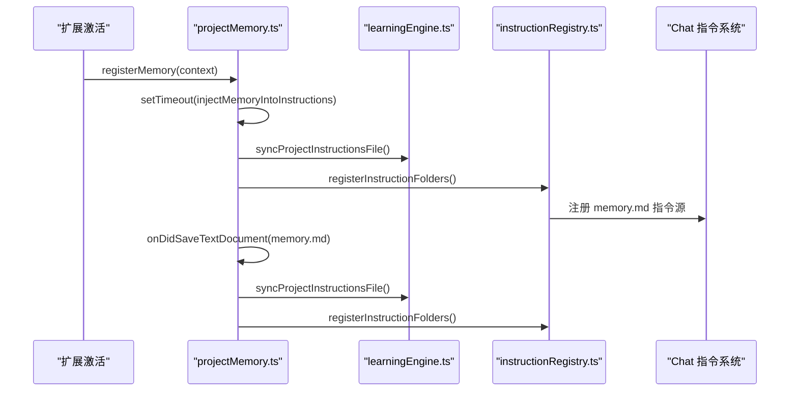
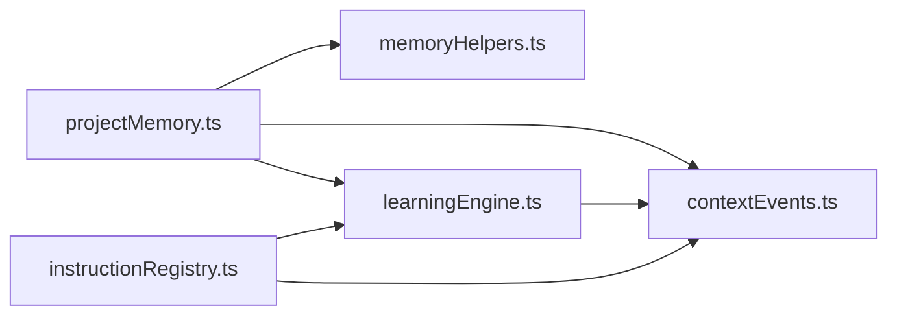

# Project Memory 项目记忆

<cite>
**本文引用的文件**
- [projectMemory.ts](file://extensions/kodrix-agent-os/src/memory/projectMemory.ts)
- [memoryHelpers.ts](file://extensions/kodrix-agent-os/src/memory/memoryHelpers.ts)
- [learningEngine.ts](file://extensions/kodrix-agent-os/src/learning/learningEngine.ts)
- [instructionRegistry.ts](file://extensions/kodrix-agent-os/src/context/instructionRegistry.ts)
- [contextEvents.ts](file://extensions/kodrix-agent-os/src/context/contextEvents.ts)
</cite>

## 目录
1. [简介](#简介)
2. [项目结构](#项目结构)
3. [核心组件](#核心组件)
4. [架构总览](#架构总览)
5. [详细组件分析](#详细组件分析)
6. [依赖关系分析](#依赖关系分析)
7. [性能与可靠性](#性能与可靠性)
8. [故障排查指南](#故障排查指南)
9. [结论](#结论)
10. [附录：配置与使用示例](#附录配置与使用示例)

## 简介
Project Memory 是 Kodrix Agent OS 中的“跨会话项目记忆”能力。它通过一个可编辑的 memory.md 文件，沉淀项目的架构约定、技术栈选择、团队规范、已知陷阱等知识片段；并在用户捕获或编辑这些内容时，自动同步到 AI 指令文件中，使 Agent 在后续对话中持续获得上下文。该功能提供以下关键能力：
- 从代码选择或输入框捕获知识并写入 memory.md
- 打开并查看 memory.md 进行人工维护
- 将 memory.md 内容与近期学习记录合并，生成供 AI 使用的指令文件
- 监听 memory.md 保存事件，触发指令文件同步与上下文通知
- 与 Learning Engine 联动，自动分类、索引并注入到 Agent 上下文

## 项目结构
Project Memory 的实现集中在 kodrix-agent-os 扩展中，围绕 memory.md 的读写、指令文件同步和上下文通知形成最小闭环：
- memory 模块：负责 memory.md 的创建、追加、读取与持久化
- learning 模块：负责学习日志、语义索引、指令文件合成
- context 模块：负责注册指令文件夹、发布上下文变更事件
- paths 工具：统一 memory.md、指令文件、学习日志等路径解析

图表来源
- [projectMemory.ts:1-92](file://extensions/kodrix-agent-os/src/memory/projectMemory.ts#L1-L92)
- [memoryHelpers.ts:1-100](file://extensions/kodrix-agent-os/src/memory/memoryHelpers.ts#L1-L100)
- [learningEngine.ts:1-360](file://extensions/kodrix-agent-os/src/learning/learningEngine.ts#L1-L360)
- [instructionRegistry.ts:1-101](file://extensions/kodrix-agent-os/src/context/instructionRegistry.ts#L1-L101)
- [contextEvents.ts:1-15](file://extensions/kodrix-agent-os/src/context/contextEvents.ts#L1-L15)

章节来源
- [projectMemory.ts:1-92](file://extensions/kodrix-agent-os/src/memory/projectMemory.ts#L1-L92)
- [memoryHelpers.ts:1-100](file://extensions/kodrix-agent-os/src/memory/memoryHelpers.ts#L1-L100)
- [learningEngine.ts:1-360](file://extensions/kodrix-agent-os/src/learning/learningEngine.ts#L1-L360)
- [instructionRegistry.ts:1-101](file://extensions/kodrix-agent-os/src/context/instructionRegistry.ts#L1-L101)
- [contextEvents.ts:1-15](file://extensions/kodrix-agent-os/src/context/contextEvents.ts#L1-L15)

## 核心组件
- appendMemoryEntry：新增一条记忆条目，完成持久化、指令文件同步与上下文通知
- captureMemoryFromSelection：从编辑器选区或输入框获取文本，调用 appendMemoryEntry，并可选记录学习
- showMemory：确保 memory.md 存在并打开文档
- injectMemoryIntoInstructions：根据设置决定是否注入指令文件并注册指令文件夹
- registerMemory：注册命令、监听 memory.md 保存事件、启动注入流程
- memoryHelpers：readMemoryContent、ensureMemoryFile、appendMemoryBullet、persistMemoryAppend、writeMemoryContentRaw
- learningEngine：recordLearning、syncProjectInstructionsFile、getRecentLearning、getLearningContextSummary 等
- instructionRegistry：registerInstructionFolders，将 memory.md 所在目录注册为 Chat 指令源
- contextEvents：onContextChanged 事件与 notifyContextChanged 通知

章节来源
- [projectMemory.ts:19-83](file://extensions/kodrix-agent-os/src/memory/projectMemory.ts#L19-L83)
- [memoryHelpers.ts:39-99](file://extensions/kodrix-agent-os/src/memory/memoryHelpers.ts#L39-L99)
- [learningEngine.ts:98-157](file://extensions/kodrix-agent-os/src/learning/learningEngine.ts#L98-L157)
- [instructionRegistry.ts:25-61](file://extensions/kodrix-agent-os/src/context/instructionRegistry.ts#L25-L61)
- [contextEvents.ts:7-14](file://extensions/kodrix-agent-os/src/context/contextEvents.ts#L7-L14)

## 架构总览
Project Memory 的工作流分为“捕获/编辑 → 持久化 → 指令文件同步 → 上下文通知 → Agent 消费”五个阶段。

图表来源
- [projectMemory.ts:31-48](file://extensions/kodrix-agent-os/src/memory/projectMemory.ts#L31-L48)
- [memoryHelpers.ts:97-99](file://extensions/kodrix-agent-os/src/memory/memoryHelpers.ts#L97-L99)
- [learningEngine.ts:128-157](file://extensions/kodrix-agent-os/src/learning/learningEngine.ts#L128-L157)
- [instructionRegistry.ts:38-61](file://extensions/kodrix-agent-os/src/context/instructionRegistry.ts#L38-L61)
- [contextEvents.ts:12-14](file://extensions/kodrix-agent-os/src/context/contextEvents.ts#L12-L14)

## 详细组件分析

### memory.md 结构与格式规范
- 默认模板包含若干常用小节，如架构偏好、命名规范、常用库与模式、团队约定、已知陷阱等，便于团队沉淀长期约定
- 每次捕获会追加一条带日期的条目，优先插入到“捕获记录”小节；若不存在则尝试插入到“团队约定”，否则新建“捕获记录”小节
- 首次打开 memory.md 时会确保文件存在，避免空指针或读异常

图表来源
- [memoryHelpers.ts:60-99](file://extensions/kodrix-agent-os/src/memory/memoryHelpers.ts#L60-L99)

章节来源
- [memoryHelpers.ts:9-33](file://extensions/kodrix-agent-os/src/memory/memoryHelpers.ts#L9-L33)
- [memoryHelpers.ts:51-58](file://extensions/kodrix-agent-os/src/memory/memoryHelpers.ts#L51-L58)
- [memoryHelpers.ts:60-99](file://extensions/kodrix-agent-os/src/memory/memoryHelpers.ts#L60-L99)

### captureMemoryFromSelection 命令
- 行为：优先使用当前编辑器选区文本，否则弹出输入框让用户输入
- 成功后调用 appendMemoryEntry，并根据设置决定是否记录学习（source=capture）
- 完成后提示用户已写入并同步到 Agent 上下文

图表来源
- [projectMemory.ts:31-48](file://extensions/kodrix-agent-os/src/memory/projectMemory.ts#L31-L48)
- [learningEngine.ts:98-126](file://extensions/kodrix-agent-os/src/learning/learningEngine.ts#L98-L126)

章节来源
- [projectMemory.ts:31-48](file://extensions/kodrix-agent-os/src/memory/projectMemory.ts#L31-L48)

### showMemory 命令
- 确保 memory.md 文件存在（必要时创建默认模板）
- 打开文档以便用户直接编辑长期记忆

章节来源
- [projectMemory.ts:25-29](file://extensions/kodrix-agent-os/src/memory/projectMemory.ts#L25-L29)
- [memoryHelpers.ts:51-58](file://extensions/kodrix-agent-os/src/memory/memoryHelpers.ts#L51-L58)

### appendMemoryEntry 工作原理
- 持久化：调用 persistMemoryAppend，内部通过 appendMemoryBullet 构造条目并原子写入 memory.md
- 指令文件同步：调用 syncProjectInstructionsFile，将 memory.md 内容与近期学习记录合并，生成供 AI 使用的指令文件
- 上下文通知：调用 notifyContextChanged，通知订阅者刷新上下文

图表来源
- [projectMemory.ts:19-23](file://extensions/kodrix-agent-os/src/memory/projectMemory.ts#L19-L23)
- [memoryHelpers.ts:97-99](file://extensions/kodrix-agent-os/src/memory/memoryHelpers.ts#L97-L99)
- [learningEngine.ts:128-157](file://extensions/kodrix-agent-os/src/learning/learningEngine.ts#L128-L157)
- [contextEvents.ts:12-14](file://extensions/kodrix-agent-os/src/context/contextEvents.ts#L12-L14)

章节来源
- [projectMemory.ts:19-23](file://extensions/kodrix-agent-os/src/memory/projectMemory.ts#L19-L23)
- [memoryHelpers.ts:97-99](file://extensions/kodrix-agent-os/src/memory/memoryHelpers.ts#L97-L99)
- [learningEngine.ts:128-157](file://extensions/kodrix-agent-os/src/learning/learningEngine.ts#L128-L157)
- [contextEvents.ts:12-14](file://extensions/kodrix-agent-os/src/context/contextEvents.ts#L12-L14)

### 指令文件注入与 Agent 上下文集成
- 当 memory 功能开启时，会在扩展激活后延迟执行 injectMemoryIntoInstructions，调用 syncProjectInstructionsFile 并注册指令文件夹
- registerInstructionFolders 会将 memory.md 所在目录注册为 Chat 指令源，使 AI 在对话中自动读取该指令文件
- 当 memory.md 被保存时，也会触发同步与上下文通知，保证最新内容生效

图表来源
- [projectMemory.ts:50-83](file://extensions/kodrix-agent-os/src/memory/projectMemory.ts#L50-L83)
- [instructionRegistry.ts:38-61](file://extensions/kodrix-agent-os/src/context/instructionRegistry.ts#L38-L61)
- [learningEngine.ts:128-157](file://extensions/kodrix-agent-os/src/learning/learningEngine.ts#L128-L157)

章节来源
- [projectMemory.ts:50-83](file://extensions/kodrix-agent-os/src/memory/projectMemory.ts#L50-L83)
- [instructionRegistry.ts:38-61](file://extensions/kodrix-agent-os/src/context/instructionRegistry.ts#L38-L61)

### 与 Learning Engine 的协作
- captureMemoryFromSelection 在启用学习时调用 recordLearning，将内容写入学习日志、建立语义索引，并调度指令文件同步
- syncProjectInstructionsFile 会读取 memory.md 与最近的学习记录，合并成一段 Markdown 注入到指令文件
- getLearningContextSummary 可用于在聊天界面展示最近的“越用越聪明”摘要

章节来源
- [projectMemory.ts:42-46](file://extensions/kodrix-agent-os/src/memory/projectMemory.ts#L42-L46)
- [learningEngine.ts:98-157](file://extensions/kodrix-agent-os/src/learning/learningEngine.ts#L98-L157)

## 依赖关系分析
- projectMemory.ts 依赖 memoryHelpers.ts 进行文件读写，依赖 learningEngine.ts 进行指令文件同步，依赖 contextEvents.ts 进行上下文通知
- learningEngine.ts 依赖 contextEvents.ts 发出上下文变更事件，并通过 paths 工具定位文件
- instructionRegistry.ts 依赖 learningEngine.ts 生成指令文件，并通过 paths 工具注册指令源
- 所有文件读写均通过 atomicWriteFileSync 保证原子性，避免并发写入导致损坏

图表来源
- [projectMemory.ts:1-12](file://extensions/kodrix-agent-os/src/memory/projectMemory.ts#L1-L12)
- [learningEngine.ts:1-24](file://extensions/kodrix-agent-os/src/learning/learningEngine.ts#L1-L24)
- [instructionRegistry.ts:1-19](file://extensions/kodrix-agent-os/src/context/instructionRegistry.ts#L1-L19)
- [contextEvents.ts:1-15](file://extensions/kodrix-agent-os/src/context/contextEvents.ts#L1-L15)

章节来源
- [projectMemory.ts:1-12](file://extensions/kodrix-agent-os/src/memory/projectMemory.ts#L1-L12)
- [learningEngine.ts:1-24](file://extensions/kodrix-agent-os/src/learning/learningEngine.ts#L1-L24)
- [instructionRegistry.ts:1-19](file://extensions/kodrix-agent-os/src/context/instructionRegistry.ts#L1-L19)
- [contextEvents.ts:1-15](file://extensions/kodrix-agent-os/src/context/contextEvents.ts#L1-L15)

## 性能与可靠性
- 指令文件同步采用限流策略：多次触发时仅在 1 秒内合并一次磁盘写入，避免频繁 IO
- 文件写入使用原子写入，降低并发写导致的损坏风险
- 学习日志超过阈值时会压缩保留最近条目，控制文件大小
- memory.md 保存监听仅对 memory.md 本身生效，避免全量扫描带来的开销

章节来源
- [learningEngine.ts:48-59](file://extensions/kodrix-agent-os/src/learning/learningEngine.ts#L48-L59)
- [learningEngine.ts:86-96](file://extensions/kodrix-agent-os/src/learning/learningEngine.ts#L86-L96)
- [projectMemory.ts:66-83](file://extensions/kodrix-agent-os/src/memory/projectMemory.ts#L66-L83)

## 故障排查指南
- 无法看到 memory.md：确认 ensureMemoryFile 是否被调用（showMemory），以及 memory 功能是否启用
- 指令文件未更新：检查 registerInstructionFolders 是否执行，以及 memory.md 保存事件是否触发
- 学习记录未生效：确认学习功能开关，以及 recordLearning 是否被调用
- 上下文未刷新：确认 notifyContextChanged 是否被调用，且订阅者是否正确处理 onContextChanged

章节来源
- [projectMemory.ts:25-29](file://extensions/kodrix-agent-os/src/memory/projectMemory.ts#L25-L29)
- [projectMemory.ts:66-83](file://extensions/kodrix-agent-os/src/memory/projectMemory.ts#L66-L83)
- [learningEngine.ts:98-126](file://extensions/kodrix-agent-os/src/learning/learningEngine.ts#L98-L126)
- [contextEvents.ts:7-14](file://extensions/kodrix-agent-os/src/context/contextEvents.ts#L7-L14)

## 结论
Project Memory 以 memory.md 为核心载体，结合 Learning Engine 与指令文件注入机制，实现了“捕获即沉淀、沉淀即可用”的闭环。通过命令面板与编辑器交互，开发者可以便捷地捕获架构约定、技术栈选择、开发陷阱等知识；Agent 则在后续对话中自动获得最新上下文，提升理解与生成质量。

## 附录：配置与使用示例
- 启用/关闭记忆与学习
  - 通过设置项 kodrix.features.memory 控制记忆功能开关
  - 通过设置项 kodrix.features.learning 控制学习引擎开关
- 常用命令
  - Kodrix: 查看项目 Memory（打开 memory.md）
  - Kodrix: 从选择捕获记忆（从选区或输入框捕获并写入 memory.md）
- 日常用法建议
  - 在代码审查或讨论中发现重要约定时，立即使用“从选择捕获记忆”
  - 定期打开 memory.md 整理条目，补充团队约定与陷阱
  - 保持学习引擎开启，让 Agent 自动分类与索引，提升后续任务质量

章节来源
- [projectMemory.ts:50-83](file://extensions/kodrix-agent-os/src/memory/projectMemory.ts#L50-L83)
- [learningEngine.ts:98-126](file://extensions/kodrix-agent-os/src/learning/learningEngine.ts#L98-L126)