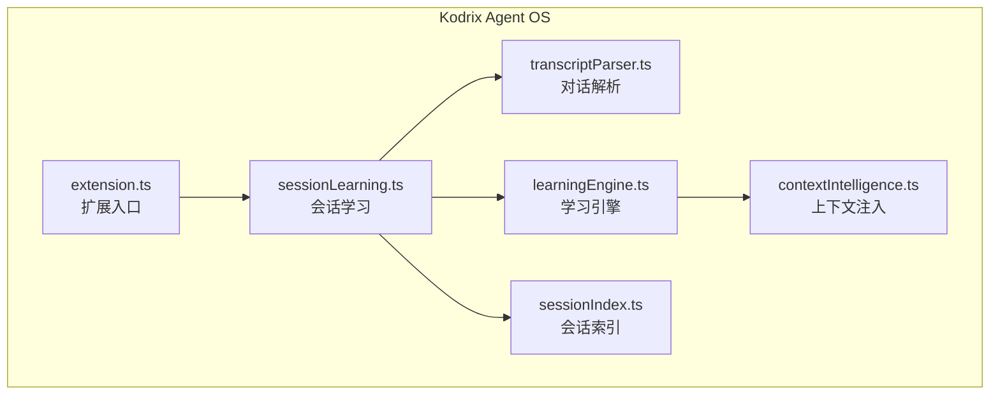
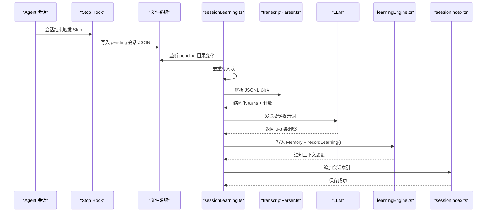
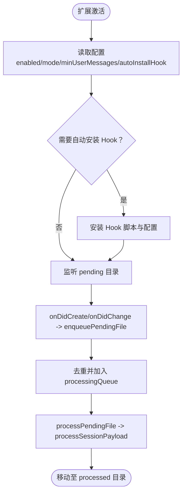
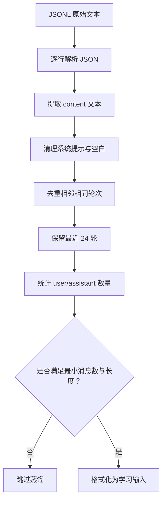
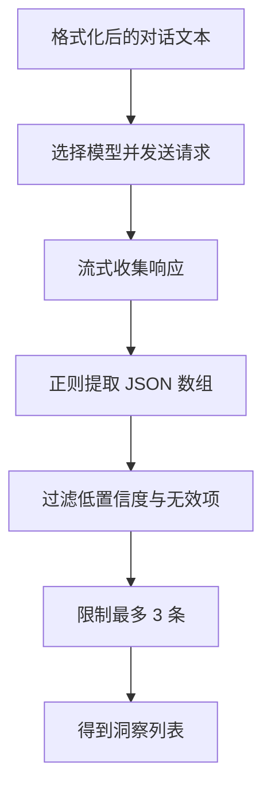
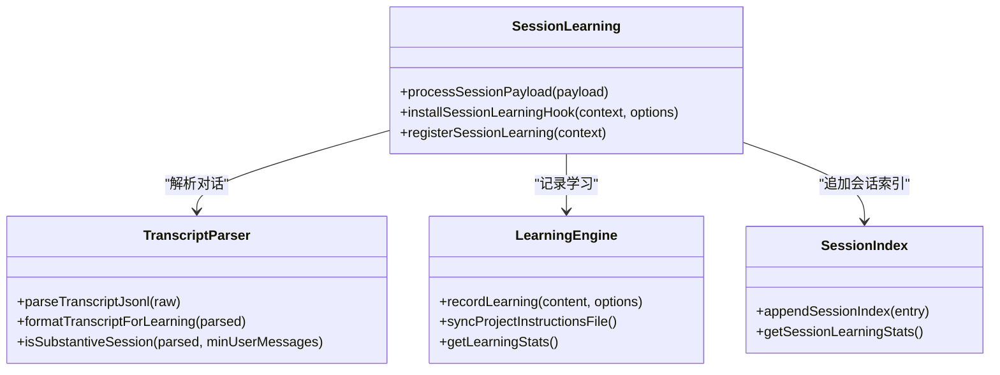
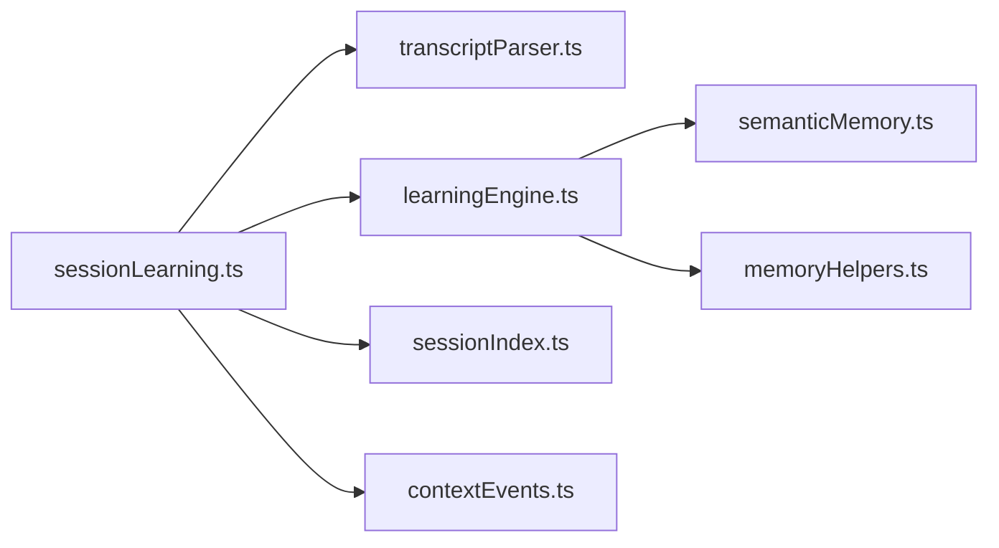

# Session Learning 会话学习

<cite>
**本文引用的文件**   
- [sessionLearning.ts](file://extensions/kodrix-agent-os/src/learning/sessionLearning.ts)
- [learningEngine.ts](file://extensions/kodrix-agent-os/src/learning/learningEngine.ts)
- [transcriptParser.ts](file://extensions/kodrix-agent-os/src/learning/transcriptParser.ts)
- [sessionIndex.ts](file://extensions/kodrix-agent-os/src/learning/sessionIndex.ts)
- [extension.ts](file://extensions/kodrix-agent-os/src/extension.ts)
- [package.json](file://extensions/kodrix-agent-os/package.json)
- [package.nls.zh-cn.json](file://extensions/kodrix-agent-os/package.nls.zh-cn.json)
- [contextIntelligence.ts](file://extensions/kodrix-agent-os/src/context/contextIntelligence.ts)
</cite>

## 目录
1. [引言](#引言)
2. [项目结构](#项目结构)
3. [核心组件](#核心组件)
4. [架构总览](#架构总览)
5. [详细组件分析](#详细组件分析)
6. [依赖关系分析](#依赖关系分析)
7. [性能与可靠性](#性能与可靠性)
8. [配置选项说明](#配置选项说明)
9. [使用场景与最佳实践](#使用场景与最佳实践)
10. [故障排查指南](#故障排查指南)
11. [结论](#结论)

## 引言
Session Learning（会话学习）是 Kodrix Agent OS 的“越用越聪明”能力之一。它通过 Hook 在 Agent 会话结束时捕获对话记录，利用 LLM 对对话进行知识蒸馏，自动识别有价值的信息，并将其沉淀为长期记忆、学习日志和语义索引，从而让后续 Agent 会话能携带更准确的项目上下文。

该机制的核心流程包括：
- 会话结束触发 Hook，产出待处理会话；
- 扩展监听待处理队列，解析并评估会话是否值得学习；
- 调用 LLM 从对话历史中提取 0-3 条关键洞察；
- 将洞察写入 Memory、Learning Log，并更新语义索引与会话索引；
- 同步 Project Instructions，使后续 Agent 自动获得最新知识。

## 项目结构
Session Learning 主要位于扩展 kodrix-agent-os 的学习子系统内，相关文件如下：
- sessionLearning.ts：会话监听、Hook 安装、待处理队列扫描、蒸馏与应用。
- transcriptParser.ts：解析 Copilot/Claude 风格的 JSONL 对话记录。
- learningEngine.ts：学习引擎，负责记录学习、分类、索引、仪表盘与指令同步。
- sessionIndex.ts：会话学习统计索引，供 Hub 与仪表盘展示。
- extension.ts：扩展入口，注册 Session Learning 功能。
- package.json / package.nls.zh-cn.json：命令、设置项与本地化描述。
- contextIntelligence.ts：上下文注入，消费 Learning Engine 的输出。

**图表来源**
- [extension.ts:1-24](file://extensions/kodrix-agent-os/src/extension.ts#L1-L24)
- [sessionLearning.ts:1-24](file://extensions/kodrix-agent-os/src/learning/sessionLearning.ts#L1-L24)
- [transcriptParser.ts:1-15](file://extensions/kodrix-agent-os/src/learning/transcriptParser.ts#L1-L15)
- [learningEngine.ts:1-26](file://extensions/kodrix-agent-os/src/learning/learningEngine.ts#L1-L26)
- [sessionIndex.ts:1-22](file://extensions/kodrix-agent-os/src/learning/sessionIndex.ts#L1-L22)
- [contextIntelligence.ts:64-92](file://extensions/kodrix-agent-os/src/context/contextIntelligence.ts#L64-L92)

**章节来源**
- [extension.ts:1-24](file://extensions/kodrix-agent-os/src/extension.ts#L1-L24)
- [sessionLearning.ts:1-24](file://extensions/kodrix-agent-os/src/learning/sessionLearning.ts#L1-L24)

## 核心组件
- 会话监听与队列管理：负责安装 Hook、监听 .kodrix/sessions/pending 目录、去重与顺序处理。
- 对话解析器：兼容多种 JSONL 格式，过滤噪声，计算用户消息数量与长度阈值。
- 知识蒸馏器：调用 LLM 从对话中抽取结构化洞察（内容、类别、置信度）。
- 应用层：根据模式（auto/prompt/off）决定是否写入 Memory 与 Learning Log。
- 学习引擎：记录学习条目、分类、索引、仪表盘与 Project Instructions 同步。
- 会话索引：持久化已处理会话的摘要与统计，供 Hub 与仪表盘展示。

**章节来源**
- [sessionLearning.ts:26-75](file://extensions/kodrix-agent-os/src/learning/sessionLearning.ts#L26-L75)
- [transcriptParser.ts:62-125](file://extensions/kodrix-agent-os/src/learning/transcriptParser.ts#L62-L125)
- [learningEngine.ts:98-126](file://extensions/kodrix-agent-os/src/learning/learningEngine.ts#L98-L126)
- [sessionIndex.ts:24-62](file://extensions/kodrix-agent-os/src/learning/sessionIndex.ts#L24-L62)

## 架构总览
Session Learning 的整体数据流如下：

**图表来源**
- [sessionLearning.ts:165-203](file://extensions/kodrix-agent-os/src/learning/sessionLearning.ts#L165-L203)
- [transcriptParser.ts:62-125](file://extensions/kodrix-agent-os/src/learning/transcriptParser.ts#L62-L125)
- [learningEngine.ts:98-126](file://extensions/kodrix-agent-os/src/learning/learningEngine.ts#L98-L126)
- [sessionIndex.ts:50-62](file://extensions/kodrix-agent-os/src/learning/sessionIndex.ts#L50-L62)

## 详细组件分析

### 会话监听与 Hook 机制
- Hook 安装：
  - 提供命令安装 Hook，复制脚本到工作区 hooks 目录，并在 .github/hooks 下创建 Hook 配置，绑定 Agent 的 Stop 事件。
  - 支持首次打开工作区时自动安装（可配置关闭）。
- 待处理队列：
  - 监听 .kodrix/sessions/pending/*.json 的创建与变更事件，去重后异步处理。
  - 处理完成后移动到 processed 目录，避免重复处理。
- 状态查看：
  - 提供命令展示当前配置、待处理队列数量、最近处理记录等。

**图表来源**
- [sessionLearning.ts:273-323](file://extensions/kodrix-agent-os/src/learning/sessionLearning.ts#L273-L323)
- [sessionLearning.ts:364-393](file://extensions/kodrix-agent-os/src/learning/sessionLearning.ts#L364-L393)

**章节来源**
- [sessionLearning.ts:273-323](file://extensions/kodrix-agent-os/src/learning/sessionLearning.ts#L273-L323)
- [sessionLearning.ts:364-393](file://extensions/kodrix-agent-os/src/learning/sessionLearning.ts#L364-L393)

### 对话解析与实质性判断
- 解析器支持两种常见 JSONL 结构：
  - Copilot Agent 风格：type=user.message/assistant.message，data.content 或 data.message.content。
  - Claude CLI 风格：type=user/assistant，message.role/message.content。
- 清洗策略：
  - 移除 system-reminder 等系统提示；
  - 合并相邻同角色且文本相同的轮次；
  - 限制单轮文本长度，保留最近 24 轮用于蒸馏。
- 实质性判断：
  - 用户消息数不少于配置阈值；
  - 总字符数不低于固定阈值，过滤 trivial 会话。

**图表来源**
- [transcriptParser.ts:62-125](file://extensions/kodrix-agent-os/src/learning/transcriptParser.ts#L62-L125)

**章节来源**
- [transcriptParser.ts:62-125](file://extensions/kodrix-agent-os/src/learning/transcriptParser.ts#L62-L125)

### 知识蒸馏算法
- 提示词设计：
  - 要求 LLM 仅输出 0-3 条跨会话值得记住的知识；
  - 限定类别：architecture/convention/pattern/pitfall/preference/other；
  - 明确排除一次性代码片段、闲聊、临时调试信息等。
- LLM 调用：
  - 使用 vscode.lm.selectChatModels 获取模型；
  - 截断 transcript 前缀，控制输入大小；
  - 流式接收响应，拼接完整结果。
- 结果解析：
  - 正则匹配 JSON 数组；
  - 过滤低置信度与空内容；
  - 最多保留 3 条。

**图表来源**
- [sessionLearning.ts:44-116](file://extensions/kodrix-agent-os/src/learning/sessionLearning.ts#L44-L116)

**章节来源**
- [sessionLearning.ts:44-116](file://extensions/kodrix-agent-os/src/learning/sessionLearning.ts#L44-L116)

### 洞察应用与学习引擎协作
- 应用模式：
  - auto：直接应用所有洞察；
  - prompt：弹出预览，支持“全部沉淀/逐条选择/忽略”；
  - off：禁用会话学习。
- 写入路径：
  - persistMemoryAppend：追加到项目 Memory；
  - recordLearning：写入 Learning Log、分类、索引；
  - notifyContextChanged：通知上下文变更，刷新相关 UI。
- 学习引擎职责：
  - 记录学习条目（id、时间戳、source、category、content）；
  - 限流同步 Project Instructions（1s 内只写一次磁盘）；
  - 重建语义索引（启动后延迟执行）；
  - 提供仪表盘与统计接口。

**图表来源**
- [sessionLearning.ts:118-203](file://extensions/kodrix-agent-os/src/learning/sessionLearning.ts#L118-L203)
- [learningEngine.ts:98-157](file://extensions/kodrix-agent-os/src/learning/learningEngine.ts#L98-L157)
- [sessionIndex.ts:50-62](file://extensions/kodrix-agent-os/src/learning/sessionIndex.ts#L50-L62)

**章节来源**
- [sessionLearning.ts:118-203](file://extensions/kodrix-agent-os/src/learning/sessionLearning.ts#L118-L203)
- [learningEngine.ts:98-157](file://extensions/kodrix-agent-os/src/learning/learningEngine.ts#L98-L157)
- [sessionIndex.ts:50-62](file://extensions/kodrix-agent-os/src/learning/sessionIndex.ts#L50-L62)

### 会话索引与仪表盘
- 会话索引：
  - 存储 sessionId、processedAt、insightCount、userMessages、summary；
  - 限制 entries 长度，原子写入防止损坏。
- 仪表盘：
  - 展示学习条目总数、本周新增、语义向量数、Memory 条数、已处理会话数；
  - 支持刷新与捕获操作。

**章节来源**
- [sessionIndex.ts:11-62](file://extensions/kodrix-agent-os/src/learning/sessionIndex.ts#L11-L62)
- [learningEngine.ts:234-337](file://extensions/kodrix-agent-os/src/learning/learningEngine.ts#L234-L337)

## 依赖关系分析
- 外部依赖：
  - vscode API：workspace 配置、命令、文件系统监听、Language Model Chat、窗口交互。
  - 文件系统：pending/processed 目录、Learning Log、Session Index、Memory、Project Instructions。
- 内部依赖：
  - sessionLearning.ts 依赖 transcriptParser.ts、learningEngine.ts、sessionIndex.ts、paths、memoryHelpers、contextEvents。
  - learningEngine.ts 依赖 semanticMemory、memoryHelpers、paths、contextEvents、kodrixEventBus。
- 耦合与内聚：
  - sessionLearning.ts 作为编排者，内聚性强；
  - learningEngine.ts 提供通用学习记录与索引能力；
  - transcriptParser.ts 专注解析，职责单一；
  - sessionIndex.ts 专注会话统计，低耦合。

**图表来源**
- [sessionLearning.ts:1-24](file://extensions/kodrix-agent-os/src/learning/sessionLearning.ts#L1-L24)
- [learningEngine.ts:1-26](file://extensions/kodrix-agent-os/src/learning/learningEngine.ts#L1-L26)

**章节来源**
- [sessionLearning.ts:1-24](file://extensions/kodrix-agent-os/src/learning/sessionLearning.ts#L1-L24)
- [learningEngine.ts:1-26](file://extensions/kodrix-agent-os/src/learning/learningEngine.ts#L1-L26)

## 性能与可靠性
- 文件大小限制：
  - 单次读取 transcript 不超过 2MB，避免阻塞扩展主线程。
- 去重与队列：
  - processingQueue 保证同一文件不重复处理；
  - 处理后移动到 processed 目录，避免重复扫描。
- 写入限流：
  - Project Instructions 同步采用 1s 节流，减少频繁磁盘写入。
- 健壮性：
  - 解析失败或非法 payload 会安全删除并记录警告；
  - 索引加载失败会重置为空结构，不影响运行。

**章节来源**
- [sessionLearning.ts:171-184](file://extensions/kodrix-agent-os/src/learning/sessionLearning.ts#L171-L184)
- [sessionLearning.ts:220-247](file://extensions/kodrix-agent-os/src/learning/sessionLearning.ts#L220-L247)
- [learningEngine.ts:50-59](file://extensions/kodrix-agent-os/src/learning/learningEngine.ts#L50-L59)
- [sessionIndex.ts:24-48](file://extensions/kodrix-agent-os/src/learning/sessionIndex.ts#L24-L48)

## 配置选项说明
- 功能开关：
  - kodrix.features.sessionLearning：启用/禁用会话学习。
- 行为控制：
  - kodrix.sessionLearning.mode：auto（自动沉淀）、prompt（询问确认）、off（关闭）。
  - kodrix.sessionLearning.minUserMessages：最少用户消息数，过滤 trivial 会话。
  - kodrix.sessionLearning.autoInstallHook：首次打开工作区自动安装 Hook。
- 命令：
  - kodrix.learn.installSessionHook：安装 Session Learning Hook。
  - kodrix.learn.sessionStatus：查看会话学习状态。
  - kodrix.learn.processPendingSessions：手动扫描待处理队列。

**章节来源**
- [package.json:606-631](file://extensions/kodrix-agent-os/package.json#L606-L631)
- [package.nls.zh-cn.json:104-107](file://extensions/kodrix-agent-os/package.nls.zh-cn.json#L104-L107)
- [sessionLearning.ts:61-75](file://extensions/kodrix-agent-os/src/learning/sessionLearning.ts#L61-L75)
- [sessionLearning.ts:364-393](file://extensions/kodrix-agent-os/src/learning/sessionLearning.ts#L364-L393)

## 使用场景与最佳实践
- 典型场景：
  - 团队在 Agent 完成复杂任务后，自动沉淀架构决策、命名约定、常见陷阱；
  - 新成员入职后，Agent 能携带历史经验提供更精准建议；
  - 多 Agent 协作中，统一技术选型与测试约定。
- 最佳实践：
  - 将 mode 设为 prompt，便于人工审核蒸馏结果；
  - 提高 minUserMessages，避免短对话产生噪声；
  - 定期查看 Session Learning 状态与 Learning Dashboard，清理无效条目；
  - 结合 Context Intelligence，确保后续会话自动携带最新上下文。

[本节为概念性指导，不直接分析具体文件]

## 故障排查指南
- 未触发 Hook：
  - 检查是否已安装 Hook 脚本与配置；
  - 确认 Auto Install Hook 配置与工作区已打开。
- 无学习记录：
  - 检查 features.sessionLearning 是否启用；
  - 检查 minUserMessages 与对话长度阈值；
  - 查看 pending 目录是否有待处理文件。
- 索引异常：
  - 若 session index 损坏，会自动重置为空结构；
  - 可重新运行 processPendingSessions 触发处理。
- 上下文未更新：
  - 确认 Learning Engine 已记录学习条目；
  - 检查 Project Instructions 是否同步成功。

**章节来源**
- [sessionLearning.ts:273-323](file://extensions/kodrix-agent-os/src/learning/sessionLearning.ts#L273-L323)
- [sessionLearning.ts:325-362](file://extensions/kodrix-agent-os/src/learning/sessionLearning.ts#L325-L362)
- [sessionIndex.ts:24-48](file://extensions/kodrix-agent-os/src/learning/sessionIndex.ts#L24-L48)
- [learningEngine.ts:128-157](file://extensions/kodrix-agent-os/src/learning/learningEngine.ts#L128-L157)

## 结论
Session Learning 通过 Hook 捕获、对话解析、LLM 蒸馏、学习引擎协作与索引更新，实现了从短期对话到长期知识的自动化转化。配合灵活的配置与可视化仪表盘，开发者可以精细控制学习行为，持续优化 Agent 的项目理解能力。建议在团队协作中启用 prompt 模式，并结合 Context Intelligence，最大化发挥“越用越聪明”的价值。

[本节为总结性内容，不直接分析具体文件]