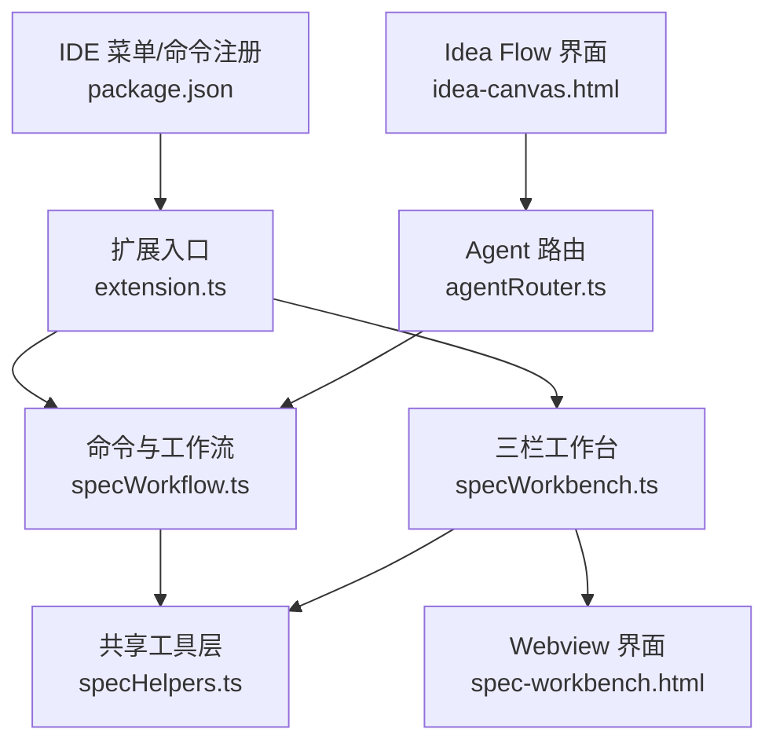
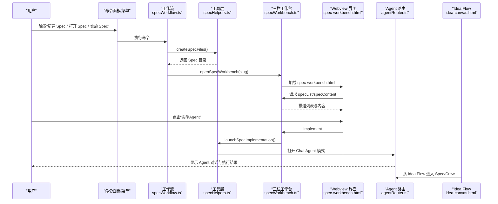
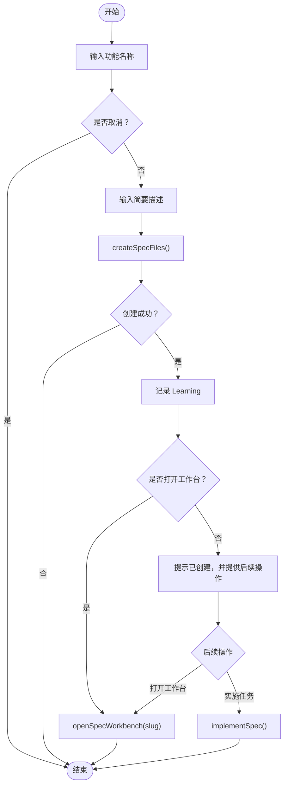
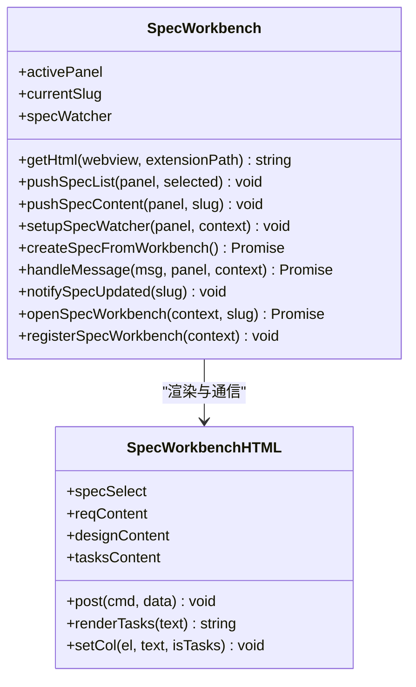
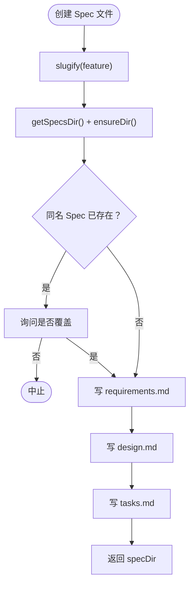
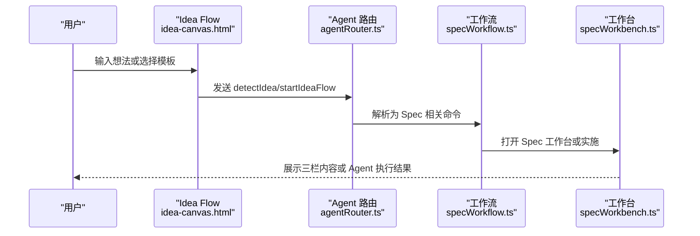
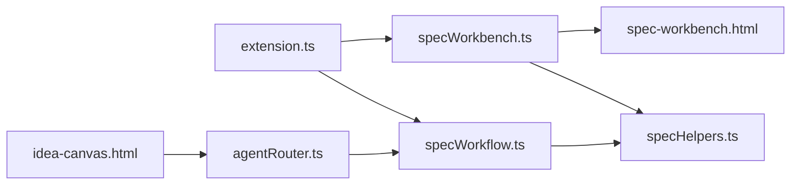

# Spec 驱动开发

<cite>
**本文引用的文件**   
- [specWorkbench.ts](file://extensions/kodrix-agent-os/src/spec/specWorkbench.ts)
- [specWorkflow.ts](file://extensions/kodrix-agent-os/src/spec/specWorkflow.ts)
- [specHelpers.ts](file://extensions/kodrix-agent-os/src/spec/specHelpers.ts)
- [spec-workbench.html](file://extensions/kodrix-agent-os/resources/spec-workbench.html)
- [extension.ts](file://extensions/kodrix-agent-os/src/extension.ts)
- [package.json](file://extensions/kodrix-agent-os/package.json)
- [agentRouter.ts](file://extensions/kodrix-agent-os/src/router/agentRouter.ts)
- [idea-canvas.html](file://extensions/kodrix-agent-os/resources/idea-canvas.html)
</cite>

## 目录
1. [引言](#引言)
2. [项目结构](#项目结构)
3. [核心组件](#核心组件)
4. [架构总览](#架构总览)
5. [详细组件分析](#详细组件分析)
6. [依赖关系分析](#依赖关系分析)
7. [性能与可靠性考虑](#性能与可靠性考虑)
8. [故障排查指南](#故障排查指南)
9. [结论](#结论)
10. [附录：渐进式学习路径与使用示例](#附录渐进式学习路径与使用示例)

## 引言
本文件面向希望采用 Spec 驱动开发的团队和个人，系统讲解 Kodrix 中的 Spec 工作流。内容覆盖从需求分析、技术设计到任务拆分的全流程，并详细说明 Spec 文档结构与语法、Spec Workbench 三栏编辑器的使用方法、与 Idea Flow 的集成方式，以及如何将 Spec 转化为可执行的 Agent 开发任务。文档同时提供不同技术水平的学习路径和实操示例，帮助读者快速上手。

## 项目结构
Kodrix 的 Spec 能力集中在 `kodrix-agent-os` 扩展中，核心由以下部分组成：
- 命令与工作流入口：负责创建 Spec、打开工作台、启动实施。
- 共享工具层：定义 Spec 文件结构、模板、读取与写入逻辑。
- 三栏编辑器：基于 Webview 的可视化界面，展示需求、设计与任务。
- 路由与入口注册：在扩展初始化时注册命令，并在 IDE 菜单或面板中暴露入口。

**图表来源**
- [extension.ts:18-18](file://extensions/kodrix-agent-os/src/extension.ts#L18-L18)
- [extension.ts:178-178](file://extensions/kodrix-agent-os/src/extension.ts#L178-L178)
- [specWorkflow.ts:16-87](file://extensions/kodrix-agent-os/src/spec/specWorkflow.ts#L16-L87)
- [specWorkbench.ts:143-199](file://extensions/kodrix-agent-os/src/spec/specWorkbench.ts#L143-L199)
- [specHelpers.ts:10-268](file://extensions/kodrix-agent-os/src/spec/specHelpers.ts#L10-L268)
- [spec-workbench.html:260-393](file://extensions/kodrix-agent-os/resources/spec-workbench.html#L260-L393)
- [package.json:4-4](file://extensions/kodrix-agent-os/package.json#L4-L4)
- [package.json:91-91](file://extensions/kodrix-agent-os/package.json#L91-L91)
- [agentRouter.ts:32-32](file://extensions/kodrix-agent-os/src/router/agentRouter.ts#L32-L32)
- [agentRouter.ts:79-79](file://extensions/kodrix-agent-os/src/router/agentRouter.ts#L79-L79)
- [idea-canvas.html:507-507](file://extensions/kodrix-agent-os/resources/idea-canvas.html#L507-L507)

**章节来源**
- [extension.ts:18-18](file://extensions/kodrix-agent-os/src/extension.ts#L18-L18)
- [extension.ts:178-178](file://extensions/kodrix-agent-os/src/extension.ts#L178-L178)
- [package.json:4-4](file://extensions/kodrix-agent-os/package.json#L4-L4)
- [package.json:91-91](file://extensions/kodrix-agent-os/package.json#L91-L91)

## 核心组件
- 命令与工作流（specWorkflow.ts）
  - 提供“新建 Spec”“打开 Spec”“实施 Spec”三个命令。
  - 新建 Spec 会引导输入功能名称与简要描述，生成三件套文件，并可选择直接打开三栏工作台或立即进入实施流程。
- 三栏工作台（specWorkbench.ts + spec-workbench.html）
  - 左侧 Requirements（需求）、中间 Design（设计）、右侧 Tasks（任务）。
  - 支持选择已有 Spec、刷新列表、新建 Spec、打开对应 Markdown 文件、一键触发 Agent 实施。
  - 通过文件系统监听自动刷新当前 Spec 的内容。
- 共享工具层（specHelpers.ts）
  - 定义 Spec 文件集合与类型：requirements.md、design.md、tasks.md。
  - 提供 slug 生成、目录管理、文件读写、模板生成、Bundle 读取等工具方法。
  - 提供“按 Spec 实施”的提示词组装逻辑，调用 IDE 内置 Chat Agent 模式执行。

**章节来源**
- [specWorkflow.ts:16-87](file://extensions/kodrix-agent-os/src/spec/specWorkflow.ts#L16-L87)
- [specWorkbench.ts:26-135](file://extensions/kodrix-agent-os/src/spec/specWorkbench.ts#L26-L135)
- [specHelpers.ts:10-268](file://extensions/kodrix-agent-os/src/spec/specHelpers.ts#L10-L268)

## 架构总览
Spec 驱动开发的核心流程如下：
1. 用户通过命令面板或菜单触发“新建 Spec”。
2. 工作流引导填写功能名与描述，生成三件套 Markdown 文件。
3. 用户可在三栏工作台中查看/编辑需求、设计与任务。
4. 点击“实施（Agent）”，系统根据 Spec Bundle 构造提示词，调用 IDE 的 Agent 聊天模式执行开发任务。
5. 若来自 Idea Flow，则先进行想法分析与规划，再落地为 Spec 或直接进入 Crew 构建与构建预览阶段。

**图表来源**
- [specWorkflow.ts:16-87](file://extensions/kodrix-agent-os/src/spec/specWorkflow.ts#L16-L87)
- [specWorkbench.ts:143-199](file://extensions/kodrix-agent-os/src/spec/specWorkbench.ts#L143-L199)
- [specHelpers.ts:214-268](file://extensions/kodrix-agent-os/src/spec/specHelpers.ts#L214-L268)
- [spec-workbench.html:304-393](file://extensions/kodrix-agent-os/resources/spec-workbench.html#L304-L393)
- [agentRouter.ts:32-32](file://extensions/kodrix-agent-os/src/router/agentRouter.ts#L32-L32)
- [agentRouter.ts:79-79](file://extensions/kodrix-agent-os/src/router/agentRouter.ts#L79-L79)
- [idea-canvas.html:507-507](file://extensions/kodrix-agent-os/resources/idea-canvas.html#L507-L507)

## 详细组件分析

### 命令与工作流（specWorkflow.ts）
- 主要职责
  - 创建 Spec：引导输入功能名与描述，生成 requirements/design/tasks 三件套，记录 Learning 日志。
  - 打开 Spec：列出已有 Spec，选择后打开三栏工作台。
  - 实施 Spec：选择或传入 Spec 目录，调用工具层启动 Agent 实施。
- 关键行为
  - 创建成功后提供快捷操作：打开三栏工作台或立即实施。
  - 复用 slugify 与 getSpecDir 等工具方法保证路径安全与一致性。

**图表来源**
- [specWorkflow.ts:16-56](file://extensions/kodrix-agent-os/src/spec/specWorkflow.ts#L16-L56)
- [specWorkflow.ts:66-79](file://extensions/kodrix-agent-os/src/spec/specWorkflow.ts#L66-L79)

**章节来源**
- [specWorkflow.ts:16-87](file://extensions/kodrix-agent-os/src/spec/specWorkflow.ts#L16-L87)

### 三栏工作台（specWorkbench.ts + spec-workbench.html）
- 主要职责
  - 维护一个 WebviewPanel，渲染 spec-workbench.html。
  - 处理 Webview 消息：刷新、选择 Spec、编辑文件、新建 Spec、实施。
  - 监听文件系统变更，自动刷新当前 Spec 内容。
- 界面布局
  - 顶部工具栏：Spec 下拉列表、刷新、新建、实施按钮。
  - 三栏区域：Requirements（蓝色主题）、Design（紫色主题）、Tasks（绿色主题）。
  - Tasks 列对 Markdown 任务清单进行简单渲染，区分已完成与未完成项。
- 交互流程
  - 首次打开：推送 Spec 列表与选中项；如有选中项则推送内容。
  - 切换 Spec：校验 slug 合法性后更新内容与监听器。
  - 编辑文件：仅允许打开受支持的三件套文件，防止任意路径访问。
  - 实施：调用工具层 launchSpecImplementation，打开 Chat Agent 模式。

**图表来源**
- [specWorkbench.ts:22-199](file://extensions/kodrix-agent-os/src/spec/specWorkbench.ts#L22-L199)
- [spec-workbench.html:260-393](file://extensions/kodrix-agent-os/resources/spec-workbench.html#L260-L393)

**章节来源**
- [specWorkbench.ts:26-135](file://extensions/kodrix-agent-os/src/spec/specWorkbench.ts#L26-L135)
- [specWorkbench.ts:143-199](file://extensions/kodrix-agent-os/src/spec/specWorkbench.ts#L143-L199)
- [spec-workbench.html:260-393](file://extensions/kodrix-agent-os/resources/spec-workbench.html#L260-L393)

### 共享工具层（specHelpers.ts）
- 主要职责
  - 定义 Spec 文件常量与类型：SPEC_FILES = ['requirements.md', 'design.md', 'tasks.md']。
  - 提供 slug 生成与路径穿越防护。
  - 提供 Spec 目录与文件读写、Bundle 读取、模板生成。
  - 提供“按 Spec 实施”的提示词组装，限制长度以避免超出 Chat 上下文上限。
- 关键数据结构
  - SpecBundle：包含 slug、requirements、design、tasks 四个字段。
- 模板说明
  - requirementsTemplate：EARS 风格用户故事与验收标准，含背景、非功能需求、待澄清问题。
  - designTemplate：架构概览、数据模型、API 设计、文件变更计划、依赖与集成、风险与缓解。
  - tasksTemplate：任务列表、实施顺序、Agent 提示词占位符。

**图表来源**
- [specHelpers.ts:13-23](file://extensions/kodrix-agent-os/src/spec/specHelpers.ts#L13-L23)
- [specHelpers.ts:214-246](file://extensions/kodrix-agent-os/src/spec/specHelpers.ts#L214-L246)

**章节来源**
- [specHelpers.ts:10-268](file://extensions/kodrix-agent-os/src/spec/specHelpers.ts#L10-L268)

### 与 Idea Flow 的集成
- Idea Flow 界面（idea-canvas.html）提供“从一句话到产品”的全自动流水线体验，包括分析、规划、团队构建、构建与预览、智能沉淀等阶段。
- Agent 路由（agentRouter.ts）识别自然语言指令，如“需求→设计→任务”“按 spec 实施”，将用户意图路由到 Spec 相关命令或界面。
- 当用户在 Idea Flow 中输入想法时，系统可进行意图检测与分析，随后落地为 Spec 或直接进入 Crew 构建与部署预览。

**图表来源**
- [idea-canvas.html:507-507](file://extensions/kodrix-agent-os/resources/idea-canvas.html#L507-L507)
- [agentRouter.ts:32-32](file://extensions/kodrix-agent-os/src/router/agentRouter.ts#L32-L32)
- [agentRouter.ts:79-79](file://extensions/kodrix-agent-os/src/router/agentRouter.ts#L79-L79)
- [specWorkflow.ts:16-87](file://extensions/kodrix-agent-os/src/spec/specWorkflow.ts#L16-L87)
- [specWorkbench.ts:143-199](file://extensions/kodrix-agent-os/src/spec/specWorkbench.ts#L143-L199)

**章节来源**
- [idea-canvas.html:507-507](file://extensions/kodrix-agent-os/resources/idea-canvas.html#L507-L507)
- [agentRouter.ts:32-32](file://extensions/kodrix-agent-os/src/router/agentRouter.ts#L32-L32)
- [agentRouter.ts:79-79](file://extensions/kodrix-agent-os/src/router/agentRouter.ts#L79-L79)

## 依赖关系分析
- 命令与工作流依赖工具层进行文件操作与模板生成。
- 三栏工作台依赖工具层读取 Spec Bundle 与启动实施。
- 工具层依赖 VSCode API 与文件系统，提供安全的 slug 与路径处理。
- 扩展入口注册命令，使 Spec 能力可通过命令面板或菜单触发。
- Agent 路由与 Idea Flow 作为上层入口，将自然语言或界面交互转化为具体命令。

**图表来源**
- [extension.ts:18-18](file://extensions/kodrix-agent-os/src/extension.ts#L18-L18)
- [extension.ts:178-178](file://extensions/kodrix-agent-os/src/extension.ts#L178-L178)
- [specWorkflow.ts:16-87](file://extensions/kodrix-agent-os/src/spec/specWorkflow.ts#L16-L87)
- [specWorkbench.ts:143-199](file://extensions/kodrix-agent-os/src/spec/specWorkbench.ts#L143-L199)
- [specHelpers.ts:10-268](file://extensions/kodrix-agent-os/src/spec/specHelpers.ts#L10-L268)
- [spec-workbench.html:260-393](file://extensions/kodrix-agent-os/resources/spec-workbench.html#L260-L393)
- [agentRouter.ts:32-32](file://extensions/kodrix-agent-os/src/router/agentRouter.ts#L32-L32)
- [agentRouter.ts:79-79](file://extensions/kodrix-agent-os/src/router/agentRouter.ts#L79-L79)
- [idea-canvas.html:507-507](file://extensions/kodrix-agent-os/resources/idea-canvas.html#L507-L507)

**章节来源**
- [extension.ts:18-18](file://extensions/kodrix-agent-os/src/extension.ts#L18-L18)
- [extension.ts:178-178](file://extensions/kodrix-agent-os/src/extension.ts#L178-L178)
- [specWorkflow.ts:16-87](file://extensions/kodrix-agent-os/src/spec/specWorkflow.ts#L16-L87)
- [specWorkbench.ts:143-199](file://extensions/kodrix-agent-os/src/spec/specWorkbench.ts#L143-L199)
- [specHelpers.ts:10-268](file://extensions/kodrix-agent-os/src/spec/specHelpers.ts#L10-L268)
- [spec-workbench.html:260-393](file://extensions/kodrix-agent-os/resources/spec-workbench.html#L260-L393)
- [agentRouter.ts:32-32](file://extensions/kodrix-agent-os/src/router/agentRouter.ts#L32-L32)
- [agentRouter.ts:79-79](file://extensions/kodrix-agent-os/src/router/agentRouter.ts#L79-L79)
- [idea-canvas.html:507-507](file://extensions/kodrix-agent-os/resources/idea-canvas.html#L507-L507)

## 性能与可靠性考虑
- 文件系统监听
  - 三栏工作台在切换 Spec 时销毁旧监听器，避免累积泄漏；面板关闭时统一释放资源。
- 路径安全
  - slugify 对非法字符与路径穿越进行防御，确保生成的目录名安全。
- 上下文长度控制
  - 启动 Agent 实施前对 requirements/design/tasks 内容进行截断，避免超出 Chat 上下文上限。
- 输入校验
  - 工作台对 selectSpec 与 editFile 的参数进行白名单校验，拒绝任意路径段。

**章节来源**
- [specWorkbench.ts:48-66](file://extensions/kodrix-agent-os/src/spec/specWorkbench.ts#L48-L66)
- [specWorkbench.ts:107-112](file://extensions/kodrix-agent-os/src/spec/specWorkbench.ts#L107-L112)
- [specHelpers.ts:13-23](file://extensions/kodrix-agent-os/src/spec/specHelpers.ts#L13-L23)
- [specHelpers.ts:248-268](file://extensions/kodrix-agent-os/src/spec/specHelpers.ts#L248-L268)

## 故障排查指南
- 无法创建 Spec
  - 检查是否已打开工作区；若无工作区，工具层会提示“请先打开工作区”。
  - 若同名 Spec 已存在，需确认是否覆盖；取消则不会覆盖现有文件。
- 三栏工作台无内容
  - 确认已选择有效的 Spec；工作台会对 slug 进行白名单校验。
  - 检查文件系统监听是否正常；面板关闭时会释放监听器。
- 实施失败
  - 检查 Chat Agent 模式是否可用；launchSpecImplementation 会调用 IDE 内置命令打开 Agent 对话。
  - 若 Spec 过大，注意内容已被截断，必要时精简 Spec 文档。

**章节来源**
- [specHelpers.ts:214-246](file://extensions/kodrix-agent-os/src/spec/specHelpers.ts#L214-L246)
- [specWorkbench.ts:107-112](file://extensions/kodrix-agent-os/src/spec/specWorkbench.ts#L107-L112)
- [specWorkbench.ts:177-182](file://extensions/kodrix-agent-os/src/spec/specWorkbench.ts#L177-L182)
- [specHelpers.ts:248-268](file://extensions/kodrix-agent-os/src/spec/specHelpers.ts#L248-L268)

## 结论
Kodrix 的 Spec 驱动开发以“需求→设计→任务”为核心，通过命令与工作流、三栏工作台与共享工具层协同工作，将抽象需求转化为可执行的 Agent 任务。结合 Idea Flow 与 Agent 路由，用户可以从一句话想法出发，逐步落地为完整的产品实现。该体系在保证路径安全与上下文可控的前提下，提供了良好的用户体验与可扩展性。

## 附录：渐进式学习路径与使用示例

### 初学者路径
- 目标：理解 Spec 是什么，能创建并查看三栏内容。
- 步骤：
  1. 通过命令面板执行“新建 Spec”，输入功能名称与简要描述。
  2. 打开三栏工作台，查看 requirements/design/tasks 三件套。
  3. 点击“编辑”按钮，在编辑器中修改对应 Markdown 文件。
- 参考文件
  - [specWorkflow.ts:16-56](file://extensions/kodrix-agent-os/src/spec/specWorkflow.ts#L16-L56)
  - [specWorkbench.ts:143-199](file://extensions/kodrix-agent-os/src/spec/specWorkbench.ts#L143-L199)
  - [specHelpers.ts:93-212](file://extensions/kodrix-agent-os/src/spec/specHelpers.ts#L93-L212)

### 进阶路径
- 目标：掌握 Spec 文档结构与语法，能编写高质量的需求与设计文档。
- 要点：
  - 需求文档使用 EARS 风格用户故事与验收标准。
  - 设计文档包含架构概览、数据模型、API 设计、文件变更计划、依赖与集成、风险与缓解。
  - 任务文档明确任务列表、实施顺序与 Agent 提示词。
- 参考文件
  - [specHelpers.ts:93-212](file://extensions/kodrix-agent-os/src/spec/specHelpers.ts#L93-L212)

### 高级路径
- 目标：将 Spec 转化为可执行的 Agent 任务，并与 Idea Flow 集成。
- 步骤：
  1. 在三栏工作台点击“实施（Agent）”，系统自动组装提示词并打开 Chat Agent 模式。
  2. 在 Idea Flow 中输入想法，系统进行分析与规划，随后落地为 Spec 或直接进入 Crew 构建与预览。
- 参考文件
  - [specHelpers.ts:248-268](file://extensions/kodrix-agent-os/src/spec/specHelpers.ts#L248-L268)
  - [agentRouter.ts:32-32](file://extensions/kodrix-agent-os/src/router/agentRouter.ts#L32-L32)
  - [agentRouter.ts:79-79](file://extensions/kodrix-agent-os/src/router/agentRouter.ts#L79-L79)
  - [idea-canvas.html:507-507](file://extensions/kodrix-agent-os/resources/idea-canvas.html#L507-L507)

### 使用示例：创建新 Spec 并自动生成 Agent 提示词
- 场景：为新功能“用户认证”创建 Spec，并让 Agent 按 Spec 实施。
- 步骤：
  1. 执行“新建 Spec”，输入功能名“user-authentication”，描述“实现登录、注册与会话管理”。
  2. 打开三栏工作台，完善 requirements/design/tasks。
  3. 点击“实施（Agent）”，系统自动读取 Spec Bundle 并构造提示词，打开 Chat Agent 模式执行。
- 参考文件
  - [specWorkflow.ts:16-56](file://extensions/kodrix-agent-os/src/spec/specWorkflow.ts#L16-L56)
  - [specWorkbench.ts:123-135](file://extensions/kodrix-agent-os/src/spec/specWorkbench.ts#L123-L135)
  - [specHelpers.ts:248-268](file://extensions/kodrix-agent-os/src/spec/specHelpers.ts#L248-L268)