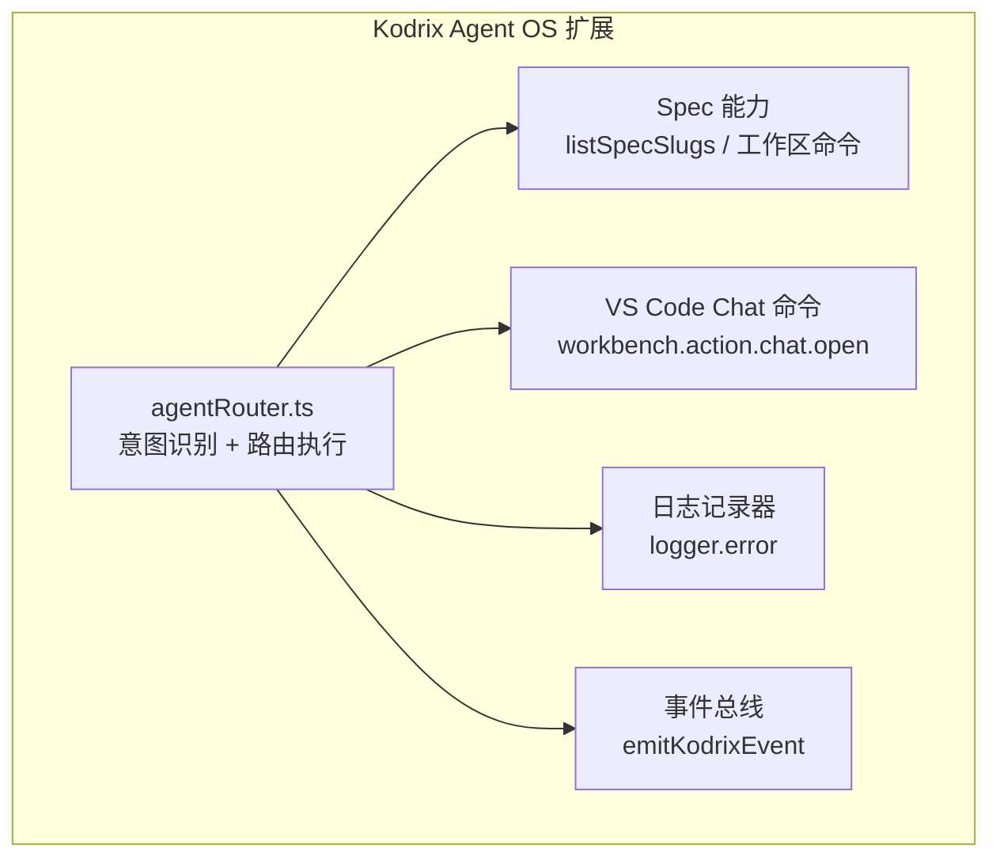
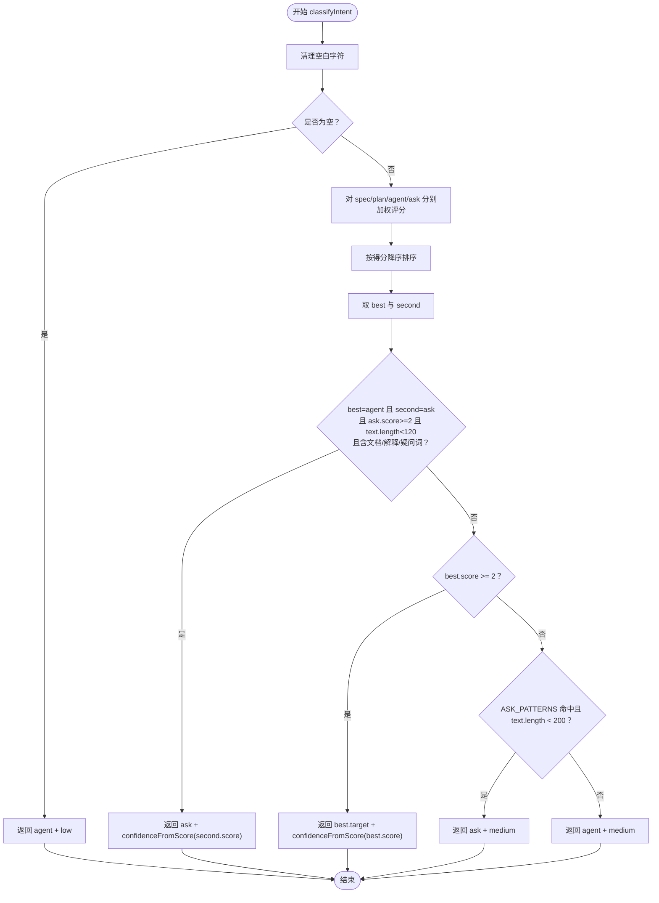
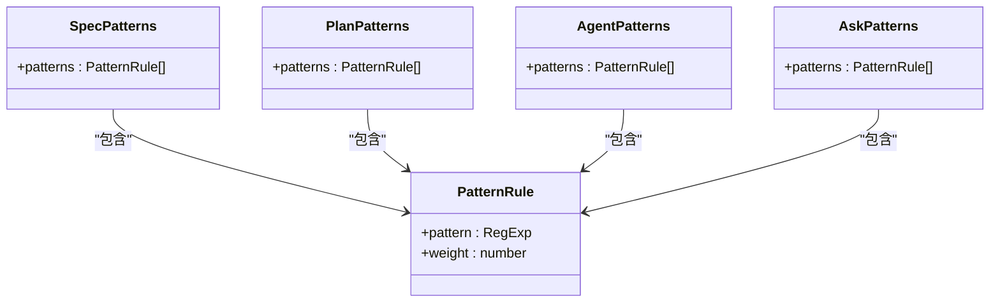
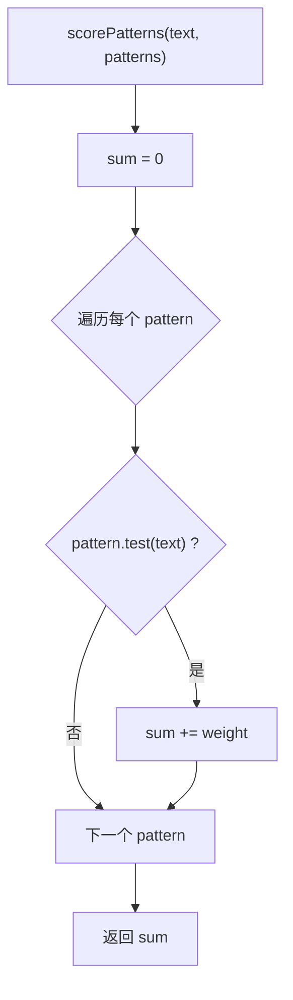
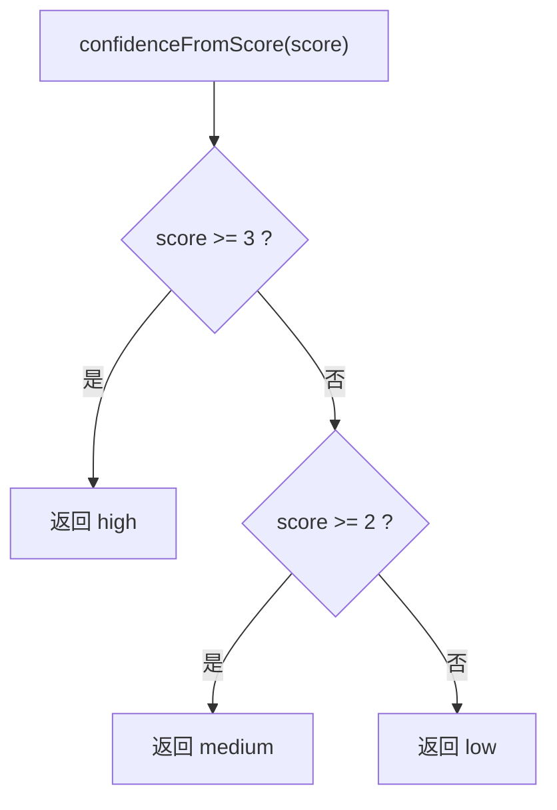
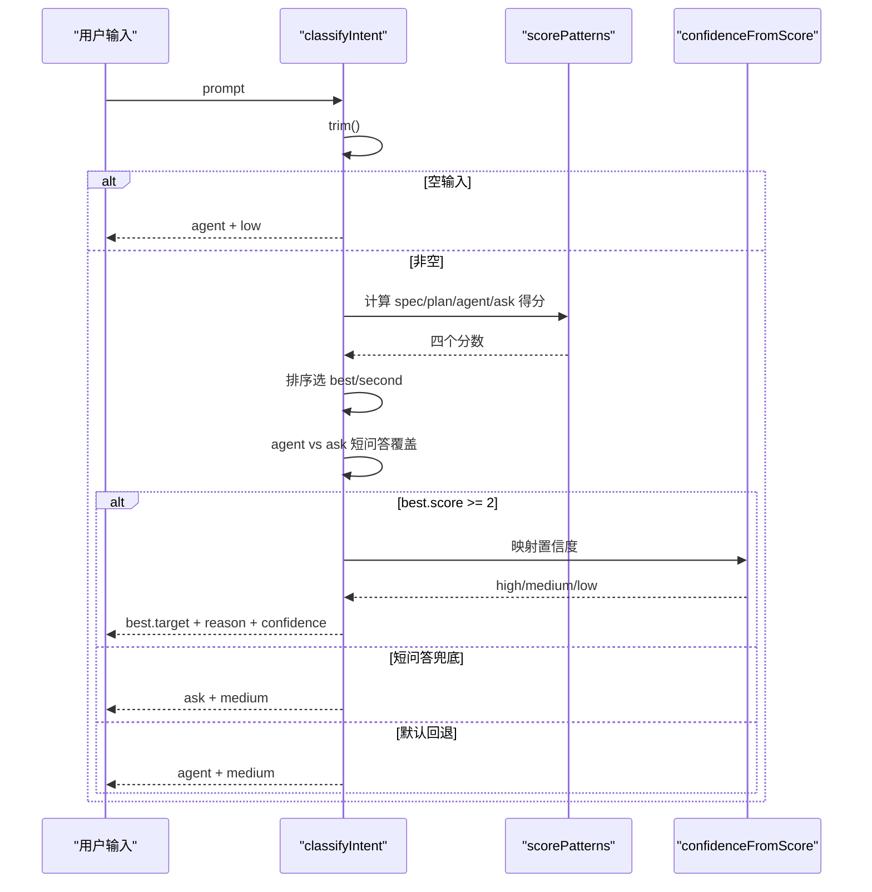
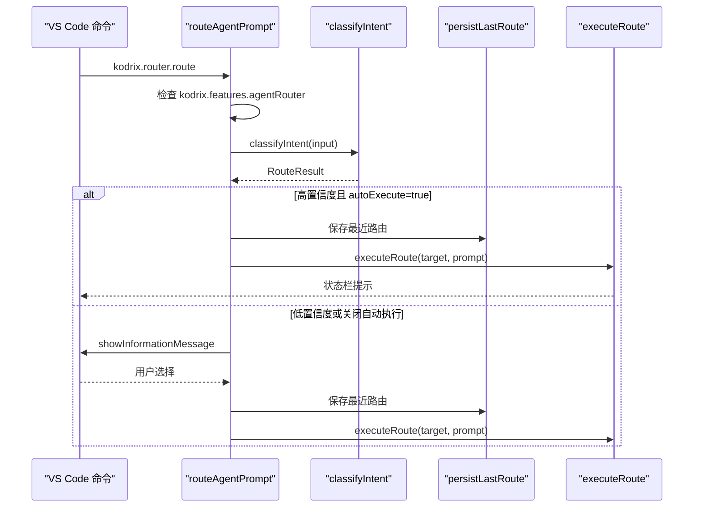
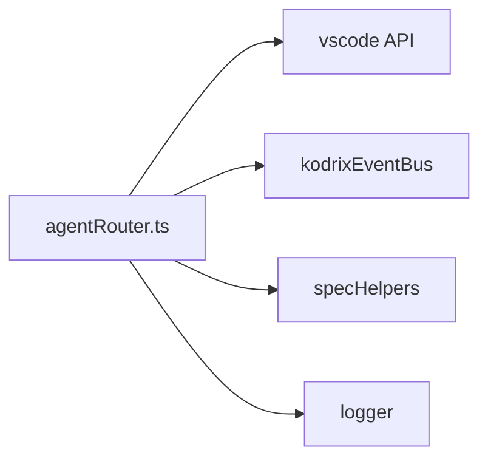
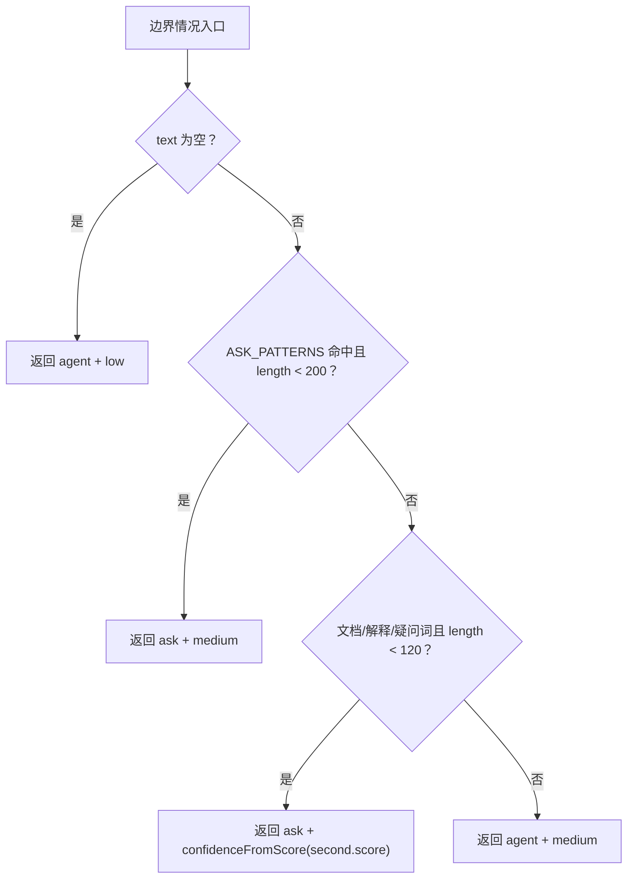

# 意图识别机制

<cite>
**本文引用的文件**   
- [agentRouter.ts](file://extensions/kodrix-agent-os/src/router/agentRouter.ts)
</cite>

## 目录
1. [引言](#引言)
2. [项目结构定位](#项目结构定位)
3. [核心组件总览](#核心组件总览)
4. [架构总览](#架构总览)
5. [详细组件分析](#详细组件分析)
6. [依赖关系分析](#依赖关系分析)
7. [性能与复杂度分析](#性能与复杂度分析)
8. [配置与扩展指南](#配置与扩展指南)
9. [边界情况处理](#边界情况处理)
10. [故障排查](#故障排查)
11. [结论](#结论)

## 引言
本文件面向开发者，系统性说明 Kodrix 智能路由中的“意图识别机制”。该机制负责把用户输入自动分类为四种目标类型：spec、plan、agent、ask，并输出置信度 high / medium / low。其核心算法包括关键词匹配、正则表达式模式识别和加权评分系统；同时包含短问答请求、文档类查询等边界情况的特殊处理逻辑。

## 项目结构定位
意图识别相关代码位于 VS Code 扩展 `kodrix-agent-os` 的路由模块中，入口文件为 `agentRouter.ts`。该文件集中定义了：
- 路由目标类型与结果类型
- 四类意图的正则模式与权重
- 评分函数与置信度映射
- 意图分类主流程
- 路由执行与命令注册

**图表来源** 
- [agentRouter.ts:5-8](file://extensions/kodrix-agent-os/src/router/agentRouter.ts#L5-L8)
- [agentRouter.ts:192-234](file://extensions/kodrix-agent-os/src/router/agentRouter.ts#L192-L234)

**章节来源**
- [agentRouter.ts:1-265](file://extensions/kodrix-agent-os/src/router/agentRouter.ts#L1-L265)

## 核心组件总览
- 路由目标类型：`RouteTarget = 'spec' | 'plan' | 'agent' | 'ask'`
- 置信度级别：`RouteConfidence = 'high' | 'medium' | 'low'`
- 路由结果：`RouteResult` 包含目标、原因、置信度
- 最近一次路由记录：`LastRouteRecord` 用于持久化与重复执行
- 四类意图模式集合：`SPEC_PATTERNS`、`PLAN_PATTERNS`、`AGENT_PATTERNS`、`ASK_PATTERNS`
- 评分函数：`scorePatterns`
- 置信度映射：`confidenceFromScore`
- 意图分类主函数：`classifyIntent`
- 路由交互与执行：`routeAgentPrompt`、`executeRoute`、`routeAndExecute`
- 命令注册：`registerRouter`

**章节来源**
- [agentRouter.ts:10-28](file://extensions/kodrix-agent-os/src/router/agentRouter.ts#L10-L28)
- [agentRouter.ts:30-56](file://extensions/kodrix-agent-os/src/router/agentRouter.ts#L30-L56)
- [agentRouter.ts:58-70](file://extensions/kodrix-agent-os/src/router/agentRouter.ts#L58-L70)
- [agentRouter.ts:72-113](file://extensions/kodrix-agent-os/src/router/agentRouter.ts#L72-L113)
- [agentRouter.ts:141-190](file://extensions/kodrix-agent-os/src/router/agentRouter.ts#L141-L190)
- [agentRouter.ts:192-234](file://extensions/kodrix-agent-os/src/router/agentRouter.ts#L192-L234)
- [agentRouter.ts:243-264](file://extensions/kodrix-agent-os/src/router/agentRouter.ts#L243-L264)

## 架构总览
意图识别的整体流程如下：
1. 接收用户输入 prompt
2. 清理空白字符
3. 对四类意图分别计算加权得分
4. 按得分排序选出最佳目标
5. 应用边界规则（如 agent vs ask 的短问答优先）
6. 根据最高分判断是否直接返回
7. 若未命中，再尝试短问答兜底
8. 最终默认回退到 agent 模式
9. 将结果持久化并触发对应命令执行

**图表来源** 
- [agentRouter.ts:72-113](file://extensions/kodrix-agent-os/src/router/agentRouter.ts#L72-L113)

## 详细组件分析

### 四类意图模式与权重
每种意图都通过一组 `{ pattern, weight }` 定义，pattern 使用正则表达式，weight 表示匹配时的加分值。

- SPEC_PATTERNS：侧重需求驱动、Spec 三件套、验收标准、EARS、用户故事等
- PLAN_PATTERNS：侧重 `/plan`、重构、迁移、架构、设计方案、复杂大型多模块跨文件、先规划审阅方案
- AGENT_PATTERNS：侧重审查 review、测试 test/e2e/coverage、修复 fix/debug/异常、部署 deploy/release/ci-cd/docker、实现 implement/add/编写功能
- ASK_PATTERNS：侧重什么是为什么怎么如何解释说明哪里哪个、问号结尾、什么意思是什么有什么区别、文档 doc/注释/README

**图表来源** 
- [agentRouter.ts:30-56](file://extensions/kodrix-agent-os/src/router/agentRouter.ts#L30-L56)

**章节来源**
- [agentRouter.ts:30-56](file://extensions/kodrix-agent-os/src/router/agentRouter.ts#L30-L56)

### 加权评分系统
评分函数遍历某类意图的所有模式，如果正则匹配成功，则累加对应的 weight。最终得到该类别的总分。

- 时间复杂度：O(P)，P 为该类别的模式数量
- 空间复杂度：O(1)，仅累加分数

**图表来源** 
- [agentRouter.ts:58-60](file://extensions/kodrix-agent-os/src/router/agentRouter.ts#L58-L60)

**章节来源**
- [agentRouter.ts:58-60](file://extensions/kodrix-agent-os/src/router/agentRouter.ts#L58-L60)

### 置信度评估算法
置信度根据最高得分映射：
- score >= 3 → high
- score >= 2 → medium
- 其他 → low

**图表来源** 
- [agentRouter.ts:62-70](file://extensions/kodrix-agent-os/src/router/agentRouter.ts#L62-L70)

**章节来源**
- [agentRouter.ts:62-70](file://extensions/kodrix-agent-os/src/router/agentRouter.ts#L62-L70)

### 意图分类主流程
`classifyIntent` 是核心入口，负责：
- 空输入保护
- 四类意图评分
- 排序选择最佳目标
- agent vs ask 的短问答优先覆盖
- 高分直接返回
- 短问答兜底
- 默认 agent 回退

**图表来源** 
- [agentRouter.ts:72-113](file://extensions/kodrix-agent-os/src/router/agentRouter.ts#L72-L113)

**章节来源**
- [agentRouter.ts:72-113](file://extensions/kodrix-agent-os/src/router/agentRouter.ts#L72-L113)

### 路由执行与命令注册
- `routeAgentPrompt`：读取配置决定是否启用智能路由，支持自动执行或交互式确认
- `executeRoute`：根据 target 调用 VS Code 命令打开 Chat 或 Spec 工作区
- `routeAndExecute`：Hub 快捷入口，始终执行并返回路由结果
- `registerRouter`：注册命令 `kodrix.router.route`、`kodrix.router.execute`、`kodrix.router.repeatLast`

**图表来源** 
- [agentRouter.ts:141-190](file://extensions/kodrix-agent-os/src/router/agentRouter.ts#L141-L190)
- [agentRouter.ts:192-234](file://extensions/kodrix-agent-os/src/router/agentRouter.ts#L192-L234)

**章节来源**
- [agentRouter.ts:141-190](file://extensions/kodrix-agent-os/src/router/agentRouter.ts#L141-L190)
- [agentRouter.ts:192-234](file://extensions/kodrix-agent-os/src/router/agentRouter.ts#L192-L234)
- [agentRouter.ts:243-264](file://extensions/kodrix-agent-os/src/router/agentRouter.ts#L243-L264)

## 依赖关系分析
- 外部依赖：
  - `vscode`：VS Code API，用于命令、配置、输入框、状态栏、事件
  - `../context/kodrixEventBus`：事件总线，用于上报路由执行事件
  - `../spec/specHelpers`：Spec 能力，用于判断是否存在 Spec 并打开工作区
  - `../logger`：日志记录，用于错误上报
- 内部耦合：
  - 路由模块与 Spec 模块存在弱耦合，仅在 spec 目标时调用
  - 路由模块与 Chat 命令强耦合，所有目标最终都通过 Chat 或 Spec 命令执行

**图表来源** 
- [agentRouter.ts:5-8](file://extensions/kodrix-agent-os/src/router/agentRouter.ts#L5-L8)
- [agentRouter.ts:192-234](file://extensions/kodrix-agent-os/src/router/agentRouter.ts#L192-L234)

**章节来源**
- [agentRouter.ts:5-8](file://extensions/kodrix-agent-os/src/router/agentRouter.ts#L5-L8)
- [agentRouter.ts:192-234](file://extensions/kodrix-agent-os/src/router/agentRouter.ts#L192-L234)

## 性能与复杂度分析
- 单次意图识别的时间复杂度：
  - 四类意图各遍历一次模式列表，总体 O(S + P + A + K)，其中 S/P/A/K 分别为四类模式数量
  - 当前模式数量较少，整体开销可忽略
- 空间复杂度：
  - 仅维护 scores 数组与临时变量，O(1)
- 优化建议：
  - 若未来模式数量增长，可考虑预编译正则缓存、短路评分、优先级分组
  - 对高频短问答场景可增加本地缓存，避免重复正则匹配

[本节为通用性能讨论，不直接分析具体代码行]

## 配置与扩展指南

### 自定义识别规则
- 新增意图类别：
  - 在 `classifyIntent` 中添加新的目标类型
  - 新增对应的 `*_PATTERNS` 数组
  - 在 scores 列表中注册新目标
  - 更新 `executeRoute` 分支逻辑
- 调整权重参数：
  - 修改对应模式的 `weight` 值以影响评分
- 添加新的正则模式：
  - 在对应 `*_PATTERNS` 中添加 `{ pattern, weight }`

**章节来源**
- [agentRouter.ts:30-56](file://extensions/kodrix-agent-os/src/router/agentRouter.ts#L30-L56)
- [agentRouter.ts:78-83](file://extensions/kodrix-agent-os/src/router/agentRouter.ts#L78-L83)
- [agentRouter.ts:192-234](file://extensions/kodrix-agent-os/src/router/agentRouter.ts#L192-L234)

### 置信度阈值调整
- 修改 `confidenceFromScore` 中的阈值以改变 high/medium/low 的判定
- 例如提高 threshold 可降低 high 比例，增加 medium/low 以触发更多用户确认

**章节来源**
- [agentRouter.ts:62-70](file://extensions/kodrix-agent-os/src/router/agentRouter.ts#L62-L70)

### 短问答与文档类查询策略
- 当前逻辑：
  - 当 best=agent 且 second=ask 且 ask.score>=2 且 text.length<120 且含文档/解释/疑问词时，优先返回 ask
  - 若未命中高分，但 ASK_PATTERNS 命中且 text.length<200，返回 ask + medium
- 调整建议：
  - 调整长度阈值 120/200 以适应不同语言或业务场景
  - 调整文档类关键词集合以适配更多文档术语

**章节来源**
- [agentRouter.ts:89-110](file://extensions/kodrix-agent-os/src/router/agentRouter.ts#L89-L110)

## 边界情况处理
- 空输入：
  - 直接返回 agent + low，避免无效路由
- 短问答请求：
  - 通过 ASK_PATTERNS 命中且长度小于 200 时返回 ask + medium
- 文档类查询：
  - 在 agent vs ask 覆盖逻辑中，若文本较短且包含文档/解释/疑问词，优先归入 ask
- 默认回退：
  - 若以上条件均未满足，默认返回 agent + medium，确保系统始终有明确行为

**图表来源** 
- [agentRouter.ts:72-113](file://extensions/kodrix-agent-os/src/router/agentRouter.ts#L72-L113)

**章节来源**
- [agentRouter.ts:72-113](file://extensions/kodrix-agent-os/src/router/agentRouter.ts#L72-L113)

## 故障排查
- 智能路由被关闭：
  - 检查配置 `kodrix.features.agentRouter` 是否为 true
  - 若关闭，会显示警告消息
- 路由执行失败：
  - 查看 logger.error 输出
  - 检查 VS Code 命令是否可用
- 历史路由无法重复执行：
  - 检查 workspaceState 是否已保存最近路由记录
  - 若无记录，提示用户使用智能路由入口

**章节来源**
- [agentRouter.ts:141-154](file://extensions/kodrix-agent-os/src/router/agentRouter.ts#L141-L154)
- [agentRouter.ts:230-234](file://extensions/kodrix-agent-os/src/router/agentRouter.ts#L230-L234)
- [agentRouter.ts:255-262](file://extensions/kodrix-agent-os/src/router/agentRouter.ts#L255-L262)

## 结论
Kodrix 的智能路由意图识别机制以轻量正则匹配与加权评分为核心，具备清晰的四类意图划分、明确的置信度映射以及完善的边界处理。该设计易于扩展，适合在保持高性能的同时持续演进识别规则。开发者可通过调整模式权重、阈值与关键词集合来适配不同业务场景，并通过命令与事件机制集成到更广泛的 VS Code 工作流中。