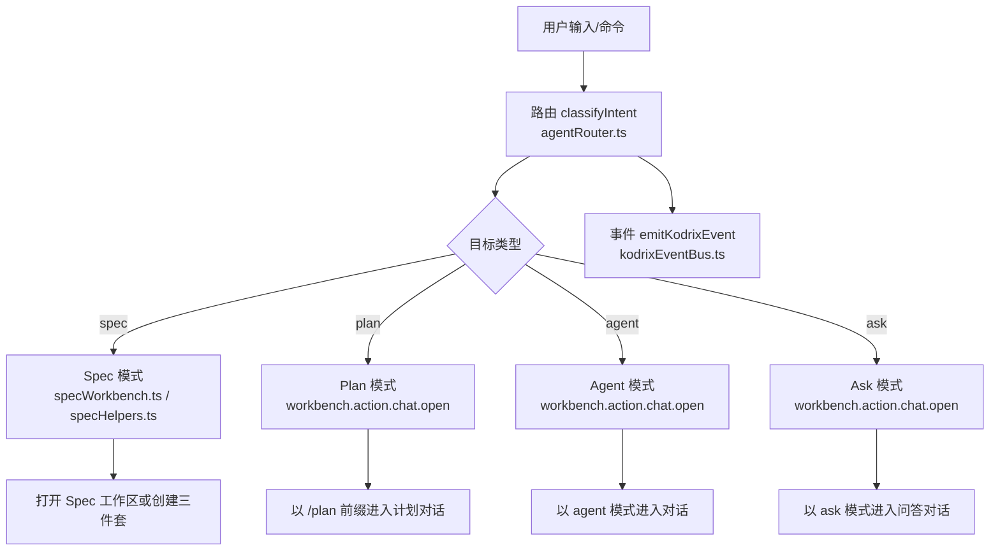
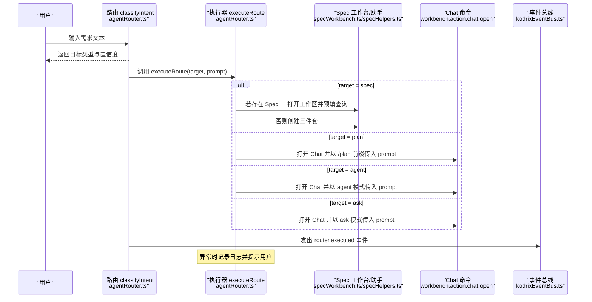
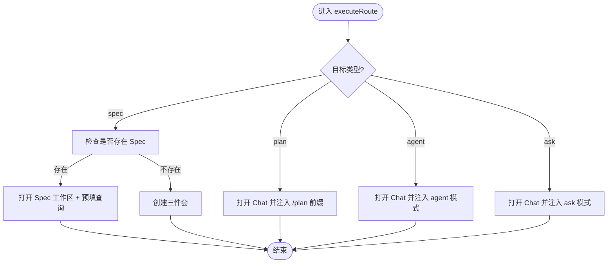
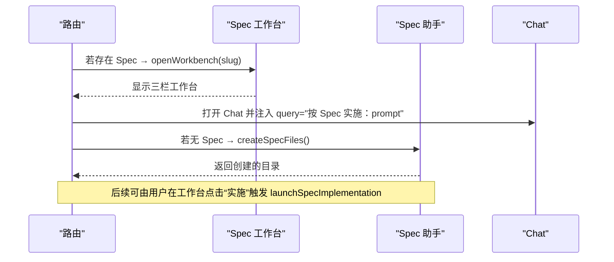
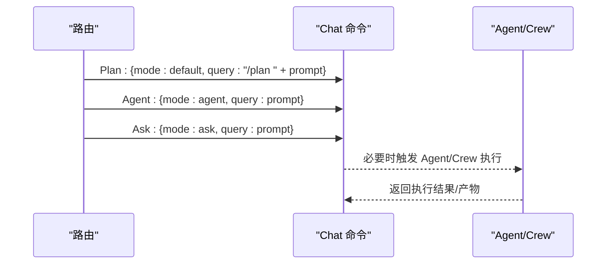
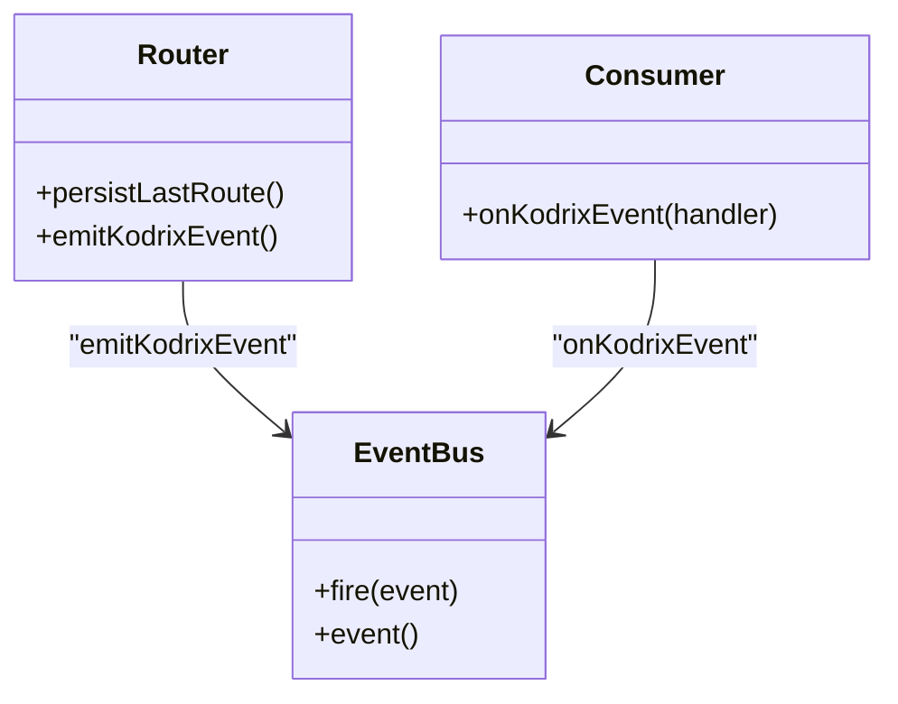
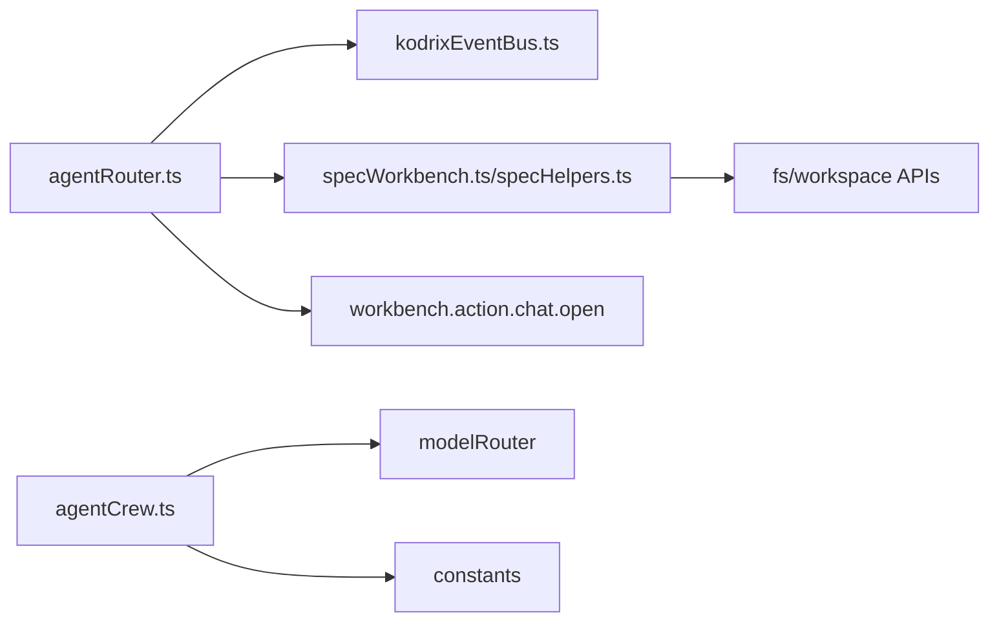

# 执行工作流

<cite>
**本文引用的文件**
- [agentRouter.ts](file://extensions/kodrix-agent-os/src/router/agentRouter.ts)
- [specWorkbench.ts](file://extensions/kodrix-agent-os/src/spec/specWorkbench.ts)
- [specHelpers.ts](file://extensions/kodrix-agent-os/src/spec/specHelpers.ts)
- [kodrixEventBus.ts](file://extensions/kodrix-agent-os/src/context/kodrixEventBus.ts)
- [agentCrew.ts](file://extensions/kodrix-agent-os/src/crew/agentCrew.ts)
</cite>

## 目录
1. [简介](#简介)
2. [项目结构](#项目结构)
3. [核心组件](#核心组件)
4. [架构总览](#架构总览)
5. [详细组件分析](#详细组件分析)
6. [依赖关系分析](#依赖关系分析)
7. [性能考虑](#性能考虑)
8. [故障排查指南](#故障排查指南)
9. [结论](#结论)
10. [附录：扩展指南](#附录扩展指南)

## 简介
本文件面向开发者，系统性说明“路由后的命令执行流程”，聚焦 executeRoute 的实现与四种目标类型（Spec、Plan、Agent、Ask）的处理差异；深入解释 Spec 模式的特殊处理（检测现有 Spec 并决定创建新文件或打开工作区），以及 Plan、Agent、Ask 三种模式的具体执行步骤（命令调用、参数传递、结果处理）。同时覆盖错误处理机制（异常捕获、用户提示、日志记录）、事件通知系统（emitKodrixEvent 的使用与订阅者机制），并提供自定义执行器的扩展指南，帮助实现新的路由目标和执行逻辑。

## 项目结构
围绕执行工作流的核心代码位于 kodrix-agent-os 扩展中：
- 路由与分发：router/agentRouter.ts
- Spec 工作台与工具：spec/specWorkbench.ts、spec/specHelpers.ts
- 事件总线：context/kodrixEventBus.ts
- 多 Agent Crew 并行执行（与 Ask/Agent 模式联动）：crew/agentCrew.ts

图表来源
- [agentRouter.ts:72-113](file://extensions/kodrix-agent-os/src/router/agentRouter.ts#L72-L113)
- [agentRouter.ts:192-234](file://extensions/kodrix-agent-os/src/router/agentRouter.ts#L192-L234)
- [specWorkbench.ts:143-191](file://extensions/kodrix-agent-os/src/spec/specWorkbench.ts#L143-L191)
- [specHelpers.ts:214-266](file://extensions/kodrix-agent-os/src/spec/specHelpers.ts#L214-L266)
- [kodrixEventBus.ts:8-27](file://extensions/kodrix-agent-os/src/context/kodrixEventBus.ts#L8-L27)

章节来源
- [agentRouter.ts:1-265](file://extensions/kodrix-agent-os/src/router/agentRouter.ts#L1-L265)
- [specWorkbench.ts:1-199](file://extensions/kodrix-agent-os/src/spec/specWorkbench.ts#L1-L199)
- [specHelpers.ts:1-268](file://extensions/kodrix-agent-os/src/spec/specHelpers.ts#L1-L268)
- [kodrixEventBus.ts:1-28](file://extensions/kodrix-agent-os/src/context/kodrixEventBus.ts#L1-L28)

## 核心组件
- 路由分类器：基于正则权重对意图进行分类，输出目标类型与置信度。
- 执行器 executeRoute：根据目标类型调用对应命令，完成具体执行。
- Spec 工作台：提供 Spec 的创建、编辑、实施入口，支持三栏视图与实时刷新。
- 事件总线：跨模块发布/订阅事件，用于记录路由执行、学习记录、会话状态等。
- Agent Crew：在 Agent/Ask 模式下可触发多 Agent 协作任务编排与并行执行。

章节来源
- [agentRouter.ts:72-113](file://extensions/kodrix-agent-os/src/router/agentRouter.ts#L72-L113)
- [agentRouter.ts:192-234](file://extensions/kodrix-agent-os/src/router/agentRouter.ts#L192-L234)
- [specWorkbench.ts:68-135](file://extensions/kodrix-agent-os/src/spec/specWorkbench.ts#L68-L135)
- [specHelpers.ts:214-266](file://extensions/kodrix-agent-os/src/spec/specHelpers.ts#L214-L266)
- [kodrixEventBus.ts:8-27](file://extensions/kodrix-agent-os/src/context/kodrixEventBus.ts#L8-L27)
- [agentCrew.ts:515-572](file://extensions/kodrix-agent-os/src/crew/agentCrew.ts#L515-L572)

## 架构总览
下图展示了从用户输入到最终执行的完整链路，包括路由决策、目标分发、命令调用、事件上报与错误处理。

图表来源
- [agentRouter.ts:72-113](file://extensions/kodrix-agent-os/src/router/agentRouter.ts#L72-L113)
- [agentRouter.ts:141-190](file://extensions/kodrix-agent-os/src/router/agentRouter.ts#L141-L190)
- [agentRouter.ts:192-234](file://extensions/kodrix-agent-os/src/router/agentRouter.ts#L192-L234)
- [specWorkbench.ts:143-191](file://extensions/kodrix-agent-os/src/spec/specWorkbench.ts#L143-L191)
- [specHelpers.ts:214-266](file://extensions/kodrix-agent-os/src/spec/specHelpers.ts#L214-L266)
- [kodrixEventBus.ts:8-27](file://extensions/kodrix-agent-os/src/context/kodrixEventBus.ts#L8-L27)

## 详细组件分析

### 路由与 executeRoute 实现
- 意图分类：通过多组正则模式加权打分，选择最高分目标类型；短问句优先归入 Ask；空输入默认 Agent。
- 自动执行策略：当配置开启且置信度高时直接执行，否则弹出确认/切换模式对话框。
- 执行分发：executeRoute 根据目标类型调用不同命令：
  - Spec：若存在 Spec 则打开工作区并预填查询；否则创建三件套。
  - Plan：以 /plan 前缀打开 Chat。
  - Agent：以 agent 模式打开 Chat。
  - Ask：以 ask 模式打开 Chat。
- 事件上报：每次路由执行后持久化最近一次路由记录，并发出 router.executed 事件。
- 错误处理：try/catch 捕获异常，记录日志并通过警告消息提示用户。

图表来源
- [agentRouter.ts:192-234](file://extensions/kodrix-agent-os/src/router/agentRouter.ts#L192-L234)
- [specWorkbench.ts:143-191](file://extensions/kodrix-agent-os/src/spec/specWorkbench.ts#L143-L191)
- [specHelpers.ts:214-266](file://extensions/kodrix-agent-os/src/spec/specHelpers.ts#L214-L266)

章节来源
- [agentRouter.ts:72-113](file://extensions/kodrix-agent-os/src/router/agentRouter.ts#L72-L113)
- [agentRouter.ts:141-190](file://extensions/kodrix-agent-os/src/router/agentRouter.ts#L141-L190)
- [agentRouter.ts:192-234](file://extensions/kodrix-agent-os/src/router/agentRouter.ts#L192-L234)

### Spec 模式的特殊处理
- 检测现有 Spec：通过 listSpecSlugs 获取已存在的 Spec 列表。
- 分支逻辑：
  - 若存在至少一个 Spec：打开 Spec 工作区，并调用 Chat 命令以 agent 模式预填“按 Spec 实施：prompt”。
  - 若不存在任何 Spec：创建三件套（requirements/design/tasks），随后由后续流程引导实施。
- 工作区交互：Spec 工作台提供新建、选择、编辑、实施等操作，并在文件变更时刷新内容。
- 安全校验：Webview 消息中的 slug/file 均经过白名单校验，防止任意路径访问。

图表来源
- [agentRouter.ts:192-207](file://extensions/kodrix-agent-os/src/router/agentRouter.ts#L192-L207)
- [specWorkbench.ts:68-135](file://extensions/kodrix-agent-os/src/spec/specWorkbench.ts#L68-L135)
- [specHelpers.ts:214-266](file://extensions/kodrix-agent-os/src/spec/specHelpers.ts#L214-L266)

章节来源
- [agentRouter.ts:192-207](file://extensions/kodrix-agent-os/src/router/agentRouter.ts#L192-L207)
- [specWorkbench.ts:68-135](file://extensions/kodrix-agent-os/src/spec/specWorkbench.ts#L68-L135)
- [specHelpers.ts:214-266](file://extensions/kodrix-agent-os/src/spec/specHelpers.ts#L214-L266)

### Plan、Agent、Ask 三种模式的执行步骤
- Plan 模式
  - 命令调用：workbench.action.chat.open，query 以 /plan 前缀携带用户输入。
  - 参数传递：将原始 prompt 作为计划上下文注入。
  - 结果处理：由 Chat 侧负责解析 /plan 指令并生成计划文档或对话引导。
- Agent 模式
  - 命令调用：workbench.action.chat.open，mode=agent，query=用户输入。
  - 参数传递：将用户输入作为 Agent 任务描述。
  - 结果处理：Agent 可在多文件范围内执行修改，必要时结合 Crew 进行并行任务编排。
- Ask 模式
  - 命令调用：workbench.action.chat.open，mode=ask，query=用户输入。
  - 参数传递：将问题作为问答上下文。
  - 结果处理：Chat 侧以问答模式响应，适合文档/探索类请求。

图表来源
- [agentRouter.ts:208-229](file://extensions/kodrix-agent-os/src/router/agentRouter.ts#L208-L229)
- [agentCrew.ts:515-572](file://extensions/kodrix-agent-os/src/crew/agentCrew.ts#L515-L572)

章节来源
- [agentRouter.ts:208-229](file://extensions/kodrix-agent-os/src/router/agentRouter.ts#L208-L229)
- [agentCrew.ts:515-572](file://extensions/kodrix-agent-os/src/crew/agentCrew.ts#L515-L572)

### 错误处理机制
- 异常捕获：executeRoute 使用 try/catch 包裹所有分支，确保任一子命令失败不会中断整体流程。
- 用户提示：通过 vscode.window.showWarningMessage 向用户展示友好错误信息。
- 日志记录：使用 logger.error 记录详细错误堆栈，便于定位问题。
- 健壮性：Spec 工作台对 Webview 消息进行严格校验，避免路径穿越风险。

章节来源
- [agentRouter.ts:230-233](file://extensions/kodrix-agent-os/src/router/agentRouter.ts#L230-L233)
- [specWorkbench.ts:173-175](file://extensions/kodrix-agent-os/src/spec/specWorkbench.ts#L173-L175)

### 事件通知系统
- 事件类型：包含 router.executed、learning.recorded、chat.session.* 等，用于跨模块状态同步。
- 发射方式：emitKodrixEvent 统一封装事件发布，保证类型安全。
- 订阅机制：onKodrixEvent 暴露事件流，其他模块可订阅并处理。
- 典型用法：路由执行后持久化最近路由记录并发出 router.executed 事件，供仪表盘/日志等消费。

图表来源
- [kodrixEventBus.ts:8-27](file://extensions/kodrix-agent-os/src/context/kodrixEventBus.ts#L8-L27)
- [agentRouter.ts:121-139](file://extensions/kodrix-agent-os/src/router/agentRouter.ts#L121-L139)

章节来源
- [kodrixEventBus.ts:8-27](file://extensions/kodrix-agent-os/src/context/kodrixEventBus.ts#L8-L27)
- [agentRouter.ts:121-139](file://extensions/kodrix-agent-os/src/router/agentRouter.ts#L121-L139)

## 依赖关系分析
- 路由层依赖：
  - 事件总线：用于记录路由执行与状态变化。
  - Spec 工具：用于检测/创建/打开 Spec。
  - Chat 命令：用于打开不同模式的对话窗口。
- Spec 层依赖：
  - 文件系统：读取/写入三件套文件。
  - 工作区 API：打开文件、创建面板、监听文件变更。
- Crew 层依赖：
  - 模型路由：为每个任务选择合适的语言模型。
  - 配置常量：控制并发数、超时、上下文长度等。

图表来源
- [agentRouter.ts:1-265](file://extensions/kodrix-agent-os/src/router/agentRouter.ts#L1-L265)
- [specWorkbench.ts:1-199](file://extensions/kodrix-agent-os/src/spec/specWorkbench.ts#L1-L199)
- [specHelpers.ts:1-268](file://extensions/kodrix-agent-os/src/spec/specHelpers.ts#L1-L268)
- [agentCrew.ts:1-761](file://extensions/kodrix-agent-os/src/crew/agentCrew.ts#L1-L761)

章节来源
- [agentRouter.ts:1-265](file://extensions/kodrix-agent-os/src/router/agentRouter.ts#L1-L265)
- [specWorkbench.ts:1-199](file://extensions/kodrix-agent-os/src/spec/specWorkbench.ts#L1-L199)
- [specHelpers.ts:1-268](file://extensions/kodrix-agent-os/src/spec/specHelpers.ts#L1-L268)
- [agentCrew.ts:1-761](file://extensions/kodrix-agent-os/src/crew/agentCrew.ts#L1-L761)

## 性能考虑
- 路由分类：基于正则匹配，时间复杂度与模式数量线性相关，开销极低。
- Spec 操作：文件读写与面板创建为 I/O 密集型，建议复用 watcher 与面板实例，避免重复创建。
- Chat 命令：由 VS Code 内部实现，注意避免频繁触发导致 UI 卡顿。
- Crew 并行：通过 Promise.allSettled 与并发池限制并行度，避免资源争用；单任务失败不阻塞同波其它任务。

[本节为通用指导，无需特定文件引用]

## 故障排查指南
- 路由未生效：检查配置是否启用智能路由，确认 autoExecute 与置信度阈值设置。
- Spec 无法创建：确认已打开工作区，检查 .kodrix/specs 目录权限与磁盘空间。
- Chat 命令失败：确认 VS Code 版本支持 workbench.action.chat.open，检查是否有冲突的快捷键或扩展。
- 事件未触发：确认订阅者在正确时机注册 onKodrixEvent，并确保事件类型匹配。
- 日志定位：查看 logger 输出，结合错误消息与堆栈快速定位问题。

章节来源
- [agentRouter.ts:141-190](file://extensions/kodrix-agent-os/src/router/agentRouter.ts#L141-L190)
- [specWorkbench.ts:173-175](file://extensions/kodrix-agent-os/src/spec/specWorkbench.ts#L173-L175)
- [agentCrew.ts:497-507](file://extensions/kodrix-agent-os/src/crew/agentCrew.ts#L497-L507)

## 结论
executeRoute 作为统一执行入口，将自然语言意图转化为具体的工作流分支，兼顾了 Spec 驱动的计划式开发与 Agent/Ask 的灵活交互。通过事件总线与完善的错误处理，系统在可扩展性与健壮性之间取得平衡。借助 Crew 的并行执行能力，复杂任务可被分解为可管理的子任务，提升整体效率与可观测性。

[本节为总结，无需特定文件引用]

## 附录：扩展指南
- 新增路由目标
  - 在 classifyIntent 中添加新的模式匹配规则与权重，确保能准确识别新意图。
  - 在 executeRoute 中增加对应分支，调用相应命令或自定义执行器。
  - 如需持久化历史或上报事件，更新 persistLastRoute 与 emitKodrixEvent 的调用点。
- 自定义执行器
  - 定义执行函数，接收目标类型与参数，封装命令调用与结果处理。
  - 在 executeRoute 中替换原有分支逻辑，保持 try/catch 与日志记录。
  - 通过事件总线对外暴露执行状态，便于 UI 或其他模块订阅。
- 最佳实践
  - 对用户输入进行严格校验，避免路径穿越与注入风险。
  - 使用异步 API 与合理的超时/取消机制，防止阻塞主线程。
  - 保持模块化与职责单一，便于测试与维护。

章节来源
- [agentRouter.ts:72-113](file://extensions/kodrix-agent-os/src/router/agentRouter.ts#L72-L113)
- [agentRouter.ts:192-234](file://extensions/kodrix-agent-os/src/router/agentRouter.ts#L192-L234)
- [kodrixEventBus.ts:8-27](file://extensions/kodrix-agent-os/src/context/kodrixEventBus.ts#L8-L27)