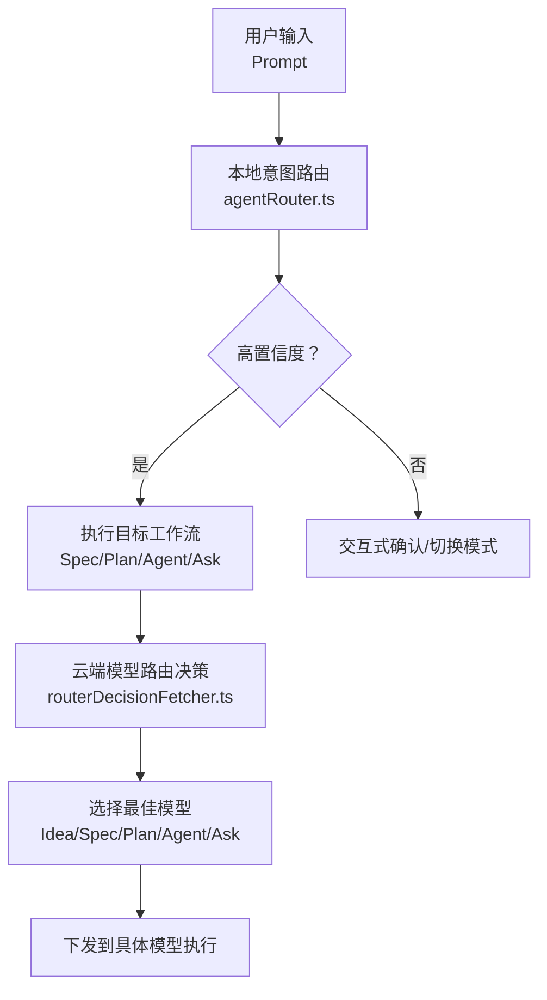
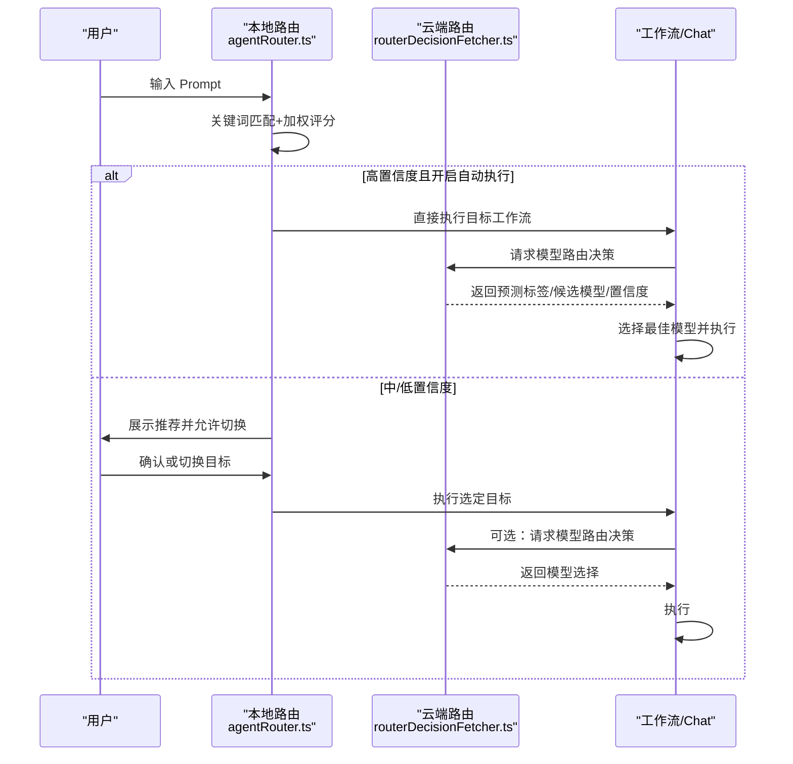
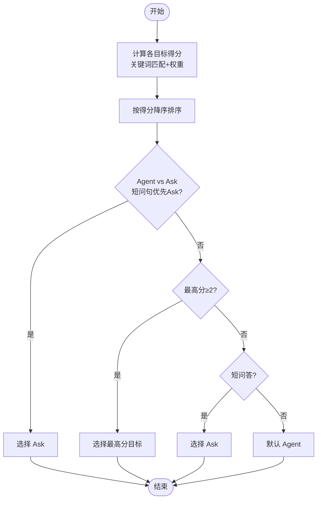
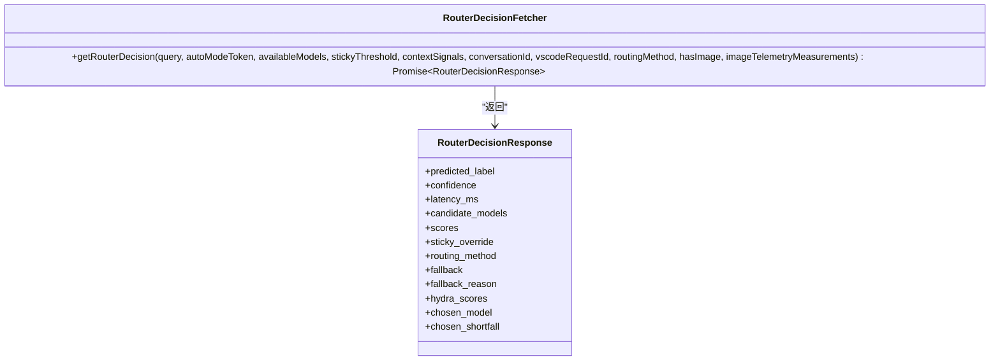
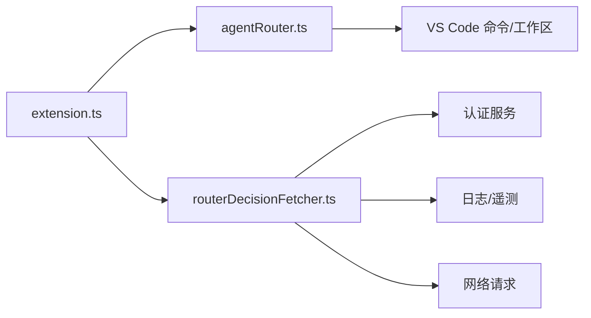

# 智能路由

<cite>
**本文引用的文件**
- [agentRouter.ts](file://extensions/kodrix-agent-os/src/router/agentRouter.ts)
- [routerDecisionFetcher.ts](file://extensions/copilot/src/platform/endpoint/node/routerDecisionFetcher.ts)
- [extension.ts](file://extensions/kodrix-agent-os/src/extension.ts)
- [项目非常有必要新实现的核心功能总报告.md](file://docs/项目非常有必要新实现的核心功能总报告.md)
</cite>

## 目录
1. [简介](#简介)
2. [项目结构](#项目结构)
3. [核心组件](#核心组件)
4. [架构总览](#架构总览)
5. [详细组件分析](#详细组件分析)
6. [依赖关系分析](#依赖关系分析)
7. [性能考量](#性能考量)
8. [故障排查指南](#故障排查指南)
9. [结论](#结论)
10. [附录：配置与示例](#附录配置与示例)

## 简介
本文件面向高级用户，系统性阐述 Kodrix 的智能路由机制，覆盖意图识别、加权评分、模型选择与任务分发；说明路由规则的配置方法（关键词匹配、上下文信号、用户偏好等权重）；解释多模型路由的实现原理与自动选择策略（Idea/Spec/Plan/Agent/Ask）；提供自定义路由目标、调整评分算法、扩展路由目标的实践路径；并给出与 Agent Crew 协作的复杂任务路由与负载均衡建议。

## 项目结构
Kodrix 的智能路由由两层构成：
- 本地意图路由层：基于关键词与规则的加权评分，将输入快速分类为 Spec/Plan/Agent/Ask，并触发对应工作流。
- 云端模型路由层：通过 Copilot 的模型路由器决策接口，结合可用模型列表、会话上下文与遥测指标，返回预测标签、置信度、候选模型与回退策略。

图表来源
- [agentRouter.ts:72-113](file://extensions/kodrix-agent-os/src/router/agentRouter.ts#L72-L113)
- [routerDecisionFetcher.ts:70-116](file://extensions/copilot/src/platform/endpoint/node/routerDecisionFetcher.ts#L70-L116)

章节来源
- [extension.ts:158-212](file://extensions/kodrix-agent-os/src/extension.ts#L158-L212)

## 核心组件
- 本地意图路由（agentRouter.ts）
  - 关键词匹配与加权评分：对 Spec/Plan/Agent/Ask 四类目标分别定义正则与权重，计算总分后排序取最优。
  - 置信度判定：根据分数映射 high/medium/low，用于是否自动执行或二次确认。
  - 路由执行：将目标转换为命令调用，打开 Chat 或创建/编辑 Spec。
  - 历史与事件：记录最近一次路由结果，并通过事件总线上报。
- 云端模型路由（routerDecisionFetcher.ts）
  - 请求构造：携带 prompt、可用模型列表、会话上下文信号（轮次、会话ID、上一模型、引用数、提示长度等）、粘性阈值、路由方法、图像标记等。
  - 响应解析：返回预测标签（needs_reasoning/no_reasoning/fallback）、置信度、延迟、候选模型、Hydra 多维得分、回退标志与原因、最终选择模型及差距分。
  - 可观测性：日志、调试面板、遥测上报（含受限遥测）。
- 扩展入口（extension.ts）
  - 注册路由相关能力：包括本地路由、模型路由、状态栏、索引、Wiki、Memory、Crew 等。
  - 提供“智能路由 3.0”快捷键与欢迎页，统一入口引导。

章节来源
- [agentRouter.ts:30-113](file://extensions/kodrix-agent-os/src/router/agentRouter.ts#L30-L113)
- [routerDecisionFetcher.ts:16-32](file://extensions/copilot/src/platform/endpoint/node/routerDecisionFetcher.ts#L16-L32)
- [routerDecisionFetcher.ts:70-116](file://extensions/copilot/src/platform/endpoint/node/routerDecisionFetcher.ts#L70-L116)
- [extension.ts:158-212](file://extensions/kodrix-agent-os/src/extension.ts#L158-L212)

## 架构总览
智能路由采用“本地快速分类 + 云端精细选模”的分层架构：
- 本地层负责低延迟意图识别与基础分流，确保用户体验流畅。
- 云端层在需要时进行更复杂的推理分类与模型选择，支持 A/B 实验（routing_method）、粘性策略（sticky_override）与回退机制（fallback）。
- 两者通过命令与工作流衔接，形成端到端的任务分发链路。

图表来源
- [agentRouter.ts:141-190](file://extensions/kodrix-agent-os/src/router/agentRouter.ts#L141-L190)
- [routerDecisionFetcher.ts:70-116](file://extensions/copilot/src/platform/endpoint/node/routerDecisionFetcher.ts#L70-L116)

## 详细组件分析

### 本地意图路由（agentRouter.ts）
- 意图分类与评分
  - 为每个目标类别定义一组正则与权重，按命中累加得到分数。
  - 特殊规则：当 Agent 与 Ask 同时命中且文本较短时，优先归入 Ask，提升问答体验。
  - 置信度映射：分数≥3 为 high，≥2 为 medium，否则 low。
- 自动执行与交互
  - 若开启自动执行且置信度为 high，则直接执行目标；否则弹出确认框，支持切换到其他模式。
- 执行目标
  - spec：打开 Spec 工作台或创建新 Spec，并在 Chat 中以 agent 模式传入需求。
  - plan：以 /plan 指令打开 Chat 进入规划流程。
  - ask：以 ask 模式打开 Chat 进行问答。
  - agent：默认以 agent 模式执行实施类任务。
- 历史记录与事件
  - 记录最近一次路由结果（目标、提示摘要、原因、置信度、时间），并通过事件总线上报 router.executed。

图表来源
- [agentRouter.ts:58-113](file://extensions/kodrix-agent-os/src/router/agentRouter.ts#L58-L113)

章节来源
- [agentRouter.ts:30-113](file://extensions/kodrix-agent-os/src/router/agentRouter.ts#L30-L113)
- [agentRouter.ts:141-190](file://extensions/kodrix-agent-os/src/router/agentRouter.ts#L141-L190)
- [agentRouter.ts:192-234](file://extensions/kodrix-agent-os/src/router/agentRouter.ts#L192-L234)

### 云端模型路由（routerDecisionFetcher.ts）
- 请求参数
  - 基本字段：prompt、available_models、contextSignals（turn_number、session_id、previous_model、reference_count、prompt_char_count）。
  - 控制字段：sticky_threshold、routing_method、has_image、copilot_plan。
  - 认证与会话：Authorization 与 Copilot-Session-Token。
- 响应字段
  - predicted_label：needs_reasoning/no_reasoning/fallback。
  - confidence：整体置信度。
  - latency_ms：服务端耗时。
  - candidate_models：候选模型列表。
  - scores：二元评分（needs_reasoning/no_reasoning）。
  - sticky_override：是否应用粘性覆盖。
  - routing_method：本次使用的路由方法（如 binary/hydra）。
  - fallback/fallback_reason：是否回退及原因。
  - hydra_scores：多维度评分（reasoning/code_gen/debugging/tool_use）。
  - chosen_model/chosen_shortfall：最终选择模型与差距分。
- 可观测性与错误处理
  - 非 OK 响应抛出 RouterDecisionError，包含 errorCode。
  - 记录调试面板条目与遥测事件（含受限遥测），便于分析与实验评估。

图表来源
- [routerDecisionFetcher.ts:16-32](file://extensions/copilot/src/platform/endpoint/node/routerDecisionFetcher.ts#L16-L32)
- [routerDecisionFetcher.ts:60-116](file://extensions/copilot/src/platform/endpoint/node/routerDecisionFetcher.ts#L60-L116)

章节来源
- [routerDecisionFetcher.ts:16-32](file://extensions/copilot/src/platform/endpoint/node/routerDecisionFetcher.ts#L16-L32)
- [routerDecisionFetcher.ts:70-116](file://extensions/copilot/src/platform/endpoint/node/routerDecisionFetcher.ts#L70-L116)
- [routerDecisionFetcher.ts:117-212](file://extensions/copilot/src/platform/endpoint/node/routerDecisionFetcher.ts#L117-L212)

### 扩展入口与集成（extension.ts）
- 注册路由能力：在激活阶段注册本地路由、模型路由、状态栏、索引、Wiki、Memory、Crew 等模块。
- 提供“智能路由 3.0”快捷键与欢迎页，统一入口引导用户从想法到产品全流程。
- 语义检索 Embedding：可通过配置启用智谱 embedding-3，增强语义理解。

章节来源
- [extension.ts:158-212](file://extensions/kodrix-agent-os/src/extension.ts#L158-L212)
- [extension.ts:141-156](file://extensions/kodrix-agent-os/src/extension.ts#L141-L156)

## 依赖关系分析
- 本地路由依赖 VS Code 命令与工作区设置，通过命令通道驱动 Spec/Plan/Agent/Ask 工作流。
- 云端路由依赖 Copilot API 客户端、认证服务、日志与遥测服务，具备超时与错误处理。
- 扩展入口聚合各模块，保证启动顺序与生命周期管理。

图表来源
- [extension.ts:158-212](file://extensions/kodrix-agent-os/src/extension.ts#L158-L212)
- [agentRouter.ts:192-234](file://extensions/kodrix-agent-os/src/router/agentRouter.ts#L192-L234)
- [routerDecisionFetcher.ts:70-116](file://extensions/copilot/src/platform/endpoint/node/routerDecisionFetcher.ts#L70-L116)

章节来源
- [extension.ts:158-212](file://extensions/kodrix-agent-os/src/extension.ts#L158-L212)

## 性能考量
- 本地路由为 O(n) 正则扫描，n 为规则数量，通常极小，延迟可忽略。
- 云端路由存在网络开销，已内置超时与错误处理；建议在高并发场景下缓存常用路由决策或批量请求。
- 遥测与日志可能带来额外开销，生产环境可按需关闭或采样。
- 大工程索引与语义检索应增量更新，避免全量重建影响主线程。

[本节为通用指导，不直接分析具体文件]

## 故障排查指南
- 路由未生效
  - 检查设置项 kodrix.features.agentRouter 是否启用。
  - 查看状态栏消息与最近路由记录，确认 classifyIntent 输出是否符合预期。
- 自动执行未触发
  - 确认 kodrix.router.autoExecute 与置信度 threshold；低置信度会进入交互确认。
- 云端路由失败
  - 关注 RouterDecisionError 的 errorCode；检查认证令牌与会话 Token。
  - 查看调试面板“Auto Mode Router Decision”条目与遥测事件，定位延迟与回退原因。
- 模型选择不符合预期
  - 检查 available_models 列表与 contextSignals（如 previous_model、reference_count）。
  - 观察 hydra_scores 与 chosen_shortfall，辅助判断维度偏差。

章节来源
- [agentRouter.ts:141-190](file://extensions/kodrix-agent-os/src/router/agentRouter.ts#L141-L190)
- [routerDecisionFetcher.ts:102-116](file://extensions/copilot/src/platform/endpoint/node/routerDecisionFetcher.ts#L102-L116)
- [routerDecisionFetcher.ts:117-212](file://extensions/copilot/src/platform/endpoint/node/routerDecisionFetcher.ts#L117-L212)

## 结论
Kodrix 的智能路由通过“本地快速分类 + 云端精细选模”的组合，兼顾速度与精度：本地层保障即时反馈与基础分流，云端层提供复杂推理与模型选择能力。配合可扩展的规则体系与丰富的可观测性，用户可灵活定制路由策略，满足从简单问答到复杂多 Agent 协作的多场景需求。

[本节为总结，不直接分析具体文件]

## 附录：配置与示例

### 路由规则配置
- 关键词与权重
  - 在 agentRouter.ts 中为每个目标类别维护正则与权重数组，新增或调整规则即可改变评分倾向。
  - 示例路径：[agentRouter.ts:30-56](file://extensions/kodrix-agent-os/src/router/agentRouter.ts#L30-L56)
- 置信度与自动执行
  - 通过 kodrix.router.autoExecute 控制是否自动执行；置信度由分数映射决定。
  - 示例路径：[agentRouter.ts:157-168](file://extensions/kodrix-agent-os/src/router/agentRouter.ts#L157-L168)
- 上下文信号
  - 在云端路由请求中注入 turn_number、session_id、previous_model、reference_count、prompt_char_count 等，帮助模型路由做出更精准选择。
  - 示例路径：[routerDecisionFetcher.ts:34-40](file://extensions/copilot/src/platform/endpoint/node/routerDecisionFetcher.ts#L34-L40)

### 多模型路由与自动选择
- 可用模型列表
  - 通过 available_models 传入当前环境可用的模型集合，云端路由据此筛选候选。
  - 示例路径：[routerDecisionFetcher.ts:70-85](file://extensions/copilot/src/platform/endpoint/node/routerDecisionFetcher.ts#L70-L85)
- 粘性策略与回退
  - sticky_threshold 与 sticky_override 维持会话内一致性；fallback 与 fallback_reason 提供降级路径。
  - 示例路径：[routerDecisionFetcher.ts:73-78](file://extensions/copilot/src/platform/endpoint/node/routerDecisionFetcher.ts#L73-L78)
  - 示例路径：[routerDecisionFetcher.ts:167-171](file://extensions/copilot/src/platform/endpoint/node/routerDecisionFetcher.ts#L167-L171)
- 维度评分与选择
  - hydra_scores 提供 reasoning/code_gen/debugging/tool_use 等多维得分，辅助选择最合适的模型。
  - 示例路径：[routerDecisionFetcher.ts:176-180](file://extensions/copilot/src/platform/endpoint/node/routerDecisionFetcher.ts#L176-L180)

### 自定义路由目标与评分算法
- 新增目标类别
  - 在 RouteTarget 类型中添加新目标（如 idea），并在 classifyIntent 中增加对应规则与分支。
  - 示例路径：[agentRouter.ts:10-18](file://extensions/kodrix-agent-os/src/router/agentRouter.ts#L10-L18)
  - 示例路径：[agentRouter.ts:72-113](file://extensions/kodrix-agent-os/src/router/agentRouter.ts#L72-L113)
- 调整评分权重
  - 修改 SPEC_PATTERNS/PLAN_PATTERNS/AGENT_PATTERNS/ASK_PATTERNS 中的权重，影响分类倾向。
  - 示例路径：[agentRouter.ts:30-56](file://extensions/kodrix-agent-os/src/router/agentRouter.ts#L30-L56)
- 接入 Idea Flow
  - 通过 extension.ts 注册 Idea Flow 能力，并与路由联动，实现从想法到产品的自动化流水线。
  - 示例路径：[extension.ts:158-212](file://extensions/kodrix-agent-os/src/extension.ts#L158-L212)

### 与 Agent Crew 协作与负载均衡
- 复杂任务路由策略
  - 对于跨模块、多文件的复杂任务，优先路由至 Plan/Agent，再由 Agent Crew 编排角色（Architect/Coder/Reviewer/Tester/DevOps）并行执行。
  - 参考文档中对 Agent Crew 的能力描述与验收标准。
  - 示例路径：[项目非常有必要新实现的核心功能总报告.md:66-72](file://docs/项目非常有必要新实现的核心功能总报告.md#L66-L72)
- 负载均衡建议
  - 使用 contextSignals 中的 reference_count 与 session_id 区分任务负载与会话隔离。
  - 结合 hydra_scores 与 chosen_shortfall 动态调整模型分配，避免热点模型过载。
  - 利用 sticky_override 保持同一会话内的模型一致性，减少切换成本。

章节来源
- [项目非常有必要新实现的核心功能总报告.md:66-72](file://docs/项目非常有必要新实现的核心功能总报告.md#L66-L72)