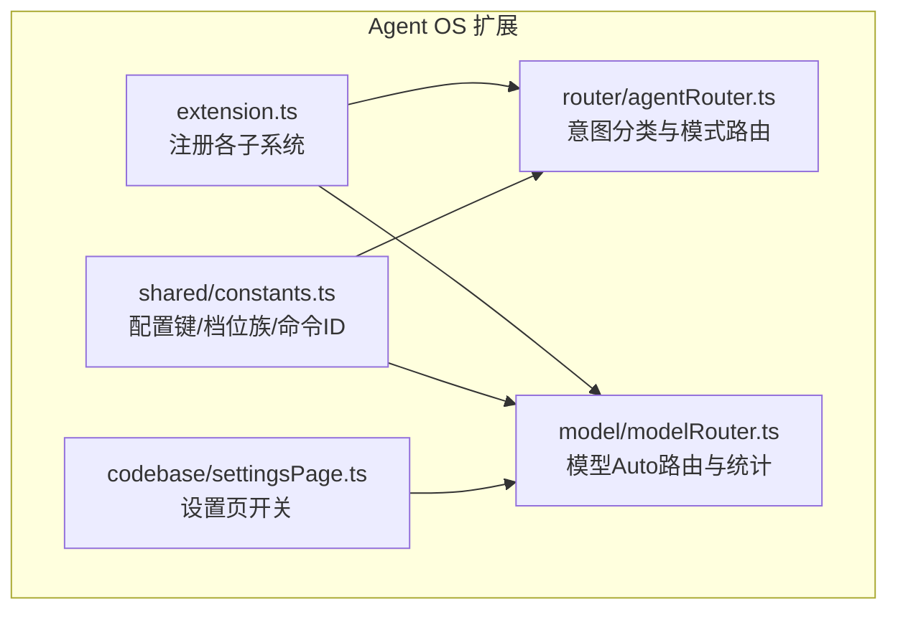
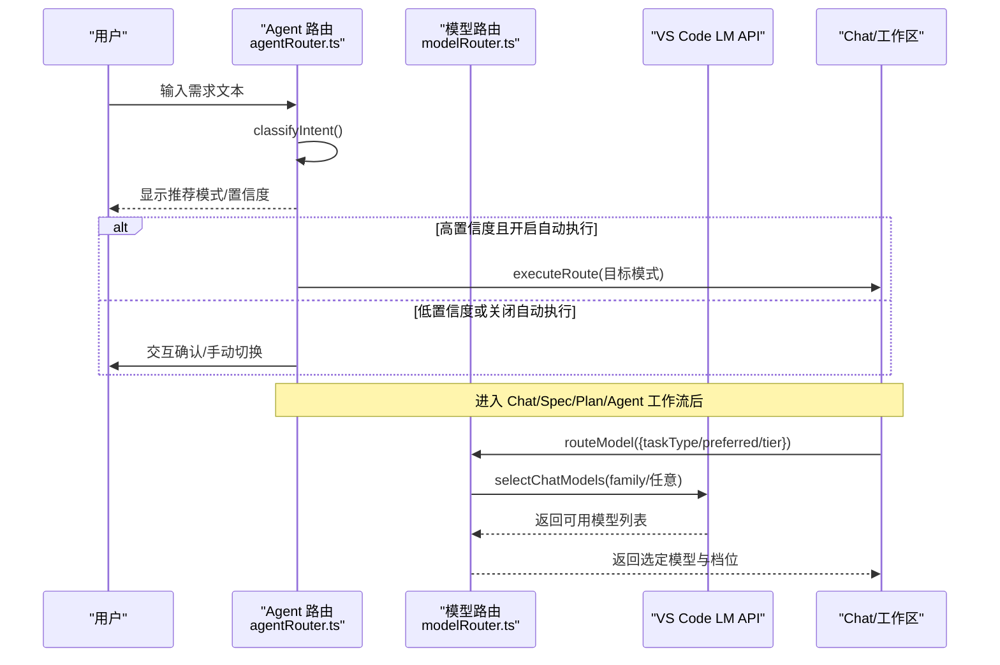
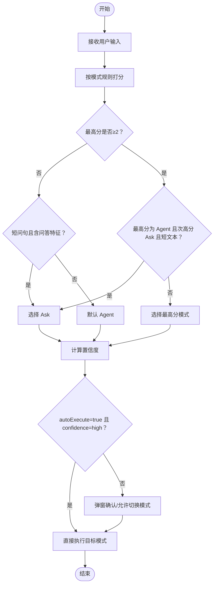
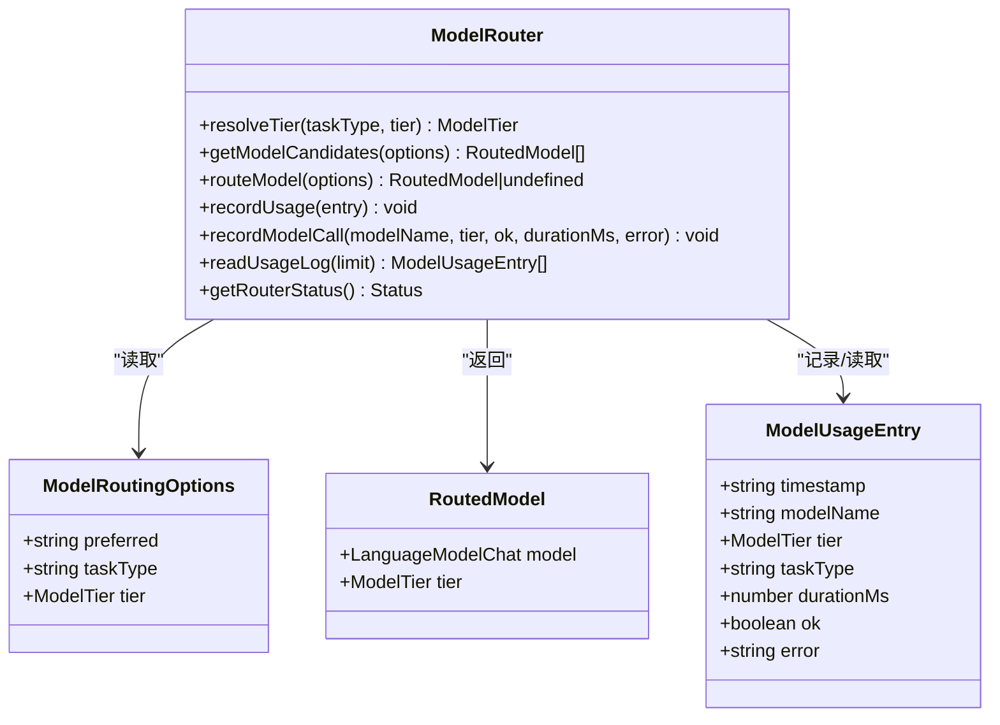
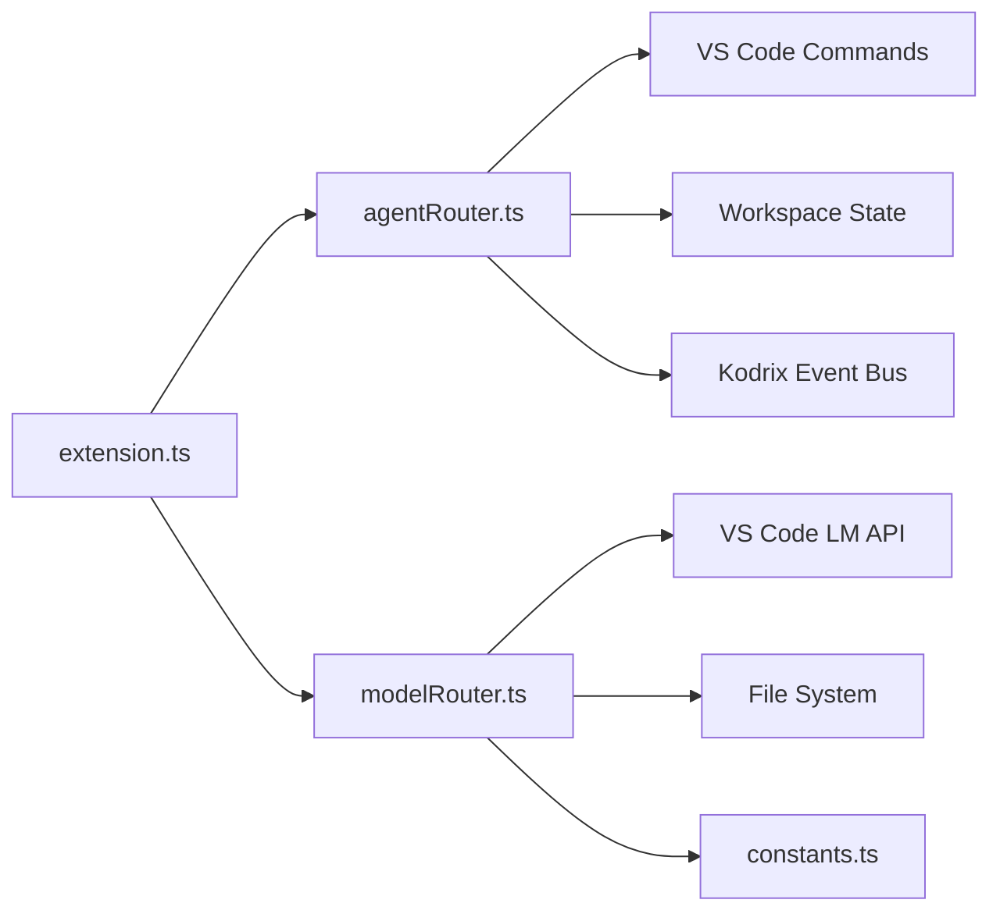

# 模型选择策略

<cite>
**本文引用的文件**   
- [extensions/kodrix-agent-os/src/extension.ts](file://extensions/kodrix-agent-os/src/extension.ts)
- [extensions/kodrix-agent-os/src/router/agentRouter.ts](file://extensions/kodrix-agent-os/src/router/agentRouter.ts)
- [extensions/kodrix-agent-os/src/model/modelRouter.ts](file://extensions/kodrix-agent-os/src/model/modelRouter.ts)
- [extensions/kodrix-agent-os/src/shared/constants.ts](file://extensions/kodrix-agent-os/src/shared/constants.ts)
- [extensions/kodrix-agent-os/src/codebase/settingsPage.ts](file://extensions/kodrix-agent-os/src/codebase/settingsPage.ts)
</cite>

## 目录
1. [引言](#引言)
2. [项目结构](#项目结构)
3. [核心组件](#核心组件)
4. [架构总览](#架构总览)
5. [详细组件分析](#详细组件分析)
6. [依赖关系分析](#依赖关系分析)
7. [性能与可用性](#性能与可用性)
8. [故障排查指南](#故障排查指南)
9. [结论](#结论)
10. [附录：配置与调优清单](#附录配置与调优清单)

## 引言
本文件面向高级用户，系统性说明 Kodrix 的“模型选择策略”，包括两层路由机制：
- Agent 层路由：根据用户意图自动选择 Idea/Spec/Plan/Agent/Ask 五种工作模式。
- Model 层路由：在可用语言模型池中按任务复杂度、优先级和可用性自动选择具体模型（smart/balanced/fast 三档）。

文档同时给出能力矩阵、切换条件、配置方法、负载均衡思路以及生产环境调优建议。

## 项目结构
Kodrix 的多模型路由由两个扩展模块协同完成：
- Agent 路由：位于 agentRouter.ts，负责将自然语言输入分类为 spec/plan/agent/ask 等目标模式，并触发对应命令。
- 模型路由：位于 modelRouter.ts，负责从 VS Code Language Model API 中按档位与优先级挑选具体模型，并记录使用统计。
- 常量与配置键：集中在 constants.ts，提供模型档位族、配置段、命令 ID 等集中管理。
- 扩展入口：extension.ts 注册所有子功能，包括模型路由与健康面板。

图示来源
- [extensions/kodrix-agent-os/src/extension.ts:158-212](file://extensions/kodrix-agent-os/src/extension.ts#L158-L212)
- [extensions/kodrix-agent-os/src/router/agentRouter.ts:141-248](file://extensions/kodrix-agent-os/src/router/agentRouter.ts#L141-L248)
- [extensions/kodrix-agent-os/src/model/modelRouter.ts:167-267](file://extensions/kodrix-agent-os/src/model/modelRouter.ts#L167-L267)
- [extensions/kodrix-agent-os/src/shared/constants.ts:459-477](file://extensions/kodrix-agent-os/src/shared/constants.ts#L459-L477)
- [extensions/kodrix-agent-os/src/codebase/settingsPage.ts:504-504](file://extensions/kodrix-agent-os/src/codebase/settingsPage.ts#L504-L504)

章节来源
- [extensions/kodrix-agent-os/src/extension.ts:158-212](file://extensions/kodrix-agent-os/src/extension.ts#L158-L212)
- [extensions/kodrix-agent-os/src/shared/constants.ts:459-477](file://extensions/kodrix-agent-os/src/shared/constants.ts#L459-L477)

## 核心组件
- Agent 路由（agentRouter.ts）
  - 职责：对用户输入进行规则评分，输出目标模式（spec/plan/agent/ask）、置信度与原因；支持自动执行或交互式确认；持久化最近一次路由结果。
  - 关键函数：classifyIntent、routeAgentPrompt、executeRoute、routeAndExecute。
- 模型路由（modelRouter.ts）
  - 职责：根据 preferred/taskType/tier 确定候选模型池顺序，调用 vscode.lm.selectChatModels 获取可用模型；记录每次路由与推理调用；提供健康面板与状态查询。
  - 关键函数：resolveTier、getModelCandidates、routeModel、recordUsage、getRouterStatus。
- 常量与配置（constants.ts）
  - 职责：集中定义 MODEL_ROUTER_CONFIG、MODEL_ROUTER_TIERS、COMMANDS 等，保证全局一致性与可维护性。
- 设置页（settingsPage.ts）
  - 职责：暴露 kodrix.modelRouter.enabled 开关，便于用户在 IDE 内启用/禁用模型 Auto 路由。

章节来源
- [extensions/kodrix-agent-os/src/router/agentRouter.ts:10-113](file://extensions/kodrix-agent-os/src/router/agentRouter.ts#L10-L113)
- [extensions/kodrix-agent-os/src/model/modelRouter.ts:26-89](file://extensions/kodrix-agent-os/src/model/modelRouter.ts#L26-L89)
- [extensions/kodrix-agent-os/src/shared/constants.ts:459-477](file://extensions/kodrix-agent-os/src/shared/constants.ts#L459-L477)
- [extensions/kodrix-agent-os/src/codebase/settingsPage.ts:504-504](file://extensions/kodrix-agent-os/src/codebase/settingsPage.ts#L504-L504)

## 架构总览
Kodrix 的两层路由形成“意图→模式→模型”的流水线：
- 第一层：Agent 路由将自然语言意图映射到 Spec/Plan/Agent/Ask 四种模式（Idea Flow 通过命令与工作流驱动，不直接参与该分类器）。
- 第二层：模型路由根据任务类型映射到 smart/balanced/fast 三档，并在可用模型池中按优先级选择具体模型。

图示来源
- [extensions/kodrix-agent-os/src/router/agentRouter.ts:72-113](file://extensions/kodrix-agent-os/src/router/agentRouter.ts#L72-L113)
- [extensions/kodrix-agent-os/src/router/agentRouter.ts:141-248](file://extensions/kodrix-agent-os/src/router/agentRouter.ts#L141-L248)
- [extensions/kodrix-agent-os/src/model/modelRouter.ts:167-267](file://extensions/kodrix-agent-os/src/model/modelRouter.ts#L167-L267)

## 详细组件分析

### Agent 路由：Idea/Spec/Plan/Agent/Ask 自动选择逻辑
- 模式与权重
  - Spec：匹配“@spec/spec 驱动/三件套/requirements.md/需求设计任务/实施 spec/用户故事/EARS/验收标准”等关键词，权重较高。
  - Plan：匹配“/plan/重构/迁移/架构/设计方案/技术方案/复杂大型多模块跨文件/先规划审阅方案”。
  - Agent：匹配“审查/测试/修复/部署/实现”等实施类指令。
  - Ask：匹配“什么是/为什么/怎么/如何/解释/说明/文档/README”等问答探索类。
- 决策流程
  - 对每类模式计算命中权重之和，取最高分作为首选；若 Agent 与 Ask 分数接近且文本较短，优先归入 Ask。
  - 置信度：分数≥3 为 high，≥2 为 medium，否则 low。
  - 自动执行：当 autoExecute=true 且 confidence=high 时直接执行；否则弹出确认对话框，允许切换到其他模式。
- 执行动作
  - Spec：打开 Spec 工作台或创建新 Spec，再打开 Chat 并注入 Spec 上下文。
  - Plan/Agent/Ask：打开 Chat 并传入相应 mode 与 query。

图示来源
- [extensions/kodrix-agent-os/src/router/agentRouter.ts:30-70](file://extensions/kodrix-agent-os/src/router/agentRouter.ts#L30-L70)
- [extensions/kodrix-agent-os/src/router/agentRouter.ts:72-113](file://extensions/kodrix-agent-os/src/router/agentRouter.ts#L72-L113)
- [extensions/kodrix-agent-os/src/router/agentRouter.ts:141-190](file://extensions/kodrix-agent-os/src/router/agentRouter.ts#L141-L190)
- [extensions/kodrix-agent-os/src/router/agentRouter.ts:192-234](file://extensions/kodrix-agent-os/src/router/agentRouter.ts#L192-L234)

章节来源
- [extensions/kodrix-agent-os/src/router/agentRouter.ts:30-113](file://extensions/kodrix-agent-os/src/router/agentRouter.ts#L30-L113)
- [extensions/kodrix-agent-os/src/router/agentRouter.ts:141-248](file://extensions/kodrix-agent-os/src/router/agentRouter.ts#L141-L248)

### 模型路由：三档模型池与任务复杂度映射
- 档位与任务映射
  - smart：analysis/review/plan（深度分析与评审）
  - balanced：coding/edit/terminal（编码与命令）
  - fast：quick/extract（快速提取）
- 选择优先级
  - preferred（精确指定 family）> taskType 映射 > tier 显式参数 > 全池兜底。
  - 兜底顺序：smart → balanced → fast → 任意可用模型。
- 可用性探测
  - 通过 vscode.lm.selectChatModels 按 family 查询可用模型；失败则跳过继续尝试下一个 family。
- 使用记录与健康面板
  - 每次路由与推理调用均写入 .kodrix/model-router.jsonl，包含时间戳、模型名、档位、任务类型、耗时、成功/失败与错误信息。
  - getRouterStatus 聚合成功率、平均耗时、最后错误与最后调用时间，供健康面板展示。

图示来源
- [extensions/kodrix-agent-os/src/model/modelRouter.ts:26-89](file://extensions/kodrix-agent-os/src/model/modelRouter.ts#L26-L89)
- [extensions/kodrix-agent-os/src/model/modelRouter.ts:100-144](file://extensions/kodrix-agent-os/src/model/modelRouter.ts#L100-L144)
- [extensions/kodrix-agent-os/src/model/modelRouter.ts:146-206](file://extensions/kodrix-agent-os/src/model/modelRouter.ts#L146-L206)
- [extensions/kodrix-agent-os/src/model/modelRouter.ts:208-295](file://extensions/kodrix-agent-os/src/model/modelRouter.ts#L208-L295)

章节来源
- [extensions/kodrix-agent-os/src/model/modelRouter.ts:65-89](file://extensions/kodrix-agent-os/src/model/modelRouter.ts#L65-L89)
- [extensions/kodrix-agent-os/src/model/modelRouter.ts:167-267](file://extensions/kodrix-agent-os/src/model/modelRouter.ts#L167-L267)
- [extensions/kodrix-agent-os/src/model/modelRouter.ts:297-362](file://extensions/kodrix-agent-os/src/model/modelRouter.ts#L297-L362)

### 模型能力矩阵与适用场景
- Smart 档（gpt-4o / claude-3.5-sonnet / claude-3.7-sonnet / copilot-gpt-4）
  - 擅长：深度分析、代码审查、架构/方案设计、复杂推理。
  - 适用：analysis/review/plan 任务。
- Balanced 档（gpt-4o-mini / claude-3.5-haiku / copilot-gpt-4-mini）
  - 擅长：常规编码、编辑、终端命令生成。
  - 适用：coding/edit/terminal 任务。
- Fast 档（gpt-4o-mini / copilot-gpt-4-mini）
  - 擅长：快速提取、轻量问答、简单补全。
  - 适用：quick/extract 任务。

注：以上模型族来源于常量定义，实际可用性取决于 VS Code 已配置的模型提供方。

章节来源
- [extensions/kodrix-agent-os/src/shared/constants.ts:469-474](file://extensions/kodrix-agent-os/src/shared/constants.ts#L469-L474)

### 模型切换条件判断
- 任务复杂度
  - 复杂推理/评审/规划 → smart
  - 常规编码/命令 → balanced
  - 快速提取/简单问答 → fast
- 上下文信息
  - 可通过 taskType 传递任务语义（如 analysis/coding/quick），由 resolveTier 映射到档位。
- 用户历史偏好
  - 当前实现未直接读取历史偏好影响档位；但可通过 preferred 精确指定 family，达到“用户偏好优先”的效果。
- 可用性降级
  - 若首选 family 不可用，自动回退到其他档位直至任意可用模型。

章节来源
- [extensions/kodrix-agent-os/src/model/modelRouter.ts:77-89](file://extensions/kodrix-agent-os/src/model/modelRouter.ts#L77-L89)
- [extensions/kodrix-agent-os/src/model/modelRouter.ts:167-206](file://extensions/kodrix-agent-os/src/model/modelRouter.ts#L167-L206)
- [extensions/kodrix-agent-os/src/model/modelRouter.ts:208-267](file://extensions/kodrix-agent-os/src/model/modelRouter.ts#L208-L267)

### 模型配置方法
- 预设模型设置
  - 通过 constants.ts 中的 MODEL_ROUTER_TIERS 定义各档位模型族；可按需调整顺序以改变优先级。
- 自定义模型注册
  - 在 VS Code 的模型提供方中注册新的 family；然后在 MODEL_ROUTER_TIERS 中添加对应 family 名称。
- 优先级排序
  - preferred 字段具有最高优先级；其次为 taskType 映射；再次为显式 tier；最后是兜底全池。
- 开关控制
  - 通过 kodrix.modelRouter.enabled 控制是否启用模型 Auto 路由；关闭时退化为任意可用模型。
- 设置页
  - settingsPage.ts 暴露了“模型 Auto 路由”开关，便于在 IDE 内直接启用/禁用。

章节来源
- [extensions/kodrix-agent-os/src/shared/constants.ts:459-477](file://extensions/kodrix-agent-os/src/shared/constants.ts#L459-L477)
- [extensions/kodrix-agent-os/src/model/modelRouter.ts:208-219](file://extensions/kodrix-agent-os/src/model/modelRouter.ts#L208-L219)
- [extensions/kodrix-agent-os/src/codebase/settingsPage.ts:504-504](file://extensions/kodrix-agent-os/src/codebase/settingsPage.ts#L504-L504)

### 负载均衡机制
- 单实例内
  - 当前实现未内置基于负载的调度算法；选择逻辑主要基于优先级与可用性。
- 多实例间
  - 建议在外部网关/代理层实现负载均衡（例如按地域、延迟、配额或成功率分发请求），避免单点过载。
- 内部降级
  - 当首选 family 不可用时，自动尝试其他档位与任意模型，起到“可用性负载均衡”的作用。

[本节为通用指导，不涉及具体源码]

### 面向高级用户的调优指南
- 性能监控
  - 使用 getRouterStatus 与模型健康面板查看成功率、平均耗时与最后错误；结合 .kodrix/model-router.jsonl 做离线分析。
- 错误重试
  - 在调用方封装重试逻辑（指数退避），并结合 recordModelCall(ok=false, error) 标记失败以便统计。
- 降级策略
  - 当 smart 档不可用或失败率过高时，强制 fallback 至 balanced/fast；必要时临时关闭 Auto 路由，退回任意可用模型。
- 容量规划
  - 合理配置各档位 family 数量，避免单一 provider 成为瓶颈；结合外部限流与配额管理。
- 观测与告警
  - 对成功率低于阈值（如 <90%）或平均耗时异常升高进行告警；定期清理使用日志，保持可读性。

章节来源
- [extensions/kodrix-agent-os/src/model/modelRouter.ts:119-144](file://extensions/kodrix-agent-os/src/model/modelRouter.ts#L119-L144)
- [extensions/kodrix-agent-os/src/model/modelRouter.ts:269-295](file://extensions/kodrix-agent-os/src/model/modelRouter.ts#L269-L295)

## 依赖关系分析
- Agent 路由依赖
  - VS Code 命令系统（workbench.action.chat.open 等）
  - 工作区状态（workspaceState）用于持久化最近路由
  - 事件总线（emitKodrixEvent）用于上报路由执行事件
- 模型路由依赖
  - VS Code Language Model API（vscode.lm.selectChatModels）
  - 文件系统（fs）用于读写 .kodrix/model-router.jsonl
  - 常量模块（constants.ts）提供配置键与档位族
- 扩展入口
  - extension.ts 统一注册 router 与 modelRouter，确保启动时加载

图示来源
- [extensions/kodrix-agent-os/src/extension.ts:158-212](file://extensions/kodrix-agent-os/src/extension.ts#L158-L212)
- [extensions/kodrix-agent-os/src/router/agentRouter.ts:115-139](file://extensions/kodrix-agent-os/src/router/agentRouter.ts#L115-L139)
- [extensions/kodrix-agent-os/src/model/modelRouter.ts:146-159](file://extensions/kodrix-agent-os/src/model/modelRouter.ts#L146-L159)
- [extensions/kodrix-agent-os/src/model/modelRouter.ts:91-117](file://extensions/kodrix-agent-os/src/model/modelRouter.ts#L91-L117)
- [extensions/kodrix-agent-os/src/shared/constants.ts:459-477](file://extensions/kodrix-agent-os/src/shared/constants.ts#L459-L477)

章节来源
- [extensions/kodrix-agent-os/src/extension.ts:158-212](file://extensions/kodrix-agent-os/src/extension.ts#L158-L212)
- [extensions/kodrix-agent-os/src/router/agentRouter.ts:115-139](file://extensions/kodrix-agent-os/src/router/agentRouter.ts#L115-L139)
- [extensions/kodrix-agent-os/src/model/modelRouter.ts:91-159](file://extensions/kodrix-agent-os/src/model/modelRouter.ts#L91-L159)
- [extensions/kodrix-agent-os/src/shared/constants.ts:459-477](file://extensions/kodrix-agent-os/src/shared/constants.ts#L459-L477)

## 性能与可用性
- 路由开销
  - Agent 路由为本地规则评分，开销极低；模型路由会调用 LM API 枚举可用模型，存在少量网络/初始化成本。
- 日志滚动
  - 使用日志上限由 MODEL_ROUTER_USAGE_LOG_MAX 控制，避免无限增长。
- 可用性
  - 通过多档位与兜底策略提升鲁棒性；当某 family 不可用时自动回退。
- 观察指标
  - 成功率、平均耗时、失败次数、最后错误、最后调用时间。

章节来源
- [extensions/kodrix-agent-os/src/model/modelRouter.ts:100-117](file://extensions/kodrix-agent-os/src/model/modelRouter.ts#L100-L117)
- [extensions/kodrix-agent-os/src/model/modelRouter.ts:269-295](file://extensions/kodrix-agent-os/src/model/modelRouter.ts#L269-L295)

## 故障排查指南
- 症状：模型健康面板无数据
  - 可能原因：尚未运行任何 Agent 任务或未触发路由；检查 .kodrix/model-router.jsonl 是否存在。
- 症状：成功率偏低
  - 排查步骤：查看 lastError 与 avgDurationMs；确认 provider 配额/限流；考虑降级到 balanced/fast。
- 症状：Auto 路由未生效
  - 检查 kodrix.modelRouter.enabled 是否为 true；确认 settingsPage 开关已启用。
- 症状：特定 family 不可用
  - 检查 VS Code 模型提供方配置是否正确；在 MODEL_ROUTER_TIERS 中移除不可用 family 或修正名称。

章节来源
- [extensions/kodrix-agent-os/src/model/modelRouter.ts:297-362](file://extensions/kodrix-agent-os/src/model/modelRouter.ts#L297-L362)
- [extensions/kodrix-agent-os/src/codebase/settingsPage.ts:504-504](file://extensions/kodrix-agent-os/src/codebase/settingsPage.ts#L504-L504)

## 结论
Kodrix 的模型选择策略通过“Agent 路由 + 模型路由”的双层机制，既实现了按意图自动选择工作模式，又实现了按任务复杂度与可用性自动选择具体模型。配合使用日志与健康面板，用户可以持续观测并优化模型选择效果。在生产环境中，建议结合外部负载均衡、重试与降级策略，以获得更稳定与高效的体验。

## 附录：配置与调优清单
- 配置项
  - kodrix.modelRouter.enabled：启用/禁用模型 Auto 路由
  - MODEL_ROUTER_TIERS：smart/balanced/fast 各档位的模型族列表
  - TASK_TIER_MAP：任务类型到档位的映射
- 常用操作
  - 打开模型健康面板：命令 “Kodrix: 模型路由状态”
  - 查看最近路由：命令 “Kodrix: 智能路由” 或 Hub 快捷入口
- 调优建议
  - 针对高频任务类型调整 TASK_TIER_MAP
  - 将高质量但昂贵的 family 放入 smart，低成本 family 放入 fast
  - 对失败率高的 family 暂时移出或降低优先级
  - 结合外部限流与配额管理，避免单 provider 过载

章节来源
- [extensions/kodrix-agent-os/src/shared/constants.ts:459-477](file://extensions/kodrix-agent-os/src/shared/constants.ts#L459-L477)
- [extensions/kodrix-agent-os/src/model/modelRouter.ts:65-89](file://extensions/kodrix-agent-os/src/model/modelRouter.ts#L65-L89)
- [extensions/kodrix-agent-os/src/model/modelRouter.ts:297-362](file://extensions/kodrix-agent-os/src/model/modelRouter.ts#L297-L362)