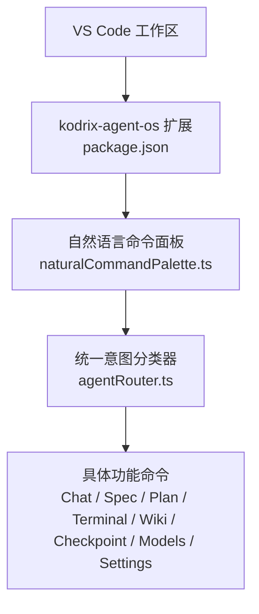
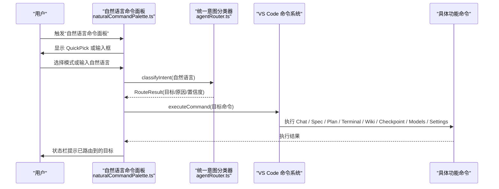
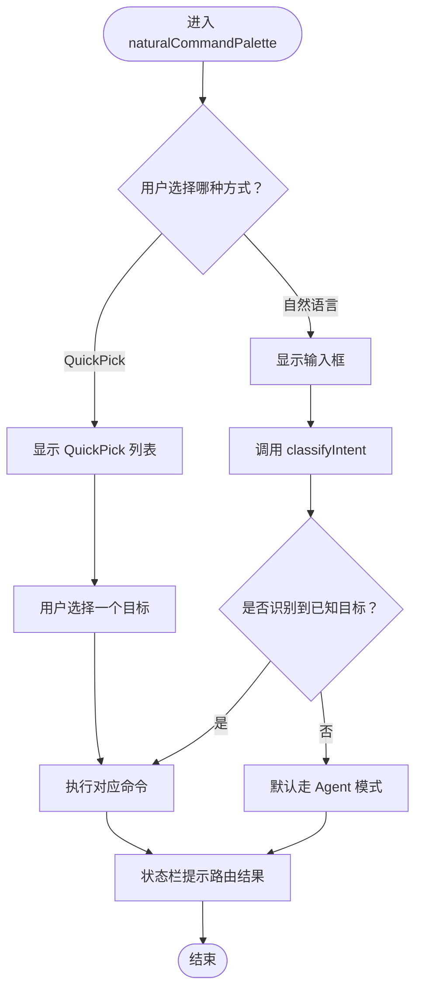
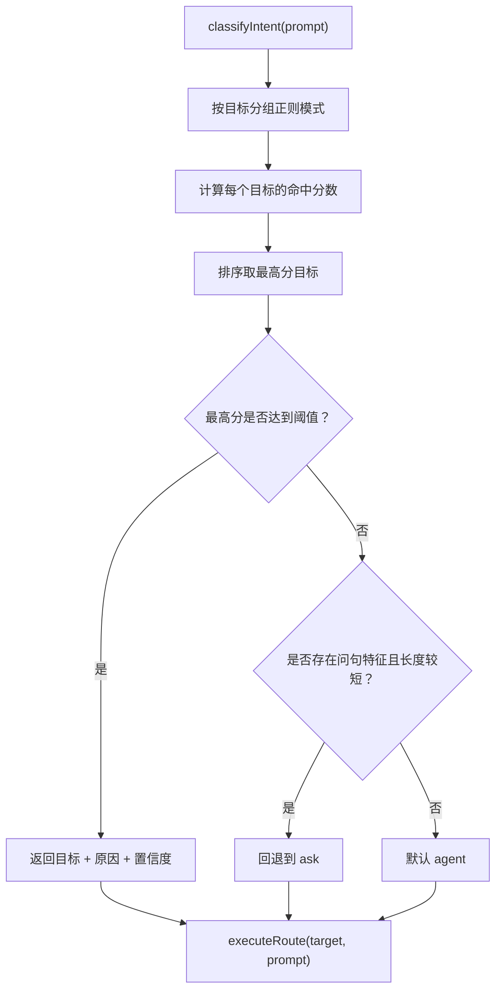
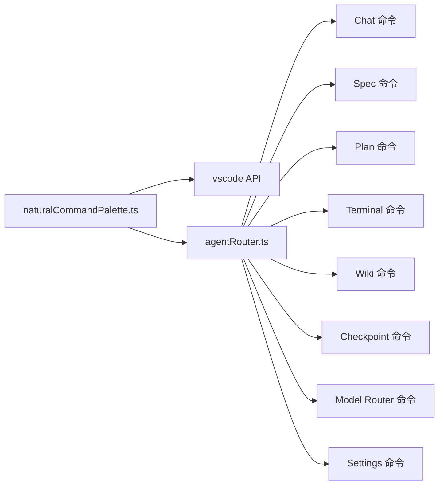

# 自然语言命令面板

<cite>
**本文引用的文件**   
- [README.md](file://README.md)
- [package.json](file://package.json)
- [extensions/kodrix-agent-os/package.json](file://extensions/kodrix-agent-os/package.json)
- [extensions/kodrix-agent-os/src/router/naturalCommandPalette.ts](file://extensions/kodrix-agent-os/src/router/naturalCommandPalette.ts)
- [extensions/kodrix-agent-os/src/router/agentRouter.ts](file://extensions/kodrix-agent-os/src/router/agentRouter.ts)
- [extensions/kodrix-agent-os/package.nls.json](file://extensions/kodrix-agent-os/package.nls.json)
- [extensions/kodrix-local/package.json](file://extensions/kodrix-local/package.json)
- [extensions/kodrix-skills/package.json](file://extensions/kodrix-skills/package.json)
</cite>

## 目录
1. [引言](#引言)
2. [项目结构](#项目结构)
3. [核心组件](#核心组件)
4. [架构总览](#架构总览)
5. [详细组件分析](#详细组件分析)
6. [依赖关系分析](#依赖关系分析)
7. [性能与体验考量](#性能与体验考量)
8. [故障排查指南](#故障排查指南)
9. [结论](#结论)

## 引言
本文件聚焦 Kodrix Code 中的“自然语言命令面板”能力，说明其如何把用户的自然语言输入或快捷选择，自动路由到 Agent、Spec、Plan、Ask、终端、Wiki、检查点、模型配置和设置等目标。该能力由 `kodrix-agent-os` 扩展提供，核心实现位于 `src/router/naturalCommandPalette.ts`，并与统一意图分类器 `src/router/agentRouter.ts` 协作完成智能分发。

从产品层面看，Kodrix 是基于 VS Code/VSCodium 的 AI 原生编辑器分支，内置多个自定义扩展（包括 `kodrix-agent-os`、`kodrix-local`、`kodrix-skills`），并集成多 Agent 协作、Idea Flow、本地 Skill 市场等能力。自然语言命令面板是这些能力的统一入口之一，既支持可视化 QuickPick 选择，也支持自由自然语言输入后自动路由。

**章节来源**
- [README.md:22-34](file://README.md#L22-L34)

## 项目结构
围绕自然语言命令面板的相关代码主要分布在 `extensions/kodrix-agent-os` 扩展中：
- 扩展声明与用户可见文案通过 `package.json` 暴露命令、视图、快捷键、菜单和配置项。
- 自然语言命令面板 UI 逻辑在 `src/router/naturalCommandPalette.ts`。
- 自然语言意图分类与执行逻辑在 `src/router/agentRouter.ts`。
- 英文 NLS 基线在 `package.nls.json`，用于国际化显示文本。

**图示来源**
- [extensions/kodrix-agent-os/package.json:479-482](file://extensions/kodrix-agent-os/package.json#L479-L482)
- [extensions/kodrix-agent-os/src/router/naturalCommandPalette.ts:35-67](file://extensions/kodrix-agent-os/src/router/naturalCommandPalette.ts#L35-L67)
- [extensions/kodrix-agent-os/src/router/agentRouter.ts:92-138](file://extensions/kodrix-agent-os/src/router/agentRouter.ts#L92-L138)

**章节来源**
- [extensions/kodrix-agent-os/package.json:85-483](file://extensions/kodrix-agent-os/package.json#L85-L483)
- [extensions/kodrix-agent-os/src/router/naturalCommandPalette.ts:1-106](file://extensions/kodrix-agent-os/src/router/naturalCommandPalette.ts#L1-L106)
- [extensions/kodrix-agent-os/src/router/agentRouter.ts:1-305](file://extensions/kodrix-agent-os/src/router/agentRouter.ts#L1-L305)

## 核心组件
自然语言命令面板的核心由两个模块组成：
1. **自然语言命令面板 UI 层**：负责展示可选命令、接收用户输入、调用路由逻辑并执行目标命令。
2. **统一意图分类与执行层**：根据自然语言文本匹配规则计算目标类别、置信度与原因，并执行对应命令。

关键职责划分如下：
- `naturalCommandPalette.ts`：注册自然语言命令面板命令；构建 QuickPick 列表；处理自然语言输入框；调用 `classifyIntent`；根据结果执行命令；在状态栏提示路由结果。
- `agentRouter.ts`：定义路由目标类型、分类规则、置信度计算、最近一次路由记录、自动执行策略、命令执行分发。

**章节来源**
- [extensions/kodrix-agent-os/src/router/naturalCommandPalette.ts:5-20](file://extensions/kodrix-agent-os/src/router/naturalCommandPalette.ts#L5-L20)
- [extensions/kodrix-agent-os/src/router/agentRouter.ts:10-26](file://extensions/kodrix-agent-os/src/router/agentRouter.ts#L10-L26)

## 架构总览
自然语言命令面板的整体交互流程可以概括为：用户触发命令 → 面板展示可选模式或自然语言输入 → 意图分类 → 执行目标命令 → 状态栏反馈。

**图示来源**
- [extensions/kodrix-agent-os/src/router/naturalCommandPalette.ts:35-104](file://extensions/kodrix-agent-os/src/router/naturalCommandPalette.ts#L35-L104)
- [extensions/kodrix-agent-os/src/router/agentRouter.ts:92-138](file://extensions/kodrix-agent-os/src/router/agentRouter.ts#L92-L138)
- [extensions/kodrix-agent-os/src/router/agentRouter.ts:217-274](file://extensions/kodrix-agent-os/src/router/agentRouter.ts#L217-L274)

## 详细组件分析

### 自然语言命令面板 UI 层
自然语言命令面板提供两种入口：
- **QuickPick 模式**：列出 Agent、Spec、Plan、Ask、Terminal、Wiki、Checkpoint、Models、Settings 等目标，每个条目包含图标、标签、描述和目标命令。
- **自然语言输入模式**：让用户用自然语言描述需求，然后交给意图分类器决定最终目标。

关键点：
- 使用 `vscode.window.showQuickPick` 展示可搜索的命令列表。
- 使用 `vscode.window.showInputBox` 获取自然语言输入。
- 对特殊目标如 `agent`、`ask`、`settings` 进行差异化处理：例如打开 Chat 时传入 mode，打开设置时传入过滤前缀。
- 所有面向用户的字符串通过 `l10n.t()` 包裹，便于国际化。

**图示来源**
- [extensions/kodrix-agent-os/src/router/naturalCommandPalette.ts:35-67](file://extensions/kodrix-agent-os/src/router/naturalCommandPalette.ts#L35-L67)
- [extensions/kodrix-agent-os/src/router/naturalCommandPalette.ts:69-104](file://extensions/kodrix-agent-os/src/router/naturalCommandPalette.ts#L69-L104)

**章节来源**
- [extensions/kodrix-agent-os/src/router/naturalCommandPalette.ts:9-20](file://extensions/kodrix-agent-os/src/router/naturalCommandPalette.ts#L9-L20)
- [extensions/kodrix-agent-os/src/router/naturalCommandPalette.ts:35-67](file://extensions/kodrix-agent-os/src/router/naturalCommandPalette.ts#L35-L67)
- [extensions/kodrix-agent-os/src/router/naturalCommandPalette.ts:69-104](file://extensions/kodrix-agent-os/src/router/naturalCommandPalette.ts#L69-L104)

### 统一意图分类与执行层
`agentRouter.ts` 定义了自然语言到目标类别的分类逻辑，并负责执行目标命令。

核心数据结构：
- `RouteTarget`：路由目标类型，包括 spec、plan、agent、ask、terminal、wiki、checkpoint、models、settings。
- `RouteConfidence`：置信度等级 high、medium、low。
- `RouteResult`：包含 target、reason、confidence。
- `LastRouteRecord`：记录最近一次路由的目标、提示词、原因、置信度和时间戳。

分类算法要点：
- 为每个目标定义一组正则模式及权重。
- 对输入文本扫描各模式，累加命中权重得到 score。
- 根据 score 映射 confidence。
- 对 agent 与 ask 做特殊优化：短问答类请求优先归入 ask。
- 若最高分低于阈值且存在问句特征，则可能回退到 ask；否则默认 agent。

执行逻辑要点：
- `executeRoute` 根据目标调用不同命令：
  - spec：打开 Spec Workbench 或创建 Spec，并在 Chat 中注入 prompt。
  - plan：以 `/plan` 前缀打开 Chat。
  - ask：以 ask 模式打开 Chat。
  - terminal：打开终端 AI 提示。
  - wiki：生成 Repo Wiki。
  - checkpoint：打开检查点列表。
  - models：查看模型路由状态。
  - settings：打开设置并过滤 kodrix 相关项。
  - agent：默认以 agent 模式打开 Chat。

**图示来源**
- [extensions/kodrix-agent-os/src/router/agentRouter.ts:30-76](file://extensions/kodrix-agent-os/src/router/agentRouter.ts#L30-L76)
- [extensions/kodrix-agent-os/src/router/agentRouter.ts:78-90](file://extensions/kodrix-agent-os/src/router/agentRouter.ts#L78-L90)
- [extensions/kodrix-agent-os/src/router/agentRouter.ts:92-138](file://extensions/kodrix-agent-os/src/router/agentRouter.ts#L92-L138)
- [extensions/kodrix-agent-os/src/router/agentRouter.ts:217-274](file://extensions/kodrix-agent-os/src/router/agentRouter.ts#L217-L274)

**章节来源**
- [extensions/kodrix-agent-os/src/router/agentRouter.ts:10-26](file://extensions/kodrix-agent-os/src/router/agentRouter.ts#L10-L26)
- [extensions/kodrix-agent-os/src/router/agentRouter.ts:30-76](file://extensions/kodrix-agent-os/src/router/agentRouter.ts#L30-L76)
- [extensions/kodrix-agent-os/src/router/agentRouter.ts:92-138](file://extensions/kodrix-agent-os/src/router/agentRouter.ts#L92-L138)
- [extensions/kodrix-agent-os/src/router/agentRouter.ts:217-274](file://extensions/kodrix-agent-os/src/router/agentRouter.ts#L217-L274)

### 命令面板与扩展声明的关系
自然语言命令面板作为一个命令，需要在扩展的 `contributes.commands` 中声明，并通过快捷键暴露给用户。当前仓库中：
- `kodrix.router.naturalPalette` 命令标题引用了 `%command.naturalPalette.title%`。
- 快捷键绑定为 `ctrl+shift+l`，条件为不在编辑器文本焦点内。
- 英文 NLS 文件中定义了 `command.naturalPalette.title`。

此外，其他相关命令如 `kodrix.router.route`、`kodrix.router.repeatLast` 也由 `agentRouter.ts` 注册，形成完整的路由入口体系。

**章节来源**
- [extensions/kodrix-agent-os/package.json:479-482](file://extensions/kodrix-agent-os/package.json#L479-L482)
- [extensions/kodrix-agent-os/package.json:541-544](file://extensions/kodrix-agent-os/package.json#L541-L544)
- [extensions/kodrix-agent-os/package.nls.json:93-93](file://extensions/kodrix-agent-os/package.nls.json#L93-L93)
- [extensions/kodrix-agent-os/src/router/agentRouter.ts:290-304](file://extensions/kodrix-agent-os/src/router/agentRouter.ts#L290-L304)

### 与其他扩展的关系
自然语言命令面板属于 `kodrix-agent-os` 扩展，但会间接影响其他扩展的功能：
- `kodrix-local`：提供本地模型、Provider 配置、迁移、Cursor 特性导入等功能，与模型路由、设置页、Agent 工作流配合。
- `kodrix-skills`：提供 Skill 市场安装、卸载、刷新、GitHub 搜索等功能，与 Agent OS 的工作流和市场生态配合。

虽然自然语言命令面板不直接实现这两个扩展的业务逻辑，但它可以通过命令路由到相关功能，例如打开设置、查看模型状态、打开 Skill 市场等。

**章节来源**
- [extensions/kodrix-local/package.json:48-144](file://extensions/kodrix-local/package.json#L48-L144)
- [extensions/kodrix-skills/package.json:52-90](file://extensions/kodrix-skills/package.json#L52-L90)

## 依赖关系分析
自然语言命令面板的依赖关系可以分为三层：
1. **UI 层依赖 VS Code API**：`vscode.commands`、`vscode.window`、`l10n`。
2. **业务层依赖意图分类器**：`classifyIntent`。
3. **执行层依赖具体功能命令**：Chat、Spec、Plan、Terminal、Wiki、Checkpoint、Model Router、Settings。

**图示来源**
- [extensions/kodrix-agent-os/src/router/naturalCommandPalette.ts:5-7](file://extensions/kodrix-agent-os/src/router/naturalCommandPalette.ts#L5-L7)
- [extensions/kodrix-agent-os/src/router/agentRouter.ts:217-274](file://extensions/kodrix-agent-os/src/router/agentRouter.ts#L217-L274)

**章节来源**
- [extensions/kodrix-agent-os/src/router/naturalCommandPalette.ts:5-7](file://extensions/kodrix-agent-os/src/router/naturalCommandPalette.ts#L5-L7)
- [extensions/kodrix-agent-os/src/router/agentRouter.ts:217-274](file://extensions/kodrix-agent-os/src/router/agentRouter.ts#L217-L274)

## 性能与体验考量
- **分类复杂度**：意图分类基于正则匹配和简单打分，时间复杂度与模式数量和输入长度线性相关，适合轻量级本地判断。
- **用户体验**：QuickPick 支持描述匹配，提高查找效率；状态栏提示帮助用户理解路由原因。
- **可配置性**：`agentRouter` 支持自动执行开关和置信度门控，避免低置信度误执行。
- **可扩展性**：新增目标只需在 `COMMAND_MAP`、`ROUTE_TARGET_TO_KEY`、`agentRouter.ts` 的模式和执行分支中添加对应逻辑。

[本节为通用指导，不直接分析具体文件]

## 故障排查指南
常见问题与定位建议：
1. **自然语言命令面板未出现**
   - 检查 `kodrix.router.naturalPalette` 命令是否已注册。
   - 检查快捷键绑定是否被其他扩展覆盖。
   - 确认扩展已激活。

2. **自然语言输入后没有正确路由**
   - 检查 `classifyIntent` 的正则模式是否覆盖用户输入关键词。
   - 检查 `kodrix.features.agentRouter` 是否启用。
   - 检查 `kodrix.router.autoExecute` 是否导致高置信度自动执行而跳过确认。

3. **状态栏提示异常**
   - 检查 `l10n.t()` 对应的 key 是否在 NLS 文件中存在。
   - 检查中文语言包是否正确加载。

4. **目标命令执行失败**
   - 检查目标命令是否存在于 `package.json` 的 commands 中。
   - 检查目标命令的实现是否已注册。
   - 查看 `agentRouter.ts` 的 `executeRoute` 错误日志。

**章节来源**
- [extensions/kodrix-agent-os/package.json:479-482](file://extensions/kodrix-agent-os/package.json#L479-L482)
- [extensions/kodrix-agent-os/package.json:541-544](file://extensions/kodrix-agent-os/package.json#L541-L544)
- [extensions/kodrix-agent-os/src/router/agentRouter.ts:166-171](file://extensions/kodrix-agent-os/src/router/agentRouter.ts#L166-L171)
- [extensions/kodrix-agent-os/src/router/agentRouter.ts:270-273](file://extensions/kodrix-agent-os/src/router/agentRouter.ts#L270-L273)
- [extensions/kodrix-agent-os/package.nls.json:93-93](file://extensions/kodrix-agent-os/package.nls.json#L93-L93)

## 结论
自然语言命令面板是 Kodrix Agent OS 的重要入口，它将用户自然语言输入或快捷选择转化为明确的 Agent 工作流目标。其设计采用“UI 面板 + 意图分类 + 命令执行”的分层结构，兼顾易用性、可配置性和可扩展性。未来可在以下方向继续增强：
- 引入更丰富的意图分类策略，例如结合上下文、历史路由和用户偏好。
- 增加路由解释面板，让用户看到更多分类依据。
- 提供更细粒度的自动执行策略，区分高风险命令与低风险命令。
- 将自然语言命令面板与 Hub、Skill 市场、本地模型 Provider 工作区进一步打通。

[本节为总结性内容，不直接分析具体文件]