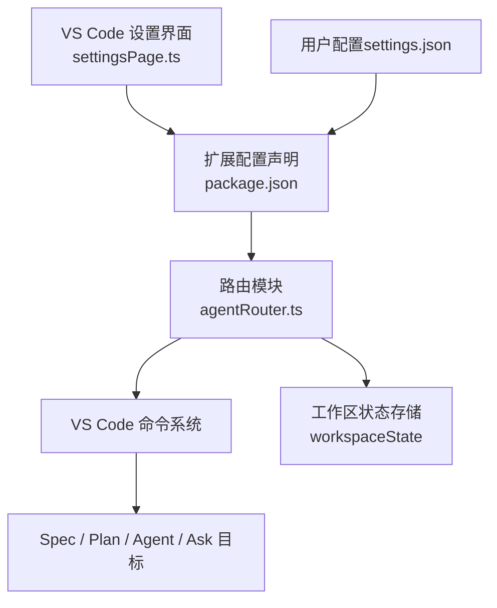
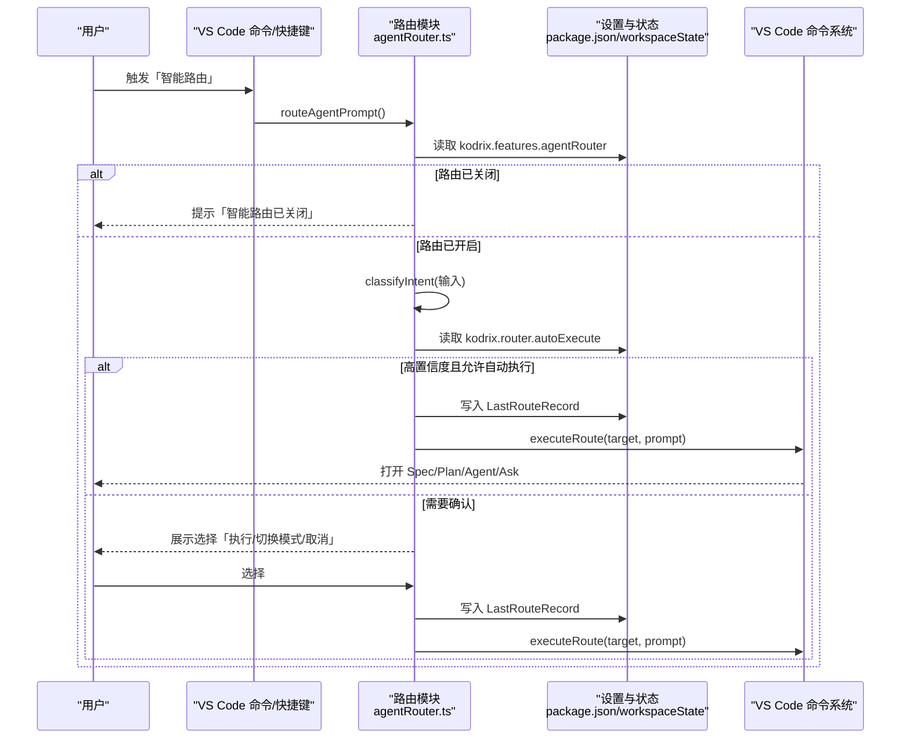
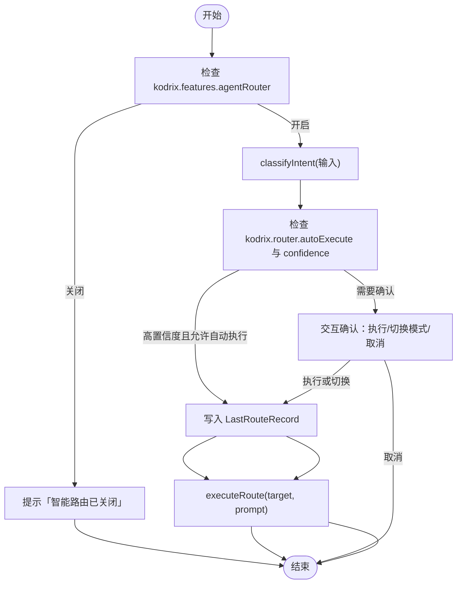
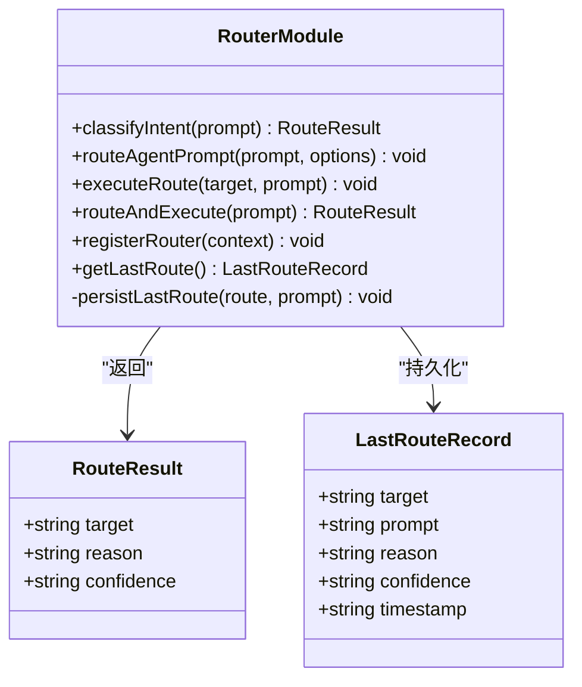
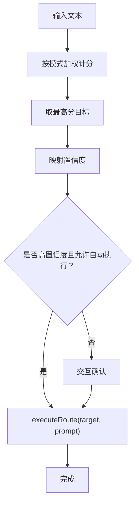
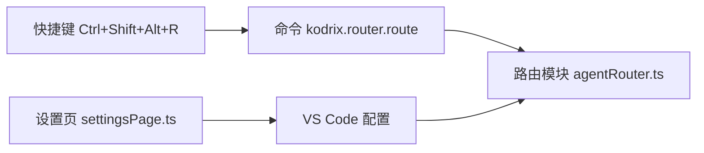
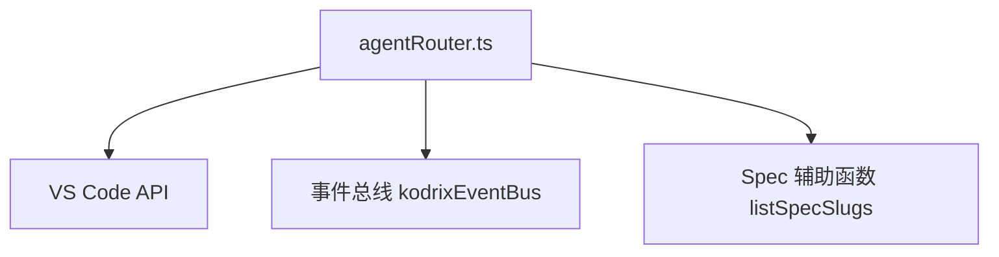

# 路由配置管理

<cite>
**本文引用的文件**   
- [package.json](file://extensions/kodrix-agent-os/package.json)
- [agentRouter.ts](file://extensions/kodrix-agent-os/src/router/agentRouter.ts)
- [settingsPage.ts](file://extensions/kodrix-agent-os/src/codebase/settingsPage.ts)
</cite>

## 目录
1. [简介](#简介)
2. [项目结构](#项目结构)
3. [核心组件](#核心组件)
4. [架构总览](#架构总览)
5. [详细组件分析](#详细组件分析)
6. [依赖关系分析](#依赖关系分析)
7. [性能与稳定性](#性能与稳定性)
8. [故障排查指南](#故障排查指南)
9. [结论](#结论)
10. [附录：配置示例与管理指南](#附录配置示例与管理指南)

## 简介
本文件面向管理员与高级用户，系统性说明 Kodrix 智能路由的配置体系与行为控制，重点覆盖：
- 功能开关：`kodrix.features.agentRouter`
- 自动执行策略：`kodrix.router.autoExecute`
- 工作区级别的路由历史持久化机制与 `LastRouteRecord` 数据结构
- 通过 VS Code 设置界面与配置文件进行路由行为定制
- 配置验证、错误处理与稳定性保障
- 批量部署与企业级策略建议

## 项目结构
Kodrix 的智能路由能力位于扩展 `kodrix-agent-os` 中，关键实现集中在路由模块与扩展配置声明：
- 扩展配置与命令、快捷键、设置项在 `package.json` 中声明
- 路由逻辑、历史记录与执行流程在 `src/router/agentRouter.ts` 中实现
- 统一设置页面在 `src/codebase/settingsPage.ts` 中提供可视化开关入口

**图表来源**
- [package.json:150-153](file://extensions/kodrix-agent-os/package.json#L150-L153)
- [package.json:468-471](file://extensions/kodrix-agent-os/package.json#L468-L471)
- [package.json:571-575](file://extensions/kodrix-agent-os/package.json#L571-L575)
- [package.json:642-646](file://extensions/kodrix-agent-os/package.json#L642-L646)
- [package.json:677-681](file://extensions/kodrix-agent-os/package.json#L677-L681)
- [agentRouter.ts:115-139](file://extensions/kodrix-agent-os/src/router/agentRouter.ts#L115-L139)
- [agentRouter.ts:250-264](file://extensions/kodrix-agent-os/src/router/agentRouter.ts#L250-L264)

**章节来源**
- [package.json:150-153](file://extensions/kodrix-agent-os/package.json#L150-L153)
- [package.json:468-471](file://extensions/kodrix-agent-os/package.json#L468-L471)
- [package.json:571-575](file://extensions/kodrix-agent-os/package.json#L571-L575)
- [package.json:642-646](file://extensions/kodrix-agent-os/package.json#L642-L646)
- [package.json:677-681](file://extensions/kodrix-agent-os/package.json#L677-L681)
- [agentRouter.ts:115-139](file://extensions/kodrix-agent-os/src/router/agentRouter.ts#L115-L139)
- [agentRouter.ts:250-264](file://extensions/kodrix-agent-os/src/router/agentRouter.ts#L250-L264)

## 核心组件
- 智能路由开关：`kodrix.features.agentRouter`
  - 类型：布尔值，默认启用
  - 作用：开启或关闭统一 Agent OS 智能路由；关闭后相关命令不可用并提示
- 自动执行策略：`kodrix.router.autoExecute`
  - 类型：布尔值，默认启用
  - 作用：当路由置信度为高时，自动执行目标模式，无需二次确认
- 上次路由结果：`kodrix.router.lastRoute`
  - 类型：对象，默认空对象
  - 作用：记录最近一次智能路由的目标、原因、置信度、时间戳等，供“重复上次智能路由”使用
- 路由分类器与执行器
  - 分类器：根据输入文本匹配规则，计算得分并判定目标（spec/plan/agent/ask）与置信度（high/medium/low）
  - 执行器：根据目标打开对应工作流（Spec 工作台、Plan 对话、Ask 问答、Agent 对话）

**章节来源**
- [package.json:571-575](file://extensions/kodrix-agent-os/package.json#L571-L575)
- [package.json:642-646](file://extensions/kodrix-agent-os/package.json#L642-L646)
- [package.json:677-681](file://extensions/kodrix-agent-os/package.json#L677-L681)
- [agentRouter.ts:10-26](file://extensions/kodrix-agent-os/src/router/agentRouter.ts#L10-L26)
- [agentRouter.ts:58-113](file://extensions/kodrix-agent-os/src/router/agentRouter.ts#L58-L113)
- [agentRouter.ts:192-234](file://extensions/kodrix-agent-os/src/router/agentRouter.ts#L192-L234)

## 架构总览
智能路由的端到端流程如下：
- 用户触发命令或通过 Hub 快捷入口发起请求
- 读取功能开关与自动执行策略
- 对输入进行意图分类，得到目标与置信度
- 若满足自动执行条件则直接执行，否则弹出交互确认
- 每次路由都会持久化到工作区状态，并通过事件总线发出路由执行事件
- 执行器调用 VS Code 命令打开相应的工作流

**图表来源**
- [agentRouter.ts:141-190](file://extensions/kodrix-agent-os/src/router/agentRouter.ts#L141-L190)
- [agentRouter.ts:192-234](file://extensions/kodrix-agent-os/src/router/agentRouter.ts#L192-L234)
- [agentRouter.ts:250-264](file://extensions/kodrix-agent-os/src/router/agentRouter.ts#L250-L264)

## 详细组件分析

### 路由开关与自动执行
- `kodrix.features.agentRouter`
  - 控制是否启用智能路由。未启用时，命令会显示警告消息并退出
  - 同时影响快捷键绑定可见性
- `kodrix.router.autoExecute`
  - 控制高置信度路由是否自动执行
  - 低/中置信度始终走交互确认路径

**图表来源**
- [agentRouter.ts:141-190](file://extensions/kodrix-agent-os/src/router/agentRouter.ts#L141-L190)
- [agentRouter.ts:192-234](file://extensions/kodrix-agent-os/src/router/agentRouter.ts#L192-L234)

**章节来源**
- [package.json:468-471](file://extensions/kodrix-agent-os/package.json#L468-L471)
- [package.json:571-575](file://extensions/kodrix-agent-os/package.json#L571-L575)
- [package.json:677-681](file://extensions/kodrix-agent-os/package.json#L677-L681)
- [agentRouter.ts:141-190](file://extensions/kodrix-agent-os/src/router/agentRouter.ts#L141-L190)
- [agentRouter.ts:192-234](file://extensions/kodrix-agent-os/src/router/agentRouter.ts#L192-L234)

### 工作区级别的路由历史与 LastRouteRecord
- 存储位置
  - 使用 VS Code 扩展上下文的工作区状态键 `kodrix.router.lastRoute`
  - 通过 `extensionContext.workspaceState.update()` 持久化
- 数据结构
  - `target`: 目标模式（spec/plan/agent/ask）
  - `prompt`: 原始输入（截断至 200 字符）
  - `reason`: 分类原因
  - `confidence`: 置信度（high/medium/low）
  - `timestamp`: ISO 时间戳
- 访问与复用
  - `getLastRoute()` 读取最近一次路由记录
  - “重复上次智能路由”命令基于该记录再次执行

**图表来源**
- [agentRouter.ts:14-26](file://extensions/kodrix-agent-os/src/router/agentRouter.ts#L14-L26)
- [agentRouter.ts:117-139](file://extensions/kodrix-agent-os/src/router/agentRouter.ts#L117-L139)
- [agentRouter.ts:243-248](file://extensions/kodrix-agent-os/src/router/agentRouter.ts#L243-L248)
- [agentRouter.ts:250-264](file://extensions/kodrix-agent-os/src/router/agentRouter.ts#L250-L264)

**章节来源**
- [agentRouter.ts:14-26](file://extensions/kodrix-agent-os/src/router/agentRouter.ts#L14-L26)
- [agentRouter.ts:117-139](file://extensions/kodrix-agent-os/src/router/agentRouter.ts#L117-L139)
- [agentRouter.ts:250-264](file://extensions/kodrix-agent-os/src/router/agentRouter.ts#L250-L264)

### 路由分类与执行逻辑
- 分类规则
  - 针对 spec/plan/agent/ask 四类目标定义正则模式与权重
  - 计算总分，映射到置信度（≥3 为 high，≥2 为 medium，其余 low）
  - 特殊优化：短问句优先归入 ask，避免误判为 agent
- 执行逻辑
  - spec：优先打开 Spec 工作台并注入查询；若无 Spec 则创建
  - plan：以 `/plan` 前缀打开对话
  - ask：以 ask 模式打开对话
  - agent：以 agent 模式打开对话
- 事件与日志
  - 路由执行后通过事件总线发出 `router.executed` 事件
  - 执行失败时记录错误日志并提示用户

**图表来源**
- [agentRouter.ts:30-56](file://extensions/kodrix-agent-os/src/router/agentRouter.ts#L30-L56)
- [agentRouter.ts:58-113](file://extensions/kodrix-agent-os/src/router/agentRouter.ts#L58-L113)
- [agentRouter.ts:192-234](file://extensions/kodrix-agent-os/src/router/agentRouter.ts#L192-L234)

**章节来源**
- [agentRouter.ts:30-56](file://extensions/kodrix-agent-os/src/router/agentRouter.ts#L30-L56)
- [agentRouter.ts:58-113](file://extensions/kodrix-agent-os/src/router/agentRouter.ts#L58-L113)
- [agentRouter.ts:192-234](file://extensions/kodrix-agent-os/src/router/agentRouter.ts#L192-L234)

### 设置界面与配置入口
- 统一设置页
  - 在 `settingsPage.ts` 中将 `kodrix.features.agentRouter` 作为功能开关之一渲染
  - 支持通过设置页修改开关，实时同步到 VS Code 配置
- 命令与快捷键
  - 命令：`kodrix.router.route`
  - 快捷键：`Ctrl+Shift+Alt+R`（受 `config.kodrix.features.agentRouter` 控制）

**图表来源**
- [settingsPage.ts:470-476](file://extensions/kodrix-agent-os/src/codebase/settingsPage.ts#L470-L476)
- [package.json:150-153](file://extensions/kodrix-agent-os/package.json#L150-L153)
- [package.json:468-471](file://extensions/kodrix-agent-os/package.json#L468-L471)

**章节来源**
- [settingsPage.ts:470-476](file://extensions/kodrix-agent-os/src/codebase/settingsPage.ts#L470-L476)
- [package.json:150-153](file://extensions/kodrix-agent-os/package.json#L150-L153)
- [package.json:468-471](file://extensions/kodrix-agent-os/package.json#L468-L471)

## 依赖关系分析
- 外部依赖
  - VS Code API：命令注册、输入框、信息框、状态栏消息、工作区状态
  - 扩展内部：事件总线（用于路由执行事件）、Spec 辅助函数（用于 Spec 列表与工作台）
- 耦合与内聚
  - 路由模块负责分类、持久化与执行，职责清晰
  - 通过 VS Code 命令系统与上层 UI 解耦
  - 通过事件总线对外暴露路由执行结果，便于其他模块监听

**图表来源**
- [agentRouter.ts:6-8](file://extensions/kodrix-agent-os/src/router/agentRouter.ts#L6-L8)
- [agentRouter.ts:133-138](file://extensions/kodrix-agent-os/src/router/agentRouter.ts#L133-L138)
- [agentRouter.ts:196-205](file://extensions/kodrix-agent-os/src/router/agentRouter.ts#L196-L205)

**章节来源**
- [agentRouter.ts:6-8](file://extensions/kodrix-agent-os/src/router/agentRouter.ts#L6-L8)
- [agentRouter.ts:133-138](file://extensions/kodrix-agent-os/src/router/agentRouter.ts#L133-L138)
- [agentRouter.ts:196-205](file://extensions/kodrix-agent-os/src/router/agentRouter.ts#L196-L205)

## 性能与稳定性
- 分类复杂度
  - 对每个目标模式遍历正则集合，时间复杂度 O(P)，P 为模式总数；由于模式数量有限，开销可忽略
- 持久化
  - 仅在工作区状态写入单条记录，I/O 开销极低
- 错误处理
  - 执行失败捕获异常并记录日志，同时向用户展示友好提示
  - 路由关闭时给出明确引导，避免静默失败

**章节来源**
- [agentRouter.ts:58-113](file://extensions/kodrix-agent-os/src/router/agentRouter.ts#L58-L113)
- [agentRouter.ts:192-234](file://extensions/kodrix-agent-os/src/router/agentRouter.ts#L192-L234)

## 故障排查指南
- 症状：点击命令无响应
  - 检查 `kodrix.features.agentRouter` 是否为 true
  - 若为 false，将收到“智能路由已关闭”的提示
- 症状：高置信度未自动执行
  - 检查 `kodrix.router.autoExecute` 是否为 true
  - 若为 false，将进入交互确认流程
- 症状：重复上次路由无效
  - 检查是否存在 `kodrix.router.lastRoute` 记录
  - 若无记录，先执行一次智能路由再重试
- 症状：执行报错
  - 查看日志输出中的 `[AgentRouter] executeRoute(...) failed` 错误信息
  - 确认目标工作流（Spec/Plan/Agent/Ask）可用

**章节来源**
- [agentRouter.ts:141-146](file://extensions/kodrix-agent-os/src/router/agentRouter.ts#L141-L146)
- [agentRouter.ts:157-168](file://extensions/kodrix-agent-os/src/router/agentRouter.ts#L157-L168)
- [agentRouter.ts:230-233](file://extensions/kodrix-agent-os/src/router/agentRouter.ts#L230-L233)
- [agentRouter.ts:255-262](file://extensions/kodrix-agent-os/src/router/agentRouter.ts#L255-L262)

## 结论
Kodrix 智能路由通过清晰的配置项与稳健的分类执行逻辑，为用户提供了从需求到实施的一站式分发体验。管理员可通过 `kodrix.features.agentRouter` 与 `kodrix.router.autoExecute` 精细控制路由行为，并利用 `LastRouteRecord` 提升操作效率。结合 VS Code 设置界面与配置文件，可实现团队级策略管理与企业级部署。

## 附录：配置示例与管理指南

### 配置项总览
- `kodrix.features.agentRouter`
  - 类型：boolean
  - 默认：true
  - 描述：启用统一 Agent OS 智能路由
- `kodrix.router.autoExecute`
  - 类型：boolean
  - 默认：true
  - 描述：智能路由高置信度时自动执行（无需二次确认）
- `kodrix.router.lastRoute`
  - 类型：object
  - 默认：{}
  - 描述：上次智能路由结果（自动记录）

**章节来源**
- [package.json:571-575](file://extensions/kodrix-agent-os/package.json#L571-L575)
- [package.json:642-646](file://extensions/kodrix-agent-os/package.json#L642-L646)
- [package.json:677-681](file://extensions/kodrix-agent-os/package.json#L677-L681)

### 推荐配置方案
- 个人高效型
  - 启用智能路由与自动执行，减少交互成本
  - 适合熟悉工作流、追求效率的用户
- 谨慎协作型
  - 启用智能路由，关闭自动执行，所有路由均需确认
  - 适合团队协作、需审计与控制的场景
- 受限环境型
  - 关闭智能路由，按需手动执行 Spec/Plan/Agent/Ask
  - 适合合规要求严格或资源受限的环境

### 批量部署与企业级策略
- 通过组织策略或集中式配置下发 `kodrix.features.agentRouter` 与 `kodrix.router.autoExecute`
- 结合 VS Code 设置页统一管理，确保团队一致性
- 对于需要审计的场景，建议关闭自动执行并保留 `LastRouteRecord` 以便回溯

### 配置验证与错误处理
- 类型校验
  - 布尔型开关与对象型历史记录由 VS Code 配置系统保证基本类型正确性
- 运行时校验
  - 路由关闭时显式提示
  - 执行失败时记录日志并提示用户
- 数据保护
  - `LastRouteRecord.prompt` 截断至 200 字符，避免过长输入影响存储

**章节来源**
- [agentRouter.ts:141-146](file://extensions/kodrix-agent-os/src/router/agentRouter.ts#L141-L146)
- [agentRouter.ts:192-234](file://extensions/kodrix-agent-os/src/router/agentRouter.ts#L192-L234)
- [agentRouter.ts:125-132](file://extensions/kodrix-agent-os/src/router/agentRouter.ts#L125-L132)