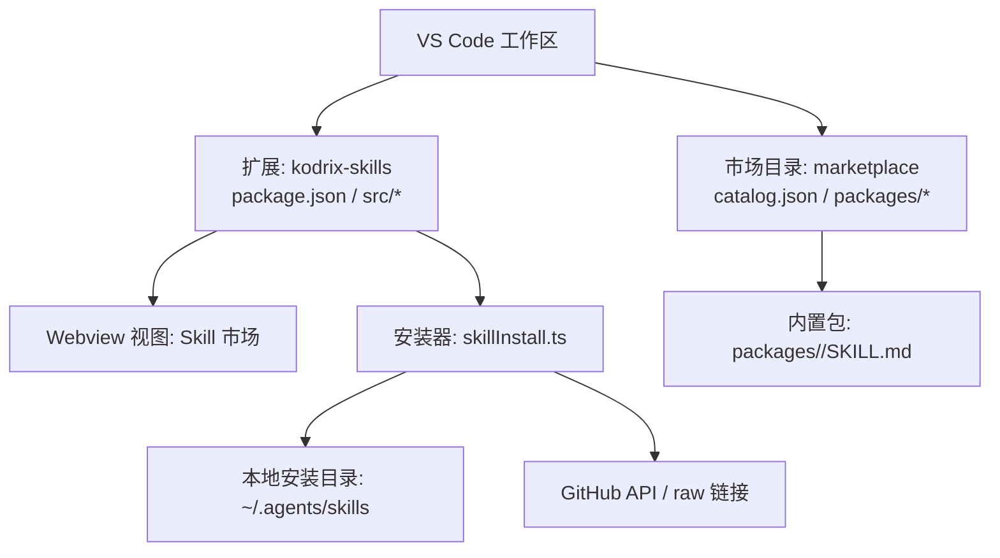
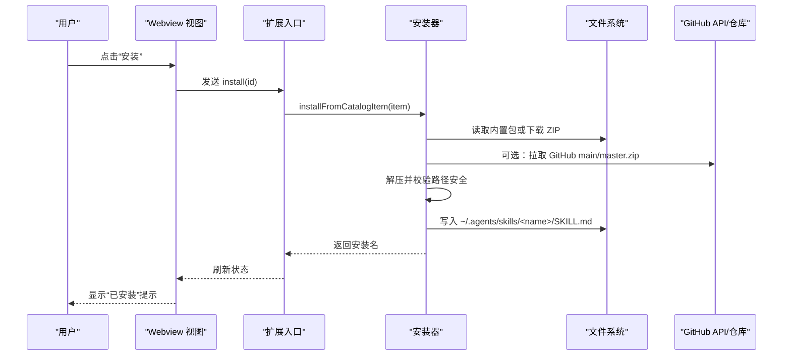
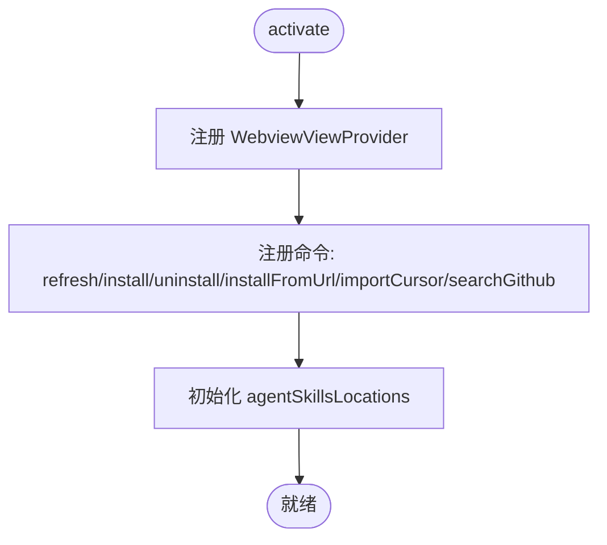
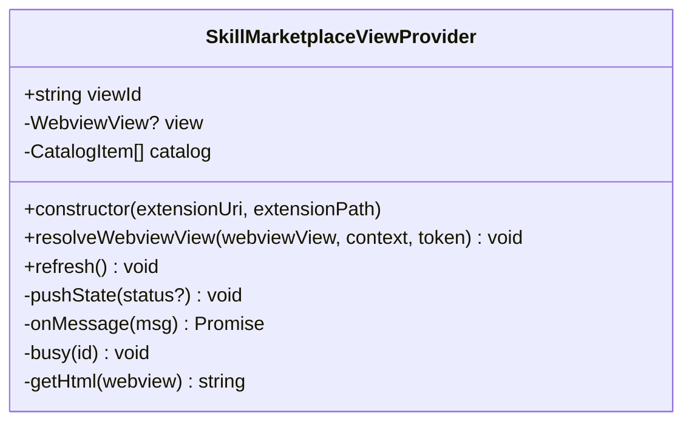
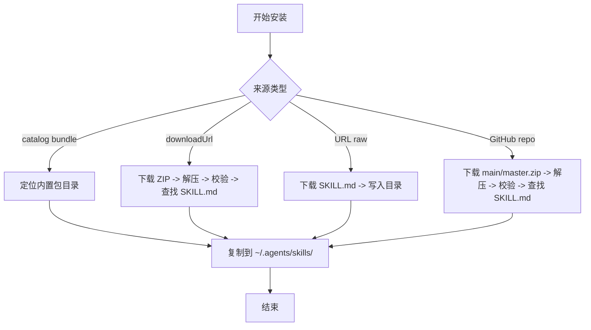
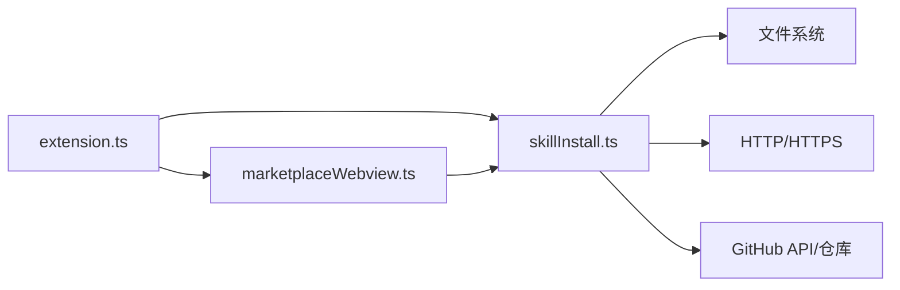

# Skill 市场

<cite>
**本文引用的文件**
- [extensions/kodrix-skills/package.json](file://extensions/kodrix-skills/package.json)
- [extensions/kodrix-skills/src/extension.ts](file://extensions/kodrix-skills/src/extension.ts)
- [extensions/kodrix-skills/src/marketplaceWebview.ts](file://extensions/kodrix-skills/src/marketplaceWebview.ts)
- [extensions/kodrix-skills/src/skillInstall.ts](file://extensions/kodrix-skills/src/skillInstall.ts)
- [marketplace/catalog.json](file://marketplace/catalog.json)
- [marketplace/packages/code-review/SKILL.md](file://marketplace/packages/code-review/SKILL.md)
</cite>

## 目录
1. [简介](#简介)
2. [项目结构](#项目结构)
3. [核心组件](#核心组件)
4. [架构总览](#架构总览)
5. [详细组件分析](#详细组件分析)
6. [依赖关系分析](#依赖关系分析)
7. [性能考虑](#性能考虑)
8. [故障排查指南](#故障排查指南)
9. [结论](#结论)
10. [附录](#附录)

## 简介
本文件为 Kodrix 的 Skill 市场完整参考文档，面向技能包开发者与终端用户。内容涵盖：
- 技能包生态与架构设计：以 SKILL.md 为核心的轻量技能包模型、内置目录与远程来源的统一管理。
- 分类体系与市场浏览：基于 catalog.json 的元数据展示、搜索与安装入口。
- 安装机制：从内置包、GitHub 仓库、raw URL 等多种来源安全安装；支持导入 Cursor Skills。
- 开发规范：SKILL.md 约定、版本管理与发布流程建议。
- 内置技能包介绍与使用示例：代码审查、提交信息生成、重构助手等。
- 安全与权限：下载限制、重定向白名单、路径穿越防护、命令注入防护。
- 自定义技能包开发：环境准备、调试方法、打包与发布最佳实践。

## 项目结构
Skill 市场由 VS Code 扩展提供，核心位于 extensions/kodrix-skills，市场目录与内置资源位于 marketplace。

图表来源
- [extensions/kodrix-skills/package.json:19-122](file://extensions/kodrix-skills/package.json#L19-L122)
- [extensions/kodrix-skills/src/extension.ts:62-152](file://extensions/kodrix-skills/src/extension.ts#L62-L152)
- [extensions/kodrix-skills/src/marketplaceWebview.ts:30-68](file://extensions/kodrix-skills/src/marketplaceWebview.ts#L30-L68)
- [extensions/kodrix-skills/src/skillInstall.ts:103-128](file://extensions/kodrix-skills/src/skillInstall.ts#L103-L128)
- [marketplace/catalog.json:1-125](file://marketplace/catalog.json#L1-L125)

章节来源
- [extensions/kodrix-skills/package.json:1-135](file://extensions/kodrix-skills/package.json#L1-L135)
- [extensions/kodrix-skills/src/extension.ts:1-155](file://extensions/kodrix-skills/src/extension.ts#L1-L155)
- [extensions/kodrix-skills/src/marketplaceWebview.ts:1-170](file://extensions/kodrix-skills/src/marketplaceWebview.ts#L1-L170)
- [extensions/kodrix-skills/src/skillInstall.ts:1-458](file://extensions/kodrix-skills/src/skillInstall.ts#L1-L458)
- [marketplace/catalog.json:1-125](file://marketplace/catalog.json#L1-L125)

## 核心组件
- 扩展入口与命令注册：负责激活 Webview、注册刷新/安装/卸载/URL 安装/导入 Cursor Skills/GitHub 搜索等命令。
- 市场 Webview 提供者：渲染卡片列表、处理安装/卸载/搜索/打开外部链接等消息，维护已安装状态。
- 安装器模块：统一解析 catalog、下载并解压 ZIP、校验路径安全、写入本地技能目录、列出已安装技能、搜索 GitHub 仓库。
- 市场目录（catalog.json）：定义内置技能的元数据（id、名称、描述、类别、标签、图标、bundle/installName 等）。
- 技能包（SKILL.md）：每个技能包的说明与输出格式约定，被 Agent 消费。

章节来源
- [extensions/kodrix-skills/src/extension.ts:16-152](file://extensions/kodrix-skills/src/extension.ts#L16-L152)
- [extensions/kodrix-skills/src/marketplaceWebview.ts:19-149](file://extensions/kodrix-skills/src/marketplaceWebview.ts#L19-L149)
- [extensions/kodrix-skills/src/skillInstall.ts:79-128](file://extensions/kodrix-skills/src/skillInstall.ts#L79-L128)
- [marketplace/catalog.json:1-125](file://marketplace/catalog.json#L1-L125)
- [marketplace/packages/code-review/SKILL.md:1-13](file://marketplace/packages/code-review/SKILL.md#L1-L13)

## 架构总览
Skill 市场采用“扩展 + Webview + 安装器”的分层架构：
- 扩展层：注册命令、生命周期、配置项，协调 Webview 与安装器。
- 界面层：Webview 渲染市场卡片、交互事件、状态同步。
- 服务层：安装器负责目录解析、网络请求、ZIP 解压、安全校验、本地落盘。
- 数据层：catalog.json 作为市场清单；~/.agents/skills 为本地安装根目录；SKILL.md 为技能契约。

图表来源
- [extensions/kodrix-skills/src/extension.ts:86-107](file://extensions/kodrix-skills/src/extension.ts#L86-L107)
- [extensions/kodrix-skills/src/marketplaceWebview.ts:77-86](file://extensions/kodrix-skills/src/marketplaceWebview.ts#L77-L86)
- [extensions/kodrix-skills/src/skillInstall.ts:197-229](file://extensions/kodrix-skills/src/skillInstall.ts#L197-L229)
- [extensions/kodrix-skills/src/skillInstall.ts:254-296](file://extensions/kodrix-skills/src/skillInstall.ts#L254-L296)

## 详细组件分析

### 扩展入口与命令（extension.ts）
- 激活时注册 WebviewViewProvider 与多个命令：刷新、打开市场、安装、卸载、从 URL 安装、导入 Cursor Skills、打开 GitHub 搜索。
- 自动初始化 chat 配置中的 agentSkillsLocations，确保默认技能目录与 Cursor 兼容目录可见。
- 通过 withProgress 提供安装进度反馈，并在完成后刷新市场视图。

图表来源
- [extensions/kodrix-skills/src/extension.ts:62-152](file://extensions/kodrix-skills/src/extension.ts#L62-L152)

章节来源
- [extensions/kodrix-skills/src/extension.ts:1-155](file://extensions/kodrix-skills/src/extension.ts#L1-L155)

### 市场 Webview（marketplaceWebview.ts）
- 提供 viewId 与 HTML 模板加载，启用脚本与本地资源根。
- 维护 catalog 与已安装列表，向 Webview 推送 state。
- 处理来自前端的消息：ready/refresh/install/uninstall/installGithub/installFromUrl/importCursor/searchGithub/open。
- 错误处理：捕获异常并通过 status/error 消息回传，同时弹出错误提示。

图表来源
- [extensions/kodrix-skills/src/marketplaceWebview.ts:30-169](file://extensions/kodrix-skills/src/marketplaceWebview.ts#L30-L169)

章节来源
- [extensions/kodrix-skills/src/marketplaceWebview.ts:1-170](file://extensions/kodrix-skills/src/marketplaceWebview.ts#L1-L170)

### 安装器（skillInstall.ts）
- 目录与清单：
  - resolveSkillsDir：解析配置的安装目录（支持 ~ 展开）。
  - listInstalledSkills：扫描已安装技能（要求存在 SKILL.md）。
  - loadCatalog：优先从扩展 resources 或 marketplace 目录加载 catalog.json。
- 安装来源：
  - installFromCatalogItem：优先使用 bundle 内置包，其次 downloadUrl ZIP。
  - installFromUrl：支持 raw SKILL.md 直链与 GitHub 仓库（main/master.zip）。
  - importCursorSkills：复制 ~/.cursor/skills 下含 SKILL.md 的技能。
- 安全加固：
  - sanitizeSkillName：仅允许安全字符集，长度限制。
  - validateNoPathTraversal：解压后遍历校验，防止 Zip Slip 攻击。
  - extractZip：使用平台原生工具并以参数数组调用，避免 shell 拼接。
  - fetchText/downloadFile：限制重定向次数与域名白名单、文件大小上限、超时控制。
  - findSkillRoot：限制最大递归深度，防止 zip 炸弹。

图表来源
- [extensions/kodrix-skills/src/skillInstall.ts:167-229](file://extensions/kodrix-skills/src/skillInstall.ts#L167-L229)
- [extensions/kodrix-skills/src/skillInstall.ts:254-296](file://extensions/kodrix-skills/src/skillInstall.ts#L254-L296)
- [extensions/kodrix-skills/src/skillInstall.ts:298-316](file://extensions/kodrix-skills/src/skillInstall.ts#L298-L316)
- [extensions/kodrix-skills/src/skillInstall.ts:330-436](file://extensions/kodrix-skills/src/skillInstall.ts#L330-L436)

章节来源
- [extensions/kodrix-skills/src/skillInstall.ts:1-458](file://extensions/kodrix-skills/src/skillInstall.ts#L1-L458)

### 市场目录与分类（catalog.json）
- 字段说明：
  - id：唯一标识，用于安装与去重。
  - kind：技能类型（skill/extension），便于 UI 区分。
  - displayName/description：展示名称与描述。
  - version/publisher：版本与发布者。
  - categories/tags：分类与标签，用于筛选与搜索。
  - bundle/installName：内置包目录名与安装后的文件夹名。
  - icon：图标键名。
  - downloadUrl：可选的 ZIP 下载地址。
- 用途：驱动 Webview 渲染卡片、过滤与搜索、触发安装流程。

章节来源
- [marketplace/catalog.json:1-125](file://marketplace/catalog.json#L1-L125)

### 技能包契约（SKILL.md）
- 位置：每个技能包根目录必须包含 SKILL.md。
- 作用：向 Agent 描述技能用途、输入上下文与输出格式约定。
- 示例：代码审查技能定义了摘要、关键问题、建议、优点的结构化输出。

章节来源
- [marketplace/packages/code-review/SKILL.md:1-13](file://marketplace/packages/code-review/SKILL.md#L1-L13)

## 依赖关系分析
- 扩展依赖：
  - vscode API：WebviewViewProvider、commands、window、workspace、env。
  - Node.js 标准库：fs、path、os、http/https、child_process、stream/promises。
  - 第三方依赖：@parcel/watcher（监听文件变化，未在当前片段直接调用）。
- 外部依赖：
  - GitHub API：搜索仓库、获取 ZIP。
  - 文件系统：~/.agents/skills 与 ~/.cursor/skills。
- 耦合与内聚：
  - extension.ts 低耦合，仅负责命令与生命周期。
  - marketplaceWebview.ts 专注 UI 消息与状态同步。
  - skillInstall.ts 高内聚，封装所有安装与安全逻辑。

图表来源
- [extensions/kodrix-skills/src/extension.ts:6-14](file://extensions/kodrix-skills/src/extension.ts#L6-L14)
- [extensions/kodrix-skills/src/marketplaceWebview.ts:8-17](file://extensions/kodrix-skills/src/marketplaceWebview.ts#L8-L17)
- [extensions/kodrix-skills/src/skillInstall.ts:6-14](file://extensions/kodrix-skills/src/skillInstall.ts#L6-L14)

章节来源
- [extensions/kodrix-skills/package.json:131-133](file://extensions/kodrix-skills/package.json#L131-L133)
- [extensions/kodrix-skills/src/extension.ts:1-155](file://extensions/kodrix-skills/src/extension.ts#L1-L155)
- [extensions/kodrix-skills/src/marketplaceWebview.ts:1-170](file://extensions/kodrix-skills/src/marketplaceWebview.ts#L1-L170)
- [extensions/kodrix-skills/src/skillInstall.ts:1-458](file://extensions/kodrix-skills/src/skillInstall.ts#L1-L458)

## 性能考虑
- 网络请求：
  - 设置超时与重定向上限，避免长时间阻塞。
  - 对文本与二进制分别设置大小上限，防止内存占用过高。
- 文件操作：
  - 解压后校验路径，限制递归深度，避免 zip 炸弹。
  - 使用平台原生解压工具并以参数数组调用，减少开销与风险。
- UI 交互：
  - Webview 延迟加载与保留上下文，减少重复渲染。
  - 安装过程使用进度通知，提升用户体验。

[本节为通用指导，不直接分析具体文件]

## 故障排查指南
- 安装失败：
  - 检查 catalog.json 中 bundle 是否存在、downloadUrl 是否可达。
  - 确认 GitHub 仓库地址可解析，main/master.zip 可下载。
  - 查看输出通道日志（Kodrix Skills）获取详细错误信息。
- 网络错误：
  - 重定向到不受信任域将被拒绝，请检查 URL 是否在白名单。
  - 下载过大或超时会被中断，请检查文件大小与网络状况。
- 路径错误：
  - 非法技能名称会被拒绝，请确保名称符合安全字符集与长度限制。
  - 解压后路径穿越检测失败会删除临时目录并抛出错误。
- 导入 Cursor Skills：
  - 若未找到 ~/.cursor/skills，将返回 0 个导入结果。

章节来源
- [extensions/kodrix-skills/src/skillInstall.ts:26-53](file://extensions/kodrix-skills/src/skillInstall.ts#L26-L53)
- [extensions/kodrix-skills/src/skillInstall.ts:131-165](file://extensions/kodrix-skills/src/skillInstall.ts#L131-L165)
- [extensions/kodrix-skills/src/skillInstall.ts:234-252](file://extensions/kodrix-skills/src/skillInstall.ts#L234-L252)
- [extensions/kodrix-skills/src/skillInstall.ts:330-436](file://extensions/kodrix-skills/src/skillInstall.ts#L330-L436)
- [extensions/kodrix-skills/src/marketplaceWebview.ts:143-148](file://extensions/kodrix-skills/src/marketplaceWebview.ts#L143-L148)

## 结论
Kodrix Skill 市场以轻量 SKILL.md 为核心，结合 catalog.json 与多来源安装能力，提供了开箱即用的技能生态。扩展层职责清晰，Webview 交互友好，安装器具备完善的安全与健壮性保障。开发者可据此快速构建与发布技能，用户可便捷地浏览、搜索与安装所需技能。

[本节为总结，不直接分析具体文件]

## 附录

### 内置技能包一览与使用示例
- 代码审查助手：按专业标准审查代码质量、安全与可维护性，输出结构化报告。
- Commit 消息生成：根据 git diff 生成规范的 Conventional Commits 提交信息。
- Python 专家：Python 最佳实践、类型提示与性能优化技能。
- 重构助手：识别坏味道并提供小步重构方案与完整代码。
- CodeGeeX 智能编程：代码补全、翻译与提示模式参考。
- UI/UX 设计顾问：前端界面设计审查、配色与布局建议。
- Browser Agent：浏览器验证、预览与回归测试。
- 一键部署：Vercel/Netlify/GitHub Pages 一键部署。
- Idea Engineer：从一句话想法到完整可运行产品。

使用方式：
- 在 Skill 市场中选择对应卡片，点击“安装”。
- 或通过命令面板执行“安装 Skill”，选择目标项。
- 安装完成后，可在 ~/.agents/skills/<name> 查看 SKILL.md。

章节来源
- [marketplace/catalog.json:5-123](file://marketplace/catalog.json#L5-L123)
- [extensions/kodrix-skills/src/extension.ts:86-107](file://extensions/kodrix-skills/src/extension.ts#L86-L107)

### 从多种来源安装技能包
- 从内置目录安装：通过 catalog.json 的 bundle 字段指向内置包。
- 从 GitHub 安装：支持仓库 URL，自动拉取 main/master.zip。
- 从 raw URL 安装：直接粘贴 SKILL.md 的原始链接。
- 导入 Cursor Skills：自动扫描 ~/.cursor/skills 并复制含 SKILL.md 的技能。

章节来源
- [extensions/kodrix-skills/src/skillInstall.ts:197-229](file://extensions/kodrix-skills/src/skillInstall.ts#L197-L229)
- [extensions/kodrix-skills/src/skillInstall.ts:254-296](file://extensions/kodrix-skills/src/skillInstall.ts#L254-L296)
- [extensions/kodrix-skills/src/skillInstall.ts:298-316](file://extensions/kodrix-skills/src/skillInstall.ts#L298-L316)

### 自定义技能包开发指南
- 开发环境搭建：
  - 创建目录 ~/.agents/skills/<your-skill>。
  - 在该目录下编写 SKILL.md，明确输入上下文与输出格式。
  - 如需额外资源，可放置在同级目录，Agent 可通过相对路径访问。
- 调试方法：
  - 使用 Skill 市场“刷新”功能重新加载 catalog。
  - 通过命令面板执行“从 URL / GitHub 安装 Skill”进行快速迭代。
  - 观察输出通道日志与安装提示信息定位问题。
- 发布流程建议：
  - 将技能包推送到 GitHub 仓库，确保包含 SKILL.md。
  - 更新 catalog.json，添加 id、displayName、description、categories、tags、bundle/installName 等元数据。
  - 通过 Skill 市场“安装”按钮或命令进行安装验证。

章节来源
- [extensions/kodrix-skills/src/skillInstall.ts:103-128](file://extensions/kodrix-skills/src/skillInstall.ts#L103-L128)
- [extensions/kodrix-skills/src/skillInstall.ts:438-458](file://extensions/kodrix-skills/src/skillInstall.ts#L438-L458)
- [marketplace/catalog.json:1-125](file://marketplace/catalog.json#L1-L125)

### 安全考虑与权限管理
- 名称与路径安全：
  - 仅允许安全字符集与长度限制，防止恶意目录名。
  - 解压后遍历校验，阻断路径穿越攻击。
- 网络与下载安全：
  - 限制重定向次数与域名白名单，阻止未知域跳转。
  - 设置文本与二进制下载大小上限与超时时间。
- 命令执行安全：
  - 使用平台原生工具并以参数数组调用，避免 shell 拼接导致的命令注入。
- 权限边界：
  - 安装目录固定为 ~/.agents/skills，避免随意写入系统目录。
  - 仅复制或写入受控目录，保持最小权限原则。

章节来源
- [extensions/kodrix-skills/src/skillInstall.ts:23-53](file://extensions/kodrix-skills/src/skillInstall.ts#L23-L53)
- [extensions/kodrix-skills/src/skillInstall.ts:330-436](file://extensions/kodrix-skills/src/skillInstall.ts#L330-L436)