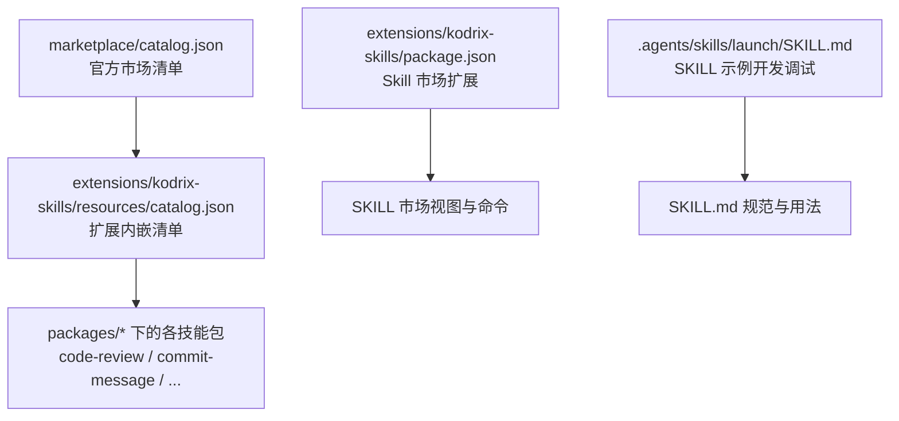
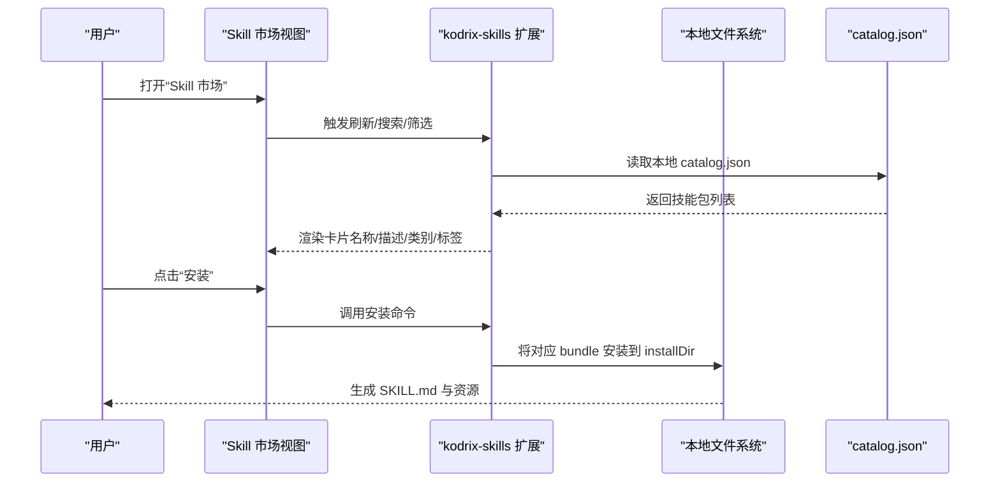
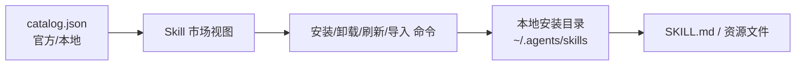

# 内置技能包介绍

<cite>
**本文引用的文件**   
- [marketplace/catalog.json](file://marketplace/catalog.json)
- [extensions/kodrix-skills/resources/catalog.json](file://extensions/kodrix-skills/resources/catalog.json)
- [extensions/kodrix-skills/package.json](file://extensions/kodrix-skills/package.json)
- [.agents/skills/launch/SKILL.md](file://.agents/skills/launch/SKILL.md)
</cite>

## 目录
1. [引言](#引言)
2. [项目结构](#项目结构)
3. [核心组件](#核心组件)
4. [架构总览](#架构总览)
5. [详细组件分析](#详细组件分析)
6. [依赖关系分析](#依赖关系分析)
7. [性能与使用建议](#性能与使用建议)
8. [故障排查指南](#故障排查指南)
9. [结论](#结论)

## 引言
本文件面向希望快速了解并使用 Kodrix 内置技能包的用户，基于 marketplace/catalog.json 与 extensions/kodrix-skills/resources/catalog.json 的官方定义，逐一说明每个内置技能包的功能特性、适用场景与配置要点。文档同时解释技能包的分类体系与标签系统，帮助用户按“类别 + 标签”快速定位所需工具。

需要特别说明的是：当前仓库未提供各技能包的截图与运行演示视频；本文以结构化说明为主，并在“详细组件分析”中给出可操作的安装与使用路径指引。

## 项目结构
Kodrix 的技能市场由两部分构成：
- 顶层 marketplace/catalog.json：对外发布的官方市场清单。
- extensions/kodrix-skills/resources/catalog.json：扩展内嵌的本地清单，与顶层清单保持同步。
- extensions/kodrix-skills/package.json：Skill 市场扩展的入口与配置，包含视图、命令、菜单与用户配置项。
- .agents/skills/launch/SKILL.md：用于在开发环境中启动并调试 Code OSS 的 Skill 示例，体现 SKILL.md 的使用方式。

图示来源
- [marketplace/catalog.json:1-125](file://marketplace/catalog.json#L1-L125)
- [extensions/kodrix-skills/resources/catalog.json:1-125](file://extensions/kodrix-skills/resources/catalog.json#L1-L125)
- [extensions/kodrix-skills/package.json:1-135](file://extensions/kodrix-skills/package.json#L1-L135)
- [.agents/skills/launch/SKILL.md:1-339](file://.agents/skills/launch/SKILL.md#L1-L339)

章节来源
- [marketplace/catalog.json:1-125](file://marketplace/catalog.json#L1-L125)
- [extensions/kodrix-skills/resources/catalog.json:1-125](file://extensions/kodrix-skills/resources/catalog.json#L1-L125)
- [extensions/kodrix-skills/package.json:1-135](file://extensions/kodrix-skills/package.json#L1-L135)

## 核心组件
- 官方市场清单：定义所有内置技能包的元数据，包括 id、kind、displayName、description、categories、tags、bundle、installName、icon 等字段。
- 扩展内嵌清单：与官方市场清单保持一致，便于离线或本地环境展示。
- Skill 市场扩展：提供“Skill 市场”侧边栏视图、刷新/安装/卸载/从 URL 安装/导入 Cursor Skills/打开 GitHub 市场等命令，以及用户配置项（安装目录、远程注册表 URL）。
- SKILL 示例：通过 .agents/skills/launch/SKILL.md 展示 SKILL.md 的结构与用法，帮助理解技能包的组织形式。

章节来源
- [extensions/kodrix-skills/package.json:1-135](file://extensions/kodrix-skills/package.json#L1-L135)
- [.agents/skills/launch/SKILL.md:1-339](file://.agents/skills/launch/SKILL.md#L1-L339)

## 架构总览
下图展示了“清单 → 扩展 UI → 用户操作 → 本地安装目录”的整体流程。

图示来源
- [extensions/kodrix-skills/package.json:105-122](file://extensions/kodrix-skills/package.json#L105-L122)
- [extensions/kodrix-skills/resources/catalog.json:1-125](file://extensions/kodrix-skills/resources/catalog.json#L1-L125)

## 详细组件分析
以下按 catalog.json 中的顺序，逐一介绍内置技能包。每个技能包均包含功能特性、使用场景、配置要点与安装路径提示。

### 代码审查助手
- 标识与类型：id=kodrix.code-review，kind=skill
- 显示名：代码审查助手
- 功能特性：按专业标准审查代码质量、安全与可维护性，输出结构化审查报告。
- 使用场景：PR 合并前、提交前、重构后回归检查。
- 分类与标签：categories=["AI","Programming"]，tags=["review","quality"]
- 安装信息：bundle=code-review，installName=code-review，icon=search
- 配置要点：安装目录由 kodrix.skills.installDir 控制；如需远程源，可在 registryUrls 中添加。
- 安装与使用：在“Skill 市场”中搜索“代码审查助手”，点击安装；完成后在工作区中触发相应命令或对话即可生成审查报告。

章节来源
- [extensions/kodrix-skills/resources/catalog.json:6-18](file://extensions/kodrix-skills/resources/catalog.json#L6-L18)
- [extensions/kodrix-skills/package.json:105-122](file://extensions/kodrix-skills/package.json#L105-L122)

### Commit 消息生成
- 标识与类型：id=kodrix.commit-message，kind=skill
- 显示名：Commit 消息生成
- 功能特性：根据 git diff 生成规范、简洁的 Conventional Commits 提交信息。
- 使用场景：日常开发提交、自动化流水线生成提交说明。
- 分类与标签：categories=["AI","Git"]，tags=["git","commit"]
- 安装信息：bundle=commit-message，installName=commit-message，icon=git-commit
- 配置要点：确保工作区为 Git 仓库；安装后可结合命令面板或快捷键触发。
- 安装与使用：在“Skill 市场”中搜索“Commit 消息生成”，安装后对变更执行生成操作。

章节来源
- [extensions/kodrix-skills/resources/catalog.json:19-31](file://extensions/kodrix-skills/resources/catalog.json#L19-L31)
- [extensions/kodrix-skills/package.json:105-122](file://extensions/kodrix-skills/package.json#L105-L122)

### Python 专家
- 标识与类型：id=kodrix.python-expert，kind=extension
- 显示名：Python 专家
- 功能特性：VS Code 风格扩展包，提供 Python 最佳实践、类型提示与性能优化 Skill。
- 使用场景：Python 项目开发、代码规范与性能调优。
- 分类与标签：categories=["Programming Languages","AI"]，tags=["python"]
- 安装信息：bundle=python-expert，installName=python-expert，icon=code
- 配置要点：作为 extension 类型的技能包，安装后会加载对应能力；可按需启用相关规则。
- 安装与使用：在“Skill 市场”中搜索“Python 专家”，安装后在 Python 文件中获得增强体验。

章节来源
- [extensions/kodrix-skills/resources/catalog.json:32-44](file://extensions/kodrix-skills/resources/catalog.json#L32-L44)
- [extensions/kodrix-skills/package.json:105-122](file://extensions/kodrix-skills/package.json#L105-L122)

### 重构助手
- 标识与类型：id=kodrix.refactor-helper，kind=skill
- 显示名：重构助手
- 功能特性：识别代码坏味道，给出小步重构方案与重构后完整代码。
- 使用场景：遗留代码治理、模块拆分、函数精简。
- 分类与标签：categories=["AI","Programming"]，tags=["refactor"]
- 安装信息：bundle=refactor-helper，installName=refactor-helper，icon=tools
- 配置要点：建议在目标文件/函数上触发，以获得更精准的重构建议。
- 安装与使用：在“Skill 市场”中搜索“重构助手”，安装后选择代码范围执行重构。

章节来源
- [extensions/kodrix-skills/resources/catalog.json:45-57](file://extensions/kodrix-skills/resources/catalog.json#L45-L57)
- [extensions/kodrix-skills/package.json:105-122](file://extensions/kodrix-skills/package.json#L105-L122)

### CodeGeeX 智能编程
- 标识与类型：id=kodrix.codegeex，kind=skill
- 显示名：CodeGeeX 智能编程
- 功能特性：THUDM CodeGeeX 代码补全、翻译与提示模式参考 Skill。
- 使用场景：多语言编码辅助、代码片段翻译、提示工程参考。
- 分类与标签：categories=["AI","Programming"]，tags=["codegeex","completion","translation"]
- 安装信息：bundle=codegeex，installName=codegeex，icon=beaker
- 配置要点：按需开启补全/翻译/提示模式；结合编辑器上下文可获得更好效果。
- 安装与使用：在“Skill 市场”中搜索“CodeGeeX 智能编程”，安装后在编辑过程中获得智能辅助。

章节来源
- [extensions/kodrix-skills/resources/catalog.json:58-70](file://extensions/kodrix-skills/resources/catalog.json#L58-L70)
- [extensions/kodrix-skills/package.json:105-122](file://extensions/kodrix-skills/package.json#L105-L122)

### UI/UX 设计顾问
- 标识与类型：id=kodrix.ui-ux-pro，kind=extension
- 显示名：UI/UX 设计顾问
- 功能特性：前端界面设计审查、配色与布局建议，适合优化 Web 界面。
- 使用场景：Web 前端页面评审、样式规范检查、交互体验优化。
- 分类与标签：categories=["Design","AI"]，tags=["ui","css"]
- 安装信息：bundle=ui-ux-pro，installName=ui-ux-pro，icon=paintcan
- 配置要点：作为 extension 类型，安装后加载设计审查能力；可配合 CSS/HTML 文件使用。
- 安装与使用：在“Skill 市场”中搜索“UI/UX 设计顾问”，安装后对前端文件进行设计与样式审查。

章节来源
- [extensions/kodrix-skills/resources/catalog.json:71-83](file://extensions/kodrix-skills/resources/catalog.json#L71-L83)
- [extensions/kodrix-skills/package.json:105-122](file://extensions/kodrix-skills/package.json#L105-L122)

### Browser Agent
- 标识与类型：id=kodrix.browser-agent，kind=skill
- 显示名：Browser Agent
- 功能特性：Qoder/Trae 风格浏览器验证：Simple Browser 预览、UI 回归、Playwright MCP。
- 使用场景：前端 UI 回归测试、端到端验证、自动化浏览器交互。
- 分类与标签：categories=["AI","Testing"]，tags=["browser","preview","e2e"]
- 安装信息：bundle=browser-agent，installName=browser-agent，icon=browser
- 配置要点：确保 Simple Browser 可用；如需 Playwright 集成，请准备相应环境与权限。
- 安装与使用：在“Skill 市场”中搜索“Browser Agent”，安装后通过预览或测试脚本驱动浏览器。

章节来源
- [extensions/kodrix-skills/resources/catalog.json:84-96](file://extensions/kodrix-skills/resources/catalog.json#L84-L96)
- [extensions/kodrix-skills/package.json:105-122](file://extensions/kodrix-skills/package.json#L105-L122)

### 一键部署
- 标识与类型：id=kodrix.one-click-deploy，kind=skill
- 显示名：一键部署
- 功能特性：Trae 风格一键部署：Vercel / Netlify / GitHub Pages。
- 使用场景：静态站点与前端应用快速上线、CI/CD 集成。
- 分类与标签：categories=["AI","DevOps"]，tags=["deploy","vercel","netlify"]
- 安装信息：bundle=one-click-deploy，installName=one-click-deploy，icon=rocket
- 配置要点：提前完成平台账号绑定与令牌配置；按平台要求准备构建产物。
- 安装与使用：在“Skill 市场”中搜索“一键部署”，安装后选择目标平台执行部署。

章节来源
- [extensions/kodrix-skills/resources/catalog.json:97-109](file://extensions/kodrix-skills/resources/catalog.json#L97-L109)
- [extensions/kodrix-skills/package.json:105-122](file://extensions/kodrix-skills/package.json#L105-L122)

### Idea Engineer — 想法→产品
- 标识与类型：id=kodrix.idea-engineer，kind=skill
- 显示名：Idea Engineer — 想法→产品
- 功能特性：从一句话想法到完整可运行产品。全自动需求分析、架构设计、任务分解、多 Agent 开发和部署预览。
- 使用场景：创意落地、原型快速构建、跨角色协作开发。
- 分类与标签：categories=["AI","Productivity"]，tags=["idea","product","generation"]
- 安装信息：bundle=idea-engineer，installName=idea-engineer，icon=lightbulb
- 配置要点：建议先明确业务目标与约束条件；后续步骤可由 Agent 自动推进。
- 安装与使用：在“Skill 市场”中搜索“Idea Engineer”，安装后输入想法描述，跟随引导完成产品化流程。

章节来源
- [extensions/kodrix-skills/resources/catalog.json:110-122](file://extensions/kodrix-skills/resources/catalog.json#L110-L122)
- [extensions/kodrix-skills/package.json:105-122](file://extensions/kodrix-skills/package.json#L105-L122)

## 依赖关系分析
- 清单依赖：marketplace/catalog.json 与 extensions/kodrix-skills/resources/catalog.json 内容一致，保证本地与云端展示统一。
- 扩展依赖：kodrix-skills 扩展通过 package.json 暴露视图、命令与配置项，负责加载 catalog.json 并驱动安装流程。
- 外部依赖：部分技能包可能依赖外部工具（如 Playwright、平台 CLI），在安装与使用前需满足其前置条件。

图示来源
- [extensions/kodrix-skills/resources/catalog.json:1-125](file://extensions/kodrix-skills/resources/catalog.json#L1-L125)
- [extensions/kodrix-skills/package.json:105-122](file://extensions/kodrix-skills/package.json#L105-L122)

章节来源
- [extensions/kodrix-skills/resources/catalog.json:1-125](file://extensions/kodrix-skills/resources/catalog.json#L1-L125)
- [extensions/kodrix-skills/package.json:105-122](file://extensions/kodrix-skills/package.json#L105-L122)

## 性能与使用建议
- 安装目录管理：合理设置 kodrix.skills.installDir，避免磁盘空间不足导致安装失败。
- 远程注册表：仅在必要时添加 registryUrls，减少网络请求开销。
- 按需启用：仅安装常用技能包，降低扩展体积与内存占用。
- 浏览器与测试类技能：在使用 Browser Agent 等涉及浏览器实例的技能时，注意关闭多余窗口与进程，避免资源竞争。

[本节为通用建议，不直接分析具体文件]

## 故障排查指南
- 无法安装或安装目录不可写：检查 kodrix.skills.installDir 权限与路径有效性。
- 远程注册表不可达：校验 registryUrls 的网络连通性与鉴权配置。
- 浏览器相关技能异常：确认 Simple Browser 可用；若使用 Playwright，检查环境变量与依赖是否就绪。
- 安装后未生效：尝试刷新“Skill 市场”，或重启 VS Code 以重新加载扩展。

章节来源
- [extensions/kodrix-skills/package.json:105-122](file://extensions/kodrix-skills/package.json#L105-L122)

## 结论
Kodrix 内置技能包围绕“代码质量、开发效率、前端体验、测试与部署、产品化”等关键场景提供标准化能力。通过统一的 catalog.json 与 Skill 市场扩展，用户可以快速发现、安装与管理技能包。建议结合项目的实际技术栈与团队规范，选择合适的技能组合，逐步提升研发效能与交付质量。

[本节为总结性内容，不直接分析具体文件]