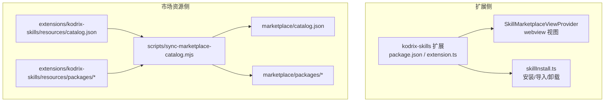
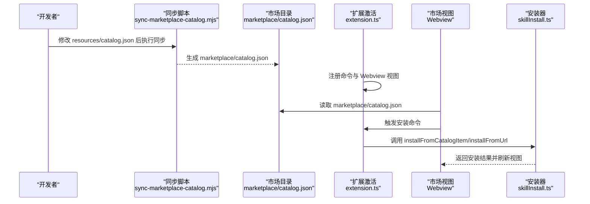
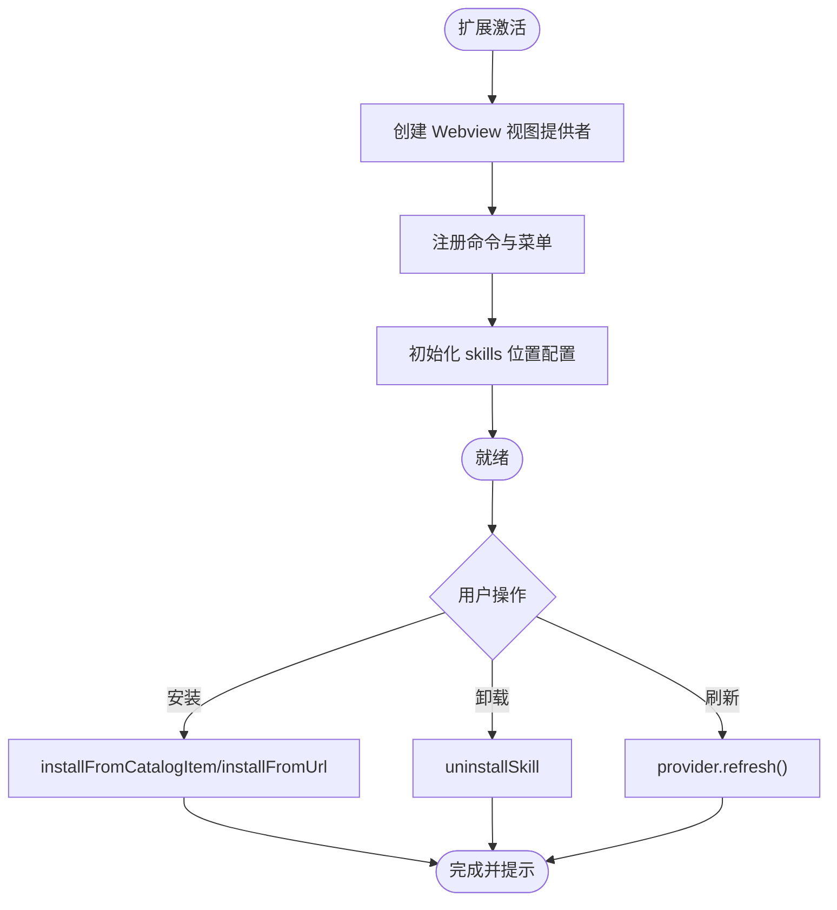
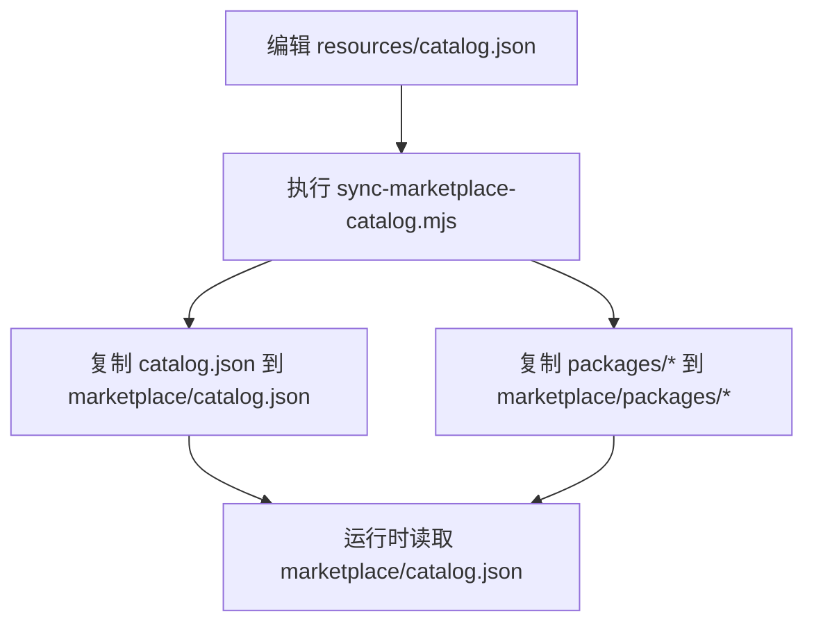
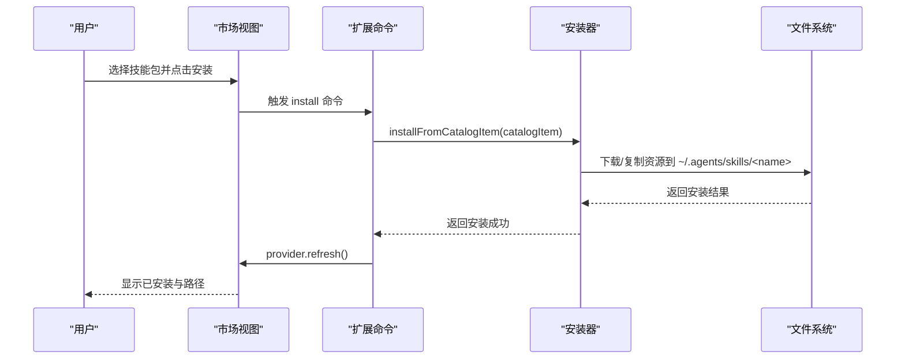
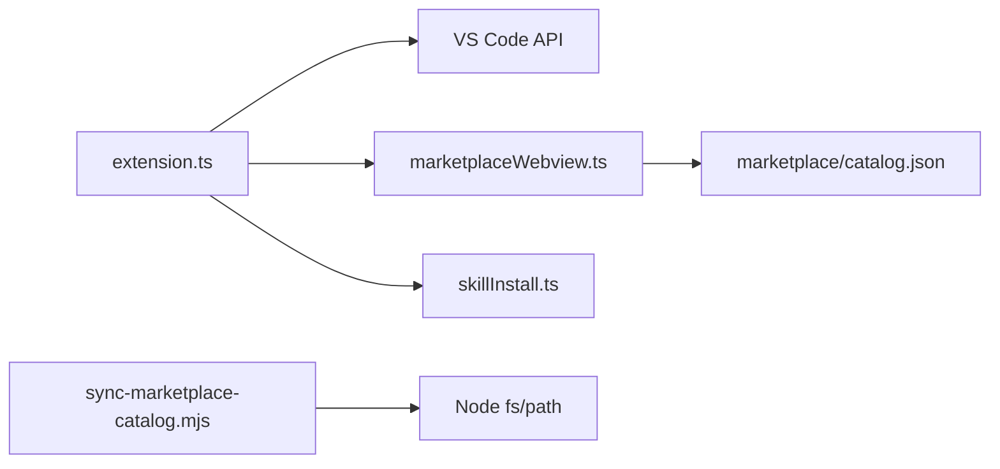

# 市场概览与架构

<cite>
**本文引用的文件**
- [extensions/kodrix-skills/src/extension.ts](file://extensions/kodrix-skills/src/extension.ts)
- [extensions/kodrix-skills/package.json](file://extensions/kodrix-skills/package.json)
- [extensions/kodrix-skills/resources/catalog.json](file://extensions/kodrix-skills/resources/catalog.json)
- [marketplace/catalog.json](file://marketplace/catalog.json)
- [scripts/sync-marketplace-catalog.mjs](file://scripts/sync-marketplace-catalog.mjs)
- [.agents/skills/launch/SKILL.md](file://.agents/skills/launch/SKILL.md)
</cite>

## 目录
1. [简介](#简介)
2. [项目结构](#项目结构)
3. [核心组件](#核心组件)
4. [架构总览](#架构总览)
5. [详细组件分析](#详细组件分析)
6. [依赖关系分析](#依赖关系分析)
7. [性能考虑](#性能考虑)
8. [故障排查指南](#故障排查指南)
9. [结论](#结论)
10. [附录](#附录)

## 简介
本文件面向开发者，系统性阐述 Kodrix 技能包生态的市场概览与架构。内容涵盖：
- 技能包生态的核心概念与设计理念
- 市场目录结构与分类体系
- 版本管理机制
- 扩展入口点注册流程（extension.ts 初始化）
- catalog.json 同步机制
- 技能包元数据格式、字段定义与验证规则
- 从用户浏览到安装完成的完整数据流图与架构图

目标是帮助读者建立对系统的全局理解，并指导后续扩展与维护工作。

## 项目结构
Kodrix 技能市场由“扩展侧”和“市场资源侧”两部分组成：
- 扩展侧：VS Code 扩展 kodrix-skills，提供 UI、命令、Webview 视图与安装逻辑。
- 市场资源侧：内置的 catalog.json 与 packages 目录，用于展示与分发技能包；通过脚本同步至 marketplace 目录供运行时消费。

图表来源
- [extensions/kodrix-skills/package.json:1-135](file://extensions/kodrix-skills/package.json#L1-L135)
- [extensions/kodrix-skills/src/extension.ts:1-155](file://extensions/kodrix-skills/src/extension.ts#L1-L155)
- [scripts/sync-marketplace-catalog.mjs:1-47](file://scripts/sync-marketplace-catalog.mjs#L1-L47)

章节来源
- [extensions/kodrix-skills/package.json:1-135](file://extensions/kodrix-skills/package.json#L1-L135)
- [extensions/kodrix-skills/src/extension.ts:1-155](file://extensions/kodrix-skills/src/extension.ts#L1-L155)
- [scripts/sync-marketplace-catalog.mjs:1-47](file://scripts/sync-marketplace-catalog.mjs#L1-L47)

## 核心组件
- 扩展激活与命令注册：在 extension.ts 中完成 Webview 视图注册、命令绑定、配置项初始化。
- 市场视图：通过 SkillMarketplaceViewProvider 提供卡片式浏览、搜索、安装入口。
- 安装器：skillInstall.ts 提供从目录、URL、Cursor Skills 导入等安装能力。
- 市场目录：resources/catalog.json 描述可安装的技能包清单；通过 sync 脚本复制到 marketplace/catalog.json。
- 运行期消费：运行时读取 marketplace/catalog.json 进行展示与安装。

章节来源
- [extensions/kodrix-skills/src/extension.ts:62-152](file://extensions/kodrix-skills/src/extension.ts#L62-L152)
- [extensions/kodrix-skills/resources/catalog.json:1-125](file://extensions/kodrix-skills/resources/catalog.json#L1-L125)
- [marketplace/catalog.json:1-125](file://marketplace/catalog.json#L1-L125)
- [scripts/sync-marketplace-catalog.mjs:1-47](file://scripts/sync-marketplace-catalog.mjs#L1-L47)

## 架构总览
下图展示了从“编辑 catalog.json”到“运行时消费”的端到端流程，以及扩展侧如何暴露命令与视图。

图表来源
- [scripts/sync-marketplace-catalog.mjs:14-44](file://scripts/sync-marketplace-catalog.mjs#L14-L44)
- [extensions/kodrix-skills/src/extension.ts:71-149](file://extensions/kodrix-skills/src/extension.ts#L71-L149)
- [extensions/kodrix-skills/resources/catalog.json:1-125](file://extensions/kodrix-skills/resources/catalog.json#L1-L125)
- [marketplace/catalog.json:1-125](file://marketplace/catalog.json#L1-L125)

## 详细组件分析

### 扩展入口点与命令注册（extension.ts）
- 激活流程：在 activate 中捕获异常并提示；activateInternal 创建 Webview 视图提供者并注册命令。
- 命令集合：刷新、打开市场、聚焦、安装、卸载、从 URL 安装、导入 Cursor Skills、搜索 GitHub。
- 配置初始化：自动写入 agentSkillsLocations，包含默认技能目录与 Cursor Skills 目录。
- 安装流程：支持从 CatalogItem 或字符串 id 解析目标项，使用 withProgress 显示进度，完成后刷新视图并提示路径。

图表来源
- [extensions/kodrix-skills/src/extension.ts:32-60](file://extensions/kodrix-skills/src/extension.ts#L32-L60)
- [extensions/kodrix-skills/src/extension.ts:62-152](file://extensions/kodrix-skills/src/extension.ts#L62-L152)

章节来源
- [extensions/kodrix-skills/src/extension.ts:16-152](file://extensions/kodrix-skills/src/extension.ts#L16-L152)

### 市场目录与同步机制（catalog.json 与同步脚本）
- 源目录：extensions/kodrix-skills/resources/catalog.json 是权威清单，描述所有可安装技能包。
- 同步脚本：scripts/sync-marketplace-catalog.mjs 将源目录中的 catalog.json 与 packages 目录复制到 marketplace/ 下，并更新 description 以表明同步来源。
- 运行期消费：运行时读取 marketplace/catalog.json 进行展示与安装。

图表来源
- [scripts/sync-marketplace-catalog.mjs:14-44](file://scripts/sync-marketplace-catalog.mjs#L14-L44)
- [extensions/kodrix-skills/resources/catalog.json:1-125](file://extensions/kodrix-skills/resources/catalog.json#L1-L125)
- [marketplace/catalog.json:1-125](file://marketplace/catalog.json#L1-L125)

章节来源
- [scripts/sync-marketplace-catalog.mjs:1-47](file://scripts/sync-marketplace-catalog.mjs#L1-L47)
- [extensions/kodrix-skills/resources/catalog.json:1-125](file://extensions/kodrix-skills/resources/catalog.json#L1-L125)
- [marketplace/catalog.json:1-125](file://marketplace/catalog.json#L1-L125)

### 技能包元数据格式与字段定义
- 顶层对象：name、version、description、items[]。
- items 数组每项代表一个技能包或扩展，关键字段包括：
  - id：唯一标识符
  - kind：类型，如 skill 或 extension
  - displayName：显示名称
  - description：功能描述
  - version：版本号
  - publisher：发布者
  - categories：分类数组
  - tags：标签数组
  - bundle：打包名
  - installName：安装名
  - icon：图标名
- 验证规则（基于当前清单推断）：
  - id 应全局唯一
  - kind 应为已知枚举值（skill、extension）
  - version 遵循语义化版本
  - categories/tags 为字符串数组
  - bundle/installName 用于定位实际资源
  - icon 为可用图标名

章节来源
- [extensions/kodrix-skills/resources/catalog.json:1-125](file://extensions/kodrix-skills/resources/catalog.json#L1-L125)
- [marketplace/catalog.json:1-125](file://marketplace/catalog.json#L1-L125)

### 安装流程与数据流
- 用户交互：在市场视图中选择目标项，点击安装。
- 命令处理：extension.ts 的 install 命令解析 CatalogItem，调用 installFromCatalogItem。
- 安装执行：skillInstall.ts 根据 bundle/installName 下载或复制资源到本地技能目录。
- 反馈与刷新：安装完成后刷新视图并提示安装路径。

图表来源
- [extensions/kodrix-skills/src/extension.ts:86-107](file://extensions/kodrix-skills/src/extension.ts#L86-L107)
- [extensions/kodrix-skills/resources/catalog.json:1-125](file://extensions/kodrix-skills/resources/catalog.json#L1-L125)

章节来源
- [extensions/kodrix-skills/src/extension.ts:86-107](file://extensions/kodrix-skills/src/extension.ts#L86-L107)

### 导入与外部集成（Cursor Skills）
- 导入命令：importCursorSkills 扫描 ~/.cursor/skills 并导入到本地技能目录。
- 兼容 SKILL.md：技能包可使用标准 SKILL.md 描述，便于跨工具复用。

章节来源
- [extensions/kodrix-skills/src/extension.ts:136-144](file://extensions/kodrix-skills/src/extension.ts#L136-L144)
- [.agents/skills/launch/SKILL.md:1-339](file://.agents/skills/launch/SKILL.md#L1-L339)

## 依赖关系分析
- 扩展依赖 VS Code API：commands、window、workspace、ConfigurationTarget 等。
- 视图依赖 WebviewViewProvider：用于渲染市场界面。
- 安装器依赖文件系统与网络：下载或复制资源到本地目录。
- 同步脚本依赖 Node.js fs/path：复制目录与文件。

图表来源
- [extensions/kodrix-skills/src/extension.ts:1-155](file://extensions/kodrix-skills/src/extension.ts#L1-L155)
- [scripts/sync-marketplace-catalog.mjs:1-47](file://scripts/sync-marketplace-catalog.mjs#L1-L47)

章节来源
- [extensions/kodrix-skills/src/extension.ts:1-155](file://extensions/kodrix-skills/src/extension.ts#L1-L155)
- [scripts/sync-marketplace-catalog.mjs:1-47](file://scripts/sync-marketplace-catalog.mjs#L1-L47)

## 性能考虑
- 视图延迟加载：Webview 仅在需要时激活，减少启动开销。
- 安装进度反馈：使用 withProgress 提升用户体验，避免阻塞主线程。
- 同步脚本效率：增量复制目录与文件，避免全量重建。
- 缓存策略：建议对远程资源进行缓存以减少重复下载。

[本节提供通用指导，不直接分析具体文件]

## 故障排查指南
- 激活失败：检查 extension.ts 的 activate 异常捕获与错误提示。
- 安装失败：确认 catalog.json 中 bundle/installName 与实际资源一致；检查网络连接与磁盘空间。
- 同步失败：确保执行 sync-marketplace-catalog.mjs 前存在 resources/catalog.json；检查输出目录权限。
- 导入失败：确认 ~/.cursor/skills 目录存在且包含有效 SKILL.md。

章节来源
- [extensions/kodrix-skills/src/extension.ts:62-69](file://extensions/kodrix-skills/src/extension.ts#L62-L69)
- [scripts/sync-marketplace-catalog.mjs:33-40](file://scripts/sync-marketplace-catalog.mjs#L33-L40)
- [.agents/skills/launch/SKILL.md:1-339](file://.agents/skills/launch/SKILL.md#L1-L339)

## 结论
Kodrix 技能市场采用清晰的扩展与资源分离架构：扩展负责交互与安装，资源目录负责声明与分发，同步脚本保证两者一致性。通过标准化的 catalog.json 元数据与灵活的安装方式，开发者可以快速构建、发布与管理技能包。未来可在元数据校验、远程仓库集成、缓存与增量更新等方面进一步增强系统能力。

[本节总结性内容，不直接分析具体文件]

## 附录
- 术语说明：
  - 技能包（Skill）：以 SKILL.md 为核心描述的可复用能力单元。
  - 扩展（Extension）：VS Code 风格的插件包，可包含多个技能。
  - 市场目录（Catalog）：描述可安装项目的清单文件。
- 最佳实践：
  - 保持 catalog.json 与 marketplace/catalog.json 同步。
  - 为每个技能包提供清晰的 displayName、description、categories、tags。
  - 在安装流程中加入错误处理与用户提示。

[本节提供补充信息，不直接分析具体文件]