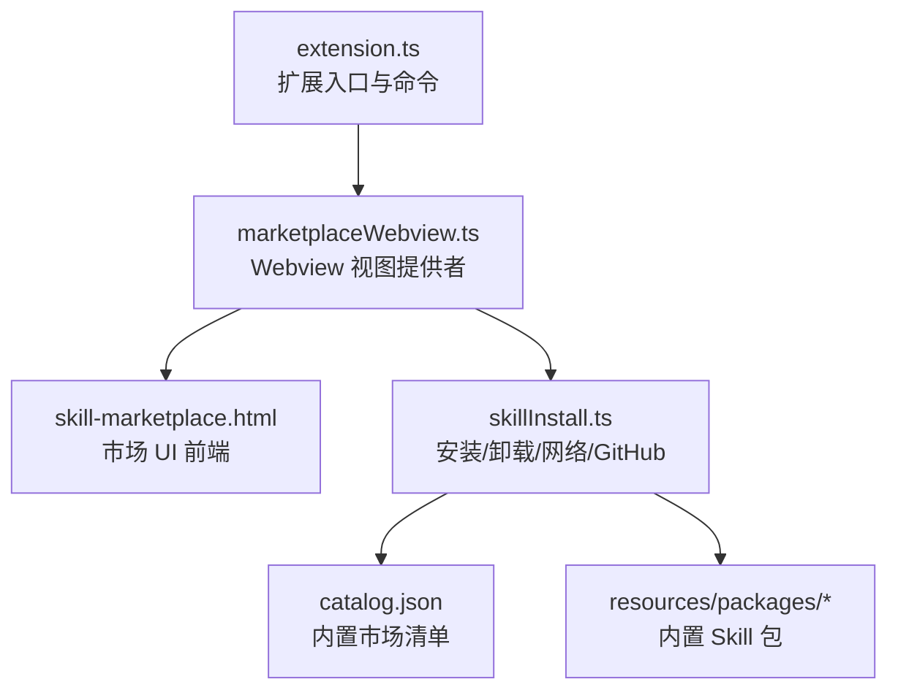
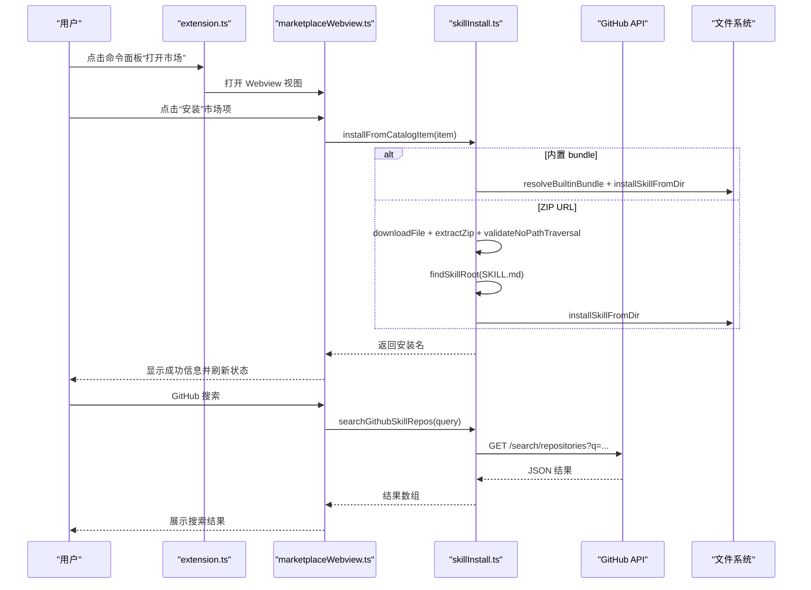
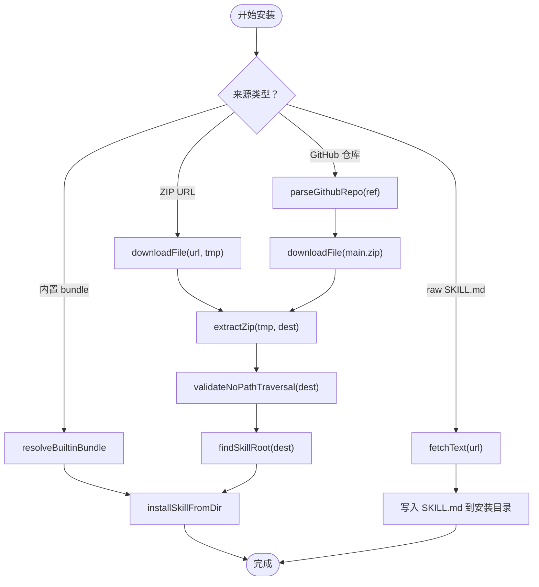
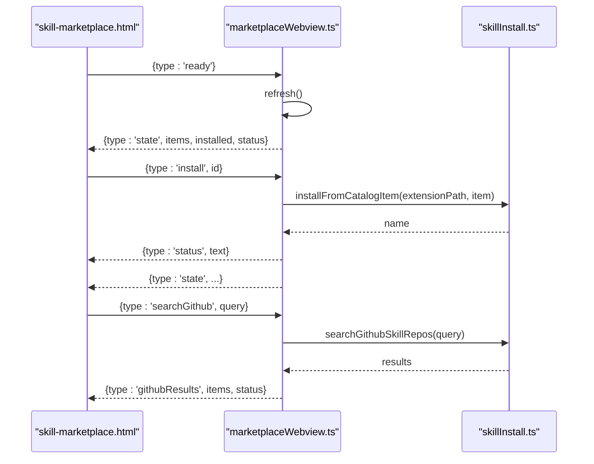
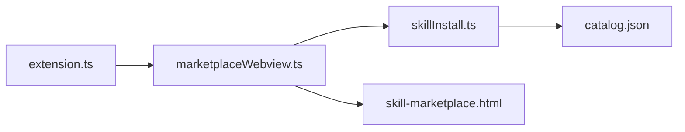

# 技能包安装与管理

<cite>
**本文引用的文件**   
- [skillInstall.ts](file://extensions/kodrix-skills/src/skillInstall.ts)
- [marketplaceWebview.ts](file://extensions/kodrix-skills/src/marketplaceWebview.ts)
- [extension.ts](file://extensions/kodrix-skills/src/extension.ts)
- [catalog.json](file://extensions/kodrix-skills/resources/catalog.json)
- [skill-marketplace.html](file://extensions/kodrix-skills/resources/skill-marketplace.html)
</cite>

## 目录
1. [简介](#简介)
2. [项目结构](#项目结构)
3. [核心组件](#核心组件)
4. [架构总览](#架构总览)
5. [详细组件分析](#详细组件分析)
6. [依赖关系分析](#依赖关系分析)
7. [性能与安全性考量](#性能与安全性考量)
8. [错误处理策略](#错误处理策略)
9. [故障排除指南](#故障排除指南)
10. [命令行与 API 使用示例](#命令行与-api-使用示例)
11. [结论](#结论)

## 简介
本文件系统性说明 Kodrix Skills 扩展的技能包安装与管理机制，覆盖以下能力：
- 多种安装来源：内置市场、本地目录、GitHub 仓库、URL（raw SKILL.md 或 zip）。
- 安装核心逻辑：依赖解析、冲突检测、权限与安全校验。
- 界面交互流程：搜索、筛选、预览、安装、卸载、导入 Cursor 技能。
- 安全加固：路径穿越防护、重定向白名单、大小限制、超时控制。
- 故障排查与常见问题定位。
- 命令面板入口与 API 调用方式。

## 项目结构
Kodrix Skills 扩展位于 extensions/kodrix-skills，核心代码与资源如下：
- src/extension.ts：扩展激活、命令注册、与 Webview 集成。
- src/marketplaceWebview.ts：市场侧边栏 WebviewViewProvider，负责 UI 消息分发与状态同步。
- src/skillInstall.ts：技能包安装、卸载、目录管理、网络下载、GitHub 搜索等核心逻辑。
- resources/catalog.json：内置市场清单，描述可安装的 Skill 元数据。
- resources/skill-marketplace.html：市场 UI 前端页面，实现搜索、筛选、卡片渲染与交互。
- resources/packages/*：内置 Skill 包，每个包包含一个 SKILL.md 作为技能定义。

图表来源
- [extension.ts:62-151](file://extensions/kodrix-skills/src/extension.ts#L62-L151)
- [marketplaceWebview.ts:30-169](file://extensions/kodrix-skills/src/marketplaceWebview.ts#L30-L169)
- [skillInstall.ts:103-457](file://extensions/kodrix-skills/src/skillInstall.ts#L103-L457)
- [catalog.json:1-125](file://extensions/kodrix-skills/resources/catalog.json#L1-L125)

章节来源
- [extension.ts:62-151](file://extensions/kodrix-skills/src/extension.ts#L62-L151)
- [marketplaceWebview.ts:30-169](file://extensions/kodrix-skills/src/marketplaceWebview.ts#L30-L169)
- [skillInstall.ts:103-457](file://extensions/kodrix-skills/src/skillInstall.ts#L103-L457)
- [catalog.json:1-125](file://extensions/kodrix-skills/resources/catalog.json#L1-L125)

## 核心组件
- skillInstall.ts
  - 提供安装、卸载、目录解析、GitHub 搜索、网络下载、ZIP 解压、SKILL.md 发现等能力。
  - 关键函数：installFromCatalogItem、installFromUrl、installSkillFromDir、uninstallSkill、searchGithubSkillRepos、loadCatalog、resolveSkillsDir、listInstalledSkills。
- marketplaceWebview.ts
  - 实现 WebviewViewProvider，处理 UI 事件（安装、卸载、GitHub 搜索、导入 Cursor 技能），并同步状态到前端。
- extension.ts
  - 注册命令、打开市场、进度提示、刷新列表、初始化 Chat 配置中的技能位置。
- catalog.json
  - 定义内置市场项的 id、displayName、description、bundle、installName、icon、categories、tags 等元数据。
- skill-marketplace.html
  - 前端 UI：搜索框、标签页（市场/已安装/GitHub）、卡片渲染、按钮事件、状态条。

章节来源
- [skillInstall.ts:103-457](file://extensions/kodrix-skills/src/skillInstall.ts#L103-L457)
- [marketplaceWebview.ts:30-169](file://extensions/kodrix-skills/src/marketplaceWebview.ts#L30-L169)
- [extension.ts:62-151](file://extensions/kodrix-skills/src/extension.ts#L62-L151)
- [catalog.json:1-125](file://extensions/kodrix-skills/resources/catalog.json#L1-L125)
- [skill-marketplace.html:1-399](file://extensions/kodrix-skills/resources/skill-marketplace.html#L1-L399)

## 架构总览
整体架构分为三层：
- 用户界面层：skill-marketplace.html 提供搜索、筛选、预览、操作按钮。
- 视图控制器层：marketplaceWebview.ts 接收 UI 消息，调用安装逻辑，推送状态。
- 业务逻辑层：skillInstall.ts 执行安装、卸载、网络请求、GitHub 搜索、目录管理。
- 扩展入口层：extension.ts 注册命令、打开市场、进度提示、刷新视图。

图表来源
- [extension.ts:81-84](file://extensions/kodrix-skills/src/extension.ts#L81-L84)
- [marketplaceWebview.ts:70-148](file://extensions/kodrix-skills/src/marketplaceWebview.ts#L70-L148)
- [skillInstall.ts:197-296](file://extensions/kodrix-skills/src/skillInstall.ts#L197-L296)
- [skillInstall.ts:131-165](file://extensions/kodrix-skills/src/skillInstall.ts#L131-L165)

## 详细组件分析

### 安装逻辑（skillInstall.ts）
- 名称规范化与安全检查
  - sanitizeSkillName：过滤非法字符、长度限制、路径分隔符替换。
  - validateNoPathTraversal：递归检查解压后的路径是否越出目标目录，防止 Zip Slip。
- 解压与根目录发现
  - extractZip：跨平台调用 PowerShell 或 unzip，避免 shell 拼接注入。
  - findSkillRoot：在压缩包内查找 SKILL.md，限制最大嵌套深度防栈溢出。
- 安装来源分支
  - 内置 bundle：resolveBuiltinBundle 定位 resources/packages 或 marketplace/packages，再 installSkillFromDir。
  - ZIP URL：downloadFile 下载后解压、校验、找根目录、复制至安装目录。
  - raw SKILL.md URL：直接拉取文本内容写入 ~/.agents/skills/<name>/SKILL.md。
  - GitHub 仓库：解析 owner/repo，下载 main.zip 或回退 master.zip，解压后安装。
- 目录管理与列表
  - resolveSkillsDir：读取配置 kodrix.skills.installDir，支持 ~ 展开。
  - listInstalledSkills：扫描目录并过滤含 SKILL.md 的子目录。
  - uninstallSkill：删除已安装目录。
- 网络请求与限制
  - fetchText：限制重定向次数、域名白名单、文本大小上限、超时。
  - downloadFile：限制文件大小、重定向白名单、超时、错误清理临时文件。
- 目录加载
  - loadCatalog：从 extensionPath 或 marketplace 目录加载 catalog.json，容错解析。

图表来源
- [skillInstall.ts:167-296](file://extensions/kodrix-skills/src/skillInstall.ts#L167-L296)
- [skillInstall.ts:330-436](file://extensions/kodrix-skills/src/skillInstall.ts#L330-L436)
- [skillInstall.ts:234-252](file://extensions/kodrix-skills/src/skillInstall.ts#L234-L252)

章节来源
- [skillInstall.ts:26-53](file://extensions/kodrix-skills/src/skillInstall.ts#L26-L53)
- [skillInstall.ts:59-77](file://extensions/kodrix-skills/src/skillInstall.ts#L59-L77)
- [skillInstall.ts:103-128](file://extensions/kodrix-skills/src/skillInstall.ts#L103-L128)
- [skillInstall.ts:167-296](file://extensions/kodrix-skills/src/skillInstall.ts#L167-L296)
- [skillInstall.ts:330-436](file://extensions/kodrix-skills/src/skillInstall.ts#L330-L436)
- [skillInstall.ts:438-457](file://extensions/kodrix-skills/src/skillInstall.ts#L438-L457)

### 界面交互流程（marketplaceWebview.ts）
- 视图初始化
  - resolveWebviewView：启用脚本、设置本地资源根、注入 HTML。
  - onDidReceiveMessage：监听 UI 消息，分发到对应处理逻辑。
- 状态同步
  - pushState：向 UI 推送 items、installed、status。
  - refresh：重新加载 catalog 并刷新 UI。
- 消息处理
  - ready/refresh：刷新市场数据。
  - install：根据 id 找到 catalog 项，调用 installFromCatalogItem，成功后提示并刷新。
  - uninstall：调用 uninstallSkill，成功后提示并刷新。
  - installGithub：调用 installFromUrl 传入 GitHub URL。
  - installFromUrl：弹出输入框获取 URL，调用 installFromUrl。
  - importCursor：导入 ~/.cursor/skills，统计数量并提示。
  - searchGithub：调用 searchGithubSkillRepos，推送 githubResults。
  - open：外部打开链接。
- 错误处理
  - try/catch 捕获异常，postMessage 通知 UI 显示错误，同时 showErrorMessage。

图表来源
- [marketplaceWebview.ts:40-148](file://extensions/kodrix-skills/src/marketplaceWebview.ts#L40-L148)
- [skillInstall.ts:197-296](file://extensions/kodrix-skills/src/skillInstall.ts#L197-L296)
- [skillInstall.ts:131-165](file://extensions/kodrix-skills/src/skillInstall.ts#L131-L165)

章节来源
- [marketplaceWebview.ts:30-169](file://extensions/kodrix-skills/src/marketplaceWebview.ts#L30-L169)
- [skill-marketplace.html:201-399](file://extensions/kodrix-skills/resources/skill-marketplace.html#L201-L399)

### 内置市场与清单（catalog.json）
- 字段说明
  - id：唯一标识，用于命令参数与匹配。
  - displayName：显示名称。
  - description：简短描述。
  - version/publisher/categories/tags：元数据。
  - bundle：指向 resources/packages 下的内置包名。
  - installName：安装时使用的目录名。
  - icon：图标名称（Codicon）。
- 安装行为
  - installFromCatalogItem 根据 bundle 字段定位内置包并安装。
  - 若存在 downloadUrl，则走 ZIP 下载流程。

章节来源
- [catalog.json:1-125](file://extensions/kodrix-skills/resources/catalog.json#L1-L125)
- [skillInstall.ts:197-229](file://extensions/kodrix-skills/src/skillInstall.ts#L197-L229)

### 前端 UI（skill-marketplace.html）
- 功能点
  - 搜索框：按 displayName/description/publisher/id/tags/categories 模糊匹配。
  - 标签页：市场、已安装、GitHub。
  - 操作按钮：从 URL 安装、导入 Cursor 技能、GitHub 搜索。
  - 卡片渲染：图标、标题、副标题、描述、徽章、主/次按钮。
  - 状态条：显示成功/错误信息。
- 交互事件
  - 点击按钮触发 vscode.postMessage，传递 action 与 id。
  - 监听 message 事件更新 state 并渲染。

章节来源
- [skill-marketplace.html:1-399](file://extensions/kodrix-skills/resources/skill-marketplace.html#L1-L399)

## 依赖关系分析
- extension.ts 依赖 marketplaceWebview.ts 与 skillInstall.ts。
- marketplaceWebview.ts 依赖 skillInstall.ts 提供的安装、卸载、搜索、导入能力。
- skillInstall.ts 依赖 Node.js 标准库（fs、http、https、os、path、child_process、stream/promises）与 VS Code API。
- catalog.json 被 skillInstall.ts 与 marketplaceWebview.ts 共同消费。
- skill-marketplace.html 通过 vscode.postMessage 与 marketplaceWebview.ts 通信。

图表来源
- [extension.ts:6-14](file://extensions/kodrix-skills/src/extension.ts#L6-L14)
- [marketplaceWebview.ts:8-17](file://extensions/kodrix-skills/src/marketplaceWebview.ts#L8-L17)
- [skillInstall.ts:6-14](file://extensions/kodrix-skills/src/skillInstall.ts#L6-L14)

章节来源
- [extension.ts:6-14](file://extensions/kodrix-skills/src/extension.ts#L6-L14)
- [marketplaceWebview.ts:8-17](file://extensions/kodrix-skills/src/marketplaceWebview.ts#L8-L17)
- [skillInstall.ts:6-14](file://extensions/kodrix-skills/src/skillInstall.ts#L6-L14)

## 性能与安全性考量
- 性能
  - 列表与状态推送采用增量更新，避免全量重建。
  - 网络请求设置超时与大小限制，防止长时间阻塞与大文件占用。
  - ZIP 解压使用系统工具，减少 JS 层面开销。
- 安全性
  - 名称规范化与路径穿越防护（Zip Slip）。
  - 重定向白名单仅允许 github.com、raw.githubusercontent.com、api.github.com。
  - 解压目录递归校验，越界即删除并报错。
  - 使用 spawnSync 参数数组而非字符串拼接，避免命令注入。
  - 下载与文本抓取均有限制，失败时清理临时文件。

章节来源
- [skillInstall.ts:26-53](file://extensions/kodrix-skills/src/skillInstall.ts#L26-L53)
- [skillInstall.ts:59-77](file://extensions/kodrix-skills/src/skillInstall.ts#L59-L77)
- [skillInstall.ts:330-436](file://extensions/kodrix-skills/src/skillInstall.ts#L330-L436)

## 错误处理策略
- 网络层
  - HTTP 状态码 >= 400 直接拒绝并抛出错误。
  - 重定向超过 MAX_REDIRECTS 或跳转到非白名单域名，拒绝并清理临时文件。
  - 下载或文本抓取超过大小限制，立即中断并报错。
  - 请求超时销毁连接并报错。
- 文件系统
  - 未找到 SKILL.md 时报错。
  - 解压失败（PowerShell/unzip 返回非零）抛错并附带 stderr。
  - 路径穿越检测到越界路径，删除解压目录并报错。
- 界面层
  - marketplaceWebview.ts 捕获异常，postMessage 通知 UI 显示错误，同时 showErrorMessage。
  - extension.ts 激活失败时 showErrorMessage。

章节来源
- [skillInstall.ts:167-296](file://extensions/kodrix-skills/src/skillInstall.ts#L167-L296)
- [skillInstall.ts:330-436](file://extensions/kodrix-skills/src/skillInstall.ts#L330-L436)
- [marketplaceWebview.ts:143-148](file://extensions/kodrix-skills/src/marketplaceWebview.ts#L143-L148)
- [extension.ts:62-68](file://extensions/kodrix-skills/src/extension.ts#L62-L68)

## 故障排除指南
- 无法安装内置 Skill
  - 检查 catalog.json 中 bundle 是否存在于 resources/packages。
  - 确认 installName 合法且未被占用。
- 从 URL 安装失败
  - 确认 URL 为 raw SKILL.md 或 ZIP 地址；GitHub 仓库需为主分支 main/master。
  - 检查网络连通性与重定向白名单。
- GitHub 搜索无结果
  - 调整查询关键词；确认 GitHub API 可达。
- 解压失败
  - Windows 检查 PowerShell Expand-Archive 可用；Linux/macOS 检查 unzip 可用。
- 路径穿越报错
  - 安装包结构异常，确保 SKILL.md 位于顶层或单层子目录。
- 安装目录为空或未生效
  - 确认 ~/.agents/skills 存在且包含 SKILL.md。
  - 刷新市场视图或重启扩展。

章节来源
- [skillInstall.ts:167-296](file://extensions/kodrix-skills/src/skillInstall.ts#L167-L296)
- [skillInstall.ts:330-436](file://extensions/kodrix-skills/src/skillInstall.ts#L330-L436)
- [marketplaceWebview.ts:101-148](file://extensions/kodrix-skills/src/marketplaceWebview.ts#L101-L148)

## 命令行与 API 使用示例
- 命令面板命令
  - 打开市场：kodrix.skills.openMarketplace
  - 刷新市场：kodrix.skills.refresh
  - 安装 Skill：kodrix.skills.install（参数可为 CatalogItem 或 id）
  - 卸载 Skill：kodrix.skills.uninstall（参数为安装名）
  - 从 URL 安装：kodrix.skills.installFromUrl
  - 导入 Cursor 技能：kodrix.skills.importCursor
  - 搜索 GitHub：kodrix.skills.searchGithub
- API 调用示例（VS Code API）
  - 打开市场：
    - await vscode.commands.executeCommand('kodrix.skills.openMarketplace')
  - 安装内置 Skill（通过 id）：
    - await vscode.commands.executeCommand('kodrix.skills.install', 'kodrix.code-review')
  - 从 URL 安装：
    - await vscode.commands.executeCommand('kodrix.skills.installFromUrl')
  - 卸载 Skill：
    - await vscode.commands.executeCommand('kodrix.skills.uninstall', 'code-review')
  - 导入 Cursor 技能：
    - await vscode.commands.executeCommand('kodrix.skills.importCursor')

章节来源
- [extension.ts:16-25](file://extensions/kodrix-skills/src/extension.ts#L16-L25)
- [extension.ts:79-148](file://extensions/kodrix-skills/src/extension.ts#L79-L148)

## 结论
Kodrix Skills 扩展提供了完善的技能包安装与管理能力，涵盖多来源安装、严格的安全校验、清晰的界面交互与健壮的异常处理。通过内置市场、目录安装、GitHub 与 URL 等多种方式，用户可以便捷地扩展 Agent 能力。建议在企业环境中优先使用内置市场与受信任的 GitHub 源，并结合目录白名单与权限控制，确保技能包的安全与稳定。