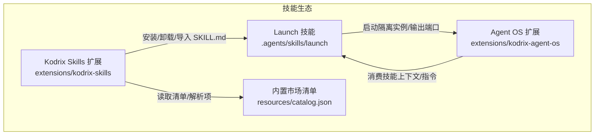
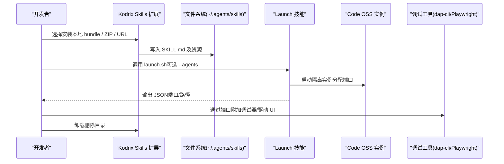
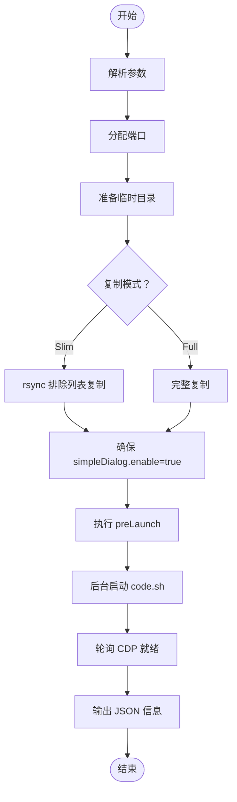
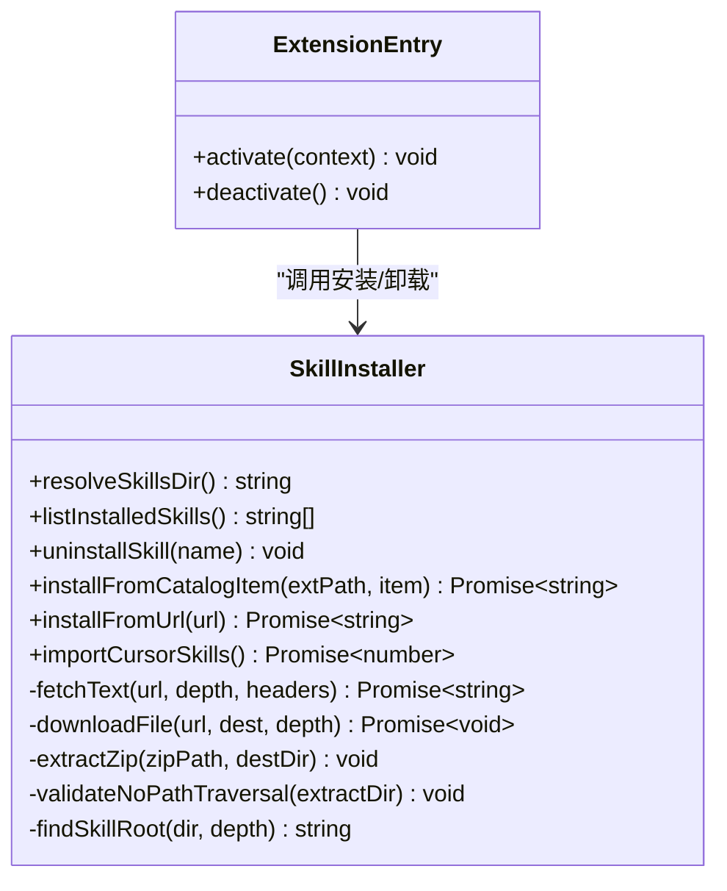
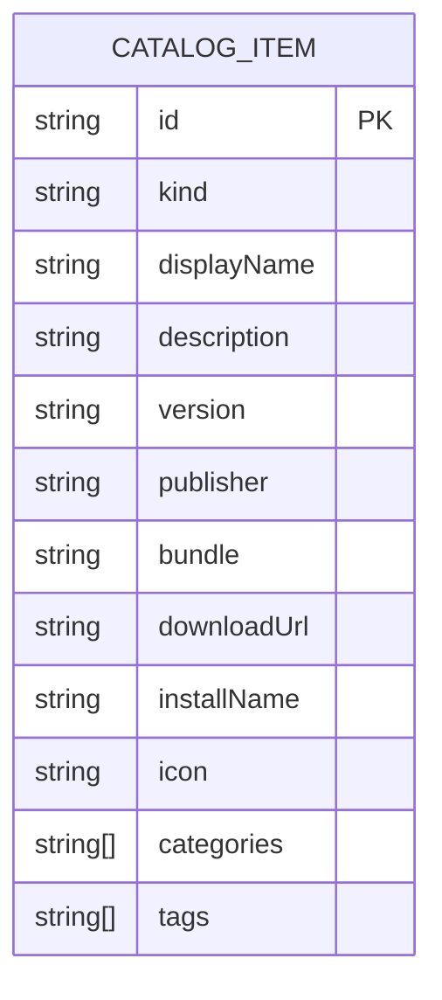
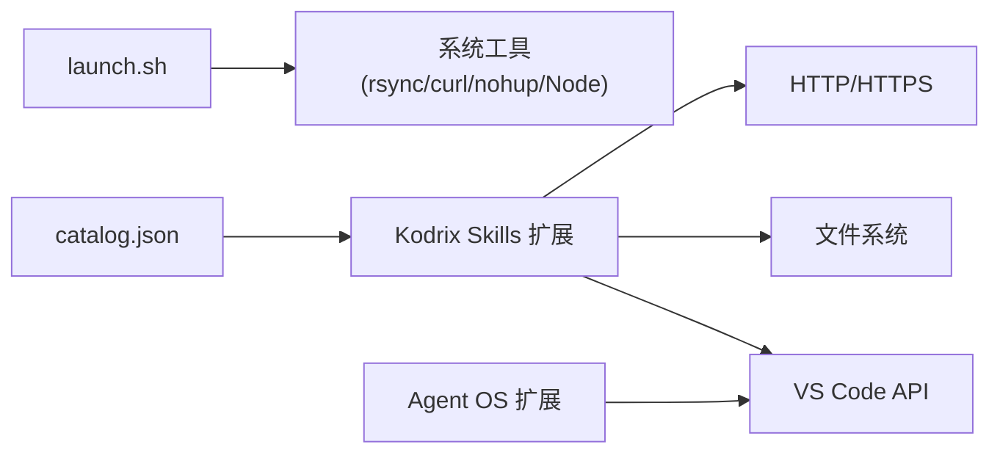

# 技能包开发指南

<cite>
**本文引用的文件**   
- [SKILL.md](file://.agents/skills/launch/SKILL.md)
- [launch.sh](file://.agents/skills/launch/scripts/launch.sh)
- [package.json（kodrix-skills）](file://extensions/kodrix-skills/package.json)
- [extension.ts（kodrix-skills）](file://extensions/kodrix-skills/src/extension.ts)
- [skillInstall.ts（kodrix-skills）](file://extensions/kodrix-skills/src/skillInstall.ts)
- [catalog.json（kodrix-skills）](file://extensions/kodrix-skills/resources/catalog.json)
</cite>

## 目录
1. [引言](#引言)
2. [项目结构](#项目结构)
3. [核心组件](#核心组件)
4. [架构总览](#架构总览)
5. [详细组件分析](#详细组件分析)
6. [依赖关系分析](#依赖关系分析)
7. [性能与可靠性考虑](#性能与可靠性考虑)
8. [故障排查指南](#故障排查指南)
9. [结论](#结论)
10. [附录：从零创建可用技能包](#附录从零创建可用技能包)

## 引言
本指南面向希望在本仓库中开发“技能包”的开发者。技能包以 SKILL.md 为入口，由 Kodrix Skills 扩展进行安装、管理与消费；同时提供 Launch 技能用于在隔离环境中启动 Code OSS 并驱动 UI、附加调试器，便于端到端验证技能行为。本文覆盖：
- 技能包规范：目录结构、manifest 约定、生命周期与发现机制
- API 接口定义：市场清单 catalog.json、安装与卸载 API、GitHub/URL 安装协议
- 开发与调试：环境搭建、Launch 脚本使用、Playwright 与 dap-cli 调试
- 测试策略：UI 自动化、并行多实例、断言与截图
- 打包与发布：内置包、远程 ZIP、Catalog 注册与最佳实践
- 常见问题与性能优化建议

## 项目结构
围绕技能包生态的关键位置如下：
- `.agents/skills/launch`：Launch 技能，包含 SKILL.md 与 launch.sh 等脚本，负责启动隔离的 Code OSS 实例、分配端口、输出调试信息
- `extensions/kodrix-skills`：技能市场扩展，负责列出、安装、卸载、导入技能，以及从 GitHub/URL 拉取 SKILL.md
- `extensions/kodrix-skills/resources/catalog.json`：内置技能市场清单，描述可安装的 bundle 或下载源
- `extensions/kodrix-agent-os`：Agent OS 扩展，声明 chatParticipants 等能力，体现技能被消费的场景之一

**图示来源**
- [SKILL.md:1-339](file://.agents/skills/launch/SKILL.md#L1-L339)
- [package.json（kodrix-skills）:1-135](file://extensions/kodrix-skills/package.json#L1-L135)
- [catalog.json（kodrix-skills）:1-125](file://extensions/kodrix-skills/resources/catalog.json#L1-L125)
- [extension.ts（kodrix-skills）:1-155](file://extensions/kodrix-skills/src/extension.ts#L1-L155)

**章节来源**
- [SKILL.md:1-339](file://.agents/skills/launch/SKILL.md#L1-L339)
- [package.json（kodrix-skills）:1-135](file://extensions/kodrix-skills/package.json#L1-L135)

## 核心组件
- Launch 技能（SKILL.md + scripts/launch.sh）
  - 作用：克隆认证用户数据目录到临时目录，分配唯一端口，启动 Code OSS，等待 CDP 就绪后输出 JSON（pid、cdpPort、extHostPort、mainPort、agentHostPort、userDataDir、extensionsDir、sharedDataDir、runDir、logFile、repo、agents）。
  - 关键特性：slim/full 复制模式、强制启用简单文件对话框、隔离 shared-data-dir、预构建检查、CDP 就绪轮询。
- Kodrix Skills 扩展（extension.ts + skillInstall.ts + package.json）
  - 作用：注册 Webview 视图、命令、配置项；实现安装/卸载/导入/搜索/从 URL 安装；维护 ~/.agents/skills 下的技能目录。
  - 安全加固：名称白名单、Zip Slip 校验、重定向白名单、大小限制、超时控制、子进程参数数组化。
- 内置市场清单（catalog.json）
  - 作用：声明可安装的 bundle 或 downloadUrl，供扩展加载展示。
- Agent OS 扩展（package.json）
  - 作用：声明 chatParticipants、commands、keybindings、settings 等，体现技能被消费的使用场景。

**章节来源**
- [SKILL.md:1-339](file://.agents/skills/launch/SKILL.md#L1-L339)
- [launch.sh:1-284](file://.agents/skills/launch/scripts/launch.sh#L1-L284)
- [extension.ts（kodrix-skills）:1-155](file://extensions/kodrix-skills/src/extension.ts#L1-L155)
- [skillInstall.ts（kodrix-skills）:1-458](file://extensions/kodrix-skills/src/skillInstall.ts#L1-L458)
- [catalog.json（kodrix-skills）:1-125](file://extensions/kodrix-skills/resources/catalog.json#L1-L125)
- [package.json（kodrix-agent-os）:1-800](file://extensions/kodrix-agent-os/package.json#L1-L800)

## 架构总览
技能包的生命周期分为“开发—安装—运行—消费—卸载”。

**图示来源**
- [extension.ts（kodrix-skills）:62-152](file://extensions/kodrix-skills/src/extension.ts#L62-L152)
- [skillInstall.ts（kodrix-skills）:167-296](file://extensions/kodrix-skills/src/skillInstall.ts#L167-L296)
- [launch.sh:206-284](file://.agents/skills/launch/scripts/launch.sh#L206-L284)
- [SKILL.md:34-94](file://.agents/skills/launch/SKILL.md#L34-L94)

## 详细组件分析

### Launch 技能：SKILL.md 与 launch.sh
- SKILL.md 是技能的元信息与使用说明，位于技能根目录。它描述了如何启动、如何使用 Playwright 驱动 UI、如何附加 dap-cli 调试各进程端口。
- launch.sh 负责：
  - 解析参数（--agents、--source-user-data-dir、--repo、--clone-extensions、--full）
  - 选择空闲端口（CDP、Extension Host、Main、Agent Host）
  - 准备临时 runDir、userDataDir、sharedDataDir
  - 执行 slim/full 复制（rsync），排除缓存/日志/锁文件等
  - 强制设置 files.simpleDialog.enable=true（便于自动化）
  - 预构建（preLaunch）、后台启动 code.sh、轮询 CDP 就绪
  - 输出 JSON 给调用方

**图示来源**
- [launch.sh:39-284](file://.agents/skills/launch/scripts/launch.sh#L39-L284)

**章节来源**
- [SKILL.md:1-339](file://.agents/skills/launch/SKILL.md#L1-L339)
- [launch.sh:1-284](file://.agents/skills/launch/scripts/launch.sh#L1-L284)

### Kodrix Skills 扩展：安装与卸载
- extension.ts 注册 Webview 视图与命令，处理安装、卸载、从 URL 安装、导入 Cursor skills、打开市场等交互。
- skillInstall.ts 提供核心逻辑：
  - resolveSkillsDir：解析安装目录（支持 ~ 展开）
  - listInstalledSkills：扫描 ~/.agents/skills 下含 SKILL.md 的目录
  - uninstallSkill：按名称删除目录
  - installFromCatalogItem：根据 catalog 项安装（bundle 或 downloadUrl）
  - installFromUrl：支持 raw SKILL.md 链接、GitHub 仓库 main/master.zip
  - importCursorSkills：从 ~/.cursor/skills 批量导入
  - fetchText/downloadFile：带重定向白名单、大小限制、超时的网络请求
  - extractZip：跨平台解压（PowerShell/unzip），并校验 Zip Slip
  - findSkillRoot：查找 SKILL.md 根目录（限制递归深度）

**图示来源**
- [extension.ts（kodrix-skills）:1-155](file://extensions/kodrix-skills/src/extension.ts#L1-L155)
- [skillInstall.ts（kodrix-skills）:1-458](file://extensions/kodrix-skills/src/skillInstall.ts#L1-L458)

**章节来源**
- [extension.ts（kodrix-skills）:1-155](file://extensions/kodrix-skills/src/extension.ts#L1-L155)
- [skillInstall.ts（kodrix-skills）:1-458](file://extensions/kodrix-skills/src/skillInstall.ts#L1-L458)

### 市场清单 catalog.json
- 字段说明（节选）：
  - id：唯一标识
  - kind：技能类型（如 skill、extension）
  - displayName/description/version/publisher/categories/tags：展示与分类
  - bundle：内置包名（对应 resources/packages/<bundle>）
  - downloadUrl：远程 ZIP 下载地址
  - installName：安装后的目录名
  - icon：图标（VS Code codicon 名称）
- 扩展通过 loadCatalog 优先读取扩展内 resources/catalog.json，其次 marketplace/catalog.json。

**图示来源**
- [catalog.json（kodrix-skills）:1-125](file://extensions/kodrix-skills/resources/catalog.json#L1-L125)
- [skillInstall.ts（kodrix-skills）:438-457](file://extensions/kodrix-skills/src/skillInstall.ts#L438-L457)

**章节来源**
- [catalog.json（kodrix-skills）:1-125](file://extensions/kodrix-skills/resources/catalog.json#L1-L125)
- [skillInstall.ts（kodrix-skills）:438-457](file://extensions/kodrix-skills/src/skillInstall.ts#L438-L457)

### Agent OS 扩展：技能消费侧
- 声明 chatParticipants（例如 codebase），提供 commands（def、refs、deps、dependents）等，体现技能在聊天/智能体工作流中的消费方式。
- 该扩展并非技能包本身，但展示了技能如何被 IDE 能力所集成。

**章节来源**
- [package.json（kodrix-agent-os）:1-800](file://extensions/kodrix-agent-os/package.json#L1-L800)

## 依赖关系分析
- Launch 技能依赖系统工具：rsync、curl、nohup、Node；可选 jq、lsof。
- Kodrix Skills 扩展依赖 VS Code API、child_process（spawnSync）、https/http、fs、os、path、stream/promises。
- Catalog 清单作为静态资源被扩展读取。
- Agent OS 扩展通过 VS Code 贡献点暴露能力，间接消费技能上下文。

**图示来源**
- [launch.sh:1-284](file://.agents/skills/launch/scripts/launch.sh#L1-L284)
- [skillInstall.ts（kodrix-skills）:1-458](file://extensions/kodrix-skills/src/skillInstall.ts#L1-L458)
- [catalog.json（kodrix-skills）:1-125](file://extensions/kodrix-skills/resources/catalog.json#L1-L125)
- [package.json（kodrix-agent-os）:1-800](file://extensions/kodrix-agent-os/package.json#L1-L800)

**章节来源**
- [launch.sh:1-284](file://.agents/skills/launch/scripts/launch.sh#L1-L284)
- [skillInstall.ts（kodrix-skills）:1-458](file://extensions/kodrix-skills/src/skillInstall.ts#L1-L458)
- [catalog.json（kodrix-skills）:1-125](file://extensions/kodrix-skills/resources/catalog.json#L1-L125)
- [package.json（kodrix-agent-os）:1-800](file://extensions/kodrix-agent-os/package.json#L1-L800)

## 性能与可靠性考虑
- Launch 技能
  - 使用 slim 复制减少 I/O 与磁盘占用，仅保留必要状态（globalStorage、密钥链相关）。
  - 隔离 shared-data-dir 避免多实例共享 SQLite 导致崩溃。
  - 预构建在前台执行，错误快速失败；CDP 就绪轮询保证调用方可立即连接。
- Kodrix Skills 扩展
  - 名称白名单与 Zip Slip 校验防止路径穿越攻击。
  - 重定向白名单限制为 github.com/raw.githubusercontent.com/api.github.com，降低恶意跳转风险。
  - 下载与文本获取均有限制（最大字节数、超时），避免资源耗尽。
  - 子进程调用使用参数数组而非模板拼接，防止命令注入。
  - 解压目录递归深度限制，防止 zip 炸弹。

[本节为通用指导，不直接分析具体文件]

## 故障排查指南
- Launch 技能
  - “Sent env to running instance. Terminating...”：可能是重复的用户数据目录路径冲突，确认临时目录已生成且唯一。
  - Renderer ESM 报错（如 import { Menu } from 'electron'）：检查是否继承了 ELECTRON_RUN_AS_NODE，Launch 会取消该环境变量。
  - 内置扩展加载失败：未编译 extensions/*/out，需执行 npm run compile 或 watch。
  - launch.sh 非零退出：查看 runDir/code.log 尾部日志定位问题。
  - 快照显示错误页面：使用 tab-list/tab-select 切换目标后再交互。
  - 输入框无内容：先聚焦聊天输入，再使用 press 或剪贴板粘贴，不要依赖 fill/type。
  - 认证缺失：确认源 profile 存在 User/globalStorage，且当前用户与 keychain 一致。
- Kodrix Skills 扩展
  - 安装失败：检查名称合法性、ZIP 是否包含 SKILL.md、GitHub 分支是否存在（main/master）。
  - 下载超时/过大：检查网络与文件大小限制。
  - 无法找到内置包：确认 catalog.json 中 bundle 名称与 resources/packages 一致。

**章节来源**
- [SKILL.md:292-339](file://.agents/skills/launch/SKILL.md#L292-L339)
- [launch.sh:226-284](file://.agents/skills/launch/scripts/launch.sh#L226-L284)
- [skillInstall.ts（kodrix-skills）:231-296](file://extensions/kodrix-skills/src/skillInstall.ts#L231-L296)
- [skillInstall.ts（kodrix-skills）:326-436](file://extensions/kodrix-skills/src/skillInstall.ts#L326-L436)

## 结论
本指南梳理了基于 SKILL.md 的技能包体系：以 Launch 技能驱动隔离实例与调试，以 Kodrix Skills 扩展完成安装与管理，以 catalog.json 作为市场清单，以 Agent OS 扩展展示消费场景。遵循本文规范与安全加固措施，可高效开发、测试、打包并发布技能包。

[本节为总结性内容，不直接分析具体文件]

## 附录：从零创建可用技能包
- 步骤概览
  1) 创建目录：~/.agents/skills/<your-skill>/SKILL.md
  2) 编写 SKILL.md：描述技能用途、前置条件、用法、注意事项
  3) 本地安装：将目录复制到 ~/.agents/skills/<name>（或通过 Kodrix Skills 扩展导入）
  4) 启动与调试：使用 Launch 技能启动隔离实例，通过 JSON 输出的端口附加 dap-cli 或使用 Playwright 驱动 UI
  5) 测试策略：使用 tab-list/tab-select 选择目标，snapshot 验证状态，press/粘贴输入，截图留证
  6) 打包发布：将 SKILL.md 与资源打包为 ZIP，或在 catalog.json 中添加条目（bundle 或 downloadUrl）
  7) 卸载：通过扩展卸载或删除目录

- 关键要点
  - SKILL.md 必须存在于技能根目录，否则会被视为无效技能
  - 名称需符合白名单规则（字母数字、下划线、连字符、点、加号，长度不超过 64）
  - 从 GitHub 安装时，默认尝试 main 分支，回退 master
  - 所有网络请求受重定向白名单与大小限制保护
  - 使用 Launch 的 slim 模式可减少启动时间与磁盘占用

**章节来源**
- [skillInstall.ts（kodrix-skills）:23-32](file://extensions/kodrix-skills/src/skillInstall.ts#L23-L32)
- [skillInstall.ts（kodrix-skills）:254-296](file://extensions/kodrix-skills/src/skillInstall.ts#L254-L296)
- [SKILL.md:34-94](file://.agents/skills/launch/SKILL.md#L34-L94)
- [SKILL.md:95-208](file://.agents/skills/launch/SKILL.md#L95-L208)
- [SKILL.md:273-328](file://.agents/skills/launch/SKILL.md#L273-L328)