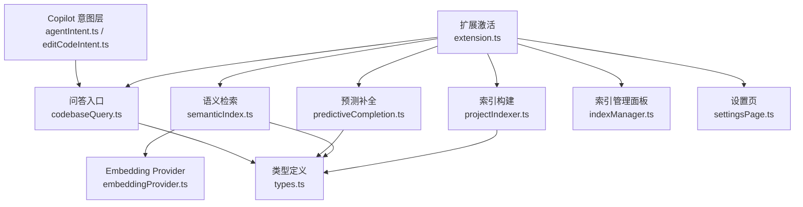
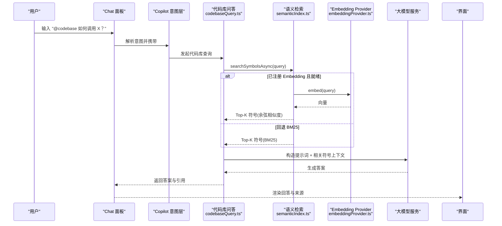
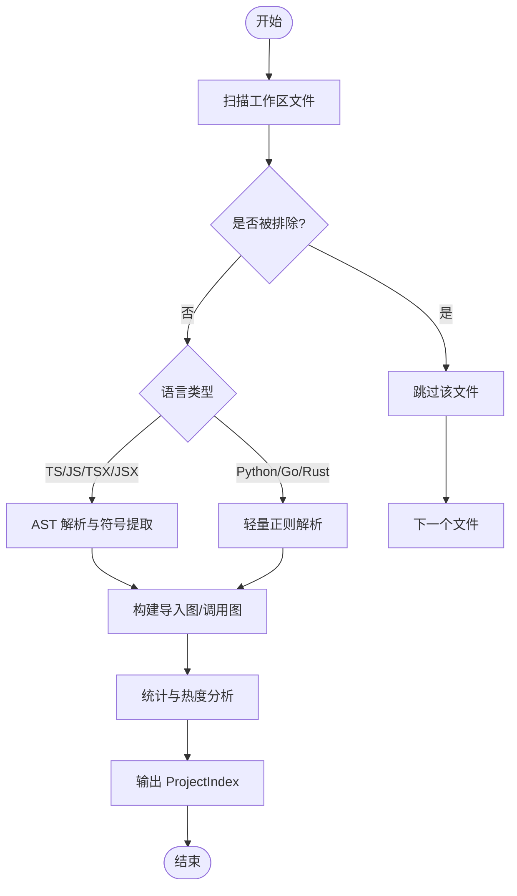
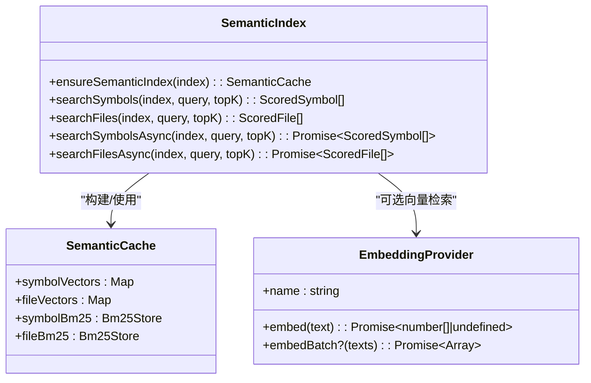
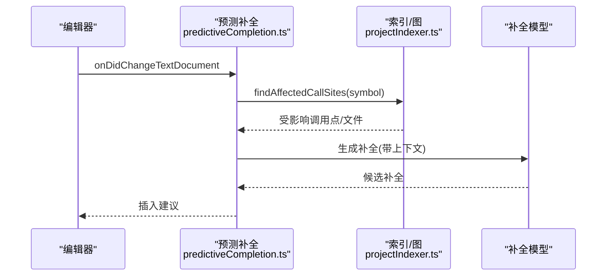
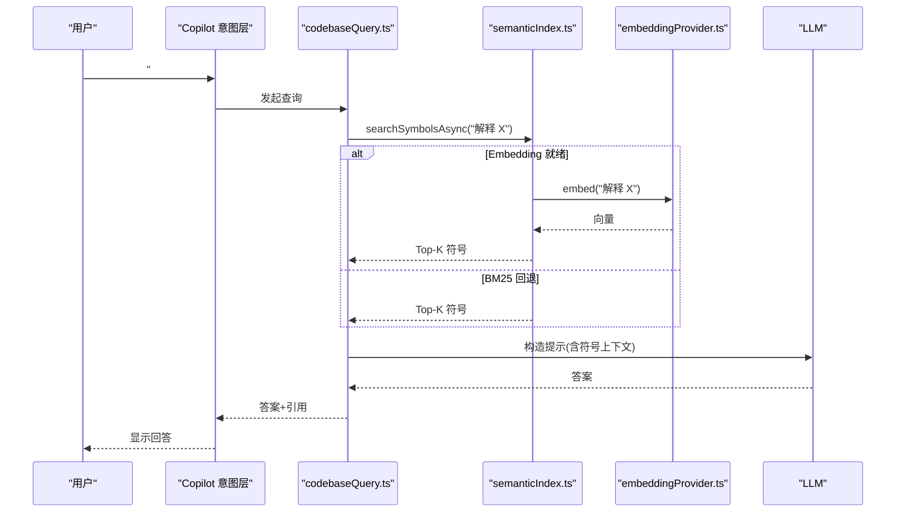
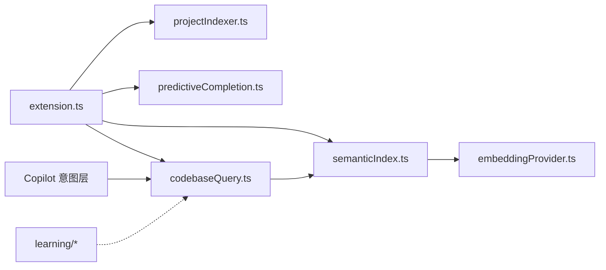

# 代码库智能

<cite>
**本文引用的文件**
- [extension.ts](file://extensions/kodrix-agent-os/src/extension.ts)
- [index.ts](file://extensions/kodrix-agent-os/src/codebase/index.ts)
- [projectIndexer.ts](file://extensions/kodrix-agent-os/src/codebase/projectIndexer.ts)
- [semanticIndex.ts](file://extensions/kodrix-agent-os/src/codebase/semanticIndex.ts)
- [embeddingProvider.ts](file://extensions/kodrix-agent-os/src/codebase/embeddingProvider.ts)
- [predictiveCompletion.ts](file://extensions/kodrix-agent-os/src/codebase/predictiveCompletion.ts)
- [codebaseQuery.ts](file://extensions/kodrix-agent-os/src/codebase/codebaseQuery.ts)
- [indexManager.ts](file://extensions/kodrix-agent-os/src/codebase/indexManager.ts)
- [settingsPage.ts](file://extensions/kodrix-agent-os/src/codebase/settingsPage.ts)
- [types.ts](file://extensions/kodrix-agent-os/src/codebase/types.ts)
- [learningEngine.ts](file://extensions/kodrix-agent-os/src/learning/learningEngine.ts)
- [sessionLearning.ts](file://extensions/kodrix-agent-os/src/learning/sessionLearning.ts)
- [semanticMemory.ts](file://extensions/kodrix-agent-os/src/learning/semanticMemory.ts)
- [agentIntent.ts](file://extensions/copilot/src/extension/intents/node/agentIntent.ts)
- [editCodeIntent.ts](file://extensions/copilot/src/extension/intents/node/editCodeIntent.ts)
</cite>

## 目录
1. [简介](#简介)
2. [项目结构](#项目结构)
3. [核心组件](#核心组件)
4. [架构总览](#架构总览)
5. [详细组件分析](#详细组件分析)
6. [依赖关系分析](#依赖关系分析)
7. [性能与缓存策略](#性能与缓存策略)
8. [故障排查指南](#故障排查指南)
9. [结论](#结论)
10. [附录：@Codebase 使用与自定义索引器开发](#附录codebase-使用与自定义索引器开发)

## 简介
本文件面向“代码库智能”能力，系统性阐述全工程语义索引、自然语言代码问答、上下文预测补全的实现原理与工作流程，并给出索引管理、性能优化、缓存策略、@Codebase 用法以及自定义索引器开发指南。目标是为开发者提供深入的技术理解与可落地的实践建议。

## 项目结构
代码库智能的核心位于扩展 kodrix-agent-os 的 codebase 子模块，围绕“索引构建—语义检索—问答与补全—索引管理”形成闭环；同时通过 Copilot 意图层将 #codebase/@codebase 等入口接入到工具调用链中。

图示来源
- [extension.ts:158-239](file://extensions/kodrix-agent-os/src/extension.ts#L158-L239)
- [projectIndexer.ts:1-180](file://extensions/kodrix-agent-os/src/codebase/projectIndexer.ts#L1-L180)
- [semanticIndex.ts:94-137](file://extensions/kodrix-agent-os/src/codebase/semanticIndex.ts#L94-L137)
- [embeddingProvider.ts:24-86](file://extensions/kodrix-agent-os/src/codebase/embeddingProvider.ts#L24-L86)
- [predictiveCompletion.ts:1-200](file://extensions/kodrix-agent-os/src/codebase/predictiveCompletion.ts#L1-L200)
- [codebaseQuery.ts:1-200](file://extensions/kodrix-agent-os/src/codebase/codebaseQuery.ts#L1-L200)
- [indexManager.ts:1-200](file://extensions/kodrix-agent-os/src/codebase/indexManager.ts#L1-L200)
- [settingsPage.ts:1-200](file://extensions/kodrix-agent-os/src/codebase/settingsPage.ts#L1-L200)
- [types.ts:1-200](file://extensions/kodrix-agent-os/src/codebase/types.ts#L1-L200)

章节来源
- [extension.ts:158-239](file://extensions/kodrix-agent-os/src/extension.ts#L158-L239)
- [index.ts:1-6](file://extensions/kodrix-agent-os/src/codebase/index.ts#L1-L6)

## 核心组件
- 全工程索引引擎（Project Indexer）
  - 基于 TypeScript AST 解析 TS/JS/TSX/JSX，提取符号、导入、调用关系；对 Python/Go/Rust 采用轻量行级正则解析，保证多语言覆盖与零外部依赖。
  - 支持 .cursorignore 过滤、排除目录/大小限制、增量更新与热度统计。
- 语义检索（Semantic Index）
  - 两级检索：优先 Embedding 向量余弦相似度，失败或无 provider 时回退 BM25；支持符号级与文件级检索。
  - 文档构建融合名称、类型、父符号、签名、文档注释，提升中文与自然语言查询召回。
- 预测性补全（Predictive Completion）
  - 基于当前编辑位置、受影响调用点与依赖图，生成更精准的上下文补全建议。
- 代码库问答（Codebase Query）
  - 暴露 @codebase 聊天参与者与查询 API，串联语义检索与 LLM 生成答案。
- 索引管理与设置
  - 提供重建索引、查看统计、配置开关与嵌入模型设置页。

章节来源
- [projectIndexer.ts:1-180](file://extensions/kodrix-agent-os/src/codebase/projectIndexer.ts#L1-L180)
- [semanticIndex.ts:94-137](file://extensions/kodrix-agent-os/src/codebase/semanticIndex.ts#L94-L137)
- [predictiveCompletion.ts:1-200](file://extensions/kodrix-agent-os/src/codebase/predictiveCompletion.ts#L1-L200)
- [codebaseQuery.ts:1-200](file://extensions/kodrix-agent-os/src/codebase/codebaseQuery.ts#L1-L200)
- [indexManager.ts:1-200](file://extensions/kodrix-agent-os/src/codebase/indexManager.ts#L1-L200)
- [settingsPage.ts:1-200](file://extensions/kodrix-agent-os/src/codebase/settingsPage.ts#L1-L200)

## 架构总览
下图展示从用户输入到答案生成的完整链路，包括索引构建、语义检索、LLM 生成与结果返回。

图示来源
- [agentIntent.ts:694-695](file://extensions/copilot/src/extension/intents/node/agentIntent.ts#L694-L695)
- [editCodeIntent.ts:349-457](file://extensions/copilot/src/extension/intents/node/editCodeIntent.ts#L349-L457)
- [semanticIndex.ts:312-350](file://extensions/kodrix-agent-os/src/codebase/semanticIndex.ts#L312-L350)
- [embeddingProvider.ts:24-86](file://extensions/kodrix-agent-os/src/codebase/embeddingProvider.ts#L24-L86)

## 详细组件分析

### 全工程索引引擎（Project Indexer）
- 文件发现与过滤
  - 预编译 glob 规则，避免重复正则编译带来的 GC 压力；支持 .cursorignore 与内置排除目录/后缀/大小阈值。
- AST 解析与符号提取
  - 使用 TypeScript 编译器 API 遍历 AST，收集类/接口/函数/方法/变量/类型别名/命名空间，记录可见性、签名、文档注释、父子关系。
  - 同步收集调用表达式，建立调用图；解析 import 声明，构建导入图。
- 多语言轻量解析
  - Python/Go/Rust 采用行级正则快速提取符号与导入，满足跨语言索引需求。
- 索引结构与版本
  - 输出 ProjectIndex，包含 symbols、imports、calls、hotSymbols、stats 等；版本化便于迁移与兼容。

图示来源
- [projectIndexer.ts:45-179](file://extensions/kodrix-agent-os/src/codebase/projectIndexer.ts#L45-L179)
- [projectIndexer.ts:181-466](file://extensions/kodrix-agent-os/src/codebase/projectIndexer.ts#L181-L466)
- [projectIndexer.ts:468-800](file://extensions/kodrix-agent-os/src/codebase/projectIndexer.ts#L468-L800)

章节来源
- [projectIndexer.ts:1-800](file://extensions/kodrix-agent-os/src/codebase/projectIndexer.ts#L1-L800)

### 语义检索（Semantic Index）
- 文档构建
  - 符号文档：name + kind + parentId + signature + docComment。
  - 文件文档：相对路径 + 文件内符号名聚合（限制数量防噪声）。
- 检索策略
  - 同步：BM25 打分（k1=1.5, b=0.75），毫秒级响应。
  - 异步：Embedding 向量余弦相似度；未就绪或失败自动回退 BM25。
- 缓存机制
  - 绑定 ProjectIndex 生命周期；索引重建后自动失效并重建缓存。
  - Embedding 预热：批量/单条编码，完成后 ready=true。

图示来源
- [semanticIndex.ts:30-137](file://extensions/kodrix-agent-os/src/codebase/semanticIndex.ts#L30-L137)
- [semanticIndex.ts:146-235](file://extensions/kodrix-agent-os/src/codebase/semanticIndex.ts#L146-L235)
- [semanticIndex.ts:237-395](file://extensions/kodrix-agent-os/src/codebase/semanticIndex.ts#L237-L395)

章节来源
- [semanticIndex.ts:94-137](file://extensions/kodrix-agent-os/src/codebase/semanticIndex.ts#L94-L137)
- [semanticIndex.ts:237-395](file://extensions/kodrix-agent-os/src/codebase/semanticIndex.ts#L237-L395)

### 预测性补全（Predictive Completion）
- 触发时机：编辑事件监听，结合当前文件与受影响调用点。
- 上下文构建：利用导入图与调用图定位受影响的符号与文件，压缩为紧凑上下文。
- 建议生成：将上下文注入补全提示，提高建议的相关性与准确性。

图示来源
- [predictiveCompletion.ts:1-200](file://extensions/kodrix-agent-os/src/codebase/predictiveCompletion.ts#L1-L200)
- [projectIndexer.ts:181-466](file://extensions/kodrix-agent-os/src/codebase/projectIndexer.ts#L181-L466)

章节来源
- [predictiveCompletion.ts:1-200](file://extensions/kodrix-agent-os/src/codebase/predictiveCompletion.ts#L1-L200)

### 自然语言代码问答（@Codebase）
- 入口：Copilot 意图层在 agentIntent/editCodeIntent 中解析 #codebase/@codebase，并将工具引用传递给编排层。
- 执行：调用 codebaseQuery 提供的查询接口，内部走 semanticIndex 的两级检索。
- 生成：将 Top-K 符号与文件片段作为上下文，交由 LLM 生成答案并附带来源。

图示来源
- [agentIntent.ts:694-695](file://extensions/copilot/src/extension/intents/node/agentIntent.ts#L694-L695)
- [editCodeIntent.ts:349-457](file://extensions/copilot/src/extension/intents/node/editCodeIntent.ts#L349-L457)
- [semanticIndex.ts:312-350](file://extensions/kodrix-agent-os/src/codebase/semanticIndex.ts#L312-L350)
- [embeddingProvider.ts:24-86](file://extensions/kodrix-agent-os/src/codebase/embeddingProvider.ts#L24-L86)

章节来源
- [agentIntent.ts:694-695](file://extensions/copilot/src/extension/intents/node/agentIntent.ts#L694-L695)
- [editCodeIntent.ts:349-457](file://extensions/copilot/src/extension/intents/node/editCodeIntent.ts#L349-L457)
- [codebaseQuery.ts:1-200](file://extensions/kodrix-agent-os/src/codebase/codebaseQuery.ts#L1-L200)

### 索引管理与设置
- 命令与面板
  - 重建索引、查看统计、打开索引管理面板。
- 配置项
  - 控制自动索引新文件夹、忽略 .cursorignore、语义嵌入开关与密钥等。
- 设置页
  - 在 VS Code 设置编辑器中内嵌自定义设置页，统一体验。

章节来源
- [extension.ts:214-306](file://extensions/kodrix-agent-os/src/extension.ts#L214-L306)
- [indexManager.ts:1-200](file://extensions/kodrix-agent-os/src/codebase/indexManager.ts#L1-L200)
- [settingsPage.ts:1-200](file://extensions/kodrix-agent-os/src/codebase/settingsPage.ts#L1-L200)

## 依赖关系分析
- 模块耦合
  - extension.ts 作为装配中心，注册所有能力；codebase 子模块之间通过 types.ts 共享数据结构。
  - semanticIndex.ts 依赖 embeddingProvider.ts 实现向量检索；projectIndexer.ts 产出 ProjectIndex 供检索与补全使用。
- 外部依赖
  - Copilot 意图层通过工具引用将 #codebase 接入问答流程。
  - 学习引擎（learning/session/semantic memory）可与代码库智能联动沉淀知识。

图示来源
- [extension.ts:158-239](file://extensions/kodrix-agent-os/src/extension.ts#L158-L239)
- [semanticIndex.ts:146-235](file://extensions/kodrix-agent-os/src/codebase/semanticIndex.ts#L146-L235)
- [embeddingProvider.ts:24-86](file://extensions/kodrix-agent-os/src/codebase/embeddingProvider.ts#L24-L86)
- [agentIntent.ts:694-695](file://extensions/copilot/src/extension/intents/node/agentIntent.ts#L694-L695)

章节来源
- [extension.ts:158-239](file://extensions/kodrix-agent-os/src/extension.ts#L158-L239)
- [types.ts:1-200](file://extensions/kodrix-agent-os/src/codebase/types.ts#L1-L200)

## 性能与缓存策略
- 索引构建
  - 预编译 glob 减少正则开销；按扩展名/大小/目录过滤降低 IO；增量更新避免全量重建。
- 语义检索
  - BM25 默认路径零网络开销；Embedding 预热减少首次延迟；批量 embed 降低 API 调用次数。
- 缓存
  - 语义索引缓存绑定 ProjectIndex 生命周期；索引重建自动失效；Embedding 状态维护 ready/building。
- 资源保护
  - 大文件跳过；docComment 截断防止过长文本；Top-K 限制控制下游负载。

章节来源
- [projectIndexer.ts:45-179](file://extensions/kodrix-agent-os/src/codebase/projectIndexer.ts#L45-L179)
- [semanticIndex.ts:94-137](file://extensions/kodrix-agent-os/src/codebase/semanticIndex.ts#L94-L137)
- [semanticIndex.ts:183-235](file://extensions/kodrix-agent-os/src/codebase/semanticIndex.ts#L183-L235)
- [embeddingProvider.ts:24-86](file://extensions/kodrix-agent-os/src/codebase/embeddingProvider.ts#L24-L86)

## 故障排查指南
- 索引未构建或为空
  - 检查是否启用自动索引新文件夹；确认工作区已打开；手动触发重建索引命令。
- 语义检索结果为空
  - 确认是否有符号被索引；若使用 Embedding，检查 apiKey 与 endpoint 配置；失败会自动回退 BM25。
- 问答不生效
  - 确认 Copilot 意图层是否正确传递 #codebase 引用；检查 codebaseQuery 是否注册；查看日志中的错误信息。
- 性能问题
  - 关注大文件或过多无关目录；调整 excludeDirs/excludeGlobs；必要时关闭自动索引新文件夹。

章节来源
- [extension.ts:214-306](file://extensions/kodrix-agent-os/src/extension.ts#L214-L306)
- [semanticIndex.ts:183-235](file://extensions/kodrix-agent-os/src/codebase/semanticIndex.ts#L183-L235)
- [embeddingProvider.ts:24-86](file://extensions/kodrix-agent-os/src/codebase/embeddingProvider.ts#L24-L86)

## 结论
代码库智能以“全工程索引 + 两级语义检索 + 上下文感知补全 + 自然语言问答”为核心，兼顾本地零依赖与可扩展的向量检索。通过完善的索引管理、缓存与性能优化，能够在大型项目中稳定运行，并为 Agent 与开发者提供高相关性的代码理解与建议。

## 附录：@Codebase 使用与自定义索引器开发

### @Codebase 使用方法
- 在对话中输入 #codebase 或 @codebase，配合自然语言提问，系统将自动检索相关符号与文件并生成答案。
- 可在 Copilot 意图层中观察到工具引用被正确注入与渲染。

章节来源
- [agentIntent.ts:694-695](file://extensions/copilot/src/extension/intents/node/agentIntent.ts#L694-L695)
- [editCodeIntent.ts:349-457](file://extensions/copilot/src/extension/intents/node/editCodeIntent.ts#L349-L457)

### 自定义索引器开发指南
- 设计原则
  - 遵循 types.ts 中的数据结构约定（CodeSymbol、ImportRelation、CallRelation、ProjectIndex 等）。
  - 保持增量更新与过滤策略，避免全量重建。
- 实现步骤
  - 新增语言解析器：参考 Python/Go/Rust 的轻量解析模式，提取符号、导入、调用关系。
  - 集成到 projectIndexer.ts：在文件发现与解析阶段加入新语言分支。
  - 验证语义检索：确保 buildSymbolDoc/buildFileDoc 能生成高质量文档。
  - 测试与回归：覆盖边界用例（大文件、特殊语法、缺失依赖）。
- 最佳实践
  - 控制 docComment 长度，避免影响向量维度与检索性能。
  - 合理设置 excludeDirs/excludeGlobs，减少无关文件干扰。
  - 在 Embedding Provider 中实现 batch embed，降低网络开销。

章节来源
- [types.ts:1-200](file://extensions/kodrix-agent-os/src/codebase/types.ts#L1-L200)
- [projectIndexer.ts:468-800](file://extensions/kodrix-agent-os/src/codebase/projectIndexer.ts#L468-L800)
- [semanticIndex.ts:237-261](file://extensions/kodrix-agent-os/src/codebase/semanticIndex.ts#L237-L261)
- [embeddingProvider.ts:24-86](file://extensions/kodrix-agent-os/src/codebase/embeddingProvider.ts#L24-L86)