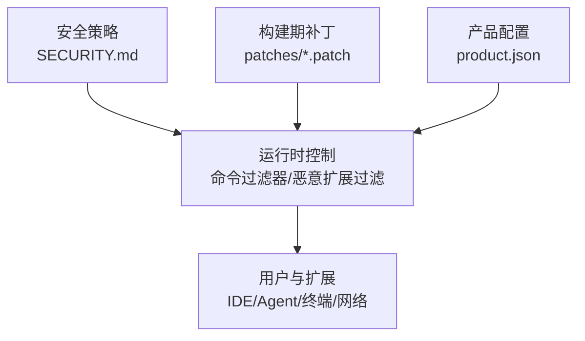
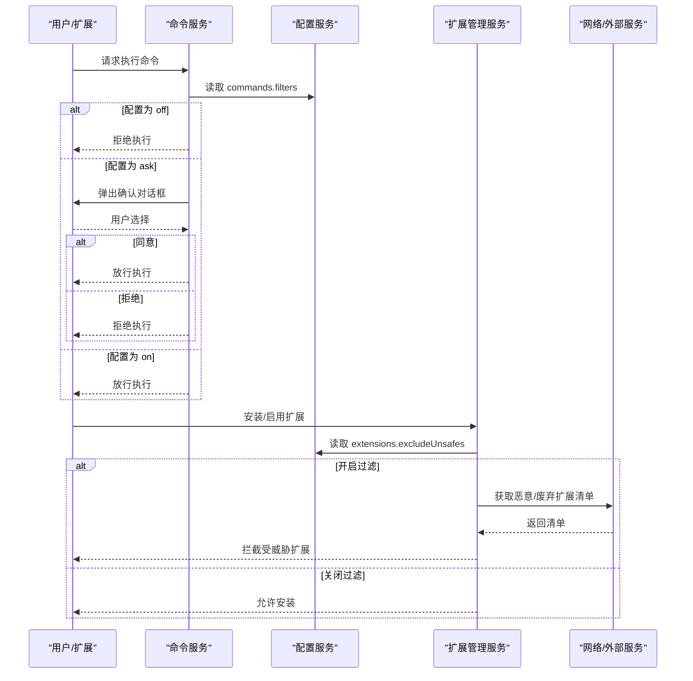
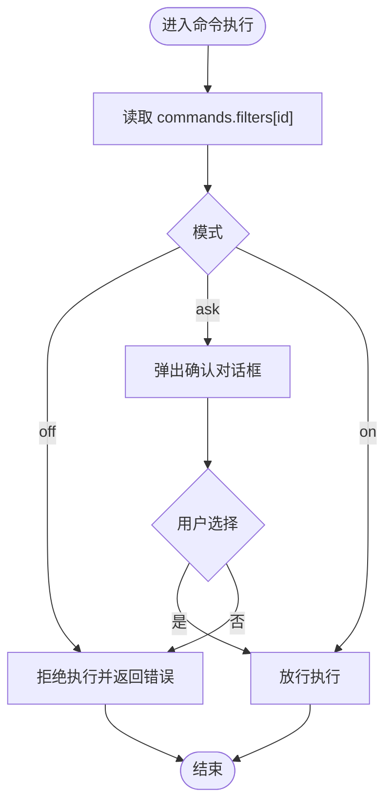
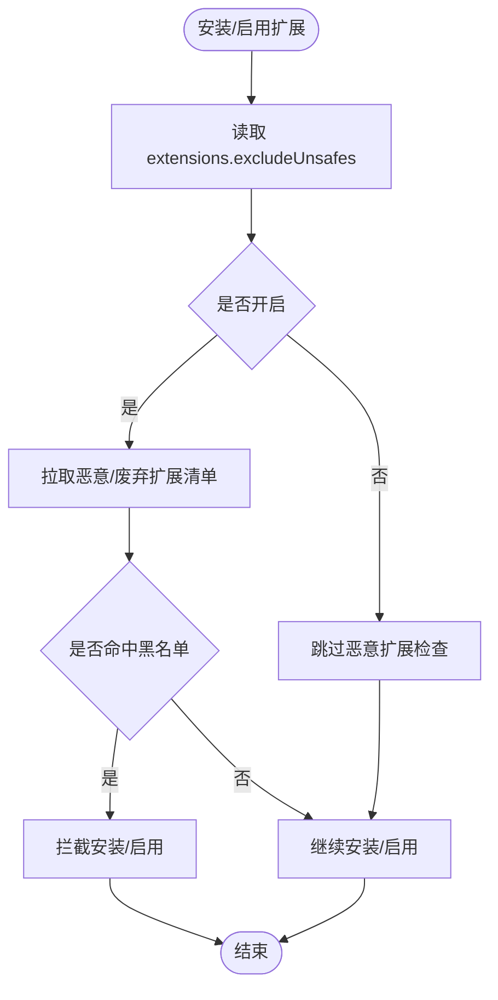
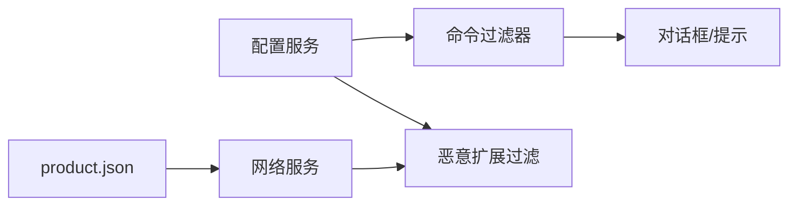

# 安全考虑

<cite>
**本文引用的文件**
- [SECURITY.md](file://SECURITY.md)
- [.github/SECURITY.md](file://.github/SECURITY.md)
- [product.json](file://product.json)
- [00-security-add-command-filter.patch](file://patches/00-security-add-command-filter.patch)
- [60-security-add-option-for-malicious-ext.patch](file://patches/60-security-add-option-for-malicious-ext.patch)
</cite>

## 目录
1. [简介](#简介)
2. [项目结构](#项目结构)
3. [核心组件](#核心组件)
4. [架构总览](#架构总览)
5. [详细组件分析](#详细组件分析)
6. [依赖关系分析](#依赖关系分析)
7. [性能与安全权衡](#性能与安全权衡)
8. [故障排查指南](#故障排查指南)
9. [结论](#结论)
10. [附录](#附录)

## 简介
本文件面向安全工程师与运维人员，系统性梳理 Kodrix 的安全架构与防护措施，覆盖输入验证、权限控制、数据安全、网络安全、扩展沙箱、敏感信息保护、补丁管理与漏洞响应等关键领域。文档基于仓库内现有安全策略与代码级补丁进行说明，并提供可操作的配置与实践建议。

## 项目结构
Kodrix 的安全能力由“策略声明 + 运行时控制 + 构建期补丁”三部分构成：
- 策略声明：根目录的 SECURITY.md 定义了支持版本、报告渠道、响应时限、范围与贡献者安全实践；.github/SECURITY.md 提供快速入口与摘要。
- 运行时控制：通过命令过滤器、恶意扩展过滤等机制在运行期限制高风险行为。
- 构建期补丁：以 patches 目录中的 .patch 文件对上游源码进行最小化安全增强，便于追踪与维护。

图表来源
- [SECURITY.md:1-65](file://SECURITY.md#L1-L65)
- [00-security-add-command-filter.patch:1-168](file://patches/00-security-add-command-filter.patch#L1-L168)
- [60-security-add-option-for-malicious-ext.patch:1-28](file://patches/60-security-add-option-for-malicious-ext.patch#L1-L28)
- [product.json:1-800](file://product.json#L1-L800)

章节来源
- [SECURITY.md:1-65](file://SECURITY.md#L1-L65)
- [.github/SECURITY.md:1-11](file://.github/SECURITY.md#L1-L11)

## 核心组件
- 命令执行过滤器：为命令执行提供“关闭/询问/允许”的细粒度控制，默认拒绝高风险命令（如新建本地终端），降低恶意扩展或误操作风险。
- 恶意扩展过滤：默认下载并缓存恶意/废弃扩展清单，阻止受威胁扩展的安装与使用，可通过配置开关调整。
- 产品端点与信任域：通过 product.json 集中管理外部服务地址、徽章提供者白名单、链接保护可信域名等，减少不可信网络交互。
- 安全策略与流程：明确漏洞报告渠道、响应时限、范围与贡献者安全实践，形成闭环治理。

章节来源
- [00-security-add-command-filter.patch:1-168](file://patches/00-security-add-command-filter.patch#L1-L168)
- [60-security-add-option-for-malicious-ext.patch:1-28](file://patches/60-security-add-option-for-malicious-ext.patch#L1-L28)
- [product.json:1-800](file://product.json#L1-L800)
- [SECURITY.md:1-65](file://SECURITY.md#L1-L65)

## 架构总览
下图展示从策略到运行时的安全控制链路：策略定义驱动配置项，配置项在运行时被服务读取并影响命令执行与扩展安装流程；产品配置约束网络访问与第三方资源加载。

图表来源
- [00-security-add-command-filter.patch:1-168](file://patches/00-security-add-command-filter.patch#L1-L168)
- [60-security-add-option-for-malicious-ext.patch:1-28](file://patches/60-security-add-option-for-malicious-ext.patch#L1-L28)

## 详细组件分析

### 命令执行过滤器
- 目标：防止恶意扩展或用户误操作触发高危命令（例如创建本地终端）。
- 机制：
  - 新增配置项 commands.filters，支持 per-command 的 ask/off/on 三种模式。
  - 命令服务在执行前读取配置，off 直接拒绝，ask 弹出确认对话框，on 直接放行。
  - 默认将高风险命令设为 off，遵循最小权限原则。
- 适用场景：企业环境统一收敛危险命令；个人用户按需开启二次确认。

图表来源
- [00-security-add-command-filter.patch:1-168](file://patches/00-security-add-command-filter.patch#L1-L168)

章节来源
- [00-security-add-command-filter.patch:1-168](file://patches/00-security-add-command-filter.patch#L1-L168)

### 恶意扩展过滤
- 目标：在安装/启用扩展时自动屏蔽已知恶意或废弃扩展，降低供应链风险。
- 机制：
  - 新增配置项 extensions.excludeUnsafes，默认开启。
  - 开启时，扩展管理服务会拉取并缓存恶意/废弃扩展清单，并在安装阶段进行比对拦截。
  - 关闭时会跳过该检查（不推荐）。
- 适用场景：生产环境与团队基线默认开启；临时调试时可关闭但需评估风险。

图表来源
- [60-security-add-option-for-malicious-ext.patch:1-28](file://patches/60-security-add-option-for-malicious-ext.patch#L1-L28)

章节来源
- [60-security-add-option-for-malicious-ext.patch:1-28](file://patches/60-security-add-option-for-malicious-ext.patch#L1-L28)

### 产品配置与网络安全
- 外部端点集中管理：product.json 中定义编辑器 Web URL、扩展市场、徽章提供者白名单、链接保护可信域名等，避免硬编码分散导致的攻击面扩大。
- 链接保护：linkProtectionTrustedDomains 仅允许受信任域名打开链接，降低钓鱼与恶意跳转风险。
- 徽章与资源：extensionAllowedBadgeProviders 与正则白名单限制图片等资源来源，减少 XSS 与注入风险。
- 建议：
  - 严格审查 product.json 中的外部端点，确保指向受控域名。
  - 定期审计白名单，移除不再使用的条目。
  - 结合网络代理与出站规则，限制非必要外联。

章节来源
- [product.json:1-800](file://product.json#L1-L800)

### 敏感信息保护与密钥管理
- 策略要求：BYOK/API Key 必须通过扩展 SecretStorage（providerSecrets）存储，禁止写入 settings.json 或提交至仓库。
- 迁移注意：migrateConfig/Cursor 导入需校验路径落点为用户主目录，避免覆盖用户密钥。
- 进程与网络：child_process.spawn 使用参数数组而非拼接 shell 字符串；所有网络请求与子进程输出设置超时与大小上限。
- 日志脱敏：避免记录敏感字段（令牌、密钥、凭据），对必要日志做脱敏处理。
- 内存安全：谨慎处理大对象与二进制数据，及时释放引用，避免泄露到转储或日志。

章节来源
- [SECURITY.md:1-65](file://SECURITY.md#L1-L65)

### 扩展安全沙箱与权限边界
- 命令沙箱：通过命令过滤器限制扩展可执行的命令集合，默认拒绝高风险命令。
- 扩展来源控制：恶意扩展过滤阻断已知恶意/废弃扩展的安装与启用。
- API 能力裁剪：product.json 中按扩展 ID 精确授予所需 API 提案能力，遵循最小授权原则。
- 工作区信任：结合工作区信任模型，限制扩展对文件系统与网络的访问范围。

章节来源
- [00-security-add-command-filter.patch:1-168](file://patches/00-security-add-command-filter.patch#L1-L168)
- [60-security-add-option-for-malicious-ext.patch:1-28](file://patches/60-security-add-option-for-malicious-ext.patch#L1-L28)
- [product.json:1-800](file://product.json#L1-L800)

### 安全补丁管理流程
- 补丁位置：所有针对上游的安全增强以 patches/*.patch 形式维护，便于追溯与合并。
- 更新方式：通过 dev/update_patches.sh 等脚本统一管理补丁应用与冲突解决。
- 审核要点：
  - 最小变更：仅引入必要的安全修复，避免功能漂移。
  - 可回滚：每个补丁具备独立编号与描述，便于回滚。
  - 测试覆盖：对命令过滤器与恶意扩展过滤增加单元测试与集成测试用例。
- 上游同步：跟踪上游安全公告，优先采用官方修复；若需定制，保持补丁清晰且可解释。

章节来源
- [00-security-add-command-filter.patch:1-168](file://patches/00-security-add-command-filter.patch#L1-L168)
- [60-security-add-option-for-malicious-ext.patch:1-28](file://patches/60-security-add-option-for-malicious-ext.patch#L1-L28)

### 漏洞报告与应急响应
- 报告渠道：优先通过 Telegram 私聊或 GitHub Security Advisories 报告，严禁公开 Issue 披露利用细节。
- 响应时限：48 小时内初步确认，5 个工作日内完成严重度评估；Critical 补丁 7 天内发布，High 补丁 14 天内发布。
- 范围界定：涵盖 IDE、自有扩展、构建与 CI/CD 代码；上游 VS Code 与第三方 npm 依赖分别走各自渠道。
- 应急动作：
  - 紧急热修复：针对 Critical 问题快速发布补丁并通知用户。
  - 回滚预案：必要时回退到上一稳定版本，降低业务影响。
  - 监控告警：加强异常登录、异常命令执行、异常网络外联的监控与告警。

章节来源
- [SECURITY.md:1-65](file://SECURITY.md#L1-L65)
- [.github/SECURITY.md:1-11](file://.github/SECURITY.md#L1-L11)

## 依赖关系分析
- 命令过滤器依赖配置服务与对话框服务，实现动态策略与用户确认。
- 恶意扩展过滤依赖配置服务与网络请求服务，用于拉取黑名单并缓存。
- 产品配置作为全局信任域与端点来源，影响网络与 UI 行为。

图表来源
- [00-security-add-command-filter.patch:1-168](file://patches/00-security-add-command-filter.patch#L1-L168)
- [60-security-add-option-for-malicious-ext.patch:1-28](file://patches/60-security-add-option-for-malicious-ext.patch#L1-L28)
- [product.json:1-800](file://product.json#L1-L800)

章节来源
- [00-security-add-command-filter.patch:1-168](file://patches/00-security-add-command-filter.patch#L1-L168)
- [60-security-add-option-for-malicious-ext.patch:1-28](file://patches/60-security-add-option-for-malicious-ext.patch#L1-L28)
- [product.json:1-800](file://product.json#L1-L800)

## 性能与安全权衡
- 命令过滤器：ask 模式带来一次对话框交互开销，建议在高频命令上谨慎使用。
- 恶意扩展过滤：首次拉取黑名单有网络延迟，后续使用缓存；建议在企业镜像源部署清单以提升速度。
- 产品配置白名单：过多条目会增加校验复杂度，应定期清理。
- 日志与监控：适度采样与脱敏，避免过度记录造成 I/O 压力与隐私风险。

## 故障排查指南
- 命令执行被拒绝：
  - 检查 commands.filters 中对应命令的模式是否为 off。
  - 若为 ask，确认用户是否点击了拒绝。
  - 查看命令服务日志，定位具体拒绝原因。
- 恶意扩展未被拦截：
  - 确认 extensions.excludeUnsafes 是否开启。
  - 检查网络连通性与黑名单拉取是否成功。
  - 查看扩展管理服务日志，确认匹配逻辑是否生效。
- 外部端点访问失败：
  - 核对 product.json 中的端点与白名单是否正确。
  - 检查代理与防火墙策略是否放行。
  - 关注证书与域名有效性。

章节来源
- [00-security-add-command-filter.patch:1-168](file://patches/00-security-add-command-filter.patch#L1-L168)
- [60-security-add-option-for-malicious-ext.patch:1-28](file://patches/60-security-add-option-for-malicious-ext.patch#L1-L28)
- [product.json:1-800](file://product.json#L1-L800)

## 结论
Kodrix 通过“策略 + 运行时控制 + 构建期补丁”的组合，构建了覆盖命令执行、扩展生态、网络访问与敏感信息的综合安全体系。配合明确的漏洞报告与应急响应流程，能够在保证用户体验的同时，有效降低安全风险。建议在生产环境中默认开启命令过滤器与恶意扩展过滤，严格管理 product.json 的外部端点与白名单，并持续审计与更新补丁。

## 附录
- 最佳实践清单
  - 默认开启命令过滤器与恶意扩展过滤。
  - 使用 SecretStorage 管理密钥，禁止写入配置文件或提交仓库。
  - 所有子进程调用使用参数数组，禁用 shell 拼接。
  - 对所有网络请求设置超时与大小上限。
  - 定期审计 product.json 的端点与白名单。
  - 建立补丁评审与回归测试流程。
  - 制定并演练应急响应预案。