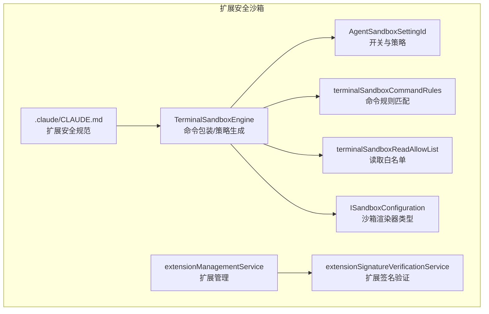
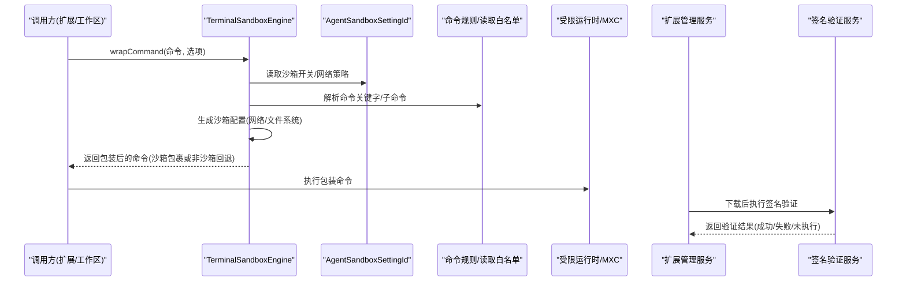
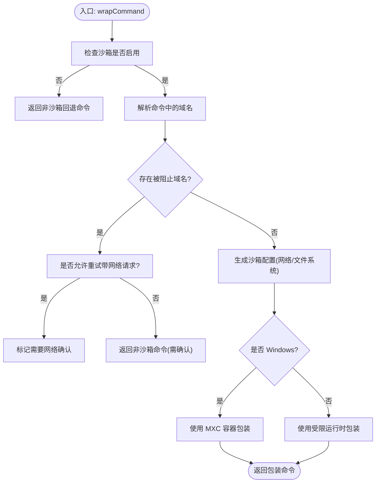
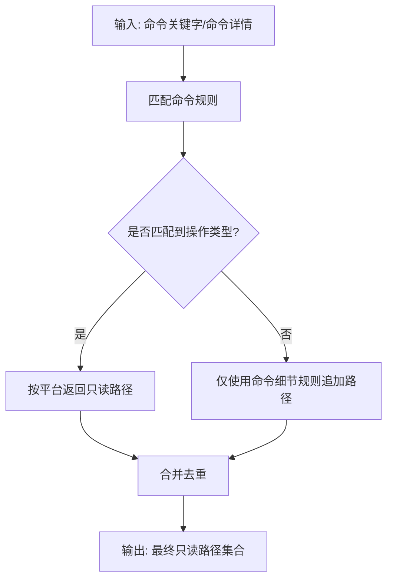
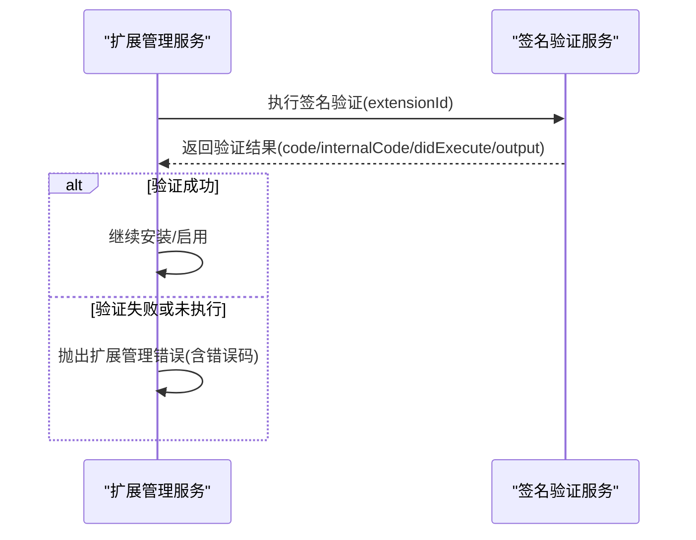
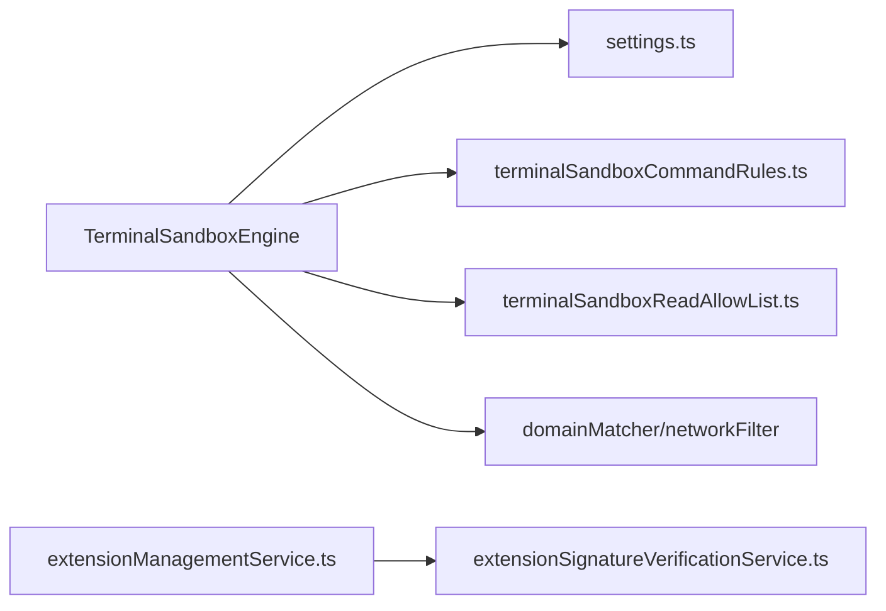

# 扩展安全沙箱

<cite>
**本文引用的文件**   
- [terminalSandboxEngine.ts](file://src/vs/platform/sandbox/common/terminalSandboxEngine.ts)
- [settings.ts](file://src/vs/platform/sandbox/common/settings.ts)
- [sandboxTypes.ts](file://src/vs/base/parts/sandbox/common/sandboxTypes.ts)
- [terminalSandboxCommandRules.ts](file://src/vs/platform/sandbox/common/terminalSandboxCommandRules.ts)
- [terminalSandboxReadAllowList.ts](file://src/vs/platform/sandbox/common/terminalSandboxReadAllowList.ts)
- [extensionSignatureVerificationService.ts](file://src/vs/platform/extensionManagement/node/extensionSignatureVerificationService.ts)
- [extensionManagementService.ts](file://src/vs/platform/extensionManagement/node/extensionManagementService.ts)
- [CLAUDE.md](file://.claude/CLAUDE.md)
</cite>

## 目录
1. [简介](#简介)
2. [项目结构](#项目结构)
3. [核心组件](#核心组件)
4. [架构总览](#架构总览)
5. [详细组件分析](#详细组件分析)
6. [依赖关系分析](#依赖关系分析)
7. [性能与可扩展性](#性能与可扩展性)
8. [故障排查指南](#故障排查指南)
9. [结论](#结论)
10. [附录：扩展开发安全指南](#附录扩展开发安全指南)

## 简介
本文件系统性阐述 Kodrix 扩展安全沙箱机制，覆盖进程隔离、内存隔离、资源访问限制、权限模型、恶意行为检测、签名验证与来源可信度检查，以及面向扩展开发者的安全实践。文档以代码级实现为依据，重点围绕终端命令执行沙箱引擎、沙箱配置与策略、网络与文件系统访问控制、扩展签名校验等关键路径展开，帮助读者从“系统如何保护扩展”和“开发者如何编写安全扩展”两个维度全面理解。

## 项目结构
Kodrix 的扩展安全能力由多个子系统协同构成：
- 终端命令沙箱引擎：负责将任意命令包装进受限运行时，生成并维护沙箱配置文件，解析网络域名、计算读写白名单，并在 Windows 上走 MXC 容器路径。
- 沙箱设置与开关：提供细粒度的启用/禁用、允许网络、允许非沙箱命令、自动批准等开关。
- 命令规则与读取白名单：基于命令关键字与子命令匹配，为不同语言工具链（git、node、rust、go、python、java、dotnet、ruby 等）精准放行必要只读路径。
- 沙箱渲染器类型定义：定义沙箱渲染器运行所需的最小公共配置。
- 扩展签名验证与管理：对扩展包进行签名校验与结果上报，管理下载与安装流程中的安全门控。
- 扩展开发规范：在仓库内给出安全编码约定，约束路径遍历、命令注入、网络请求、密钥管理等风险面。

图表来源
- [terminalSandboxEngine.ts:117-302](file://src/vs/platform/sandbox/common/terminalSandboxEngine.ts#L117-L302)
- [settings.ts:9-46](file://src/vs/platform/sandbox/common/settings.ts#L9-L46)
- [terminalSandboxCommandRules.ts:9-38](file://src/vs/platform/sandbox/common/terminalSandboxCommandRules.ts#L9-L38)
- [terminalSandboxReadAllowList.ts:10-77](file://src/vs/platform/sandbox/common/terminalSandboxReadAllowList.ts#L10-L77)
- [sandboxTypes.ts:21-78](file://src/vs/base/parts/sandbox/common/sandboxTypes.ts#L21-L78)
- [extensionSignatureVerificationService.ts:42-124](file://src/vs/platform/extensionManagement/node/extensionSignatureVerificationService.ts#L42-L124)
- [extensionManagementService.ts:363-381](file://src/vs/platform/extensionManagement/node/extensionManagementService.ts#L363-L381)
- [CLAUDE.md:48-52](file://.claude/CLAUDE.md#L48-L52)

章节来源
- [terminalSandboxEngine.ts:117-302](file://src/vs/platform/sandbox/common/terminalSandboxEngine.ts#L117-L302)
- [settings.ts:9-46](file://src/vs/platform/sandbox/common/settings.ts#L9-L46)
- [terminalSandboxCommandRules.ts:9-38](file://src/vs/platform/sandbox/common/terminalSandboxCommandRules.ts#L9-L38)
- [terminalSandboxReadAllowList.ts:10-77](file://src/vs/platform/sandbox/common/terminalSandboxReadAllowList.ts#L10-L77)
- [sandboxTypes.ts:21-78](file://src/vs/base/parts/sandbox/common/sandboxTypes.ts#L21-L78)
- [extensionSignatureVerificationService.ts:42-124](file://src/vs/platform/extensionManagement/node/extensionSignatureVerificationService.ts#L42-L124)
- [extensionManagementService.ts:363-381](file://src/vs/platform/extensionManagement/node/extensionManagementService.ts#L363-L381)
- [CLAUDE.md:48-52](file://.claude/CLAUDE.md#L48-L52)

## 核心组件
- 终端命令沙箱引擎（TerminalSandboxEngine）
  - 负责判断沙箱是否启用、是否允许网络、是否允许非沙箱命令；根据命令与上下文生成沙箱配置；封装命令到受限运行时或 Windows MXC 容器；处理依赖检测（bubblewrap、socat）、临时目录与清理。
- 沙箱设置（AgentSandboxSettingId）
  - 提供启用开关、平台差异开关、网络访问策略、非沙箱命令策略、重试策略、自动批准、各平台文件系统策略、高级运行时参数等。
- 命令规则与读取白名单
  - 通过命令关键字与子命令匹配，为常见开发工具链（git、node、rust、go、python、java、dotnet、nuget、msbuild、ruby、nativeBuild、conan、gnupg）精确放行必要的只读缓存与配置目录。
- 沙箱渲染器类型（ISandboxConfiguration）
  - 定义沙箱渲染器运行所需的窗口标识、应用根路径、用户环境、产品配置、缩放级别、V8 代码缓存、NLS 信息等最小集合。
- 扩展签名验证与管理
  - 对扩展包执行签名验证，记录日志与遥测，失败时抛出明确错误码；扩展管理服务在签名未执行或失败时阻断后续流程。
- 扩展开发安全规范
  - 强调路径校验、避免字符串拼接构造 shell 命令、网络请求超时与大小限制、不硬编码密钥等。

章节来源
- [terminalSandboxEngine.ts:117-302](file://src/vs/platform/sandbox/common/terminalSandboxEngine.ts#L117-L302)
- [settings.ts:9-46](file://src/vs/platform/sandbox/common/settings.ts#L9-L46)
- [terminalSandboxCommandRules.ts:9-38](file://src/vs/platform/sandbox/common/terminalSandboxCommandRules.ts#L9-L38)
- [terminalSandboxReadAllowList.ts:10-77](file://src/vs/platform/sandbox/common/terminalSandboxReadAllowList.ts#L10-L77)
- [sandboxTypes.ts:21-78](file://src/vs/base/parts/sandbox/common/sandboxTypes.ts#L21-L78)
- [extensionSignatureVerificationService.ts:42-124](file://src/vs/platform/extensionManagement/node/extensionSignatureVerificationService.ts#L42-L124)
- [extensionManagementService.ts:363-381](file://src/vs/platform/extensionManagement/node/extensionManagementService.ts#L363-L381)
- [CLAUDE.md:48-52](file://.claude/CLAUDE.md#L48-L52)

## 架构总览
下图展示扩展安全沙箱的整体交互：上层调用沙箱引擎包装命令，引擎依据设置与命令规则生成沙箱配置，最终在受限运行时或 MXC 容器中执行；扩展安装阶段由扩展管理服务驱动签名验证服务完成可信度校验。

图表来源
- [terminalSandboxEngine.ts:198-302](file://src/vs/platform/sandbox/common/terminalSandboxEngine.ts#L198-L302)
- [settings.ts:9-46](file://src/vs/platform/sandbox/common/settings.ts#L9-L46)
- [terminalSandboxCommandRules.ts:24-38](file://src/vs/platform/sandbox/common/terminalSandboxCommandRules.ts#L24-L38)
- [terminalSandboxReadAllowList.ts:360-375](file://src/vs/platform/sandbox/common/terminalSandboxReadAllowList.ts#L360-L375)
- [extensionSignatureVerificationService.ts:101-124](file://src/vs/platform/extensionManagement/node/extensionSignatureVerificationService.ts#L101-L124)
- [extensionManagementService.ts:363-381](file://src/vs/platform/extensionManagement/node/extensionManagementService.ts#L363-L381)

## 详细组件分析

### 终端命令沙箱引擎（TerminalSandboxEngine）
- 功能要点
  - 启用判定：区分 Windows 与非 Windows 平台的启用值归一化与判断。
  - 命令包装：根据是否允许网络、是否允许非沙箱命令、是否存在被阻止域名，决定返回沙箱包裹命令或非沙箱回退命令。
  - 网络域解析：从 URL、SSH 远程地址、主机名中抽取域名，结合允许/拒绝列表判定是否需要网络确认。
  - 文件系统策略：按平台（Windows/macOS/Linux）合并工作区写入根、只读/可写/禁止路径，生成沙箱配置 JSON。
  - 依赖检测：在非 Windows 平台检测 bubblewrap 与 socat 可用性，并提供修复建议。
  - 生命周期：创建临时目录、生成配置、清理临时目录。
- 关键流程（命令包装）

图表来源
- [terminalSandboxEngine.ts:198-302](file://src/vs/platform/sandbox/common/terminalSandboxEngine.ts#L198-L302)
- [terminalSandboxEngine.ts:481-548](file://src/vs/platform/sandbox/common/terminalSandboxEngine.ts#L481-L548)
- [terminalSandboxEngine.ts:610-693](file://src/vs/platform/sandbox/common/terminalSandboxEngine.ts#L610-L693)

章节来源
- [terminalSandboxEngine.ts:117-302](file://src/vs/platform/sandbox/common/terminalSandboxEngine.ts#L117-L302)
- [terminalSandboxEngine.ts:304-417](file://src/vs/platform/sandbox/common/terminalSandboxEngine.ts#L304-L417)
- [terminalSandboxEngine.ts:481-548](file://src/vs/platform/sandbox/common/terminalSandboxEngine.ts#L481-L548)
- [terminalSandboxEngine.ts:610-693](file://src/vs/platform/sandbox/common/terminalSandboxEngine.ts#L610-L693)

### 沙箱设置与权限模型（AgentSandboxSettingId）
- 权限模型概览
  - 启用开关：支持布尔与枚举值（off/on/allowNetwork），并提供规范化与判断函数。
  - 平台差异化：Windows 有独立启用键与高级运行时版本键。
  - 网络访问：允许/拒绝域名列表，决定是否需要在沙箱内发起网络请求前进行确认。
  - 非沙箱命令：允许绕过沙箱执行特定命令，但会触发确认提示。
  - 重试策略：当检测到被阻止域名时，可选择重试并附带网络许可。
  - 自动批准：默认审批策略开关。
  - 文件系统策略：按平台分别定义 allowRead/allowWrite/denyRead/denyWrite。
- 典型设置项
  - chat.agent.sandbox.enabled / enabledWindows
  - chat.agent.sandbox.allowNetwork
  - chat.agent.sandbox.allowUnsandboxedCommands
  - chat.agent.sandbox.retryWithAllowNetworkRequests
  - chat.agent.sandbox.allowAutoApprove
  - chat.agent.sandbox.fileSystem.{linux,mac,windows}
  - chat.agent.sandbox.advanced.windows.schemaVersion
  - chat.agent.sandbox.advanced.runtime

章节来源
- [settings.ts:9-46](file://src/vs/platform/sandbox/common/settings.ts#L9-L46)

### 命令规则与读取白名单（terminalSandboxCommandRules / terminalSandboxReadAllowList）
- 命令规则匹配
  - 基于关键字、子命令、选项WithValue、条件守卫（如 OS 能力）进行匹配。
  - 提供 getCommandSubcommand 解析子命令，跳过选项与带值的选项。
- 读取白名单
  - 针对 git、node、rust、go、python、java、dotnet、nuget、msbuild、ruby、nativeBuild、conan、gnupg 等工具链，按平台（macOS/Linux）返回必要的只读路径（缓存、工具链、配置）。
  - 敏感目录（如 ~/.ssh、~/.gnupg、云凭证、包管理器认证文件）仅在命令细节规则中按需放开。
- 组合策略
  - 先按命令关键字映射到操作类型，再按操作系统返回对应只读路径；同时叠加命令细节规则的额外路径。

图表来源
- [terminalSandboxCommandRules.ts:24-38](file://src/vs/platform/sandbox/common/terminalSandboxCommandRules.ts#L24-L38)
- [terminalSandboxReadAllowList.ts:26-77](file://src/vs/platform/sandbox/common/terminalSandboxReadAllowList.ts#L26-L77)
- [terminalSandboxReadAllowList.ts:329-375](file://src/vs/platform/sandbox/common/terminalSandboxReadAllowList.ts#L329-L375)

章节来源
- [terminalSandboxCommandRules.ts:9-38](file://src/vs/platform/sandbox/common/terminalSandboxCommandRules.ts#L9-L38)
- [terminalSandboxReadAllowList.ts:10-77](file://src/vs/platform/sandbox/common/terminalSandboxReadAllowList.ts#L10-L77)
- [terminalSandboxReadAllowList.ts:329-375](file://src/vs/platform/sandbox/common/terminalSandboxReadAllowList.ts#L329-L375)

### 沙箱渲染器类型（ISandboxConfiguration）
- 作用：为任何沙箱渲染器提供最小公共属性，包括窗口标识、应用根路径、用户环境变量、产品配置、缩放级别、V8 代码缓存、NLS 消息与语言、开发期 CSS 模块等。
- 设计原则：最小暴露面，确保沙箱渲染器在不接触宿主特权 API 的前提下正常运行。

章节来源
- [sandboxTypes.ts:21-78](file://src/vs/base/parts/sandbox/common/sandboxTypes.ts#L21-L78)

### 扩展签名验证与管理
- 签名验证服务
  - 执行扩展包的签名验证，记录执行状态、内部错误码、输出与耗时，并上报遥测事件。
  - 若未执行或验证失败，抛出明确的扩展管理错误（包含错误码）。
- 扩展管理服务
  - 在下载与安装流程中调用签名验证服务，遇到未执行或失败时中断后续步骤，防止不可信扩展进入运行环境。

图表来源
- [extensionSignatureVerificationService.ts:101-124](file://src/vs/platform/extensionManagement/node/extensionSignatureVerificationService.ts#L101-L124)
- [extensionManagementService.ts:363-381](file://src/vs/platform/extensionManagement/node/extensionManagementService.ts#L363-L381)

章节来源
- [extensionSignatureVerificationService.ts:42-124](file://src/vs/platform/extensionManagement/node/extensionSignatureVerificationService.ts#L42-L124)
- [extensionManagementService.ts:363-381](file://src/vs/platform/extensionManagement/node/extensionManagementService.ts#L363-L381)

## 依赖关系分析
- 组件耦合
  - TerminalSandboxEngine 强依赖 settings（开关与策略）、rules（命令规则）、readAllowList（读取白名单）、platform（操作系统/架构）、networkFilter（域名匹配）。
  - extensionManagementService 依赖 extensionSignatureVerificationService 完成可信度门控。
- 外部依赖
  - 非 Windows 平台依赖 bubblewrap 与 socat 作为沙箱基础设施。
  - Windows 平台通过 MXC 容器执行受限命令。
  - 受限运行时（@vscode/sandbox-runtime）作为命令执行边界。
- 潜在循环依赖
  - 当前实现中未见明显循环依赖；引擎侧逻辑自洽，扩展管理与签名验证解耦。

图表来源
- [terminalSandboxEngine.ts:117-302](file://src/vs/platform/sandbox/common/terminalSandboxEngine.ts#L117-L302)
- [settings.ts:9-46](file://src/vs/platform/sandbox/common/settings.ts#L9-L46)
- [terminalSandboxCommandRules.ts:9-38](file://src/vs/platform/sandbox/common/terminalSandboxCommandRules.ts#L9-L38)
- [terminalSandboxReadAllowList.ts:10-77](file://src/vs/platform/sandbox/common/terminalSandboxReadAllowList.ts#L10-L77)
- [extensionSignatureVerificationService.ts:42-124](file://src/vs/platform/extensionManagement/node/extensionSignatureVerificationService.ts#L42-L124)
- [extensionManagementService.ts:363-381](file://src/vs/platform/extensionManagement/node/extensionManagementService.ts#L363-L381)

章节来源
- [terminalSandboxEngine.ts:117-302](file://src/vs/platform/sandbox/common/terminalSandboxEngine.ts#L117-L302)
- [settings.ts:9-46](file://src/vs/platform/sandbox/common/settings.ts#L9-L46)
- [terminalSandboxCommandRules.ts:9-38](file://src/vs/platform/sandbox/common/terminalSandboxCommandRules.ts#L9-L38)
- [terminalSandboxReadAllowList.ts:10-77](file://src/vs/platform/sandbox/common/terminalSandboxReadAllowList.ts#L10-L77)
- [extensionSignatureVerificationService.ts:42-124](file://src/vs/platform/extensionManagement/node/extensionSignatureVerificationService.ts#L42-L124)
- [extensionManagementService.ts:363-381](file://src/vs/platform/extensionManagement/node/extensionManagementService.ts#L363-L381)

## 性能与可扩展性
- 性能特性
  - 沙箱配置按需刷新：仅在命令关键字、读取白名单、运行时配置、工作区根或网络策略变化时重建配置，减少重复 IO。
  - 域名解析采用正则扫描与 URI 解析，避免昂贵的外部查询。
  - 文件系统匹配使用 ExtUri 比较与 glob 匹配，兼顾跨平台语义与性能。
- 可扩展点
  - 新增命令规则：在 rules 与 readAllowList 中添加新关键字与子命令匹配，即可为新的工具链精细放行只读路径。
  - 新增平台策略：在 settings 中扩展平台相关开关，并在 engine 的策略生成分支中加入相应处理。
  - 自定义网络策略：通过 allowed/denied 域名模式扩展网络访问控制。

[本节为通用指导，不涉及具体文件分析]

## 故障排查指南
- 沙箱未启用
  - 检查 AgentSandboxSettingId 的启用开关与平台差异开关；确认 normalize 与 is 判断逻辑返回值。
- 依赖缺失（非 Windows）
  - 检查 bubblewrap 与 socat 是否安装且可用；查看引擎日志中的依赖检测结果与修复建议。
- 网络访问被阻止
  - 检查命令中是否包含被阻止域名；确认 allowed/denied 域名模式；必要时开启 retryWithAllowNetworkRequests 并进行网络确认。
- 文件系统访问被拒绝
  - 检查 allowRead/allowWrite/denyRead/denyWrite 策略；确认工作区写入根与命令细节规则是否已包含目标路径。
- 扩展签名验证失败
  - 查看签名验证服务的日志与遥测；确认扩展管理服务是否正确捕获并抛出错误码；检查签名工具链与证书链。

章节来源
- [terminalSandboxEngine.ts:304-417](file://src/vs/platform/sandbox/common/terminalSandboxEngine.ts#L304-L417)
- [terminalSandboxEngine.ts:481-548](file://src/vs/platform/sandbox/common/terminalSandboxEngine.ts#L481-L548)
- [terminalSandboxEngine.ts:610-693](file://src/vs/platform/sandbox/common/terminalSandboxEngine.ts#L610-L693)
- [extensionSignatureVerificationService.ts:101-124](file://src/vs/platform/extensionManagement/node/extensionSignatureVerificationService.ts#L101-L124)
- [extensionManagementService.ts:363-381](file://src/vs/platform/extensionManagement/node/extensionManagementService.ts#L363-L381)

## 结论
Kodrix 的扩展安全沙箱通过“命令包装 + 策略生成 + 受限运行时/MXC 容器”的组合，实现了进程与资源访问的强隔离；配合细粒度的网络与文件系统策略、命令规则与读取白名单，以及对扩展包的签名验证与来源可信度检查，构建了端到端的安全闭环。开发者遵循仓库内的安全规范，可在保证功能的同时显著降低安全风险。

[本节为总结性内容，不涉及具体文件分析]

## 附录：扩展开发安全指南
- 输入校验
  - 对所有用户提供的文件路径进行路径遍历防护（如 ../、绝对路径）。
- 命令构造
  - 严禁使用字符串插值拼接 shell 命令；应使用 spawn 的参数数组形式。
- 网络请求
  - 所有网络请求必须设置超时与大小限制。
- 密钥管理
  - 不得硬编码密钥、令牌或内部服务 URL。
- 资源释放
  - 在 deactivate 中释放所有资源；妥善管理 setTimeout/setInterval 句柄；将事件监听器加入 context.subscriptions。

章节来源
- [CLAUDE.md:48-52](file://.claude/CLAUDE.md#L48-L52)