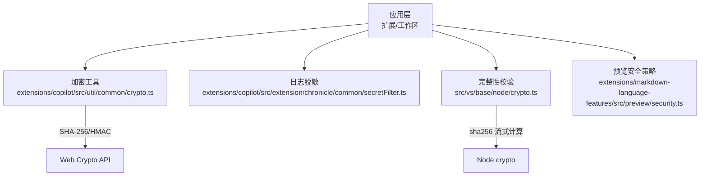
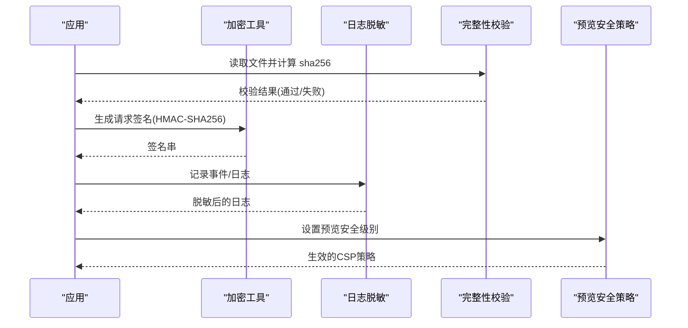
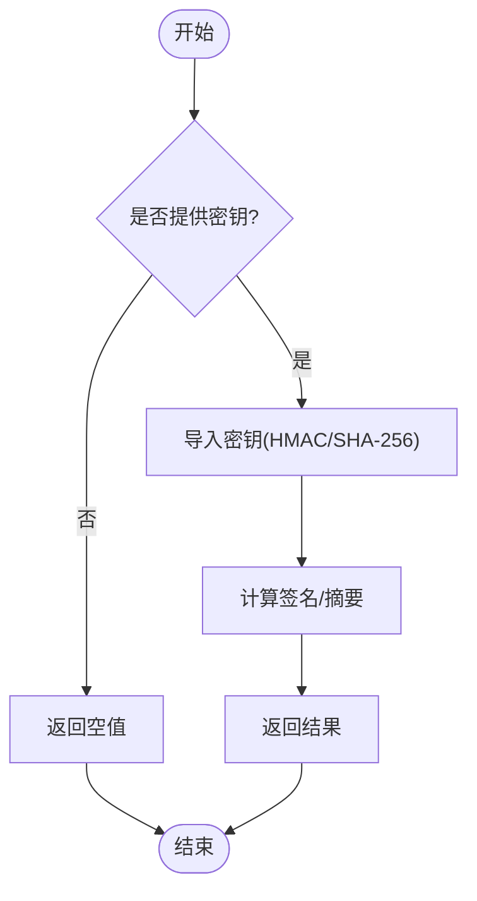
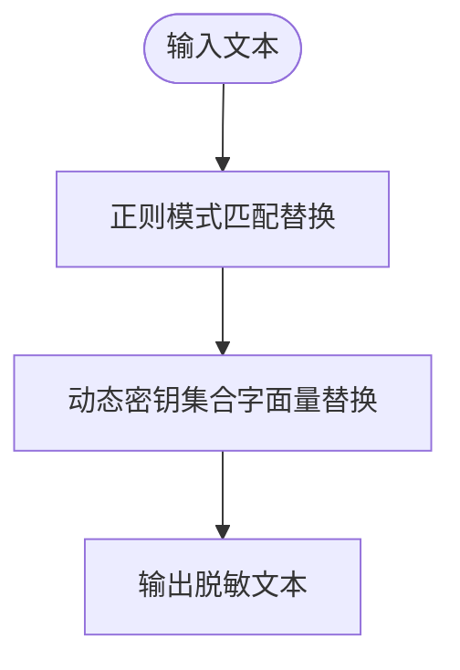
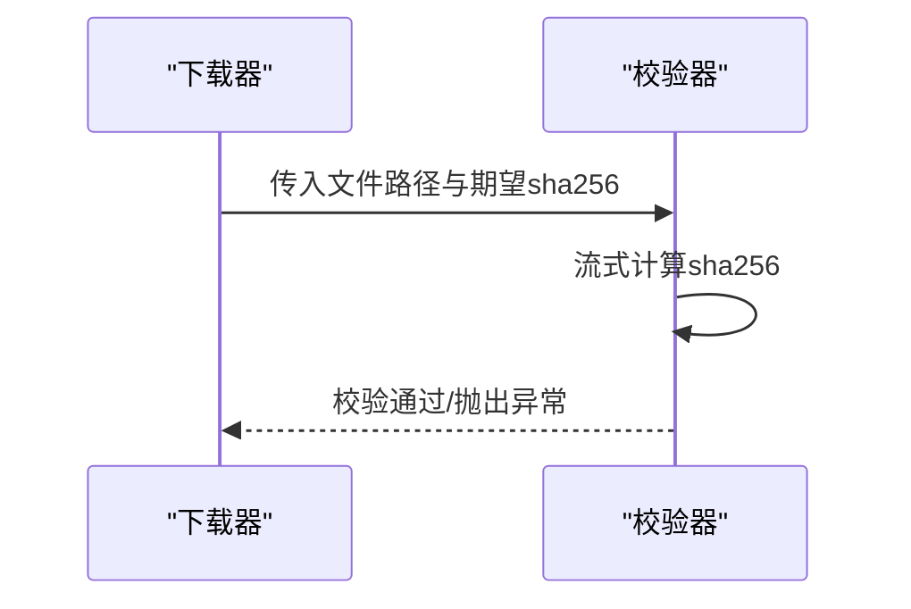
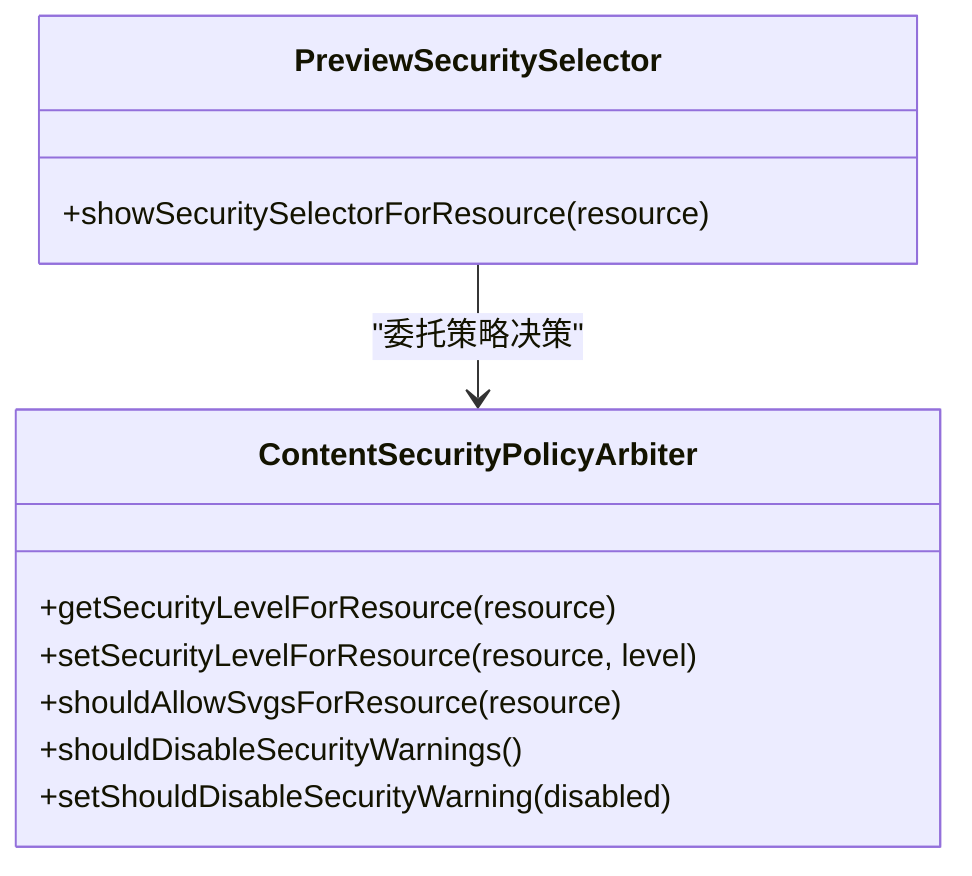
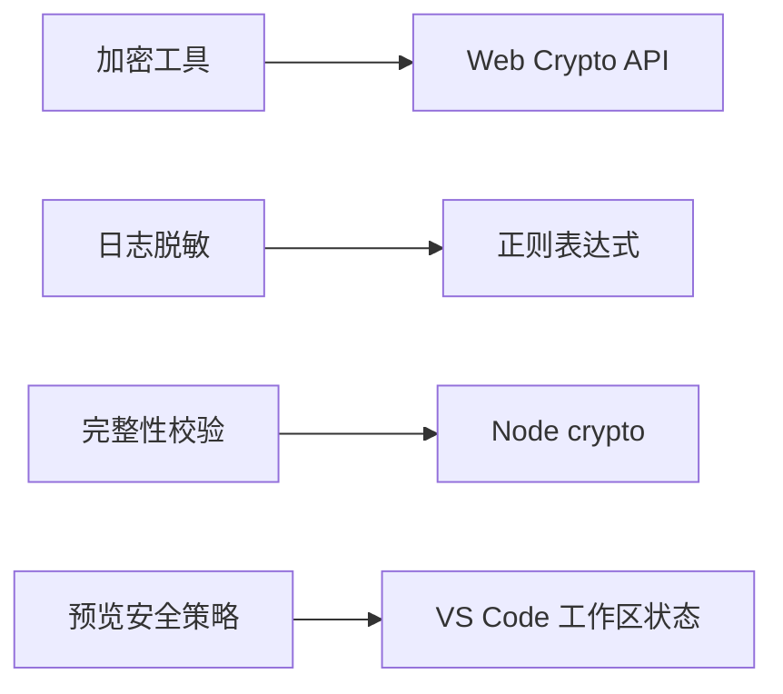

# 数据安全与隐私保护

<cite>
**本文引用的文件**
- [extensions/copilot/src/util/common/crypto.ts](file://extensions/copilot/src/util/common/crypto.ts)
- [extensions/copilot/src/extension/chronicle/common/secretFilter.ts](file://extensions/copilot/src/extension/chronicle/common/secretFilter.ts)
- [src/vs/base/node/crypto.ts](file://src/vs/base/node/crypto.ts)
- [extensions/markdown-language-features/src/preview/security.ts](file://extensions/markdown-language-features/src/preview/security.ts)
</cite>

## 目录
1. [引言](#引言)
2. [项目结构](#项目结构)
3. [核心组件](#核心组件)
4. [架构总览](#架构总览)
5. [详细组件分析](#详细组件分析)
6. [依赖关系分析](#依赖关系分析)
7. [性能考量](#性能考量)
8. [故障排查指南](#故障排查指南)
9. [结论](#结论)
10. [附录：配置与最佳实践](#附录：配置与最佳实践)

## 引言
本文件面向 Kodrix 的数据安全与隐私保护，聚焦以下目标：
- 数据加密机制：本地存储、传输、内存敏感数据处理
- 日志脱敏：自动识别并隐藏敏感信息
- 数据生命周期管理：创建、存储、使用、销毁各环节的安全措施
- 隐私保护策略：防止用户数据被滥用或泄露
- 配置指南与最佳实践：落地可操作的安全建议

## 项目结构
与安全相关的关键代码集中在以下模块：
- 通用加密能力：提供哈希、HMAC 等基础原语
- 日志与遥测脱敏：在事件上报前对敏感信息进行过滤
- 完整性校验：对下载内容进行 SHA-256 校验
- 预览内容安全策略：控制 Markdown 预览的 CSP 级别，限制不安全资源加载

图表来源
- [extensions/copilot/src/util/common/crypto.ts:9-44](file://extensions/copilot/src/util/common/crypto.ts#L9-L44)
- [extensions/copilot/src/extension/chronicle/common/secretFilter.ts:13-63](file://extensions/copilot/src/extension/chronicle/common/secretFilter.ts#L13-L63)
- [src/vs/base/node/crypto.ts:10-39](file://src/vs/base/node/crypto.ts#L10-L39)
- [extensions/markdown-language-features/src/preview/security.ts:10-27](file://extensions/markdown-language-features/src/preview/security.ts#L10-L27)

章节来源
- [extensions/copilot/src/util/common/crypto.ts:9-44](file://extensions/copilot/src/util/common/crypto.ts#L9-L44)
- [extensions/copilot/src/extension/chronicle/common/secretFilter.ts:13-63](file://extensions/copilot/src/extension/chronicle/common/secretFilter.ts#L13-L63)
- [src/vs/base/node/crypto.ts:10-39](file://src/vs/base/node/crypto.ts#L10-L39)
- [extensions/markdown-language-features/src/preview/security.ts:10-27](file://extensions/markdown-language-features/src/preview/security.ts#L10-L27)

## 核心组件
- 加密与哈希
  - 基于 Web Crypto 的 HMAC-SHA256 请求签名生成
  - 基于 Web Crypto 的 SHA-256 摘要计算
  - 同步路径下的轻量级 SHA-256 实现（非安全关键路径）
- 日志脱敏
  - 基于正则与动态值匹配的敏感信息过滤
  - 支持环境变量与运行时注入的密钥集合
- 完整性校验
  - 对本地文件进行 sha256 流式计算并与期望值比对
- 预览内容安全策略
  - 为 Markdown 预览设置不同级别的 CSP，限制脚本与不安全内容加载

章节来源
- [extensions/copilot/src/util/common/crypto.ts:9-44](file://extensions/copilot/src/util/common/crypto.ts#L9-L44)
- [extensions/copilot/src/extension/chronicle/common/secretFilter.ts:13-63](file://extensions/copilot/src/extension/chronicle/common/secretFilter.ts#L13-L63)
- [src/vs/base/node/crypto.ts:10-39](file://src/vs/base/node/crypto.ts#L10-L39)
- [extensions/markdown-language-features/src/preview/security.ts:10-27](file://extensions/markdown-language-features/src/preview/security.ts#L10-L27)

## 架构总览
Kodrix 的安全能力围绕“输入可信、过程可控、输出脱敏”展开：
- 输入侧：通过完整性校验确保本地文件未被篡改
- 处理侧：使用标准密码学原语进行签名与摘要；对敏感数据进行最小化暴露
- 输出侧：日志与遥测统一经脱敏管道，避免密钥外泄；预览内容按策略限制执行

图表来源
- [src/vs/base/node/crypto.ts:10-39](file://src/vs/base/node/crypto.ts#L10-L39)
- [extensions/copilot/src/util/common/crypto.ts:9-44](file://extensions/copilot/src/util/common/crypto.ts#L9-L44)
- [extensions/copilot/src/extension/chronicle/common/secretFilter.ts:131-148](file://extensions/copilot/src/extension/chronicle/common/secretFilter.ts#L131-L148)
- [extensions/markdown-language-features/src/preview/security.ts:45-74](file://extensions/markdown-language-features/src/preview/security.ts#L45-L74)

## 详细组件分析

### 加密与哈希（Web Crypto 与 Node 集成）
- 功能要点
  - 使用 Web Crypto 的 subtle.importKey/sign/digest 完成 HMAC-SHA256 签名与 SHA-256 摘要
  - 提供缓存化的同步 SHA-256 实现，用于非安全关键路径的性能优化
- 复杂度与性能
  - HMAC/SHA-256 时间复杂度 O(n)，空间复杂度 O(1)（流式/增量）
  - 缓存命中可显著降低重复计算的开销
- 错误处理
  - 未提供密钥时返回空值，调用方需做防御性检查
  - 同步实现仅用于非安全关键路径，避免阻塞主线程
- 安全注意
  - 密钥不应硬编码，应从安全存储或受控环境获取
  - 避免将明文密钥写入日志或远程上报

图表来源
- [extensions/copilot/src/util/common/crypto.ts:9-44](file://extensions/copilot/src/util/common/crypto.ts#L9-L44)
- [extensions/copilot/src/util/common/crypto.ts:46-62](file://extensions/copilot/src/util/common/crypto.ts#L46-L62)

章节来源
- [extensions/copilot/src/util/common/crypto.ts:9-44](file://extensions/copilot/src/util/common/crypto.ts#L9-L44)
- [extensions/copilot/src/util/common/crypto.ts:46-62](file://extensions/copilot/src/util/common/crypto.ts#L46-L62)

### 日志与遥测脱敏（Secret Filter）
- 功能要点
  - 内置大量敏感模式（JWT、Bearer、数据库连接串、云厂商密钥等）
  - 动态收集环境变量与运行时注入的密钥，进行字面量替换
  - 提供对象递归脱敏能力，便于结构化日志清理
- 处理流程
  - 先正则匹配替换，再按动态密钥集合进行精确替换
- 适用场景
  - 日志、调试输出、遥测事件、错误堆栈等可能包含敏感信息的文本

图表来源
- [extensions/copilot/src/extension/chronicle/common/secretFilter.ts:13-63](file://extensions/copilot/src/extension/chronicle/common/secretFilter.ts#L13-L63)
- [extensions/copilot/src/extension/chronicle/common/secretFilter.ts:96-148](file://extensions/copilot/src/extension/chronicle/common/secretFilter.ts#L96-L148)

章节来源
- [extensions/copilot/src/extension/chronicle/common/secretFilter.ts:13-63](file://extensions/copilot/src/extension/chronicle/common/secretFilter.ts#L13-L63)
- [extensions/copilot/src/extension/chronicle/common/secretFilter.ts:96-148](file://extensions/copilot/src/extension/chronicle/common/secretFilter.ts#L96-L148)

### 完整性校验（文件下载后验证）
- 功能要点
  - 使用 Node 的 crypto.createHash('sha256') 对文件流进行计算
  - 与期望的 sha256 值比较，不一致则抛出异常
- 使用建议
  - 适用于插件、二进制、资源包等外部内容的完整性校验
  - 建议在网络请求完成后立即校验，避免后续处理污染

图表来源
- [src/vs/base/node/crypto.ts:10-39](file://src/vs/base/node/crypto.ts#L10-L39)

章节来源
- [src/vs/base/node/crypto.ts:10-39](file://src/vs/base/node/crypto.ts#L10-L39)

### 预览内容安全策略（Markdown 预览 CSP）
- 功能要点
  - 提供多级安全策略：严格、允许本地不安全内容、允许所有脚本与内容等
  - 支持按工作区/资源粒度持久化策略，并可开关安全提示
- 交互流程
  - 通过快速选择器调整策略，刷新预览以生效

图表来源
- [extensions/markdown-language-features/src/preview/security.ts:17-27](file://extensions/markdown-language-features/src/preview/security.ts#L17-L27)
- [extensions/markdown-language-features/src/preview/security.ts:92-166](file://extensions/markdown-language-features/src/preview/security.ts#L92-L166)

章节来源
- [extensions/markdown-language-features/src/preview/security.ts:10-27](file://extensions/markdown-language-features/src/preview/security.ts#L10-L27)
- [extensions/markdown-language-features/src/preview/security.ts:45-74](file://extensions/markdown-language-features/src/preview/security.ts#L45-L74)
- [extensions/markdown-language-features/src/preview/security.ts:92-166](file://extensions/markdown-language-features/src/preview/security.ts#L92-L166)

## 依赖关系分析
- 加密模块依赖 Web Crypto API，具备跨平台一致性
- 日志脱敏模块不依赖外部库，纯正则与字符串处理，易于维护
- 完整性校验依赖 Node 的 crypto 模块，适合服务端/主进程环境
- 预览安全策略依赖 VS Code 工作区状态与 Memento 持久化

图表来源
- [extensions/copilot/src/util/common/crypto.ts:9-44](file://extensions/copilot/src/util/common/crypto.ts#L9-L44)
- [extensions/copilot/src/extension/chronicle/common/secretFilter.ts:13-63](file://extensions/copilot/src/extension/chronicle/common/secretFilter.ts#L13-L63)
- [src/vs/base/node/crypto.ts:10-39](file://src/vs/base/node/crypto.ts#L10-L39)
- [extensions/markdown-language-features/src/preview/security.ts:30-43](file://extensions/markdown-language-features/src/preview/security.ts#L30-L43)

章节来源
- [extensions/copilot/src/util/common/crypto.ts:9-44](file://extensions/copilot/src/util/common/crypto.ts#L9-L44)
- [extensions/copilot/src/extension/chronicle/common/secretFilter.ts:13-63](file://extensions/copilot/src/extension/chronicle/common/secretFilter.ts#L13-L63)
- [src/vs/base/node/crypto.ts:10-39](file://src/vs/base/node/crypto.ts#L10-L39)
- [extensions/markdown-language-features/src/preview/security.ts:30-43](file://extensions/markdown-language-features/src/preview/security.ts#L30-L43)

## 性能考量
- 哈希与签名
  - 使用流式/增量计算，避免大对象一次性驻留内存
  - 对高频短文本采用缓存化同步实现，减少异步开销
- 日志脱敏
  - 正则匹配顺序影响性能，建议将高命中率模式前置
  - 动态密钥集合应惰性初始化，避免启动期开销
- 完整性校验
  - 文件流式计算，内存占用恒定
  - 校验失败尽早中断，避免后续无用处理

[本节为通用性能指导，不直接分析具体文件]

## 故障排查指南
- 完整性校验失败
  - 现象：抛出哈希不匹配异常
  - 排查：确认期望 sha256 值与源一致；检查下载通道是否被代理或缓存修改
  - 参考：[src/vs/base/node/crypto.ts:10-39](file://src/vs/base/node/crypto.ts#L10-L39)
- 日志仍含敏感信息
  - 现象：日志中出现密钥片段
  - 排查：确认已启用脱敏；检查是否绕过脱敏路径；核对动态密钥集合是否包含该值
  - 参考：[extensions/copilot/src/extension/chronicle/common/secretFilter.ts:131-148](file://extensions/copilot/src/extension/chronicle/common/secretFilter.ts#L131-L148)
- 预览加载受限
  - 现象：本地 http 资源无法加载或脚本被阻止
  - 排查：调整预览安全级别；确认工作区策略是否被覆盖
  - 参考：[extensions/markdown-language-features/src/preview/security.ts:45-74](file://extensions/markdown-language-features/src/preview/security.ts#L45-L74)

章节来源
- [src/vs/base/node/crypto.ts:10-39](file://src/vs/base/node/crypto.ts#L10-L39)
- [extensions/copilot/src/extension/chronicle/common/secretFilter.ts:131-148](file://extensions/copilot/src/extension/chronicle/common/secretFilter.ts#L131-L148)
- [extensions/markdown-language-features/src/preview/security.ts:45-74](file://extensions/markdown-language-features/src/preview/security.ts#L45-L74)

## 结论
Kodrix 在当前代码中提供了较为完善的安全基线：
- 使用标准密码学原语进行签名与摘要
- 统一的日志脱敏机制，覆盖常见敏感模式与动态密钥
- 对外部内容进行完整性校验，降低供应链风险
- 针对预览场景的可配置 CSP，平衡安全性与可用性
建议在生产环境中结合密钥管理、最小权限与审计机制，进一步完善端到端的数据安全闭环。

[本节为总结性内容，不直接分析具体文件]

## 附录：配置与最佳实践
- 本地数据存储加密
  - 使用对称加密（如 AES-GCM）保护用户配置文件、会话数据
  - 密钥由系统密钥链或硬件安全模块托管，避免明文落盘
  - 定期轮换密钥并迁移旧数据
- 传输数据加密
  - 强制 HTTPS/TLS，禁用弱协议与套件
  - 对关键接口增加请求签名（HMAC）与时间戳防重放
  - 参考：[extensions/copilot/src/util/common/crypto.ts:9-32](file://extensions/copilot/src/util/common/crypto.ts#L9-L32)
- 内存中的敏感数据处理
  - 使用不可变数据结构，及时清零不再需要的敏感缓冲区
  - 避免将敏感信息写入日志、错误消息或远程上报
  - 参考：[extensions/copilot/src/extension/chronicle/common/secretFilter.ts:131-148](file://extensions/copilot/src/extension/chronicle/common/secretFilter.ts#L131-L148)
- 数据生命周期管理
  - 创建：最小化采集，明确用途与保留期限
  - 存储：加密存储、访问控制、审计日志
  - 使用：最小权限、上下文隔离、输入校验
  - 销毁：安全擦除、过期清理、备份回收
- 隐私保护策略
  - 默认关闭遥测与诊断，用户显式开启
  - 数据去标识化与聚合统计，禁止回传原始敏感内容
  - 提供数据导出与删除入口
- 配置与最佳实践
  - 预览安全：默认严格模式，按需放宽
    - 参考：[extensions/markdown-language-features/src/preview/security.ts:10-27](file://extensions/markdown-language-features/src/preview/security.ts#L10-L27)
  - 完整性校验：对所有外部资源进行 sha256 校验
    - 参考：[src/vs/base/node/crypto.ts:10-39](file://src/vs/base/node/crypto.ts#L10-L39)
  - 日志脱敏：统一接入脱敏中间件，禁止旁路
    - 参考：[extensions/copilot/src/extension/chronicle/common/secretFilter.ts:13-63](file://extensions/copilot/src/extension/chronicle/common/secretFilter.ts#L13-L63)

章节来源
- [extensions/copilot/src/util/common/crypto.ts:9-32](file://extensions/copilot/src/util/common/crypto.ts#L9-L32)
- [extensions/copilot/src/extension/chronicle/common/secretFilter.ts:13-63](file://extensions/copilot/src/extension/chronicle/common/secretFilter.ts#L13-L63)
- [src/vs/base/node/crypto.ts:10-39](file://src/vs/base/node/crypto.ts#L10-L39)
- [extensions/markdown-language-features/src/preview/security.ts:10-27](file://extensions/markdown-language-features/src/preview/security.ts#L10-L27)