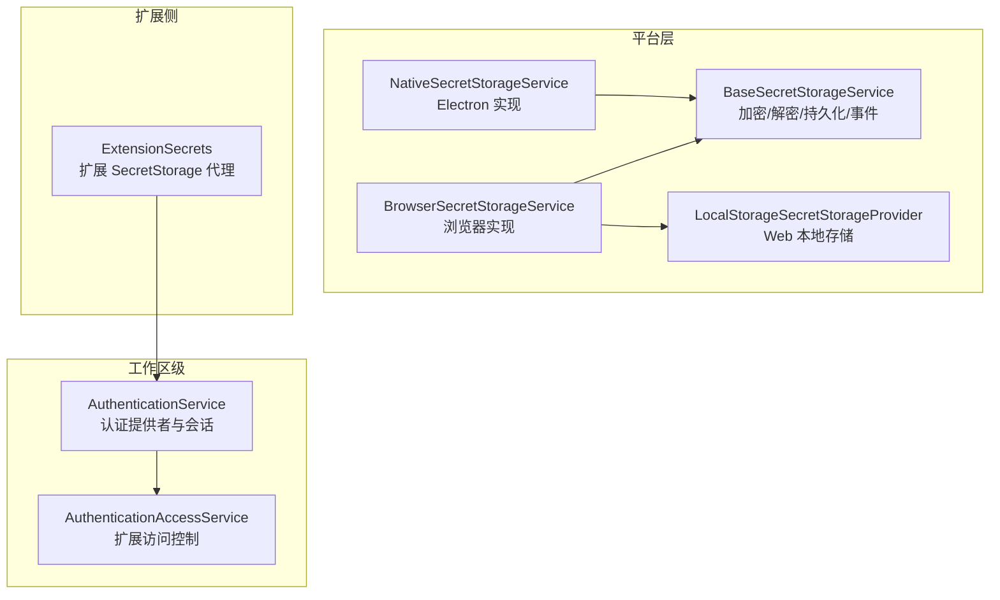
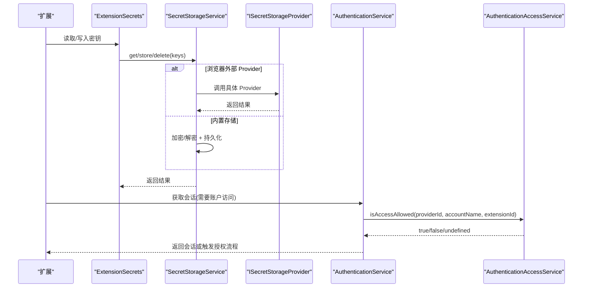
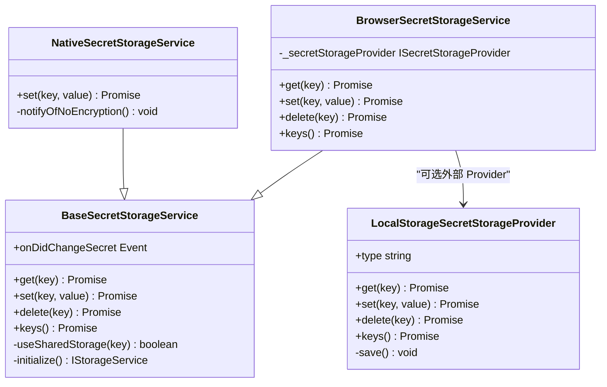
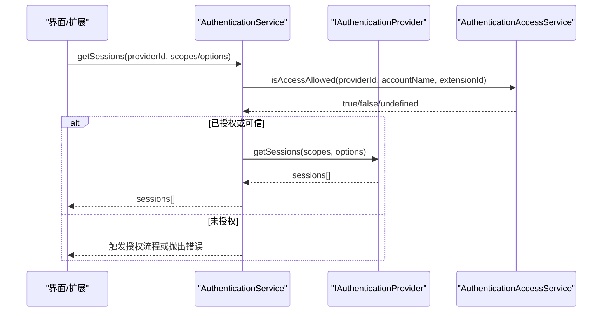
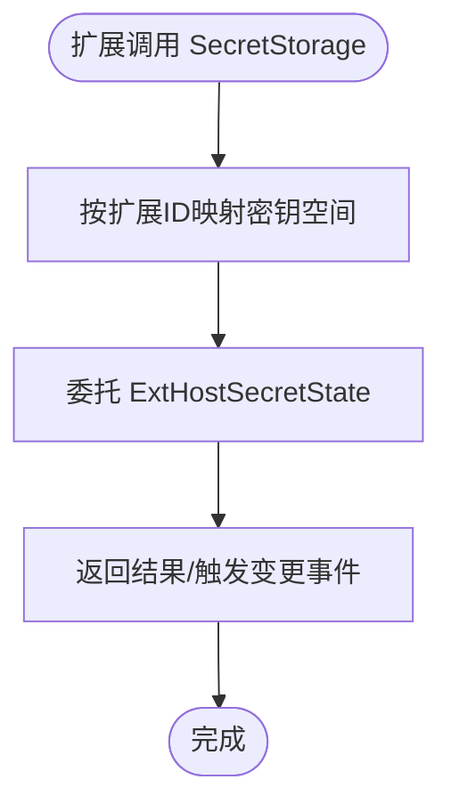
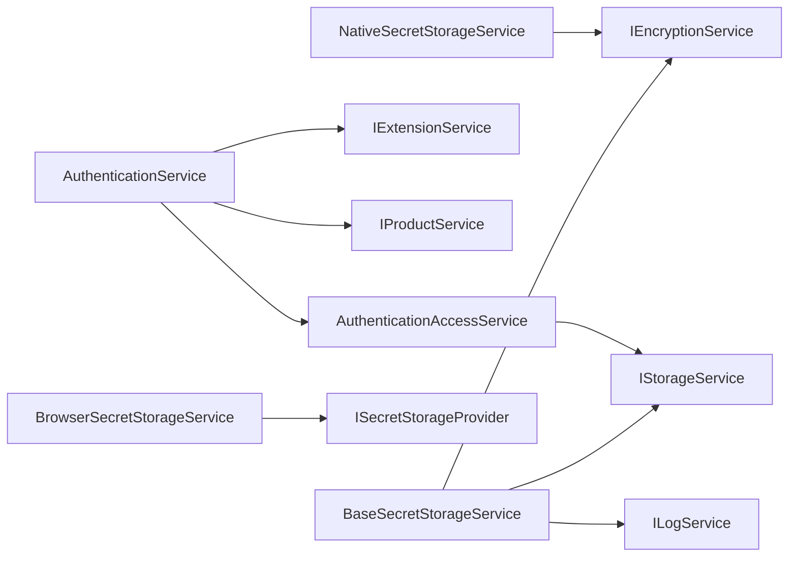

# 权限控制与访问管理

<cite>
**本文引用的文件**   
- [secrets.ts](file://src/vs/platform/secrets/common/secrets.ts)
- [secretStorageService.ts（浏览器）](file://src/vs/workbench/services/secrets/browser/secretStorageService.ts)
- [secretStorageService.ts（Electron 原生）](file://src/vs/workbench/services/secrets/electron-browser/secretStorageService.ts)
- [workbench.ts（Web 工作区）](file://src/vs/code/browser/workbench/workbench.ts)
- [authenticationService.ts](file://src/vs/workbench/services/authentication/browser/authenticationService.ts)
- [authenticationAccessService.ts](file://src/vs/workbench/services/authentication/browser/authenticationAccessService.ts)
- [extHostSecrets.ts](file://src/vs/workbench/api/common/extHostSecrets.ts)
</cite>

## 目录
1. [引言](#引言)
2. [项目结构](#项目结构)
3. [核心组件](#核心组件)
4. [架构总览](#架构总览)
5. [详细组件分析](#详细组件分析)
6. [依赖关系分析](#依赖关系分析)
7. [性能与安全特性](#性能与安全特性)
8. [故障排查指南](#故障排查指南)
9. [结论](#结论)
10. [附录：权限配置最佳实践](#附录权限配置最佳实践)

## 引言
本文件系统性梳理 Kodrix 的权限模型与访问控制机制，重点覆盖以下方面：
- 敏感信息存储与加密：SecretStorage 体系、跨应用共享密钥、浏览器与 Electron 差异。
- 认证与会话：认证提供者注册、会话获取、扩展对账户的访问控制。
- 扩展权限边界：扩展如何安全地读写自身隔离的 Secret Storage，以及通过认证服务访问受控资源。
- 权限审计与监控：变更事件、日志记录、用户提示与可观测性建议。
- 扩展权限模型：以“声明式提供者 + 显式授权”的方式限制扩展对系统资源的访问。

## 项目结构
围绕权限与访问控制的代码主要分布在以下模块：
- 平台层 Secrets 抽象与实现：提供统一的加密/解密、持久化、事件通知能力。
- 工作区级认证服务：统一认证提供者生命周期、会话管理与扩展访问控制。
- 扩展侧 API 代理：为扩展暴露安全的 Secret Storage 接口。
- Web 工作区本地存储提供者：在浏览器环境下使用 localStorage 与前端加密封装。

图表来源
- [secrets.ts:101-258](file://src/vs/platform/secrets/common/secrets.ts#L101-L258)
- [secretStorageService.ts（浏览器）:14-86](file://src/vs/workbench/services/secrets/browser/secretStorageService.ts#L14-L86)
- [secretStorageService.ts（Electron 原生）:21-105](file://src/vs/workbench/services/secrets/electron-browser/secretStorageService.ts#L21-L105)
- [workbench.ts:189-293](file://src/vs/code/browser/workbench/workbench.ts#L189-L293)
- [authenticationService.ts:93-496](file://src/vs/workbench/services/authentication/browser/authenticationService.ts#L93-L496)
- [authenticationAccessService.ts:37-146](file://src/vs/workbench/services/authentication/browser/authenticationAccessService.ts#L37-L146)
- [extHostSecrets.ts:13-51](file://src/vs/workbench/api/common/extHostSecrets.ts#L13-L51)

章节来源
- [secrets.ts:1-259](file://src/vs/platform/secrets/common/secrets.ts#L1-L259)
- [secretStorageService.ts（浏览器）:1-87](file://src/vs/workbench/services/secrets/browser/secretStorageService.ts#L1-L87)
- [secretStorageService.ts（Electron 原生）:1-106](file://src/vs/workbench/services/secrets/electron-browser/secretStorageService.ts#L1-L106)
- [workbench.ts:180-379](file://src/vs/code/browser/workbench/workbench.ts#L180-L379)
- [authenticationService.ts:1-497](file://src/vs/workbench/services/authentication/browser/authenticationService.ts#L1-L497)
- [authenticationAccessService.ts:1-147](file://src/vs/workbench/services/authentication/browser/authenticationAccessService.ts#L1-L147)
- [extHostSecrets.ts:1-52](file://src/vs/workbench/api/common/extHostSecrets.ts#L1-L52)

## 核心组件
- BaseSecretStorageService：统一封装加密/解密、存储作用域、跨应用共享密钥、变更事件与键序列化处理。
- BrowserSecretStorageService：浏览器环境下的 SecretStorage 实现，支持可选的外部 provider 与内存模式。
- NativeSecretStorageService：Electron 环境下的实现，负责检测系统密钥环可用性并引导用户配置。
- LocalStorageSecretStorageProvider：Web 工作区中基于 localStorage 的加密存储提供者。
- AuthenticationService：认证提供者注册、动态创建、会话获取与激活流程。
- AuthenticationAccessService：扩展对账户访问的白名单与信任列表管理。
- ExtensionSecrets：扩展侧 SecretStorage 代理，按扩展隔离读写。

章节来源
- [secrets.ts:101-258](file://src/vs/platform/secrets/common/secrets.ts#L101-L258)
- [secretStorageService.ts（浏览器）:14-86](file://src/vs/workbench/services/secrets/browser/secretStorageService.ts#L14-L86)
- [secretStorageService.ts（Electron 原生）:21-105](file://src/vs/workbench/services/secrets/electron-browser/secretStorageService.ts#L21-L105)
- [workbench.ts:189-293](file://src/vs/code/browser/workbench/workbench.ts#L189-L293)
- [authenticationService.ts:93-496](file://src/vs/workbench/services/authentication/browser/authenticationService.ts#L93-L496)
- [authenticationAccessService.ts:37-146](file://src/vs/workbench/services/authentication/browser/authenticationAccessService.ts#L37-L146)
- [extHostSecrets.ts:13-51](file://src/vs/workbench/api/common/extHostSecrets.ts#L13-L51)

## 架构总览
Kodrix 的权限与访问控制采用分层设计：
- 平台层 Secrets 抽象：屏蔽底层存储差异（内存、磁盘、localStorage），对外暴露一致的 get/set/delete/keys 与变更事件。
- 工作区级认证服务：统一管理认证提供者，提供会话查询与创建，并通过访问控制服务限制扩展对账户的访问。
- 扩展侧代理：扩展仅能访问自身命名空间下的密钥，且需经用户或产品策略授权才能访问特定账户。

图表来源
- [extHostSecrets.ts:13-51](file://src/vs/workbench/api/common/extHostSecrets.ts#L13-L51)
- [secretStorageService.ts（浏览器）:14-86](file://src/vs/workbench/services/secrets/browser/secretStorageService.ts#L14-L86)
- [secrets.ts:101-258](file://src/vs/platform/secrets/common/secrets.ts#L101-L258)
- [authenticationService.ts:277-328](file://src/vs/workbench/services/authentication/browser/authenticationService.ts#L277-L328)
- [authenticationAccessService.ts:50-72](file://src/vs/workbench/services/authentication/browser/authenticationAccessService.ts#L50-L72)

## 详细组件分析

### SecretStorage 体系
- BaseSecretStorageService
  - 职责：统一加密/解密、存储作用域（APPLICATION / APPLICATION_SHARED）、跨应用共享密钥、变更事件 onDidChangeSecret、键级序列化避免并发冲突。
  - 关键点：
    - 当加密不可用时回退到内存存储；浏览器默认无加密，使用内存模式或外部 Provider。
    - 跨应用共享密钥仅在 Windows 下生效，用于主进程与工作区之间的密钥同步。
    - 所有操作均通过 SequencerByKey 串行化，保证同一 key 的操作顺序。
- BrowserSecretStorageService
  - 职责：浏览器环境适配，支持注入 ISecretStorageProvider（如 LocalStorageSecretStorageProvider）。
  - 关键点：若存在外部 Provider，则 get/set/delete/keys 委托给 Provider，并在 set/delete 后触发变更事件。
- NativeSecretStorageService
  - 职责：Electron 环境适配，检测系统密钥环可用性，必要时提示用户并引导配置。
  - 关键点：在未启用加密时仅记录日志并提示一次；Linux 下可根据桌面环境给出更具体的错误与建议。
- LocalStorageSecretStorageProvider
  - 职责：Web 工作区中将密钥持久化到 localStorage，并使用前端加密封装。
  - 关键点：从页面元素注入初始认证会话数据，合并到本地存储；失败时清理损坏数据。

图表来源
- [secrets.ts:101-258](file://src/vs/platform/secrets/common/secrets.ts#L101-L258)
- [secretStorageService.ts（浏览器）:14-86](file://src/vs/workbench/services/secrets/browser/secretStorageService.ts#L14-L86)
- [secretStorageService.ts（Electron 原生）:21-105](file://src/vs/workbench/services/secrets/electron-browser/secretStorageService.ts#L21-L105)
- [workbench.ts:189-293](file://src/vs/code/browser/workbench/workbench.ts#L189-L293)

章节来源
- [secrets.ts:1-259](file://src/vs/platform/secrets/common/secrets.ts#L1-L259)
- [secretStorageService.ts（浏览器）:1-87](file://src/vs/workbench/services/secrets/browser/secretStorageService.ts#L1-L87)
- [secretStorageService.ts（Electron 原生）:1-106](file://src/vs/workbench/services/secrets/electron-browser/secretStorageService.ts#L1-L106)
- [workbench.ts:180-379](file://src/vs/code/browser/workbench/workbench.ts#L180-L379)

### 认证与会话访问控制
- AuthenticationService
  - 职责：注册/注销认证提供者、动态创建提供者、会话获取与创建、根据授权服务器匹配提供者。
  - 关键点：
    - 通过扩展点声明式注册认证提供者，支持延迟激活。
    - 支持 WWW-Authenticate 挑战解析与从挑战恢复会话。
    - 会话获取前校验授权服务器是否被提供者支持。
- AuthenticationAccessService
  - 职责：维护扩展对账户的访问白名单与信任列表，持久化用户选择。
  - 关键点：
    - 支持 product.json 中的 trustedExtensionAuthAccess 作为信任源。
    - 用户允许/拒绝扩展访问账户后，持久化到存储并触发变更事件。
    - 读取允许列表时合并产品信任列表，确保可信扩展始终拥有访问权。

图表来源
- [authenticationService.ts:277-328](file://src/vs/workbench/services/authentication/browser/authenticationService.ts#L277-L328)
- [authenticationAccessService.ts:50-72](file://src/vs/workbench/services/authentication/browser/authenticationAccessService.ts#L50-L72)

章节来源
- [authenticationService.ts:1-497](file://src/vs/workbench/services/authentication/browser/authenticationService.ts#L1-L497)
- [authenticationAccessService.ts:1-147](file://src/vs/workbench/services/authentication/browser/authenticationAccessService.ts#L1-L147)

### 扩展 SecretStorage 代理
- ExtensionSecrets
  - 职责：为每个扩展提供隔离的 SecretStorage 实例，映射到 ExtHostSecretState。
  - 关键点：
    - 通过扩展标识符隔离密钥空间。
    - 将 onDidChange 事件过滤为当前扩展的密钥变更。
    - 所有 get/store/delete/keys 操作委托给状态管理器。

图表来源
- [extHostSecrets.ts:13-51](file://src/vs/workbench/api/common/extHostSecrets.ts#L13-L51)

章节来源
- [extHostSecrets.ts:1-52](file://src/vs/workbench/api/common/extHostSecrets.ts#L1-L52)

## 依赖关系分析
- Secrets 层依赖：
  - IEncryptionService：决定加密可用性与算法。
  - IStorageService：决定持久化作用域（APPLICATION / APPLICATION_SHARED）与目标（USER / MACHINE）。
  - ILogService：记录加密/解密/存储操作的 trace 与 error。
- 认证层依赖：
  - IExtensionService：按需激活认证提供者。
  - IProductService：读取 trustedExtensionAuthAccess 等产品信息。
  - IStorageService：持久化扩展访问白名单。
- 浏览器/原生差异：
  - 浏览器：默认无加密，使用内存存储或外部 Provider（如 LocalStorageSecretStorageProvider）。
  - Electron：优先使用系统密钥环，不可用时提示用户并提供降级选项。

图表来源
- [secrets.ts:101-258](file://src/vs/platform/secrets/common/secrets.ts#L101-L258)
- [authenticationService.ts:93-496](file://src/vs/workbench/services/authentication/browser/authenticationService.ts#L93-L496)
- [authenticationAccessService.ts:37-146](file://src/vs/workbench/services/authentication/browser/authenticationAccessService.ts#L37-L146)
- [secretStorageService.ts（浏览器）:14-86](file://src/vs/workbench/services/secrets/browser/secretStorageService.ts#L14-L86)
- [secretStorageService.ts（Electron 原生）:21-105](file://src/vs/workbench/services/secrets/electron-browser/secretStorageService.ts#L21-L105)

章节来源
- [secrets.ts:1-259](file://src/vs/platform/secrets/common/secrets.ts#L1-L259)
- [authenticationService.ts:1-497](file://src/vs/workbench/services/authentication/browser/authenticationService.ts#L1-L497)
- [authenticationAccessService.ts:1-147](file://src/vs/workbench/services/authentication/browser/authenticationAccessService.ts#L1-L147)
- [secretStorageService.ts（浏览器）:1-87](file://src/vs/workbench/services/secrets/browser/secretStorageService.ts#L1-L87)
- [secretStorageService.ts（Electron 原生）:1-106](file://src/vs/workbench/services/secrets/electron-browser/secretStorageService.ts#L1-L106)

## 性能与安全特性
- 性能
  - 键级序列化：BaseSecretStorageService 使用 SequencerByKey 对同一 key 的操作串行化，避免并发写冲突。
  - 惰性初始化：存储服务的初始化延迟到首次使用时进行，减少启动开销。
  - 浏览器外部 Provider：可通过 ISecretStorageProvider 将存储逻辑卸载到宿主环境，降低工作区负担。
- 安全
  - 加密优先：Electron 环境下优先使用系统密钥环；不可用时回退到内存存储并提示用户。
  - 跨应用共享密钥：Windows 下支持主进程与工作区共享特定密钥，但仅限白名单 keys。
  - 扩展隔离：ExtensionSecrets 按扩展 ID 隔离密钥空间，防止扩展间互相窥探。
  - 访问控制：AuthenticationAccessService 结合产品信任列表与用户白名单，精确控制扩展对账户的访问。

[本节为通用指导，不直接分析具体文件]

## 故障排查指南
- 浏览器环境无法持久化密钥
  - 现象：get/set 行为符合预期但重启后丢失。
  - 原因：浏览器默认无加密，使用内存存储或未配置外部 Provider。
  - 处理：配置 ISecretStorageProvider（如 LocalStorageSecretStorageProvider），并确保前端加密可用。
  - 参考路径：[secretStorageService.ts（浏览器）:14-86](file://src/vs/workbench/services/secrets/browser/secretStorageService.ts#L14-L86)、[workbench.ts:189-293](file://src/vs/code/browser/workbench/workbench.ts#L189-L293)
- Electron 环境未检测到系统密钥环
  - 现象：设置密钥时弹出错误提示，或仅记录日志。
  - 原因：桌面环境未安装或不支持 gnome-keyring/kwallet/libsecret。
  - 处理：安装兼容的密钥环服务，或在 Linux 下选择较弱加密方案（basic text）。
  - 参考路径：[secretStorageService.ts（Electron 原生）:41-102](file://src/vs/workbench/services/secrets/electron-browser/secretStorageService.ts#L41-L102)
- 扩展无法访问账户会话
  - 现象：getSessions 返回空或触发授权流程。
  - 原因：扩展未在 trustedExtensionAuthAccess 中，也未获得用户允许。
  - 处理：在 product.json 中添加信任扩展，或通过 UI 授予扩展访问权限。
  - 参考路径：[authenticationAccessService.ts:50-137](file://src/vs/workbench/services/authentication/browser/authenticationAccessService.ts#L50-L137)、[authenticationService.ts:277-328](file://src/vs/workbench/services/authentication/browser/authenticationService.ts#L277-L328)

章节来源
- [secretStorageService.ts（浏览器）:14-86](file://src/vs/workbench/services/secrets/browser/secretStorageService.ts#L14-L86)
- [secretStorageService.ts（Electron 原生）:41-102](file://src/vs/workbench/services/secrets/electron-browser/secretStorageService.ts#L41-L102)
- [workbench.ts:189-293](file://src/vs/code/browser/workbench/workbench.ts#L189-L293)
- [authenticationAccessService.ts:50-137](file://src/vs/workbench/services/authentication/browser/authenticationAccessService.ts#L50-L137)
- [authenticationService.ts:277-328](file://src/vs/workbench/services/authentication/browser/authenticationService.ts#L277-L328)

## 结论
Kodrix 的权限与访问控制以 Secrets 抽象为核心，结合认证服务与扩展访问控制，形成清晰的边界与可观测性。通过加密优先、扩展隔离、信任列表与用户白名单的组合，既保证了安全性，又兼顾了易用性。建议在部署与使用中遵循本文的最佳实践，确保不同组件的访问权限正确配置，并建立完善的审计与监控机制。

[本节为总结性内容，不直接分析具体文件]

## 附录：权限配置最佳实践
- SecretStorage 配置
  - 浏览器环境：务必配置 ISecretStorageProvider，确保密钥持久化与前端加密可用。
  - Electron 环境：确保系统密钥环服务正常运行；如需降级，谨慎评估安全风险。
  - 跨应用共享：仅在 Windows 下使用 CROSS_APP_SHARED_SECRET_KEYS 白名单内的密钥。
- 认证与会话
  - 在 product.json 中声明 trustedExtensionAuthAccess，将可信扩展加入白名单。
  - 对用户授予扩展访问权限后，避免频繁修改，以减少不必要的授权弹窗。
- 扩展开发
  - 使用 ExtensionSecrets 访问密钥，不要绕过代理直接访问底层存储。
  - 在需要访问账户会话时，先检查 isAccessAllowed，再调用 getSessions。
- 审计与监控
  - 监听 onDidChangeSecret 与 onDidChangeExtensionSessionAccess 事件，记录密钥与访问变化。
  - 结合 ILogService 的 trace/error 输出，定位加密/解密/存储异常。

[本节为通用指导，不直接分析具体文件]