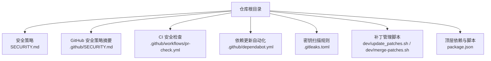
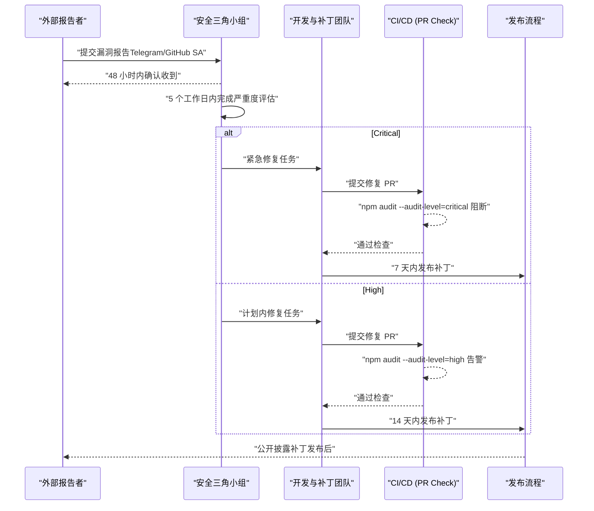
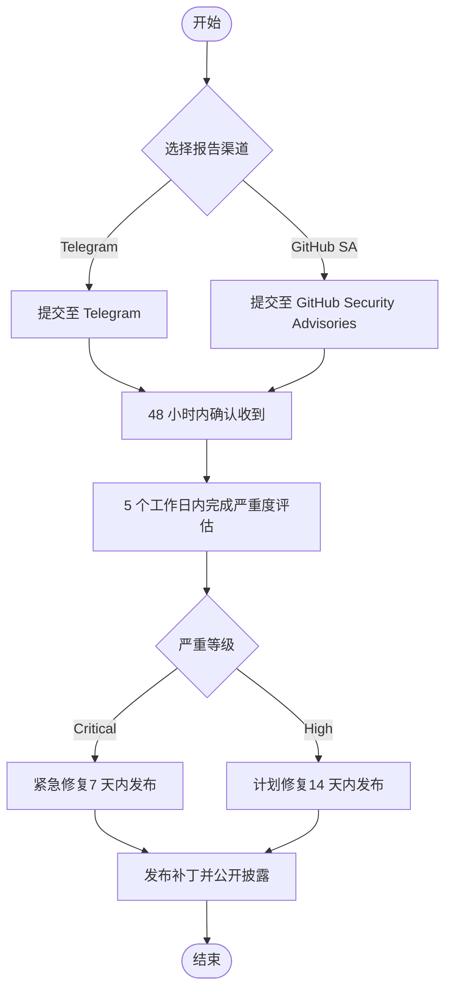
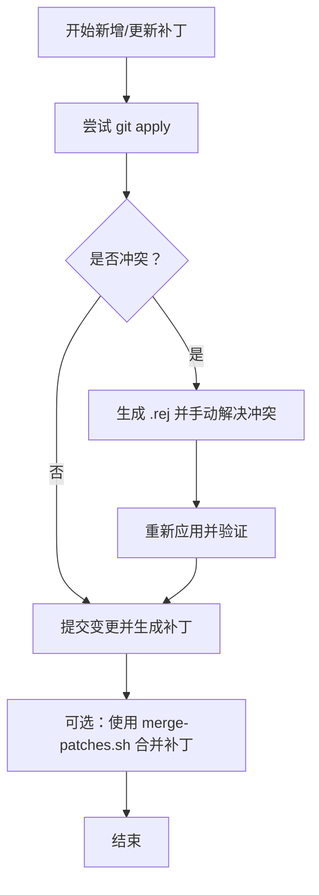
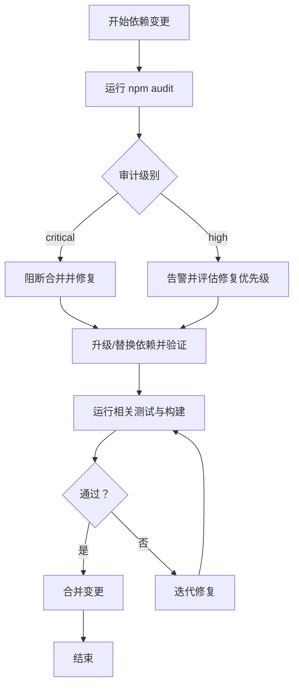
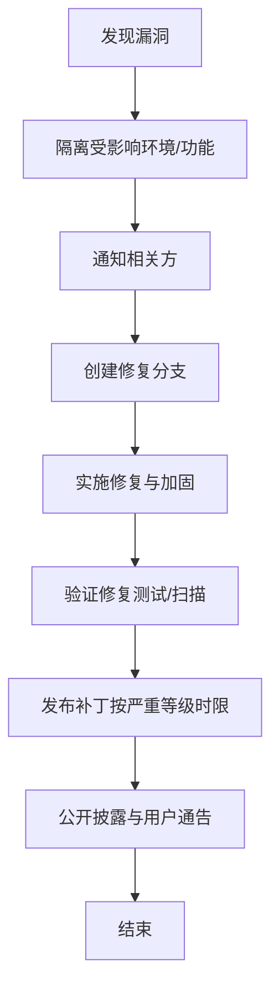
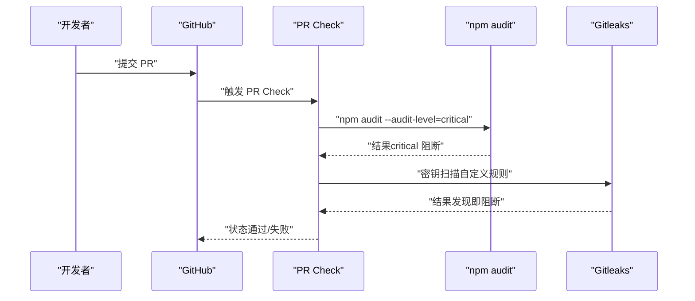
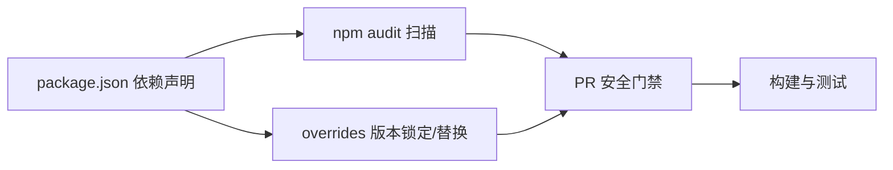

# 漏洞管理与应急响应

<cite>
**本文引用的文件**
- [SECURITY.md](file://SECURITY.md)
- [.github/SECURITY.md](file://.github/SECURITY.md)
- [.github/workflows/pr-check.yml](file://.github/workflows/pr-check.yml)
- [.github/dependabot.yml](file://.github/dependabot.yml)
- [.gitleaks.toml](file://.gitleaks.toml)
- [package.json](file://package.json)
- [dev/update_patches.sh](file://dev/update_patches.sh)
- [dev/merge-patches.sh](file://dev/merge-patches.sh)
</cite>

## 目录
1. [简介](#简介)
2. [项目结构](#项目结构)
3. [核心组件](#核心组件)
4. [架构总览](#架构总览)
5. [详细组件分析](#详细组件分析)
6. [依赖分析](#依赖分析)
7. [性能考虑](#性能考虑)
8. [故障排查指南](#故障排查指南)
9. [结论](#结论)
10. [附录](#附录)

## 简介
本文件面向 Kodrix 项目的安全治理与应急响应，覆盖以下主题：
- 漏洞报告渠道、响应时限与严重性评估
- 安全补丁管理（上游修复维护与本地补丁）
- 依赖安全管理（npm audit、Dependabot）
- 应急响应预案（发现漏洞后的快速处置流程）
- 安全扫描与审计配置（CI/CD 集成）

## 项目结构
与安全相关的仓库级配置与流程主要分布在如下位置：
- 根目录安全策略与贡献者实践：SECURITY.md
- GitHub 侧安全策略摘要：.github/SECURITY.md
- CI/CD 安全检查：.github/workflows/pr-check.yml
- 依赖更新自动化：.github/dependabot.yml
- 密钥扫描规则：.gitleaks.toml
- 构建与补丁工具：dev/update_patches.sh、dev/merge-patches.sh
- 顶层依赖声明与脚本入口：package.json

**图表来源**
- [SECURITY.md:1-65](file://SECURITY.md#L1-L65)
- [.github/SECURITY.md:1-11](file://.github/SECURITY.md#L1-L11)
- [.github/workflows/pr-check.yml:1-85](file://.github/workflows/pr-check.yml#L1-L85)
- [.github/dependabot.yml:1-10](file://.github/dependabot.yml#L1-L10)
- [.gitleaks.toml:1-46](file://.gitleaks.toml#L1-L46)
- [dev/update_patches.sh:1-240](file://dev/update_patches.sh#L1-L240)
- [dev/merge-patches.sh:1-65](file://dev/merge-patches.sh#L1-L65)
- [package.json:1-295](file://package.json#L1-L295)

**章节来源**
- [SECURITY.md:1-65](file://SECURITY.md#L1-L65)
- [.github/SECURITY.md:1-11](file://.github/SECURITY.md#L1-L11)
- [.github/workflows/pr-check.yml:1-85](file://.github/workflows/pr-check.yml#L1-L85)
- [.github/dependabot.yml:1-10](file://.github/dependabot.yml#L1-L10)
- [.gitleaks.toml:1-46](file://.gitleaks.toml#L1-L46)
- [dev/update_patches.sh:1-240](file://dev/update_patches.sh#L1-L240)
- [dev/merge-patches.sh:1-65](file://dev/merge-patches.sh#L1-L65)
- [package.json:1-295](file://package.json#L1-L295)

## 核心组件
- 漏洞报告与响应
  - 报告渠道：Telegram 私信优先；若不可达则使用 GitHub Security Advisories。禁止公开 Issue 披露利用细节。
  - 响应时限：48 小时内确认收到；5 个工作日内完成确认与严重度评估；Critical 补丁 7 天内发布；High 补丁 14 天内发布；公开披露在补丁发布之后。
  - 范围：Kodrix IDE、Kodrix 扩展、本仓库的构建与 CI/CD 代码。
- 依赖安全管理
  - 通过 npm audit 在 PR Check 中执行，critical 级别阻断合并，high 级别告警不阻断。
  - 使用 Dependabot 对 GitHub Actions 进行周度更新。
- 安全扫描与审计
  - Secret scanning：Gitleaks 结合自定义规则 .gitleaks.toml 在 PR 阶段运行。
- 补丁管理
  - 通过 dev/update_patches.sh 与 dev/merge-patches.sh 管理本地补丁，支持冲突检测、生成 reject 文件与重新应用。

**章节来源**
- [SECURITY.md:9-65](file://SECURITY.md#L9-L65)
- [.github/workflows/pr-check.yml:63-85](file://.github/workflows/pr-check.yml#L63-L85)
- [.github/dependabot.yml:1-10](file://.github/dependabot.yml#L1-L10)
- [.gitleaks.toml:1-46](file://.gitleaks.toml#L1-L46)
- [dev/update_patches.sh:1-240](file://dev/update_patches.sh#L1-L240)
- [dev/merge-patches.sh:1-65](file://dev/merge-patches.sh#L1-L65)

## 架构总览
下图展示了从漏洞报告到修复发布的端到端流程，以及 CI/CD 中的安全门禁点。

**图表来源**
- [SECURITY.md:28-36](file://SECURITY.md#L28-L36)
- [.github/workflows/pr-check.yml:63-85](file://.github/workflows/pr-check.yml#L63-L85)

## 详细组件分析

### 漏洞报告与响应流程
- 报告渠道与要求
  - 优先 Telegram 私信；不可达时使用 GitHub Security Advisories。
  - 报告需包含：清晰描述、复现步骤、受影响组件/版本、潜在影响、建议缓解措施。
- 响应时限
  - 48 小时确认收到；5 个工作日完成确认与严重度评估；Critical 7 天、High 14 天发布补丁；公开披露在补丁发布之后。
- 范围与不在范围
  - 范围包括 IDE、扩展与构建/CI 代码；上游 VS Code 与第三方 npm 依赖走各自渠道。

**图表来源**
- [SECURITY.md:9-36](file://SECURITY.md#L9-L36)

**章节来源**
- [SECURITY.md:9-36](file://SECURITY.md#L9-L36)
- [.github/SECURITY.md:1-11](file://.github/SECURITY.md#L1-L11)

### 安全补丁管理（上游修复与本地补丁）
- 本地补丁管理
  - 使用 dev/update_patches.sh 批量应用 patches 目录下的补丁，自动处理冲突并生成 .rej 文件，必要时回退并重新生成补丁。
  - 使用 dev/merge-patches.sh 将多个补丁合并为单一补丁，便于审查与回溯。
- 上游修复维护
  - 对于上游 VS Code 的安全问题，按 SECURITY.md 指引向 MSRC 报告；本项目通过补丁机制临时缓解并在上游修复后移除本地补丁。
- 补丁组织
  - patches 目录按平台与目标分类，命名约定支持分组与顺序控制，便于 CI 与构建流程稳定应用。

**图表来源**
- [dev/update_patches.sh:84-136](file://dev/update_patches.sh#L84-L136)
- [dev/merge-patches.sh:19-65](file://dev/merge-patches.sh#L19-L65)

**章节来源**
- [dev/update_patches.sh:1-240](file://dev/update_patches.sh#L1-L240)
- [dev/merge-patches.sh:1-65](file://dev/merge-patches.sh#L1-L65)
- [SECURITY.md:51-55](file://SECURITY.md#L51-L55)

### 依赖安全管理（npm audit 与 Dependabot）
- npm audit
  - PR Check 中执行 npm audit --audit-level=critical，critical 失败阻断合并；high 仅告警不阻断。
  - 建议在本地开发时也运行 npm audit 并在合并前确保无 critical 问题。
- Dependabot
  - 对 GitHub Actions 进行每周更新，减少工作流依赖风险。
- 依赖升级策略
  - 优先采用最小改动原则升级依赖；对关键依赖（如网络库、序列化库）进行回归测试。
  - 对存在已知漏洞的依赖，优先升级到受影响的最低安全版本或替换为更安全的替代。

**图表来源**
- [.github/workflows/pr-check.yml:63-85](file://.github/workflows/pr-check.yml#L63-L85)
- [.github/dependabot.yml:1-10](file://.github/dependabot.yml#L1-L10)

**章节来源**
- [.github/workflows/pr-check.yml:63-85](file://.github/workflows/pr-check.yml#L63-L85)
- [.github/dependabot.yml:1-10](file://.github/dependabot.yml#L1-L10)
- [SECURITY.md:57-65](file://SECURITY.md#L57-L65)

### 应急响应预案
- 触发条件
  - 收到外部报告或内部检测到高危漏洞（如远程代码执行、权限提升、敏感信息泄露）。
- 快速响应步骤
  - 立即创建隔离分支用于修复；限制受影响服务的使用范围（如禁用不安全功能、关闭外部端点）。
  - 同步通知相关方（产品、运维、合规），制定回滚与热修复方案。
  - 在 CI 中启用更严格的审计级别（如强制 high 阻断）直至修复完成。
- 修复与验证
  - 优先采用最小化补丁；补充单元测试与集成测试；进行回归测试与渗透测试。
- 发布与披露
  - 按严重等级在规定时限内发布补丁；补丁发布后进行公开披露与用户通告。

[此图为概念流程图，不直接映射具体源码]

### 安全扫描与审计配置（CI/CD 集成）
- PR Check 安全门禁
  - 执行 ESLint 与 TypeScript 编译检查。
  - 运行 npm audit（critical 阻断、high 告警）。
  - 运行 Gitleaks 密钥扫描，使用自定义规则 .gitleaks.toml。
- 建议增强
  - 在 nightly 或 release 流水线增加 SCA（软件成分分析）与二进制扫描。
  - 将安全扫描结果归档并纳入质量看板。

**图表来源**
- [.github/workflows/pr-check.yml:14-31](file://.github/workflows/pr-check.yml#L14-L31)
- [.github/workflows/pr-check.yml:63-85](file://.github/workflows/pr-check.yml#L63-L85)
- [.gitleaks.toml:1-46](file://.gitleaks.toml#L1-L46)

**章节来源**
- [.github/workflows/pr-check.yml:14-31](file://.github/workflows/pr-check.yml#L14-L31)
- [.github/workflows/pr-check.yml:63-85](file://.github/workflows/pr-check.yml#L63-L85)
- [.gitleaks.toml:1-46](file://.gitleaks.toml#L1-L46)

## 依赖分析
- 直接依赖与安全风险面
  - 顶层 package.json 定义了运行时与开发时依赖，其中涉及网络通信、序列化、终端交互等高风险类别。
  - 通过 overrides 对特定依赖进行版本锁定或替换，以规避已知漏洞或不兼容问题。
- 依赖更新与治理
  - 使用 Dependabot 对 GitHub Actions 进行定期更新，降低工作流依赖风险。
  - 在 PR 阶段通过 npm audit 进行依赖漏洞扫描，critical 阻断合并。

**图表来源**
- [package.json:101-283](file://package.json#L101-L283)
- [.github/workflows/pr-check.yml:63-85](file://.github/workflows/pr-check.yml#L63-L85)

**章节来源**
- [package.json:101-283](file://package.json#L101-L283)
- [.github/workflows/pr-check.yml:63-85](file://.github/workflows/pr-check.yml#L63-L85)
- [.github/dependabot.yml:1-10](file://.github/dependabot.yml#L1-L10)

## 性能考虑
- 安全扫描应在 CI 中并行执行以减少整体流水线时长。
- 对 npm audit 的结果进行缓存与增量扫描，避免重复全量扫描。
- 补丁应用过程中尽量减少不必要的重建与测试，仅在关键路径触发完整回归。

[本节提供通用指导，不直接分析具体文件]

## 故障排查指南
- npm audit 失败
  - 定位具体依赖与漏洞等级；优先升级到安全版本或使用 overrides 锁定版本。
  - 若为误报，评估风险后在 CI 中调整阈值或添加例外（谨慎使用）。
- Gitleaks 告警
  - 根据规则 ID 判断是否为误报；必要时在 allowlist 中添加白名单路径或正则。
  - 对硬编码的回调地址、内部端点进行配置化改造。
- 补丁冲突
  - 使用 update_patches.sh 生成的 .rej 文件定位冲突；手动解决后重新生成补丁。
  - 使用 merge-patches.sh 合并多个补丁，便于审查与回溯。

**章节来源**
- [.github/workflows/pr-check.yml:63-85](file://.github/workflows/pr-check.yml#L63-L85)
- [.gitleaks.toml:24-46](file://.gitleaks.toml#L24-L46)
- [dev/update_patches.sh:84-136](file://dev/update_patches.sh#L84-L136)
- [dev/merge-patches.sh:19-65](file://dev/merge-patches.sh#L19-L65)

## 结论
Kodrix 项目在漏洞管理与应急响应方面已形成较为完善的体系：明确的报告渠道与时限、基于 npm audit 与 Gitleaks 的 CI 安全门禁、依赖更新的自动化机制，以及可追溯的补丁管理流程。建议持续强化上游修复跟踪、完善夜间扫描与发布前安全评审，进一步提升整体安全水位。

[本节总结性内容，不直接分析具体文件]

## 附录
- 参考文件
  - 安全策略与贡献者实践：SECURITY.md
  - GitHub 安全策略摘要：.github/SECURITY.md
  - PR 安全检查：.github/workflows/pr-check.yml
  - 依赖更新自动化：.github/dependabot.yml
  - 密钥扫描规则：.gitleaks.toml
  - 补丁管理脚本：dev/update_patches.sh、dev/merge-patches.sh
  - 顶层依赖与脚本：package.json

[本节列出参考文件，不直接分析具体文件]