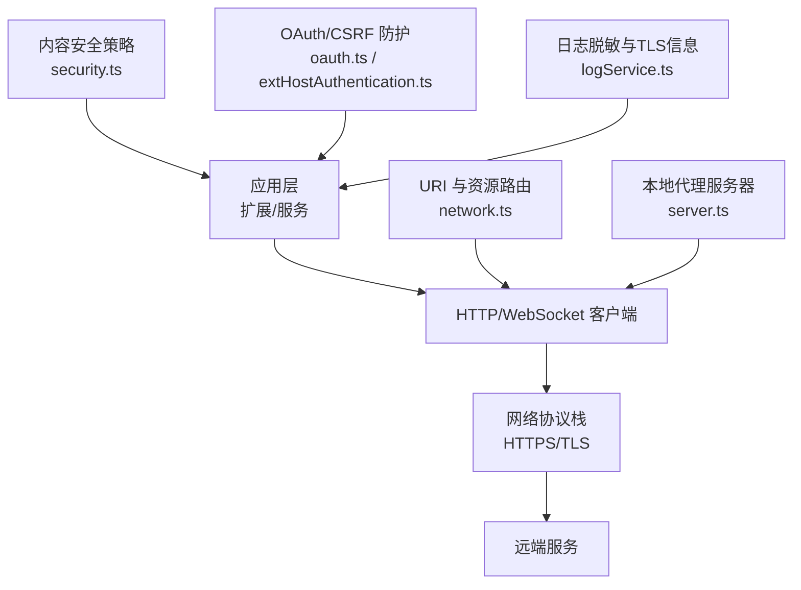
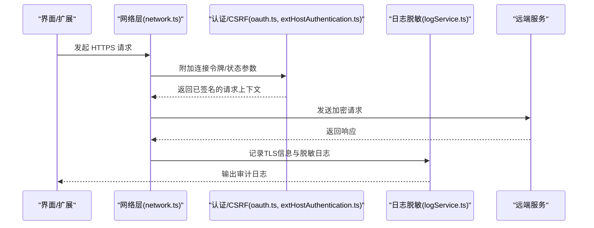
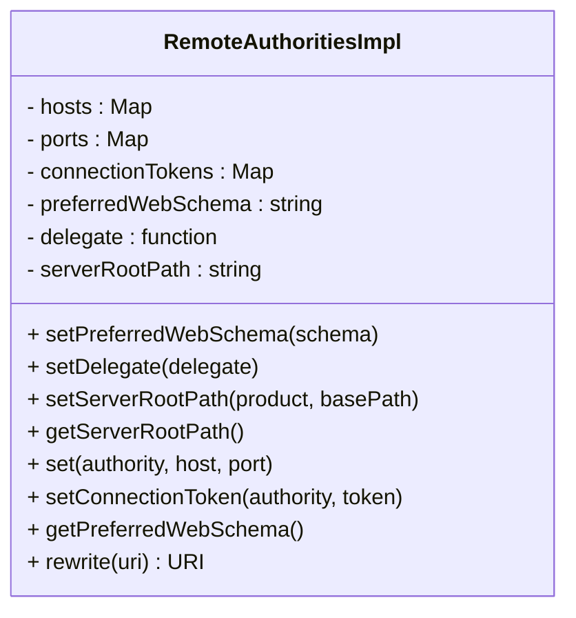
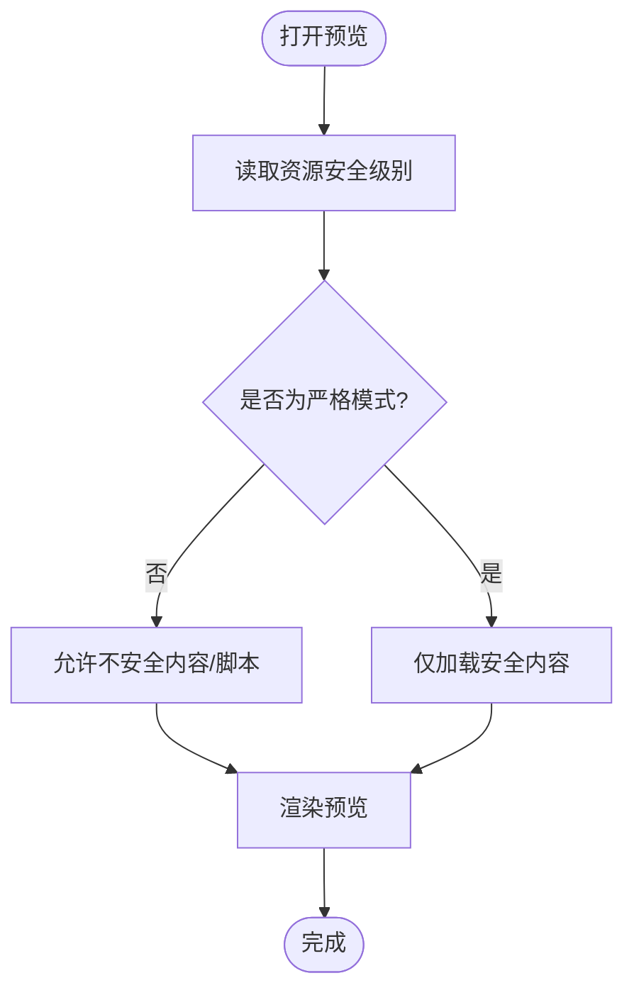
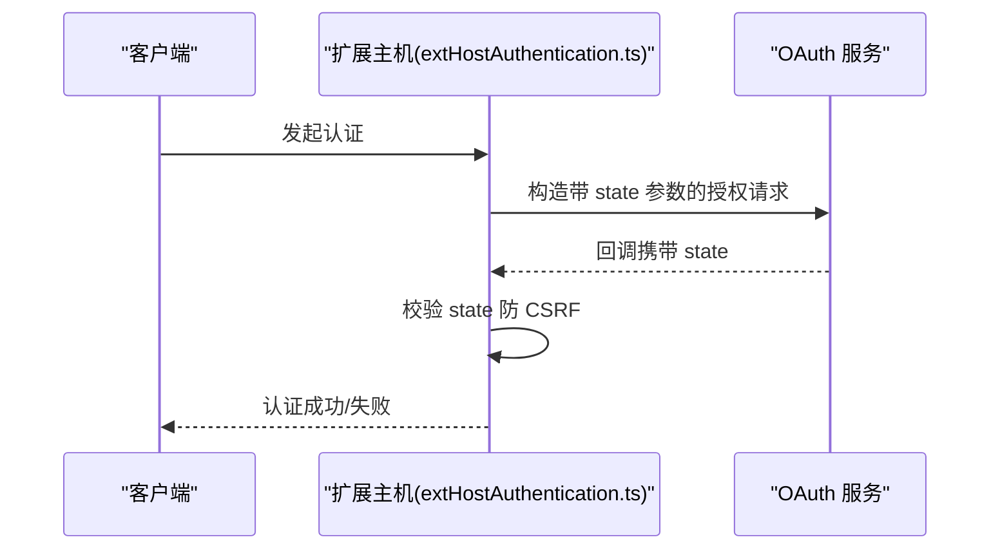
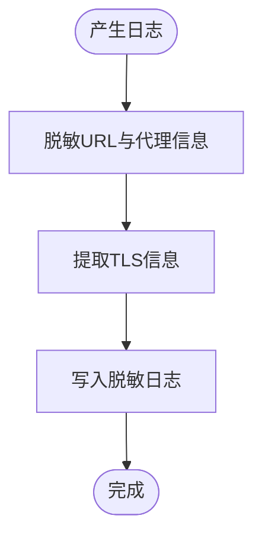
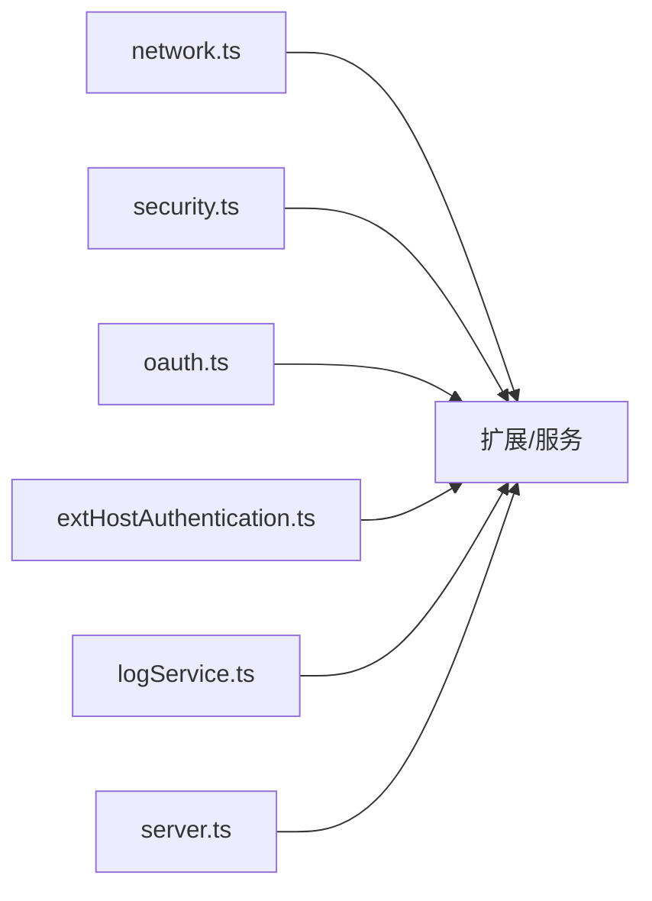

# 网络安全与通信安全

<cite>
**本文引用的文件**   
- [src/vs/base/common/network.ts](file://src/vs/base/common/network.ts)
- [extensions/markdown-language-features/src/preview/security.ts](file://extensions/markdown-language-features/src/preview/security.ts)
- [.claude/CLAUDE.md](file://.claude/CLAUDE.md)
- [src/vs/base/common/oauth.ts](file://src/vs/base/common/oauth.ts)
- [src/vs/workbench/api/common/extHostAuthentication.ts](file://src/vs/workbench/api/common/extHostAuthentication.ts)
- [src/vs/workbench/api/node/extHostAuthentication.ts](file://src/vs/workbench/api/node/extHostAuthentication.ts)
- [scripts/mock-policy-server/server.ts](file://scripts/mock-policy-server/server.ts)
- [extensions/copilot/src/platform/log/common/logService.ts](file://extensions/copilot/src/platform/log/common/logService.ts)
</cite>

## 目录
1. [简介](#简介)
2. [项目结构](#项目结构)
3. [核心组件](#核心组件)
4. [架构总览](#架构总览)
5. [详细组件分析](#详细组件分析)
6. [依赖关系分析](#依赖关系分析)
7. [性能与安全调优](#性能与安全调优)
8. [故障排查指南](#故障排查指南)
9. [结论](#结论)

## 简介
本文件聚焦 Kodrix 在网络安全与通信安全方面的设计与实现，覆盖以下关键主题：
- HTTPS 强制、证书校验与连接安全
- 请求签名与会话令牌机制
- 网络访问控制策略（扩展与服务）
- WebSocket 与 HTTP 通信的安全实现（连接建立、数据传输、会话管理）
- 常见网络攻击防护（XSS、CSRF、中间人攻击等）
- 网络安全配置与安全调优建议

## 项目结构
围绕网络安全与通信安全的代码主要分布在以下位置：
- 基础网络与 URI 处理：src/vs/base/common/network.ts
- Markdown 预览内容安全策略：extensions/markdown-language-features/src/preview/security.ts
- 安全开发规范与约束：.claude/CLAUDE.md
- OAuth 与 CSRF 防护：src/vs/base/common/oauth.ts、src/vs/workbench/api/common/extHostAuthentication.ts、src/vs/workbench/api/node/extHostAuthentication.ts
- 日志脱敏与 TLS 信息记录：extensions/copilot/src/platform/log/common/logService.ts
- 本地测试代理服务器（用于隔离与模拟）：scripts/mock-policy-server/server.ts

图示来源
- [src/vs/base/common/network.ts:184-254](file://src/vs/base/common/network.ts#L184-L254)
- [extensions/markdown-language-features/src/preview/security.ts:10-27](file://extensions/markdown-language-features/src/preview/security.ts#L10-L27)
- [src/vs/base/common/oauth.ts:521-521](file://src/vs/base/common/oauth.ts#L521-L521)
- [src/vs/workbench/api/common/extHostAuthentication.ts:652-652](file://src/vs/workbench/api/common/extHostAuthentication.ts#L652-L652)
- [src/vs/workbench/api/node/extHostAuthentication.ts:89-89](file://src/vs/workbench/api/node/extHostAuthentication.ts#L89-L89)
- [extensions/copilot/src/platform/log/common/logService.ts:412-414](file://extensions/copilot/src/platform/log/common/logService.ts#L412-L414)
- [scripts/mock-policy-server/server.ts:68-68](file://scripts/mock-policy-server/server.ts#L68-L68)

章节来源
- [src/vs/base/common/network.ts:184-254](file://src/vs/base/common/network.ts#L184-L254)
- [extensions/markdown-language-features/src/preview/security.ts:10-27](file://extensions/markdown-language-features/src/preview/security.ts#L10-L27)
- [.claude/CLAUDE.md:48-52](file://.claude/CLAUDE.md#L48-L52)

## 核心组件
- 网络协议与 URI 重写：通过 RemoteAuthorities 统一处理远程资源路径与连接令牌注入，支持 http/https 偏好设置。
- 内容安全策略仲裁：Markdown 预览提供严格/允许不安全内容/禁用脚本等多级 CSP 策略，并持久化工作区级别设置。
- OAuth 与 CSRF 防护：使用 state 参数防止 CSRF；认证流程中生成随机状态值。
- 日志脱敏与 TLS 信息：对日志中的敏感信息进行脱敏，记录 TLS 握手、证书状态等信息以便审计。
- 开发规范约束：要求所有网络请求具备超时与大小限制，禁止硬编码密钥与内部服务地址。

章节来源
- [src/vs/base/common/network.ts:184-254](file://src/vs/base/common/network.ts#L184-L254)
- [extensions/markdown-language-features/src/preview/security.ts:10-27](file://extensions/markdown-language-features/src/preview/security.ts#L10-L27)
- [src/vs/base/common/oauth.ts:521-521](file://src/vs/base/common/oauth.ts#L521-L521)
- [src/vs/workbench/api/common/extHostAuthentication.ts:652-652](file://src/vs/workbench/api/common/extHostAuthentication.ts#L652-L652)
- [src/vs/workbench/api/node/extHostAuthentication.ts:89-89](file://src/vs/workbench/api/node/extHostAuthentication.ts#L89-L89)
- [extensions/copilot/src/platform/log/common/logService.ts:412-414](file://extensions/copilot/src/platform/log/common/logService.ts#L412-L414)
- [.claude/CLAUDE.md:48-52](file://.claude/CLAUDE.md#L48-L52)

## 架构总览
Kodrix 的网络通信安全采用“协议层 + 应用层”双重保障：
- 协议层：优先使用 HTTPS/TLS，启用证书校验；必要时记录 TLS 细节用于审计。
- 应用层：通过 URI 重写与连接令牌注入确保身份与权限；通过 CSP 与 XSS/CSRF 防护降低前端风险；通过开发规范约束网络请求行为。

图示来源
- [src/vs/base/common/network.ts:184-254](file://src/vs/base/common/network.ts#L184-L254)
- [src/vs/base/common/oauth.ts:521-521](file://src/vs/base/common/oauth.ts#L521-L521)
- [src/vs/workbench/api/common/extHostAuthentication.ts:652-652](file://src/vs/workbench/api/common/extHostAuthentication.ts#L652-L652)
- [extensions/copilot/src/platform/log/common/logService.ts:412-414](file://extensions/copilot/src/platform/log/common/logService.ts#L412-L414)

## 详细组件分析

### 组件A：网络协议与 URI 重写（RemoteAuthorities）
- 功能要点
  - 支持设置首选 Web 协议为 http 或 https。
  - 将远程资源 URI 重写为统一的远程资源路径，并在查询参数中注入连接令牌。
  - 在 Web 环境下根据平台选择 http/https 方案。
- 安全意义
  - 通过集中式 URI 重写，确保所有远程资源访问都携带连接令牌，避免未授权访问。
  - 可配置首选协议，便于在生产环境强制使用 https。
- 复杂度与性能
  - 重写逻辑为 O(1) 的哈希查找与字符串拼接，开销极低。
- 错误处理
  - 委托函数异常被捕获并转为外部错误处理，避免中断主流程。

图示来源
- [src/vs/base/common/network.ts:184-254](file://src/vs/base/common/network.ts#L184-L254)

章节来源
- [src/vs/base/common/network.ts:184-254](file://src/vs/base/common/network.ts#L184-L254)

### 组件B：内容安全策略仲裁（Markdown 预览）
- 功能要点
  - 定义多级安全级别：严格、允许不安全本地内容、允许不安全内容、禁用（允许所有）。
  - 针对资源维度存储与读取安全级别，并提供是否禁用安全警告的配置。
  - 提供用户交互以选择安全级别并刷新预览。
- 安全意义
  - 通过 CSP 控制脚本执行与资源加载，降低 XSS 风险。
  - 默认严格模式，减少默认暴露面。
- 复杂度与性能
  - 基于 Memento 的状态存取，O(1) 操作；刷新预览时按需重渲染。
- 错误处理
  - 用户取消选择直接返回，不改变现有策略。

图示来源
- [extensions/markdown-language-features/src/preview/security.ts:10-27](file://extensions/markdown-language-features/src/preview/security.ts#L10-L27)
- [extensions/markdown-language-features/src/preview/security.ts:45-74](file://extensions/markdown-language-features/src/preview/security.ts#L45-L74)
- [extensions/markdown-language-features/src/preview/security.ts:105-164](file://extensions/markdown-language-features/src/preview/security.ts#L105-L164)

章节来源
- [extensions/markdown-language-features/src/preview/security.ts:10-27](file://extensions/markdown-language-features/src/preview/security.ts#L10-L27)
- [extensions/markdown-language-features/src/preview/security.ts:45-74](file://extensions/markdown-language-features/src/preview/security.ts#L45-L74)
- [extensions/markdown-language-features/src/preview/security.ts:105-164](file://extensions/markdown-language-features/src/preview/security.ts#L105-L164)

### 组件C：OAuth 与 CSRF 防护
- 功能要点
  - 在认证流程中使用 state 参数防止 CSRF 攻击。
  - 扩展主机在认证过程中生成随机状态值。
- 安全意义
  - 防止跨站请求伪造，确保认证流程由可信来源发起。
- 复杂度与性能
  - 状态值生成与校验为轻量操作，不影响整体性能。
- 错误处理
  - 若 state 校验失败，应拒绝认证回调并提示用户。

图示来源
- [src/vs/base/common/oauth.ts:521-521](file://src/vs/base/common/oauth.ts#L521-L521)
- [src/vs/workbench/api/common/extHostAuthentication.ts:652-652](file://src/vs/workbench/api/common/extHostAuthentication.ts#L652-L652)
- [src/vs/workbench/api/node/extHostAuthentication.ts:89-89](file://src/vs/workbench/api/node/extHostAuthentication.ts#L89-L89)

章节来源
- [src/vs/base/common/oauth.ts:521-521](file://src/vs/base/common/oauth.ts#L521-L521)
- [src/vs/workbench/api/common/extHostAuthentication.ts:652-652](file://src/vs/workbench/api/common/extHostAuthentication.ts#L652-L652)
- [src/vs/workbench/api/node/extHostAuthentication.ts:89-89](file://src/vs/workbench/api/node/extHostAuthentication.ts#L89-L89)

### 组件D：日志脱敏与 TLS 信息记录
- 功能要点
  - 对日志中的代理与 URL 信息进行脱敏，隐藏凭据与主机名。
  - 记录 TLS 相关信息（如证书状态、握手类型等），便于审计与排障。
- 安全意义
  - 防止敏感信息泄露到日志系统。
  - 提供 TLS 握手与证书状态的可见性，辅助检测中间人攻击。
- 复杂度与性能
  - 日志脱敏为字符串替换，开销低；TLS 信息记录仅在需要时采集。
- 错误处理
  - 若 TLS 信息缺失，跳过记录相关字段。

图示来源
- [extensions/copilot/src/platform/log/common/logService.ts:412-414](file://extensions/copilot/src/platform/log/common/logService.ts#L412-L414)
- [extensions/copilot/src/platform/log/common/logService.ts:557-566](file://extensions/copilot/src/platform/log/common/logService.ts#L557-L566)

章节来源
- [extensions/copilot/src/platform/log/common/logService.ts:412-414](file://extensions/copilot/src/platform/log/common/logService.ts#L412-L414)
- [extensions/copilot/src/platform/log/common/logService.ts:557-566](file://extensions/copilot/src/platform/log/common/logService.ts#L557-L566)

### 组件E：本地代理服务器（测试隔离）
- 功能要点
  - 提供本地代理服务，用于隔离与模拟策略服务器。
  - 静态资源保持同源以避免 CSRF 表面扩大。
- 安全意义
  - 在测试环境中避免引入真实网络风险，降低 CSRF 攻击面。
- 复杂度与性能
  - 简单转发与静态资源托管，性能开销小。
- 错误处理
  - 对无法解析的请求返回标准错误码。

章节来源
- [scripts/mock-policy-server/server.ts:68-68](file://scripts/mock-policy-server/server.ts#L68-L68)

## 依赖关系分析
- network.ts 作为底层网络与 URI 处理模块，被上层扩展与服务广泛依赖。
- security.ts 依赖 VS Code API 进行内容安全策略管理与用户交互。
- oauth.ts 与 extHostAuthentication.ts 共同构成认证与 CSRF 防护链路。
- logService.ts 依赖日志框架进行脱敏与 TLS 信息记录。
- server.ts 作为测试工具，独立于生产网络栈。

图示来源
- [src/vs/base/common/network.ts:184-254](file://src/vs/base/common/network.ts#L184-L254)
- [extensions/markdown-language-features/src/preview/security.ts:10-27](file://extensions/markdown-language-features/src/preview/security.ts#L10-L27)
- [src/vs/base/common/oauth.ts:521-521](file://src/vs/base/common/oauth.ts#L521-L521)
- [src/vs/workbench/api/common/extHostAuthentication.ts:652-652](file://src/vs/workbench/api/common/extHostAuthentication.ts#L652-L652)
- [extensions/copilot/src/platform/log/common/logService.ts:412-414](file://extensions/copilot/src/platform/log/common/logService.ts#L412-L414)
- [scripts/mock-policy-server/server.ts:68-68](file://scripts/mock-policy-server/server.ts#L68-L68)

章节来源
- [src/vs/base/common/network.ts:184-254](file://src/vs/base/common/network.ts#L184-L254)
- [extensions/markdown-language-features/src/preview/security.ts:10-27](file://extensions/markdown-language-features/src/preview/security.ts#L10-L27)
- [src/vs/base/common/oauth.ts:521-521](file://src/vs/base/common/oauth.ts#L521-L521)
- [src/vs/workbench/api/common/extHostAuthentication.ts:652-652](file://src/vs/workbench/api/common/extHostAuthentication.ts#L652-L652)
- [extensions/copilot/src/platform/log/common/logService.ts:412-414](file://extensions/copilot/src/platform/log/common/logService.ts#L412-L414)
- [scripts/mock-policy-server/server.ts:68-68](file://scripts/mock-policy-server/server.ts#L68-L68)

## 性能与安全调优
- HTTPS 强制与证书校验
  - 在 RemoteAuthorities 中设置首选协议为 https，确保所有远程资源访问走加密通道。
  - 结合 TLS 信息记录，监控证书状态与握手类型，及时发现异常。
- 请求签名与会话令牌
  - 通过 RemoteAuthorities.rewrite 注入连接令牌，确保请求不可伪造。
  - 在 OAuth 流程中使用 state 参数，防止 CSRF。
- 网络访问控制
  - 遵循开发规范：所有网络请求必须设置超时与大小限制，禁止硬编码密钥与内部服务地址。
  - 对 Markdown 预览等资源加载实施 CSP 分级策略，默认严格模式。
- XSS/CSRF 防护
  - 对用户输入进行转义与过滤，避免 XSS。
  - 在认证与表单提交中使用 CSRF token/state 校验。
- WebSocket 安全
  - 使用 wss:// 协议，启用 TLS；在服务端校验连接来源与令牌。
  - 对消息体进行大小限制与格式校验，防止注入攻击。

[本节为通用指导，无需具体文件引用]

## 故障排查指南
- 证书校验失败
  - 检查 TLS 信息记录，确认证书链与颁发者是否正确。
  - 确认服务端证书有效且未被吊销。
- CSRF 攻击告警
  - 检查 state 参数是否一致，确认认证回调来源可信。
- 日志泄露敏感信息
  - 确认日志脱敏规则生效，避免代理 URL 与凭据泄露。
- 预览内容加载失败
  - 检查 Markdown 预览安全级别设置，确认是否允许不安全内容。
- 本地代理问题
  - 确认 mock-policy-server 运行正常，静态资源同源策略正确。

章节来源
- [extensions/copilot/src/platform/log/common/logService.ts:412-414](file://extensions/copilot/src/platform/log/common/logService.ts#L412-L414)
- [extensions/copilot/src/platform/log/common/logService.ts:557-566](file://extensions/copilot/src/platform/log/common/logService.ts#L557-L566)
- [extensions/markdown-language-features/src/preview/security.ts:105-164](file://extensions/markdown-language-features/src/preview/security.ts#L105-L164)
- [scripts/mock-policy-server/server.ts:68-68](file://scripts/mock-policy-server/server.ts#L68-L68)

## 结论
Kodrix 在网络与通信安全方面采用了多层防护策略：
- 协议层强制 HTTPS/TLS，集中 URI 重写与连接令牌注入，确保传输安全与身份可信。
- 应用层通过 CSP、XSS/CSRF 防护与开发规范约束，降低前端与扩展的攻击面。
- 日志脱敏与 TLS 信息记录提供审计能力，便于快速定位安全问题。
建议在部署时启用 https 首选协议、严格 CSP 默认策略，并对 WebSocket 与 HTTP 接口实施严格的输入校验与速率限制，以进一步提升整体安全性。