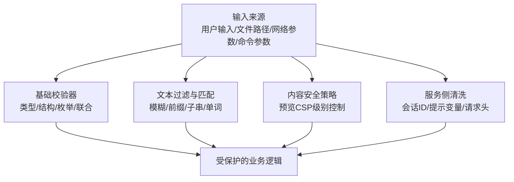
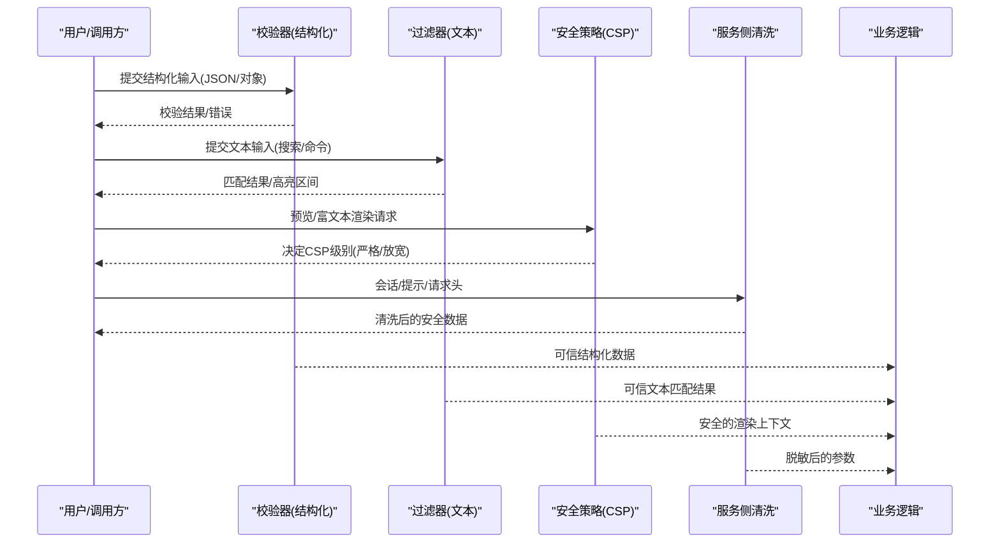
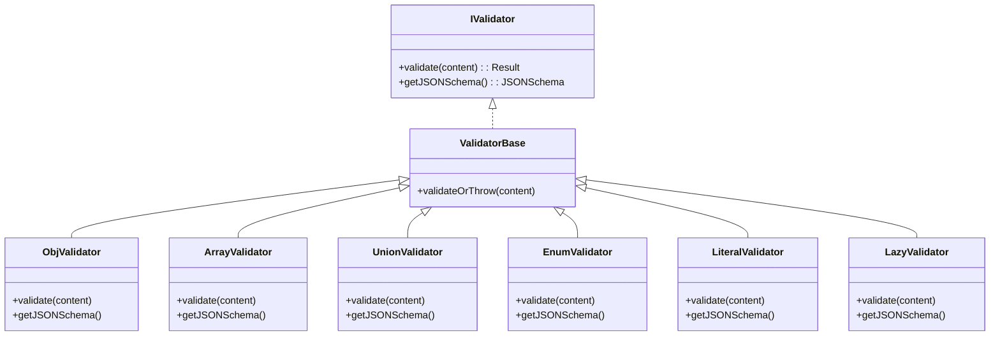
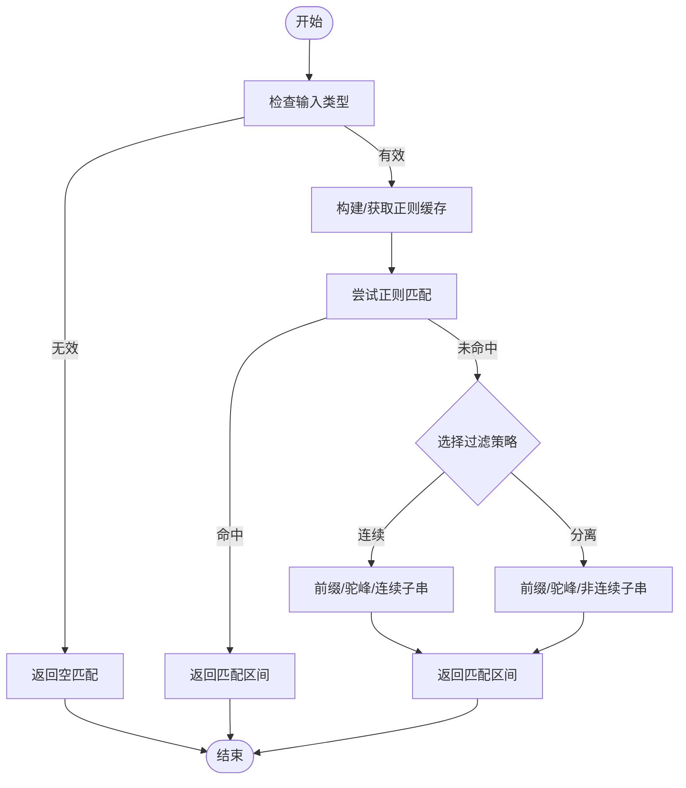
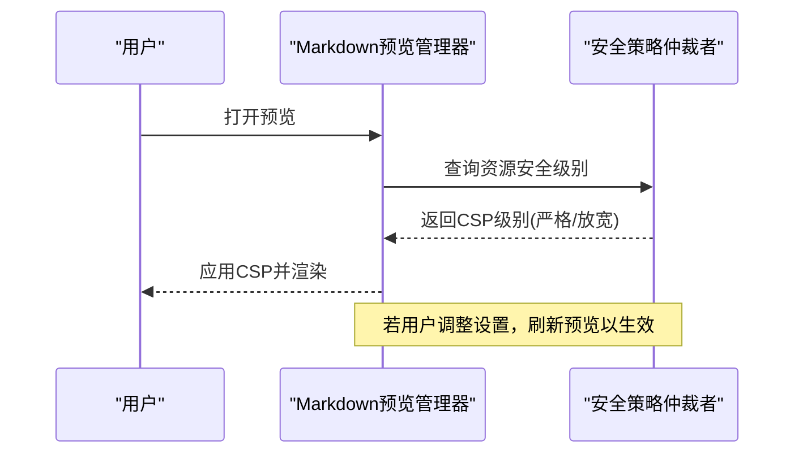
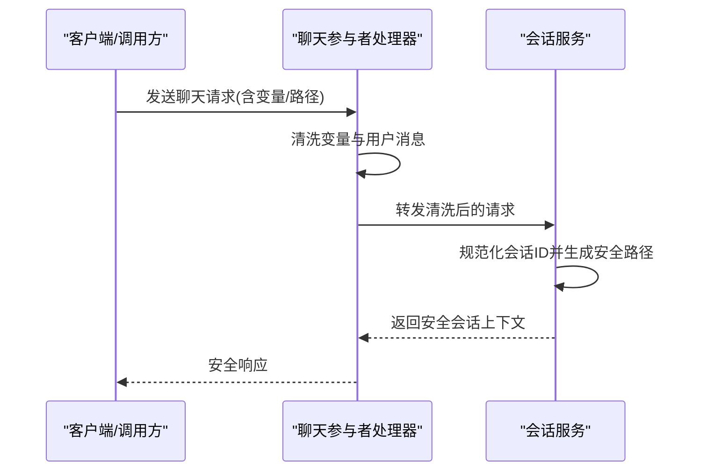
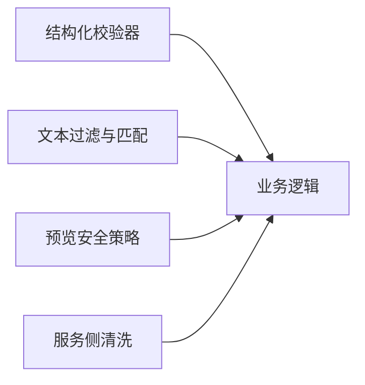

# 输入验证与处理

<cite>
**本文引用的文件**
- [src/vs/base/common/validation.ts](file://src/vs/base/common/validation.ts)
- [src/vs/base/common/filters.ts](file://src/vs/base/common/filters.ts)
- [extensions/markdown-language-features/src/preview/security.ts](file://extensions/markdown-language-features/src/preview/security.ts)
- [patches/00-security-add-command-filter.patch](file://patches/00-security-add-command-filter.patch)
- [extensions/copilot/src/extension/chatSessions/copilotcli/node/copilotcliSessionService.ts](file://extensions/copilot/src/extension/chatSessions/copilotcli/node/copilotcliSessionService.ts)
- [extensions/copilot/src/extension/prompt/node/chatParticipantRequestHandler.ts](file://extensions/copilot/src/extension/prompt/node/chatParticipantRequestHandler.ts)
</cite>

## 目录
1. [简介](#简介)
2. [项目结构](#项目结构)
3. [核心组件](#核心组件)
4. [架构总览](#架构总览)
5. [详细组件分析](#详细组件分析)
6. [依赖关系分析](#依赖关系分析)
7. [性能考量](#性能考量)
8. [故障排查指南](#故障排查指南)
9. [结论](#结论)
10. [附录](#附录)

## 简介
本文件系统性梳理 Kodrix 在“输入验证与处理”方面的实现与最佳实践，覆盖用户输入、文件路径、网络请求参数、命令执行参数等关键入口的安全校验。重点说明目录穿越防护、命令注入防护、SQL 注入防护（如适用）的实现思路与落地位置；解释输入过滤器的设计原理，如何防止恶意代码执行与敏感信息泄露；并提供可复用的安全模式与常见漏洞场景对照，帮助开发者构建健壮的输入边界。

## 项目结构
围绕输入安全的相关能力主要分布在以下区域：
- 基础类型与结构化数据校验：位于通用工具层，提供强类型、可扩展的校验器体系，用于 API/配置/消息体等结构化输入。
- 文本匹配与过滤：提供模糊匹配、分词匹配、大小写/驼峰匹配等，用于搜索、建议、命令面板等交互场景的输入解析。
- 预览内容安全策略：针对 Markdown 预览等富文本渲染场景，提供严格的内容安全策略（CSP）级别控制，限制脚本与不安全资源加载。
- 补丁与安全增强：通过补丁机制为命令执行等系统级操作增加过滤器，降低命令注入风险。
- 会话与服务侧清洗：对会话标识、提示变量、外部请求头等进行清洗与脱敏，避免敏感信息泄露。

**图表来源**
- [src/vs/base/common/validation.ts:15-197](file://src/vs/base/common/validation.ts#L15-L197)
- [src/vs/base/common/filters.ts:459-488](file://src/vs/base/common/filters.ts#L459-L488)
- [extensions/markdown-language-features/src/preview/security.ts:10-166](file://extensions/markdown-language-features/src/preview/security.ts#L10-L166)
- [extensions/copilot/src/extension/chatSessions/copilotcli/node/copilotcliSessionService.ts:694-696](file://extensions/copilot/src/extension/chatSessions/copilotcli/node/copilotcliSessionService.ts#L694-L696)
- [extensions/copilot/src/extension/prompt/node/chatParticipantRequestHandler.ts:159-228](file://extensions/copilot/src/extension/prompt/node/chatParticipantRequestHandler.ts#L159-L228)

**章节来源**
- [src/vs/base/common/validation.ts:15-397](file://src/vs/base/common/validation.ts#L15-L397)
- [src/vs/base/common/filters.ts:12-488](file://src/vs/base/common/filters.ts#L12-L488)
- [extensions/markdown-language-features/src/preview/security.ts:10-166](file://extensions/markdown-language-features/src/preview/security.ts#L10-L166)
- [extensions/copilot/src/extension/chatSessions/copilotcli/node/copilotcliSessionService.ts:694-696](file://extensions/copilot/src/extension/chatSessions/copilotcli/node/copilotcliSessionService.ts#L694-L696)
- [extensions/copilot/src/extension/prompt/node/chatParticipantRequestHandler.ts:159-228](file://extensions/copilot/src/extension/prompt/node/chatParticipantRequestHandler.ts#L159-L228)

## 核心组件
- 结构化输入校验器
  - 提供字符串、数字、布尔、对象、数组、元组、联合、枚举、字面量、懒加载、JSON Schema 引用等校验器，支持可选字段与错误聚合，便于在 API/配置/消息入口处进行强约束。
  - 典型用法：定义属性校验规则，统一返回标准化结果或抛出异常，确保下游只接收可信数据。
- 文本过滤与匹配
  - 提供前缀、连续子串、非连续子串、驼峰、单词起始等多模式匹配，以及高性能模糊匹配算法，用于命令面板、搜索、建议等场景的输入解析与高亮。
  - 通过缓存与启发式优化，避免复杂输入导致的性能退化。
- 预览内容安全策略
  - 基于工作区/全局状态管理 Markdown 预览的 CSP 级别，默认严格，允许按需放宽本地 HTTP 或全部脚本执行，并支持禁用安全警告开关。
- 服务侧清洗与脱敏
  - 会话 ID 规范化为安全文件名；提示变量与用户消息中的敏感路径被清理；外部请求头值进行白名单/格式校验与脱敏。

**章节来源**
- [src/vs/base/common/validation.ts:15-397](file://src/vs/base/common/validation.ts#L15-L397)
- [src/vs/base/common/filters.ts:459-488](file://src/vs/base/common/filters.ts#L459-L488)
- [extensions/markdown-language-features/src/preview/security.ts:10-166](file://extensions/markdown-language-features/src/preview/security.ts#L10-L166)
- [extensions/copilot/src/extension/chatSessions/copilotcli/node/copilotcliSessionService.ts:694-696](file://extensions/copilot/src/extension/chatSessions/copilotcli/node/copilotcliSessionService.ts#L694-L696)
- [extensions/copilot/src/extension/prompt/node/chatParticipantRequestHandler.ts:159-228](file://extensions/copilot/src/extension/prompt/node/chatParticipantRequestHandler.ts#L159-L228)

## 架构总览
输入从多个入口进入系统，经过分层校验与清洗后，才进入业务逻辑。

**图表来源**
- [src/vs/base/common/validation.ts:15-397](file://src/vs/base/common/validation.ts#L15-L397)
- [src/vs/base/common/filters.ts:459-488](file://src/vs/base/common/filters.ts#L459-L488)
- [extensions/markdown-language-features/src/preview/security.ts:10-166](file://extensions/markdown-language-features/src/preview/security.ts#L10-L166)
- [extensions/copilot/src/extension/chatSessions/copilotcli/node/copilotcliSessionService.ts:694-696](file://extensions/copilot/src/extension/chatSessions/copilotcli/node/copilotcliSessionService.ts#L694-L696)
- [extensions/copilot/src/extension/prompt/node/chatParticipantRequestHandler.ts:159-228](file://extensions/copilot/src/extension/prompt/node/chatParticipantRequestHandler.ts#L159-L228)

## 详细组件分析

### 结构化输入校验器（ValidatorBase 体系）
- 设计要点
  - 统一的 IValidator 接口与 ValidatorBase 基类，所有具体校验器继承并实现 validate 与 getJSONSchema。
  - 组合型校验器：对象、数组、元组、联合、枚举、字面量、懒加载、JSON Schema 引用，支持可选字段与错误定位。
  - 提供 throw-on-error 的便捷方法，便于在边界处快速失败。
- 复杂度与性能
  - 对象/数组/元组校验为线性遍历，时间复杂度 O(n)，空间复杂度 O(n) 用于构造结果。
  - 联合校验按顺序尝试，最坏情况 O(k·n)。
- 错误处理
  - 每个校验器返回统一的结果结构，包含 content 或 error，便于上层统一处理。
- 使用建议
  - 在 API/配置/消息入口处集中定义校验规则，避免散落各处。
  - 对敏感字段（如路径、URL、命令参数）结合领域规则进一步校验。

**图表来源**
- [src/vs/base/common/validation.ts:15-397](file://src/vs/base/common/validation.ts#L15-L397)

**章节来源**
- [src/vs/base/common/validation.ts:15-397](file://src/vs/base/common/validation.ts#L15-L397)

### 文本过滤与匹配（Filters）
- 设计要点
  - 多模式匹配：前缀、连续子串、非连续子串、驼峰、单词起始，支持大小写与国际化字符。
  - 模糊匹配：正则预编译缓存、动态规划打分、启发式剪枝，保证大规模列表下的响应速度。
- 复杂度与性能
  - 模糊匹配采用 DP 表与缓存，最大长度限制与最小匹配位置优化，避免指数爆炸。
  - 单词匹配使用记忆化递归，减少重复计算。
- 使用建议
  - 在命令面板、搜索、建议等高频交互中使用 matchesFuzzy/matchesWords。
  - 对超长输入做截断与降级策略，保障用户体验。

**图表来源**
- [src/vs/base/common/filters.ts:459-488](file://src/vs/base/common/filters.ts#L459-L488)

**章节来源**
- [src/vs/base/common/filters.ts:12-488](file://src/vs/base/common/filters.ts#L12-L488)

### 预览内容安全策略（Markdown Preview Security）
- 设计要点
  - 提供多级安全策略：严格、允许不安全本地内容、允许不安全内容、允许脚本与全部内容。
  - 基于工作区/全局状态持久化策略，支持临时禁用安全警告。
  - 根据资源根目录决定策略作用域，避免跨工作区污染。
- 使用建议
  - 默认启用严格模式，仅在可信环境下放宽。
  - 对用户可见的富文本渲染一律走此策略，禁止直接执行用户提供的脚本。

**图表来源**
- [extensions/markdown-language-features/src/preview/security.ts:10-166](file://extensions/markdown-language-features/src/preview/security.ts#L10-L166)

**章节来源**
- [extensions/markdown-language-features/src/preview/security.ts:10-166](file://extensions/markdown-language-features/src/preview/security.ts#L10-L166)

### 命令执行参数过滤（补丁增强）
- 设计要点
  - 通过补丁为命令执行链路引入过滤器，拦截危险字符与可疑模式，降低命令注入风险。
  - 适用于 CLI、远程命令、扩展命令等需要拼接系统命令的场景。
- 使用建议
  - 对所有外部命令参数进行白名单/黑名单双重校验。
  - 优先使用参数化调用，避免字符串拼接；确需拼接时，必须经过滤器净化。

**章节来源**
- [patches/00-security-add-command-filter.patch](file://patches/00-security-add-command-filter.patch)

### 服务侧清洗与会话安全
- 会话 ID 规范化
  - 将会话 ID 中的非法字符替换为安全字符，生成稳定的数据库路径，避免目录穿越与文件系统攻击。
- 提示变量与用户消息清洗
  - 清理隐藏标记与敏感路径，防止敏感信息泄露到日志或外部服务。
- 外部请求头清洗
  - 对自定义请求头进行键值清洗与白名单校验，拒绝非法或潜在注入内容。

**图表来源**
- [extensions/copilot/src/extension/prompt/node/chatParticipantRequestHandler.ts:159-228](file://extensions/copilot/src/extension/prompt/node/chatParticipantRequestHandler.ts#L159-L228)
- [extensions/copilot/src/extension/chatSessions/copilotcli/node/copilotcliSessionService.ts:694-696](file://extensions/copilot/src/extension/chatSessions/copilotcli/node/copilotcliSessionService.ts#L694-L696)

**章节来源**
- [extensions/copilot/src/extension/prompt/node/chatParticipantRequestHandler.ts:159-228](file://extensions/copilot/src/extension/prompt/node/chatParticipantRequestHandler.ts#L159-L228)
- [extensions/copilot/src/extension/chatSessions/copilotcli/node/copilotcliSessionService.ts:694-696](file://extensions/copilot/src/extension/chatSessions/copilotcli/node/copilotcliSessionService.ts#L694-L696)

## 依赖关系分析
- 低耦合高内聚
  - 校验器与过滤器作为通用能力，被多处复用，降低重复实现与不一致风险。
  - 安全策略与服务侧清洗独立于业务逻辑，便于集中升级与维护。
- 外部依赖
  - 预览安全策略依赖 VSCode 工作区与状态管理。
  - 过滤器依赖字符串与归一化工具。
- 循环依赖
  - 当前模块划分清晰，未见明显循环依赖。

**图表来源**
- [src/vs/base/common/validation.ts:15-397](file://src/vs/base/common/validation.ts#L15-L397)
- [src/vs/base/common/filters.ts:459-488](file://src/vs/base/common/filters.ts#L459-L488)
- [extensions/markdown-language-features/src/preview/security.ts:10-166](file://extensions/markdown-language-features/src/preview/security.ts#L10-L166)
- [extensions/copilot/src/extension/prompt/node/chatParticipantRequestHandler.ts:159-228](file://extensions/copilot/src/extension/prompt/node/chatParticipantRequestHandler.ts#L159-L228)

**章节来源**
- [src/vs/base/common/validation.ts:15-397](file://src/vs/base/common/validation.ts#L15-L397)
- [src/vs/base/common/filters.ts:459-488](file://src/vs/base/common/filters.ts#L459-L488)
- [extensions/markdown-language-features/src/preview/security.ts:10-166](file://extensions/markdown-language-features/src/preview/security.ts#L10-L166)
- [extensions/copilot/src/extension/prompt/node/chatParticipantRequestHandler.ts:159-228](file://extensions/copilot/src/extension/prompt/node/chatParticipantRequestHandler.ts#L159-L228)

## 性能考量
- 校验器
  - 对象/数组/元组校验为线性扫描，注意在大对象时的内存分配；必要时分批校验或延迟校验。
- 过滤器
  - 模糊匹配使用缓存与 DP 表，限制最大长度以避免超时；对超长输入建议分页或采样。
- 预览安全
  - 策略查询与更新轻量，但频繁刷新预览可能带来 UI 开销，应合并刷新。
- 服务侧清洗
  - 会话 ID 规范化与提示变量清洗为常量/线性操作，注意日志输出体积控制。

[本节为通用指导，不直接分析具体文件]

## 故障排查指南
- 常见问题
  - 校验失败：检查校验规则是否过严或字段缺失；查看错误消息定位具体属性。
  - 匹配异常：确认输入是否包含特殊字符或过长；检查是否启用了分离子串匹配。
  - 预览受限：检查工作区安全策略是否设置为严格；确认是否需要放宽本地 HTTP。
  - 命令执行失败：检查补丁是否生效；确认参数是否被过滤器拦截。
  - 敏感信息泄露：确认提示变量与用户消息是否已清洗；检查日志与外部请求头。
- 排查步骤
  - 在输入边界打印原始输入与校验结果，逐步缩小问题范围。
  - 切换更严格的策略，观察是否仍存在问题。
  - 使用单元测试覆盖边界用例（空输入、超长输入、特殊字符）。

**章节来源**
- [src/vs/base/common/validation.ts:20-26](file://src/vs/base/common/validation.ts#L20-L26)
- [src/vs/base/common/filters.ts:459-488](file://src/vs/base/common/filters.ts#L459-L488)
- [extensions/markdown-language-features/src/preview/security.ts:105-166](file://extensions/markdown-language-features/src/preview/security.ts#L105-L166)
- [patches/00-security-add-command-filter.patch](file://patches/00-security-add-command-filter.patch)
- [extensions/copilot/src/extension/prompt/node/chatParticipantRequestHandler.ts:159-228](file://extensions/copilot/src/extension/prompt/node/chatParticipantRequestHandler.ts#L159-L228)

## 结论
Kodrix 在输入验证与处理方面形成了“结构化校验 + 文本过滤 + 内容安全策略 + 服务侧清洗”的分层防御体系。通过统一的校验器与过滤器，结合严格的预览 CSP 与服务侧脱敏，有效降低了目录穿越、命令注入、脚本执行与敏感信息泄露等安全风险。建议在新增输入入口时，优先复用现有校验器与过滤器，并在边界处集中实施安全策略，持续完善测试与监控。

[本节为总结性内容，不直接分析具体文件]

## 附录
- 安全最佳实践清单
  - 所有外部输入必须在边界处进行类型与格式校验。
  - 对路径、URL、命令参数进行白名单/黑名单双重校验。
  - 富文本渲染一律启用严格 CSP，按需放宽并记录审计。
  - 对外部请求头与用户消息进行清洗与脱敏。
  - 对命令执行使用参数化调用，避免字符串拼接。
  - 建立单元测试与集成测试，覆盖边界与异常路径。
  - 定期审查补丁与安全策略变更，确保一致性与可追溯性。

[本节为通用指导，不直接分析具体文件]