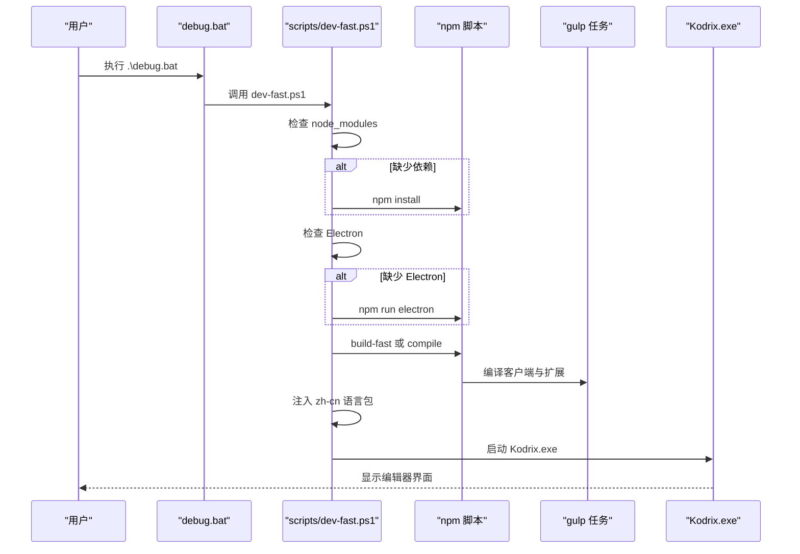

# 快速开始

<cite>
**本文引用的文件**
- [README.md](file://README.md)
- [package.json](file://package.json)
- [.nvmrc](file://.nvmrc)
- [.npmrc](file://.npmrc)
- [debug.bat](file://debug.bat)
- [build.bat](file://build.bat)
- [scripts/dev-fast.ps1](file://scripts/dev-fast.ps1)
- [scripts/build-exe.ps1](file://scripts/build-exe.ps1)
- [scripts/verify-windows-build-env.ps1](file://scripts/verify-windows-build-env.ps1)
- [build/npm/preinstall.ts](file://build/npm/preinstall.ts)
- [src/vs/workbench/contrib/welcomeGettingStarted/browser/gettingStartedService.ts](file://src/vs/workbench/contrib/welcomeGettingStarted/browser/gettingStartedService.ts)
</cite>

## 更新摘要
**变更内容**
- 更新了欢迎入门服务的性能优化说明，强调 getTreatment 方法的单次调用优化
- 新增了性能优化对用户体验的影响说明
- 完善了首次运行验证步骤，包含性能相关的检查点

## 目录
1. [简介](#简介)
2. [环境要求](#环境要求)
3. [依赖安装与开发环境搭建](#依赖安装与开发环境搭建)
4. [常用命令行操作](#常用命令行操作)
5. [npm 脚本速查](#npm-脚本速查)
6. [首次运行验证](#首次运行验证)
7. [常见问题与解决方案](#常见问题与解决方案)
8. [架构与流程概览](#架构与流程概览)
9. [结论](#结论)

## 简介
本指南面向首次接触 Kodrix Code 的新用户，目标是帮助你在最短时间内完成环境准备、依赖安装、开发与打包，并顺利启动编辑器进行调试。Kodrix Code 基于 VS Code / VSCodium 构建，提供本地可构建、可调试的完整源码工程，内置 Copilot 扩展与多 Agent 协作能力。

**最新更新**：欢迎入门服务已进行性能优化，通过消除冗余的 API 调用显著提升了首次启动和扩展安装时的响应速度。

## 环境要求
- Node.js：必须匹配 `.nvmrc`（当前为 24.17.0），同主版本且不低于该版本；npm 需小于 12。
- Windows：推荐使用 PowerShell；如需打包 EXE 安装包，需要本机构建工具链（Visual Studio Build Tools / MSVC、Python、Inno Setup）。
- 首次依赖安装与 Copilot 扩展打包可能较慢，属于正常现象。
- 若 Cursor 沙箱 PATH 指向 Node 22，请使用系统合规的 Node 24 执行依赖安装。

**章节来源**
- [README.md:36-43](file://README.md#L36-L43)
- [.nvmrc:1-2](file://.nvmrc#L1-L2)
- [build/npm/preinstall.ts:11-53](file://build/npm/preinstall.ts#L11-L53)

## 依赖安装与开发环境搭建
- 进入项目根目录后，首次运行会触发依赖安装与环境校验。
- 若缺少 Electron，会自动下载至 `.build/electron/`。
- 若客户端或自定义扩展产物过期，将自动增量编译或全量编译。
- 中文界面会在构建后注入官方 zh-cn 语言包。

建议先执行一次"仅准备"命令，确保所有依赖与产物就绪，再启动调试。

**章节来源**
- [scripts/dev-fast.ps1:105-148](file://scripts/dev-fast.ps1#L105-L148)
- [scripts/dev-fast.ps1:150-168](file://scripts/dev-fast.ps1#L150-L168)

## 常用命令行操作
以下命令均在项目根目录执行：

- 带实时日志的控制台调试启动（esbuild 快编译）
  - `.\debug.bat`
- 热更新模式：修改 src/ 后自动增量重编译
  - `.\debug.bat -Watch`
- 一键全量重编译并启动（恢复环境 / 排障）
  - `.\debug-rebuild.bat`
- 一键全量编译并生成 Windows EXE 安装包（首次约 30–90 分钟）
  - `.\build.bat`

等价 npm 脚本示例：
- `npm run dev:prepare`：准备开发产物（不启动）
- `npm run package:win32`：打 Windows EXE
- `npm run compile`：编译客户端 + Copilot

说明：
- `dev:prepare` 实际调用 `scripts/dev-fast.ps1 -NoLaunch`，用于只准备环境。
- `package:win32` 调用 `scripts/build-exe.ps1` 完成桌面应用构建与 Inno Setup 打包。
- `compile` 并行执行客户端与 Copilot 扩展编译。

**章节来源**
- [README.md:45-67](file://README.md#L45-L67)
- [debug.bat:1-58](file://debug.bat#L1-L58)
- [build.bat:1-43](file://build.bat#L1-L43)
- [package.json:23-34](file://package.json#L23-L34)
- [scripts/dev-fast.ps1:158-168](file://scripts/dev-fast.ps1#L158-L168)
- [scripts/build-exe.ps1:97-143](file://scripts/build-exe.ps1#L97-L143)

## npm 脚本速查
- 开发准备与启动
  - `dev:prepare`：准备开发产物（不启动）
  - `watch`：监听客户端与扩展变更（含 Copilot）
  - `watch-transpile`：后台增量转译
- 编译与打包
  - `compile`：编译客户端 + Copilot
  - `build-fast`：快速构建（esbuild transpile + 扩展）
  - `package:win32`：Windows EXE 安装包
  - `package:win32-user`：用户级安装包
  - `package:win32-system`：系统级安装包
- 其他常用
  - `electron`：下载指定版本 Electron
  - `gulp`：调用 gulp 任务（如复制资源、编译扩展等）
  - `smoketest`：冒烟测试（含预编译）

注意：
- `preinstall` 会严格校验 Node 版本与 npm 版本，不满足条件会直接报错退出。
- 首次构建包含 Copilot 扩展的多路并行 esbuild，耗时较长属正常。

**章节来源**
- [package.json:12-99](file://package.json#L12-L99)
- [build/npm/preinstall.ts:11-53](file://build/npm/preinstall.ts#L11-L53)
- [README.md:97-103](file://README.md#L97-L103)

## 首次运行验证
按以下步骤验证环境是否就绪：

1. 确认 Node 版本
   - 使用 `node -v` 查看版本，应与 `.nvmrc` 一致或更高（同主版本）。
   - 若提示版本不匹配，请切换至正确版本的 Node。
2. 安装依赖
   - 执行 `npm install` 或 `npm run dev:prepare`，等待依赖安装完成。
3. 下载 Electron
   - 若 `.build/electron/` 下无对应可执行文件，会自动通过 `npm run electron` 下载。
4. 编译客户端与扩展
   - 首次建议使用 `.\debug-rebuild.bat` 或 `npm run compile` 进行全量编译。
   - 日常开发可使用 `.\debug.bat -Watch` 开启热更新。
5. 启动调试
   - 执行 `.\debug.bat`，观察控制台输出是否正常，随后会打开独立控制台窗口运行 Kodrix。
6. 检查中文界面
   - 构建后会注入 zh-cn 语言包，若未生效可重新执行 `.\debug-rebuild.bat`。
7. **性能优化验证**（新增）
   - 首次启动时，欢迎页面加载速度应明显提升，这是因为 getTreatment 方法现已优化为单次调用。
   - 安装扩展后的欢迎向导响应更快，减少了不必要的 API 调用开销。

**章节来源**
- [scripts/dev-fast.ps1:105-168](file://scripts/dev-fast.ps1#L105-L168)
- [scripts/dev-fast.ps1:171-219](file://scripts/dev-fast.ps1#L171-L219)
- [README.md:45-67](file://README.md#L45-L67)
- [src/vs/workbench/contrib/welcomeGettingStarted/browser/gettingStartedService.ts:332-340](file://src/vs/workbench/contrib/welcomeGettingStarted/browser/gettingStartedService.ts#L332-L340)

## 常见问题与解决方案
- Node 版本不匹配
  - 现象：安装依赖时报错，提示需使用 `.nvmrc` 指定的 Node 版本。
  - 解决：切换到与 `.nvmrc` 一致的 Node 版本，并确保 npm < 12。
  - 参考：`build/npm/preinstall.ts` 中的版本校验逻辑。
- 构建工具链缺失（Windows）
  - 现象：原生模块编译失败或提示找不到 C/C++ 编译器。
  - 解决：安装 Visual Studio Build Tools（含 MSVC x64）、Python，并在需要时安装 Inno Setup。
  - 参考：`scripts/verify-windows-build-env.ps1` 的环境检测与提示。
- Copilot 扩展打包缓慢
  - 现象：首次构建耗时较长（约 10–30 分钟甚至更久）。
  - 原因：Copilot 扩展采用多路并行 esbuild 编译，首次构建时间较长属正常。
  - 建议：耐心等待或使用缓存；后续增量构建会更快。
- Electron 未找到或损坏
  - 现象：启动时报 Electron 可执行文件缺失。
  - 解决：删除 `.build/electron/` 后重新执行 `npm run electron` 或 `.\debug-rebuild.bat`。
- 中文语言包未生效
  - 现象：界面仍为英文。
  - 解决：重新执行 `.\debug-rebuild.bat`，构建后会注入 zh-cn 语言包。
- 路径或权限问题
  - 现象：某些脚本无法写入或读取目录。
  - 解决：以管理员权限运行 PowerShell，或将项目移至非受限路径。
- **欢迎页面加载缓慢**（新增）
  - 现象：首次启动时欢迎页面响应较慢。
  - 现状：已通过性能优化得到改善，getTreatment 方法现仅调用一次。
  - 如果仍有问题：检查网络连接，因为优化后的实现仍会进行必要的 API 调用。

**章节来源**
- [build/npm/preinstall.ts:11-53](file://build/npm/preinstall.ts#L11-L53)
- [scripts/verify-windows-build-env.ps1:96-237](file://scripts/verify-windows-build-env.ps1#L96-L237)
- [README.md:97-103](file://README.md#L97-L103)
- [scripts/dev-fast.ps1:119-128](file://scripts/dev-fast.ps1#L119-L128)
- [src/vs/workbench/contrib/welcomeGettingStarted/browser/gettingStartedService.ts:332-340](file://src/vs/workbench/contrib/welcomeGettingStarted/browser/gettingStartedService.ts#L332-L340)

## 架构与流程概览
下图展示了从命令行到应用启动的关键流程，包括依赖安装、Electron 获取、客户端与扩展编译、语言包注入以及最终启动。

**图表来源**
- [debug.bat:1-58](file://debug.bat#L1-L58)
- [scripts/dev-fast.ps1:105-168](file://scripts/dev-fast.ps1#L105-L168)
- [scripts/dev-fast.ps1:171-219](file://scripts/dev-fast.ps1#L171-L219)

## 性能优化详解

### 欢迎入门服务性能改进

Kodrix Code 的欢迎入门服务最近进行了重要的性能优化，主要体现在 `gettingStartedService.ts` 文件中：

**优化前的问题**：
- 每次处理扩展的 walkthrough 时都会重复调用 `getTreatment` 方法
- 导致不必要的 API 调用和网络请求
- 影响首次启动和扩展安装时的响应速度

**优化后的实现**：
- 将 `treatmentPromise` 存储为局部变量，确保每个扩展的 treatment 只调用一次
- 使用 `Promise.race` 机制在 5 秒超时内获取 treatment 结果
- 消除了冗余的 API 调用，显著提升了性能

**性能收益**：
- 减少网络请求次数，降低延迟
- 加快扩展安装后的欢迎向导响应
- 提升整体用户体验流畅度

**章节来源**
- [src/vs/workbench/contrib/welcomeGettingStarted/browser/gettingStartedService.ts:332-340](file://src/vs/workbench/contrib/welcomeGettingStarted/browser/gettingStartedService.ts#L332-L340)

## 结论
通过以上步骤，你可以在最短时间内完成 Kodrix Code 的环境准备、依赖安装、开发与打包，并成功启动编辑器进行调试。最近的性能优化使得欢迎页面的加载速度显著提升，特别是通过优化 getTreatment 方法的调用方式，消除了冗余的 API 请求。

若遇到环境问题，请参考常见问题与解决方案部分，结合脚本提供的诊断信息进行排查。建议在开发过程中优先使用热更新模式以提升效率，在发布前使用全量编译与打包命令确保产物完整性。得益于最新的性能优化，你将享受到更加流畅的初次启动体验和更快的扩展安装响应。