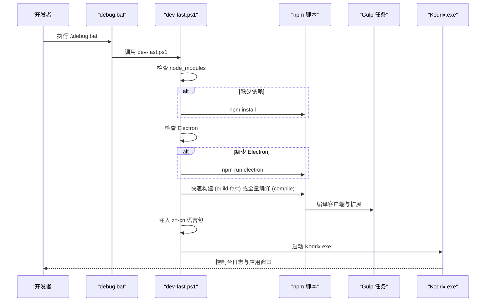

# 快速开始

<cite>
**本文引用的文件**
- [README.md](file://README.md)
- [package.json](file://package.json)
- [.nvmrc](file://.nvmrc)
- [.npmrc](file://.npmrc)
- [debug.bat](file://debug.bat)
- [debug-rebuild.bat](file://debug-rebuild.bat)
- [build.bat](file://build.bat)
- [scripts/dev-fast.ps1](file://scripts/dev-fast.ps1)
- [scripts/build-exe.ps1](file://scripts/build-exe.ps1)
- [scripts/verify-windows-build-env.ps1](file://scripts/verify-windows-build-env.ps1)
- [REPAIR-NOTES.md](file://REPAIR-NOTES.md)
</cite>

## 目录
1. [简介](#简介)
2. [环境准备](#环境准备)
3. [安装与首次运行](#安装与首次运行)
4. [开发入口命令与 npm 脚本](#开发入口命令与-npm-脚本)
5. [常见问题与排障](#常见问题与排障)
6. [架构与流程概览](#架构与流程概览)
7. [结论](#结论)

## 简介
本指南面向首次接触 KodrixCode 的新用户，帮助你在最短时间内完成环境准备、依赖安装、编译打包与首次运行，并理解核心开发入口命令与 npm 脚本的作用。KodrixCode 基于 VS Code/VSCodium 构建体系，提供本地可构建、可调试的完整源码工程，集成多 Agent 协作、智能补全等能力。

## 环境准备
- Node.js：必须匹配 .nvmrc（当前为 24.17.0），主版本需一致且不低于该版本；npm 主版本需小于 12。
- Windows 开发工具链：
  - Python 3.x（用于 node-gyp）
  - Visual Studio 或 Build Tools（含 MSVC x64 工具集；建议勾选“使用 C++ 的桌面开发”工作负载）
  - Inno Setup 6+（仅当需要打包 EXE 安装包时必需）
- PowerShell：推荐使用 PowerShell 执行脚本。

说明：
- 首次依赖安装与 Copilot 扩展打包可能耗时较长，属正常现象。
- 若 Cursor 沙箱 PATH 指向 Node 22，请使用系统合规 Node 24 安装依赖。

章节来源
- [README.md:38-43](file://README.md#L38-L43)
- [.nvmrc:1-2](file://.nvmrc#L1-L2)
- [package.json:9-12](file://package.json#L9-L12)
- [scripts/verify-windows-build-env.ps1:96-191](file://scripts/verify-windows-build-env.ps1#L96-L191)
- [scripts/verify-windows-build-env.ps1:194-224](file://scripts/verify-windows-build-env.ps1#L194-L224)

## 安装与首次运行
步骤：
1. 安装 Node.js 24.17.0（或同主版本更高补丁）与 npm < 12。
2. 在仓库根目录打开 PowerShell。
3. 首次运行会自动检测并安装依赖、下载 Electron、编译客户端与扩展，然后启动应用。

推荐命令：
- 快速启动（esbuild 快编译 + 带日志）：.\debug.bat
- 热更新（修改 src/ 后自动增量重编译）：.\debug.bat -Watch
- 全量重编译后再启动（恢复环境/排障）：.\debug-rebuild.bat
- 一键打包 EXE 安装包（首次约 30–90 分钟）：.\build.bat

提示：
- 首次构建会下载 Electron 到 .build/electron，并执行 preinstall/postinstall 钩子。
- dev-fast.ps1 会在编译后注入简体中文语言包，确保界面默认中文。

章节来源
- [README.md:45-67](file://README.md#L45-L67)
- [scripts/dev-fast.ps1:105-156](file://scripts/dev-fast.ps1#L105-L156)
- [scripts/dev-fast.ps1:171-218](file://scripts/dev-fast.ps1#L171-L218)

## 开发入口命令与 npm 脚本
### 入口命令
- debug.bat：调用 scripts/dev-fast.ps1，支持 -FullCompile、-Watch、-Prepare 等参数，适合日常开发与调试。
- debug-rebuild.bat：等价于 debug.bat -FullCompile，强制全量 TypeScript 编译后再启动。
- build.bat：调用 scripts/build-exe.ps1，生成 Windows EXE 安装包（Inno Setup）。

### npm 脚本
常用脚本：
- npm run dev:prepare：准备开发产物（不启动应用）。
- npm run package:win32 / package:win32-user / package:win32-system：打包 Windows 安装包。
- npm run compile：编译客户端与 Copilot 扩展。
- npm run build-fast：快速构建（esbuild transpile + 扩展）。
- npm run watch / watch-transpile：监听源文件变更并增量编译。
- npm run gulp：通过 Gulp 执行构建任务（如复制资源、编译扩展等）。

说明：
- compile-client 与 compile-copilot 并行执行，提升整体编译效率。
- watch 系列脚本配合 -Watch 模式可实现秒级热更新体验。

章节来源
- [debug.bat:1-58](file://debug.bat#L1-L58)
- [debug-rebuild.bat:1-25](file://debug-rebuild.bat#L1-L25)
- [build.bat:1-43](file://build.bat#L1-L43)
- [package.json:16-104](file://package.json#L16-L104)
- [scripts/dev-fast.ps1:130-163](file://scripts/dev-fast.ps1#L130-L163)

## 常见问题与排障
- 依赖安装失败
  - 检查 Node.js 版本是否匹配 .nvmrc，npm 主版本是否小于 12。
  - 确认已安装 Python 3.x 与 Visual Studio/Build Tools（MSVC x64）。
  - 若网络受限，检查代理配置与镜像源。
  - 参考 verify-windows-build-env.ps1 的环境检测结果进行修复。

- Copilot 扩展打包时间过长
  - 首次 esbuild 打包可能需 10–30 分钟（多路并行），并非卡死。
  - 可使用 build-fast 或 -Watch 模式减少后续编译时间。

- 启动卡死（无窗口/MainWindowHandle=0）
  - 可能是 policy-watcher 的 Dev Shim 未回调导致初始化阻塞。
  - 执行 restore-pw-shim.mjs 修复 shim，再重试启动。

- Native 模块缺失
  - 症状：数据库无法打开、spdlog/日志异常、注册表加载失败等。
  - 处理：设置 VSCODE_UNPACKED_NODE_MODULES 指向本机 unpacked 路径，运行 copy-native-modules.mjs 复制 .node；或安装 VS Build Tools 后重新编译。

- 界面非中文
  - dev-fast.ps1 会在编译后注入 zh-cn 语言包；若仍显示英文，重新执行编译流程。

- 客户端/扩展过期
  - dev-fast 会检测 out/main.js 与扩展 out 相对于 src 的新旧关系，过期则触发重建。
  - 如遇问题，使用 debug-rebuild.bat 全量重建。

章节来源
- [REPAIR-NOTES.md:19-59](file://REPAIR-NOTES.md#L19-L59)
- [REPAIR-NOTES.md:76-102](file://REPAIR-NOTES.md#L76-L102)
- [scripts/dev-fast.ps1:73-86](file://scripts/dev-fast.ps1#L73-L86)
- [scripts/dev-fast.ps1:150-156](file://scripts/dev-fast.ps1#L150-L156)

## 架构与流程概览
下图展示了从入口脚本到应用启动的核心流程，包括依赖安装、Electron 获取、客户端与扩展编译、语言包注入以及最终启动。

图表来源
- [debug.bat:23-43](file://debug.bat#L23-L43)
- [scripts/dev-fast.ps1:105-156](file://scripts/dev-fast.ps1#L105-L156)
- [scripts/dev-fast.ps1:171-218](file://scripts/dev-fast.ps1#L171-L218)

## 结论
通过以上步骤，你可以在 Windows 环境下快速完成 KodrixCode 的环境准备、依赖安装、编译与首次运行。建议使用 debug.bat 进行日常开发，结合 -Watch 实现热更新；遇到环境问题或首次构建时，使用 debug-rebuild.bat 全量重建；如需发布安装包，使用 build.bat。遇到问题时，优先参考 REPAIR-NOTES.md 与 verify-windows-build-env.ps1 的输出进行定位与修复。