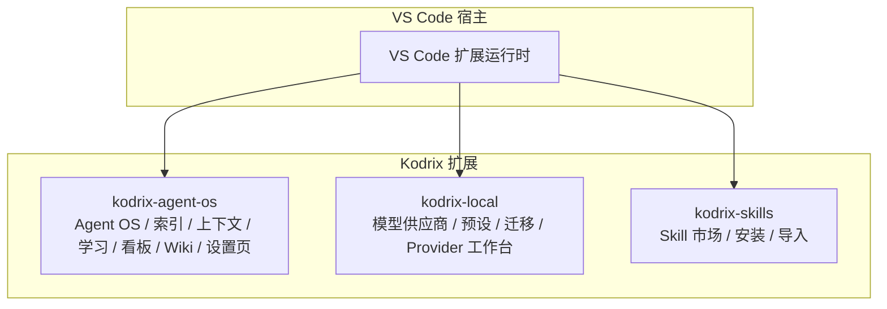
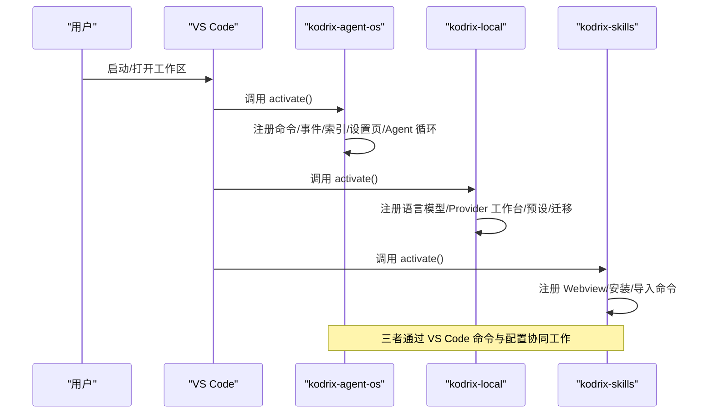
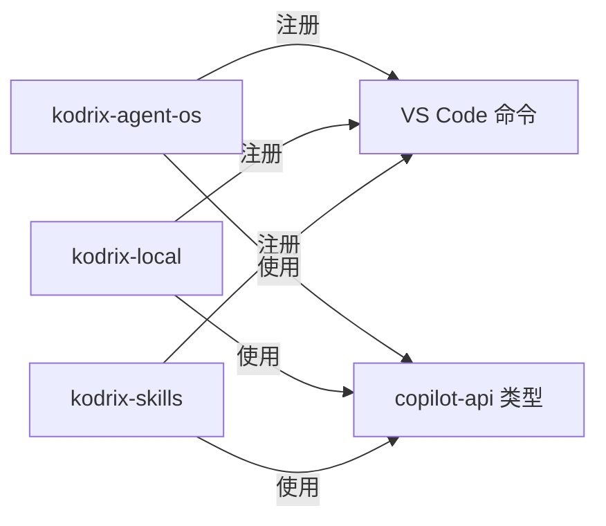

# API 参考文档

<cite>
**本文引用的文件**
- [extensions/kodrix-agent-os/src/extension.ts](file://extensions/kodrix-agent-os/src/extension.ts)
- [extensions/kodrix-local/src/extension.ts](file://extensions/kodrix-local/src/extension.ts)
- [extensions/kodrix-skills/src/extension.ts](file://extensions/kodrix-skills/src/extension.ts)
- [src/typings/copilot-api.d.ts](file://src/typings/copilot-api.d.ts)
</cite>

## 目录
1. [简介](#简介)
2. [项目结构](#项目结构)
3. [核心组件](#核心组件)
4. [架构总览](#架构总览)
5. [详细组件分析](#详细组件分析)
6. [依赖分析](#依赖分析)
7. [性能考虑](#性能考虑)
8. [故障排查指南](#故障排查指南)
9. [结论](#结论)
10. [附录：类型与命令速查](#附录类型与命令速查)

## 简介
本参考文档面向在 Kodrix 中开发扩展的工程师，系统化梳理 Kodrix 暴露的公共 API 与扩展点，覆盖编辑器、文件系统、UI 组件、Agent 交互等模块。重点说明：
- VS Code Extension API 在 Kodrix 中的增强与使用方式
- Kodrix 特有的 API 扩展（如 Agent OS、本地模型供应商、Skill 市场）
- 与 Agent OS 集成的特殊能力（索引、语义补全、会话学习、路由等）
- 完整的 TypeScript 类型定义参考（含 Copilot API 子集）
- 常见使用模式、最佳实践、版本兼容性与迁移建议

## 项目结构
Kodrix 通过多个扩展协同工作，形成“Agent OS + 本地模型/配置 + Skill 市场”的整体能力：
- kodrix-agent-os：提供 Agent 编排、代码库智能索引、上下文感知、会话学习、看板、Wiki、设置页等核心能力
- kodrix-local：提供本地/云端模型供应商管理、预设应用、首次运行迁移、Provider 工作台、语言模型注册等
- kodrix-skills：提供 Skill 市场 Webview、安装/卸载、从 URL/Cursor 导入、GitHub 搜索等

图表来源
- [extensions/kodrix-agent-os/src/extension.ts:158-321](file://extensions/kodrix-agent-os/src/extension.ts#L158-L321)
- [extensions/kodrix-local/src/extension.ts:84-217](file://extensions/kodrix-local/src/extension.ts#L84-L217)
- [extensions/kodrix-skills/src/extension.ts:62-155](file://extensions/kodrix-skills/src/extension.ts#L62-L155)

章节来源
- [extensions/kodrix-agent-os/src/extension.ts:158-321](file://extensions/kodrix-agent-os/src/extension.ts#L158-L321)
- [extensions/kodrix-local/src/extension.ts:84-217](file://extensions/kodrix-local/src/extension.ts#L84-L217)
- [extensions/kodrix-skills/src/extension.ts:62-155](file://extensions/kodrix-skills/src/extension.ts#L62-L155)

## 核心组件
- Agent OS 激活入口：集中注册命令、事件监听、索引构建、设置页、状态栏、Agent 循环、线程、子代理、终端 AI、Vibe Coding、Idea Flow、Agent 状态桥接等
- Local 模型与配置：注册语言模型、Provider 工作台、预设应用、首次运行迁移、欢迎向导、快捷键绑定
- Skills 市场：Webview 视图、安装/卸载、URL 安装、Cursor 导入、GitHub 搜索

章节来源
- [extensions/kodrix-agent-os/src/extension.ts:158-321](file://extensions/kodrix-agent-os/src/extension.ts#L158-L321)
- [extensions/kodrix-local/src/extension.ts:84-217](file://extensions/kodrix-local/src/extension.ts#L84-L217)
- [extensions/kodrix-skills/src/extension.ts:62-155](file://extensions/kodrix-skills/src/extension.ts#L62-L155)

## 架构总览
Kodrix 以 VS Code 扩展为边界，对外暴露命令、Webview、配置项、事件与类型；对内通过各子模块协作完成 Agent 编排、索引、学习与用户界面。

图表来源
- [extensions/kodrix-agent-os/src/extension.ts:158-321](file://extensions/kodrix-agent-os/src/extension.ts#L158-L321)
- [extensions/kodrix-local/src/extension.ts:84-217](file://extensions/kodrix-local/src/extension.ts#L84-L217)
- [extensions/kodrix-skills/src/extension.ts:62-155](file://extensions/kodrix-skills/src/extension.ts#L62-L155)

## 详细组件分析

### 编辑器与 UI 组件 API
- 命令注册与执行：通过 vscode.commands.registerCommand 暴露命令，供菜单、快捷键、Webview 调用
- Webview 视图：注册自定义视图（如 Skill 市场），支持保留上下文、刷新、聚焦等操作
- 进度通知：使用 ProgressLocation 展示耗时任务进度
- 文本文档：动态创建并打开 Markdown 文档用于展示统计或引导信息
- 状态栏与设置页：集成状态栏提示与内嵌设置页面

使用要点
- 所有命令应包含错误处理与用户可见反馈
- 长时间任务需配合进度条，避免阻塞 UI
- Webview 注意资源路径与生命周期管理

章节来源
- [extensions/kodrix-agent-os/src/extension.ts:241-309](file://extensions/kodrix-agent-os/src/extension.ts#L241-L309)
- [extensions/kodrix-skills/src/extension.ts:71-155](file://extensions/kodrix-skills/src/extension.ts#L71-L155)

### 文件系统与索引 API
- 项目索引：启动时延迟构建全工程索引，支持手动重建与统计查看
- 索引统计：输出文件数、符号数、导入/调用关系、语言分布、热门符号等
- 索引开关：尊重“索引新文件夹”配置，可关闭自动索引
- 索引监听：后台启动文件监听，增量更新索引

使用要点
- 大仓库索引可能耗时，务必使用进度提示
- 索引失败需记录日志并提示用户
- 可通过命令触发重建与查看统计

章节来源
- [extensions/kodrix-agent-os/src/extension.ts:214-309](file://extensions/kodrix-agent-os/src/extension.ts#L214-L309)

### Agent 交互 API
- Agent 循环与线程：注册 Agent 主循环、线程管理与子代理
- 上下文智能：主动上下文、规则管理、记忆系统、会话学习
- 路由与看板：智能路由、Agent Kanban 看板
- 终端 AI：在终端中提供 AI 辅助能力
- Idea Flow/Vibe Coding：从想法到产品的自动化流水线与快速体验入口

使用要点
- 合理拆分 Agent 职责，避免单点过载
- 利用记忆与会话学习沉淀知识
- 通过看板可视化任务与依赖

章节来源
- [extensions/kodrix-agent-os/src/extension.ts:170-213](file://extensions/kodrix-agent-os/src/extension.ts#L170-L213)

### 模型与供应商 API（Local）
- 语言模型注册：注册 Kodrix 语言模型，供 Chat/Agent 使用
- Provider 工作台：可视化配置与管理模型供应商
- 预设应用：一键应用模型供应商预设，必要时提示输入 API Key
- 首次运行迁移：将旧配置迁移为新结构，带重试上限
- 欢迎向导：首次启动引导用户完成关键配置

使用要点
- 敏感信息（API Key）仅保存在本机
- 迁移失败需记录并重试，避免无限重试
- 提供清晰的错误与成功反馈

章节来源
- [extensions/kodrix-local/src/extension.ts:84-217](file://extensions/kodrix-local/src/extension.ts#L84-L217)

### Skill 市场 API
- 市场视图：注册 WebviewViewProvider，支持保留上下文
- 安装/卸载：从目录、URL、Catalog 安装与卸载 Skill
- 导入：从 Cursor 目录导入已有 Skill
- GitHub 搜索：跳转至市场进行搜索

使用要点
- 安装过程显示进度，完成后刷新列表
- 导入/安装失败需给出明确原因
- 维护好技能位置配置，确保扫描范围正确

章节来源
- [extensions/kodrix-skills/src/extension.ts:62-155](file://extensions/kodrix-skills/src/extension.ts#L62-L155)

### 类型系统与扩展点
- Copilot API 类型：提供 @vscode/copilot-api 的类型声明子集，包括请求选项、令牌、模型能力、计费与限制等
- 扩展点：通过 VS Code 命令、配置项、Webview、事件等机制暴露能力，便于第三方扩展集成

使用要点
- 使用类型化接口进行网络请求与模型调用
- 遵循 AbortSignal 取消语义，避免资源泄漏
- 关注模型能力字段（如 streaming、tool_calls、vision）以适配不同后端

章节来源
- [src/typings/copilot-api.d.ts:13-169](file://src/typings/copilot-api.d.ts#L13-L169)

## 依赖分析
- 外部依赖：VS Code 扩展 API（commands、window、workspace、Progress 等）
- 内部依赖：各子模块通过函数注册方式耦合于 extension.ts，降低直接 import 复杂度
- 类型依赖：copilot-api.d.ts 提供统一类型，保证跨模块一致性

图表来源
- [extensions/kodrix-agent-os/src/extension.ts:158-321](file://extensions/kodrix-agent-os/src/extension.ts#L158-L321)
- [extensions/kodrix-local/src/extension.ts:84-217](file://extensions/kodrix-local/src/extension.ts#L84-L217)
- [extensions/kodrix-skills/src/extension.ts:62-155](file://extensions/kodrix-skills/src/extension.ts#L62-L155)
- [src/typings/copilot-api.d.ts:13-169](file://src/typings/copilot-api.d.ts#L13-L169)

章节来源
- [extensions/kodrix-agent-os/src/extension.ts:158-321](file://extensions/kodrix-agent-os/src/extension.ts#L158-L321)
- [extensions/kodrix-local/src/extension.ts:84-217](file://extensions/kodrix-local/src/extension.ts#L84-L217)
- [extensions/kodrix-skills/src/extension.ts:62-155](file://extensions/kodrix-skills/src/extension.ts#L62-L155)
- [src/typings/copilot-api.d.ts:13-169](file://src/typings/copilot-api.d.ts#L13-L169)

## 性能考虑
- 索引构建：延迟启动、后台进行、支持手动重建与统计查看，避免冷启动卡顿
- 进度反馈：对耗时操作使用 ProgressLocation，提升用户体验
- 配置变更：监听配置变化（如 Embedding 开关），按需启用/禁用功能
- 资源清理：deactivate 中释放面板、定时器、监听器，防止内存泄漏

章节来源
- [extensions/kodrix-agent-os/src/extension.ts:214-321](file://extensions/kodrix-agent-os/src/extension.ts#L214-L321)
- [extensions/kodrix-local/src/extension.ts:84-217](file://extensions/kodrix-local/src/extension.ts#L84-L217)

## 故障排查指南
- 激活失败：捕获异常并显示错误消息，便于用户定位问题
- 索引失败：记录错误日志，提示用户重试或检查工作区权限
- 迁移失败：记录重试次数，超过上限后停止重试，避免死循环
- 网络请求：使用 AbortSignal 控制超时与取消，避免悬挂请求

章节来源
- [extensions/kodrix-agent-os/src/extension.ts:158-168](file://extensions/kodrix-agent-os/src/extension.ts#L158-L168)
- [extensions/kodrix-local/src/extension.ts:84-92](file://extensions/kodrix-local/src/extension.ts#L84-L92)
- [src/typings/copilot-api.d.ts:15-34](file://src/typings/copilot-api.d.ts#L15-L34)

## 结论
Kodrix 通过多扩展协作，提供了从编辑器、文件系统、UI 到 Agent 交互的全栈能力。其核心优势在于：
- 统一的命令与配置体系，易于扩展与维护
- 强大的代码库索引与上下文智能，提升开发效率
- 灵活的模型供应商管理与 Skill 生态，满足多样化需求
- 完善的类型定义与错误处理，保障稳定性与可维护性

## 附录：类型与命令速查

### 类型定义参考（Copilot API 子集）
- IAbortSignal：中止信号，支持 abort 事件
- FetchOptions：请求选项，包含 headers、body、timeout、signal 等
- MakeRequestOptions：基于 FetchOptions 的请求参数
- IFetcherService：抽象的网络请求服务
- IExtensionInformation：扩展信息（名称、会话、设备、版本等）
- CopilotToken：令牌与端点配置
- RequestType/RequestMetadata：请求元数据（令牌、聊天、模型等）
- CAPIClient：客户端类，支持域名更新与请求发送
- CCAModel：模型能力、计费、限制、支持特性等

章节来源
- [src/typings/copilot-api.d.ts:15-169](file://src/typings/copilot-api.d.ts#L15-L169)

### 常用命令（示例）
- 索引相关
  - 重建全工程语义索引
  - 查看索引统计
- 模型与配置
  - 打开 Provider 工作台
  - 应用预设（可选输入 API Key）
  - 首次运行迁移
- Skill 市场
  - 打开市场视图
  - 安装/卸载 Skill
  - 从 URL 安装
  - 从 Cursor 导入
  - 搜索 GitHub

章节来源
- [extensions/kodrix-agent-os/src/extension.ts:241-309](file://extensions/kodrix-agent-os/src/extension.ts#L241-L309)
- [extensions/kodrix-local/src/extension.ts:110-178](file://extensions/kodrix-local/src/extension.ts#L110-L178)
- [extensions/kodrix-skills/src/extension.ts:79-149](file://extensions/kodrix-skills/src/extension.ts#L79-L149)