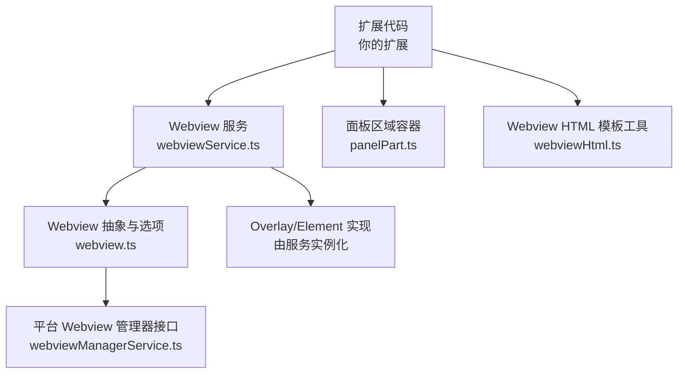
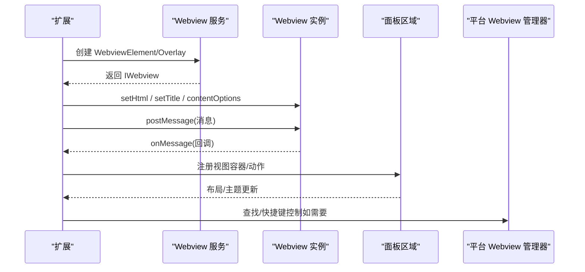
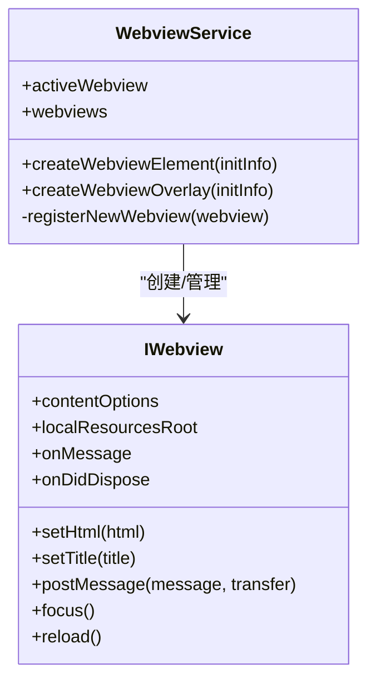
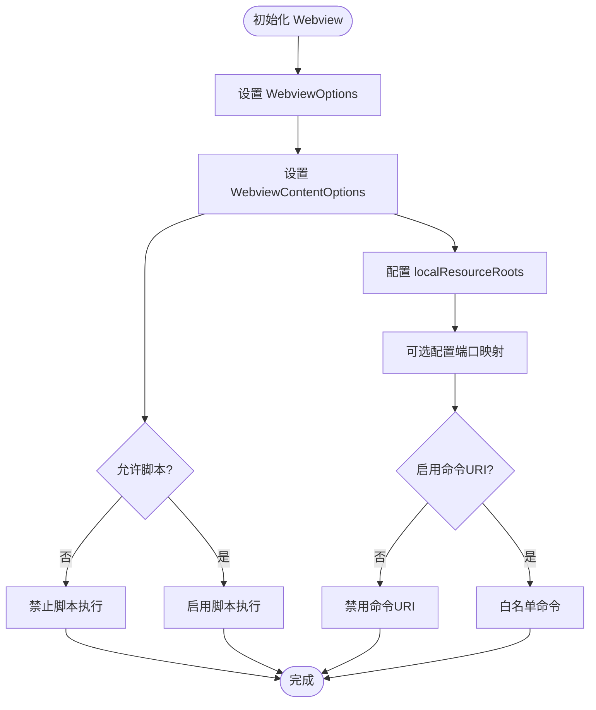
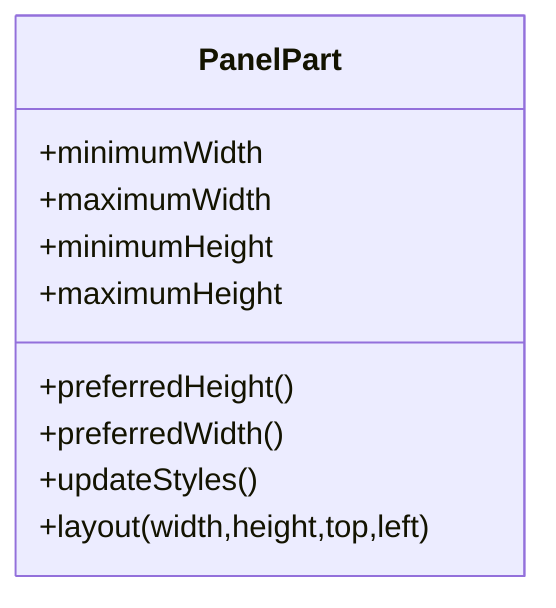
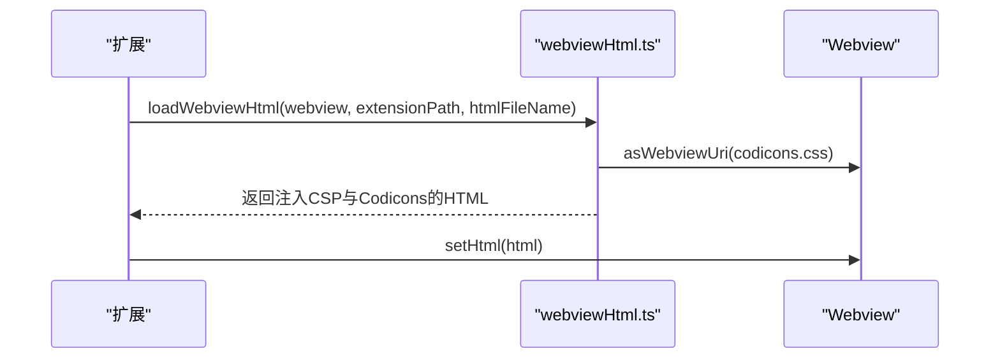
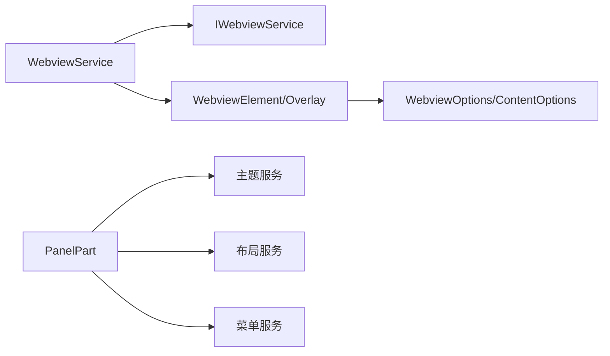

# UI 开发与 Webview

<cite>
**本文引用的文件**
- [webview.ts](file://src/vs/workbench/contrib/webview/browser/webview.ts)
- [webviewService.ts](file://src/vs/workbench/contrib/webview/browser/webviewService.ts)
- [webviewManagerService.ts](file://src/vs/platform/webview/common/webviewManagerService.ts)
- [panelPart.ts](file://src/vs/workbench/browser/parts/panel/panelPart.ts)
- [webviewHtml.ts](file://extensions/kodrix-agent-os/src/shared/webviewHtml.ts)
</cite>

## 目录
1. [简介](#简介)
2. [项目结构](#项目结构)
3. [核心组件](#核心组件)
4. [架构总览](#架构总览)
5. [详细组件分析](#详细组件分析)
6. [依赖关系分析](#依赖关系分析)
7. [性能考虑](#性能考虑)
8. [故障排查指南](#故障排查指南)
9. [结论](#结论)
10. [附录](#附录)

## 简介
本指南面向在 Kodrix（VS Code 工作区）中开发扩展的工程师，聚焦于“原生 VS Code UI 组件”与“自定义 Webview”的完整实践。内容涵盖：
- 如何创建面板、侧边栏、状态栏项、上下文菜单等 UI 元素
- Webview 生命周期管理、消息传递机制、安全策略与资源加载
- 响应式设计与主题适配最佳实践
- CSS 样式定制、图标使用与动画效果实现
- 与后端服务通信模式（HTTP/WebSocket）与数据同步
- UI 测试与调试技巧，保障一致性与稳定性

## 项目结构
围绕 UI 与 Webview 的关键代码位于以下位置：
- 工作区 Webview 能力与服务：workbench/contrib/webview
- 平台级 Webview 管理器接口：platform/webview/common
- 面板区域容器与布局：workbench/browser/parts/panel
- 示例扩展中的 Webview HTML 加载工具：extensions/kodrix-agent-os

图表来源
- [webviewService.ts:14-80](file://src/vs/workbench/contrib/webview/browser/webviewService.ts#L14-L80)
- [webview.ts:37-155](file://src/vs/workbench/contrib/webview/browser/webview.ts#L37-L155)
- [panelPart.ts:36-119](file://src/vs/workbench/browser/parts/panel/panelPart.ts#L36-L119)
- [webviewHtml.ts:13-32](file://extensions/kodrix-agent-os/src/shared/webviewHtml.ts#L13-L32)
- [webviewManagerService.ts:9-42](file://src/vs/platform/webview/common/webviewManagerService.ts#L9-L42)

章节来源
- [webviewService.ts:14-80](file://src/vs/workbench/contrib/webview/browser/webviewService.ts#L14-L80)
- [webview.ts:37-155](file://src/vs/workbench/contrib/webview/browser/webview.ts#L37-L155)
- [panelPart.ts:36-119](file://src/vs/workbench/browser/parts/panel/panelPart.ts#L36-L119)
- [webviewHtml.ts:13-32](file://extensions/kodrix-agent-os/src/shared/webviewHtml.ts#L13-L32)
- [webviewManagerService.ts:9-42](file://src/vs/platform/webview/common/webviewManagerService.ts#L9-L42)

## 核心组件
- Webview 服务（IWebviewService）
  - 负责创建与管理 Webview 元素或覆盖层，维护当前活动 Webview 与集合
  - 提供 createWebviewElement 与 createWebviewOverlay 两种创建方式
- Webview 抽象与配置（IWebview、WebviewOptions、WebviewContentOptions）
  - 定义 Webview 的能力边界：脚本/表单启用、本地资源根、端口映射、命令 URI、查找控件等
  - 暴露消息事件 onMessage、postMessage、滚动/焦点/销毁等生命周期事件
- 面板区域（PanelPart）
  - 作为工作区底部/顶部/左侧/右侧的可停靠区域，承载多个视图容器
  - 支持标题栏、操作菜单、主题色、尺寸计算与布局
- Webview HTML 加载工具
  - 统一注入 CSP 源与 Codicons 样式，简化扩展侧 HTML 构建
- 平台 Webview 管理器接口
  - 提供查找、快捷键屏蔽等跨进程管理能力

章节来源
- [webviewService.ts:14-80](file://src/vs/workbench/contrib/webview/browser/webviewService.ts#L14-L80)
- [webview.ts:37-155](file://src/vs/workbench/contrib/webview/browser/webview.ts#L37-L155)
- [panelPart.ts:36-119](file://src/vs/workbench/browser/parts/panel/panelPart.ts#L36-L119)
- [webviewHtml.ts:13-32](file://extensions/kodrix-agent-os/src/shared/webviewHtml.ts#L13-L32)
- [webviewManagerService.ts:9-42](file://src/vs/platform/webview/common/webviewManagerService.ts#L9-L42)

## 架构总览
下图展示了扩展通过 Webview 服务创建并管理 Webview，以及面板区域承载视图容器的整体交互。

图表来源
- [webviewService.ts:46-56](file://src/vs/workbench/contrib/webview/browser/webviewService.ts#L46-L56)
- [webview.ts:194-287](file://src/vs/workbench/contrib/webview/browser/webview.ts#L194-L287)
- [panelPart.ts:36-119](file://src/vs/workbench/browser/parts/panel/panelPart.ts#L36-L119)
- [webviewManagerService.ts:32-42](file://src/vs/platform/webview/common/webviewManagerService.ts#L32-L42)

## 详细组件分析

### Webview 服务与实例
- 职责
  - 统一管理 Webview 的生命周期、焦点切换与销毁
  - 提供 Element 与 Overlay 两种渲染模式
- 关键点
  - activeWebview 跟踪当前焦点
  - registerNewWebview 订阅 onDidFocus/onDidBlur/onDidDispose
  - createWebviewElement/createWebviewOverlay 分别创建直接挂载与覆盖层实例

图表来源
- [webviewService.ts:14-80](file://src/vs/workbench/contrib/webview/browser/webviewService.ts#L14-L80)
- [webview.ts:194-287](file://src/vs/workbench/contrib/webview/browser/webview.ts#L194-L287)

章节来源
- [webviewService.ts:14-80](file://src/vs/workbench/contrib/webview/browser/webviewService.ts#L14-L80)
- [webview.ts:194-287](file://src/vs/workbench/contrib/webview/browser/webview.ts#L194-L287)

### Webview 选项与安全策略
- WebviewOptions
  - 用途标记、自定义类名、查找控件开关、禁用 Service Worker、保留滚动位置、隐藏时保留上下文、CSS 变量转换
- WebviewContentOptions
  - 是否允许多次 acquire API、是否允许脚本/表单、是否转发不受信任按键事件、本地资源根、端口映射、命令 URI 白名单
- 安全建议
  - 默认关闭脚本与表单；仅在必要时开启
  - 严格限定 localResourceRoots，仅暴露必要资源目录
  - 谨慎使用 enableCommandUris，限制为受控命令列表

图表来源
- [webview.ts:93-155](file://src/vs/workbench/contrib/webview/browser/webview.ts#L93-L155)

章节来源
- [webview.ts:93-155](file://src/vs/workbench/contrib/webview/browser/webview.ts#L93-L155)

### 面板区域（PanelPart）
- 作用
  - 承载可停靠的面板视图，提供标题栏、操作菜单、主题与布局
- 特性
  - 最小/最大宽高、首选尺寸计算
  - 根据配置动态显示标签或图标
  - 支持面板位置与对齐菜单、隐藏/显示面板
- 主题
  - 背景色、边框色、标题边框、徽章颜色等通过主题服务获取

图表来源
- [panelPart.ts:36-119](file://src/vs/workbench/browser/parts/panel/panelPart.ts#L36-L119)
- [panelPart.ts:121-164](file://src/vs/workbench/browser/parts/panel/panelPart.ts#L121-L164)
- [panelPart.ts:196-220](file://src/vs/workbench/browser/parts/panel/panelPart.ts#L196-L220)

章节来源
- [panelPart.ts:36-119](file://src/vs/workbench/browser/parts/panel/panelPart.ts#L36-L119)
- [panelPart.ts:121-164](file://src/vs/workbench/browser/parts/panel/panelPart.ts#L121-L164)
- [panelPart.ts:196-220](file://src/vs/workbench/browser/parts/panel/panelPart.ts#L196-L220)

### Webview HTML 模板与资源加载
- 工具函数
  - loadWebviewHtml：读取 resources 下的 HTML，注入 CSP 源与 Codicons 样式 URI
  - webviewResourceRoots：返回必须允许的本地资源根（含 codicons）
- 最佳实践
  - 将静态资源放入 extensionPath/resources，并在 localResourceRoots 中声明
  - 使用 webview.asWebviewUri 生成安全 URI

图表来源
- [webviewHtml.ts:13-32](file://extensions/kodrix-agent-os/src/shared/webviewHtml.ts#L13-L32)

章节来源
- [webviewHtml.ts:13-32](file://extensions/kodrix-agent-os/src/shared/webviewHtml.ts#L13-L32)

### 平台 Webview 管理器接口
- 能力
  - 查找文本（findInFrame）、停止查找、忽略菜单快捷键
- 适用场景
  - 在复杂嵌套或远程场景中，对 Webview 进行更细粒度的控制

章节来源
- [webviewManagerService.ts:9-42](file://src/vs/platform/webview/common/webviewManagerService.ts#L9-L42)

## 依赖关系分析
- 低耦合设计
  - Webview 服务通过接口 IWebviewService 暴露能力，具体实现解耦
  - Webview 抽象集中定义能力与选项，便于扩展复用
- 外部依赖
  - 主题服务、存储服务、上下文键服务、命令服务等通过依赖注入获得
- 可能的循环依赖
  - 服务层避免直接引用具体实现，降低耦合风险

图表来源
- [webviewService.ts:14-80](file://src/vs/workbench/contrib/webview/browser/webviewService.ts#L14-L80)
- [webview.ts:93-155](file://src/vs/workbench/contrib/webview/browser/webview.ts#L93-L155)
- [panelPart.ts:36-119](file://src/vs/workbench/browser/parts/panel/panelPart.ts#L36-L119)

章节来源
- [webviewService.ts:14-80](file://src/vs/workbench/contrib/webview/browser/webviewService.ts#L14-L80)
- [webview.ts:93-155](file://src/vs/workbench/contrib/webview/browser/webview.ts#L93-L155)
- [panelPart.ts:36-119](file://src/vs/workbench/browser/parts/panel/panelPart.ts#L36-L119)

## 性能考虑
- 资源加载
  - 使用 localResourceRoots 精确限制资源范围，减少不必要的网络请求
  - 利用 Service Worker 缓存静态资源（可通过选项禁用以调试）
- 渲染与重排
  - 优先使用 Overlay 模式避免频繁 re-parent 导致的内容重建
  - 合理设置 intrinsicContentSize，减少滚动抖动
- 消息传递
  - 批量发送消息，避免高频小消息造成主线程压力
  - 使用 transferable ArrayBuffer 传输大数据，减少序列化开销
- 主题与样式
  - 使用 CSS 变量与主题服务，避免硬编码颜色导致的重绘

[本节为通用指导，不直接分析具体文件]

## 故障排查指南
- Webview 无法加载或处于非功能状态
  - 关注 onFatalError 事件，定位错误信息
  - 检查 localResourceRoots 是否正确包含资源路径
- 找不到 CSP 或资源被拦截
  - 确认已注入 {{cspSource}} 并使用 asWebviewUri
  - 确保 resources 目录在 localResourceRoots 中
- 消息未到达或重复
  - 检查 allowMultipleAPIAcquire 配置
  - 确认 postMessage 与 onMessage 配对正确
- 面板显示异常
  - 检查 updateStyles 与布局方法调用
  - 验证主题色与边框色是否正确获取

章节来源
- [webview.ts:260-267](file://src/vs/workbench/contrib/webview/browser/webview.ts#L260-L267)
- [webviewHtml.ts:13-32](file://extensions/kodrix-agent-os/src/shared/webviewHtml.ts#L13-L32)
- [panelPart.ts:121-164](file://src/vs/workbench/browser/parts/panel/panelPart.ts#L121-L164)

## 结论
通过 Webview 服务与面板区域的协同，Kodrix 提供了强大的 UI 扩展能力。遵循安全策略、资源白名单与主题适配的最佳实践，结合消息传递与平台管理器接口，可以构建高性能、可维护且用户体验一致的界面。建议在开发过程中持续使用 onFatalError、onMessage 与主题/布局钩子进行观测与优化。

[本节为总结性内容，不直接分析具体文件]

## 附录

### 快速上手清单
- 创建 Webview
  - 通过 Webview 服务创建 Element 或 Overlay
  - 设置 title、contentOptions、localResourceRoots
  - 使用 loadWebviewHtml 注入 CSP 与图标样式
- 消息通信
  - 前端：acquireVsCodeApi().postMessage
  - 后端：onMessage 监听与 postMessage 回发
- 面板集成
  - 在 PanelPart 中注册视图容器与动作
  - 使用主题服务与布局服务保证一致性
- 调试与测试
  - 启用查找控件与日志输出
  - 使用 onFatalError 捕获致命错误
  - 编写单元测试覆盖关键逻辑

[本节为概念性指导，不直接分析具体文件]