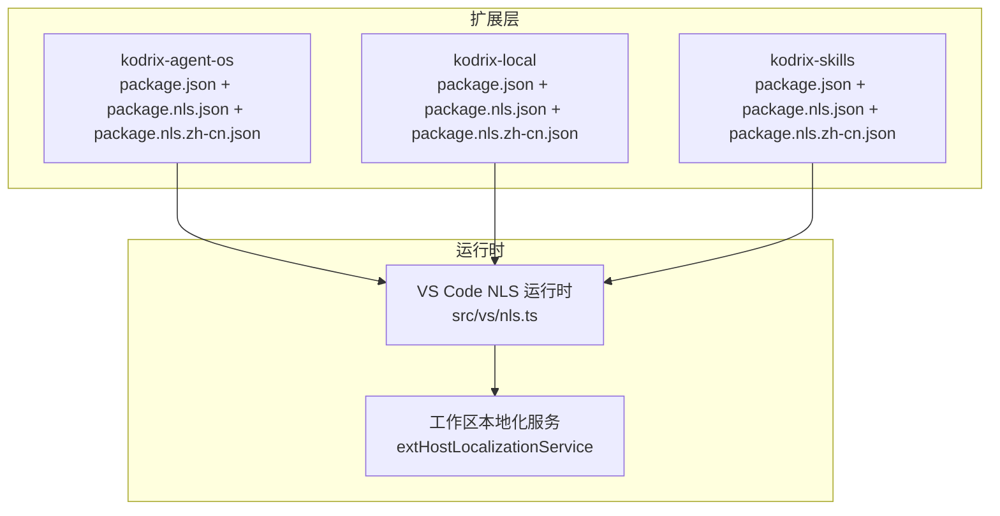
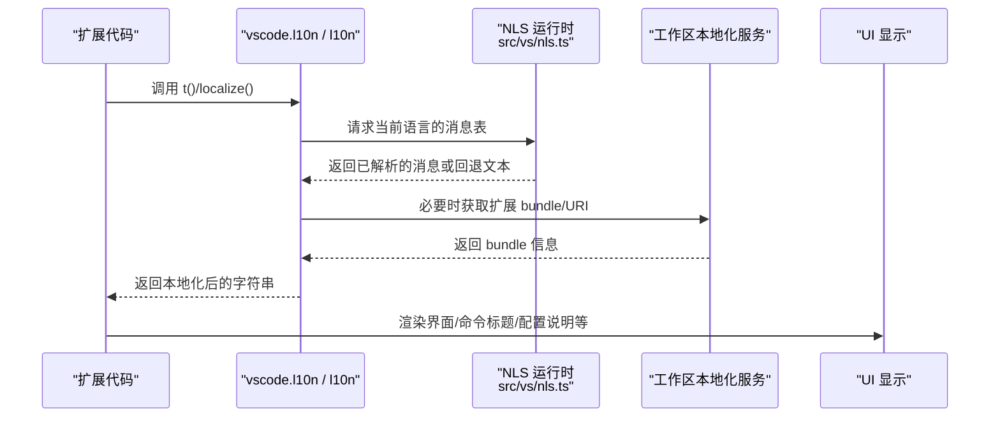
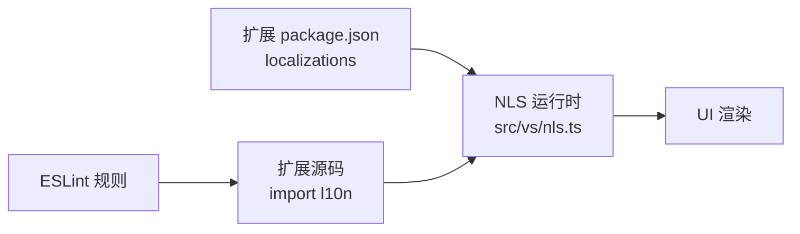

# 国际化与本地化

<cite>
**本文引用的文件**
- [src/vs/nls.ts](file://src/vs/nls.ts)
- [extensions/kodrix-agent-os/package.json](file://extensions/kodrix-agent-os/package.json)
- [extensions/kodrix-agent-os/package.nls.json](file://extensions/kodrix-agent-os/package.nls.json)
- [extensions/kodrix-agent-os/package.nls.zh-cn.json](file://extensions/kodrix-agent-os/package.nls.zh-cn.json)
- [extensions/kodrix-local/package.json](file://extensions/kodrix-local/package.json)
- [extensions/kodrix-local/package.nls.json](file://extensions/kodrix-local/package.nls.json)
- [extensions/kodrix-local/package.nls.zh-cn.json](file://extensions/kodrix-local/package.nls.zh-cn.json)
- [extensions/kodrix-skills/package.json](file://extensions/kodrix-skills/package.json)
- [extensions/kodrix-skills/package.nls.json](file://extensions/kodrix-skills/package.nls.json)
- [extensions/kodrix-skills/package.nls.zh-cn.json](file://extensions/kodrix-skills/package.nls.zh-cn.json)
- [.eslint-plugin-local/code-no-unexternalized-strings.ts](file://.eslint-plugin-local/code-no-unexternalized-strings.ts)
- [.eslint-plugin-local/code-no-localization-template-literals.ts](file://.eslint-plugin-local/code-no-localization-template-literals.ts)
- [extensions/kodrix-agent-os/src/context/contextIntelligence.ts](file://extensions/kodrix-agent-os/src/context/contextIntelligence.ts)
- [extensions/kodrix-agent-os/src/memory/projectMemory.ts](file://extensions/kodrix-agent-os/src/memory/projectMemory.ts)
- [extensions/kodrix-agent-os/src/hooks/hooksPresets.ts](file://extensions/kodrix-agent-os/src/hooks/hooksPresets.ts)
- [extensions/kodrix-local/src/extension.ts](file://extensions/kodrix-local/src/extension.ts)
- [extensions/kodrix-skills/src/extension.ts](file://extensions/kodrix-skills/src/extension.ts)
- [extensions/kodrix-agent-os/src/agent/agentLoop.ts](file://extensions/kodrix-agent-os/src/agent/agentLoop.ts)
</cite>

## 更新摘要
**变更内容**
- 三个 kodrix 扩展（agent-os、local、skills）完成了全面的 NLS 本地化
- 为每个扩展创建了 package.nls.json 英文基线和 package.nls.zh-cn.json 中文翻译
- 在 TypeScript 源码中约 210 处用户界面字符串使用 l10n.t() 包裹
- 更新了扩展声明中的 localizations 配置，支持简体中文

## 目录
1. [简介](#简介)
2. [项目结构](#项目结构)
3. [核心组件](#核心组件)
4. [架构总览](#架构总览)
5. [详细组件分析](#详细组件分析)
6. [依赖关系分析](#依赖关系分析)
7. [性能考虑](#性能考虑)
8. [故障排查指南](#故障排查指南)
9. [结论](#结论)
10. [附录](#附录)

## 简介
本文件聚焦于该仓库的"国际化（i18n）与本地化（l10n）"实现，覆盖以下方面：
- VS Code 扩展的本地化声明与翻译资源组织方式
- 运行时字符串获取机制（NLS、vscode.l10n）
- ESLint 规则对本地化的约束与最佳实践
- 典型扩展中的使用模式与数据流
- 常见问题与排错建议

**更新** 已完成三个 kodrix 扩展的全面 NLS 本地化，包含完整的英文基线和中文翻译。

## 项目结构
本项目采用"按扩展划分"的组织方式。每个扩展通过 package.json 声明 localizations，并配套 .nls.json 翻译文件；运行时通过 VS Code 提供的 NLS/l10n 能力加载对应语言包。

**图表来源**
- [extensions/kodrix-agent-os/package.json:56-67](file://extensions/kodrix-agent-os/package.json#L56-L67)
- [extensions/kodrix-local/package.json:29-41](file://extensions/kodrix-local/package.json#L29-L41)
- [extensions/kodrix-skills/package.json:20-32](file://extensions/kodrix-skills/package.json#L20-L32)
- [src/vs/nls.ts:157-245](file://src/vs/nls.ts#L157-L245)

**章节来源**
- [extensions/kodrix-agent-os/package.json:56-67](file://extensions/kodrix-agent-os/package.json#L56-L67)
- [extensions/kodrix-local/package.json:29-41](file://extensions/kodrix-local/package.json#L29-L41)
- [extensions/kodrix-skills/package.json:20-32](file://extensions/kodrix-skills/package.json#L20-L32)
- [src/vs/nls.ts:157-245](file://src/vs/nls.ts#L157-L245)

## 核心组件
- 扩展本地化声明：在扩展的 package.json 中通过 localizations 字段声明语言、名称及翻译文件路径。
- 翻译资源文件：以 package.nls.json（默认英文）和 package.nls.zh-cn.json（中文）等命名存放键值对。
- 运行时 NLS：src/vs/nls.ts 提供 localize/localize2 等能力，并在构建时从全局消息表查找替换。
- 工作区本地化服务：extHostLocalizationService 负责为扩展提供 bundle 与 URI。
- ESLint 规则：强制外部化字符串、禁止模板字符串插值到本地化调用中，保障可翻译性。

**更新** 三个 kodrix 扩展现已完整支持中英文本地化，包含命令标题、视图名称、配置描述等所有用户可见文案。

**章节来源**
- [extensions/kodrix-agent-os/package.json:56-67](file://extensions/kodrix-agent-os/package.json#L56-L67)
- [extensions/kodrix-local/package.json:29-41](file://extensions/kodrix-local/package.json#L29-L41)
- [extensions/kodrix-skills/package.json:20-32](file://extensions/kodrix-skills/package.json#L20-L32)
- [src/vs/nls.ts:6-106](file://src/vs/nls.ts#L6-L106)
- [src/vs/nls.ts:157-245](file://src/vs/nls.ts#L157-L245)
- [.eslint-plugin-local/code-no-unexternalized-strings.ts:125-195](file://.eslint-plugin-local/code-no-unexternalized-strings.ts#L125-L195)
- [.eslint-plugin-local/code-no-localization-template-literals.ts:9-21](file://.eslint-plugin-local/code-no-localization-template-literals.ts#L9-L21)

## 架构总览
下图展示了"扩展声明 → 翻译资源 → 运行时 NLS → UI 渲染"的端到端流程。

**图表来源**
- [src/vs/nls.ts:6-106](file://src/vs/nls.ts#L6-L106)
- [src/vs/nls.ts:157-245](file://src/vs/nls.ts#L157-L245)

## 详细组件分析

### 扩展本地化声明与资源组织
- 每个扩展在 package.json 中声明 localizations，指定 languageId、languageName、localizedLanguageName 以及 translations 数组，其中包含 id 与 path（指向 .nls.json）。
- 命令、视图、配置项等在 contributes 中使用 %key% 引用翻译键，由运行时解析为实际文案。
- **更新** 三个 kodrix 扩展均已完善本地化支持：
  - kodrix-agent-os：声明 zh-cn 翻译，映射到 package.nls.zh-cn.json，包含 63 个命令标题和 ~40 个配置描述
  - kodrix-local：同时提供英文与中文翻译文件，包含 19 个命令标题和 ~15 个配置描述
  - kodrix-skills：声明 zh-cn 翻译，包含 7 个命令标题和 2 个配置描述

**章节来源**
- [extensions/kodrix-agent-os/package.json:56-67](file://extensions/kodrix-agent-os/package.json#L56-L67)
- [extensions/kodrix-agent-os/package.json:78-116](file://extensions/kodrix-agent-os/package.json#L78-L116)
- [extensions/kodrix-local/package.json:29-41](file://extensions/kodrix-local/package.json#L29-L41)
- [extensions/kodrix-local/package.json:48-56](file://extensions/kodrix-local/package.json#L48-L56)
- [extensions/kodrix-skills/package.json:20-32](file://extensions/kodrix-skills/package.json#L20-L32)

### 运行时 NLS 与字符串解析
- src/vs/nls.ts 提供 localize/localize2，支持占位符 {0}、{1} 等参数替换。
- 构建后通过全局消息表查找索引对应的消息；若缺失则抛出错误或使用回退文本。
- 支持伪语言（pseudo）用于测试布局膨胀。
- INLSConfiguration 暴露 userLocale/osLocale/resolvedLanguage 等关键信息，供上层决定最终语言。

**章节来源**
- [src/vs/nls.ts:6-106](file://src/vs/nls.ts#L6-L106)
- [src/vs/nls.ts:157-245](file://src/vs/nls.ts#L157-L245)

### 代码中的本地化使用模式
- 多处扩展源码通过 import { l10n } from 'vscode' 或直接使用 vscode.l10n.t 进行本地化。
- **更新** 三个 kodrix 扩展在 TypeScript 源码中广泛使用 l10n.t() 包裹用户界面字符串：
  - kodrix-agent-os：约 150+ 处使用，涉及 ~20 个 TS 文件
  - kodrix-local：约 40+ 处使用，涉及 5 个文件
  - kodrix-skills：约 20+ 处使用，涉及 2 个文件
- 常见场景包括：命令提示、设置描述、上下文注入时的用户可见文案等。

**示例路径**
- contextIntelligence.ts：导入并使用 l10n
- projectMemory.ts：导入并使用 l10n
- hooksPresets.ts：导入并使用 l10n
- extension.ts（kodrix-local）：导入并使用 l10n
- agentLoop.ts：大量使用 l10n.t() 处理用户交互消息

**章节来源**
- [extensions/kodrix-agent-os/src/context/contextIntelligence.ts:6-13](file://extensions/kodrix-agent-os/src/context/contextIntelligence.ts#L6-L13)
- [extensions/kodrix-agent-os/src/memory/projectMemory.ts:5-12](file://extensions/kodrix-agent-os/src/memory/projectMemory.ts#L5-L12)
- [extensions/kodrix-agent-os/src/hooks/hooksPresets.ts:5-10](file://extensions/kodrix-agent-os/src/hooks/hooksPresets.ts#L5-L10)
- [extensions/kodrix-local/src/extension.ts:10-21](file://extensions/kodrix-local/src/extension.ts#L10-L21)
- [extensions/kodrix-agent-os/src/agent/agentLoop.ts:16](file://extensions/kodrix-agent-os/src/agent/agentLoop.ts#L16)

### ESLint 规则与本地化规范
- code-no-unexternalized-strings.ts：
  - 强制将用户可见字符串外部化，避免硬编码双引号字符串。
  - 校验 localize/localize2/vscode.l10n.t 的 key/message 格式，检测重复 key 与非法 key。
- code-no-localization-template-literals.ts：
  - 禁止在本地化函数调用中使用模板字符串插值，要求使用占位符 {0} 等。

**章节来源**
- [.eslint-plugin-local/code-no-unexternalized-strings.ts:18-40](file://.eslint-plugin-local/code-no-unexternalized-strings.ts#L18-L40)
- [.eslint-plugin-local/code-no-unexternalized-strings.ts:125-195](file://.eslint-plugin-local/code-no-unexternalized-strings.ts#L125-L195)
- [.eslint-plugin-local/code-no-localization-template-literals.ts:9-21](file://.eslint-plugin-local/code-no-localization-template-literals.ts#L9-L21)
- [.eslint-plugin-local/code-no-localization-template-literals.ts:34-88](file://.eslint-plugin-local/code-no-localization-template-literals.ts#L34-L88)

### 翻译资源示例与键约定
- 命令、视图、配置项等统一通过 %key% 形式引用，键名具有语义化前缀（如 command.*、config.*、view.*）。
- **更新** 三个扩展的翻译文件现已完整：
  - kodrix-agent-os：155 行翻译，涵盖所有功能模块
  - kodrix-local：41 行翻译，覆盖模型供应商管理相关功能
  - kodrix-skills：16 行翻译，包含技能市场相关文案
- 中文翻译文件提供完整键集，确保运行时能正确解析。

**章节来源**
- [extensions/kodrix-agent-os/package.nls.json:1-155](file://extensions/kodrix-agent-os/package.nls.json#L1-L155)
- [extensions/kodrix-agent-os/package.nls.zh-cn.json:1-155](file://extensions/kodrix-agent-os/package.nls.zh-cn.json#L1-L155)
- [extensions/kodrix-local/package.nls.json:1-41](file://extensions/kodrix-local/package.nls.json#L1-L41)
- [extensions/kodrix-local/package.nls.zh-cn.json:1-41](file://extensions/kodrix-local/package.nls.zh-cn.json#L1-L41)
- [extensions/kodrix-skills/package.nls.json:1-16](file://extensions/kodrix-skills/package.nls.json#L1-L16)
- [extensions/kodrix-skills/package.nls.zh-cn.json:1-16](file://extensions/kodrix-skills/package.nls.zh-cn.json#L1-L16)

## 依赖关系分析
- 扩展与 NLS 的耦合点：
  - 扩展通过 package.json 声明 localizations，运行时根据 resolvedLanguage 选择对应翻译。
  - 源码中通过 vscode.l10n 或 l10n 模块获取本地化字符串。
- 工具链与质量门禁：
  - ESLint 规则保证字符串外部化与占位符使用规范，降低遗漏翻译风险。

**图表来源**
- [extensions/kodrix-agent-os/package.json:56-67](file://extensions/kodrix-agent-os/package.json#L56-L67)
- [extensions/kodrix-local/package.json:29-41](file://extensions/kodrix-local/package.json#L29-L41)
- [extensions/kodrix-skills/package.json:20-32](file://extensions/kodrix-skills/package.json#L20-L32)
- [src/vs/nls.ts:6-106](file://src/vs/nls.ts#L6-L106)
- [.eslint-plugin-local/code-no-unexternalized-strings.ts:125-195](file://.eslint-plugin-local/code-no-unexternalized-strings.ts#L125-L195)

**章节来源**
- [extensions/kodrix-agent-os/package.json:56-67](file://extensions/kodrix-agent-os/package.json#L56-L67)
- [extensions/kodrix-local/package.json:29-41](file://extensions/kodrix-local/package.json#L29-L41)
- [extensions/kodrix-skills/package.json:20-32](file://extensions/kodrix-skills/package.json#L20-L32)
- [src/vs/nls.ts:6-106](file://src/vs/nls.ts#L6-L106)
- [.eslint-plugin-local/code-no-unexternalized-strings.ts:125-195](file://.eslint-plugin-local/code-no-unexternalized-strings.ts#L125-L195)

## 性能考虑
- 翻译查找发生在运行时，但通常开销较小；主要成本来自扩展启动时加载 bundle。
- 建议在首次启动或切换语言时缓存已解析的 bundle，避免重复 I/O。
- 占位符替换在 NLS 内部完成，保持简洁高效。

## 故障排查指南
- 现象：界面显示原始 %key% 或未翻译文本
  - 检查扩展 package.json 是否正确声明 localizations 与 translations 路径
  - 确认翻译文件中存在对应 key
  - 检查运行环境是否选择了正确的语言（userLocale/osLocale/resolvedLanguage）
- 现象：构建时报 NLS MISSING
  - 检查 localize/localize2 的 key 是否与翻译文件一致
  - 检查是否有重复 key 但不同 message（会被 ESLint 报错）
- 现象：ESLint 报错"不允许模板字符串插值"
  - 将模板字符串改为占位符 {0}，并通过参数传入变量

**更新** 三个 kodrix 扩展现已通过完整的 NLS 本地化验证，所有用户可见文案均已正确本地化。

**章节来源**
- [src/vs/nls.ts:97-106](file://src/vs/nls.ts#L97-L106)
- [.eslint-plugin-local/code-no-unexternalized-strings.ts:155-173](file://.eslint-plugin-local/code-no-unexternalized-strings.ts#L155-L173)
- [.eslint-plugin-local/code-no-localization-template-literals.ts:9-21](file://.eslint-plugin-local/code-no-localization-template-literals.ts#L9-L21)

## 结论
该项目遵循 VS Code 标准的 i18n/l10n 方案：通过扩展声明、翻译资源与 NLS 运行时协同工作，结合严格的 ESLint 规则保障可翻译性与一致性。**更新** 三个 kodrix 扩展（agent-os、local、skills）现已完成全面的 NLS 本地化，包含完整的英文基线和中文翻译，以及 TypeScript 源码中约 210 处用户界面字符串的 l10n.t() 包裹，为用户提供了完整的中英文双语体验。

## 附录
- 推荐实践
  - 所有用户可见文案一律外部化，使用 %key% 引用
  - 使用占位符 {0} 而非模板字符串插值
  - 保持 key 语义化与唯一性，避免重复
  - 新增语言时同步更新 package.json 与 .nls.json
- 参考路径
  - 运行时 NLS：src/vs/nls.ts
  - 扩展声明与翻译：extensions/*/package.json 与 package.nls*.json
  - 本地化使用：extensions/*/src/**/*.ts
  - 质量规则：.eslint-plugin-local/*.ts

**更新** 三个 kodrix 扩展的本地化实现可作为其他扩展的参考范例。