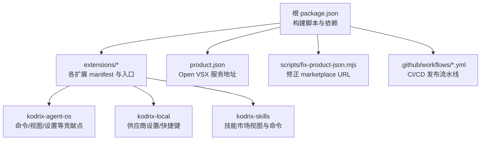
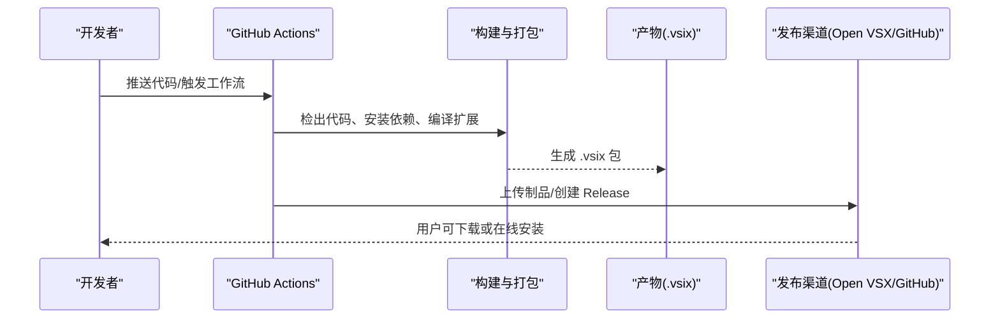
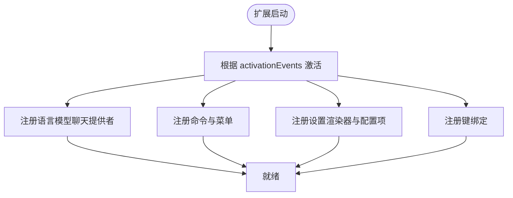
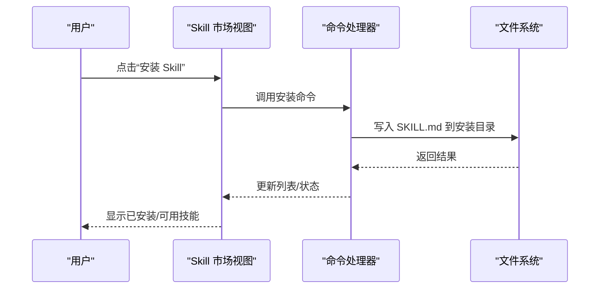
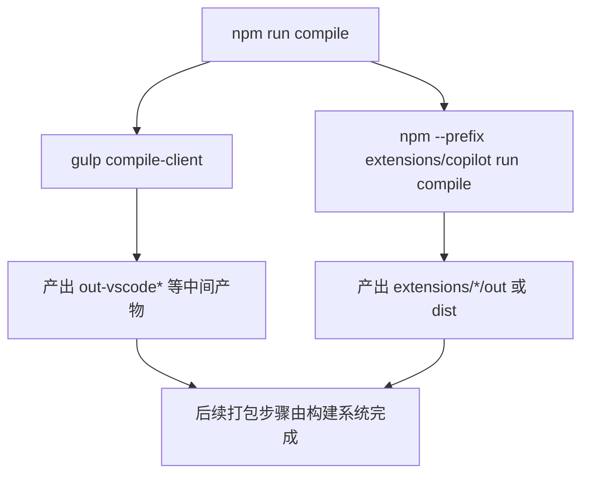
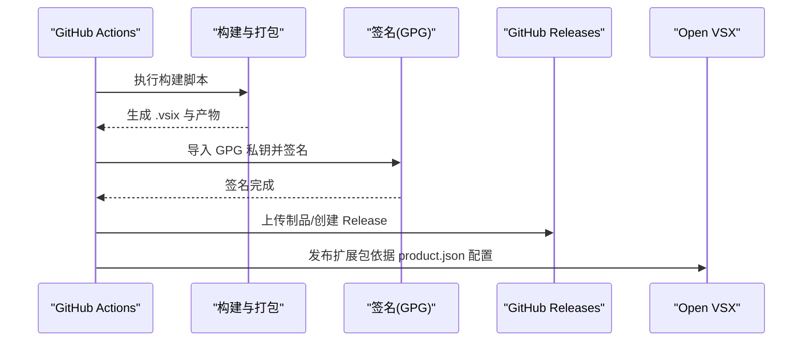
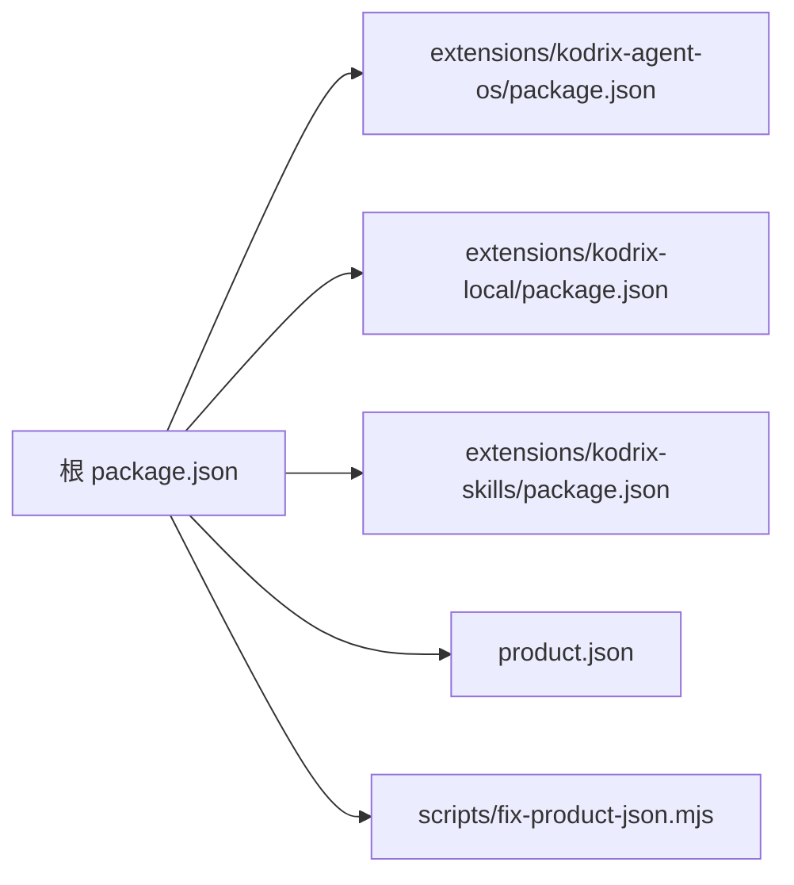

# 打包与分发

<cite>
**本文引用的文件**
- [package.json](file://package.json)
- [extensions/kodrix-agent-os/package.json](file://extensions/kodrix-agent-os/package.json)
- [extensions/kodrix-local/package.json](file://extensions/kodrix-local/package.json)
- [extensions/kodrix-skills/package.json](file://extensions/kodrix-skills/package.json)
- [product.json](file://product.json)
- [scripts/fix-product-json.mjs](file://scripts/fix-product-json.mjs)
- [extensions/CONTRIBUTING.md](file://extensions/CONTRIBUTING.md)
- [.github/workflows/publish-stable-spearhead.yml](file:.github/workflows/publish-stable-spearhead.yml)
- [.github/workflows/publish-insider-spearhead.yml](file:.github/workflows/publish-insider-spearhead.yml)
</cite>

## 目录
1. [简介](#简介)
2. [项目结构](#项目结构)
3. [核心组件](#核心组件)
4. [架构总览](#架构总览)
5. [详细组件分析](#详细组件分析)
6. [依赖关系分析](#依赖关系分析)
7. [性能考虑](#性能考虑)
8. [故障排除指南](#故障排除指南)
9. [结论](#结论)
10. [附录](#附录)

## 简介
本文件面向 VS Code 扩展的打包与分发，覆盖从源码编译、打包为可分发的 .vsix 包，到发布至 Open VSX 市场与 GitHub Marketplace 的完整流程。文档重点说明 package.json 的关键配置项（元数据、依赖、贡献点、平台相关）、签名与安全验证机制、本地开发与测试安装方式，以及维护与升级策略，并给出常见问题排查方法。

## 项目结构
仓库包含多个内置扩展与构建脚本：
- 根级 package.json 提供整体构建脚本与依赖管理。
- extensions 目录下包含多个扩展（如 kodrix-agent-os、kodrix-local、kodrix-skills），每个扩展拥有独立的 package.json 与构建脚本。
- product.json 定义产品级服务地址（例如 Open VSX 市场）。
- scripts 下包含辅助脚本（如修正 product.json 以指向 Open VSX）。
- .github/workflows 提供稳定版与 Insider 版的发布流水线。



图表来源
- [package.json:12-100](file://package.json#L12-L100)
- [extensions/kodrix-agent-os/package.json:23-537](file://extensions/kodrix-agent-os/package.json#L23-L537)
- [extensions/kodrix-local/package.json:23-273](file://extensions/kodrix-local/package.json#L23-L273)
- [extensions/kodrix-skills/package.json:19-122](file://extensions/kodrix-skills/package.json#L19-L122)
- [product.json:54-63](file://product.json#L54-L63)
- [scripts/fix-product-json.mjs:66](file://scripts/fix-product-json.mjs#L66)
- [.github/workflows/publish-stable-spearhead.yml:55-120](file:.github/workflows/publish-stable-spearhead.yml#L55-L120)
- [.github/workflows/publish-insider-spearhead.yml:55-120](file:.github/workflows/publish-insider-spearhead.yml#L55-L120)

章节来源
- [package.json:12-100](file://package.json#L12-L100)
- [extensions/CONTRIBUTING.md:5-33](file://extensions/CONTRIBUTING.md#L5-L33)

## 核心组件
- 扩展清单（manifest）：每个扩展的 package.json 定义了名称、版本、发布者、引擎要求、激活事件、主入口、贡献点（命令、视图、菜单、设置、键绑定、本地化等）。
- 构建脚本：根 package.json 中的 npm scripts 调用 gulp/esbuild 等工具进行编译与打包；各扩展通过 gulp 任务编译输出到 out/dist。
- 产品配置：product.json 指定 Open VSX 市场服务地址，便于在构建或运行时使用。
- CI/CD：GitHub Actions 工作流负责稳定版与 Insider 版的构建、签名、发布。

章节来源
- [extensions/kodrix-agent-os/package.json:1-22](file://extensions/kodrix-agent-os/package.json#L1-L22)
- [extensions/kodrix-local/package.json:1-22](file://extensions/kodrix-local/package.json#L1-L22)
- [extensions/kodrix-skills/package.json:1-18](file://extensions/kodrix-skills/package.json#L1-L18)
- [package.json:12-100](file://package.json#L12-L100)
- [product.json:54-63](file://product.json#L54-L63)

## 架构总览
下图展示了扩展打包与发布的端到端流程：开发者提交代码 → CI 拉取代码 → 执行构建与打包 → 生成 .vsix → 上传至发布渠道（GitHub Releases/Open VSX）。



图表来源
- [.github/workflows/publish-stable-spearhead.yml:55-120](file:.github/workflows/publish-stable-spearhead.yml#L55-L120)
- [.github/workflows/publish-insider-spearhead.yml:55-120](file:.github/workflows/publish-insider-spearhead.yml#L55-L120)

## 详细组件分析

### 扩展清单与贡献点（kodrix-agent-os）
该扩展通过 package.json 声明了丰富的贡献点，包括：
- 激活事件与主入口
- 设置编辑器渲染器
- Chat 参与者与命令
- 本地化资源
- 视图容器与视图
- 命令、键绑定、菜单
- 配置属性（功能开关、行为参数）

这些贡献点决定了扩展在安装后如何与 VS Code 集成，并在 UI 中暴露能力。

```mermaid
classDiagram
class ExtensionManifest {
+name
+displayName
+version
+publisher
+engines.vscode
+activationEvents[]
+main
+contributes
}
class Contributes {
+settingsEditorRenderers[]
+chatParticipants[]
+localizations[]
+viewsContainers[]
+views[]
+commands[]
+keybindings[]
+menus{}
+configuration{}
}
ExtensionManifest --> Contributes : "声明扩展能力"
```

图表来源
- [extensions/kodrix-agent-os/package.json:1-22](file://extensions/kodrix-agent-os/package.json#L1-L22)
- [extensions/kodrix-agent-os/package.json:23-537](file://extensions/kodrix-agent-os/package.json#L23-L537)

章节来源
- [extensions/kodrix-agent-os/package.json:1-800](file://extensions/kodrix-agent-os/package.json#L1-L800)

### 扩展清单与贡献点（kodrix-local）
该扩展聚焦于模型供应商配置与快捷键体验，贡献点包括：
- 设置编辑器渲染器（用于内嵌供应商管理界面）
- 本地化资源
- 语言模型聊天提供者
- 命令（迁移配置、打开供应商面板、应用预设等）
- 配置属性（功能开关、路由、窗口布局等）
- 键绑定（快捷打开聊天、行内编辑、Agents 窗口等）



图表来源
- [extensions/kodrix-local/package.json:15-273](file://extensions/kodrix-local/package.json#L15-L273)

章节来源
- [extensions/kodrix-local/package.json:1-283](file://extensions/kodrix-local/package.json#L1-L283)

### 扩展清单与贡献点（kodrix-skills）
该扩展提供 Skill 市场能力，贡献点包括：
- 本地化资源
- 活动栏视图容器与 Webview 视图
- 命令（刷新、安装/卸载、从 URL/GitHub 安装、导入 Cursor Skills、搜索与打开市场）
- 菜单（视图标题栏操作）
- 配置属性（安装目录、远程注册表 URL）



图表来源
- [extensions/kodrix-skills/package.json:19-122](file://extensions/kodrix-skills/package.json#L19-L122)

章节来源
- [extensions/kodrix-skills/package.json:1-135](file://extensions/kodrix-skills/package.json#L1-L135)

### 构建与打包流程（npm scripts 与 gulp）
根 package.json 提供了大量构建与开发脚本，包括：
- 编译客户端与 Copilot 扩展
- 快速构建与监听
- 下载内置扩展
- 类型检查与合规检查
- 最小化与构建产物处理

各扩展通过 gulp 任务编译输出到 out 或 dist 目录，遵循内置扩展的标准结构。



图表来源
- [package.json:27-31](file://package.json#L27-L31)
- [extensions/CONTRIBUTING.md:15-18](file://extensions/CONTRIBUTING.md#L15-L18)

章节来源
- [package.json:27-31](file://package.json#L27-L31)
- [extensions/CONTRIBUTING.md:5-33](file://extensions/CONTRIBUTING.md#L5-L33)

### 发布到 Open VSX 与 GitHub Marketplace
- Open VSX 市场地址已在 product.json 中配置，构建或运行时会使用该服务。
- 可通过脚本 fix-product-json.mjs 修正 marketplace 相关 URL，确保指向 Open VSX。
- GitHub Actions 工作流负责稳定版与 Insider 版的构建与发布，包含环境准备、构建、GPG 签名、上传 sourcemaps、创建 Release 等操作。



图表来源
- [product.json:54-63](file://product.json#L54-L63)
- [scripts/fix-product-json.mjs:66](file://scripts/fix-product-json.mjs#L66)
- [.github/workflows/publish-stable-spearhead.yml:88-120](file:.github/workflows/publish-stable-spearhead.yml#L88-L120)
- [.github/workflows/publish-insider-spearhead.yml:88-120](file:.github/workflows/publish-insider-spearhead.yml#L88-L120)

章节来源
- [product.json:54-63](file://product.json#L54-L63)
- [scripts/fix-product-json.mjs:66](file://scripts/fix-product-json.mjs#L66)
- [.github/workflows/publish-stable-spearhead.yml:55-120](file:.github/workflows/publish-stable-spearhead.yml#L55-L120)
- [.github/workflows/publish-insider-spearhead.yml:55-120](file:.github/workflows/publish-insider-spearhead.yml#L55-L120)

### 扩展签名与安全验证
- 工作流中包含 GPG 密钥导入与签名步骤，用于对构建产物或提交进行签名，增强可信度。
- 仓库中存在针对扩展签名验证的补丁与策略调整，可根据需要启用或关闭验证逻辑。

章节来源
- [.github/workflows/publish-stable-spearhead.yml:88-95](file:.github/workflows/publish-stable-spearhead.yml#L88-L95)
- [.github/workflows/publish-insider-spearhead.yml:88-95](file:.github/workflows/publish-insider-spearhead.yml#L88-L95)

### 本地开发与测试安装
- 从文件夹直接加载：将扩展目录作为工作区或通过 VS Code 的“从文件夹安装扩展”功能加载，适用于调试与快速迭代。
- 本地包安装：先通过 gulp 编译扩展到 out 或 dist，再使用 VS Code CLI 安装生成的 .vsix 文件进行验证。
- 内置扩展结构参考：src 为主源码目录，tsconfig.json 继承基础配置，esbuild.mts 用于生产构建，.vscodeignore 控制忽略文件。

章节来源
- [extensions/CONTRIBUTING.md:5-33](file://extensions/CONTRIBUTING.md#L5-L33)

## 依赖关系分析
- 根 package.json 集中管理依赖与开发依赖，并通过 overrides 解决兼容性问题。
- 各扩展的 package.json 仅声明自身所需依赖与 devDependencies，保持低耦合。
- product.json 与脚本共同决定扩展市场与服务地址，避免硬编码。



图表来源
- [package.json:101-283](file://package.json#L101-L283)
- [extensions/kodrix-agent-os/package.json:1-22](file://extensions/kodrix-agent-os/package.json#L1-L22)
- [extensions/kodrix-local/package.json:1-22](file://extensions/kodrix-local/package.json#L1-L22)
- [extensions/kodrix-skills/package.json:1-18](file://extensions/kodrix-skills/package.json#L1-L18)
- [product.json:54-63](file://product.json#L54-L63)
- [scripts/fix-product-json.mjs:66](file://scripts/fix-product-json.mjs#L66)

章节来源
- [package.json:101-283](file://package.json#L101-L283)
- [product.json:54-63](file://product.json#L54-L63)

## 性能考虑
- 使用 esbuild 与 gulp 进行增量编译与并行构建，减少构建时间。
- 合理划分扩展职责，避免单扩展承担过多功能导致启动与内存占用过高。
- 通过 activationEvents 精确控制扩展激活时机，降低冷启动开销。
- 利用 .vscodeignore 排除不必要的文件，减小包体积与安装时间。

[本节为通用指导，不直接分析具体文件]

## 故障排除指南
- 构建失败：检查 Node.js 版本与依赖是否匹配，确认 gulp/esbuild 任务是否正确执行。
- 扩展未激活：核对 activationEvents 与 main 入口路径是否正确。
- 市场地址错误：确认 product.json 与 fix-product-json.mjs 的配置指向 Open VSX。
- 签名失败：检查工作流中的 GPG 私钥与密码是否正确注入，并确保签名步骤成功。
- 安装失败：确认 .vsix 文件完整性与 VS Code 版本兼容性（engines.vscode）。

章节来源
- [package.json:27-31](file://package.json#L27-L31)
- [extensions/kodrix-agent-os/package.json:15-18](file://extensions/kodrix-agent-os/package.json#L15-L18)
- [extensions/kodrix-local/package.json:15-22](file://extensions/kodrix-local/package.json#L15-L22)
- [extensions/kodrix-skills/package.json:14-18](file://extensions/kodrix-skills/package.json#L14-L18)
- [product.json:54-63](file://product.json#L54-L63)
- [scripts/fix-product-json.mjs:66](file://scripts/fix-product-json.mjs#L66)
- [.github/workflows/publish-stable-spearhead.yml:88-95](file:.github/workflows/publish-stable-spearhead.yml#L88-L95)
- [.github/workflows/publish-insider-spearhead.yml:88-95](file:.github/workflows/publish-insider-spearhead.yml#L88-L95)

## 结论
本仓库通过清晰的扩展清单、统一的构建脚本与 CI/CD 流水线，实现了可扩展、可维护、可安全发布的扩展体系。借助 product.json 与脚本，可将扩展发布至 Open VSX 市场；通过 GitHub Actions 实现自动化构建、签名与发布。建议持续优化激活策略与包体积，确保用户体验与稳定性。

[本节为总结性内容，不直接分析具体文件]

## 附录
- 常用命令参考：
  - 编译客户端与 Copilot 扩展：npm run compile
  - 快速构建扩展：npm run build-fast-extensions
  - 下载内置扩展：npm run download-builtin-extensions
  - 类型检查与合规检查：npm run typecheck-client / npm run hygiene
- 扩展结构参考：src/tsconfig.json 继承基础配置，esbuild.mts 用于生产构建，.vscodeignore 控制忽略文件。

章节来源
- [package.json:27-31](file://package.json#L27-L31)
- [extensions/CONTRIBUTING.md:5-33](file://extensions/CONTRIBUTING.md#L5-L33)