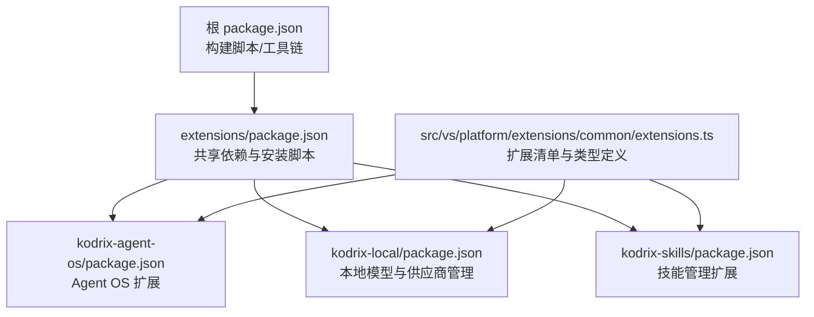
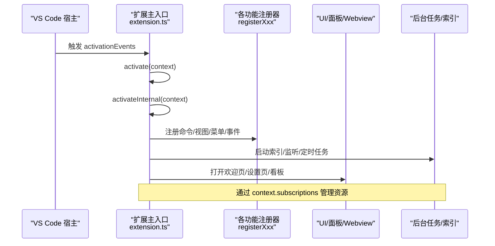
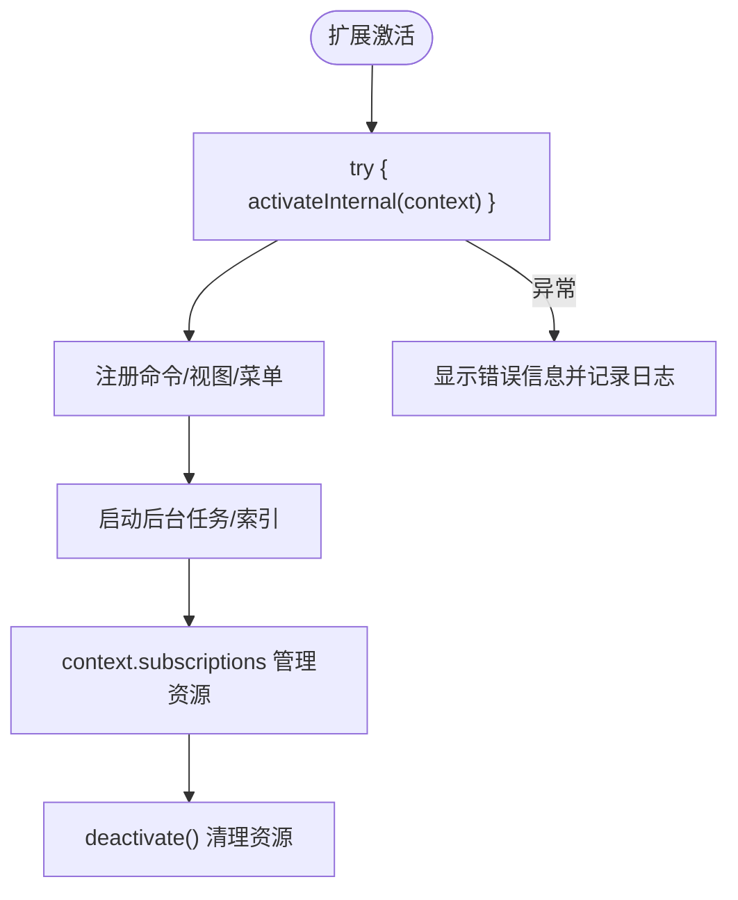
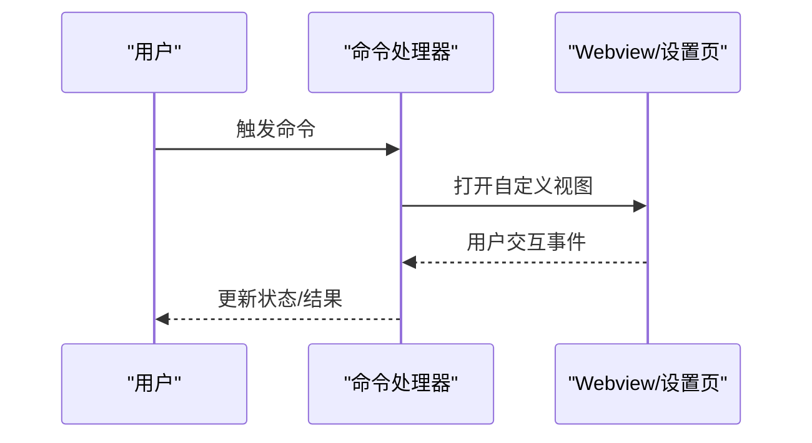
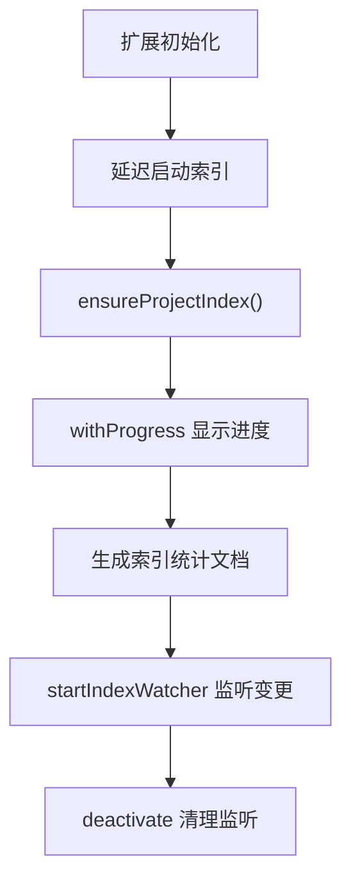
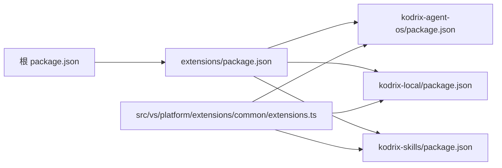

# 扩展开发

<cite>
**本文引用的文件**
- [package.json](file://package.json)
- [extensions/package.json](file://extensions/package.json)
- [extensions/kodrix-agent-os/package.json](file://extensions/kodrix-agent-os/package.json)
- [extensions/kodrix-local/package.json](file://extensions/kodrix-local/package.json)
- [extensions/kodrix-skills/package.json](file://extensions/kodrix-skills/package.json)
- [extensions/kodrix-agent-os/tsconfig.test.json](file://extensions/kodrix-agent-os/tsconfig.test.json)
- [extensions/kodrix-local/tsconfig.test.json](file://extensions/kodrix-local/tsconfig.test.json)
- [extensions/kodrix-skills/tsconfig.test.json](file://extensions/kodrix-skills/tsconfig.test.json)
- [src/vs/platform/extensions/common/extensions.ts](file://src/vs/platform/extensions/common/extensions.ts)
- [extensions/kodrix-agent-os/src/extension.ts](file://extensions/kodrix-agent-os/src/extension.ts)
</cite>

## 更新摘要
**变更内容**
- 新增 TypeScript 测试编译配置章节，详细介绍 tsconfig.test.json 配置文件
- 更新调试与测试章节，包含独立的测试编译流程和脚本配置
- 补充测试环境搭建和运行指南

## 目录
1. [简介](#简介)
2. [项目结构](#项目结构)
3. [核心组件](#核心组件)
4. [架构总览](#架构总览)
5. [详细组件分析](#详细组件分析)
6. [依赖关系分析](#依赖关系分析)
7. [性能考量](#性能考量)
8. [故障排查指南](#故障排查指南)
9. [结论](#结论)
10. [附录](#附录)

## 简介
本指南面向希望基于 Kodrix（VS Code 生态）进行扩展开发的工程师，系统讲解扩展架构、激活与生命周期、消息通信机制、常用开发模式（Webview、命令注册、UI 集成、后台任务）、调试与测试、打包发布与分发流程，并提供从入门到精通的学习路径。内容以仓库内现有扩展实现为依据，结合 VS Code 扩展模型进行说明。

## 项目结构
Kodrix 的扩展位于 extensions 目录下，每个子目录是一个独立扩展包，遵循 VS Code 扩展规范：
- 根 package.json 提供构建脚本与工具链配置，支持编译、监听、打包等。
- extensions/package.json 为所有扩展共享依赖与安装后处理脚本。
- 具体扩展如 kodrix-agent-os、kodrix-local、kodrix-skills 通过各自的 package.json 声明入口、激活事件、贡献点（命令、视图、菜单、设置渲染器、聊天参与者等）。
- 平台层在 src/vs/platform/extensions/common/extensions.ts 中定义了扩展清单类型、贡献点结构与扩展标识等基础类型。



**图表来源**
- [package.json:1-100](file://package.json#L1-L100)
- [extensions/package.json:1-21](file://extensions/package.json#L1-L21)
- [extensions/kodrix-agent-os/package.json:1-120](file://extensions/kodrix-agent-os/package.json#L1-L120)
- [extensions/kodrix-local/package.json:1-120](file://extensions/kodrix-local/package.json#L1-L120)
- [extensions/kodrix-skills/package.json:1-136](file://extensions/kodrix-skills/package.json#L1-L136)
- [src/vs/platform/extensions/common/extensions.ts:14-245](file://src/vs/platform/extensions/common/extensions.ts#L14-L245)

**章节来源**
- [package.json:1-100](file://package.json#L1-L100)
- [extensions/package.json:1-21](file://extensions/package.json#L1-L21)
- [src/vs/platform/extensions/common/extensions.ts:14-245](file://src/vs/platform/extensions/common/extensions.ts#L14-L245)

## 核心组件
- 扩展清单与贡献点：通过 package.json 的 contributes 字段声明命令、视图、菜单、设置渲染器、聊天参与者、键绑定等；平台层提供对应类型约束。
- 激活与生命周期：扩展通过 activationEvents 控制何时加载；主入口 main 指向 out/extension；activate(context) 完成初始化，deactivate() 负责清理。
- 命令与 UI 集成：通过 commands、menus、views、keybindings 暴露能力；使用 Webview 或自定义设置渲染器增强体验。
- 后台任务与索引：可启动后台进程或定时器执行耗时任务（如代码库语义索引），并通过进度条与日志反馈。

**章节来源**
- [extensions/kodrix-agent-os/package.json:15-120](file://extensions/kodrix-agent-os/package.json#L15-L120)
- [extensions/kodrix-local/package.json:15-120](file://extensions/kodrix-local/package.json#L15-L120)
- [extensions/kodrix-skills/package.json:15-136](file://extensions/kodrix-skills/package.json#L15-L136)
- [src/vs/platform/extensions/common/extensions.ts:14-245](file://src/vs/platform/extensions/common/extensions.ts#L14-L245)
- [extensions/kodrix-agent-os/src/extension.ts:158-321](file://extensions/kodrix-agent-os/src/extension.ts#L158-L321)

## 架构总览
Kodrix 扩展采用"声明式清单 + 模块化激活"的架构：
- 清单驱动：package.json 声明能力边界与触发条件。
- 模块装配：activateInternal 中按职责调用各 registerXxx 函数，集中注册命令、视图、事件监听、后台任务等。
- 资源与状态：通过 context.subscriptions 统一管理订阅与销毁，确保生命周期安全。
- 外部集成：通过 enabledApiProposals 启用实验性 API（如 settingsEditorRenderer、chatContextProvider），并对接聊天参与者、语言模型提供者等。



**图表来源**
- [extensions/kodrix-agent-os/src/extension.ts:158-321](file://extensions/kodrix-agent-os/src/extension.ts#L158-L321)
- [extensions/kodrix-agent-os/package.json:15-120](file://extensions/kodrix-agent-os/package.json#L15-L120)

## 详细组件分析

### 扩展激活与生命周期
- 激活入口：activate(context) 包裹错误边界，失败时提示用户并记录日志。
- 内部装配：activateInternal(context) 集中调用各 registerXxx，完成命令、视图、菜单、事件监听、后台任务的注册。
- 资源管理：context.subscriptions.push(...) 统一收集订阅项；deactivate() 中调用 disposeAllTrackedPanels、cancelBootstrapTimers、disposeIndexWatcher、logger.dispose 等释放资源。
- 延迟初始化：对耗时操作（如全工程语义索引）使用 setTimeout 延迟启动，避免阻塞冷启动。



**图表来源**
- [extensions/kodrix-agent-os/src/extension.ts:158-321](file://extensions/kodrix-agent-os/src/extension.ts#L158-L321)

**章节来源**
- [extensions/kodrix-agent-os/src/extension.ts:158-321](file://extensions/kodrix-agent-os/src/extension.ts#L158-L321)

### 命令注册与 UI 集成
- 命令声明：在 package.json 的 contributes.commands 中声明命令 ID、标题、分类；在 extension.ts 中通过 vscode.commands.registerCommand 绑定实现。
- 视图与菜单：contributes.views 与 contributes.menus 声明侧栏视图与上下文菜单；when 条件控制可见性。
- 设置渲染器：enabledApiProposals 启用 settingsEditorRenderer，并在 contributes.settingsEditorRenderers 中声明自定义设置页 viewType。
- 快捷键：contributes.keybindings 将命令绑定到键盘快捷键，支持 when 条件。

```mermaid
classDiagram
class ExtensionManifest {
+commands[]
+views{}
+menus{}
+keybindings[]
+settingsEditorRenderers[]
}
class ExtensionRuntime {
+registerCommand(id, handler)
+openCustomEditor(viewType)
+showMessage(type, message)
}
ExtensionManifest <.. ExtensionRuntime : "声明 -> 运行时注册"
```

**图表来源**
- [extensions/kodrix-agent-os/package.json:78-537](file://extensions/kodrix-agent-os/package.json#L78-L537)
- [extensions/kodrix-local/package.json:48-273](file://extensions/kodrix-local/package.json#L48-L273)
- [extensions/kodrix-skills/package.json:48-136](file://extensions/kodrix-skills/package.json#L48-L136)
- [src/vs/platform/extensions/common/extensions.ts:18-245](file://src/vs/platform/extensions/common/extensions.ts#L18-L245)

**章节来源**
- [extensions/kodrix-agent-os/package.json:78-537](file://extensions/kodrix-agent-os/package.json#L78-L537)
- [extensions/kodrix-local/package.json:48-273](file://extensions/kodrix-local/package.json#L48-L273)
- [extensions/kodrix-skills/package.json:48-136](file://extensions/kodrix-skills/package.json#L48-L136)
- [src/vs/platform/extensions/common/extensions.ts:18-245](file://src/vs/platform/extensions/common/extensions.ts#L18-L245)

### Webview 与自定义设置页
- Webview：用于展示复杂 UI（如 Hub、Spec 工作台），可通过命令打开，并与扩展后端通信。
- 自定义设置页：通过 settingsEditorRenderer 在设置界面嵌入自定义 UI，提升配置体验。
- 主题与样式：建议继承 VS Code 主题变量，避免硬编码颜色。



**图表来源**
- [extensions/kodrix-agent-os/package.json:23-28](file://extensions/kodrix-agent-os/package.json#L23-L28)
- [extensions/kodrix-local/package.json:23-28](file://extensions/kodrix-local/package.json#L23-L28)

**章节来源**
- [extensions/kodrix-agent-os/package.json:23-28](file://extensions/kodrix-agent-os/package.json#L23-L28)
- [extensions/kodrix-local/package.json:23-28](file://extensions/kodrix-local/package.json#L23-L28)

### 后台任务与索引
- 后台任务：通过 setTimeout 或异步任务启动耗时操作（如代码库语义索引），并使用 withProgress 提供进度反馈。
- 索引构建：ensureProjectIndex 负责构建/重建索引，统计文件数、符号数、导入/调用关系等。
- 监听与清理：startIndexWatcher 监听文件变化；deactivate 中调用 disposeIndexWatcher 释放资源。



**图表来源**
- [extensions/kodrix-agent-os/src/extension.ts:214-321](file://extensions/kodrix-agent-os/src/extension.ts#L214-L321)

**章节来源**
- [extensions/kodrix-agent-os/src/extension.ts:214-321](file://extensions/kodrix-agent-os/src/extension.ts#L214-L321)

### 聊天参与者与第三方服务集成
- 聊天参与者：通过 contributes.chatParticipants 声明参与者 ID、名称、描述与命令，扩展可在 Chat 中提供自然语言问答能力。
- 第三方服务：通过 enabledApiProposals 启用实验性 API（如 chatContextProvider），并结合配置（如 Embedding Provider）接入外部服务。

```mermaid
sequenceDiagram
participant User as "用户"
participant Chat as "Chat 面板"
participant Participant as "聊天参与者"
participant Service as "第三方服务"
User->>Chat : 输入 @codebase 查询
Chat->>Participant : 路由到参与者
Participant->>Service : 调用 Embedding/索引服务
Service-->>Participant : 返回结果
Participant-->>Chat : 格式化响应
Chat-->>User : 展示答案
```

**图表来源**
- [extensions/kodrix-agent-os/package.json:29-55](file://extensions/kodrix-agent-os/package.json#L29-L55)
- [extensions/kodrix-agent-os/src/extension.ts:141-156](file://extensions/kodrix-agent-os/src/extension.ts#L141-L156)

**章节来源**
- [extensions/kodrix-agent-os/package.json:29-55](file://extensions/kodrix-agent-os/package.json#L29-L55)
- [extensions/kodrix-agent-os/src/extension.ts:141-156](file://extensions/kodrix-agent-os/src/extension.ts#L141-L156)

## 依赖关系分析
- 根 package.json 提供构建与测试脚本，支持 watch、compile、test-extension 等。
- extensions/package.json 提供 TypeScript 与 esbuild 等共享依赖，以及 postinstall 钩子。
- 各扩展通过 package.json 声明 engines.vscode 版本要求与 categories 分类。
- 平台层 types（extensions.ts）约束扩展清单结构，确保 contributes 字段类型安全。



**图表来源**
- [package.json:12-100](file://package.json#L12-L100)
- [extensions/package.json:1-21](file://extensions/package.json#L1-L21)
- [extensions/kodrix-agent-os/package.json:1-22](file://extensions/kodrix-agent-os/package.json#L1-L22)
- [extensions/kodrix-local/package.json:1-22](file://extensions/kodrix-local/package.json#L1-L22)
- [extensions/kodrix-skills/package.json:1-22](file://extensions/kodrix-skills/package.json#L1-L22)
- [src/vs/platform/extensions/common/extensions.ts:14-245](file://src/vs/platform/extensions/common/extensions.ts#L14-L245)

**章节来源**
- [package.json:12-100](file://package.json#L12-L100)
- [extensions/package.json:1-21](file://extensions/package.json#L1-L21)
- [src/vs/platform/extensions/common/extensions.ts:14-245](file://src/vs/platform/extensions/common/extensions.ts#L14-L245)

## 性能考量
- 延迟初始化：对耗时操作（如索引构建）使用 setTimeout 延迟，避免阻塞激活。
- 进度反馈：使用 withProgress 向用户展示长时间任务进度。
- 资源清理：在 deactivate 中释放监听器、定时器、面板等资源，防止内存泄漏。
- 配置热更新：监听配置变更（如 onDidChangeConfiguration）动态调整行为（如切换 Embedding Provider）。

[本节为通用指导，不直接分析具体文件]

## 故障排查指南
- 激活失败：activate 中的 try/catch 捕获异常并显示错误信息；检查 activationEvents 与 main 入口是否正确。
- 命令未生效：确认 package.json 中 contributes.commands 与 extension.ts 中 registerCommand 的 ID 一致。
- 视图不可见：检查 contributes.views 的 when 条件是否满足当前工作区状态。
- 后台任务无输出：确认日志输出与进度提示；检查 dispose 是否过早释放资源。

**章节来源**
- [extensions/kodrix-agent-os/src/extension.ts:158-168](file://extensions/kodrix-agent-os/src/extension.ts#L158-L168)
- [extensions/kodrix-agent-os/package.json:78-537](file://extensions/kodrix-agent-os/package.json#L78-L537)

## 结论
Kodrix 的扩展体系基于 VS Code 标准模型，通过声明式清单与模块化激活实现高内聚、低耦合的能力扩展。开发者可借助命令、视图、Webview、聊天参与者等扩展点快速构建功能；通过合理的生命周期管理与后台任务设计，保证用户体验与性能。建议从最小可用功能起步，逐步引入 Webview、第三方服务集成与复杂编排能力。

[本节为总结性内容，不直接分析具体文件]

## 附录

### 开发环境搭建
- 安装依赖：在根目录与 extensions 目录执行 npm install。
- 编译扩展：使用根 package.json 提供的 gulp 任务或扩展自身的 compile/watch 脚本。
- 运行与调试：使用 VS Code 调试配置启动宿主，附加到扩展进程进行断点调试。

**章节来源**
- [package.json:12-100](file://package.json#L12-L100)
- [extensions/kodrix-agent-os/package.json:854-857](file://extensions/kodrix-agent-os/package.json#L854-L857)
- [extensions/kodrix-local/package.json:275-278](file://extensions/kodrix-local/package.json#L275-L278)
- [extensions/kodrix-skills/package.json:124-128](file://extensions/kodrix-skills/package.json#L124-L128)

### TypeScript 测试编译配置

**新增** 扩展开发流程得到了显著改进，新增了独立的 TypeScript 测试编译配置，支持专门的测试开发和运行环境。

#### 测试配置文件结构
每个扩展都配备了独立的 `tsconfig.test.json` 配置文件，专门用于测试代码的编译：

```json
{
	"extends": "../tsconfig.base.json",
	"compilerOptions": {
		"rootDir": "./src",
		"outDir": "./out-test",
		"typeRoots": ["./node_modules/@types"],
		"types": ["node"],
		"noUnusedLocals": false,
		"noUnusedParameters": false
	},
	"include": [
		"src/**/*",
		"../../src/vscode-dts/vscode.d.ts",
		"../../src/vscode-dts/vscode.proposed.settingsEditorRenderer.d.ts"
	],
	"exclude": [
		"out",
		"out-test",
		"node_modules"
	]
}
```

#### 测试编译脚本配置
各扩展的 package.json 中添加了专门的测试编译脚本：

```json
"scripts": {
    "compile:test": "tsc -p tsconfig.test.json",
    "test": "npm run compile:test && node ./out-test/test/runTests.js"
}
```

#### 测试目录结构
测试代码按照以下结构组织：
- `test/unit/` - 单元测试
- `test/integration/` - 集成测试  
- `test/fixtures/` - 测试数据

**章节来源**
- [extensions/kodrix-agent-os/tsconfig.test.json:1-21](file://extensions/kodrix-agent-os/tsconfig.test.json#L1-L21)
- [extensions/kodrix-local/tsconfig.test.json:1-21](file://extensions/kodrix-local/tsconfig.test.json#L1-L21)
- [extensions/kodrix-skills/tsconfig.test.json:1-20](file://extensions/kodrix-skills/tsconfig.test.json#L1-L20)
- [extensions/kodrix-agent-os/package.json:856-857](file://extensions/kodrix-agent-os/package.json#L856-L857)
- [extensions/kodrix-local/package.json:278-279](file://extensions/kodrix-local/package.json#L278-L279)
- [extensions/kodrix-skills/package.json:127-128](file://extensions/kodrix-skills/package.json#L127-L128)

### 调试与测试
- 断点调试：在 extension.ts 与具体模块中设置断点，通过 VS Code 调试会话观察执行流。
- 日志输出：使用 logger.info/error 等方法记录关键步骤与异常。
- 单元测试：使用 test 目录下的测试框架与脚本运行单元与集成测试。
- 测试编译：使用 `npm run compile:test` 编译测试代码，然后运行 `npm test` 执行测试套件。

**章节来源**
- [extensions/kodrix-agent-os/src/extension.ts:158-321](file://extensions/kodrix-agent-os/src/extension.ts#L158-L321)
- [package.json:15-20](file://package.json#L15-L20)
- [extensions/kodrix-agent-os/package.json:856-857](file://extensions/kodrix-agent-os/package.json#L856-L857)

### 打包与发布
- 打包：使用 vsce 或仓库内置脚本生成 .vsix 包。
- 发布：上传至 VS Code 市场或私有源；确保 package.json 中 publisher、version、engines 等信息正确。
- 分发：通过企业策略或脚本自动安装；注意扩展签名与验证配置。

[本节为通用指导，不直接分析具体文件]

### 学习路径
- 入门：阅读 package.json 贡献点与 extension.ts 激活流程。
- 进阶：实现 Webview、命令注册、后台任务与第三方服务集成。
- 精通：设计可扩展的模块装配、事件总线与状态管理，优化性能与用户体验。

[本节为通用指导，不直接分析具体文件]