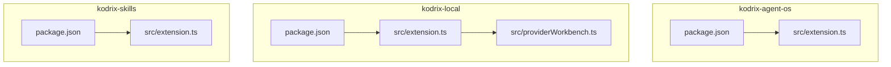
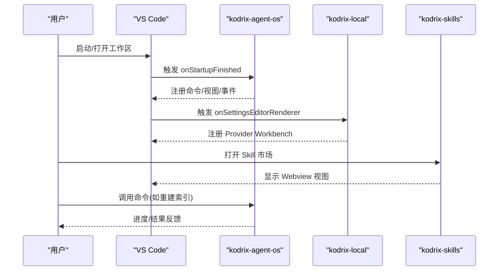
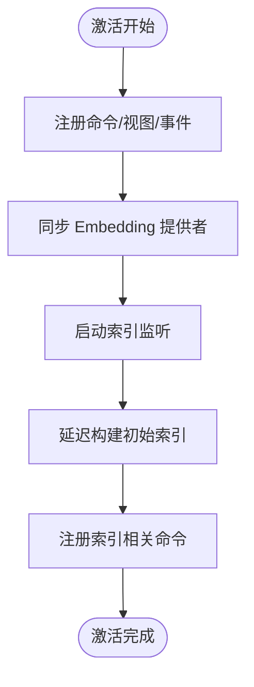
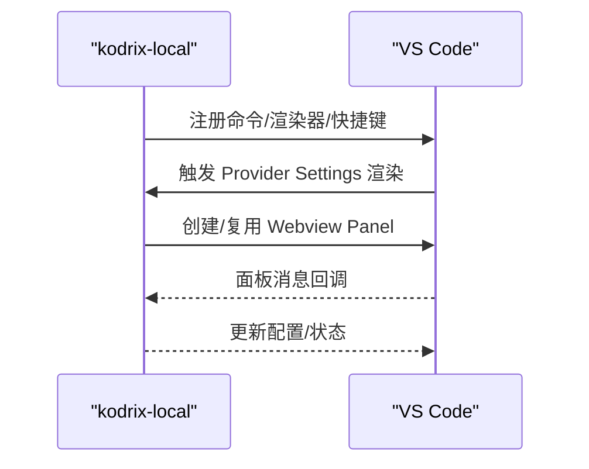
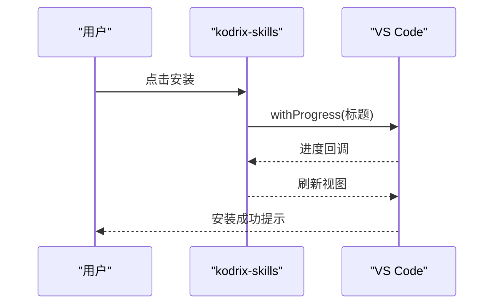
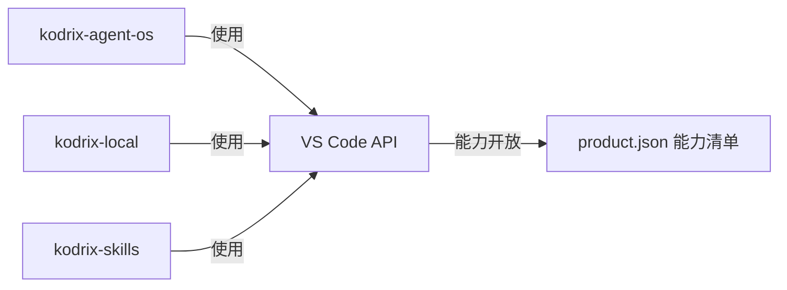

# 扩展开发

<cite>
**本文引用的文件**
- [extensions/kodrix-agent-os/package.json](file://extensions/kodrix-agent-os/package.json)
- [extensions/kodrix-agent-os/src/extension.ts](file://extensions/kodrix-agent-os/src/extension.ts)
- [extensions/kodrix-local/package.json](file://extensions/kodrix-local/package.json)
- [extensions/kodrix-local/src/extension.ts](file://extensions/kodrix-local/src/extension.ts)
- [extensions/kodrix-skills/package.json](file://extensions/kodrix-skills/package.json)
- [extensions/kodrix-skills/src/extension.ts](file://extensions/kodrix-skills/src/extension.ts)
- [extensions/kodrix-local/src/providerWorkbench.ts](file://extensions/kodrix-local/src/providerWorkbench.ts)
- [product.json](file://product.json)
</cite>

## 目录
1. [简介](#简介)
2. [项目结构](#项目结构)
3. [核心组件](#核心组件)
4. [架构总览](#架构总览)
5. [详细组件分析](#详细组件分析)
6. [依赖关系分析](#依赖关系分析)
7. [性能与体验优化](#性能与体验优化)
8. [调试、测试与发布](#调试测试与发布)
9. [故障排查](#故障排查)
10. [结论](#结论)
11. [附录：常用 API 与贡献点速查](#附录常用-api-与贡献点速查)

## 简介
本指南面向希望在 KodrixCode 中开发自定义扩展的工程师，聚焦 VS Code 扩展在 KodrixCode 中的定制方式与扩展点。文档基于仓库内 kodrix-* 系列扩展的实际实现，系统讲解扩展结构、API 使用、事件处理、UI 组件（Webview/View/Panel）开发模式，以及调试、测试与发布的最佳实践。通过代码级分析与图示，帮助开发者快速上手并构建高质量扩展。

## 项目结构
KodrixCode 将多个功能以独立扩展组织在 extensions 目录下，其中 kodrix-* 系列扩展承担 Agent OS、本地模型供应商管理、Skill 市场等职责。每个扩展遵循标准 VS Code 扩展约定：package.json 声明能力，src 下实现逻辑，out 为编译产物。

图表来源
- [extensions/kodrix-agent-os/package.json:1-80](file://extensions/kodrix-agent-os/package.json#L1-L80)
- [extensions/kodrix-agent-os/src/extension.ts:170-244](file://extensions/kodrix-agent-os/src/extension.ts#L170-L244)
- [extensions/kodrix-local/package.json:1-120](file://extensions/kodrix-local/package.json#L1-L120)
- [extensions/kodrix-local/src/extension.ts:85-110](file://extensions/kodrix-local/src/extension.ts#L85-L110)
- [extensions/kodrix-local/src/providerWorkbench.ts:328-346](file://extensions/kodrix-local/src/providerWorkbench.ts#L328-L346)
- [extensions/kodrix-skills/package.json:1-120](file://extensions/kodrix-skills/package.json#L1-L120)
- [extensions/kodrix-skills/src/extension.ts:62-84](file://extensions/kodrix-skills/src/extension.ts#L62-L84)

章节来源
- [extensions/kodrix-agent-os/package.json:1-80](file://extensions/kodrix-agent-os/package.json#L1-L80)
- [extensions/kodrix-local/package.json:1-120](file://extensions/kodrix-local/package.json#L1-L120)
- [extensions/kodrix-skills/package.json:1-120](file://extensions/kodrix-skills/package.json#L1-L120)

## 核心组件
- 激活入口与生命周期
  - 各扩展均提供 activate/deactivate，并在 activateInternal 中注册命令、视图、事件监听等轻量资源；耗时任务延迟或异步执行。
  - 错误边界包裹激活流程，确保失败时向用户可见提示。
- 配置与设置
  - 通过 contributes.configuration 暴露开关与参数；部分扩展使用 settingsEditorRenderers 提供自定义设置页。
- 命令与菜单
  - 通过 contributes.commands、contributes.menus、contributes.keybindings 统一暴露能力。
- UI 扩展点
  - Webview/View/Panel：用于复杂交互界面（如 Provider Workbench、Skill Marketplace）。
  - Chat Participants / Language Model Chat Providers：接入 AI 对话生态。
- 事件与状态
  - 监听工作区配置变更、索引状态变化等，驱动 UI 刷新与功能开关。

章节来源
- [extensions/kodrix-agent-os/src/extension.ts:170-244](file://extensions/kodrix-agent-os/src/extension.ts#L170-L244)
- [extensions/kodrix-local/src/extension.ts:85-110](file://extensions/kodrix-local/src/extension.ts#L85-L110)
- [extensions/kodrix-agent-os/package.json:22-85](file://extensions/kodrix-agent-os/package.json#L22-L85)
- [extensions/kodrix-local/package.json:21-45](file://extensions/kodrix-local/package.json#L21-L45)
- [extensions/kodrix-skills/package.json:32-50](file://extensions/kodrix-skills/package.json#L32-L50)

## 架构总览
KodrixCode 的扩展体系围绕“Agent OS + 模型供应商 + Skill 市场”三大模块协作：
- kodrix-agent-os：编排与集成各类 Agent 能力（路由、记忆、看板、检查点、终端 AI、索引等），并通过命令、视图、Chat Participant 暴露能力。
- kodrix-local：负责本地/云端模型供应商配置、迁移、预设应用、Provider Workbench 面板。
- kodrix-skills：提供 Skill 市场 Webview，支持安装/卸载/导入等。

图表来源
- [extensions/kodrix-agent-os/package.json:15-21](file://extensions/kodrix-agent-os/package.json#L15-L21)
- [extensions/kodrix-agent-os/src/extension.ts:170-244](file://extensions/kodrix-agent-os/src/extension.ts#L170-L244)
- [extensions/kodrix-local/package.json:15-26](file://extensions/kodrix-local/package.json#L15-L26)
- [extensions/kodrix-local/src/providerWorkbench.ts:328-346](file://extensions/kodrix-local/src/providerWorkbench.ts#L328-L346)
- [extensions/kodrix-skills/src/extension.ts:62-84](file://extensions/kodrix-skills/src/extension.ts#L62-L84)

## 详细组件分析

### kodrix-agent-os：Agent 操作系统
- 激活与注册
  - 在 activateInternal 中集中注册上下文智能、学习引擎、会话学习、Wiki、Spec、记忆、看板、路由、自然命令面板、Arena、Hooks、属性测试、Hub、工作区引导、状态栏、Agent Crew、规则、检查点、模型路由、用户画像、Tab 补全、后台 Agent、Crew 可视化、Agent Loop、子 Agent、线程、Apply 管理器、终端 AI、Vibe Coding、Idea Flow、Agent 状态桥接等。
  - 对语义检索 Embedding 提供者进行动态同步，响应配置变更。
- 索引与文档
  - 注册预测性补全、代码库聊天参与者、索引管理器、设置页、Code Lens 提供者，并在索引状态变化时刷新。
  - 后台启动索引构建与文件监听，支持手动重建索引与查看统计。
- 错误边界
  - 激活过程 try/catch 包裹，失败时展示用户可见的错误信息。

图表来源
- [extensions/kodrix-agent-os/src/extension.ts:170-244](file://extensions/kodrix-agent-os/src/extension.ts#L170-L244)
- [extensions/kodrix-agent-os/src/extension.ts:235-293](file://extensions/kodrix-agent-os/src/extension.ts#L235-L293)

章节来源
- [extensions/kodrix-agent-os/src/extension.ts:170-244](file://extensions/kodrix-agent-os/src/extension.ts#L170-L244)
- [extensions/kodrix-agent-os/src/extension.ts:235-293](file://extensions/kodrix-agent-os/src/extension.ts#L235-L293)

### kodrix-local：本地/云端模型供应商与配置
- 首次运行与迁移
  - 加载预设，注册 Onboarding、快捷键、特性命令、语言模型提供者、Provider Settings Renderer。
  - 应用默认值与首次导入，带重试上限的迁移逻辑，避免永久失败。
- Provider Workbench 面板
  - 创建并复用 Webview Panel，注入 HTML 与消息处理器，关闭时清理引用。
- 欢迎与引导
  - 根据全局状态决定是否展示引导向导，并提供快捷入口。

图表来源
- [extensions/kodrix-local/src/extension.ts:85-110](file://extensions/kodrix-local/src/extension.ts#L85-L110)
- [extensions/kodrix-local/src/providerWorkbench.ts:328-346](file://extensions/kodrix-local/src/providerWorkbench.ts#L328-L346)

章节来源
- [extensions/kodrix-local/src/extension.ts:85-110](file://extensions/kodrix-local/src/extension.ts#L85-L110)
- [extensions/kodrix-local/src/providerWorkbench.ts:328-346](file://extensions/kodrix-local/src/providerWorkbench.ts#L328-L346)

### kodrix-skills：Skill 市场
- 视图与命令
  - 注册 Webview View 提供 Skill 市场界面，提供刷新、安装、卸载、从 URL 安装、导入 Cursor Skills、搜索 GitHub 等命令。
- 安装流程
  - 使用 withProgress 展示进度，安装后刷新视图并提示结果。

图表来源
- [extensions/kodrix-skills/src/extension.ts:62-84](file://extensions/kodrix-skills/src/extension.ts#L62-L84)
- [extensions/kodrix-skills/src/extension.ts:86-107](file://extensions/kodrix-skills/src/extension.ts#L86-L107)

章节来源
- [extensions/kodrix-skills/src/extension.ts:62-84](file://extensions/kodrix-skills/src/extension.ts#L62-L84)
- [extensions/kodrix-skills/src/extension.ts:86-107](file://extensions/kodrix-skills/src/extension.ts#L86-L107)

## 依赖关系分析
- 扩展间解耦
  - 各扩展通过 package.json 的 activationEvents 与 contributes 暴露能力，彼此低耦合。
- 产品级能力开放
  - product.json 定义了允许使用的 API 提案列表，扩展需声明 enabledApiProposals 以启用特定能力。
- 典型依赖链
  - kodrix-agent-os 依赖 VS Code 的 commands、workspace、languages、window 等 API，注册大量子模块。
  - kodrix-local 依赖 providerWorkbench 提供 Webview Panel，并与语言模型提供者集成。
  - kodrix-skills 依赖 Webview View 与文件系统操作进行 Skill 管理。

图表来源
- [product.json:189-200](file://product.json#L189-L200)
- [extensions/kodrix-agent-os/src/extension.ts:170-244](file://extensions/kodrix-agent-os/src/extension.ts#L170-L244)
- [extensions/kodrix-local/src/extension.ts:85-110](file://extensions/kodrix-local/src/extension.ts#L85-L110)
- [extensions/kodrix-skills/src/extension.ts:62-84](file://extensions/kodrix-skills/src/extension.ts#L62-L84)

章节来源
- [product.json:189-200](file://product.json#L189-L200)

## 性能与体验优化
- 激活阶段轻量化
  - 仅注册命令与事件监听，耗时任务延迟或异步执行，避免阻塞启动。
- 进度反馈
  - 使用 withProgress 提供清晰的任务进度与状态。
- 配置变更响应
  - 监听配置变化，按需重新初始化能力（如 Embedding 提供者）。
- 资源释放
  - deactivate 中统一释放面板、计时器、监听器等资源，防止内存泄漏。

章节来源
- [extensions/kodrix-agent-os/src/extension.ts:170-244](file://extensions/kodrix-agent-os/src/extension.ts#L170-L244)
- [extensions/kodrix-agent-os/src/extension.ts:347-355](file://extensions/kodrix-agent-os/src/extension.ts#L347-L355)
- [extensions/kodrix-local/src/extension.ts:85-110](file://extensions/kodrix-local/src/extension.ts#L85-L110)

## 调试、测试与发布
- 调试
  - 使用 VS Code 内置调试器，针对扩展入口文件（如 extension.ts）添加断点，逐步验证激活流程、命令执行、Webview 消息处理。
  - 利用日志输出定位问题（注意在 deactivate 中释放日志资源）。
- 测试
  - 参考扩展内的脚本与配置（如 compile/test 命令），编写单元测试与集成测试，覆盖关键路径（命令、迁移、安装流程）。
- 发布
  - 完善 package.json 元数据（名称、版本、分类、激活事件、主入口、贡献点）。
  - 准备多语言资源文件（package.nls.*），确保国际化文案完整。
  - 使用 vsce 工具打包与发布到市场（如需）。

章节来源
- [extensions/kodrix-agent-os/package.json:1-80](file://extensions/kodrix-agent-os/package.json#L1-L80)
- [extensions/kodrix-local/package.json:269-280](file://extensions/kodrix-local/package.json#L269-L280)
- [extensions/kodrix-skills/package.json:123-133](file://extensions/kodrix-skills/package.json#L123-L133)

## 故障排查
- 激活失败
  - 检查 activateInternal 是否抛出异常，确认错误边界已捕获并向用户展示错误信息。
  - 核对 activationEvents 与 contributes 配置是否正确。
- 命令无响应
  - 确认命令已在 contributes.commands 中声明，且在 activateInternal 中正确注册。
- Webview 不显示
  - 检查 Webview View/Panel 的注册与 HTML 注入逻辑，确认消息处理器绑定与面板生命周期管理。
- 配置未生效
  - 确认配置项在 contributes.configuration 中定义，且监听配置变更的逻辑正确触发。

章节来源
- [extensions/kodrix-agent-os/src/extension.ts:170-180](file://extensions/kodrix-agent-os/src/extension.ts#L170-L180)
- [extensions/kodrix-agent-os/package.json:22-85](file://extensions/kodrix-agent-os/package.json#L22-L85)
- [extensions/kodrix-local/src/providerWorkbench.ts:328-346](file://extensions/kodrix-local/src/providerWorkbench.ts#L328-L346)

## 结论
KodrixCode 的扩展体系以 kodrix-agent-os、kodrix-local、kodrix-skills 为核心，提供了完整的 Agent 能力编排、模型供应商管理与 Skill 市场生态。通过标准化的 VS Code 扩展机制（activationEvents、contributes、commands、views、webviews），开发者可以高效地定制和扩展 IDE 行为。遵循轻量化激活、进度反馈、资源释放与错误边界等最佳实践，可显著提升扩展的稳定性和用户体验。

## 附录：常用 API 与贡献点速查
- 激活事件
  - onStartupFinished：适用于启动后初始化。
  - onSettingsEditorRenderer：用于自定义设置页渲染。
- 贡献点
  - commands：注册命令。
  - menus/keybindings：菜单与快捷键绑定。
  - views/viewsContainers：侧边栏视图与容器。
  - configuration：配置项定义。
  - chatParticipants/languageModelChatProviders：AI 对话集成。
  - settingsEditorRenderers：自定义设置编辑器渲染。
- 常用 API
  - vscode.commands.registerCommand
  - vscode.window.createWebviewPanel / registerWebviewViewProvider
  - vscode.workspace.onDidChangeConfiguration
  - vscode.window.withProgress
  - vscode.languages.registerCodeLensProvider

章节来源
- [extensions/kodrix-agent-os/package.json:15-85](file://extensions/kodrix-agent-os/package.json#L15-L85)
- [extensions/kodrix-local/package.json:15-45](file://extensions/kodrix-local/package.json#L15-L45)
- [extensions/kodrix-skills/package.json:32-50](file://extensions/kodrix-skills/package.json#L32-L50)
- [extensions/kodrix-agent-os/src/extension.ts:170-244](file://extensions/kodrix-agent-os/src/extension.ts#L170-L244)
- [extensions/kodrix-local/src/extension.ts:85-110](file://extensions/kodrix-local/src/extension.ts#L85-L110)
- [extensions/kodrix-skills/src/extension.ts:62-84](file://extensions/kodrix-skills/src/extension.ts#L62-L84)