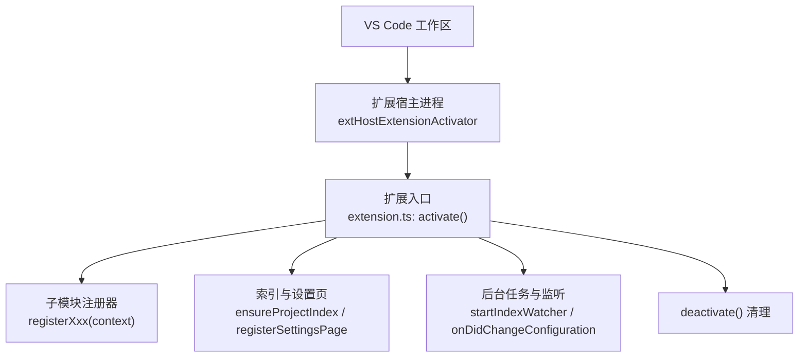
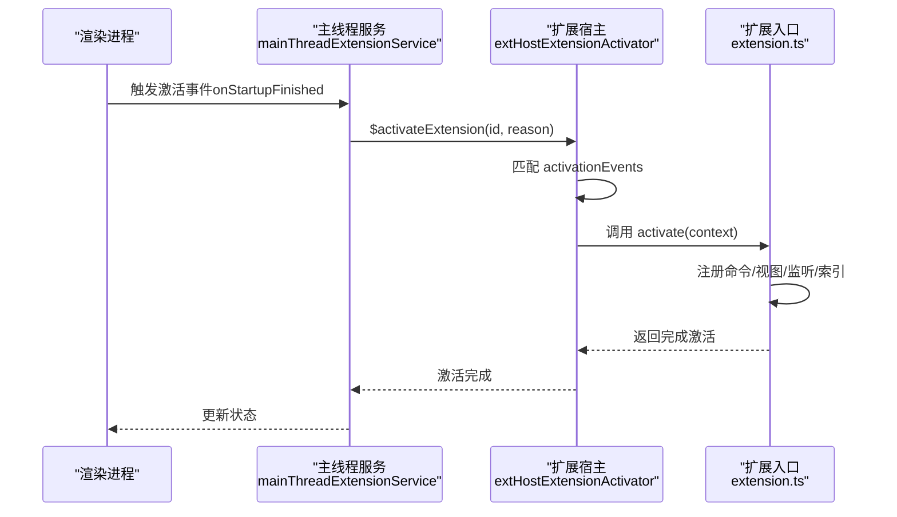
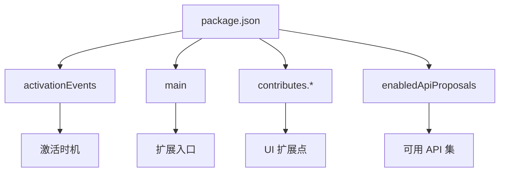
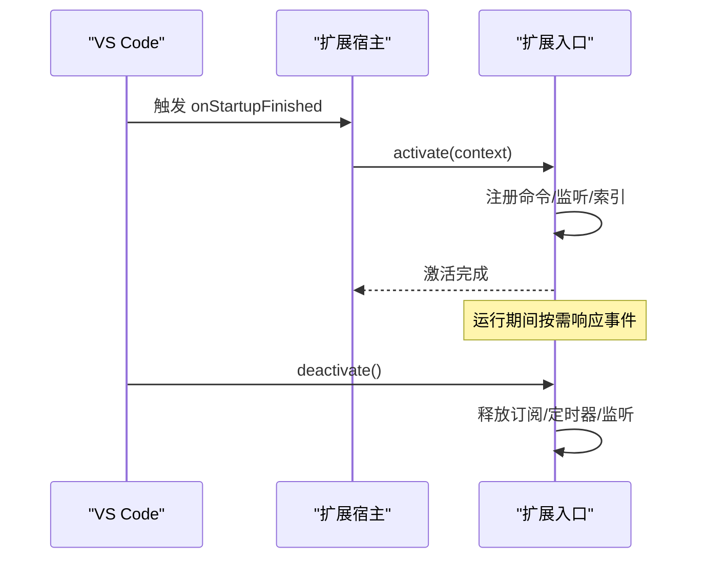
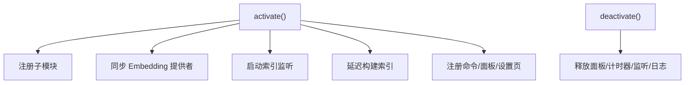
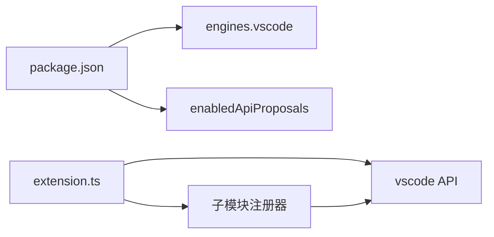

# 扩展架构与生命周期

<cite>
**本文引用的文件**
- [extensions/kodrix-agent-os/package.json](file://extensions/kodrix-agent-os/package.json)
- [extensions/kodrix-agent-os/src/extension.ts](file://extensions/kodrix-agent-os/src/extension.ts)
- [src/vs/workbench/api/common/extHostExtensionActivator.ts](file://src/vs/workbench/api/common/extHostExtensionActivator.ts)
- [src/vs/workbench/api/browser/mainThreadExtensionService.ts](file://src/vs/workbench/api/browser/mainThreadExtensionService.ts)
</cite>

## 目录
1. [简介](#简介)
2. [项目结构](#项目结构)
3. [核心组件](#核心组件)
4. [架构总览](#架构总览)
5. [详细组件分析](#详细组件分析)
6. [依赖关系分析](#依赖关系分析)
7. [性能考量](#性能考量)
8. [故障排查指南](#故障排查指南)
9. [结论](#结论)
10. [附录](#附录)

## 简介
本文件聚焦 Kodrix 基于 VS Code 的扩展架构与生命周期，围绕主进程、渲染进程、扩展宿主进程的通信机制，以及从 package.json 配置解析、激活事件触发、activate() 执行到 deactivate() 清理的完整流程进行系统化说明。文档同时涵盖扩展点（Extension Points）的概念与使用方式、依赖管理与 API 版本兼容性、初始化与资源管理最佳实践，并给出性能优化建议，帮助开发者构建高效稳定的扩展。

## 项目结构
Kodrix 的 Agent OS 扩展位于 extensions/kodrix-agent-os，其入口由 package.json 声明 main 字段指向编译后的 out/extension，并通过 activationEvents 指定激活时机。扩展在 activate() 中注册大量子模块能力（如上下文智能、学习引擎、看板、路由、Wiki、Spec、记忆、Crew、索引等），并在 deactivate() 中统一释放资源。VS Code 内核负责解析扩展清单、匹配激活事件、调度扩展宿主进程加载并调用 activate()。

图表来源
- [extensions/kodrix-agent-os/package.json:1-25](file://extensions/kodrix-agent-os/package.json#L1-L25)
- [extensions/kodrix-agent-os/src/extension.ts:158-321](file://extensions/kodrix-agent-os/src/extension.ts#L158-L321)
- [src/vs/workbench/api/common/extHostExtensionActivator.ts:222-236](file://src/vs/workbench/api/common/extHostExtensionActivator.ts#L222-L236)

章节来源
- [extensions/kodrix-agent-os/package.json:1-25](file://extensions/kodrix-agent-os/package.json#L1-L25)
- [extensions/kodrix-agent-os/src/extension.ts:158-321](file://extensions/kodrix-agent-os/src/extension.ts#L158-L321)

## 核心组件
- 扩展清单与扩展点：package.json 声明 engines.vscode、activationEvents、main、contributes（命令、视图、菜单、配置、本地化、Chat Participants、设置编辑器渲染器等）。
- 扩展入口：extension.ts 中的 activate() 负责一次性注册所有功能模块，并启动后台索引与监听；deactivate() 集中释放资源。
- 激活调度：extHostExtensionActivator 根据 activationEvents 匹配并批量激活扩展；mainThreadExtensionService 提供主线程侧的激活桥接。

章节来源
- [extensions/kodrix-agent-os/package.json:1-800](file://extensions/kodrix-agent-os/package.json#L1-L800)
- [extensions/kodrix-agent-os/src/extension.ts:158-321](file://extensions/kodrix-agent-os/src/extension.ts#L158-L321)
- [src/vs/workbench/api/common/extHostExtensionActivator.ts:222-236](file://src/vs/workbench/api/common/extHostExtensionActivator.ts#L222-L236)
- [src/vs/workbench/api/browser/mainThreadExtensionService.ts:67-70](file://src/vs/workbench/api/browser/mainThreadExtensionService.ts#L67-L70)

## 架构总览
Kodrix 扩展遵循 VS Code 的标准三进程模型：
- 渲染进程（UI）：通过主线程服务与扩展宿主进程交互，触发扩展激活与命令执行。
- 扩展宿主进程（Node.js）：加载扩展代码，执行 activate()，管理扩展生命周期与资源。
- 主进程（Electron/Node）：协调 UI 与宿主进程，转发激活请求与消息。

图表来源
- [src/vs/workbench/api/browser/mainThreadExtensionService.ts:67-70](file://src/vs/workbench/api/browser/mainThreadExtensionService.ts#L67-L70)
- [src/vs/workbench/api/common/extHostExtensionActivator.ts:222-236](file://src/vs/workbench/api/common/extHostExtensionActivator.ts#L222-L236)
- [extensions/kodrix-agent-os/src/extension.ts:158-321](file://extensions/kodrix-agent-os/src/extension.ts#L158-L321)

## 详细组件分析

### 扩展清单与扩展点（Extension Points）
- 引擎与入口：
  - engines.vscode 指定兼容的 VS Code API 版本范围。
  - main 指向编译后的扩展入口文件。
- 激活事件：
  - activationEvents 声明 onStartupFinished，确保工作区启动后激活。
- 贡献项（contributes）：
  - settingsEditorRenderers：自定义设置页渲染器。
  - chatParticipants：定义 @codebase 等 Chat 参与者及命令。
  - views、commands、keybindings、menus、configuration、localizations 等。
- 启用提案 API：
  - enabledApiProposals 声明使用的实验性 API（如 chatContextProvider、settingsEditorRenderer）。

图表来源
- [extensions/kodrix-agent-os/package.json:1-800](file://extensions/kodrix-agent-os/package.json#L1-L800)

章节来源
- [extensions/kodrix-agent-os/package.json:1-800](file://extensions/kodrix-agent-os/package.json#L1-L800)

### 生命周期：从激活到清理
- 激活阶段：
  - VS Code 在工作区启动完成后触发 onStartupFinished。
  - 扩展宿主进程匹配该事件并批量激活扩展。
  - 扩展入口 execute activate(context)，立即注册轻量级命令与监听，随后启动耗时任务（如索引构建）。
- 运行阶段：
  - 通过 context.subscriptions 管理所有可释放资源（定时器、监听器、面板等）。
  - 配置变更时动态调整行为（如语义 Embedding 提供者切换）。
- 清理阶段：
  - deactivate() 统一释放面板、定时器、索引监听器与日志等资源。

图表来源
- [extensions/kodrix-agent-os/src/extension.ts:158-321](file://extensions/kodrix-agent-os/src/extension.ts#L158-L321)
- [src/vs/workbench/api/common/extHostExtensionActivator.ts:222-236](file://src/vs/workbench/api/common/extHostExtensionActivator.ts#L222-L236)

章节来源
- [extensions/kodrix-agent-os/src/extension.ts:158-321](file://extensions/kodrix-agent-os/src/extension.ts#L158-L321)
- [src/vs/workbench/api/common/extHostExtensionActivator.ts:222-236](file://src/vs/workbench/api/common/extHostExtensionActivator.ts#L222-L236)

### 初始化过程与资源管理模式
- 立即注册轻量能力：
  - 上下文智能、主动上下文、学习引擎、会话学习、Wiki、Spec、记忆、看板、路由、Arena、Hooks、Crew、规则、检查点、模型路由、用户画像、Tab 补全、后台 Agent、Crew 可视化、Agent 循环、子代理、线程、应用管理器、终端 AI、Vibe Coding、Idea Flow、Agent 状态桥接等。
- 配置驱动的语义检索：
  - 监听 kodrix.semanticEmbedding 配置变化，动态注册或清除 Embedding 提供者。
- 索引与设置页：
  - 延迟启动全工程语义索引构建，支持手动重建与统计查看。
  - 注册“索引与文档”管理面板与自定义设置页。
- 资源释放：
  - deactivate() 释放面板追踪、引导计时器、Agent 状态计时器、IdeaFlow 发射器、索引监听器与日志。

图表来源
- [extensions/kodrix-agent-os/src/extension.ts:158-321](file://extensions/kodrix-agent-os/src/extension.ts#L158-L321)

章节来源
- [extensions/kodrix-agent-os/src/extension.ts:158-321](file://extensions/kodrix-agent-os/src/extension.ts#L158-L321)

### 错误处理模式
- 激活失败兜底：
  - activate() 包裹 try/catch，捕获异常并记录日志，向用户展示错误信息，避免静默失败。
- 索引构建错误：
  - 异步构建索引失败时记录错误日志，并提供用户可见的错误提示。
- 资源释放：
  - deactivate() 确保所有可释放资源被正确清理，防止内存泄漏。

章节来源
- [extensions/kodrix-agent-os/src/extension.ts:158-168](file://extensions/kodrix-agent-os/src/extension.ts#L158-L168)
- [extensions/kodrix-agent-os/src/extension.ts:224-259](file://extensions/kodrix-agent-os/src/extension.ts#L224-L259)
- [extensions/kodrix-agent-os/src/extension.ts:313-321](file://extensions/kodrix-agent-os/src/extension.ts#L313-L321)

## 依赖关系分析
- 外部依赖：
  - engines.vscode 约束 VS Code API 版本兼容性。
  - enabledApiProposals 声明使用实验性 API（chatContextProvider、settingsEditorRenderer）。
- 内部依赖：
  - extension.ts 作为聚合入口，依赖多个子模块注册器（context、learning、wiki、spec、memory、kanban、router、arena、hooks、crew、rules、checkpoint、model、profile、completion、background、visualizer、agentLoop、subagent、threads、apply、terminalAI、vibeCoding、ideaFlow、agentStateBridge、index、semanticIndex、embeddingProvider、indexManager、settingsPage、constants、logger、panelTracker）。
- 运行时依赖：
  - VS Code 提供的 vscode 命名空间 API（workspace、window、commands、lifecycle 等）。

图表来源
- [extensions/kodrix-agent-os/package.json:1-25](file://extensions/kodrix-agent-os/package.json#L1-L25)
- [extensions/kodrix-agent-os/src/extension.ts:1-58](file://extensions/kodrix-agent-os/src/extension.ts#L1-L58)

章节来源
- [extensions/kodrix-agent-os/package.json:1-25](file://extensions/kodrix-agent-os/package.json#L1-L25)
- [extensions/kodrix-agent-os/src/extension.ts:1-58](file://extensions/kodrix-agent-os/src/extension.ts#L1-L58)

## 性能考量
- 延迟启动重任务：
  - 索引构建采用延迟策略（INITIAL_INDEX_DELAY_MS），避免阻塞首次激活。
- 条件执行：
  - 根据配置开关决定是否自动索引新文件夹，减少不必要开销。
- 增量与监听：
  - 使用 startIndexWatcher 监听文件变化，配合 ensureProjectIndex 实现增量更新。
- 资源释放：
  - deactivate() 集中释放定时器、监听器与面板，避免内存泄漏。
- 配置热更新：
  - 监听配置变化（如 semanticEmbedding），动态切换提供者，避免重启扩展。

章节来源
- [extensions/kodrix-agent-os/src/extension.ts:224-259](file://extensions/kodrix-agent-os/src/extension.ts#L224-L259)
- [extensions/kodrix-agent-os/src/extension.ts:184-191](file://extensions/kodrix-agent-os/src/extension.ts#L184-L191)
- [extensions/kodrix-agent-os/src/extension.ts:313-321](file://extensions/kodrix-agent-os/src/extension.ts#L313-L321)

## 故障排查指南
- 激活失败：
  - 检查 activationEvents 是否匹配当前场景（如 onStartupFinished）。
  - 查看 activate() 中的 try/catch 日志与用户提示，定位具体异常。
- 索引构建失败：
  - 确认工作区已打开且具备读取权限。
  - 检查配置开关（autoIndexNewFolders）与日志输出，必要时手动触发重建命令。
- 资源泄漏：
  - 确保所有订阅均加入 context.subscriptions。
  - 在 deactivate() 中释放面板、定时器与监听器。

章节来源
- [extensions/kodrix-agent-os/src/extension.ts:158-168](file://extensions/kodrix-agent-os/src/extension.ts#L158-L168)
- [extensions/kodrix-agent-os/src/extension.ts:224-259](file://extensions/kodrix-agent-os/src/extension.ts#L224-L259)
- [extensions/kodrix-agent-os/src/extension.ts:313-321](file://extensions/kodrix-agent-os/src/extension.ts#L313-L321)

## 结论
Kodrix 扩展严格遵循 VS Code 的三进程架构与扩展生命周期规范，通过清晰的 package.json 声明、统一的 activate()/deactivate() 管理、以及完善的错误处理与资源释放策略，实现了高内聚、低耦合的功能模块化。结合延迟启动、条件执行与配置热更新等优化手段，确保了扩展在大规模工作区下的稳定与高效表现。

## 附录
- 扩展点使用建议：
  - 将 UI 相关贡献（命令、视图、菜单、配置）集中在 package.json 中声明，保持逻辑清晰。
  - 使用 enabledApiProposals 谨慎引入实验性 API，并做好降级兼容。
- 依赖管理建议：
  - 明确 engines.vscode 版本范围，避免与上游 VS Code 不兼容。
  - 尽量使用 VS Code 官方 API，减少第三方依赖带来的维护成本。
- 最佳实践：
  - 在 activate() 中仅做轻量注册，重任务延迟执行。
  - 使用 context.subscriptions 统一管理资源，确保 deactivate() 能彻底释放。
  - 对关键路径添加错误边界与用户提示，提升可观测性与用户体验。