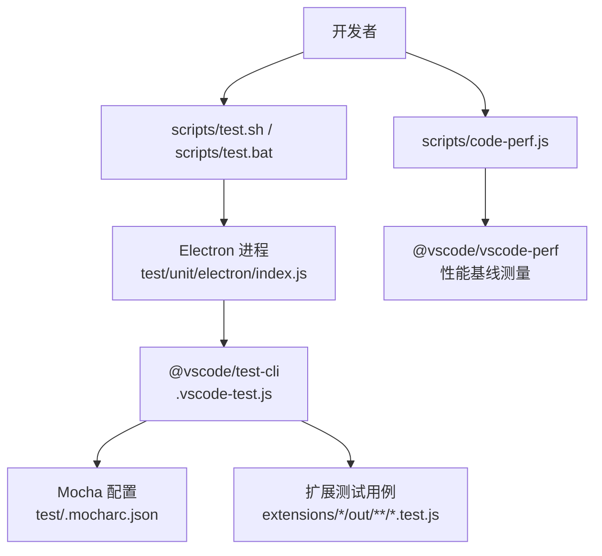
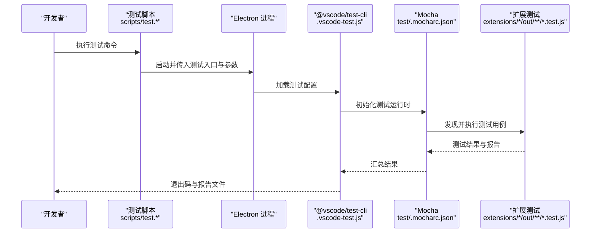
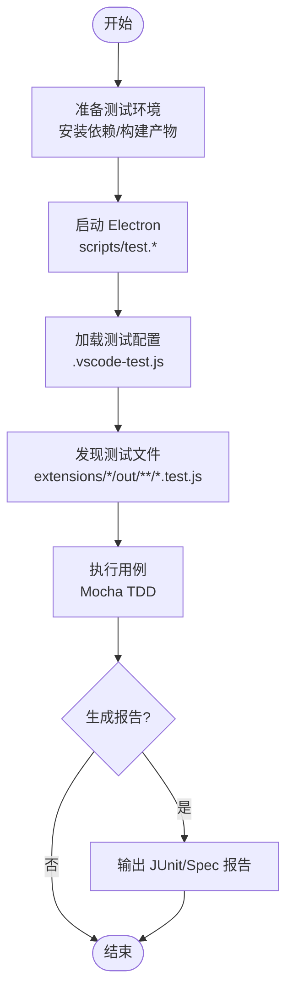
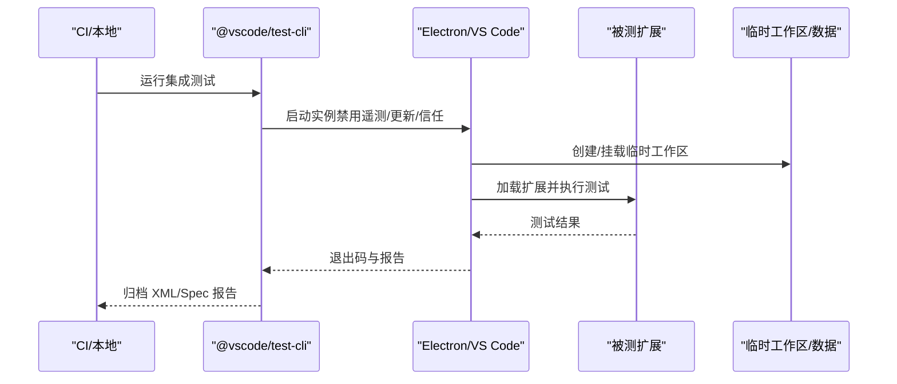
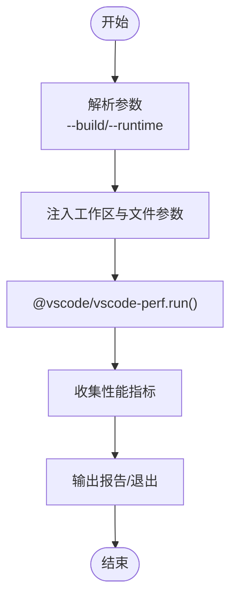
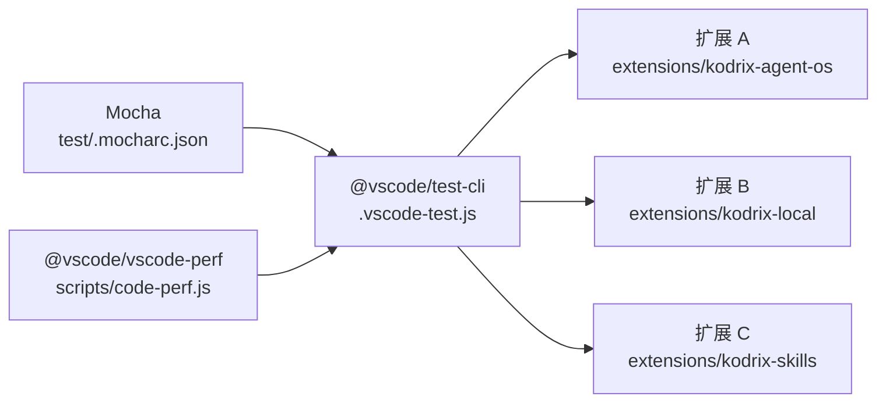

# 调试与测试

<cite>
**本文引用的文件**
- [scripts/test.sh](file://scripts/test.sh)
- [scripts/test.bat](file://scripts/test.bat)
- [.vscode-test.js](file://.vscode-test.js)
- [test/.mocharc.json](file://test/.mocharc.json)
- [test/package.json](file://test/package.json)
- [scripts/code-perf.js](file://scripts/code-perf.js)
- [cli/src/log.rs](file://cli/src/log.rs)
- [src/main.ts](file://src/main.ts)
- [src/bootstrap-node.ts](file://src/bootstrap-node.ts)
- [extensions/kodrix-agent-os/package.json](file://extensions/kodrix-agent-os/package.json)
- [extensions/kodrix-local/package.json](file://extensions/kodrix-local/package.json)
- [extensions/kodrix-skills/package.json](file://extensions/kodrix-skills/package.json)
</cite>

## 目录
1. [简介](#简介)
2. [项目结构](#项目结构)
3. [核心组件](#核心组件)
4. [架构总览](#架构总览)
5. [详细组件分析](#详细组件分析)
6. [依赖关系分析](#依赖关系分析)
7. [性能注意事项](#性能注意事项)
8. [故障排查指南](#故障排查指南)
9. [结论](#结论)
10. [附录](#附录)

## 简介
本指南面向在 Kodrix（VS Code 分支）中开发扩展的工程师，提供一套完整的调试与测试实践：从断点设置、变量检查、调用栈分析到日志系统使用；从单元测试组织与模拟对象，到集成测试环境搭建与自动化执行；并覆盖性能测试方法（内存泄漏检测、瓶颈定位与优化建议）以及常见问题诊断。内容基于仓库现有脚本与配置，确保可落地、可复现。

## 项目结构
Kodrix 的调试与测试基础设施主要分布在以下位置：
- 根级测试运行器与配置：用于驱动 Electron/桌面端测试、集成测试套件与报告输出
- 脚本入口：统一封装平台差异，启动测试或性能基准
- CLI 日志子系统：集中管理日志级别、输出目标与结构化字段
- 扩展工程：各扩展通过 package.json 声明引擎版本与测试入口，便于独立开发与验证

图表来源
- [scripts/test.sh:1-44](file://scripts/test.sh#L1-L44)
- [scripts/test.bat:1-35](file://scripts/test.bat#L1-L35)
- [.vscode-test.js:1-149](file://.vscode-test.js#L1-L149)
- [test/.mocharc.json:1-6](file://test/.mocharc.json#L1-L6)
- [scripts/code-perf.js:1-98](file://scripts/code-perf.js#L1-L98)

章节来源
- [scripts/test.sh:1-44](file://scripts/test.sh#L1-L44)
- [scripts/test.bat:1-35](file://scripts/test.bat#L1-L35)
- [.vscode-test.js:1-149](file://.vscode-test.js#L1-L149)
- [test/.mocharc.json:1-6](file://test/.mocharc.json#L1-L6)
- [scripts/code-perf.js:1-98](file://scripts/code-perf.js#L1-L98)

## 核心组件
- 测试执行入口
  - 跨平台脚本统一处理 Electron 路径、崩溃报告目录与日志开关，并启动 unit 测试入口
  - Windows 与 macOS/Linux 分别适配产物命名与路径解析
- 集成测试编排
  - 通过 @vscode/test-cli 定义多套测试配置，支持指定工作区、超时、文件匹配与报告输出
  - 默认禁用遥测、更新与工作区信任等干扰项，保证测试稳定性
- 性能测试工具
  - 基于 @vscode/vscode-perf 的脚本，自动注入工作区与文件参数，驱动性能基准运行
- 日志子系统
  - CLI 层提供集中式日志能力，便于在远程/隧道/CLI 场景下统一记录关键事件

章节来源
- [scripts/test.sh:1-44](file://scripts/test.sh#L1-L44)
- [scripts/test.bat:1-35](file://scripts/test.bat#L1-L35)
- [.vscode-test.js:1-149](file://.vscode-test.js#L1-L149)
- [scripts/code-perf.js:1-98](file://scripts/code-perf.js#L1-L98)
- [cli/src/log.rs](file://cli/src/log.rs)

## 架构总览
下图展示“开发者 → 测试脚本 → Electron → 测试框架 → 扩展测试”的端到端流程，以及性能测试的并行路径。

图表来源
- [scripts/test.sh:1-44](file://scripts/test.sh#L1-L44)
- [scripts/test.bat:1-35](file://scripts/test.bat#L1-L35)
- [.vscode-test.js:1-149](file://.vscode-test.js#L1-L149)
- [test/.mocharc.json:1-6](file://test/.mocharc.json#L1-L6)

## 详细组件分析

### 单元测试：编写与执行
- 选择与配置
  - 测试框架：Mocha（TDD UI），全局超时与报告由 test/.mocharc.json 控制
  - 运行器：@vscode/test-cli 负责在桌面端拉起 VS Code/Electron 实例并加载扩展
- 组织方式
  - 每个扩展将测试输出至 out 目录，按 *.test.js 模式被自动发现
  - 可通过 .vscode-test.js 中的 extensions 列表为特定扩展定制工作区、超时与文件匹配
- 模拟与隔离
  - 使用 in-memory secret storage、禁用遥测与更新，避免外部依赖影响
  - 对网络与文件系统操作建议使用 mock/spy 以增强可重复性
- 执行入口
  - 使用 scripts/test.sh 或 scripts/test.bat 统一触发单元与集成测试

图表来源
- [scripts/test.sh:1-44](file://scripts/test.sh#L1-L44)
- [scripts/test.bat:1-35](file://scripts/test.bat#L1-L35)
- [.vscode-test.js:1-149](file://.vscode-test.js#L1-L149)
- [test/.mocharc.json:1-6](file://test/.mocharc.json#L1-L6)

章节来源
- [test/.mocharc.json:1-6](file://test/.mocharc.json#L1-L6)
- [.vscode-test.js:1-149](file://.vscode-test.js#L1-L149)
- [scripts/test.sh:1-44](file://scripts/test.sh#L1-L44)
- [scripts/test.bat:1-35](file://scripts/test.bat#L1-L35)

### 集成测试：环境与数据
- 环境搭建
  - 通过 .vscode-test.js 的 defaultLaunchArgs 禁用遥测、更新、工作区信任等，确保稳定
  - 使用 useInstallation 指向本地 code 脚本，避免 CI 下载额外二进制
- 测试数据准备
  - 为需要工作区的测试创建临时目录（如 ipynb、notebook-renderers 等），避免污染真实工程
- 自动化执行
  - 在 CI 环境下启用 mocha-multi-reporters 与 JUnit 报告，便于归档与分析
  - 通过环境变量区分 Browser/Remote/Desktop 测试套件名称

图表来源
- [.vscode-test.js:1-149](file://.vscode-test.js#L1-L149)

章节来源
- [.vscode-test.js:1-149](file://.vscode-test.js#L1-L149)

### 性能测试：方法与流程
- 工具与入口
  - 使用 scripts/code-perf.js 作为统一入口，内部调用 @vscode/vscode-perf
  - 自动注入 --folder 与 --file 参数，指向仓库根与 package.json，便于基准运行
- 执行方式
  - 可指定 --build/--runtime 选择桌面或 Web 构建产物
  - 支持 insider/stable/exploration 等内置构建名或自定义路径
- 指标与解读
  - 关注启动时间、渲染帧率、内存占用与 GC 频率等关键指标
  - 对比不同构建或代码变更前后数据，识别回归

图表来源
- [scripts/code-perf.js:1-98](file://scripts/code-perf.js#L1-L98)

章节来源
- [scripts/code-perf.js:1-98](file://scripts/code-perf.js#L1-L98)

### 调试技巧：断点、变量与调用栈
- 启动调试
  - 使用 scripts/test.sh 或 scripts/test.bat 启动测试，配合 ELECTRON_ENABLE_LOGGING=1 获取更详细的 Electron 日志
  - 在 VS Code 中附加到已运行的 Electron 进程或使用内置调试配置进行断点调试
- 断点设置
  - 在扩展源码（extensions/*/src）与编译产物（extensions/*/out）处设置断点
  - 针对异步流程，优先在 Promise 链路与回调入口处设置断点
- 变量检查
  - 利用作用域变量、监视表达式与条件断点缩小问题范围
  - 对大型对象使用 JSON.stringify 或视图展开查看关键属性
- 调用栈分析
  - 结合堆栈回溯定位异常传播路径，注意区分主进程/渲染进程/扩展宿主线程
  - 对于跨进程通信（命令、IPC），在两端同时打点，确认消息是否到达与序列化是否正确

[本节为通用调试方法论说明，不直接分析具体文件]

### 日志系统：级别、结构与文件管理
- 日志级别
  - 通常包含 trace/debug/info/warn/error 等层级，便于在生产与调试间切换
- 结构化日志
  - 推荐以 JSON 形式输出，包含时间戳、模块名、请求 ID、用户上下文等字段，便于检索与聚合
- 文件管理
  - 将日志输出至固定目录（如 .build/logs），并按日期或模块分文件存储
  - 在测试环境中启用日志以便复现问题，生产环境建议仅保留 warn/error
- CLI 集成
  - CLI 层提供集中式日志能力，可在远程/隧道/命令执行场景中统一记录关键事件

章节来源
- [cli/src/log.rs](file://cli/src/log.rs)

## 依赖关系分析
- 测试框架依赖
  - Mocha 作为测试运行器，.mocharc.json 定义 UI 与超时
  - @vscode/test-cli 负责在桌面端启动 VS Code/Electron 并加载扩展
- 扩展依赖
  - 各扩展通过 package.json 声明 engines.vscode 版本要求，确保与宿主兼容
  - 扩展之间通过命令机制交互，无强耦合的 extensionDependencies
- 性能工具依赖
  - @vscode/vscode-perf 提供统一的性能采集与报告能力

图表来源
- [test/.mocharc.json:1-6](file://test/.mocharc.json#L1-L6)
- [.vscode-test.js:1-149](file://.vscode-test.js#L1-L149)
- [scripts/code-perf.js:1-98](file://scripts/code-perf.js#L1-L98)
- [extensions/kodrix-agent-os/package.json](file://extensions/kodrix-agent-os/package.json)
- [extensions/kodrix-local/package.json](file://extensions/kodrix-local/package.json)
- [extensions/kodrix-skills/package.json](file://extensions/kodrix-skills/package.json)

章节来源
- [test/.mocharc.json:1-6](file://test/.mocharc.json#L1-L6)
- [.vscode-test.js:1-149](file://.vscode-test.js#L1-L149)
- [scripts/code-perf.js:1-98](file://scripts/code-perf.js#L1-L98)
- [extensions/kodrix-agent-os/package.json](file://extensions/kodrix-agent-os/package.json)
- [extensions/kodrix-local/package.json](file://extensions/kodrix-local/package.json)
- [extensions/kodrix-skills/package.json](file://extensions/kodrix-skills/package.json)

## 性能注意事项
- 启动与渲染
  - 减少首屏资源体积，延迟加载非关键 Webview 与面板
  - 避免在主线程执行耗时任务，必要时使用后台线程或 Worker
- 内存管理
  - 及时释放监听器、定时器与订阅，防止内存泄漏
  - 使用性能工具观察堆快照与分配热点，定位大对象与循环引用
- I/O 与网络
  - 合并小文件读写，使用流式处理大文件
  - 对网络请求增加重试与超时，缓存热点数据
- 测试与基准
  - 在相同硬件与环境运行多次取中位数，排除噪声
  - 对比变更前后的关键指标，建立回归阈值

[本节为通用性能指导，不直接分析具体文件]

## 故障排查指南
- 测试无法启动
  - 检查 scripts/test.* 是否能正确解析 Electron 路径与产物
  - 确认 node_modules 已安装且构建产物存在
- 测试用例失败
  - 查看 Mocha 报告与 JUnit XML，定位失败用例与错误堆栈
  - 在 .vscode-test.js 中调整超时或文件匹配规则，缩小范围
- 性能退化
  - 使用 scripts/code-perf.js 运行基准，对比历史数据
  - 结合浏览器/DevTools 与内存快照，定位瓶颈
- 日志缺失或过多
  - 调整日志级别，仅在调试时开启 trace/debug
  - 将日志输出至固定目录，便于归档与检索

章节来源
- [scripts/test.sh:1-44](file://scripts/test.sh#L1-L44)
- [scripts/test.bat:1-35](file://scripts/test.bat#L1-L35)
- [.vscode-test.js:1-149](file://.vscode-test.js#L1-L149)
- [scripts/code-perf.js:1-98](file://scripts/code-perf.js#L1-L98)

## 结论
通过统一的测试脚本、清晰的测试编排与集中的日志能力，Kodrix 提供了可扩展的调试与测试基础设施。建议在开发扩展时遵循本文的实践：以 Mocha + @vscode/test-cli 为核心，结合性能基准与结构化日志，持续验证功能正确性与性能稳定性。遇到问题时，优先从测试报告与日志入手，逐步缩小范围，快速定位并修复。

## 附录
- 常用命令
  - 运行单元测试：scripts/test.sh 或 scripts/test.bat
  - 运行性能基准：scripts/code-perf.js
  - 自定义集成测试：编辑 .vscode-test.js 中的 extensions 列表
- 配置文件
  - Mocha 配置：test/.mocharc.json
  - 测试运行器：.vscode-test.js
  - 扩展引擎版本：extensions/*/package.json

[本节为补充信息，不直接分析具体文件]