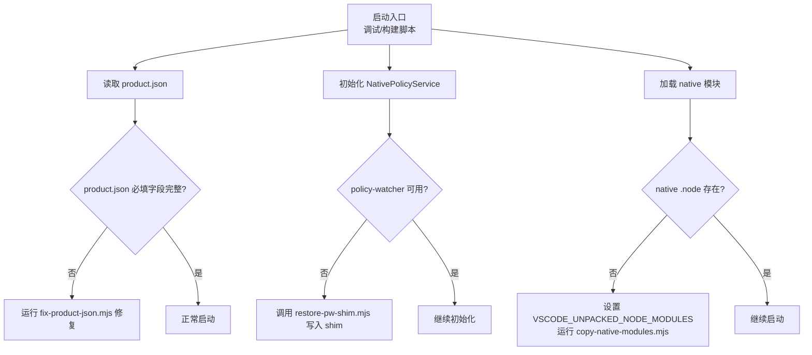
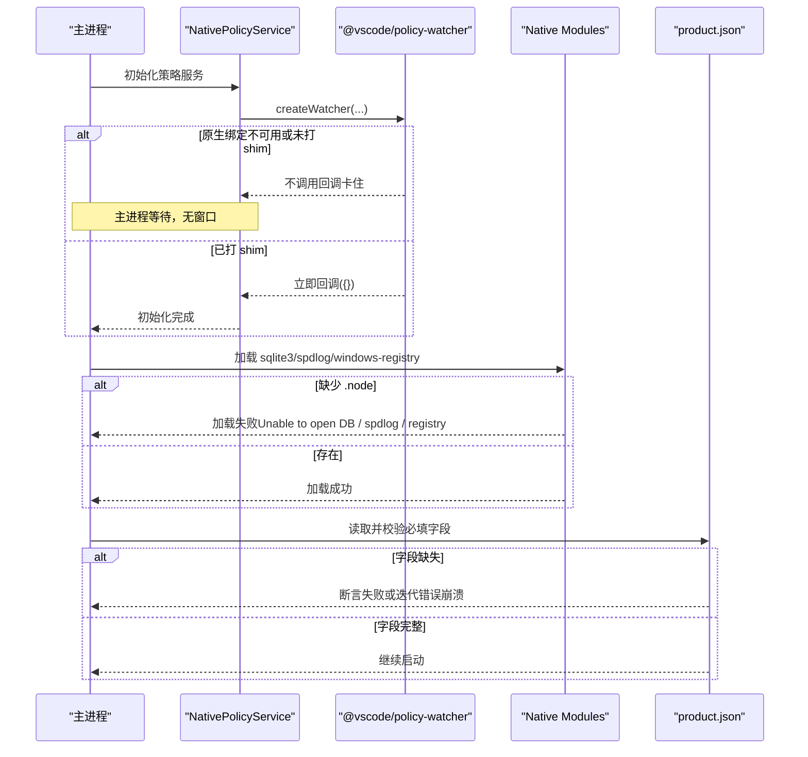
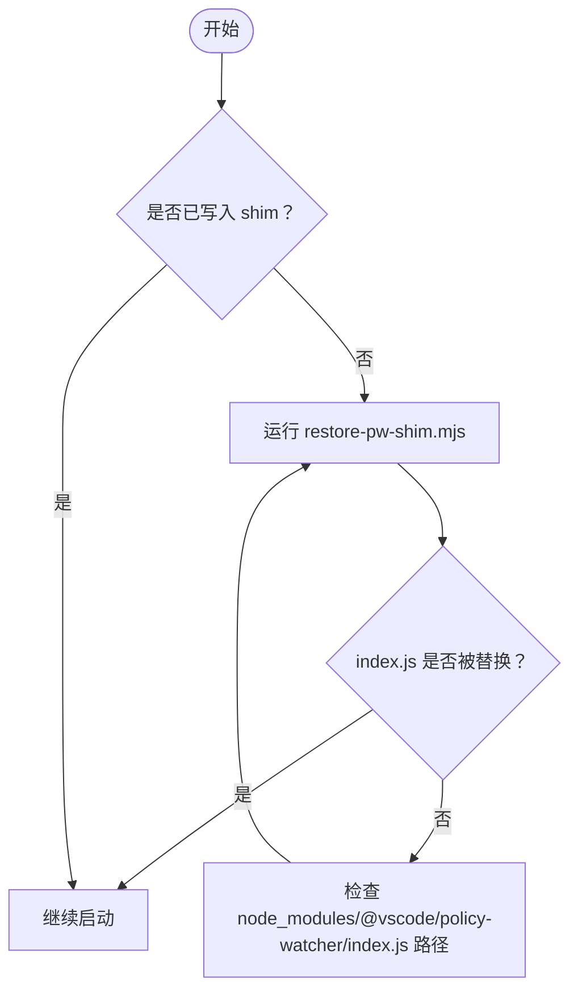
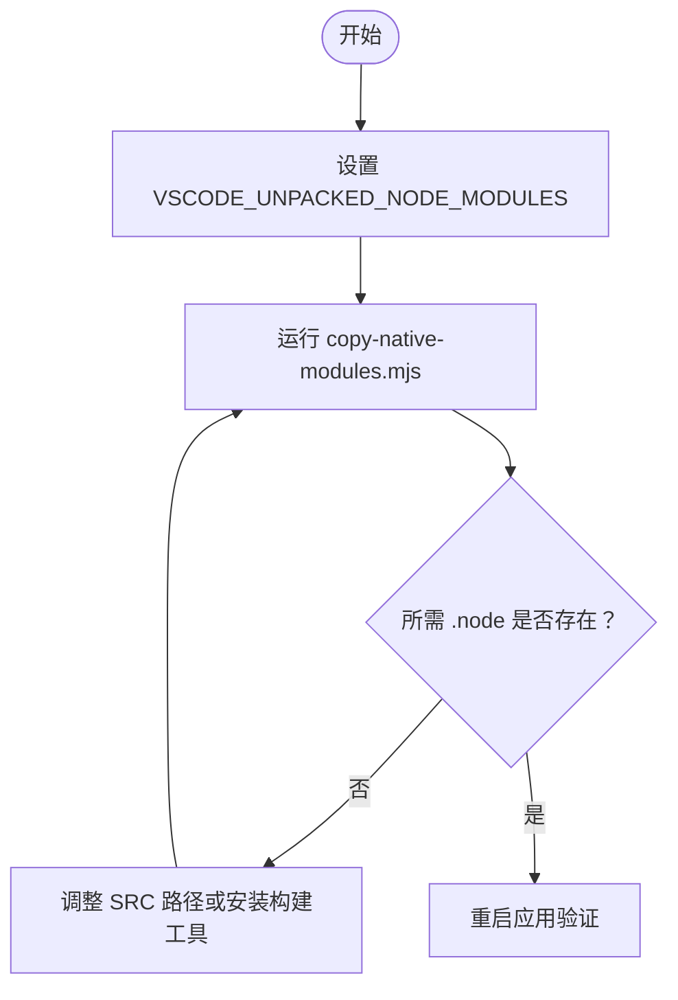
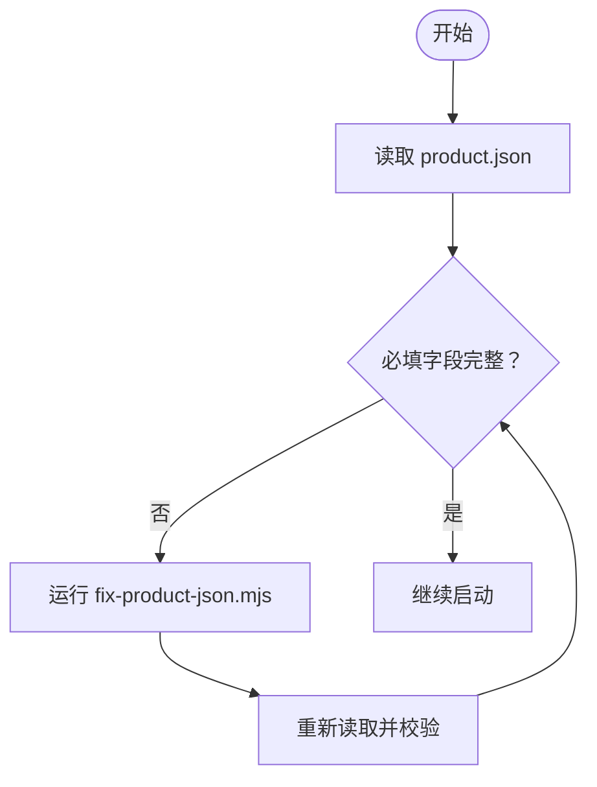
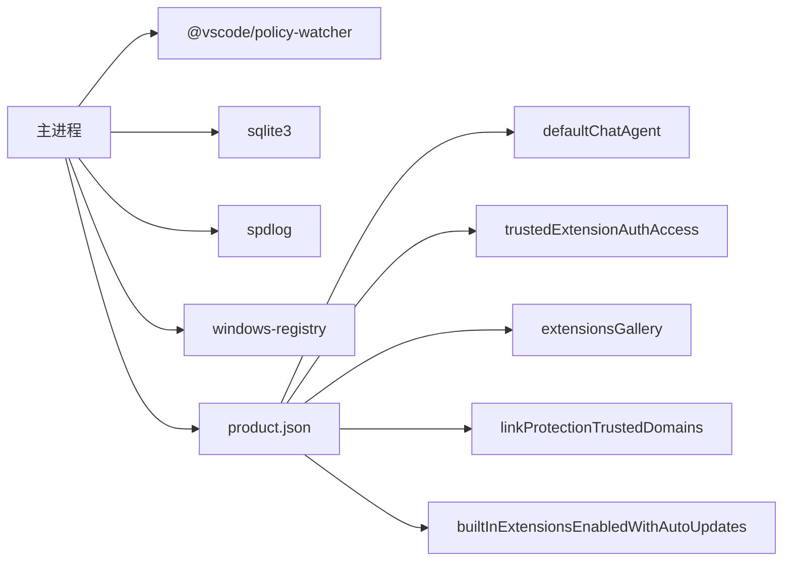

# 启动问题

<cite>
**本文引用的文件**
- [REPAIR-NOTES.md](file://REPAIR-NOTES.md)
- [restore-pw-shim.mjs](file://scripts/restore-pw-shim.mjs)
- [copy-native-modules.mjs](file://scripts/copy-native-modules.mjs)
- [fix-product-json.mjs](file://scripts/fix-product-json.mjs)
- [product.json](file://product.json)
</cite>

## 目录
1. [简介](#简介)
2. [项目结构](#项目结构)
3. [核心组件](#核心组件)
4. [架构总览](#架构总览)
5. [详细组件分析](#详细组件分析)
6. [依赖关系分析](#依赖关系分析)
7. [性能注意事项](#性能注意事项)
8. [故障排除指南](#故障排除指南)
9. [结论](#结论)
10. [附录](#附录)

## 简介
本文件面向 Kodrix 在本地开发或打包后首次启动时遇到的“启动失败”问题，提供系统化的排查与修复流程。重点覆盖：
- 主进程卡死、无窗口显示、MainWindowHandle=0
- @vscode/policy-watcher Dev Shim 导致的主进程等待
- Native 模块缺失导致的 Unable to open DB、spdlog 日志异常、registry 加载失败
- product.json 必填字段缺失导致的主进程或渲染进程崩溃
- VSCODE_UNPACKED_NODE_MODULES 环境变量配置与脚本执行步骤
- 完整的启动前检查、修复与验证流程

## 项目结构
与启动问题直接相关的脚本与配置文件集中在仓库根目录的 scripts 与根级 product.json：
- scripts/restore-pw-shim.mjs：写入 policy-watcher 的 Dev Shim，避免主进程永久等待
- scripts/copy-native-modules.mjs：从本机 VS Code 的 unpacked node_modules 复制 .node 原生模块到当前工程
- scripts/fix-product-json.mjs：幂等补齐 product.json 中可能导致崩溃的必填字段
- product.json：应用产品元数据，包含默认聊天代理、扩展市场、自动更新白名单等关键配置

图表来源
- [restore-pw-shim.mjs:1-31](file://scripts/restore-pw-shim.mjs#L1-L31)
- [copy-native-modules.mjs:1-43](file://scripts/copy-native-modules.mjs#L1-L43)
- [fix-product-json.mjs:1-144](file://scripts/fix-product-json.mjs#L1-L144)
- [product.json:1-806](file://product.json#L1-L806)

章节来源
- [REPAIR-NOTES.md:1-109](file://REPAIR-NOTES.md#L1-L109)

## 核心组件
- policy-watcher Dev Shim：当官方 .node 与 Electron ABI 不兼容或缺失时，使用 shim 立即返回空策略集合，避免主进程在 initialize() 处永久等待。
- Native 模块复制器：将本机已编译的 .node 二进制复制到工程的 node_modules/@vscode 对应路径，解决 sqlite3、spdlog、windows-registry 等原生模块缺失导致的启动失败。
- product.json 修复器：补齐 defaultChatAgent、trustedExtensionAuthAccess、extensionsGallery、linkProtectionTrustedDomains、builtInExtensionsEnabledWithAutoUpdates 等字段，防止 onboarding 或渲染进程因断言失败而崩溃。

章节来源
- [REPAIR-NOTES.md:19-102](file://REPAIR-NOTES.md#L19-L102)
- [restore-pw-shim.mjs:1-31](file://scripts/restore-pw-shim.mjs#L1-L31)
- [copy-native-modules.mjs:1-43](file://scripts/copy-native-modules.mjs#L1-L43)
- [fix-product-json.mjs:1-144](file://scripts/fix-product-json.mjs#L1-L144)

## 架构总览
启动阶段的关键交互如下：
- 主进程启动后尝试初始化策略服务；若 policy-watcher 不可用且未启用 shim，则进入无限等待，表现为“主进程存活但无窗口”。
- 同时需要加载多个 native 模块（sqlite3、spdlog、windows-registry 等），缺失会导致数据库打开失败、日志异常、注册表加载失败。
- product.json 缺少必要字段会触发运行时断言或迭代错误，导致主进程或渲染进程崩溃。

图表来源
- [restore-pw-shim.mjs:1-31](file://scripts/restore-pw-shim.mjs#L1-L31)
- [copy-native-modules.mjs:1-43](file://scripts/copy-native-modules.mjs#L1-L43)
- [fix-product-json.mjs:1-144](file://scripts/fix-product-json.mjs#L1-L144)
- [product.json:1-806](file://product.json#L1-L806)

## 详细组件分析

### @vscode/policy-watcher Dev Shim 问题与修复
- 症状：主进程卡死，日志停在策略服务初始化处，无窗口显示，可能伴随 MainWindowHandle=0。
- 原因：Dev Shim 未调用回调，configurationService.initialize() 永久等待。
- 修复：运行 restore-pw-shim.mjs，将 index.js 替换为立即回调的空实现，使策略服务初始化快速完成。
- 注意：copy-native-modules.mjs 仅复制 .node 文件，不会改写 index.js；若仍卡死，需再次执行 restore-pw-shim.mjs。

图表来源
- [restore-pw-shim.mjs:1-31](file://scripts/restore-pw-shim.mjs#L1-L31)

章节来源
- [REPAIR-NOTES.md:19-34](file://REPAIR-NOTES.md#L19-L34)
- [restore-pw-shim.mjs:1-31](file://scripts/restore-pw-shim.mjs#L1-L31)

### Native 模块缺失导致的启动失败
- 症状：Unable to open DB、spdlog 日志异常、registry 加载失败。
- 原因：@vscode 下的 native 模块未编译（缺少 VS Build Tools / node-gyp）。
- 处理：设置 VSCODE_UNPACKED_NODE_MODULES 指向本机 VS Code 的 unpacked node_modules，然后运行 copy-native-modules.mjs 复制 .node 文件。
- 可忽略降级：native-keymap、native-is-elevated、@vscode/policy-watcher（保留 shim）在某些场景下不影响基本启动。

图表来源
- [copy-native-modules.mjs:1-43](file://scripts/copy-native-modules.mjs#L1-L43)

章节来源
- [REPAIR-NOTES.md:35-59](file://REPAIR-NOTES.md#L35-L59)
- [copy-native-modules.mjs:1-43](file://scripts/copy-native-modules.mjs#L1-L43)

### product.json 必填字段缺失导致崩溃
- 症状：主进程或渲染进程在 onboarding 或初始化阶段崩溃。
- 原因：defaultChatAgent 的 providerScopes、entitlementUrl、tokenEntitlementUrl 等缺失或不完整；trustedExtensionAuthAccess、extensionsGallery、linkProtectionTrustedDomains、builtInExtensionsEnabledWithAutoUpdates 缺失。
- 修复：运行 fix-product-json.mjs，幂等补齐上述字段，确保默认值与必需 URL 存在。

图表来源
- [fix-product-json.mjs:1-144](file://scripts/fix-product-json.mjs#L1-L144)
- [product.json:1-806](file://product.json#L1-L806)

章节来源
- [REPAIR-NOTES.md:61-74](file://REPAIR-NOTES.md#L61-L74)
- [fix-product-json.mjs:1-144](file://scripts/fix-product-json.mjs#L1-L144)

### 环境变量配置指南：VSCODE_UNPACKED_NODE_MODULES
- 作用：指定本机 VS Code 的 unpacked node_modules 路径，供 copy-native-modules.mjs 复制 .node 文件。
- 设置方法：在命令行或启动环境中设置该环境变量，再运行 copy-native-modules.mjs。
- 常见路径：示例路径为 VS Code 安装目录下的 resources/app/node_modules.asar.unpacked/@vscode。

章节来源
- [REPAIR-NOTES.md:43-51](file://REPAIR-NOTES.md#L43-L51)
- [copy-native-modules.mjs:1-43](file://scripts/copy-native-modules.mjs#L1-L43)

## 依赖关系分析
- 启动流程对以下组件有强依赖：
  - policy-watcher：用于策略监控，若不可用需启用 shim
  - native 模块：sqlite3、spdlog、windows-registry 等，缺失会导致数据库、日志、注册表相关功能失败
  - product.json：包含默认聊天代理、扩展市场、自动更新白名单等，缺失会导致崩溃

图表来源
- [copy-native-modules.mjs:1-43](file://scripts/copy-native-modules.mjs#L1-L43)
- [fix-product-json.mjs:1-144](file://scripts/fix-product-json.mjs#L1-L144)
- [product.json:1-806](file://product.json#L1-L806)

章节来源
- [copy-native-modules.mjs:1-43](file://scripts/copy-native-modules.mjs#L1-L43)
- [fix-product-json.mjs:1-144](file://scripts/fix-product-json.mjs#L1-L144)
- [product.json:1-806](file://product.json#L1-L806)

## 性能注意事项
- 首次启动建议先执行修复脚本，避免重复失败与重试带来的额外开销。
- 若仅个别 native 模块缺失，优先通过 copy-native-modules.mjs 补齐，减少不必要的重建成本。
- 对于 policy-watcher，启用 shim 后可跳过策略监控初始化，提升启动速度（企业策略监控不可用时可接受）。

[本节为通用指导，无需特定文件引用]

## 故障排除指南
按顺序执行以下步骤，逐步定位并解决问题：

1. 确认 Node 版本与环境
   - 使用与仓库要求匹配的 Node 版本，避免依赖安装失败。
   - 参考仓库中的环境说明与入口命令。

2. 修复 product.json
   - 运行 fix-product-json.mjs，补齐 defaultChatAgent、trustedExtensionAuthAccess、extensionsGallery、linkProtectionTrustedDomains、builtInExtensionsEnabledWithAutoUpdates 等字段。
   - 验证 product.json 中关键字段是否存在且非空。

3. 复制 Native 模块
   - 设置 VSCODE_UNPACKED_NODE_MODULES 指向本机 VS Code 的 unpacked node_modules。
   - 运行 copy-native-modules.mjs，确认 sqlite3、spdlog、windows-registry 等 .node 文件已复制。
   - 若仍有加载失败，检查路径是否正确或安装构建工具后重新编译。

4. 启用 policy-watcher Dev Shim
   - 运行 restore-pw-shim.mjs，确保 index.js 已被替换为立即回调的实现。
   - 若仍卡死，再次执行该脚本并检查路径。

5. 启动与验证
   - 使用调试入口启动应用，观察是否出现窗口与日志是否正常。
   - 若仍无窗口或 MainWindowHandle=0，回到第 4 步确认 shim 是否生效。
   - 若出现 Unable to open DB、spdlog 异常、registry 加载失败，回到第 3 步确认 native 模块是否齐全。

章节来源
- [REPAIR-NOTES.md:1-109](file://REPAIR-NOTES.md#L1-L109)
- [restore-pw-shim.mjs:1-31](file://scripts/restore-pw-shim.mjs#L1-L31)
- [copy-native-modules.mjs:1-43](file://scripts/copy-native-modules.mjs#L1-L43)
- [fix-product-json.mjs:1-144](file://scripts/fix-product-json.mjs#L1-L144)

## 结论
Kodrix 启动失败通常由三类问题引起：policy-watcher 未启用 shim、native 模块缺失、product.json 必填字段不完整。通过依次执行 fix-product-json.mjs、copy-native-modules.mjs、restore-pw-shim.mjs，并正确设置 VSCODE_UNPACKED_NODE_MODULES，可解决绝大多数启动问题。建议在每次新环境或升级后，先运行这些修复脚本再进行启动验证。

[本节为总结性内容，无需特定文件引用]

## 附录
- 常用命令
  - 修复 product.json：node scripts/fix-product-json.mjs
  - 复制 native 模块：设置 VSCODE_UNPACKED_NODE_MODULES 后运行 node scripts/copy-native-modules.mjs
  - 启用 policy-watcher shim：node scripts/restore-pw-shim.mjs
- 验证清单
  - product.json 中 defaultChatAgent.providerScopes、entitlementUrl、tokenEntitlementUrl 存在且非空
  - node_modules/@vscode 下 sqlite3、spdlog、windows-registry 等 .node 文件存在
  - @vscode/policy-watcher/index.js 已被替换为 shim 实现
  - 启动后能创建窗口且无 MainWindowHandle=0

章节来源
- [REPAIR-NOTES.md:93-102](file://REPAIR-NOTES.md#L93-L102)
- [fix-product-json.mjs:1-144](file://scripts/fix-product-json.mjs#L1-L144)
- [copy-native-modules.mjs:1-43](file://scripts/copy-native-modules.mjs#L1-L43)
- [restore-pw-shim.mjs:1-31](file://scripts/restore-pw-shim.mjs#L1-L31)